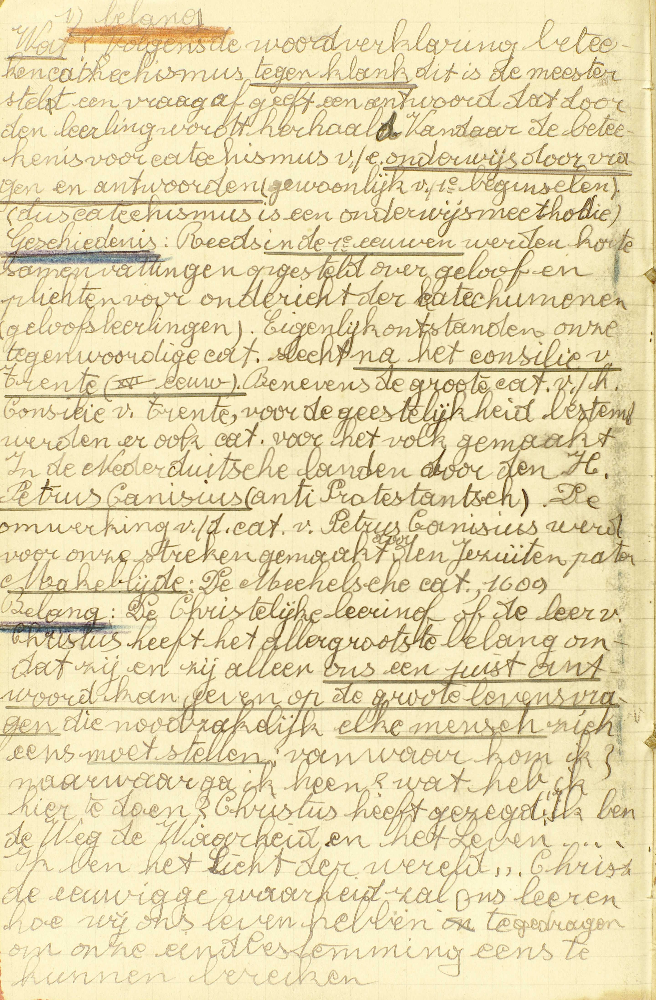
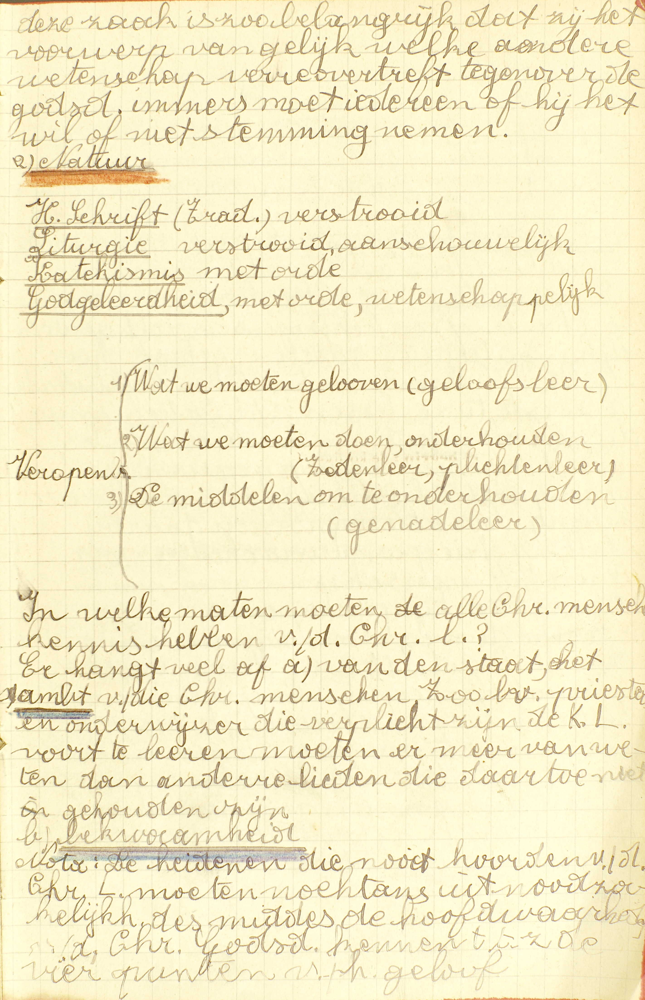
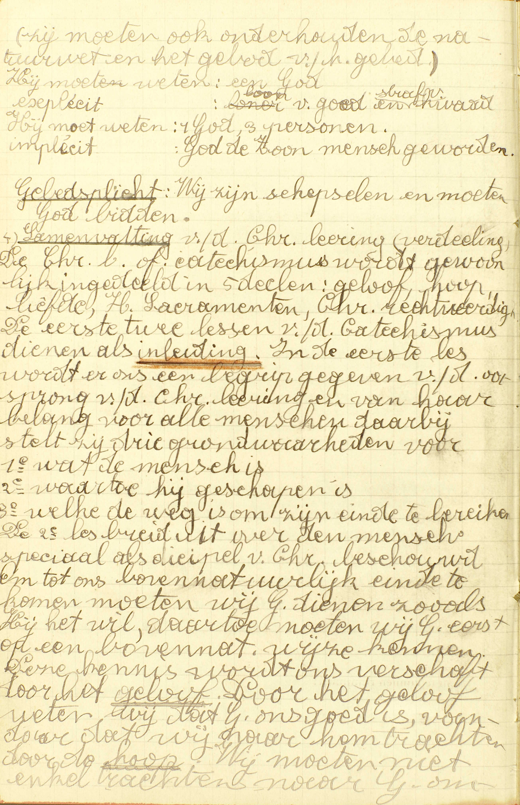
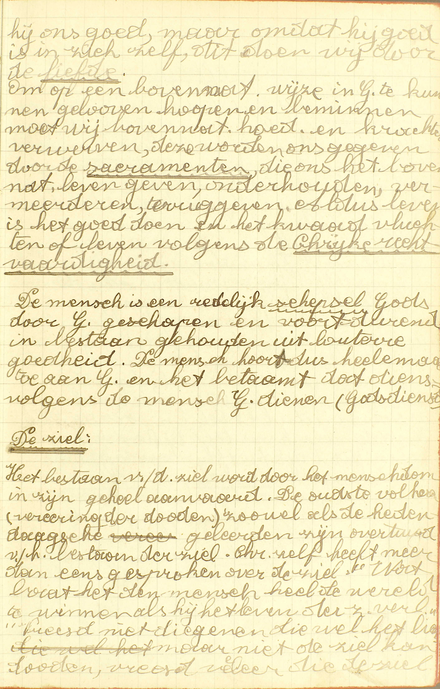
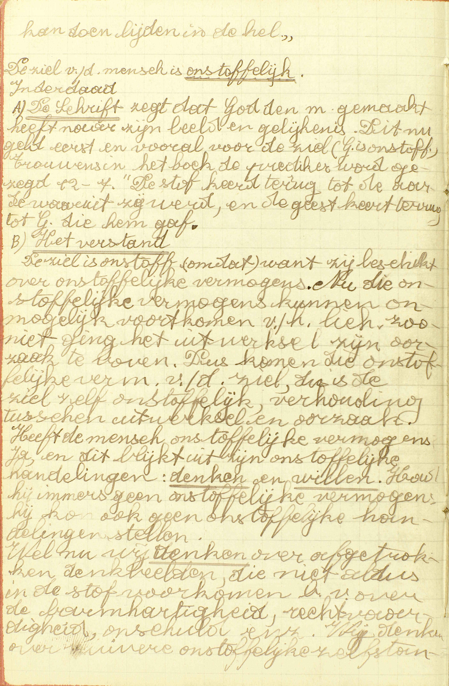
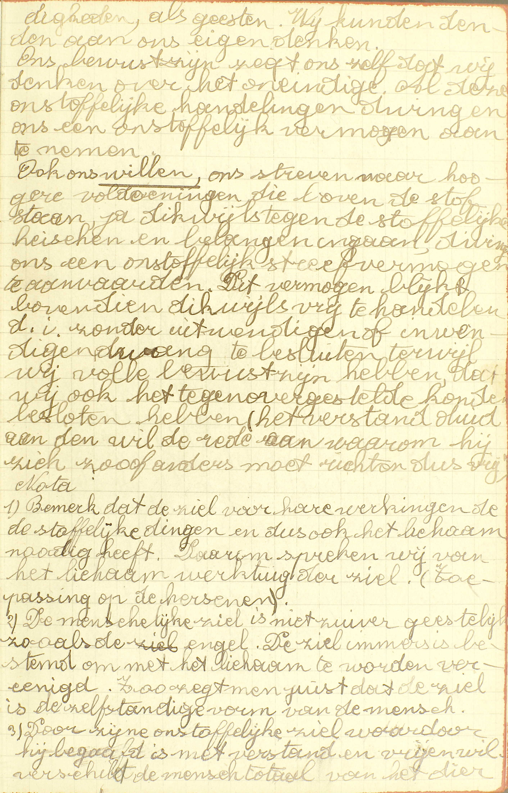
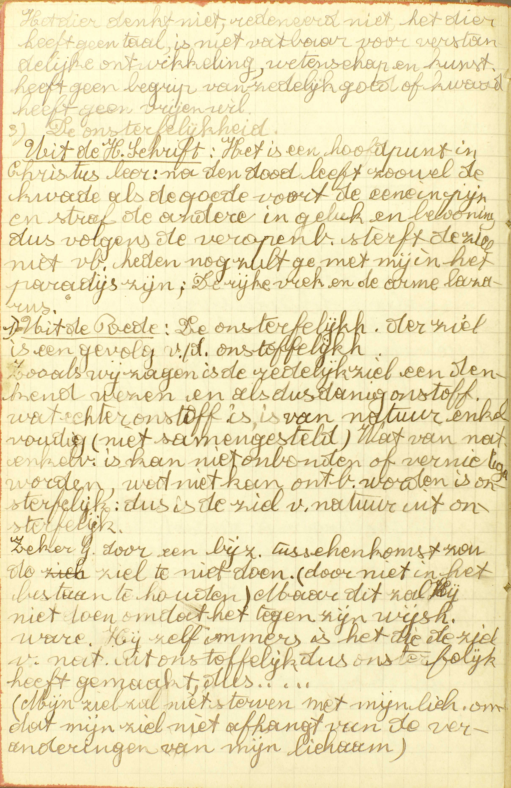
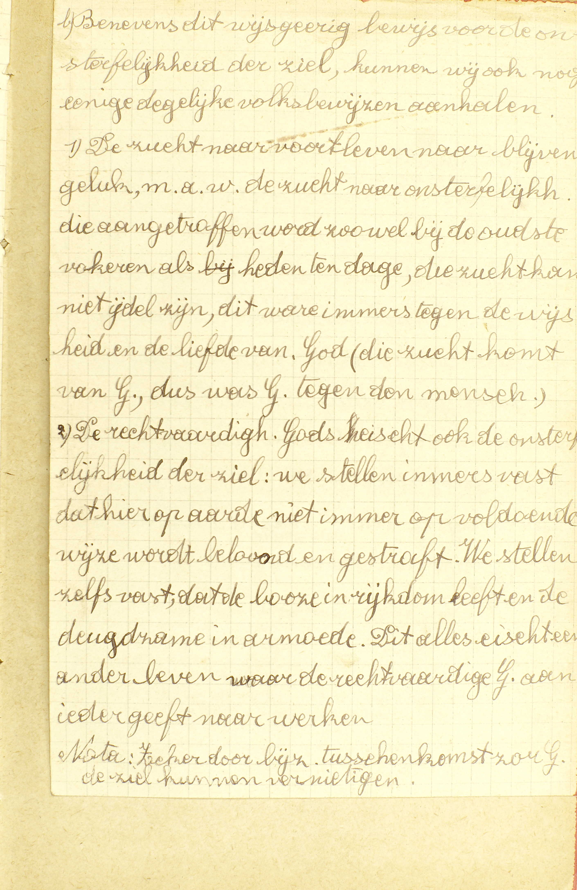
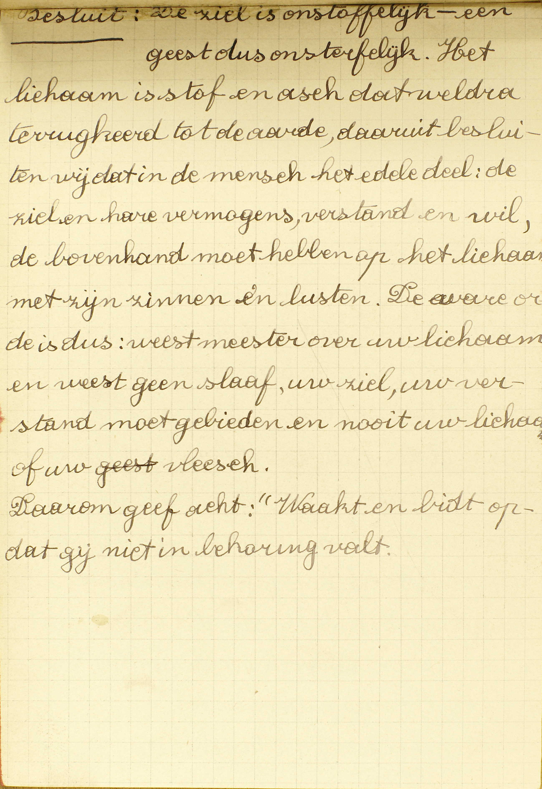
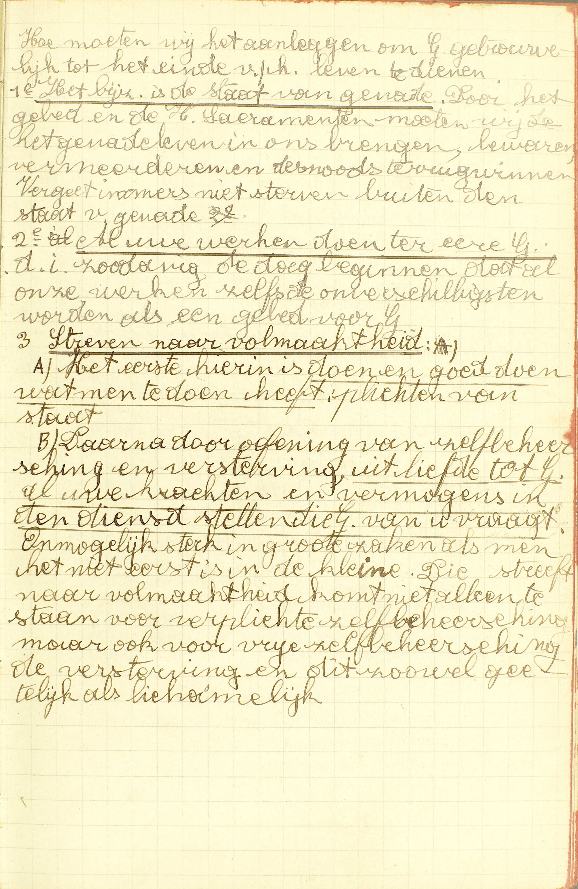

<table>
<tr>
  <td rowspan=4>**De Christelijke Leer**</td>
  <td rowspan=4 class=accolade></td>
  <td>Haar belang</td>
  <td>*[Welke is de allerzaligste leer onder alle wetendheden van de wereld?](#welke-is-de-allerzaligste-leer-onder-alle-wetendheden-van-de-wereld)*</td>
</tr>
<tr>
  <td>Haar natuur</td>
  <td>*[Wat heet gij de Christelijke Leer?](#wat-heet-gij-de-christelijke-leer)*</td>
</tr>
<tr>
  <td>Haar eerste verkondigers</td>
  <td>*[Wie heeft de Christelijke Leer eerst in de wereld gebracht?](#wie-heeft-de-christelijke-leer-eerst-in-de-wereld-gebracht)*</td>
</tr>
<tr>
  <td>Haar verdeling</td>
  <td>*[Hoeveel delen zijn er van de Christelijke Leer?](#hoeveel-delen-zijn-er-van-de-christelijke-leer)*</td>
</tr>
<tr>
  <td rowspan=3>**De mens**</td>
  <td rowspan=3 class=accolade></td>
  <td>Zijn natuur</td>
  <td>*[Wat is de mens?](#wat-is-de-mens)*</td>
</tr>
<tr>
  <td>Zijn einde</td>
  <td>*[Tot wat einde is de mens geschapen?](#tot-wat-einde-is-de-mens-geschapen)*</td>
</tr>
<tr>
  <td>Zijn plichten t.o.v. dat einde</td>
  <td>*[Wat is de mens van node om tot zijn einde de komen?](#wat-is-de-mens-van-node-om-tot-zijn-einde-de-komen)*</td>
</tr>
</table>
 
# Welke is de allerzaligste leer onder alle wetendheden van de wereld?

## De Christelijke Leer of de Catechismus

  
  
  
  
  
  
  
  
  
  

V. **Allerzaligste**, dat is, meest dienstig tot het bekomen van het eeuwig geluk; want in godsdienstige zaken verstaan wij door Zaligheid het eeuwig geluk. – **Wetendheden**, d.i. kennissen.

A. De allerzaligste onder alle wetendheden van de wereld is **de Christelijke Leer:** de leer voortkomende van Christus, de tweede persoon van de H. Drievuldigheid, voor ons mens geworden, — **of de Catechismus:** dit woord betekent uit zich zelf niets anders dan leer, maar is algemeen aangenomen om de uitmuntendste aller leren, namelijk, de *Christelijke Leer* aan te duiden.

Aangezien de Christelijke Leer onder al de wetendheden van de wereld de belangrijkste en de voordeeligste is om ons tot de zaligheid te brengen, zo moeten wij ook meer ijveren zorg hebben om de Catechismus, dan om alle andere wetenschappen aan te leren.

# Wat heet gij de Christelijke Leer?

## Het kort begrip van hetgene dat Christus geleerd heeft, en alle Christenen moeten weten of doen om zalig te worden

A. **Het kort begrip:** de bondige inhoud, de bondige verzameling **van hetgene dat Christus geleerd heeft:** van geheel de Openbaring (zie [3ᵉ les, 1ᵉ v.](les-03.html#wat-is-het-geloof)), die de tweede persoon van de H. Drievuldigheid, voor ons mens geworden, in Gods naam aan het mensdom is komen doen. Die Openbaring leert ons hetgene **alle Christenen moeten weten of doen om zalig te worden.**

Men merke hier op: 1° dat niet enkel de *Christenen* verplicht zijn de Christelijke Leer te kennen: *alle* mensen moeten, na de prediking van Christus’ Openbaring gehoord te hebben, Christenen worden, en zó zijn *allen* gehouden de Christelijke Leer te kennen; 2° dat de Catechismus zegt; weten *of* doen, en niet, weten *en* doen, omdat er eenige punten zijn die wij enkel moeten *weten,* b.v.‚ *dat er maar één God is en drie goddelijke personen,* en andere, zoals *eert vader en moeder* die wij moeten *weten* en ook *doen.*

# Wie heeft de Christelijke Leer eerst in de wereld gebracht?

## A. Christus zelf heeft deze eerst geleerd, en de Apostelen hebben ze alom verkondigd

A. **Christus zelf heeft deze eerst geleerd**: eerst zijn leer gepredikt, en dan in Palestina, het land van de Joden, omdat het joodse volk, van Abraham’s roep af‚ bestemd was, om zijn komst te bereiden. Hij heeft de goddelijkheid van zijn zending bewezen door menigvuldige voorzeggingen en mirakelen, in het bijzonder door de voorzegging en het mirakel van zijn verrijzenis. De mirakelen en de voorzeggingen, aangezien zij slechts door Gods bijzondere hulp kunnen gedaan worden, zijn noodzakelijk onwederlegbare bewijzen, dat de veropenbaring, voor dewelke zij gedaan worden, wezenlijk van God komt. **En de Apostelen hebben ze alom verkondigd**: *Apostel* wil eigenlijk zeggen *zendeling*, en onder de naam van Apostel verstaat men hier de twaalf geloofszendelingen door Christus gekozen, ook de H. Mathias: in de plaats van Judas aangesteld, en de H. Paulus later, op een buitengewone wijze tot het apostelschap geroepen. Deze hebben dus, na Christus, zijn leer gepredikt, en dat niet uitsluitend in het land van de joden, maar alom, d.i., overal, geheel de wereld dóór.

# Hoeveel delen zijn er van de Christelijke Leer? 

## Vijf principale, te weten: het eerste, sprekende van het Geloof; het tweede, van de Hoop; het derde, van de Liefde; het vierde, van de Zeven Sacramenten; het vijfde, van de Christelijke Rechtvaardigheid

A. Van de **vijf principale** of voorname delen van de Christelijke Leer spreekt dus: 

**Het eerste, van het Geloof:** van onze plicht van Christus’ leer door het *Geloof* aan te nemen, en van de waarheden welke die leer bevat;

**Het tweede, van de Hoop:** van onze plicht van te *verzoeken*, en te *verwachten* de hulp en het loon, die Christus beloofd heeft aan degenen die, volgens zijn leer, God willen dienen;

**Het derde, van de Liefde:** van de manier waarop wij volgens Christus’ leer, God moeten *beminnen*, en van hetgeen wij moeten doen of laten om Hem te beminnen;

**Het vierde, van de Zeven Sacramenten:** van de zeven uitwendige middelen die door Christus ingesteld zijn, en ons de hoedanigheden en krachten verschaffen om, gelijk God het vraagt, niet enkel als redelijke schepselen, maar als aangenomen kinderen Gods, in Hem te kunnen geloven, op Hem te kunnen hopen, en Hem te kunnen beminnen;

**Het vijfde, van de Christelijke Rechtvaardigheid:** van de staat dergenen die geloven, hopen, beminnen en de HH. Sacramenten ontvangen, gelijk Christus’ leer dat voorschrijft: *Christelijke Rechtvaardigheid* betekent immers die staat, waarin de mens, volgens Christus’ leer, juist zó is gelijk God het wil.

Deze vijf delen zijn zeer natuurlijk met elkander verbonden: immers, om God te dienen, moet men vooreerst Hem kennen, en, om Hem te kennen, moet men, ingeval dat hij een Openbaring gedaan heeft, in Hem geloven; ten tweede, hulp en loon van Hem hopen, want, zonder die hoop, zou men Hem niet kunnen dienen; ten derde, Hem beminnen of metterdaad willen dienen: ten vierde, die hoedanigheden en krachten aanwinnen, die tot zijn dienst vereist zijn; ten vijfde, een goed gedacht hebben van geheel die staat, waarin men God trouw dient, te weten, van de Christelijke Rechtvaardigheid.

# Wat is de mens?

## Een redelijk schepsel Gods, hebbende een onsterfelijke ziel en een sterfelijk lichaam

A. De mens is **een schepsel Gods:** een wezen door God van niet gemaakt; een *redelijk* schepsel Gods: een schepsel Gods met rede en verstand begaafd, en hierdoor overtreft de mens al de andere soorten van aardsche schepselen: de levenlooze dingen, die uitsluitend *zijn;* de planten, die *zijn* en *leven;* en de dieren, die *zijn,* *leven* en *gevoelen;* **hebbende een onsterfelijke ziel en een sterfelijk lichaam:** de mens dus bestaat uit twee delen: 1° uit een onsterfelijke ziel en 2° uit een sterfelijk lichaam.

De *ziel* is een geest en is bijgevolg onzichtbaar: ’t is door haar dat wij verstaan en willen. Zij is *onsterfelijk,* d. ì. zij zal nooit sterven, noch als het lichaam de dood ondergaat, noch later.

Het *lichaam* is het stoffelijk en zichtbaar deel van de mens, dat met de vijf zintuigen begaafd is. Het is *sterfelijk* d.i. het zal door de dood ontbonden en van de ziel gescheiden worden.

# Tot wat einde is de mens geschapen?

## Om in dit leven God te dienen, en namaals eeuwig Hem te aanschouwen

V. De zin is: waartoe is de mens door God, die hem geschapen heeft, bestemd?

A. De Catechismus duidt hem een *dubbel* einde aan:

1° **In dit leven** is zijn einde **God te dienen:** de wil Gods te volbrengen met het goed te doen en het kwaad te vluchten. 

2° **namaals**, d.i. na dit leven, is zijn einde **God eeuwig te aanschouwen:** de goddelijke natuur aanschijn aan aanschijn tot in van de eeuwigheid te zien, wat een zo verhevene zaak is, dat daarin het geluk van God zelf bestaat.

# Wat is de mens van node om tot zijn einde de komen?

## Dat hij God kenne, God beminne en trouw tot het einde van zijn levens diene

A. Dus om in dit leven God te dienen en Hem namaals eeuwig te mogen aanschouwen moet de mens:

1° **God kennen:** weten, met Christus’ leer door het Geloof aan te nemen, hetgeen God nopens Zich zelf en nopens de dienst die Hij van ons vraagt, geopenbaard heeft; 

2° **God beminnen:** God goed willen en bijgevolg al zijn geboden zoeken te onderhouden;

3° **Hem trouw tot het einde van zijn levens dienen:** Gods geboden geheel het leven dóór tot het ogenblik van de dood metterdaad onderhouden

### Aanmerking

Dat Christus ons waarlijk gesproken heeft *in Gods naam* rust op de volgende onwederlegbare redenen:

Niemand, kan loochenen dat een Zaligmaker, van God gezonden, meermaals voorzegd is geweest gedurende geheel het tijdstip, tussen de val van Adam en Christus’ komst verloopen; en Christus zelf heeft, tot bevestiging van zijn zending, veel voorzeggingen gedaan. De boeken liggen daar, en niemand kan ze meer loochenen dan de zon, of de maan, die wij vóór ogen zien. Welnu, al die voorzeggingen zijn vervuld in Christus en in zijn Kerk die sedert bijna 19 eeuwen bestaat. Kan er een klaarder bewijs van Christus’ goddelijke zending uitgedacht worden? (Zie H. Geschiedenis.) 

Daarenboven heeft Christus in zijn leven tot bevestiging van zijn zending gedurig allerhande mirakelen gedaan: ziekten van alle slag genas Hij met een woord, Hij veranderde de natuur van de zaken, gebood aan de boze geesten, deed de doden opstaan, en verrees zelf uit het graf. Hij stelde een Kerk in, haar belovende dat zij tot het einde van de eeuwen zou bestaan, en haar heerschappij tot alle natiën en landen uitstrekken; en wij zien die Kerk sedert 19 eeuwen altijd staan, terwijl alles in de wereld gedurig valt; wij zien ze zich altijd uitstrekken, terwijl alles op aarde zich verdeelt; wij zien ze altijd heilig, terwijl in aardsche zaken en instellingen alles bederft; wij zien ze altijd dezelfde terwijl op aarde alles verandert. Is er wel een groter en voor alle ogen klaarblijkender mirakel dan die Kerk?

Voorzeggingen en mirakelen kunnen door God alleen gedaan worden; en bijgevolg wanneer zij geschieden tot bevestiging van een leer of zending, zijn zij er een onwederleghaar bewijs van. Christus’ leer dus, door al die voorzeggingen en mirakelen, die zich van 't begin van de wereld tot heden toe uitstrekken, bevestigd, is ten klaarste als Gods leer bewezen.

### VRAGEN

Welke zijn de hoofdpunten van deze les? — Wat onderzoekt de Catechismus nopens ieder van die punten?

1. Wat betekent het woord *allerzaligste?* — Waarom? — Wat betekenen de woorden *Christelijke Leer* en *Catechismus?* — Wat besluit moeten wij trekken uit de kennis van de belangrijkheid van de Christelijke Leer?

2. Is de Catechismus een breedvoerige leer? — Waarvan is hij een kort begrip? — Wat leert ons in 't algemeen de Openbaring door Christus gedaan? — Moeten de Christenen alleen die Openbaring kennen? — Waarom zegt de Catechismus: *weten of doen*, en niet: *weten en doen?*

3. Waar heeft Christus zijn leer gepredikt; hoe heeft Hij die bevestigd? — Waarom heeft Hij tot zijn prediking het land van de Joden verkozen? — Door wie en waar is de Christelijke Leer na Christus gepredikt geweest? — Wie zijn de Apostelen?

4. Waarvan spreekt het 1ᵉ, het 2ᵉ, het 3ᵉ, het 4ᵉ en het 5ᵉ deel van de Catechismus? — Geef over ’t onderwerp van elk deel een korte verklaring. — Hoe zijn die vijf delen met elkander verbonden?

5. Welken oorsprong heeft de mens? — Welk schepsel Gods is hij? — Welke andere soorten van schepselen overtreft de mens door zijn rede? — Uit welke delen bestaat de mens? — Wat is de ziel en wat doen wij door haar? — Wat betekent hier het woord *onsterfelijk?* — Welke zijn de hoedanigheden van het menselijk lichaam? — Wat drukt de Catechismus uit als hij zegt dat het lichaam *sterfelijk* is?

6. Welk is de zin van de vraag: *tot wat einde is de mens geschapen?* — Welk is het einde van de mens *in dit leven?* — Welk is zijn einde *na dit leven?* — Wat is *God aanschouwen*, en hoe groot is dit geluk?

7. Hoeveel dingen zijn er vereist opdat de mens God hier in dit leven diene, en naraals eeuwig moge aanschouwen? — Wat betekenen de woorden: *dat hij God kenne?* — Wat is *God beminnen?* — Wat is *God trouw tot het einde van zijn levens dienen?*
