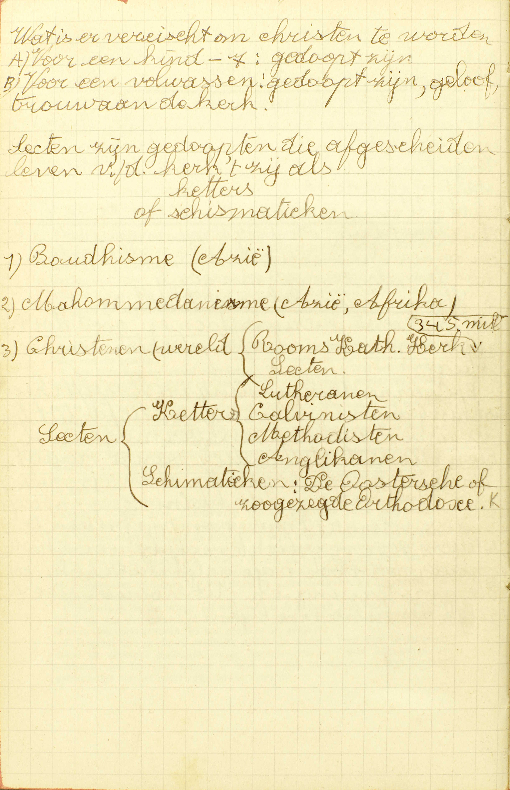
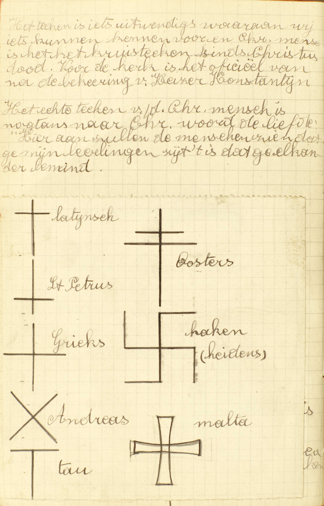
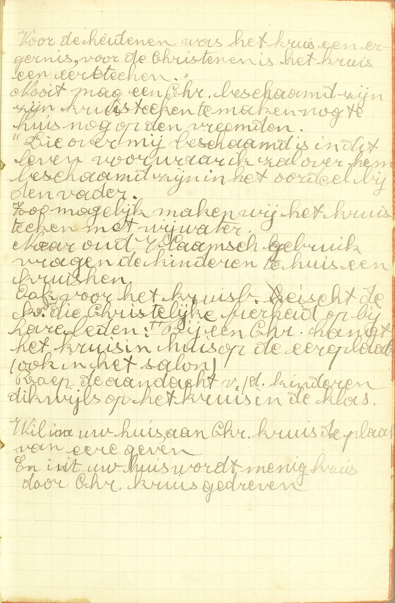

<table>
<tr>
  <td rowspan=3>**De Christen**</td>
  <td rowspan=3 class=accolade></td>
  <td colspan=3>De vereisten om Christen te zijn</td>
  <td>*[Wat is een Christen mens?](#wat-is-een-christen-mens)*</td>
</tr>
<tr>
  <td colspan=3>Wat een Christen te doen staat</td>
  <td>*[Wat betaamt een Christen mens?](#wat-betaamt-een-christen-mens)*</td>
</tr>
<tr>
  <td colspan=3>Waaraan men een Christen kan herkennen</td>
  <td>*[Welk is het teken van een Christen mens?](#welk-is-het-teken-van-een-christen-mens)*</td>
</tr>
<tr>
  <td rowspan=7>**Het Kruisteken**</td>
  <td rowspan=7 class=accolade></td>
  <td colspan=3>De manieren van het te maken</td>
  <td>*[Hoe maakt men het teken van het Heilig Kruis?](#hoe-maakt-men-het-teken-van-het-heilig-kruis)*</td>
</tr>
<tr>
  <td colspan=3>De woorden die men in dit teken gebruikt</td>
  <td>*[Wat zegt gij makende het teken van het Heilig Kruis?](#wat-zegt-gij-makende-het-teken-van-het-heilig-kruis)*</td>
</tr>
<tr>
  <td rowspan=2>De bepaalde betekenis van dit teken</td>
  <td rowspan=2>*[Wat betekenen wij door het maken vas het Heilig Kruis?](#wat-betekenen-wij-door-het-maken-vas-het-heilig-kruis)*</td>
  <td rowspan=2 class=accolade></td>
  <td>*[Hoe betekenen wij de Heilige Drievuldigheid in het maken van het Heilig Kruis?](#hoe-betekenen-wij-de-heilige-drievuldigheid-in-het-maken-van-het-heilig-kruis)*</td>
</tr>
<tr>
  <td>*[Hoe belijden wij door het maken van het Heilig Kruis de Menswording van Christus?](#hoe-belijden-wij-door-het-maken-van-het-heilig-kruis-de-menswording-van-christus)*</td>
</tr>
<tr>
  <td colspan=3>De oorsprong van dit teken</td>
  <td>*[Van wie hebben de Christenen dit teken?](#van-wie-hebben-de-christenen-dit-teken)*</td>
</tr>
<tr>
  <td colspan=3>De omstandigheden waarin wij het meest behoren te maken</td>
  <td>*[Wanneer behoort men meest het Kruisteken te maken?](#wanneer-behoort-men-meest-het-kruisteken-te-maken)*</td>
</tr>
<tr>
  <td colspan=3>Het profijt van dit teken</td>
  <td>*[Wat profijt krijgen wij door het maken van het Heilig Kruis?](#wat-profijt-krijgen-wij-door-het-maken-van-het-heilig-kruis)*</td>
</tr>
</table>

# Wat is een Christen mens?

## Een discipel van Jezus Christus, die, gedoopt zijnde, gelooft en belijdt de zalige wet van Christus in de waarachtige Kerk tegen alle sekten

  
  <em>Sekten zijn gedoopten die afgescheiden leven van de kerk, 't zij als ketters of schismatieken.</em>

A. Een Christen mens is **een discipel:** een leerling, een navolger van Jezus Christus, die ons komen leren is al wat wij moeten weten of doen om zalig te worden: vandaar de naam van **Christenen**, die Christus’ discipelen eerst in Antiochië, weinige tijd na zijn hemelvaart, gekregen hebben.

Om Christus’ discipel of om Christen te wezen, zijn er drie dingen vereist:

1° **Dat men gedoopt zij:** het Sacrament van het Doopsel ontvangen hebbe, dat, volgens Christus’ instelling de deur en de ingang is van geheel het christelijk leven;

2° **Dat men geloove:** op Gods getuigenis voor waar aanneme, **en belijde:** uitwendig bekenne te geloven **de zalige wet van Christus**: de leer van Christus, die tot de eeuwige zaligheid geleidt, en wet genoemd wordt, omdat zij vele wetten bevat;

3° Dat men de zalige wet van Christus geloove en belijde **in de waarachtige Kerk tegen alle sekten:** deelmakende van die vergadering van gelovigen, welke door Christus ingesteld is, te weten, de *Rooms-Katholieke Kerk*, en afgescheiden zijnde van al de vals kerken, zoals de Protestantse kerkgemeenten, de Anglikaanse kerk, enz. die *sekten* genoemd worden.

De noodzakelijkheid van deze drie vereisten vloeit uit de natuur van de zaak zelve: niemand kan immers Christus’ discipel zijn zonder het Doopsel ontvangen te hebben, daar Christus dit Sacrament heeft ingesteld als de deur en de ingang van het leven, dat Hij kwam voorschrijven; noch zonder zijn leer te geloven en te belijden, vermits de discipel van een goddelijken meester diens leer noodzakelijk in- en uitwendig moet aannemen; noch zonder lid te wezen van de waarachtige Kerk en afgescheiden te zijn van alle sekten, aangezien de Kerk, en zij alleen, ons in Christus’ naam onderwijst en bestuurt,

# Wat betaamt een Christen mens?

## Dat hij de geboden van Christus onderhoude en zijn leven schikke naar de leer van Christus

V. Hier wordt gevraagd wat een Christen mens te doen staat om als zulke te leven.

A. Twee dingen staan hem te doen:

1° **De geboden van Christus onderhouden:** volbrengen al hetgeen Christus *op zonde* bevolen heeft;

2° **Zijn leven schikken**, voor zoveel het volgens de omstandigheden mogelijk is, **naar de leer van Christus:** naar hetgeen Christus, zonder het op zonde te bevelen nochtans ten opzichte van menigvuldige punten heeft aangeprezen en aangeraden.

Het eerste moet de Christen mens op zonde doen; het tweede, uitsluitend om tot de volmaaktheid te komen. Bijgevolg is de Christen, die de geboden niet onderhoudt, een *slechte* Christen; die wel de geboden, maar niet, gelijk hij het zou kunnen doen, de raden volgt, een *goede* maar *onvolmaakte* Christen; die niet alleen de geboden, maar ook volgens zijn vermogen, de raden volbrengt, een *volmaakt* Christen. Om volmaakt te wezen moet een dienaar niet uitsluitend de geboden, maar ook nog de raden van zijn meester volgen.

# Welk is het teken van een Christen mens?

## Het teken van het Heilig Kruis

  
  <em>Het teken is iets uitwendigs waaraan wij iets kunnen kennen. Voor een christen mens is dit het kruisteken sinds Christus' dood. Voor de kerk is het officieel van na de bekering van keizer Konstantijn. Het echte teken van de Christen mens is nochtans naar Christus' woord de liefde: "Hieraan zullen de mensen zien dat ge mijn leerlingen zijt: 't is dat ge elkaar bemint."</em>

V. Een *teken* is iets dat ons tot de kennis brengt van een andere zaak: zo is het kniebuigen een teken, vermits het ons de inwendigen eerbied van het hart te kennen geeft.

A. **Het teken van het Heilig Kruis:** de afbeelding van het kruis, waar Christus op gestorven is. Christus heeft ons door zijn dood op het kruis verlost en ons de Hemel geopend, en zo is de afbeelding van zijn kruis het natuurlijk teken van ons geloof in zijn verlossingswerk.

Er zijn vele andere tekenen, waar wij aan zien, dat iemand Christen is; maar het Kruisteken is het algemeenste en allerduidelijkste.

# Hoe maakt men het teken van het Heilig Kruis?

## Ten eerste, met de rechten duim op het ✠ voorhoofd, de ✠ mond en de ✠ borst: of met twee vingeren, of met de hele rechterhand, die stellende eerst op het voorhoofd, daarna op de borst, ten derde, die trekkende van de linkerzijde tot de rechterzijde

A. Er zijn dus *twee* manieren om het Kruisteken te maken.

**Ten eerste, met de rechten duim** drie kleine Kruistekens te maken, één **op het voorhoofd**, één **op de mond** en één **op de borst**: deze manier wordt algemeen gebruikt aan de beide evangeliën van de H. Mis.

**Ten tweede, met twee vingeren** van de rechterhand, **of met de hele rechterhand** één groot Kruisteken te maken, de hand trekkende **van het voorhoofd tot de borst** en daarna **van de linkerzijde tot de rechterzijde.**

# Wat zegt gij makende het teken van het Heilig Kruis?

## Ik zeg: *In de naam van de Vader, en van de Zoon en van de Heilige Geest, Amen*

A. De zin van de woorden die men, bij het maken van het Kruisteken uitspreekt, is de volgende: *ik maak dit teken ter ere en aanroeping van God de Vader, van God de Zoon en van God de H. Geest.* Inderdaad, als ik zeg: in de naam van de Vader, en van de Zoon en van de H. Geest, dan moet daarbij verstaan worden: *ik maak dit teken,* daar de woorden, die men hier uitspreekt, ongetwijfeld tot verklaring van het trekken van de hand dienen. Dan het woord *naam* wijst hier op de goddelijke natuur of God zelf met al zijn volmaaktheden, en iets doen in de naam van God is dat doen óf op Gods bevel óf ter ere en aanroeping van God; hier nu is voorzeker geen spraak van het Kruisteken te maken op Gods bevel. Blijft het woord *Amen*, dat op het einde een zinsnede altijd wil zeggen: *dat het zo geschiede, dat het zo weze.*

# Wat betekenen wij door het maken vas het Heilig Kruis?

## Twee grote mysteriën van ons Geloof, te weten van de Heilige Drievuldigheid en van de Menswording van Christus

V. Het Kruisteken drukt in 't algemeen uit, dat degenen die het gebruiken, Christenen zijn; hier leren wij, wat het specifiek betekent.

A. Door het H. Kruis betekenen wij **twee grote mysteriën van ons Geloof:** van Christus’ leer, die wij door het Geloof aannemen en die daarom *Geloof* genoemd wordt.

Die mysteriën zijn:

1° **De Heilige Drievuldigheid** bestaande uit één goddelijke natuur en drie goddelijke personen, welke die één goddelijke natuur hebben.

2° **De Menswording van Christus:** het werk waardoor God de Zoon voor ons is mens geworden, of de menselijke natuur heeft aangenomen, en als mens, ons van de slavernij van de duivel verlost heeft.

De Catechismus heet de H. Drievuldigheid en de Menswording van Christus terecht a) twee *mysteriën* ; het zijn immers twee waarheden die noch mens nog engel uit zijn natuurlijke krachten ontdekken, noch zelfs, nu zij door God geopenbaard zijn, begrijpen kan; b) twee *grote* mysteriën, want het eerste is het grootste, het waardigste en de oorsprong van al de andere mysteriën, en het tweede is het hoofdpunt van al de geloofswaarheden, die op onze verlossing betrekking hebben.

# Hoe betekenen wij de Heilige Drievuldigheid in het maken van het Heilig Kruis?

## Zeggende *in de naam,* en niet *in de namen,* belijden wij één God; daarbij voegende van de Vader, en van de Zoon en van de Heilige Geest, belijden wij drie verscheidene personen in de Godheid

A. Het *eerste deel* van het mysterie van de H. Drievuldigheid, te weten, *dat er maar één goddelijk wezen of natuur is,* wordt betekend door het woord **naam**, dat hier de goddelijke natuur uitdrukt, en in ’t enkelvoud staande, van de ene goddelijke natuur te verstaan is.

Het *tweede deel,* te weten, *dat er drie goddelijke personen zijn,* die samen dat één goddelijke wezen of natuur hebben, wordt aangeduid door de woorden **van de Vader, en van de Zoon en van de Heilige Geest,** aangezien daarmee de ene goddelijke natuur aan die drie verscheidene personen wordt toegeschreven,

# Hoe belijden wij door het maken van het Heilig Kruis de Menswording van Christus?

## Trekkende onze hand van het voorhoofd tot de borst, belijden wij dat Christus mens geworden is in het maagdelijk lichaam van Maria; en die trekkende van de linkerzijde tot de rechterzijde, betekenen wij dat Christus ons door zijn Kruis overgezet heeft van de maledictie tot de benedictie

A. Het *eerste deel* van het mysterie van de Menswording, te weten, *dat God de Zoon de menselijke natuur heeft aangenomen,* betekenen wij **met de hand van het voorhoofd tot de borst te trekken;** en waarlijk, die beweging *van de hand van bover naar onder* dient allerbest om de *nederdaling* van God de Zoon, in zijn Menswording, uit te drukken.

Het *tweede deel,* te weten, onze verlossing uit de slavernij van de duivel, wordt betekend **door het trekken van de hand van de linkerzijde tot de rechterzijde,** daar de linkse kant, gewoonlijk voor minderwaardig gehouden dan de rechtse, in de H. Schrift doorgaans de **maledictie,** d.i. de staat van vervloeking, van zonde en van slavernij van de duivel, en de rechterkant de **benedictie,** d.i. de staat van zegening, van rechtvaardigheid of vriendschap met God voorstelt.

# Van wie hebben de Christenen dit teken?

## Van onze voorvaders tot de Apostelen toe; ja van Christus zelf, die door het Kruis de wereld verlost heeft

  
  <em>Voor de heidenen was het kruis een ergernis, voor de christenen is het kruis een ereteken. Nooit mag een christen beschaamd zijn zijn kruisteken te maken, noch thuis, noch op de vreemde. "Die over mij beschaamd is in dit leven, voorwaar ik zal over hem beschaamd zijn in het oordeel bij de Vader." Zo mogelijk maken wij het kruisteken met wijwater. Naar oud Vlaams gebruik vragen de kinderen thuis een kruiske. Ook voor het kruisbeeld eist de kerk die christelijke fierheid op bij haar leden: bij een christen hangt het kruis in huis op de ereplaats (ook in het salon). Roep de aandacht van de kinderen dikwijls op het kruis in de klas. Wil in uw huis aan Christus' kruis de plaats van eer geven, en uit uw huis wordt menig kruis door Christus gedreven.</em>

A. Wij hebben het Kruisteken **van onze voorvaders tot de Apostelen toe:** wij vinden het bij al de Christenen van de voorgaande eeuwen tot aan de tijd toe van de Apostelen, die, na Christus, het Geloof alom verkondigd hebben. Het komt ons van hoger nog, **ja van Christus zelf, die door het Kruis de wereld verlost heeft:** die, door zijn dood op het kruis de wereld van de slavernij van de duivel vrijgekocht, en zo het kruis tot het natuurlijk teken van zijn discipelen achtergelaten heeft.

# Wanneer behoort men meest het Kruisteken te maken?

## Vóór het opstaan, eten, slapen gaan en alle andere werken; maar meest als men enige kwelling of bekoring heeft of gevoelt

A. Wij behoren dus het Kruisteken te maken in twee soorten van gevallen:

1° **Vóór het opstaan, eten, slapen gaan en alle andere werken:** in ’t begin van al onze werken, waaronder de Catechismus het opstaan, eten en slapen gaan noemt, omâat die werken, onder alle andere, een bijzondere plaats bekleden, en, als zij wel gedaan worden, op geheel onze handelwijze een bijzonderen invloed hebben;

2° **Maar meest als men enige kwelling of bekoring heeft of gevoelt:** maar in het bijzonder als men pijn of smart heeft, zich in ziekte of gevaar bevindt; of, als men in- of uitwendig tot kwaad aangelokt wordt, omdat er dan bijzonder gevaar is van in zonde te vallen en men de zonde eerst en vooral te vluchten heeft.

# Wat profijt krijgen wij door het maken van het Heilig Kruis?

## Ten eerste, het Kruis dient ons tot een openbare belijdenis van ons Geloof; ten tweede, het Kruis iseen kort gebed tot God door het lijden en de verdiensten van Christus; ten derde, het Kruis jaagt van ons de duivel met al zijn bedrijf

A. Door het maken van het Kruisteken verkrijgen wij *drie* profijten:

**Ten eerste, het Kruis dient ons tot een openbare belijdenis van ons Geloof:** om uitwendig te bekennen, dat wij in Christus’ leer geloven; want wij drukken er door uit, dat wij Christenen zijn, en betekenen twee grote mysteriën van ons Geloof;

**Ten tweede, het Kruis is een kort gebed tot God door het lijden en de verdiensten van Christus:** het Kruis maakt een kort gebed uit, waarin wij, door Christus’ lijden en door zijn verdiensten in dat lijden verworven, allerhande gunsten van God vragen; want, met dat teken te gebruiken, geven wij te kennen, dat geheel onze hoop op Christus’ lijden en verdiensten steunt, en smeken zo de toepassing van dit lijden, van die verdiensten af;

**Ten derde, het Kruis jaagt van ons de duivel met al zijn bedrijf:** met al hetgeen hij doet om ons tot zonde te brengen. De reden van deze kracht is, dat het Kruis en de dood van Christus de bron zijn van alle zaligheid, en dat degenen, die zich met een waar Geloof tot die heilbron wenden, van de vijand van hun zaligheid bevrijd worden, gelijk de Joden, met de koperen slang van Mozes te aanschouwen, van hun ziekten genezen werden.

Behalve deze drie voordelen hekomen wij door het Kruisteken 50 *dagen aflaat,* telkens wij het maken met een rouwmoedig hart, en 100 *dagen,* als wij het zo maken met Wijwater.

Aanmerking.

De twee eerste lessen zijn als een inleiding tot de Christelijke Leer: zij doen ons deze kennen vooreerst in 't algemeen, stellen ons dan enige hoofdwaarheden voor nopens de *mens,* voor wie de Christelijke Leer bestemd is, en nopens de *Christen mens,* die deze Leer volgt. Nu gaat de Catechismus over tot het eerste van zijn vijf voorname delen, te weten, tot het Geloof.

### VRAGEN.

Welke zijn de hoofdpunten van deze les? — Wat wordt er in het bijzonder over ieder van deze hoofdpunten voorgesteld?

1. Wat betekent het woord *Christen* mens? — Wat betekent *discipel* van Jezus Christus? — Waar en wanneer hebben Christus' discipelen eerst de naam van Christenen ontvangen? — Hoeveel dingen zijn er vereist om Christen mens te zijn? — Noem ze met de woorden van de Catechismus. — Verklaar enigszins die vereisten. — Waaruit volgt het, dat die vereisten nodig zijn, opdat iemand Christen zou wezen?

2. Welk is de zin van de vraag: *wat betaamt een Christen mens?* — Hoeveel en welke dingen betamen er hem? — Leg die in’t kort uit. — Zeg hoe de Christen tot ieder van deze zaken verplicht is. — Wie zijn *slechte*, wie zijn *goede* doch *onvolmaakte,* wie *volmaakte* Christenen?

3. Wat verstaat men door een *teken?* — Wat noemt men het teken *van het H. Kruis?* — Wat drukt men dus uit als men zegt, dat het Kruis het teken is van een Christen mens? — Wat is het Kruisteken ten opzichte van de andere tekenen van een Christen mens?

4. Op hoeveel manieren maakt men het Kruisteken? — Welk deel van de hand gebruikt men, en hoe trekt men de hand in iedere manier?

5. Welke woorden spreekt men uit onder het maken van het H. Kruis? — Waartoe dienen die woorden? — Welken zin hebben zijl — Wat betekenen hier de woorden: *de naam Gods?* — Wat betekent het woord *Amen?*

6. Wat is een *mysterie?* — Wat wordt hier uitgedrukt door het woord *Geloof?* — Hoeveel en welke mysteriën van ons Geloof betekenen wij door het maken van het H. Kruis? — Waarin bestaan deze mysteriën? — Hoe zijn zij *grote* mysteriën?

7. Wat betekenen wij door de woorden van het Kruisteken? — Wat is er te betekenen om het mysterie van de H. Drievuldigheid uit te drukken? — Door welke woorden betekenen wij ieder van die punten, welke tot het mysterie van de H. Drievuldigheid behoren? — Hoe worden zij door die woorden betekend?

8. Wat betekenen wij door de gebaren in het Kruisteken? — Wat is er te betekenen om het mysterie van de Menswording uit te drukken? — Door welke gebaren wordt ieder van die punten betekend? — Hoe hebben die gebaren zulke betekenissen?

9. Is het Kruisteken in onze dagen ingesteld, of bestaat het reeds sedert lang? — Wat verstaat men in dit antwoord door voorvaders? — Sedert wanneer bestaat het Kruisteken in de H. Kerk?  — Welk is de eerste oorsprong van dit teken?

10. In hoeveel soorten van gevallen behoort men meest het Kruisteken te maken? — Waarom meldt hier de Catechismus op een bijzondere wijze: het *opstaan, eten, slapen gaan?* — Wat verstaat men door *kwelling* en *bekoring?* — Waarom moet men in het bijzonder het Kruisteken maken, als men *enige kwelling of bekoring heeft of gevoelt?*

1. Welk is het eerste, het tweede en derde profijt van het Kruisteken? — Waarin bestaat ieder van die profijten? — Hoe zijn zij allen aan het Kruisteken eigen?
