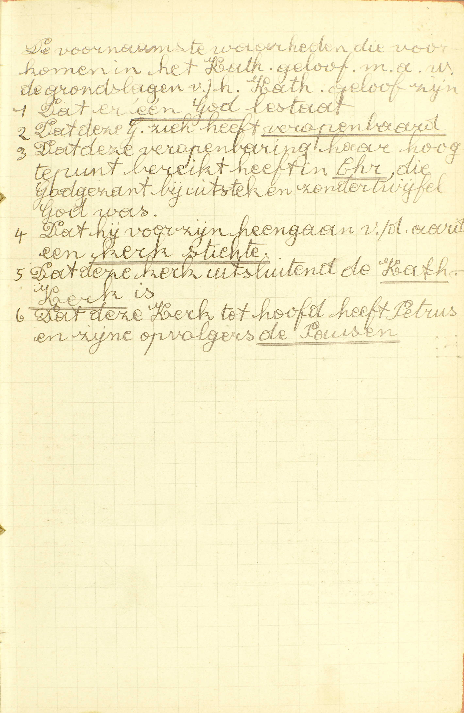
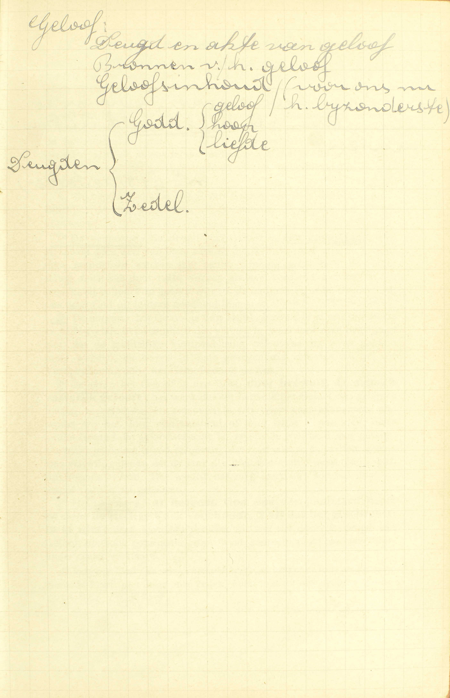
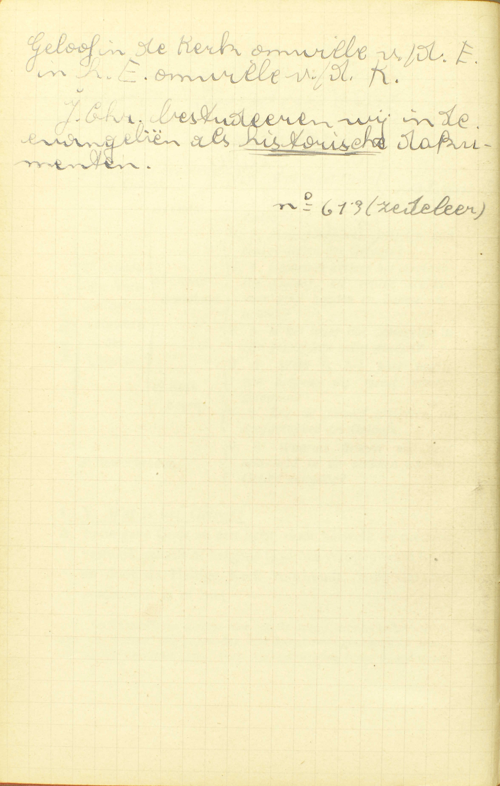
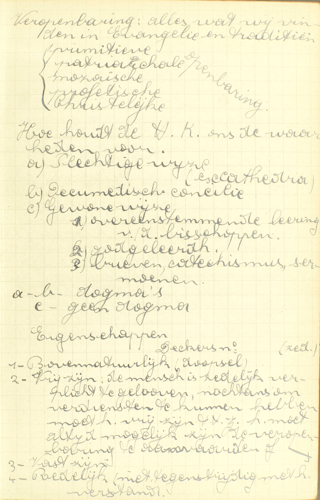
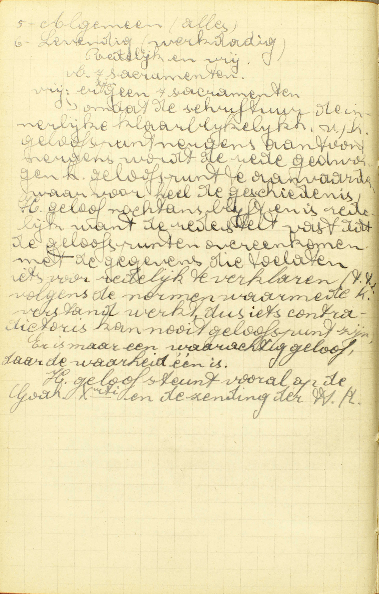
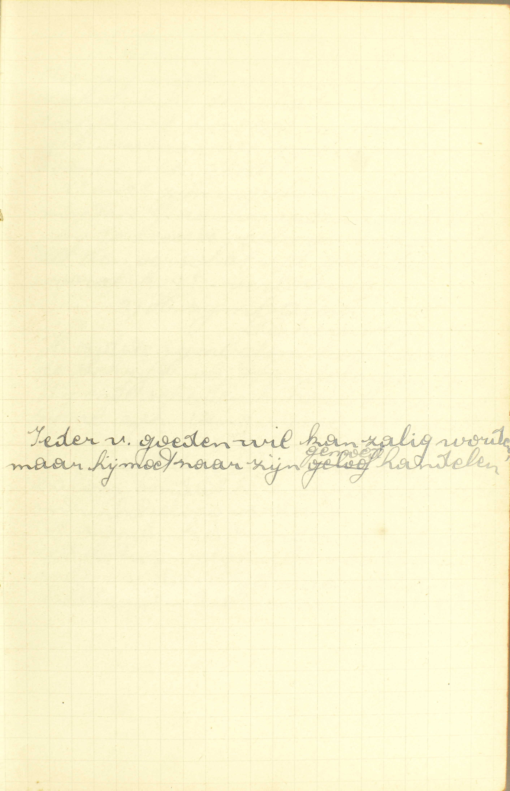
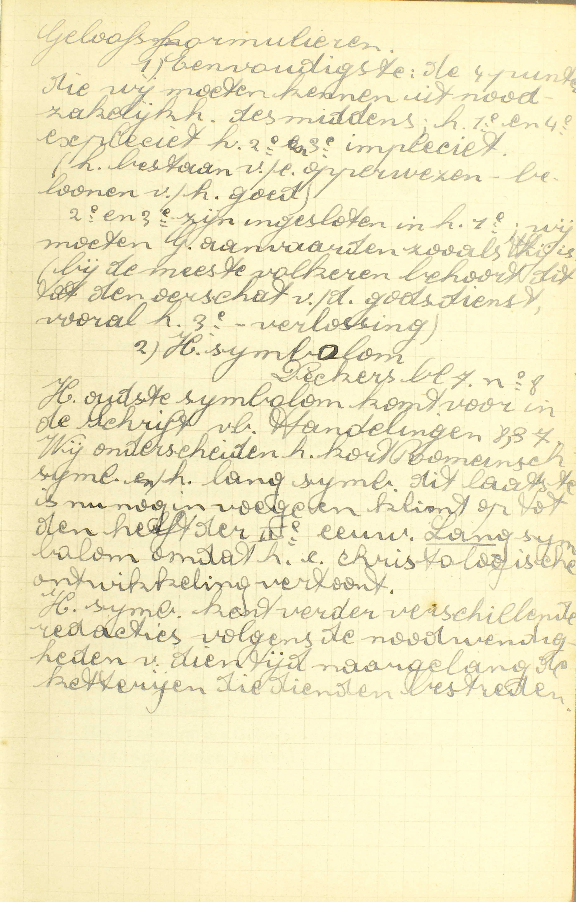
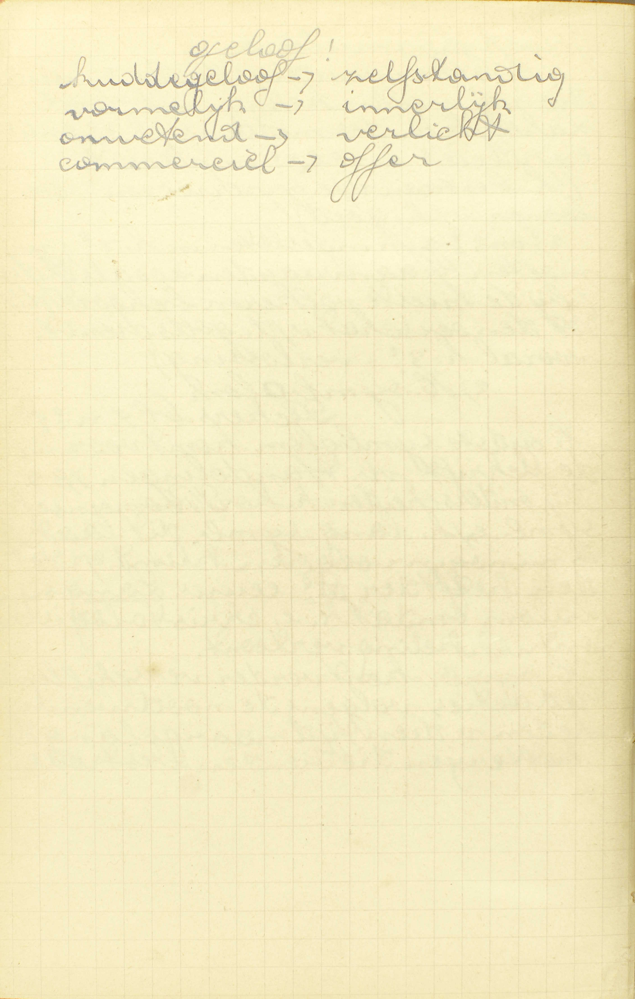
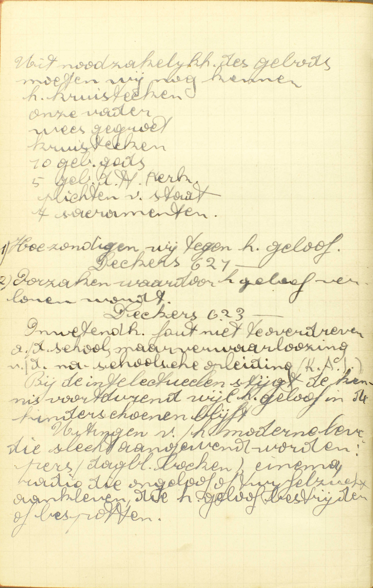
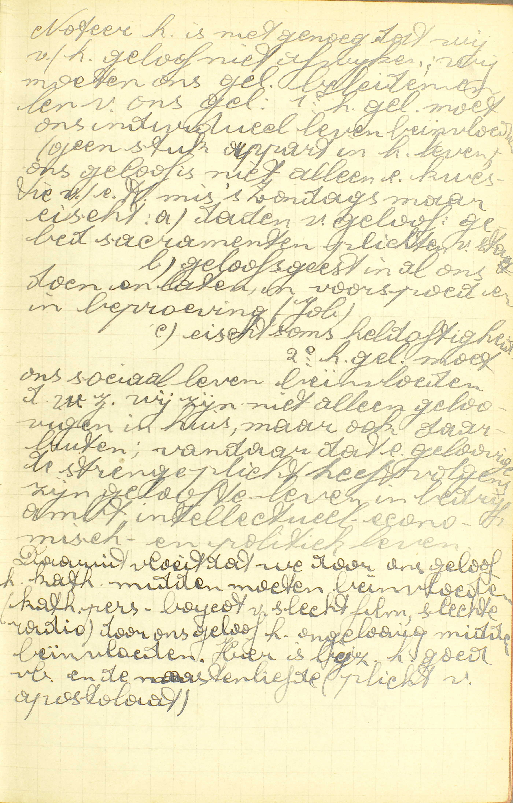

<table>
<tr>
  <td rowspan=8>**Het Geloof**</td>
  <td rowspan=8 class=accolade></td>
  <td colspan=4>Bepaling van de deugd van Geloof</td>
  <td>*[Wat is het Geloof?](#wat-is-het-geloof)*</td>
</tr>
<tr>
  <td rowspan=6>Goddelijke Openbaring, voorwerp van het Geloof</td>
  <td rowspan=6 class=accolade></td>
  <td colspan=2>Getal</td>
  <td>*[Is er meer dan een waarachtig Geloof?](#is-er-meer-dan-een-waarachtig-geloof)*</td>
</tr>
<tr>
  <td rowspan=3>Onverdeeldheid</td>
  <td rowspan=3 class=accolade></td>
  <td>*[Mogen wij wel twijfelen aan enige delen van het Geloof?](#mogen-wij-wel-twijfelen-aan-enige-delen-van-het-geloof)*</td>
</tr>
<tr>
  <td>*[Hebben de ketters het waarachtig Geloof, die enige stukken voor goed houden en andere verachten?](#hebben-de-ketters-het-waarachtig-geloof-die-enige-stukken-voor-goed-houden-en-andere-verachten)*</td>
</tr>
<tr>
  <td>*[Is het waar dat iedereen in zijn Geloof kan zalig worden?](#is-het-waar-dat-iedereen-in-zijn-geloof-kan-zalig-worden)*</td>
</tr>
<tr>
  <td rowspan=2>Kort begrip</td>
  <td rowspan=2 class=accolade></td>
  <td>*[Welk is het kort begrip van hetgene wij meest moeten geloven?](#welk-is-het-kort-begrip-van-hetgene-wij-meest-moeten-geloven)*</td>
</tr>
<tr>
  <td>*[Zeg de twaalf artikelen of hoofdstukken van het Geloof](#zeg-de-twaalf-artikelen-of-hoofdstukken-van-het-geloof)*</td>
</tr>
<tr>
  <td colspan=4>Beweegreden</td>
  <td>*[Waaruit hebben wij deze zekerheid in de stukken die het Geloof aangaan?](#waaruit-hebben-wij-deze-zekerheid-in-de-stukken-die-het-geloof-aangaan)*</td>
</tr>
</table>

# Wat is het Geloof?

## Een gave Gods en een licht, door hetwelk de mens vast gelooft al hetgene God ons geopenbaard heeft en door de Heilige Kerk voorhoudt, 't zij dat het geschreven is of niet

  
  <em>De voornaamste waarheden die voorkomen in het katholieke geloof, m.a.w. de grondslagen van het katholieke geloof zijn: 1) Dat er *één God* bestaat. 2) Dat deze God zich heeft *geopenbaard*. 3) Dat deze openbaring haar hoogtepunt bereikt heeft in *Christus,* die Godgezant bij uitstek en zonder twijfel God was. 4) Dat hij voor zijn heengaan van de aarde een *kerk stichtte.* 5) Dat deze kerk uitsluitend de *Katholieke Kerk* is. 6) Dat deze Kerk tot hoofd heeft Petrus en zijn opvolgers *de Pausen.*</em>
  
  
  <em>Jezus Christus bestuderen wij in de evangeliën als historische documenten.</em>
  
  <em>Vrij zijn: de mens is zedelijk verplicht te geloven, nochtans om verdiensten te kunnen hebben, moet hij vrij zijn, t.t.z. het moet altijd mogelijk zijn de openbaring te aanvaarden.</em>
  
  <em>Omdat de schrift de innerlijke klaarblijkelijkheid van het geloofspunt [de 7 sacramenten] nergens aantoont. Nergens wordt de rede gedwongen het geloofspunt te aanvaarden. Het geloof nochtans blijft en is redelijk, want de rede stelt vast dat de geloofspunten overeenkomen met de gegevens die toelaten iets voor redelijk te verklaren. volgens de normen waarmee het verstand werkt, dus iets contradictorisch kan nooit geloofspunt zijn. Het geloof steunt vooral op de Godheid van Christus en de zending van de Heilige Kerk. </em>

V. De Catechismus spreekt hier van de *deugd,* en niet enkel van de *akte* van Geloof, om reden dat, alle deugd een genegenheid zijnde van de ziel tot een zeker goed werk, de beschrijving van een deugd noodzakelijk ook die bevat van de akte of het werk, waartoe zij ons genegen maakt, en het overigens, om God te behagen, niet voldoende is, Hem met enige akten van Geloof te vereren, maar daartoe de deugd zelve in ons vereist wordt; immers, een bovennatuurlijk einde, zoals de Hemel die God alleen toebehoort, kan niemand bereiken zonder bovennatuurlijke krachten, en deze bestaan hoofdzakelijk in de heiligmakende genade en in de bovennatuurlijke deugden. De deugden zijn de bijzonderste middelen tot het goed; zonder deze kunnen wij wel het goed doen maar slechts onvolmaakt en met moeite.

A. De bepaling van de deugd van Geloof vermeldt daarvan hoofdzakelijk: 1° de oorsprong, 2° de natuur, 3° de akte en 4° het voorwerp.

1° De *oorsprong:* de deugd van Geloof is **een gave Gods,** d. í. zij maakt geen deel van onze natuur, gelijk b.v.  onze ziel, en is door onze natuurlijke werken niet aan te winnen, gelijk b.v. de wetenschap, noch kan door zulke werken als loon verdiend worden; in één woord, zij behoort op gener wijze tot de natuurlijke orde, maar wordt ons door God uit loutere goedheid ingestort.

2° De *natuur:* het Geloof is **een licht,** bestaande in een ingestorte en bijblijvende bekwaamheid van het verstand, waardoor men begrijpt of ziet, dat de goddelijke Openbaring geloofwaardig is en geloofd moet worden, en tevens in een genegenheid van de wil om die Openbaring door het Geloof aan te nemen.

3° De *akte:* het Geloof is een licht, **door hetwelk de mens vast gelooft:** het werk dus tot hetwelk het Geloof ons genegen maakt, is *geloven,* en geloven is iets voor waar aannemen, niet omdat wij het door ons verstand of door onze zinnen zien, maar omdat iemand die geloofwaardig is, er ons de waarheid van getuigt. *Vastelijk* geloven is zó geloven, dat men geenszins twijfelt, geenszins vrijwillig denkt, dat de zaak die men aanneemt, misschien vals zou kunnen wezen. Het woord *vast* leert ons, *hoe* wij door de deugd van Geloof geloven.

4° Het voorwerp: **al hetgene God ons geopenbaard heeft en door de Heilige Kerk voorhoudt, ’t zij dat het geschreven is of niet:** deze woorden drukken uit *wat* wij door de deugd van Geloof, op Gods getuigenis, voor waar aannemen; zij worden hieronder nader verklaard.

*Al hetgene God ons geopenbaard heeft:* al hetgene God ons kenbaar gemaakt heeft, niet door onze rede, maar met tot ons op een bovennatuurlijke wijze te spreken, en dit maakt eigenlijk uit hetgene wij moeten geloven. — God heeft verscheidene malen openbaringen gedaan: eerst heeft Hij gesproken door de patriarchen; daarna, door Mozes en de profeten; eindelijk, door Jezus Christus, zijn enige Zoon, voor ons mens geworden.

Al hetgene God ons geopenbaard heeft *en door de H. Kerk voorhoudt:* al hetgene God, door de H. Kerk, die Christus daartoe ingesteld heeft, ons, als van Hem geopenbaard zijnde, voorstelt. De H. Kerk dus is de middel, waardoor God eenieder de waarheden voorhoudt, die Hij eens geopenbaard heeft; en zo veropenbaart ons de H. Kerk geen nieuwe waarheden, maar houdt ons, als een gezant Gods in zijn naam zijn Openbaring, voor. — Door de *H. Kerk,* die ons de Openbaring voorhoudt, moet verstaan worden de overheid van de Rooms-Katholieke Kerk, te weten: de Paus van Rome en de bisschoppen, die door Christus zelf ingesteld zijn; ook de pastoors en priesters, voor zoveel zij door de Paus en de bisschoppen gemachtigd zijn om hun leer, in hun naam, aan het volk te verkondigen. Soms houdt de H. Kerk de geopenbaarde leer voor *op een plechtige wijze,* namelijk, wanneer de Paus van Rome, als Paus, de leer verklaart, die al de gelovigen moeten aannemen, of wanneer een algemeen Concilie een dergelijke geloofsverklaring doet; maar die voorhouding geschiedt onophoudelijk op een gewone en dagelijkse wijze, door de brieven van de Pausen en bisschoppen, door de leer van de katholieke Universiteiten en Seminariën, door de Catechismus, die elke bisschop in zijn bisdom voorschrijft, en door de sermoenen en onderrichtingen van de pastoors en priesters.

Al hetgene ons God geopenbaard heeft en door de Heilige Kerk voorhoudt, *’t zij dat het geschreven is of niet:* ’t zij hetgene de H. Kerk ons voorhoudt, in de H. Schrift geschreven staat, 't zij het daar niet in te vinden is. Hieruit volgt: a) dat de H. Kerk, gelijk overigens in de [4e les](les-04.html) uitdrukkelijker zal geleerd worden, haar leer uit twee schatten neemt, te weten: uit de H. Schrift en uit de Overlevering; 5) dat de leer uit de Overlevering genomen, niet minder waarde heeft dan de andere.

# Is er meer dan een waarachtig Geloof?

## Geenszins; want gelijk er maar één God is die het ons ingeeft, en één H. Kerk die het ons voorhoudt, zo kan er maar één Geloof wezen

V. De zin is: bestaan er verschillende geopenbaarde leren die met elkander strijden? **Geloof** is hier genomen in de zin van geopenbaarde leer, die te geloven is.

A. Er is niet meer dan een geopenbaarde leer, **want gelijk er maar één God is die het ons ingeeft:** gelijk er slechts één oneindig wijze en waarachtige God is, die veropenbaart en ons de genade geeft om te geloven, **en één H. Kerk die het ons voorhoudt:** één door Christus’ instelling onfaalbare Kerk, die ons voorhoudt, wat God geopenbaard heeft, **zo kan er maar één Geloof wezen:** zo kan er niet meer dan één leer bestaan, die te geloven is, Dan maar zouden er tegenstrijdige geopenbaarde leren kunnen zijn, indien er verscheidene Goden of verscheidene HH. Kerken bestonden, of indien God en de H. Kerk niet onfeilbaar waren.

# Mogen wij wel twijfelen aan enige delen van het Geloof?

## Neen; maar wij moeten al wat ons van de H. Kerk voorgehouden wordt, vast geloven en belijden

V. Mogen wij van het een of het ander punt, dat wij met zekerheid weten van God geopenbaard te zijn, vrijwillig denken, dat het misschien vals is? — Hier wederom is **Geloof** genomen in de zin van geopenbaarde leer, die te geloven is.

A. **Neen,** dat mogen wij geenszins; **maar wij moeten vast geloven en belijden:** zonder de minsten twijfel in- en uitwendig voor waar aannemen **al wat ons van de H. Kerk,** als van God geopenbaard zijnde, **voorgehouden wordt.** De reden daarvan is, dat voor al de punten van ons Geloof dezelfde onfeilbaarheid van God en van de H. Kerk geldt, en dat men dus het een punt niet kan verstoten zonder ook de andere te verwerpen. De Catechismus spreekt hier enkel van de voorhouding van de H. Kerk, en zegt er niet bij: *al wat God ons geopenbaard heeft,* omdat de H. Kerk het gewone middel is, waardoor wij met volle zekerheid kennen, welke juist de punten zijn die God geopenbaard heeft.

# Hebben de ketters het waarachtig Geloof, die enige stukken voor goed houden en andere verachten?

## Dezen hebben geen goddelijk Geloof, maar uitsluitend een menselijke opinie of goeddunken

V. De ketters, die enige punten van het Geloof, welke zij weten geopenbaard te zijn, voor waar aannemen, en andere als vals of als twijfelachtig aanzien, geloven die waarlijk in God, of, wat zij van de Openbaring aanvaarden, geloven zij dat op Gods getuigenis? Deze vraag leert ons, wie *ketters* zijn: dezulken namelijk, die enige delen van de Openbaring, welke zij weten goddelijk te zijn, aanvaarden, en de andere verwerpen.

A. **Dezen hebben geen goddelijk Geloof:** geloven niet wezenlijk in God, aanvaarden de Openbaring niet, om reden van de onfeilbaarheid van God, wat noodzakelijk vereist is om een goddelijk Geloof te hebben; **maar uitsluitend een menselijke opinie of goeddunken:** een zienswijze, een gedacht, dat niet op Gods getuigenis, maar slechts op beweegredenen van hun menselijk verstand rust; in één woord, de ketters geloven de punten die zij aannemen, niet omdat God ze geopenbaard heeft, maar omdat hun verstand ze goedkeurt; wie immers de goddelijke Openbaring op Gods getuigenis aanvaardt, gelooft er noodzakelijk al de punten van met gelijke zekerheid, aangezien voor alle punten dezelfde onfeilbaarheid geldt. Men kan Gods getuigenis toch niet te gelijk aanvaarden en verachten.

# Is het waar dat iedereen in zijn Geloof kan zalig worden?

## Zo leren de ketters, maar zij dolen; want zonder het één waarachtig Geloof is de zaligheid onmogelijk

  
  <em>Ieder van goede wil kan zalig worden, maar hij moet naar zijn geweten handelen.</em>

V. Kunnen de verschillende soorten van ketters die enige stukken van de goddelijke Openbaring voor goed houden en andere verachten, zowel als de katholieken, die geheel de Openbaring aannemen, tot de zaligheid komen?

A. **Zo leren de ketters,** namelijk, dat iedereen in zijn Geloof kan zalig worden, **maar zij dolen:** hun mening is vals; **want zonder het één waarachtig Geloof is de zaligheid onmogelijk;** zonder de hele Openbaring aan te nemen, gelijk de Rooms-Katholieke Kerk ze voorhoudt, is het onmogelijk de Hemel te bekomen. De reden is, dat, wie vrijwillig een punt van de Openbaring weigert te geloven, ernstig zondigt, geen goddelijk Geloof meer heeft, en zo reeds aan het eerste vereiste om God te kunnen dienen, te kort blijft.

Uit de noodzakelijkheid en de oorsprong van het Geloof samengenomen, mag men geenszins besluiten, dat iemand, die tot de jaren van verstand gekomen is, bij gebrek aan het waar Geloof, zonder zijn schuld de Hemel kan verliezen; want God biedt eenieder de gave van Geloof aan, en al degenen, die de jaren van verstand bereikt hebben, bekomen deze gave, als zij er door hun zonden geen beletsel tegen steen.

# Waaruit hebben wij deze zekerheid in de stukken die het Geloof aangaan?

## Uit God, die ons niet kan bedriegen, en uit de H. Kerk, die, naar de leer van Christus, niet kan dolen

V. Waaruit weten wij met volle zekerheid dat, hetgene God ons geopenbaard heeft en door de H. Kerk voorhoudt, wezenlijk geloofwaardig is?

A. **Uit God, die ons niet kan bedriegen:** die niet kan falen en niet kan liegen, **en uit de H. Kerk, die, naar de leer van Christus, niet kan dolen:** uit de Rooms-Katholieke Kerk die, volgens Christus’ instelling en verklaring, onfeilbaar is in het voorhouden van de geopenbaarde leer. Indien God die veropenbaart, en tevens de H. Kerk die de goddelijke Openbaring voorhoudt, beiden onfeilbaar zijn, zo hebben wij volle zekerheid nopens hetgene wij moeten geloven.

De onfeilbaarheid in de H. Kerk, behoort toe 1° aan de Paus van Rome, als Paus sprekende over zaken van Geloof en zeden, met het inzicht van alle gelovigen te verplichten; 2° aan de Paus samen met de bisschoppen, 't zij deze in een algemeen Concilie met hem vergaderd, of de wereld dóór verspreid zijn.

# Welk is het kort begrip van hetgene wij meest moeten geloven?

## Het Symbolum van het Geloof, van de Apostelen gemaakt en in twaalf delen verdeeld

  
  <em>Geloofsformulieren. 1) Eenvoudigste: de 4 punten die wij moeten kennen uit noodzakelijkheid des middens, het 1ᵉ en 4ᵉ expliciet en het 2ᵉ en 3ᵉ impliciet (het bestaan van een opperwezen, belonen van het goede). 2ᵉ en 3ᵉ zijn ingesloten in het 1ᵉ; wij moeten God aanvaarden zoals Hij is (bi de meeste volkeren behoort dit tot de oerschat van de godsdienst, vooral het 3ᵉ – verlossing).  2) Het symbolum. Het oudste symbolum komt voor in de Schrift, b.v. Handelingen 8:37. Wij onderscheiden de korte Romeinse symbolum en de lange symbolum. Deze laatste is nu nog in voegen en klimt op tot de helft van de IIᵉ eeuw. Lange symbolum, omdat ze christologische ontwikkeling vertoont. Het symbolum kent verder verschillende redacties volgens de noodwendigheden van die tijd, naargelang de ketterijen die dienden bestreden.</em>
  
  
  <em>Oorzaken waardoor het geloof verloren wordt. Onwetendheid: fout niet te overdreven aan de school, maar verwaarlozing van de na-schoolse opleiding (Katholieke Actie). Bij de intellectuelen stijgt de kennis voortdurend, terwijl het geloof in de kinderschoenen blijft. Uitingen van het moderne leven die slecht aangewend worden: pers, dagbladen, boeken, cinema, radio, die ongeloof of twijfelzucht aankleven, die het geloof bestrijden of vernederdten.</em>
  
  <em>Noteer het is niet genoeg dat wij van het geloof niet afwijken, wij moeten ons geloof belijden en leven van ons geloof: 1) Het geloof moet ons individueel leven beïnvloeden (geen stuk apart van het leven). Ons geloof is niet alleen een kwestie van een heilige Mis 's zondags, maar eist a) daden van geloof: gebed, sacramenten, plichten van staat; b) geloofsgeest in al ons doen en laten, in voorspoed en beproeving; c) eist soms heldhaftigheid. 2) Het geloof moet ons sociaal leven beinvloeden, d.w.z. wij zijn niet alleen gelovigen in huis, maar ook daarbuiten; vandaar dat een gelovige de strenge plicht heeft volgens zijn geloof te leven in bedrijf, ambt, intellectueel, economisch en politiek leven. Daaruit vloeit dat we door ons geloof het katholieke midden moeten beïnvloeden (katholieke pers, boycot van slechte film, slechte radio), door ons geloof het ongelovige midden beïnvloeden. Hier is bijzonder het goed voorbeeld en de naastenliefde (plicht van apostolaat).</em>

V. De zin van de woorden **meest geloven** is hier niet *vaster geloven,* maar *uitdrukkelijker kennen en geloven.*

A. **Het Symbolum,** de verzameling, de opsomming, ofwel het teken of de belijdenis **van het Geloof,** van de geopenbaarde leer, die de H. Kerk ons voorhoudt, **van de Apostelen gemaakt,** gelijk de Overlevering getuigt, **en in twaalf delen** of twaalf bijzondere waarheden **verdeeld.**

# Zeg de twaalf artikelen of hoofdstukken van het Geloof

1. Ik geloof in God, de Vader almachtig, schepper van de hemel en van de aarde.
2. En in Jezus Christus, zijn enige Zoon, onze Heer:
3. Die ontvangen is van de Heilige Geest, geboren uit de Maagd Maria:
4. Die geleden heeft onder Pontius Pilatus; is gekruisigd, gestorven en begraven:
5. Die nedergedaald is ter helle; ten derden dage verrezen is van de dood:
6. Die opgeklommen is ten hemel, en zit ter rechter hand Gods van zijn Vaders almachtig:
7. Vandaar zal Hij komen oordelen de levenden en de doden.
8. Ik geloof in de Heilige Geest,
9. De Heilige Katholieke Kerk, gemeenschap van de Heiligen,
10. Vergiffenis van de zonden,
11. Verrijzenis van het lichaam,
12. Het eeuwig leven. Amen.

A. Het Symbolum bestaat uit *drie* delen: het eerste spreekt van God de Vader en van de schepping die Hem wordt toegeschreven; het tweede, van God de Zoon en onze verlossing,
die Hij als mens heeft teweeggebracht; het derde, van de H. Geest en al de werken die Hem toegeschreven worden.

Wij zeggen in het Symbolum: ik geloof *in* God... *in* Jezus Christus. *in* de H. Geest, om uit te drukken, dat wij niet enkel geloven in hun bestaan, maar ook, en met een ware genegenheid tot hen, hun leer aannemen.

Het Symbolum moeten wij kennen *uit noodzakelijkheid van het gebod,* d.w.z. dat wij zondigen, als wij het, door onze schuld niet kennen. *De Vier Punten van het Geloof,* die ook in het Symbolum vermeld zijn, moeten wij weten, niet enkel uit noodzakelijkheid van het gebod, maar ook *uit noodzakelijkheid van het middel,* d.w.z. dat wij, zonder de kennis daarvan, niet kunnen zalig worden, al ware hier de onwetendheid onvrijwillig. Die vier punten worden gewoonlijk geleerd en opgezegd als volgt: « Ten eerste, dat er is één God: ten tweede, dat er zijn drie goddelijke Personen, te weten: God de Vader, God de Zoon en God de H. Geest; ten derde, dat God de Zoon voor ons is mens geworden; ten vierde, dat God is de loner van het goed, en de straffer van het kwaad. »

Buiten de punten in het Symbolum uitdrukkelijk vermeld, zijn er nog andere, die elkeen, volgens de staat waarin hij zich bevindt, weten en geloven moet. Zo is elkeen voorzeker verplicht, een genoegzame kennis te hebben van de HH. Sacramenten die hij ontvangen moet, en van al die geloofspunten die hij moet weten om zijn ambt behoorlijk te vervullen.

### Aanmerking

Door deze les verstaan wij gemakkelijk onze akte van Geloof: *« Mijn Heer en mijn God! Ik geloof vast, »* Het woord vast drukt de manier uit, waarop wij moeten geloven; *« al hetgeen Gij hebt geopenbaard en door de H. Kerk mij voorhoudt te geloven. »* Dat is het voorwerp van ons Geloof; wij geloven de waarheden die God ons geopenbaard heeft, en kennen die met volle zekerheid door de H. Kerk die, naar Christus’ leer, niet kan dolen; *« omdat Gij de opperste en onfaalbare waarheid zijt. »* Dat is de reden waarom wij in God geloven.

Wij hebben volmaakte voorbeelden van Geloof in Abraham die uit Geloof zijn land verliet en zijn enige zoon, de erfgenaam van de beloften door God gedaan, wilde slachtofferen;
in Mozes die uit Geloof het hof van Egypten verliet.

### VRAGEN

Hoe wordt deze les verdeeld? — Wat leren wij in ieder deel?

1. Spreekt de Catechismus hier van de *akte* ofwel van de *deugd van Geloof;* en waarom? — Welk is de oorsprong van de deugd van Geloof? — Is het nodig dat onze deugd van Geloof een zo edelen oorsprong heeft en waarom? — Waarin bestaat die deugd?  — Tot welk werk maakt zij ons genegen, en waarin bestaat dat werk? — *Hoe* geloven wij door die deugd? — Wat geloven wij door haar? — Wat is openbaren? — Wat doet de H. Kerk nopens hetgene God geopenbaard heeft? — Wat verstaat men hier door de H. Kerk? — Op hoeveel en op welke manieren houdt zij ons de goddelijke Openbaring voor? — Wat betekenen de woorden: *'t zij dat het geschreven is of niet?*

2. Welk is de zin van de vraag: *is er meer dan één waarachtig Geloof?* — Kan er meer dan één waarachtig Geloof wezen? — Welke reden geeft de Catechismus daarvan? — Hoe is die reden geldig?

3. Wat onderzoekt de Catechismus als hij zegt: *mogen wij wel twijfelen aan enige delen van het Geloof?* — Hoe moeten wij al wat de H. Kerk ons voorhoudt aannemen en waarom? — Wat is *vast geloven en belijden?* — Waarom zegt de Catechismus hier: *hetgeen de H. Kerk ons voorhoudt; en niet: hetgeen God geopenbaard heeft?*

4. Hoe gedragen zich de ketters nopens het Geloof? — Wat verstaat men hier door een *waarachtig,* een *goddelijk Geloof;* en wat is een *menselijke opinie of goeddunken?* — Hebben de ketters een *waarachtig,* een *goddelijk Geloof?* — Wat hebben zij uitsluitend?  — Welk is de reden daarvan?

5. Wat betekenen de woorden: *is het waar dat iedereen in zijn Geloof kan zalig worden?* — Wat antwoorden de ketters op deze vraag? — Wat moeten wij van hun mening over dit punt denken; en waarom? — Waarom is de zaligheid zonder het enig waarachtig Geloof onmogelijk? — Indien zonder het één waarachtig Geloof de zaligheid onmogelijk is, en dat het Geloof een gave is, volgt er daaruit niet, dat enige mensen zonder hun schuld verloren gaan?

6. Zeg in andere woorden: *waaruit hebben wij deze zekerheid in de stukken die het Geloof aangaan.* — Uit welke hoofde zijn wij zeker dat hetgene wij geloven, wezenlijk geloofwaardig is? — Wat betekenen de woorden: God, *die ons niet kan bedriegen;* — de *H. Kerk, — die, naar de leer van Christus, niet kan dolen?*

7. Wat betekenen in de 7ᵉ vraag de woorden: *hetgene wij meest moeten geloven?* — Wat verstaat men door *Symbolum van het Geloof?* — Wie heeft dat Symbolum gemaakt, en hoe weten wij dat? — Hoe is het verdeeld?

8. Hoeveel hoofddelen zijn er in het Symbolum, en wat bevatten zijt — Wat wordt er betekend door: ik geloof *in* God de Vader *in* Jezus Christus, *in* de H. Geest. — Welk verschil is er tussen iets te moeten weten *uit noodzakelijkheid van het gebod* en *uit noodzakelijkheid van het middel?* — Uit welke noodzakelijkheid moeten wij geheel het Symbolum kennen, en uit welke de Vier Punten van het Geloof?

