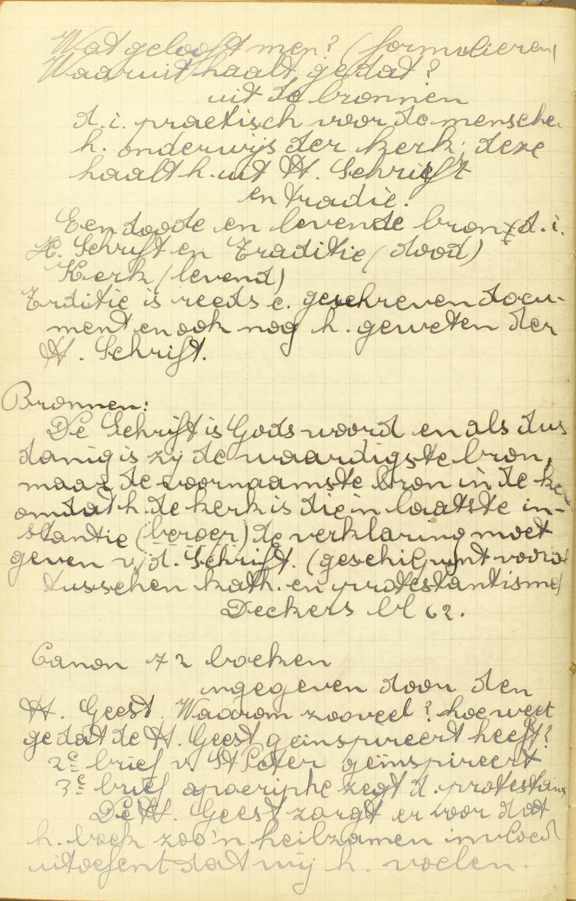
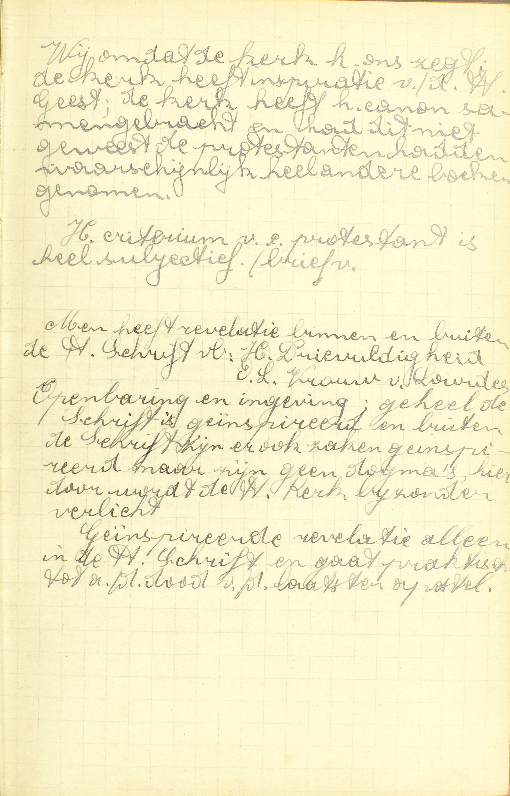
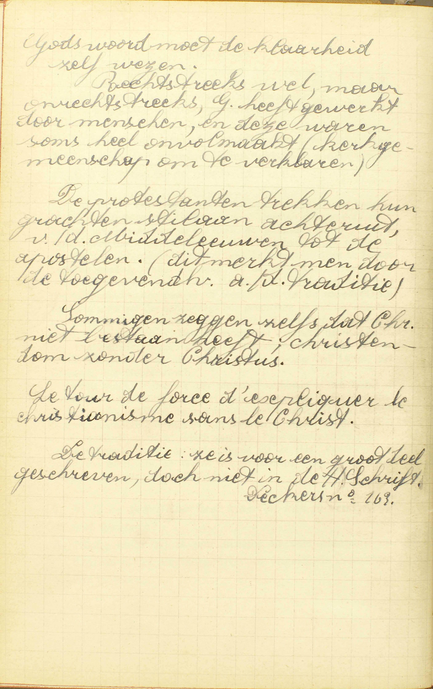

<table>
<tr>
  <td rowspan=8>**De Schatten van de goddelijke Openbaring**</td>
  <td rowspan=8 class=accolade></td>
  <td rowspan=6>**De H. Schrift**</td>
  <td rowspan=6 class=accolade></td>
  <td colspan=2>Natuur</td>
  <td>*[Wat heet gij de Heilige Schrift?](#wat-heet-gij-de-heilige-schrift)*</td>
</tr>
<tr>
  <td rowspan=2>Schriftboeken</td>
  <td rowspan=2 class=accolade></td>
  <td>*[Waaruit mogen wij weten welke boeken stukken van de Heilige Schrift zijn?](#waaruit-mogen-wij-weten-welke-boeken-stukken-van-de-heilige-schrift-zijn)*</td>
</tr>
<tr>
  <td>*[De ketterse bijbels zijn die ook Heilige Schrift?](#de-ketterse-bijbels-zijn-die-ook-heilige-schrift)*</td>
</tr>
<tr>
  <td rowspan=2>Gebruik</td>
  <td rowspan=2 class=accolade></td>
  <td>*[Is het iemand verboden de Bijbel te lezen?](#is-het-iemand-verboden-de-bijbel-te-lezen)*</td>
</tr>
<tr>
  <td>*[Is de Schrift heel klaar, en kan ze iedereen wel verstaan?](#is-de-schrift-heel-klaar-en-kan-ze-iedereen-wel-verstaan)*</td>
</tr>
<tr>
  <td colspan=2>Uitgebreidheid</td>
  <td>*[Moeten wij iets geloven, dat in de Bijbel niet geschreven is?](#moeten-wij-iets-geloven-dat-in-de-bijbel-niet-geschreven-is)*</td>
</tr>
<tr>
  <td rowspan=2>**De Apostelijke Traditiën**</td>
  <td rowspan=2 class=accolade></td>
  <td colspan=2>Natuur</td>
  <td>*[Wat zijn Apostelijke Traditiën?](#wat-zijn-apostelijke-traditiën)*</td>
</tr>
<tr>
  <td colspan=2>Enkele punten enkel hierin bewaard</td>
  <td>*[Noem enige stukken die geloofd moeten worden en nochtans in de Heilige Schrift niet slaan](#noem-enige-stukken-die-geloofd-moeten-worden-en-nochtans-in-de-heilige-schrift-niet-slaan)*</td>
</tr>
</table>

# Waaruit heeft de Heilige Kerk al wat zij ons voorhoudt te geloven?

## Uit de schatten, die God haar achtergelaten heeft, te weten: de Heilige Schrift en de Apostelijke Traditiën of Overleveringen

  
  <em>Wat gelooft men? (formulieren) Waaruit haalt ge dat? – uit de bronnen, d.i. praktisch voor de mensen: het onderwijs van de kerk; deze haalt het uit de heilige Schrift en traditie. Een dode en een levende bron, d.i. heilige Schrift en Traditie (dood) en Kerk (levend). Traditie is reeds een geschreven document en ook nog het geweten van de heilige Schrift. Bronnen: De Schrift is Gods woord en alsdusdanig is zij de waardigste bron, maar de voornaamste bron is de kerk, omdat het de kerk is die in laatste instantie de verklaring moet geven van de Schrift. (geschilpunt vooral tussen katholieken en protestantisme.  Canon van 72 boeken: ingegeven door de Heilige Geest. Waarom zoveel? Hoe weet ge dat de Heilige Geest geïnspireerd heeft?</em>
  
  <em>Wij omdat de kerk het ons zegt. De kerk heeft de canon samengebracht en had dit niet geweest, de protestanten hadden waarschijnlijk heel andere boeken genomen. Het criterium van een protestant is heel subjectief. Men heeft revelatie binnen en buiten de heilige Schrift, b.v. Heilige Drievuldigheid, O.L.Vrouw van Lourdes. Openbaring en ingeving; geheel de Schrift is geïnspireerd en buiten de Schrift zijn er ook zaken geïnspireerd, maar zijn geen dogma's, hierdoor wordt de heilige Kerk bijzonder verlicht. Geïnspireerde revelatie alleen in de heilige Schrift en gaat praktisch tot aan de dood van de laaatste apostel.</em>

V. De zin is: waaruit neemt de H. Kerk de leer, die zij ons als de goddelijke Openbaring voorhoudt: is het uit nieuwe goddelijke openbaringen, ofwel uit enige bewijs of bewaarstukken van de gedane Openbaring?

A. Zij neemt de leer, die zij voorhoudt **uit de schatten,** de bewaarstukken, **die God,** na daarin zijn Openbaring besloten te hebben, **haar achtergelaten heeft,** opdat zij er haar leer zou uit putten. Die bewaarstukken, hier *schatten* genoemd om hun allerkostbaarste inhoud, zijn ten getalle van twee, **te weten: de Heilige Schrift en de Apostelijke Traditiën of Overleveringen.**

# Wat heet gij de Heilige Schrift?

## Boeken, die zowel in het Oud als in het Nieuw Testament, van heilige mannen, door het ingeven en de bijzondere bijstand van de Heilige Geest, geschreven zijn

A. De H. Schrift bestaat niet uit mondelinge leer, maar, gelijk het woord *schrift* of *schrift* genoegzaam aanduidt, uit **boeken,** en uit boeken, **die geschreven zijn zowel in het Oud als in het Nieuw Testament,** deze woorden leren ons, *wanneer* de H. Schrift opgesteld werd, namelijk, onder de Oude Wet van Mozes zowel als onder de Nieuwe Wet van Christus: *testament* is hier immers hetzelfde als getuigenis, veropenbaring, verbond, *wet.* De boeken van het Nieuw Testament zijn allen geschreven in de eerste eeuw na Christus. — Om Schriftboeken te zijn, moeten de boeken van het Oud en van het Nieuw Testament geschreven zijn, niet, gelijk de stenen tafelen van Mozes, rechtstreeks door God zelf, maar 1° **van heilige mannen:** van personen door God zelf uitgekozen en Hem bijzonder toegewijd; 2° door het ingeven van de H. Geest, zowel wat aangaat de gedachten die geschreven moeten worden, als de wil van die te schrijven; en, na die ingeving, 3° **door de bijzondere, buitengewone, bovennatuurlijke bijstand van de H. Geest,** om in 't uitdrukken van de gedachten niet te falen. Deze twee werken zijn, gelijk al hetgeen God buiten zichzelf doet, de drie goddelijke Personen gemeen, maar worden de *H. Geest* bijzonder toegeschreven omdat het werken van liefde zijn. De reden waarom beide hier vereist worden, is gemakkelijk om begrijpen: om een boek op te stellen, moet men gedachten hebben, deze willen schrijven, en nauwkeurig uitdrukken; welnu, het Geloof leert ons, dat God de H. Schrift heeft opgesteld door tussenkomst van heilige mannen, van Hem daartoe verkozen; dus moet God hun de gedachten, die in de H. Schriftboeken uitgedrukt zijn, alsook de wil van ze daarin uit te drukken, ingegeven, en hun daarenboven in het schrijven hulp verleend hebben,

Hieruit blijkt, hoe de geloofsverklaringen van de H. Kerk geen H. Schrift zijn: wel zijn zij gedaan onder de bijzondere bijstand van de H. Geest, maar door Hem niet onmiddelijk ingegeven, daar zij uit de schatten van de Openbaring genomen zijn.

De Schriftboeken worden *Heilige Schrift* genoemd, omdat zij, van God zelf voortkomende, bij uitnemendheid *heilig* zijn.

# Waaruit mogen wij weten welke boeken stukken van de Heilige Schrift zijn?

## Uit de leer van de H. Kerk, die ze voor zulke ontvangt en ons voorhoudt

V. Door wat middel kunnen wij met zekerheid weten, welke boeken wezenlijk H. Schrift zijn?

A. Wij weten dat met zekerheid **uit de leer van de H. Kerk:** van de kerkelijke overheid, bestaande uit de Paus en de bisschoppen, **die ze voor zulke ontvangt:** die de ware Schriftboeken, haar door de schatten van de Openbaring kenbaar gemaakt, voor dusdanig aanneemt, **en ons** ook voor dusdanige, op een onfaalbare wijze, **voorhoudt.** De reden is, dat de Openbaring van God, die ze ingegeven heeft, de ware middel is om te weten, welke boeken stukken zijn van de H. Schrift, en dat de H. Kerk van Christus is ingesteld om ons de geopenbaarde leer onfeilbaar voor te stellen.

# De ketterse bijbels zijn die ook Heilige Schrift?

## Geenszins, want zij zijn vervalst op vele plaatsen

V. De ketterse bijbels zijn die ook ware Schriftboeken, gelijk die welke de H. Kerk ons voor zulke voorhoudt? *Bijbel* betekent eigenlijk *boek,* maar wordt algemeen gebruikt om de uitmuntendste boeken, te weten, de verzameling van de Schriftboeken aan te duiden.

A. De ketterse bijbels zijn **geenszins H. Schrift,** de reden volgt; **want zij zijn vervalst op vele plaatsen;** de ketters immers houden wel enige stukken voor goed, maar verachten de andere; vandaar komt dat hun bijbels, deels ongeschonden gebleven, op vele plaatsen vervalst zijn, 't zij door nieuwe dingen die er bijgevoegd, ’t zij door andere die weggelaten of van zin veranderd werden; daarom ook kuuanen die bijhels, daar ten minste waar zij vervalst zijn, geenszins H. Schrift wezen.

Het is streng verboden ketterse bijbels te bewaren of te lezen.

# Is het iemand verboden de Bijbel te lezen?

## Ja, het is aan gewone mensen verboden zonder oorlof die te lezen in de moederlijke taal

A. **Ja, het is verboden,** niet rechtstreeks door God maar door de H. Kerk, **aan gewone mensen:** aan al degenen die niet voor ambt hebben, als dienaars van de H. Kerk, de Christenen in het Geloof te onderwijzen, noch zich daartoe bereiden: *gewone mensen* immers is hier het tegenovergestelde van *aanzichtbaare beambten;* **die te lezen zonder oorlof,** zonder toelating van de geestelijke overheid, van de Paus namelijk, óf van de bisschop, óf van een door hen daartoe gemachtigden pastoor of biechtvader, **in de moederlijke taal:** in een taal die hedendaags nog gesproken, en daarom *moedertaal* (taal die wij van onze moeder leren) of *levende taal* genoemd wordt. Zulke taal is b.v. het Vlaams, het Frans, het Engels, het Duits. Het tegenovergestelde van de levende talen zijn de *dode talen*, die men niet meer spreekt, zoals het Latijn, het Grieks, het Hebreeuws.

Hieruit volgt, 1° dat het aan niemand verboden is de Bijbel te lezen in de dode talen; 2° dat het maar aan gewone mensen verboden is die zonder oorlof in de moederlijke taal te lezen.
Hier nochtans is een uitzondering te maken voor die overzettingen van de Bijbel in de moederlijke talen, welke van de Paus goedgekeurd zijn, of welke vergezeld gaan van verklaringen uit de HH. Vaders of uit katholieke schrijvers, en tevens de goedkeuring van de bisschop dragen: deze mag iedereen lezen.

# Is de Schrift heel klaar, en kan ze iedereen wel verstaan?

## Neen; maar zij is zeer duister in vele plaatsen, en daarom is het zeer zorglijk voor ongeleerde mensen die te lezen

  
  <em>Gods woord moet de klaarheid zelf wezen. Rechtstreeks wel, maar onrechtstreeks heeft God gewerkt door mensen en deze waren soms heel onvolmaakt (kerkgemeenschap om te verklaren). De protestanten trekken hun grachten stilaan achteruig, van de Middeleeuwen tot de apostelen (dit merkt men door de toegevendheid aan de traditie). Sommigen zeggen zelfs dat Christus niet bestaan heeft; christendom zonder Christus. Le tour de force d' expliquer 1° chirstianisme sans 1° Christ. De traditie: ze is voor een groot deel geschreven, doch niet in de heilige Schrift.</em>

A. **Neen; maar zij is zeer duister,** zeer moeilijk om verstaan in **vele plaatsen,** en de oorzaak daarvan ligt in de verhevene waarheden die zij bevat, alsmede in onze onvolmaakte kennis van de talen, waar de Bijbel in geschreven is, en van de oude gebruiken die daarin vermeld worden; **en daarom is het zeer zorglijk,** zeer gevaarlijk **die te lezen voor ongeleerde mensen:** voor personen die in het Geloof, in de geschiedenis en in de taalkunde weinig ervaren zijn. 't Is om reden van de duisterheid van de H. Schrift en het daaruit voortvloeiend gevaar, dat de H. Kerk aan de gewone mensen verboden heeft ze te lezen in de moederlijke taal.

# Moeten wij iets geloven, dat in de Bijbel niet geschreven is?

## Ja, ook de Apostelijke Traditiën

A. Uit dit antwoord blijkt, dat de Bijbel niet alles behelst wat wij moeten geloven; dat hij bijgevolg de enige schat niet is, waar de goddelijke Openbaring in besloten ligt. Behalve de Bijbel bestaat nog een tweede schat, te weten: **de Apostelijke Traditiën** of Overleveringen. De verklaring van hun aard en naam wordt gegeven in de volgende vraag.

# Wat zijn Apostelijke Traditiën?

## Leren, die van van de Apostelen tijden af geleerd, en van hand tot hand overgeleverd zijn

A. De Apostelijke Traditiëen zijn **leren:** geopenbaarde waarheden, **die van van de Apostelen tijden af geleerd,** die van reeds onmiddellijk na de nederdaling van de H. Geest, door de Apostelen aan de gelovigen gepredikt, en, van dan af, zonder onderbreking, **van hand tot hand:** van de eersten Paus en de eerste bisschoppen tot hun opvolgers door de eeuwen heen, **overgeleverd zijn.** Deze overlevering geschiedde door de leer van de Pausen, van de bisschoppen en van de Conciliën, door de schriften van de godgeleerden, de Catechismussen, de kerkgebruiken, de sermoenen en onderrichtingen van de pastoors en priesters.

De Overleveringen komen dus hierin met de H. Schrift overeen, dat zij ook de van God geopenbaarde leer zijn; maar verschillen er van onder dit opzicht, dat zij niet, gelijk de H. Schrift, door het ingeven en de bijzondere bijstand van de H. Geest geschreven, maar door de schriftelijke en mondelinge leer van de H. Kerk bewaard werden.

Evenwel verschillen de Overleveringen van de voorhouding van de H. Kerk: deze is haar levende leer, of hetgeen de Paus en de bisschoppen, die nu leven, ons voorhouden; gene integendeel, bestaan uit de stukken, die de leer van de H. Kerk in vroegeren tijd bevatten.

De H. Schrift en de Overlevering zijn dus twee *dode* bronnen van de goddelijke Openbaring, terwijl de H. Kerk, die de Openbaring er uit put en voorhoudt, de levende bron van de Openbaring is.

# Noem enige stukken die geloofd moeten worden en nochtans in de Heilige Schrift niet slaan

## Dat er maar vier Heilige Evangelisten zijn; dat de H. Moeder Gods altijd maagd gebleven is, enz.

A. Hier doet de Catechismus, onder andere, twee geloofspunten kennen, die alleen in de Overlevering bewaard zijn:

1° **Dat er maar vier Heilige Evangelisten zijn,** of vier heilige mannen die, door goddelijke ingeving en bijstand, het Evangelie geschreven hebben, te weten: de HH. Mattheüs, Marcus, Lucas en Joannes. Het woord *Evangelie,* letterlijk *blijde tijding,* wordt algemeen gebruikt om de blijde tijding van Christus’ komst, en bijgevolg, van geheel zijn geschiedenis uit te drukken.

2° **Dat de — H. Moeder Gods:** de H. Maagd Maria, die de naam draagt van Moeder Gods, omdat zij de moeder is van Christus als mens, **maagd gebleven is — altijd:** geheel haar leven dóór.
**Enz.:** wij weten ook door de Overlevering alleen, hoeveel Sacramenten er zijn, en welke boeken deel maken van de H. Schrift.

Het grootste getal van de geloofspunten zijn tevens in de H. Schrift en in de Overlevering te vinden.

### VRAGEN.

Wat leren wij kennen in deze les? — Geef de hoofdverdeling van deze les, — Zeg wat de Catechismus nopens ieder deel onderzoekt.

1. Welk is de zin van de vraag: *Waaruit heeft de H. Kerk al wat zij ons voorhoudt te geloven?* — Wat betekenen de woorden: *de schatten die God haar achtergelaten heeft?* — Hoeveel schatten zijn er, waaruit de H. Kerk haar leer neemt, en hoe noemt men ze?

2. Wat wordt er door de naam zelf *Schrift* nopens de H. Schrift aangeduid? — Wanneer zijn de schriftboeken geschreven? — Wat verstaat men door *Oud en Nieuw Testament?*  — Leg het woord *Testament* uit. — Door wie is de H. Schrirtuur geschreven; leg het antwoord uit. — Wat is er vereist, opdat een boek H. Schrift weze? — Wat verstaat men hier door *het ingeven* van de H. Geest? — Wat verstaat men door *de bijzondere bijstand* van de H. Geest, waaronder de H. Schrift geschreven is? — Komt dat ingeven en die bijzondere bijstand alleen van de H. Geest; leg het antwoord uit. — Waarom zijn de bovengenoemde vereisten nodig opdat een boek H. Schrift zou wezen? — Van waar komt de naam *Heilige* Schrift?

3. Welk is de zin van de derde vraag: *Waaruit mogen wij weten, welke boeken stukken van de H. Schrift zijn?* — Welken middel hebben wij dan om de boeken, die wezenlijk tot de H. Schrift behoren, te kennen? — Wat verstaat men hier door de H. Kerk?  — Bewijs dat die genoemde middel de ware is om de schriftboeken te kennen.

4. Wat betekent hier het woord *Bijbel?* — Wat wordt hier nopens de ketterse bijbels gevraagd? — Waarom zijn zij geen H. Schrift? — Mogen wij die bewaren of gebruiken?

5. Zijn er gelovigen, aan wie het ooit verboden is de Bijbel te lezen? — Welke zijn deze? — In welk geval is het hun verboden, en welke uitzondering is er te maken? — Kan er tot dat geval oorlof gegeven worden, en door wie? — Wie mogen de Bijbel in alle talen lezen? — In welke talen mag eenieder de Bijbel lezen? — Van wie komt het verbod de Bijbel in zekere talen te lezen?

6. Wat ís er op te merken nopens de klaarheid of de duisterheid van de H. Schrift? — Wat volgt er daaruit voor het lezen van de H. Schrift? — Welke wet heeft de H. Kerk daarom nopens het lezen van de H. Schrift gemaakt?

7. Vinden wij alles, wat mij moeten geloven, in de H. Schrift? — In welke schat vinden wij de andere geloofspunten? — Leg de naam van die tweeden schat uit.

8. Welke *leren* zijn de Apostelijke Traditiën? — Van wie zijn zij eerst overgeleverd? — Hoe zijn zij tot ons gekomen? — Wat is er gemeen tussen de H. Schrift en de Overlevering, en waarin verschillen deze twee schatten? — Hoe verschilt de Overlevering van de levende leer van de H. Kerk, die ons voorhoudt hetgeen wij moeten geloven?

9. Wat leren wij in de 9ᵉ vraag: *Noem enige stukken, die geloofd moeten worden en nochtans in de H. Schrift niet staan?* — Wat verstaat men door *Evangelisten* en door *Evangelie?* — Wie is de Moeder Gods, en waarom draagt zij deze naam? — Hoelang is de Moeder Gods maagd gebleven? — Noem nog twee andere punten, die wij alleen door de Overlevering kennen.

