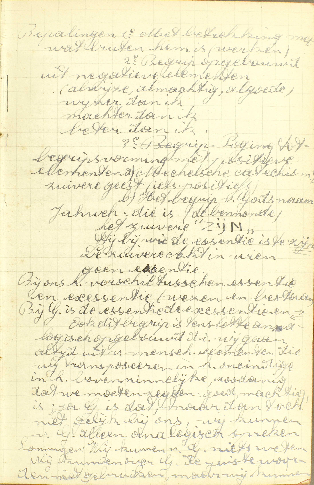
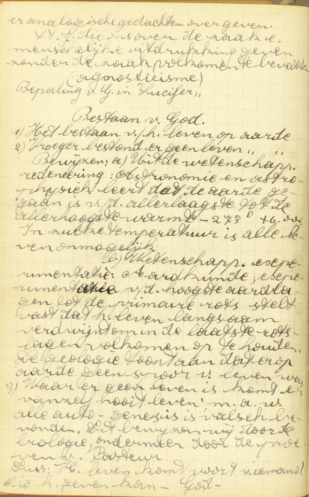
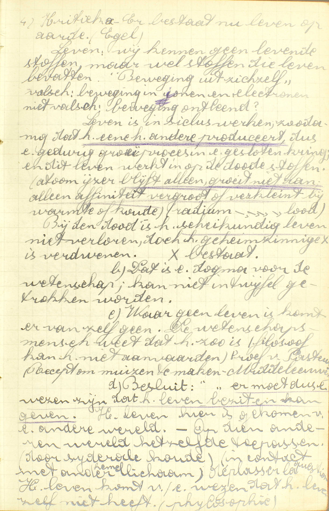
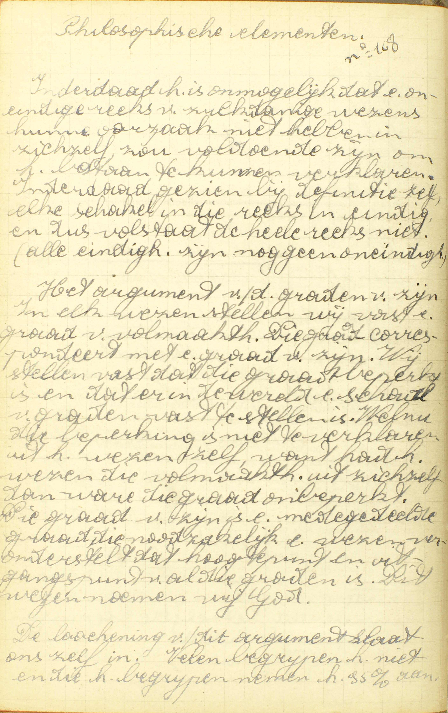
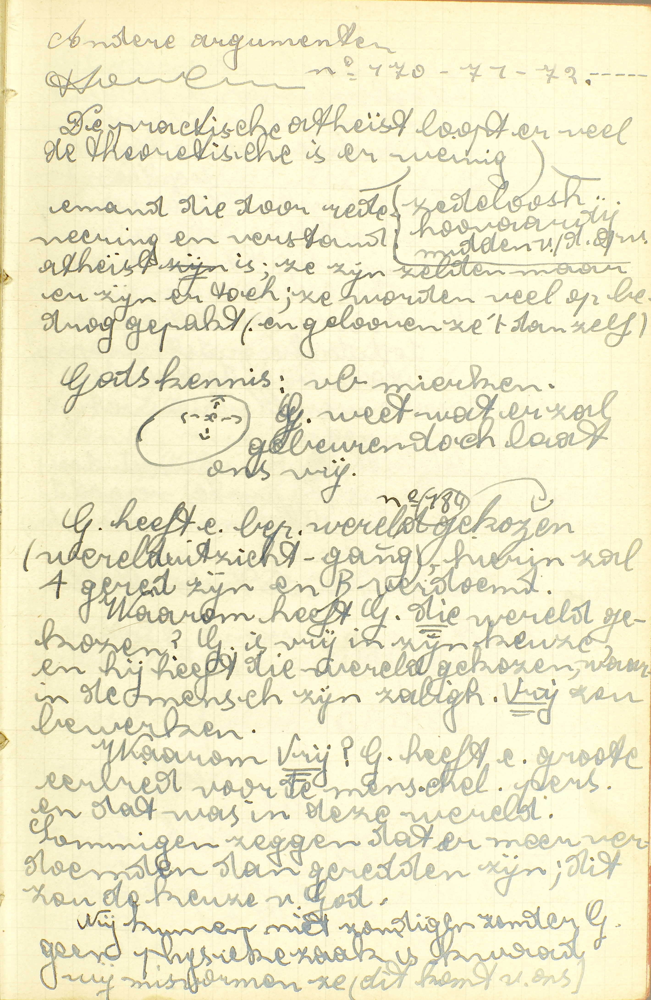
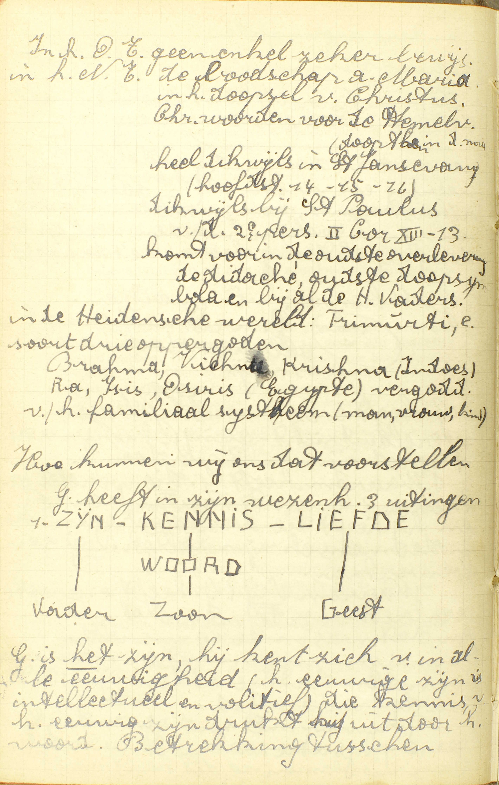
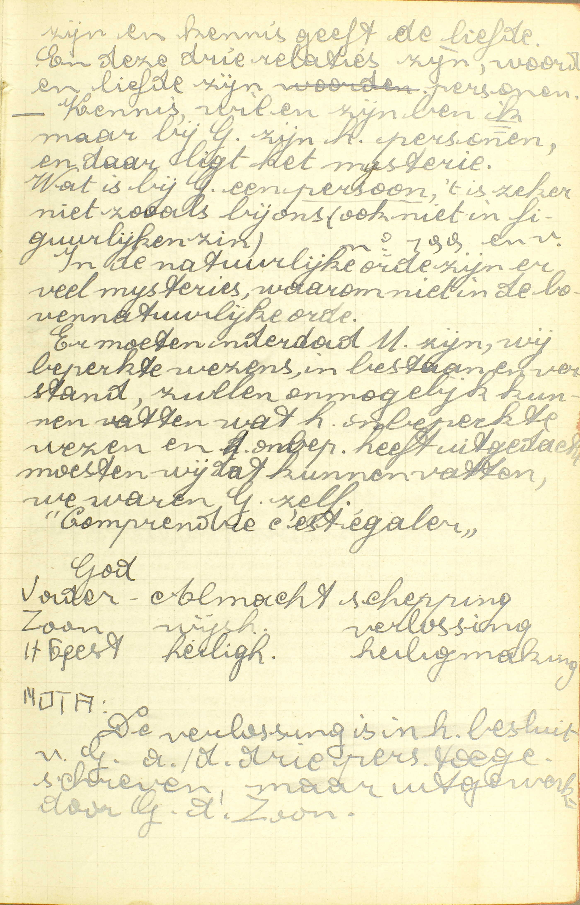
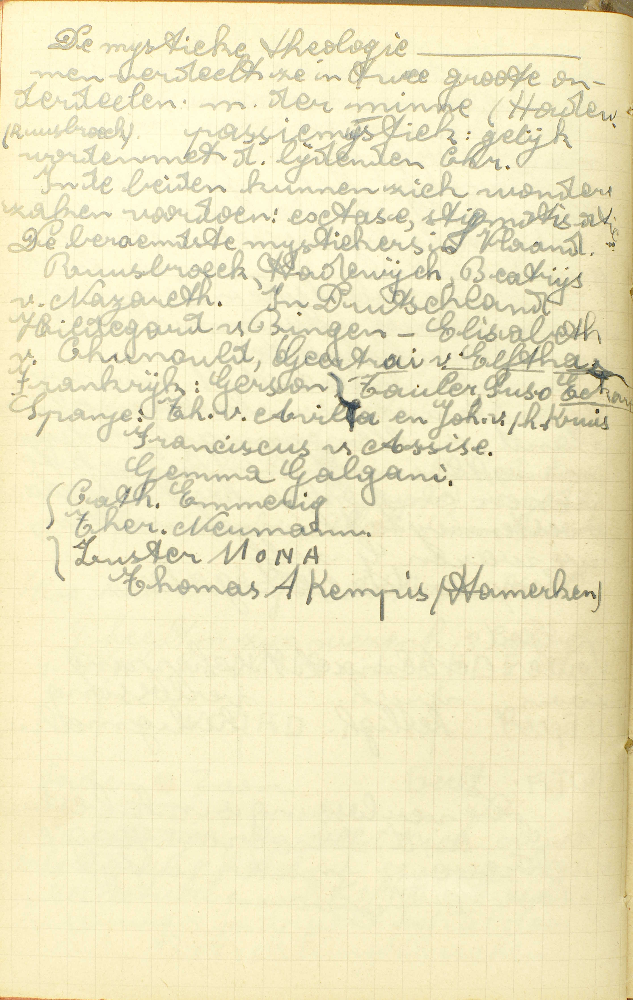

<table>
<tr>
  <td rowspan=4>**Ik geloof in God**</td>
  <td rowspan=4 class=accolade></td>
  <td colspan=2>Natuur van God</td>
  <td colspan=3>*[Wat is God?](#wat-is-god)*</td>
</tr>
<tr>
  <td rowspan=2 colspan=2>Hoeveelmaal de goddelijke natuur bestaat</td>
  <td rowspan=2>*[Hoeveel goden zijn er?](#hoeveel-goden-zijn-er)*</td>
  <td rowspan=2 class=accolade></td>
  <td>*[Hoe kunnen drie Personen één God wezen?](#hoe-kunnen-drie-personen-één-god-wezen)*</td>
</tr>
<tr>
  <td>*[Wat is de H. Drievuldigheid?](#wat-is-de-heilige-drievuldigheid)*</td>
</tr>
<tr>
  <td colspan=2>Plaats waar God is</td>
  <td>*[Waar is God?](#waar-is-god)*</td>
</tr>
<tr>
  <td rowspan=2>**De Vader**</td>
  <td rowspan=2 class=accolade></td>
  <td rowspan=2>De hoeveelste Persoon in de H. Drievuldigheid</td>
  <td rowspan=2 class=accolade></td>
  <td>*[Welke is de eerste Persoon van de H. Drievuldigheid?](#welke-is-de-eerste-persoon-van-de-heilige-drievuldigheid)*</td>
</tr>
<tr>
  <td>*[Is God de Vader ouder of meerder dan de Zoon of de H. Geest?](#is-god-de-vader-ouder-of-meerder-dan-de-zoon-of-de-heilige-geest)*</td>
</tr>
<tr>
  <td>**Almachtig**</td>
  <td class=accolade></td>
  <td colspan=2>Reden van deze naam</td>
  <td>*[Waarom wordt God de Vader, meer dan de Zoon, almachtig genoemd?](#waarom-wordt-god-de-vader-meer-dan-de-zoon-almachtig-genoemd)*</td>
</tr>
</table>

# Wat is God?

## De Schepper, Heer en Regeerder van hemel en aarde, de Fontein van onze zaligheid en ons opperste Goed

  
  <em>Bepalingen: 1ᵉ Met betrekking met wat buiten hem is (werken). 2ᵉ Begrip opgebouwd uit negatieve elementen (alwijze, almachtige, algoede - wijzer dan ik, machtiger dan ik, beter dan ik). 3ᵉ Poging tot begripsvorming met positieve elementen: a) Mechelse Catechismus: zuivere geest (iets positiefs). b) Het begrip van Gods naam Jahweh: die is (de bennende), het zuivere "ZIJN". Hij bij wie de essentie is te *zijn.* De zuivere Akt in wien been essentie. Bij ons het verschil tussen essentie en existentie (wezen en bestaan). Bij God is de essentie de existentie (wezen en bestaan) en ook dit begrip is tenslotte analogisch opgebouwd, d.i. wij gaan altijd uit van menselijke elementen die wij transponeren in het oneindige en in het bovenzinnelijke, zodanig dat we moeten zeggen: goed, machtig, ja God is dat, maar dan toch niet gelijk bij ons, wij kunnen van God alleen analogisch spreken. Sommigen: Wij kunnen over God de juiste woorden niet gebruiken, maar wij kunnen er analogisch gedachten over geven. </em>
  
  <em>Zij die ons over de zaak een menselijke uitdrukking geven, zonder de zaak volkomen te bevatten (agnosticisme). Bepaling van God in "Lucifer". Bestaan van God 1) Het bestaan van het leven op aarde. 2) Vroeger bestond er geen leven op aarde. Bewijzen: a) Uit de wetenschappelijke redenering: Astronomie en astrofysica leert dat de aarde gegaan is van de allerlaagste tot de allerhoogste warmte. In zulke temperatuur is alle leven onmogelijk. b) Wetenschappelijke experimenten: Aardkunde, experiment van de hoogste aardlagen tot de primaire rots stelt vast dat het leven langzaam verdwijnt om in de laatste rotslagen volkomen op te houden. De geologie toont aan dat er op aarde geen spoor van leven was. 3) Waar er geen leven is, komt er vanzelf nooit leven, m.a.w. alle auto-genesis is vals bevonden. Dit bewijzen wij door de biologie, ondermeer door de proeven van Pasteur. Dus: het leven komt voor van iemand die het geven kan - God.</em>
  
  <em>4) Kritiek: a) Er bestaat nu leven op aarde (Hegel). Leven: wij kennen geen levende stoffen, maar wel stoffen die leven bevatten; "Beweging uit zichzelf" is vals; beweging in ionen en electronen: beweging ontleend? Leven is in cyclus werken, zodanig dat *het ene het andere produceert,* dus een gedurig groeiproces, een gesloten kring; en dit leven werkt in op de dode stoffen (atoom ijzer *blijft alleen, groeit niet aan, alleen affiniteit vergroot of verkleint* bij warmte of koude). Bij de dood is het *scheikundig leven* niet verloren, doch het geheimzinnige is verdwenen. b) Dat is een dogma voor de wetenschap; kan niet in twijfel getrokken worden. c) Waar geen leven is, komt er vanzelf geen. De wetenschapsmens weet dat het zo is (filosoof kan het niet aanvaarden). Proef van Pasteur (Recept om muizen te maken - Middeleeuws). d) Besluit: *Er moet dus een wezen zijn dat het leven bezit en kan geven.* Het leven hier is gekomen van een andere wereld - Op die andere wereld hetzelfde toepassen (door siderale koude) (in contact met ander hemellichaam). Het leven komt van een wezen dat het leven niet heeft (filosofie).</em>

A. God is de **Schepper:** degene die een wezen van niet maakt, zonder voorbestaande stof, door zijn enkelen wil, — **Heer:** bezitter of eigenaar — en **Regeerder:** bestierder **van hemel en aarde:** van al wat buiten Hem bestaat, of van hemel en aarde met al wat zij bevatten, te weten: engelen, mensen, dieren, planten, zon, maan, sterren, zee enz, — **de Fontein van onze zaligheid:** de oorsprong van ons eeuwig geluk en van de hulp die wij nodig hebben om dat geluk te bekomen, — **en ons opperste Goed:** Hij zelf of het aanschouwen aanschijn aan aanschijn van zijn volmaaktheden maakt onze zaligheid of ons eeuwig geluk uit; dit aanschouwen is het grootste geluk dat de mens kan bezitten, en zelfs een gans bovennatuurlijk geluk: wij zijn er immers enkel uit loutere goedheid Gods toe geroepen.

De drie eerste hoedanigheden zeggen ons, wat God is *ten opzichte van alle schepselen,* en de twee laatste, wat Hij is *ten opzichte van onze zaligheid.* Alle vijf zijn allernauwst met elkander verbonden: wie de *schepper* is van hemel en aarde, is er ongetwijfeld de *heer* van; want, wie door zich zelf iets maakt, is de eigenaar, de meester van zijn werk; dan, de heer van iets is er ook de *regeerder* van, daar het bestier aan de oppermeester toebehoort; eindelijk moet de schepper, de eerste oorsproug van alles, ook de *fontein* of de bron zijn van ons eeuwig geluk en van de daartoe te gebruiken middelen, alsmede *ons opperste goed;* want, als oorsprong van al het geschapene, moet hij alle andere zaken in grootheid, schoonheid, waardigheid en aangenaamheid oneindig overtreffen.

Wij weten nu wat God is ten opzichte van al hetgeen *buiten Hem bestaat. In zich zelf* is Hij *een enkele geest van oneindige volmaaktheid.* Door de woorden: *een enkele geest,* onderscheiden wij Hem van al de wezens die een lichaam hebben, en door die *van oneindige volmaaktheid,* van de engelen, die ook geesten zijn, maar slechts een beperkte volmaaktheid hebben.

Dat er een God bestaat, schepper van hemel en aarde, weten wij niet alleen door het Geloof, maar ook door onze rede. Inderdaad, wij zien heel klaar, dat al hetgene niet noodzakelijk bestaat, of zou kunnen niet bestaan, een oorzaak vraagt: zoo, als wij getuige zijn van een brand, zoeken wij er natuurlijk de oorzaak van. Welnu, er is niets op de aarde dat noodzakelijk bestaat, en zo de eerste oorzaak van al de andere dingen wezen kan, want al wat wij hier kennen, zou kunnen niet bestaan en is veranderlijk. Daarom moeten wij besluiten, dat er, buiten deze wereld, een eerste oorzaak bestaat, die alles geschapen heeft, en die bijgevolg God is. 

# Hoeveel goden zijn er?

## Daar is maar één God; zó nochtans dat er drie Personen zijn, te weten: de Vader, de Zoon en de H. Geest

  
  <em>Filosofische elementen Inderdaad het is onmogelijk dat een oneindige reeks van zulkdanige wezens hun oorzaak niet hebben in zichzelf, zou voldoende zijn om het bestaan te kunnen verklaren. Inderdaad gezien bij definitie zelf, elke schakel in die reeks is eindig, en dus volstaat de hele reeks niet. (alle eindigheden zijn nog geen oneindigheid). Het argument van de graden van zijn. In elk wezen stellen wij vast een graad van volmaaktheid. Die graad correspondeert met een graad van zijn. Wij stellen vast dat die graad beperkt isen dat er in de wereld een schaal van graden vast te stellen is. Welnu, die beperking is niet te verklaren uit het wezen zelf, want had het wezen die volmaaktheid uit zichzelf, dan ware die graad onbeperkt. Die graad van zijn is een medegedeelde graad, die noodzakelijk een wezen veronderstelt dat hoogtepunt en uitgangspunt van al die graden is. Dit wezen noemen wij God. De loochening van dit argument slaat ons zelf in. Velen begrijpen het niet en die het begrijpen nemen het 95% aan.</em>

A. **Daar is maar — één God:** een goddelijk wezen of natuur; **zó nochtans dat er drie Personen zijn:** hoewel er nochtans drie verscheidene goddelijke Personen bestaan, die dat één goddelijk wezen of natuur hebben, **te weten: de Vader, de Zoon en de H. Geest.**

Men bemerke wel, dat deze twee punten: *één God en drie goddelijke Personen,* niet met elkander strijden; want, door *één God,* verstaan wij één goddelijk wezen of natuur, en, door *drie goddelijke Personen,* niet drie goddelijke wezens of naturen, maar drie ware goddelijke Personen. Welnu, natuur of wezen en persoon zijn gans verschillende zaken: door *natuur* betekenen wij hetgene, waardoor een zaak zulk een zaak is en niet een andere: zo is de natuur van een boom datgene, waardoor hij *boom,* en niet steen of dier of iets anders is: de natuur van een mens is datgene, waardoor hij *mens* is, te weten, zijn ziel en zijn lichaam; maar door *persoon* duiden wij een redelijke natuur aan, die op zich zelve of onafhankelijk van andere bestaat en werkt.

# Hoe kunnen drie Personen één God wezen?

## Omdat zij alle drie maar één en hetzelfde goddelijk wezen of natuur hebben

  
  <em>De praktische atheïst loopt er veel, de theoretische is er weinig: iemand die door redenering en verstand atheïst is, ze zijn zeldzaam, maar ze zijn er toch, ze worden veel op bedrog gepakt (en geloven ze 't dan zelf). God heeft een bepaalde wereld gekozen, hierin zal A gered zijn en B verdoemd. Waarom heeft God *die* wereld gekozen? God is vrij in zijn keuze en Hij heeft die wereld gekozen, waarin de mens zijn zaligheid *vrij* kan bewerken. Waarom Vrij? God heeft een grote eerbied voor de menselijke persoon en dat was in eze wereld. Sommigen zeggen dat er meer verdoemden dan geredden zijn, dit zou de keuze van God [zijn]. Wij kunnen niet zondigen zonder God; geen fysieke zaak is kwaad, wij misvormen ze (dit komt van ons).</em>
  
  <em>In het Oude Testament geen enkel zeker bewijs. In het Nieuwe Testament de boodschap aan Maria, in het doopsel van Christus, Christus' woorden voor de Hemelvaart (doopt hen in de naam...), heel dikwijls in het St.-Jansevangelie (hoofdstuk 14-15-16), dikwijls bij Paulus, van de 2ᵉ persoon 2 Kor 13:13, komt voor in de oudste overlevering, de Didachè, oudste doopsymbola en bij al de heilige Vaders.  In de heidense wereld: Trimurti, een soort van drie oppergoden; Brahma-Vishnu-Krishna (Hindoes), Ra-Isis-Osiris (Egypte), vergoddelijking van het familiaal systeem (man-vrouw-kind).  Hoe kunnen wij ons dat voorstellen. God heeft in zijn wezenheid 3 uitingen: ZIJN (Vader) - KENNIS/WOORD (Zoon) - LIEFDE (Geest). God is *het* zijn, hij kent zich van in alle eeuwigheid (het eeuwige zijn is intellectueel en volitief), die kennis van het eeuwig zijn drukt hij uit door het woord.</em>
  
  <em>Betrekking tussen zijn en kennis geeft de liefde. En deze drie relaties zijn, woord en liefde zijn personen. Kennis, wil en zijn ben *ik*, maar bij God zijn het personen en daar ligt het mysterie. Wat is bij God een *persoon*, 't is zeker niet zoals bij ons (ook niet in figuurlijke zin). In de natuurlijke orde zijn er veel mysteries, waarom  niet in de bovennatuurlijke orde. Er moeten inderdaad mysteries zijn, wij beperkte wezens, in bestaan en verstand, zullen onmogelijk kunnen vatten wat het onbeperkte wezen heeft uitgedacht; moesten wij dat kunnen bevatten, we waren God zelf. "Comprendre c'est égaler".  God: Vader-Almacht-schepping, Zoon-wijsheid-verlossing, Heilige Geest-heiligheid-heiligmaking NOTA: De verlossing is in het besluit van God aan de drie personen toegeschreven, maar uitgewerkt door God de Zoon. </em>
  
  <em>De mystieke theologie, men verdeelt ze in twee grote onderdelen: mystiek van de minne (Hadewijch, Ruusbroek) en passiemystiek: gelijk worden met de lijdende Christus. In de beiden kunnen zich wondere zaken voordoen: extase, stigmatisatie. De beroemdste mystici in Vlaanderen: Ruusbroek, Hadewijch, Beatrijs van Nazareth. In Duitsland: Hildegard von Bingen, Elisabeth von Schönau, Geertrui van Helfta, Seuse. Frankrijk: Gerson, Tauler, TODO. Spanje: Theresia van Ávila en Johannes van het Kruis. Franciscus van Assisi, Gemma Galgani, Catherine Emmerich, Therese Neumann, Zuster Mona, Thomas a Kempis (Hamertje). </em>

A. **Omdat zij alle drij,** niet elk een verscheiden, **maar** slechts **één en hetzelfde goddelijk wezen of natuur hebben.** Deze reden is klaarblijkend: inderdaad, verscheidene mensen zijn niet *één mens,* maar *verscheidene mensen,* omdat ieder van hen zijn eigen en van de andere personen verscheidene natuur heeft; integendeel iedere goddelijke Persoon heeft geen eigeneen van de andere Personen verscheidene natuur, want zij hebben alle drie maar één en hetzelfde goddelijk wezen of natuur, en zo zijn er niet drie goden of drie goddelijke naturen, maar één God, een goddelijke natuur.

Deze waarheid: *drie goddelijke Personen en één God,* is een waar mysterie (zie [2ᵉ les, 6ᵉ v.](les-02.html#wat-betekenen-wij-door-het-maken-vas-het-heilig-kruis)), dat wij maar in de hemel klaar zullen verstaan.

# Waar is God?

## In de hemel, op de aarde en op alle plaatsen

A. **In de hemel:** in de plaats van de gelukzaligen, **op de aarde:** hier op deze wereld, **en op alle plaatsen:** op al de andere bestaande plaatsen, zoals de hel en het vagevuur. Hij is dus overal.

God is overal tegenwoordig 1° met zijn wezen of natuur, 2° met zijn alziende oog en 3° met zijn macht. De mens is met zijn natuur slechts tegenwoordig op de plaats die door zijn lichaam ingenomen wordt; maar God is met zijn wezen op alle plaatsen. De mens is met zijn kennis slechts in een beperkten kring aanwezig; God echter omvat met zijn oneindige wijsheid alle plaatsen, De mens kan met zijn macht maar op kleinen afstand iets teweegbrengen; God integendeel oefent zijn macht op alle plaatsen uit met alles te bestieren en te bewaren.

# Wat is de Heilige Drievuldigheid?

## God de Vader, God de Zoon, en God de H. Geest; drie Personen en één God

V. De zin is: wat verstaat men door de H. Drievuldigheid?

A. Hierdoor verstaat men het mysterie, waar reeds herhaalde malen van gesproken is, te weten: **God de Vader, God de Zoon, en God de H. Geest; drie Personen en één God.** Het woord *Drievuldigheid,* aangenomen om dit mysterie te benoemen, betekent uit zich zelf een wezen dat, onder een opzicht, één en, onder een ander, drievuldig is.

# Welke is de eerste Persoon van de Heilige Drievuldigheid?

## God de Vader, die het beginsel en de oorsprong is van de andere twee Personen

A. De reden dus waarom God de Vader de eerste Persoon is van de H. Drievuldigheid, bestaat hierin, dat Hij **het beginsel en de oorsprong is van de andere twee Personen.** Hij is hun beginsel met hun oorsprong te zijn; beiden immers komen van Hem voort: de Zoon komt voort van de Vader door het *verstand,* want Hij is het oneindig volmaakt denkbeeld, dat de Vader van zich zelf heeft; de H. Geest komt voort van de Vader en de Zoon door de *wil* of door de *liefde,* want Hij is de liefde van de Vader en van de Zoon tot elkander.

Men bemerke dat het leven van alle wezens die met kenvermogen begaafd zijn, in deze drie akten geheel besloten ligt: de daad van te kennen, het gedacht van de gekende zaak en de liefde tot het gekende, en dat er zo in God, in wie die akten personen uitmaken, noodzakelijk drie personen zijn, maar dat er niet meer dan drie kunnen zijn.

# Is God de Vader ouder of meerder dan de Zoon of de Heilige Geest?

## Neen; want gelijk zij maar één goddelijk wezen hebben, zo zijn zij alle drie even oud of eeuwig, wijs en machtig

A. **Neen,** de drie goddelijke Personen **zijn alle drie even oud of eeuwig, wijs en machtig,** omdat **zij maar één goddelijk wezen hebben.** Deze reden is zeer duidelijk: de hoedanigheden van ouderdom, wijsheid en macht hangen van de natuur af; bijgevolg moeten de drie goddelijke Personen noodzakelijk even oud of eeuwig, wijs en machtig zijn, aangezien zij alle drie maar één en hetzelfde goddelijk wezen of natuur hebben. Waren er twee menselijke personen, hebbende één en dezelfde natuur, zij zouden ook noodzakelijk even oud, wijs en machtig zijn. De *eeuwigheid* van God is hierin gelegen, dat zijn bestaan zonder begin, zonder einde en zonder opvolging van stonden is.

# Waarom wordt God de Vader, meer dan de Zoon, almachtig genoemd?

## Niet omdat Hij machtiger is, maar omdat de macht Hem bijzonder wordt toegeschreven; gelijk ook de wijsheid de Zoon, en de heiligheid de H. Geest

V. **Waarom wordt God de Vader,** in het Symbolum, **almachtig genoemd meer dan de Zoon,** wie deze naam daarin niet gegeven wordt?

A. **Niet, omdat hij — machtiger ís:** wezenlijk meer macht heeft dan God de Zoon, **maar omdat de macht Hem,** in de Christelijke Leer, wij zeggen niet *uitsluitelijk,* maar **bijzonder:** op een bijzondere wijze **wordt toegeschreven; gelijk** daarin ook **de wijsheid de Zoon, en de heiligheid de H. Geest** bijzonder toegekend worden.

Door *macht, wijsheid* en *heiligheid* verstaan wij hier niet alleen deze hoedanigheden zelven, maar ook de werken die er uit voortspruiten. De werken van almacht, zoals het scheppen, worden aan God de Vader toegeschreven; de werken, waar in het bijzonder wijsheid of verstand in uitschijnt, zoals het goddelijk bestier van de wereld, aan God de Zoon; en die, waar Gods liefde zich meest in vertoont, zoals het uitdelen van de gratiën, aan God de H. Geest. De *macht* wordt de Vader bijzonder toegeschreven, omdat Hij het beginsel en de oorsprong is van de andere twee Personen, en dat door die macht van voortbrenging God alle dingen kan maken en te niet doen; de *wijsheid* de Zoon, omdat Hij van de Vader voortkomt door het verstand en het denkbeeld is dat deze van zich zelf heeft, en dat God door dit denkbeeld alles kent, en de *heiligheid* de H. Geest, omdat Hij de liefde is van de Vader en van de Zoon, en Gods heiligheid in die liefde gelegen is; en dat God door zijn heiligheid alle goed bemint dat Hij bemint, en alle weldaden vergunt die Hij vergunt.

### VRAGEN

Welke woorden van het Symbolum worden hier uitgelegd? — Wat onderzoekt de Catechismus nopens ieder punt?

1. Leg de woorden uit: *de Schepper, de Heer, de Regeerder van hemel en van aarde, de Fontein van onze zaligheid, en ons opperste Goed.* — Toon hoe al deze hoedanigheden van God onder elkander verbonden zijn. — Onder welk betrek leren wij in dit antwoord God kennen? — Wat is God in zich zelf beschouwd? — Waardoor is Hij in deze laatste beschrijving onderscheiden van de lichamelijke wezens en van de Engelen? — Kennen wij God uitsluitend door het Geloof, of ook door onze rede? — Hoe bewijzen wij zijn bestaan door de rede?

2. Als men zegt: *daar is maar één God,* wat verstaat men door het woord God? — Hoeveelmaal bestaat de goddelijke natuur? — Hoeveel goddelijke Personen zijn er, en welk is hun naam? — Zijn deze twee punten: *één God en drie Goddelijke Personen* niet tegenstrijdig, en waarom niet? — Wat verstaat men door *natuur,* en wat door *persoon?*

3. Welk is de zin van de vraag: *Hoe kunnen drie Personen één God wezen?* — Hoe antwoordt de Catechismus op deze vraag? — Toon dat het antwoord van de Catechismus geldig is, en verklaar het door een voorbeeld. — Kunnen wij met ons verstand begrijpen, dat er in één God drie goddelijke Personen zijn? — Toon dat deze waarheid een *mysterie* is. — Waar zullen wij dit mysterie verstaan?

4. Wat verstaat men door *hemel, aarde* en *alle plaatsen?* — Is er een plaats waar God niet is? — Op welke wijze is God overal tegenwoordig? — Maak een vergelijking tussen de tegenwoordigheid van de mens en die van God.

5. Hoe noemt men dit mysterie: *drie Personen en één God?* — Wat betekent het woord *Drievuldigheid* uit zijn natuur, en hoe is het aangenomen om het gezegde mysterie uit te drukken?

6. Noem de eersten Persoon van de H. Drievuldigheid. — Waarom is Hij de eerste? — Leg de woorden uit: *beginsel en oorsprong.*  — Hoe is Hij het beginsel van de andere twee Personen?

7. Brengt het vaderschap van God de Vader niet mede, dat Hij ouder of meerder is dan de Zoon of de H. Geest? — Geef volgens de Catechismus de reden hiervan. — Toon dat deze reden geldig is; en verklaar ze door een voorbeeld. — Waarin is de eeuwigheid van God gelegen?

8. Welke naam wordt aan God de Vader in het Symbolum gegeven? — Wat betekent die naam voorzeker niet, en waarom is hij aan God de Vader gegeven? — Wat wordt er toegeschreven aan God de Zoon en wat aan de H. Geest? — Wat verstaat men hier door *macht, wijsheid* en *heiligheid?* — Waarom worden die drie dingen aan de verscheidene goddelijke Personen toegeschreven? — Wordt iedere hoedanigheid uitsluitelijk aan één Persoon toegeschreven?

