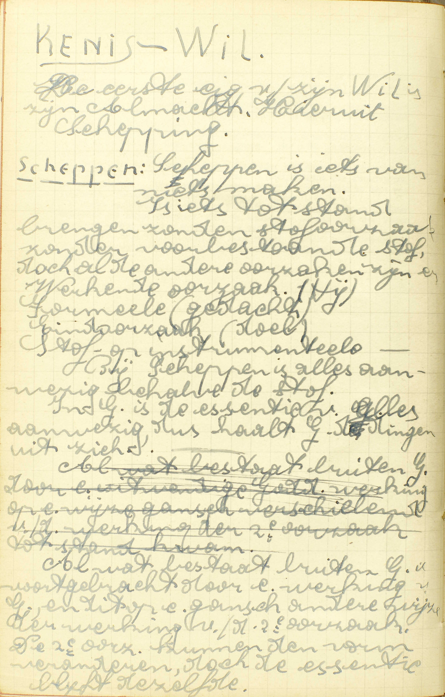
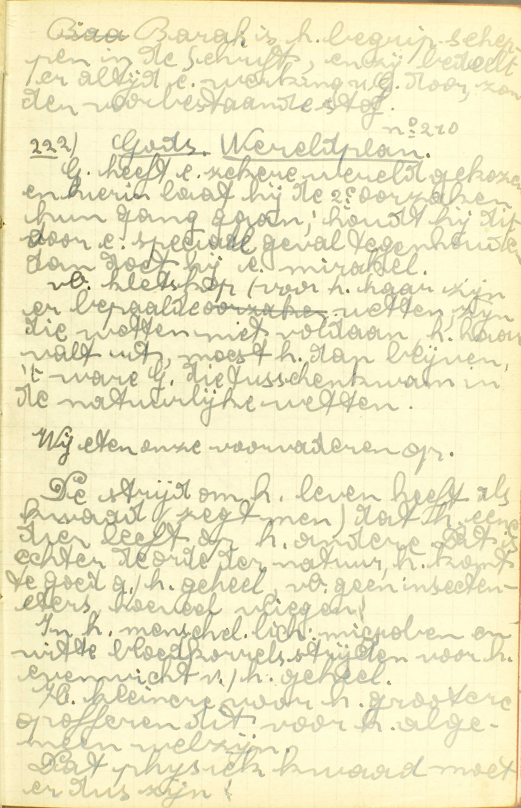
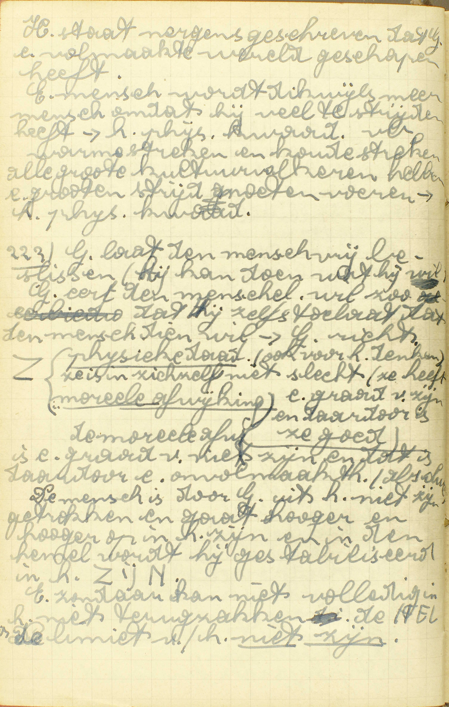
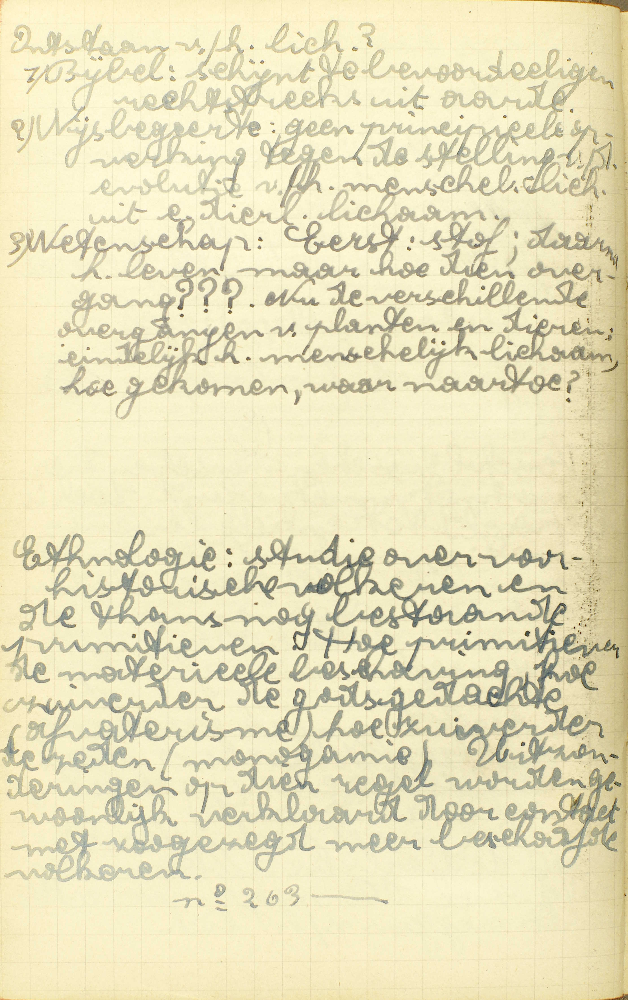
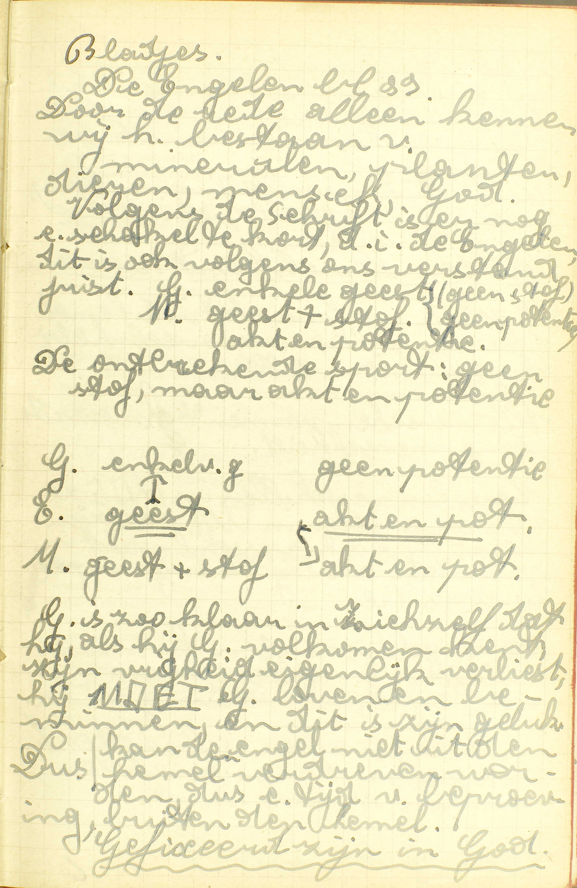
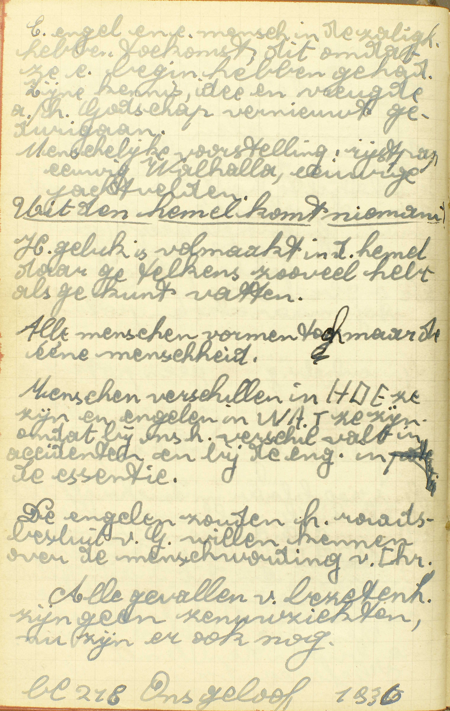
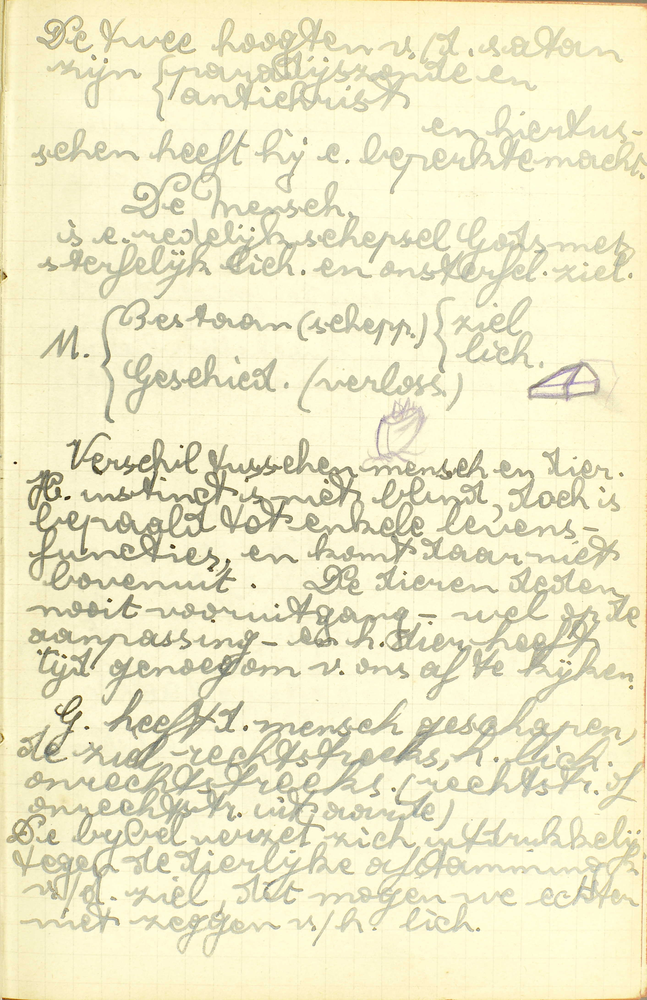

<table>
<tr>
  <td rowspan=2>**Almachtig**</td>
  <td rowspan=2 class=accolade></td>
  <td colspan=4>Reden van deze naam</td>
  <td>*[Waarom wordt God genoemd almachtig?](#waarom-wordt-god-genoemd-almachtig)*</td>
</tr>
<tr>
  <td colspan=4>Duidelijkste werk van Gods almacht</td>
  <td>*[Waarin heeft God zijn almachtigheid meest getoond?](#waarin-heeft-god-zijn-almachtigheid-meest-getoond)*</td>
</tr>
<tr>
  <td rowspan=6>**Schepper van hemel en aarde**</td>
  <td rowspan=6 class=accolade></td>
  <td rowspan=6>Voornaamste schepselen</td>
  <td rowspan=6 class=accolade></td>
  <td colspan=2>De mensen</td>
  <td>*[Waarvan heeft God de mens gemaakt?](#waarvan-heeft-god-de-mens-gemaakt)*</td>
</tr>
<tr>
  <td rowspan=5>De engelen</td>
  <td rowspan=5 class=accolade></td>
  <td>*[Waar zijn de Engelen gemaakt en waarvan?](#waar-zijn-de-engelen-gemaakt-en-waarvan)*</td>
</tr>
<tr>
  <td>*[Zijn de Engelen samen in de hemel gebleven?](#zijn-de-engelen-samen-in-de-hemel-gebleven)*</td>
</tr>
<tr>
  <td>*[Welk is het ambt van de Engelen?](#welk-is-het-ambt-van-de-engelen)*</td>
</tr>
<tr>
  <td>*[Zijn er Engelen die ons bewaren?](#zijn-er-engelen-die-ons-bewaren)*</td>
</tr>
<tr>
  <td>*[Welk is het ambt van de Engel, onze bewaarder?](#welk-is-het-ambt-van-de-engel-onze-bewaarder)*</td>
</tr>
</table>

# Waarom wordt God genoemd almachtig?

## Omdat Hij met zijn goddelijke wil alle dingen kan maken en ook te niet doen

  
  <em>Bij Scheppen is alles aanwezig, behalve de stof. In God is de essentie van alles aanwezig, dus haalt God alle dingen uit zich.</em>
  
  <em>God heeft een zekere wereld gekozen en hierin laat hij de 2ᵉ oorzaken hun gang gaan; houdt Hij dit voor een speciaal geval tegen, dan doet hij een mirakel.</em>
  
  <em>De mens is door God uit het niet-zijn getrokken en gaat hoger en hoger op in het zijn en in de Hemel wordt hij gestabiliseerd in het ZIJN. Een zondaar kan niet volledig in het niets terugzakken: de HEL is de limiet van het niet-zijn.</em>

A. Er zijn dus drie dingen vereist om almachtig te zijn:

1° **Dingen kunnen maken en ook te niet doen;**

2° Kunnen maken en te niet doen **alle dingen,** die in zich zelf mogelijk zijn en niet met de opperste volmaaktheid van een almachtig wezen strijden. God kan b.v. geen bergen maken zonder valleien, omdat dit in zich zelf onmogelijk is; Hij kan ook niet zondigen, omdat de zonde met zijn opperste volmaaktheid strijdt.

3° Alle dingen kunnen maken en ook te niet doen **met zijn wil** alleen, zonder daartoe iets dat vooraf bestaat, te gebruiken.

Noch mens noch engel, maar God vervult deze drie voorwaarden, en daarom wordt Hij almachtig genoemd.

# Waarin heeft God zijn almachtigheid meest getoond?

## In het scheppen of van niet te maken hemel en aarde en al wat er in is

V. **Waarin:** in welk uitwendig werk **heeft God zijn almachtigheid meest getoond:** op de klaarste wijze doen uitschijnen ?

A. **In het scheppen of van niet te maken:** scheppen dus is iets van niet maken, iets maken zoader daartoe een reeds bestaande stof te gebruiken, iets door de wil alleen tot het bestaan brengen; **hemel en aarde, en al wat er in is:** al wat buiten God bestaat. De uitdrukking *hemel en aarde* betekent gewoonlijk alle zichtbare en onzichtbare dingen die buiten God bestaan.

God heeft zijn almachtigheid in het scheppen van hemel en aarde waarlijk getoond, aangezien Hij wezenlijk hemel en aarde gemaakt heeft, ze gemaakt heeft door zijn wll alleen, en in die schepping alle slag van wezens tot het bestaan geroepen heeft: engelen, mensen, dieren, planten en levenlooze zaken. Hij heeft zijn almachtigheid daarin *meer* getoond dan in zijn andere zichtbare werken, zoals in het bestieren en bewaren van de wereld en in de mirakelen, omdat hij hierin ofwel zijn werk niet uit niet trekt, ofwel niet allerhande dingen maakt, gelijk in de schepping van hemel en aarde.

# Waarvan heeft God de mens gemaakt?

## Hij heeft het lichaam van Adam gemaakt van aarde, en een ziel daarin gestort; maar Eva van een rib genomen uit Adam

  
  <em>Ethnologie: studie over voor-historische volkeren en de thans nog bestaande primitieven. Hoe primitiever de materiële beschaving, hoe zuiverder de godsgedachten, hoe zuiverder de zeden. Uitzonderingen op die regel worden gewoonlijk verklaard door contact met zogezegd meer beschaafde volkeren.</em>

V. De zin is: waaruit heeft God de eerste mensen gemaakt, van welke het hele mensdom voortkomt: heeft Hij ze onmiddellijk van niet gemaakt, ofwel uit een reeds geschapene stof, en, zo ja, uit welke stof? — Men bemerke hier wel dat de mens gemaakt is door God, die hemel en aarde geschapen heeft met al wat er in is; dat hij bijgevolg noch uit zijn eigen bestaat, noch van eenig ander schepsel van de aarde of van de hemel voortkomt.

A. **God heeft het lichaam van Adam,** de eersten man, **gemaakt — van aarde:** van de aarde namelijk, in ‘t begin van de schepping van niet voortgebracht; **en een ziel daarin gestort:** en een ziel, gemaakt niet uit aarde of iets anders, maar van niet, in dat gevormd lichaam gestort; **maar Eva van een rib genomen uit Adam:** maar het lichaam van Eva, de eerste vrouw, heeft God gemaakt uit een rib van Adam, en in dat gevormd lichaam heeft Hij een ziel gestort, gelijk Hij voor Adam gedaan had.

Adam en Eva werden geschapen in een zeer gelukkigen staat naar ziel en lichaam, want God gaf hun niet alleen al hetgeen tot een volmaakte menselijke natuur vereist is, te weten: een redelijke ziel, een lichaam, al het noodwendige om het leven te onderhouden met de hoop van, na de dood, een beter leven te bekomen; maar, uit een onbegrijpelijke goedheid, verleende Hij hun daarbij nog *boven-* en *buitennatuurlijke gaven,* waardoor zij tot de waardigheid van aangenomene kinderen Gods en erfgenamen van de hemel verheven werden, of waardoor zij, hier op aarde deelachtig gemaakt werden aan Gods goederen, alsof zij zijn eigen kinderen waren, en, voor het toekomende leven, het recht verkregen,in de hemel de goederen te erven die zijn eigen geluk uitmaken.

Door *bovennatuurlijke gaven* verstaat men zulke gaven die te boven gaan al hetgeen aan geschapene wezens, hoe volmaakt ook, toekomt of toebehoort. *Buitennatuurlijke gaven* integendeel zijn diegene welke eigenlijk niet aan de natuur die ze ontvangt, maar aan een verhevener geschapene natuur toebehooren.

De *bovennatuurlijke gaven* die zij ontvingen, waren de heiligmakende gratie en al de bovennatuurlijke deugden en gaven van de H. Geest met het recht tot de nodige dadelijke gratiën.

De *buitennatuurlijke gaven* waren de onsterfelijkheid, een zeer uitgestrekte wetenschap, de bevrijding van de ongeregelde begeerlijkheid en van de ellenden onzes levens hier op aarde.

Deze buitengewone gaven ontvingen zij niet alleen voor zich zelven, maar voor geheel hun nakomelingschap; doch op deze voorwaarde, dat zij, om die gaven voor zich zelf en hun nakomelingen te behouden, hun gehoorzaamheid aan God zouden betonen met niet te eten van de vrucht eens booms staande te midden van het Paradijs. Adam en Eva aten van de verbodene vrucht en verloren zoo, voor zich zelf en geheel hun nakomelingschap, al die buitengewone gaven.

# Waar zijn de Engelen gemaakt en waarvan?

## De Engelen heeft God van niet gemaakt in de hemel

  
  <em>Door de rede alleen kennen wij het bestaan van mineralen, planten, dieren, mens, God. Volgens de Schrift is er nog een schakel tekort, d.i. de engelen. Dit is ook volgens ons verstand juist. God enkel geest (geen stof, geen potentie). Mens geest + stof (akt en potentie). De ontbrekende sport: geen stof, maar akt en potentie.</em>
  
  <em>De engelen zouden het raadsbesluit van God willen kennen over de menswording van Christus.</em>

V. De Engelen hebben geen lichaam, maar zijn *enkele geesten* met rede en verstand begaafd. Het woord *engel* betekent eigenlijk *bode, afgezant.*

A. **De Engelen heeft God gemaakt:** dus zij ook bestaan uit zieh zelf niet, noch zijn van eenig ander geschapen wezen, maar wel van God gemaakt, en dat **van niet:** door zijn enkelen wil, zonder daartoe iets te gebruiken dat reeds bestond; **in de hemel:** in de plaats waar de gelukzaligen verblijven. Doch niet van het hegin van hun schepping genoten de Engelen daar het geluk van God aanschijn aan aanschijn te aanschouwen, maar hebben dat eerst, gedurende een zekeren proeftijd, moeten verdienen door God te eeren en te loven,

Het *getal* van de Engelen is zeer groot. Zij worden gewoonlijk verdeeld in *negen koren,* waarvan de hoogste zijn de Serafijnen, de Cherubijnen en de Tronen.

# Zijn de Engelen samen in de hemel gebleven?

## Neen; want de ongehoorzame en hoogmoedige zijn daaruit gedreven in de afgrond van de hel

  
  <em>God heeft de mens geschapen, de ziel rechtstreeks, het lichaam onrechtstreeks. De Bijbel verzet zich uitdrukkelijk tegen de dierlijke afstamming van de ziel, dit mogen we echter niet zeggen van het lichaam.</em>

A. **De ongehoorzame en hoogmoedige:** de Engelen die, gedurende hunn proeftijd, met zich aan God niet te willen onderwerpen, in hoogmoedigheid, en van daar in ongehoorzaamheid vielen, **zijn daaruit gedreven in de afgrond van de hel:** zijn, tot straf van hun zonde uit de hemel gejaagd, en in de afgrond geworpen van de plaats, waar God de verdoemden eeuwig straft. Van toen af genieten de getrouwe Engelen, tot loon van hun deugd, het geluk van God voor eeuwig te mogen aanschouwen.

# Welk is het ambt van de Engelen?

## God te dienen en te loven, en de mensen behulpig te wezen

V. **Het ambt,** d.i. de bediening.

A. De Engelen hebben plichten jegens God en jegens de mensen:

1° *Jegens God:* zij moeten Hem a) **dienen:** zijn wil volbrengen, onder andere, met zijn gezanten te zijn, om welke bediening juist zij de naam van *Engelen* ontvangen hebben; b) **loven:** Hem erkennen en eeren als de Schepper, Heer en Regeerder van hemel en aarde, de Fontein van hun zaligheid en hun opperste Goed.

2° *Jegens de mensen:* zij moeten hun **behulpig wezen:** hun tot hun geluk dienst bewijzen met hen bij te staan in de gevaren van het lichaam en in de kwellingen van de ziel, met voor hen te bidden, met hen te vermanen.

Beide soorten van plichten zijn nauw met elkander verbonden: God immers heeft de mensen tot zijn kinderen aangenomen en bemint ze als zulke; bijgevolg is het onmogelijk Hem te beminnen zonder ook liefde te hebben voor de mensen: wie immers een vader bemint, moet ook diens kinderen beminnen.

# Zijn er Engelen die ons bewaren?

## Ja, en elk heeft één, die hem van het beginsel van zijn levens bewaart

V. **Bewaren** d.i. niet uitsluitend eenigszins behulpig wezen, maar *gedurig bewaken, gedurig beschermen.*

A. **Ja,** er zijn zulke engelen, die gedurig op ons waken, **en elk heeft één, die hem van het beginsel van zijn levens bewaart:** iedere mens heeft een Engelbewaarder, die hem van het begin van zijn levens tot aan zijn dood onophoudelijk bijstaat.

# Welk is het ambt van de Engel, onze bewaarder?

## Ons tegen de bozen vijand te bevrijden, onze gebeden God op te dragen, en in het uiterste onze ziel te beschermen

A. Het ambt van onzen Engelbewaarder is drievoudig:

1° **Ons tegen de boze vijand te bevrijden:** ons te helpen tegen de duivel, die gedurig rondloopt om ons in zonde te doen vallen, en daarom onze *boze vijand* genoemd wordt. De Engelbewaarder doet dit door goede vermaningen, door het afsmeeken van nieuwe gratiën, door van God.verwijdering van de duivel of vermindering van bekoringen te bekomen.

2° **Onze gebeden God op te dragen:** wanneer wij bidden, met ons mee te bidden, en God te smeeken, dat Hij ons zou verhoren.

3° **In het uiterste onze ziel te beschermen:** als wij gaan sterven, ons op een bijzondere wijze te helpen om de duivel te overwinnen, de HH. Sacramenten te kunnen ontvangen en ons tot de dood wel te bereiden, om verduldig te lijden en onzen wil aan God te onderwerpen.

Wat ons betreft, wij ziju onzen Engelbewaarder schuldig: eerbied voor zijn tegenwoordigheid, dankbaarheid voor zijn weldaden en betrouwen voor zijn goedgunstigheid.

### VRAGEN

Welke woorden van het Symbolum worden hier uitgelegd? — Hoe is deze les verdeeld? — Wat onderzoekt de Catechismus nopens ieder hoofdpunt?

1. Wat is er tot de almachtigheid vereist? — Verklaar de woorden: *alle dingen* en *met zijn goddelijke wil.* — Waarom mogen noch de mensen noch de Engelen *almachtig* genoemd worden? — Waarom wordt God met recht *almachtig* genoemd?

2. Zeg de zin van de vraag: *Waarin heeft God zijn almachtigheid meest getoond.* — Wat is *scheppen?* — Zeg, met de woorden van de Catechismus, wat God geschapen heeft; en leg die woorden uit. — Hoe heeft Hij zijn almachtigheid getoond *in het scheppen van hemel en van aarde?* — Hoe heeft Hij ze daarin *meest* getoond?

3. Zeg van wie de eerste mensen voorzeker niet voortkomen, en van wie zij wezenlijk voortkomen, — Van wie stamt geheel het mensdom af? — Hoe heeft God de eerste man gemaakt, en hoe de eerste vrouw? — Wat verschil is er tussen de manier op dewelke God de eerste man, en die op dewelke Hij de eerste vrouw gemaakt heeft? — In welken staat werden zij van God geschapen? — Wat ontvingen zij voor wat de volmaaktheid van de natuur aangaat, en wat nog daarenboven? — Voor wie hebben zij die bijzondere gaven ontvangen, en op welke voorwaarde? — Eiebben zij die gaven bewaard? — Waarin bestaan de bovennatuurlijke gaven, welke zij ontvangen hebben? — Welke buitennatuurlijke gaven hebben zij ontvangen?

4. Wat betekent het woord *engel?* — Wat zijn Engelen! — Zeg mer de woorden van de Catechismus *waar, van wie* en *waarvan* zij gemaakt Vn; en leg het antwoord uit. — Zijn er vele Engelen, en hoe worden zij verdeeld? — Hebben de Engelen van in het begin God aanschijn aan aanschijn gezien?

5. Zijn er Engelen uit de hemel gedreven? — Zeg met de woorden van de Catechismus, welke Engelen er uitgedreven zijn, en leg die woorden uit. — Zeg waar zij gedreven geweest zijn, en verklaar het woord. — Wat hebben de getrouwe Engelen toen ontvangen?

6. Welk is de zin van de vraag: *Welk is het ambt van de Engelen?* — Zeg met de woorder van de Catechismus welk het ambt van de Engelen is, *a*) jegens God en *b*)jegens de mensen, en verklaar het antwoord. — Toon hoe deze twee plichten innig verbonden zijn.

7. Welk is hier de betekenis van het woord *bewaren?* — Zijn er Engelen, die op ons gedurig waken? — Welke mensen hebben een Engelbewaarder, en hoeveel hebben zij er? — Sedert wanneer en tot hoe lang hebben zij een Engelbewaarder?

8. Hoeveel en welke plichten heeft de Engelbewaarder te onzen opzichte? — Leg ieder van die plichten uit. — Wat zijn wij onzen Engelbewaarder schuldig?

