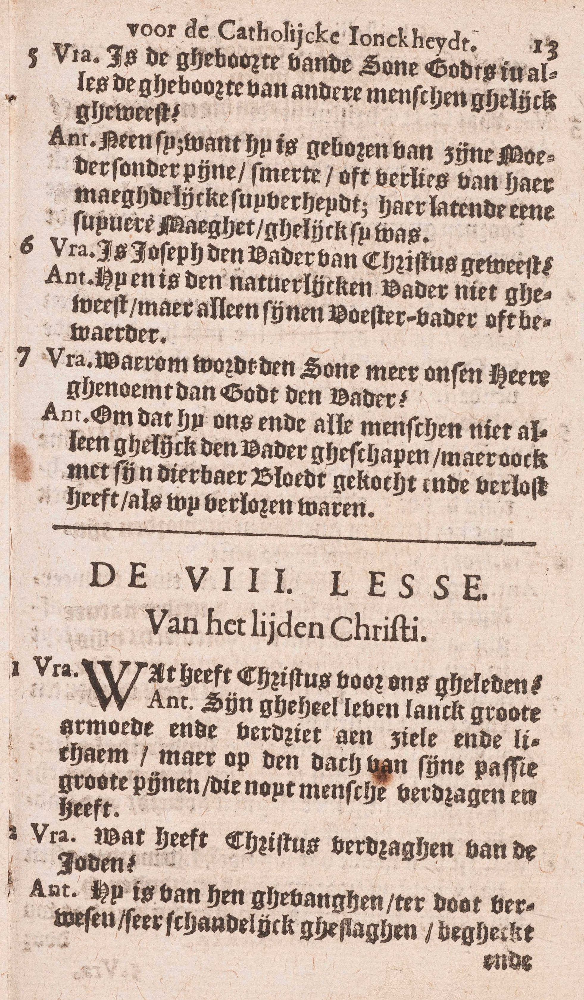
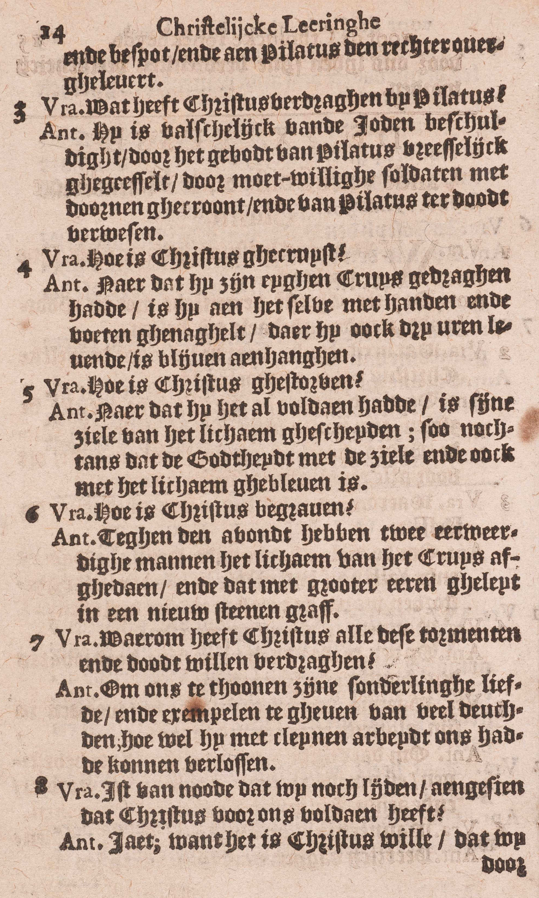

<table>
<tr>
  <td rowspan=8>**Die geleden heeft onder Pontius Pilatus, is gekruisigd, gestorven en begraven**</td>
  <td rowspan=8 class=accolade></td>
  <td colspan=2>Christus' lijden in 't algemeen</td>
  <td>*[Wat heeft Christus voor ons geleden?](#wat-heeft-christus-voor-ons-geleden)*</td>
</tr>
<tr>
  <td rowspan=5>Zijn bitter lijden en dood</td>
  <td rowspan=5 class=accolade></td>
  <td>*[Wat heeft Christus verdragen van de Joden?](#wat-heeft-christus-verdragen-van-de-joden)*</td>
</tr>
<tr>
  <td>*[Wat heeft Christus verdragen bij Pilatus?](#wat-heeft-christus-verdragen-bij-pilatus)*</td>
</tr>
<tr>
  <td>*[Hoe is Christus gekruisigd?](#hoe-is-christus-gekruisigd)*</td>
</tr>
<tr>
  <td>*[Hoe is Christus gestorven?](#hoe-is-christus-gestorven)*</td>
</tr>
<tr>
  <td>*[Hoe is Christus begraven?](#hoe-is-christus-begraven)*</td>
</tr>
<tr>
  <td colspan=2>Reden van zijn lijden en dood</td>
  <td>*[Waarom heeft Christus al deze pijnen en dood willen verdragen?](#waarom-heeft-christus-al-deze-pijnen-en-dood-willen-verdragen)*</td>
</tr>
<tr>
  <td colspan=2>Vrucht daarvan</td>
  <td>*[Is het van node dat wij nog lijden, aangezien dat Christus voor ons voldaan heeft?](#is-het-van-node-dat-wij-nog-lijden-aangezien-dat-christus-voor-ons-voldaan-heeft)*</td>
</tr>
</table>

# Wat heeft Christus voor ons geleden?

## Zijn geheel leven lang grote armoede en verdriet aan ziel en lichaam; maar op de dag van zijn lijden grote pijnen, die nooit mens verdragen heeft

  
  
  

A. Hier wordt in ’t kort voorgesteld, wat Christus voor ous geleden heeft 1° **zijn geheel leven lang** en 2° **op de dag van zijn lijden** dat zijn dood voorafging.

1° *Zijn geheel leven lang* **grote armoede:** in armoede is Hij te Bethleëm geboren, in armoede naar Egypte gevlucht, in armoede ook heeft Hij tot zijn dertigste jaar te Nazareth geleefd, en daarna gedurende drie jaar tot de ure van zijn dood gepredikt; in dit laatste tijdperk van zijn levens was Hij zelfs zo arm, dat Hij niets had waar Hij het hoofd kon nederleggen; — **en verdriet:** het aanschouwen van onze zonden die Hij op zich genomen had, zijn allergrootste liefde tot God door de zonden van de wereld zo schrikkelijk beleedigd, de ondankbaarheid van de mensen, de vervolgingen van de Joden en het bijblijvende gedacht van zijn toekomende dood op het kruis hebben Hem in het diepste verdriet gebracht: hierdoor heeft Hij geleden **aan ziel,** en door armoede **aan lichaam.**

2° *Op de dag van zijn lijden* **grote pijnen, die nooit mens verdragen heeft:** de pijnen van Jezus op die dag overtroffen al de pijnen die ooit mens verdragen heeft a) in maat en hoeveelheid, want Jezus heeft *ten hevigste* geleden in *alles* waarin Hij kon lijden: in zijn ziel, in al de zinnen van zijn lichaams, in zijn eer en faam, in zijn vrienden, in alle goed dat de mens bezitten kan; b) door de indruk die zij op Hem maakten: de menselijke natuur van Jezus was volmaakter dan die van andere mensen, en derhalve ook gevoeliger; c) door de droefheid die zij in Hem veroorzaakten; ingezien zijn veel volmaaktere kennis van de boosheid van de zonde en van de ondankbaarheid van de wereld, alsook zijn veel volmaaktere liefde tot God, moesten de pijnen die Hij leed, en de zonden voor welke Hij voldeed, in Hem grotere droefheid verwekken dan ooit iemand gevoeld heeft.

Men bemerke wel, dat Jezus niet als God, maar alleen als mens geleden heeft.

# Wat heeft Christus verdragen van de Joden?

## Hij is van hen gevangen, ter dood verwezen, zeer schandelijk geslagen, vernederd en vernederd, en aan Pilatus de rechter overgeleverd

A. **Hij is 1° van hen gevangen** in de Olijfhof, door de tussenkomst van Judas, de verrader: dit geschiedde na het Laatste Avondmaal, de Donderdag avond, daags voor het Paasfeest van de Joden;

2° **Ter dood verwezen** door Caïphas, dit jaar, opperpriester. en, als zulke, ook de hoogste rechter;

3° **Zeer schandelijk geslagen** door een gerechtsdienaar die, wanneer Christus aan Caïphas antwoordde: « Ik heb openlijk tot de wereld gesproken, ondervraag hen die gehoord hebben, wat ik tot hen gesproken heb, » Hem een slag in het aangezicht toebracht: — **vernederd:** gedurende de nacht; toen het onderzoek bij Caïphas opgeschorst was, bonden Hem de dienstknechten een doek vóór de ogen en sloegen Hem, zeggende: « profeteer ons, Christus, wie is het die u geslagen heeft? » — **vernederd:** de dienstknechten vernederdteden Jezus met Hem, in dienzelfden nacht, in het aangezicht te spuwen, wat bij de Joden voor de ergste belediging gold;

4° **En aan Pilatus de rechter overgeleverd:** onder de Romeinse heerschappij, die toen op de Joden woog, mocht de opperpriester het joodse volk wel vonnissen, maar niet de doodstraf doen uitvoeren zonder de tussenkomst van de Romeinsen stedehouder, toen Pontius Pilatus; daarom werd Jezus, na de uitspraak van het doodvonnis bij Caïphas, aan Pilatus overgeleverd, opdat deze het vonnis zou bekrachtigen.

# Wat heeft Christus verdragen bij Pilatus?

## Hij is valselijk van de Joden beschuldigd, door het gebod van Pilatus vreselijk gegeseld, door de moedwillige soldaten met doornen gekroond, en van Pilatus ter dood verwezen

A. **Hij is 1° valselijk van de Joden beschuldigd,** namelijk, van het volk te verleiden, van te verbieden dat men de schattingen aan de keizer betaalde, en van te zeggen dat Hij koning was;

2° **Door het gebod van Pilatus vreselijk gegeseld:** geen schuld in Jezus vindende, dorst Pilatus hem niet ter dood veroordelen; maar, uit vrees van de Joden, Hem ook niet vrijspreken; daarom deed hij Hem geeselen, denkende even de Joden te bevredigen ;

3° **Door de moedwillige soldaten met doornen gekroond:** na de geeseling, zetteden de boze soldaten Hem een doornen kroon op het hoofd om met Hem als met een valse koning te spotten;

4° **En van Pilatus ter dood verwezen:** Pilatus gebruikte verscheidene middelen om de Joden tevreden te stellen, doeh gelukte daar niet in, Eindelijk, door de vrees overwonnen, leverde hij Jezus in hun handen om gekruisigd te worden, welke straf alleen voor de slaven en de grootste booswichten bestemd was.

# Hoe is Christus gekruisigd?

## Nadat Hij zijn eigen kruis gedragen had, is Hij aan hetzelve met handen en voeten genageld waaraan Hij ook drie uren levend is blijven hangen

A. **Nadat Hij zijn eigen kruis gedragen had:** Jezus droeg zelf zijn kruis op de Calvarieberg, waar Hij gekruisigd werd; onderweg nochtans, toen Hij onder de last ging bezwijken, dwongen de Joden zekeren Simon van Cyrene, die daar voorbijging, Hem zijn kruis te helpen dragen; — **is Hij aan hetzelve met handen en voeten genageld:** naar alle waarschijnlijkheid, heeft men eerst het kruis geplant en er Jezus dan opgetrokken; — **waaraan Hij ook drie uren levend is blijven hangen:** de kruisiging greep plaats ’s Vrijdags, op het Paasfeest van de Joden. om twaalf uren. De H. Schrift verhaalt, dat Jezus, aan het kruis hangende, zevenmaal gesproken heeft.

# Hoe is Christus gestorven?

## Nadat Hij het al voldaan had, is zijn ziel van het lichaam gescheiden, zó nochtans dat de godheid met de ziel en ook met het lichaam gebleven is

A. **Nadat Hij het al voldaan had:** nadat Hij volbracht had al hetgeen Hem door zijn hemelse Vader ter uitboeting van de zonden opgelegd, al hetgeen door de profeten nopens zijn leven en zijn dood geschreven, en al hetgeen door Hem zelf daarvan voorzeid was, **is zijn ziel van het lichaam gescheiden, zó nochtans dat de godheid met de ziel en ook met het lichaam gebleven is;** hier leren wij, wat de dood in Christus uitgewerkt heeft: *in zijn menselijke natuur* heeft zij de ziel van het lichaam gescheiden; *in zijn goddelijke natuur* heeft zij niets uitgewerkt, daar deze onveranderlijk is: ook *op de persoonlijke vereniging* van de goddelijke natuur, bestaande in God de Zoon, met de menselijke natuur van Christus, heeft zij geen uitwerksel gehad, want de godheid is gebleven met de ziel en ook met het lichaam; bijgevolg was Christus’ ziel en ook zijn lichaam, na de dood, de goddelijke eer en aanbidding waardig, vermits zij met de godheid persoonlijk vereenigd bleven.

Christus is aan zijn kruisiging bezweken, omdat Hij het uit vrije wil toeliet, en zich tot uitboeting van onze zonden wou slachtofferen. Had het Hem beliefd, Hij kon van zijn kruis komen en zich verlossen.

Bij Jezus’ dood deed God grote mirakelen om de godheid van de Verlosser en de waarheid van diens leer klaar te bevestigen: dikke duisternissen overdekten de aarde, de gordijn van de Tempel scheurde open, de aarde beefde en de steenrotsen barstten.

# Hoe is Christus begraven?

## Tegen de avond hebben twee eerwaardige mannen het tichaam van het kruis afgedaan, en dat met grote eer geleid in een nieuw stenen graf

A. **Tegen de avond** van de Vrijdag, ongetwijfeld vóór zes uren, want dan begon de Sabbat, waarop men volstrekt geen werk verrichten mocht, — **hebben twee eerwaardige mannen,** te weten, Jozef van Arimathea en Nicodemus, beiden raadsheeren van het Sanhedrin en geheime discipelen van Jezus, **het lichaam van het kruis afgedaan:** eer dat geschiedde, had een soldaat, die gekomen was om Jezus’ beenen te breken, en zo zijn dood te verhaasten, ziende dat de Zaligmaker gestorven was, diens zijde met een speer doorsteken, en er was bloed en water uit de wonde geloopen ; — **en dat geleid met grote eer:** met welriekende specerijen gewreven en in een fijnen doek gewonden, **in een nieuw stenen graf:** in een graf dat in de rots gekapt was, en nog voor niemand gediend had.

# Waarom heeft Christus al deze pijnen en dood willen verdragen?

## Om ons te tonen zijn bijzondere liefde, en voorbeelden te geven van vele deugden, hoewel Hij met kleine arbeid ons had kunnen verlossen

A. Hij heeft dat gedaan om *twee* redenen:

1° **Om ons te tonen — zijn bijzondere liefde:** zijn overgrote liefde jegens God en jegens ons; inderdaad, met op het voorstel van zijn hemelse Vader een zo bitter lijden aan te nemen, toonde Hij, op de klaarste wijze, dat Hij Hem de grootste liefde toedroeg, en met dat te onzen voordeele te aanvaarden, bewees Hij ook allerduidelijkst, dat Hij ons uit ganser harte beminde;

2° **En voorbeelden te geven van vele deugden,** zoals van liefde tot God en de evenmens, van gehoorzaamheid, boetvaardigheid, zachtmoedigheid en verduldigheid;

**Hoewel Hij ons met kleine arbeid had kunnen verlossen:** hoewel Hij niet genoodzaakt was al die pijnen en dood aan te nemen om ons te verlossen, vermits Hij dat met het kleinste goed werk doen kon; immers, daar de waarde van een goed werk afhangt van de waardigheid van de persoon die het verricht, zo hadden de werken van Christus, de tweeden Persoon van de H. Drievuldigheid, hoe klein zij ook mochten wezen, een oneindige waarde; weshalve zij voldoende waren om de oneindige oneer, God door de zonde aangedaan, volkomen uit te boeten.

# Is het van node dat wij nog lijden, aangezien dat Christus voor ons voldaan heeft?

## Ja, want het is Christus’ wil dat wij door ons lijden van zijn verdiensten deelachtig worden

V. Is het nodig, dat wij nog boetvaardigheid en goede werken doen om onze zonden uit te boeten en de zaligheid te bekomen, aangezien dat Ohristus door zijn lijden voor onze zonden voldaan en ons de hemel geopend heeft?

A. **Ja,** wij moeten daarvoor nog lijden, **want het is Christus’ wil, dat wij door ons lijden van zijn verdiensten deelachtig worden:** de reden dus, waarom wij nog moeten lijden, is, dat Christus, die ons de vergiffenis van de zonden verdiend heeft, alsook de gratie om wel te leven en hiernamaals het eeuwig leven, *wil* en *vastgesteld heeft,* dat zijn verdiensten ons maar zouden toegepast worden, *als* en *voor zoveel* wij *lijden,* dat is, boetvaardigheid en goede werken doen.

### VRAGEN.

Welke woorden van het Symbolum worden hier uitgelegd? — Geef de hoofdverdeeling van deze les. — Zeg wat er over ieder van de hoofdpunten geleerd wordt.

1. Zeg, met de woorden van de Catechismus, wat Christus geleden heeft: 1° *geheel zijn leven lang* en 2° *op de dag van zijn lijden;* en leg de woorden *op de dag van zijn lijden* uit. — Bewijs dat Christus altijd in *armoede* en in *verdriet* geleefd heeft, — Hoe heeft Christus in zijn lijden meer verdragen dan ooit een mens geleden heeft? — In welke natuur heeft Christus geleden?

2. Waar, wanneer en door wiens verraderij is Christus *gevangen?* — Door wie is Hij eerst *ter dood verwezen?* — Door wie en te welker gelegenheid is Hij *schandelijk geslagen?* — Wanneer en hoe is Hij *bespot* en *vernederd* geweest? — Door wie, wanneer en waarom is Hij *aan Pilatus overgeleverd* geworden?

3. Waarvan werd Christus door de Joden *valselijk beschuldigd?* — Waarom werd Hij *door Pilatus vreselijk gegeseld?* — Door wie, wanneer en waarom werd Hij *met doornen gekroond?* — Door wie en om welke reden is Hij laatst *ter dood verwezen?* — Hoe groot was de straf van het kruis?

4. Waar is Christus gekruisigd en wie heeft zijn kruis gedragen? — Hoe is Hij aan het kruis gehecht geweest? — Op welken dag en op welke ure heeft de kruisiging plaats gehad? — Hoeveel maal heeft Jezus van op zijn kruis gesproken; en hoelang is Hij *levend aan het kruis blijven hangen?*

5. Wat heeft Christus volbracht vóór zijn dood? — Wat heeft de dood teweeggebracht in Christus: a) in zijn menselijke natuur; b) in zijn goddelijke natuur; c) nopens de persoonlijke vereeniging zijner menselijke natuur met de godheid? — Welke eer waren Christus’ ziel en lichaam na de dood nog altijd waardig, en waarom? — Heeft Christus geleden en is Hij gestorven uit noodzakelijkheid, ofwel uit vrijen wil? — Welke mirakelen zijn er geschied bij de dood van Christus, en waarom?

6. Zeg, met de woorden van de Catechismus, wanneer en door wie Christus’ lichaam van het kruis is afgedaan geweest, en leg die woorden uit. — Wat is er aan Christus’ lichaam tussen zijn dood en de afdoening van het kruis geschied? — Hoe en waar is Christus, volgens het antwoord van de Catechismus, begraven; en wat moet er hier door de woorden van de Catechismus verstaan worden?

7. Heeft Christus de dood van het kruis geleden, omdat Hij anders het mensdom niet kon verlossen? — Bewijs het gegeven antwoord door de woorden van de Catechismus, en leg deze uit. — Om hoeveel en om welke redenen dan heeft Christus zoveel willen lijden? — Toon hoe Hij door zoveel te lijden zijn *bijzondere liefde* getoond heeft. — Verklaar van welke deugden Hij ons in zijn lijden en in zijn dood het voorbeeld gegeven heeft.

8. Welk is de zin van de laatste vraag: *Is het van node dat wij nog lijden aangezien dat Christus voor ons voldaan heeft?* — Is er op dit vraagstuk een ontkennend ofwel een bevestigend antwoord te geven? — Geef, met de woorden van de Catechismus, de reden van het gegeven antwoord, en verklaar deze woorden. — Welk middel hebben wij dan gedurig in onze handen om in Christus verdiensten deelachtig te worden?

