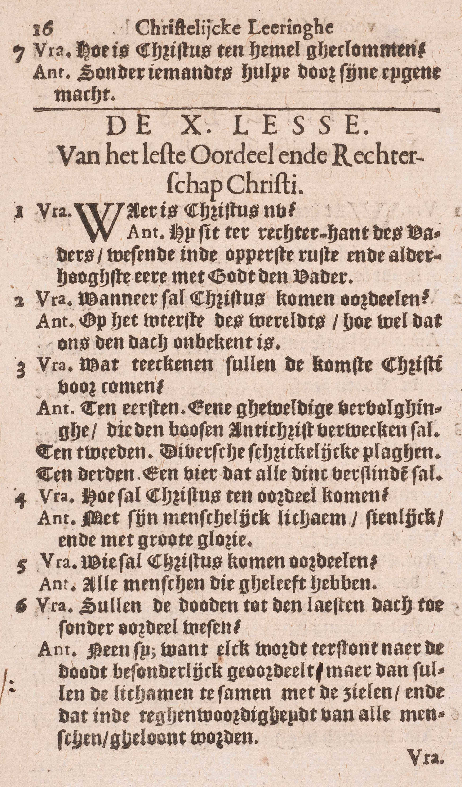
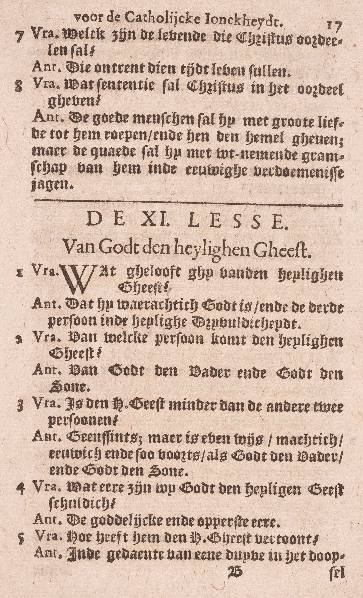

<table>
<tr>
  <td>**En zit ter rechter hand van God, zijn almachtige Vader**</td>
  <td class=accolade></td>
  <td>Christus' verblijfplaats sedert zijn hemelvaart</td>
  <td colspan=3>*[Waar is Christus nu?](#waar-is-christus-nu)*</td>
</tr>
<tr>
  <td rowspan=5>**Vandaar zal Hij komen oordelen, de levenden en de doden**</td>
  <td rowspan=5 class=accolade></td>
  <td colspan=2>Tijd</td>
  <td colspan=2>*[Wanneer zal Christus komen oordelen?](#wanneer-zal-christus-komen-oordelen)*</td>
  <td>*[Welke tekenen zullen de komst van Christus voorkomen?](#welke-tekenen-zullen-de-komst-van-christus-voorkomen)*</td>
</tr>
<tr>
  <td colspan=2>Manier</td>
  <td colspan=3>*[Hoe zal Christus ten oordeel komen?](#hoe-zal-christus-ten-oordeel-komen)*</td>
</tr>
<tr>
  <td rowspan=2 colspan=2>Personen die te oordelen zijn</td>
  <td rowspan=2>*[Wie zal Christus komen oordelen?](#wie-zal-christus-komen-oordelen)*</td>
  <td rowspan=2 class=accolade></td>
  <td>*[Zullen de doden tot de laatsten dag toe zonder oordeel wezen?](#zullen-de-doden-tot-de-laatsten-dag-toe-zonder-oordeel-wezen)*</td>
</tr>
<tr>
  <td>*[Welke zijn de levenden, die Christus oordelen zal?](#welke-zijn-de-levenden-die-christus-oordelen-zal)*</td>
</tr>
<tr>
  <td colspan=2>Vonnis</td>
  <td colspan=3>*[Wat vonnis zal Christus in het Oordeel geven?](#wat-vonnis-zal-christus-in-het-oordeel-geven)*</td>
</tr>
</table>

# Waar is Christus nu?

## Hij zit ter rechter hand van de Vader, wezende in de opperste rust en allerhoogste eer met God de Vader

  
  

V. **Waar is Christus,** als mens beschouwd, — **nu:** sedert zijn Hemelvaart?

A. **Hij zit ter rechter hand van de Vader:** deze woorden van het Symbolum zijn blijkbaar, niet in hunn eìgenlijken, maar in de overdrachtelijken zin te verstaan, die de Cateehismus zelf aanduidt: de woorden **wezende in de opperste rust met God de Vader** bevatten de uitlegging van *Hij zit (bij de Vader);* de overige, **wezende in de allerhoogste eer met God de Vader** dienen tot verklaring van *ter rechter hand van de Vader.* Door de woorden: **met God de Vader** wil men hier zeggen, dat Christus, als mens, deelachtig is in de rust en in de eer van God de Vader of van de goddelijke natuur die de drie goddelijke Personen eigen is.

Christus is, als mens, ook tegenwoordig in het H. Sacrament; maar niet, gelijk in de Hemel, op een zichtbaare wijze.

# Wanneer zal Christus komen oordelen?

## Op het uiterste van de wereld, hoewel dat ons de dag onbekend is

A. **Op het uiterste van de wereld,** dat is niet, als de hele wereld ten volle zal vernietigd zijn; maar als de hele wereld met al de stoffelijke wezens die zij bevat, door het vuur zal ontbonden zijn; **hoewel dat ons:** iedereen, uitgenomen God, **de dag,** de ure, de dag, de week, het jaar, zelfs het tijdstip **onbekend is.**

In zijn wijsheid heeft God vastgesteld dezen dag aan niemand bekend te maken, opdat de orde in het maatschappelijk leven tot het einde toe zou blijven hestaan.

# Welke tekenen zullen de komst van Christus voorkomen?

## Ten eerste, een geweldige vervolging, die de boze Antichrist verwekken zal; ten tweede, verscheidene schrikkelijke plagen; ten derde, een vuur, dat alle dingen verslinden zal

V. **Teekenen:** gebeurtenissen die vóór Christus’ komst moeten plaats grijpen en er zo ware tekenen van zijn.

A. **Ten eerste, een geweldige vervolging die de boze Antichrist verwekken zal:** *Antichrist* is zoveel als *vijand van Christus;* de *boze Antichrist* is een bijzondere persoon, die zich als God zal doen aanbidden en alle boosheden bedrijven; zijn vervolging wordt *geweldig* genoemd, om reden van de overgrote macht en van de listen die hij gebruiken zal, alsook wegens het groot getal gelovigen dat hij, volgens Christus’ voorzegging, zal doen afvallen.

**Ten tweede, verscheidene schrikkelijke plagen:** niet alleen oorlog, ziekte, hongersnood, aardbevingen, welke plagen nu dikwijls de wereld treffen ; maar nog buitengewone beroerten in de krachten van het firmament. zo verschrikkelijk, dat de mensen van vrees zullen verdorren.

**Ten derde, een vuur dat alle dingen verslinden zal:** een vuur, door Gods almacht aangestoken, dat geheel deze aarde met al wat zij bevat, zal ontbinden, zonder er nochtans de stof van te vernietigen. Dit laatste teken alleen zal de komst van Christus onmiddellijk voorafgaan, zodat de andere niet zullen aanduiden, dat die komst geheel nabij is.

Uit de overgeblevene stof van de verbrande wereld zal God een nieuwe en allerschoonste aarde maken, die de gelukzaligen met de ogen van hun glorieus lichaam zullen aanschouwen en bewonderen; Christus heeft immers de herstelling verdiend van geheel het mensdom en dus ook van geheel de wereldsche schepping, die de mens gans ten dienste staat.

Buiten de genoemde tekenen zijn er nog andere: 1° iedere natie van de wereld moet eens het Geloof ontvangen en aan de H. Kerk toebehoord hebben; 2° het joodse volk moet zich tot de waren Godsdienst bekeerd hebben; 3° Henoch en Elias, die van de aarde werden opgenomen, moeten hier, waarschijnlijk ten tijde van de Antichrist, wedergekeerd zijn om het Geloof te prediken.

# Hoe zal Christus ten oordeel komen?

## Met zijn menselijk lichaam, zichtbaar en met grote glorie

A. Christus zal ten oordeel komen, niet alleen als God, maar ook als mens; want **met zijn menselijk lichaam** betekent hier met geheel de menselijke natuur uit ziel en lichaam bestaande; — niet verborgen onder een andere gedaante, gelijk nu in het H. Sacrament des Altaars, maar **zichtbaar:** onder de eigen gedaante van zijn lichaam — **en met grote glorie:** versierd met de vier gaven van klaarheid, snelheid, subtiliteit en onlijdelijkheid, en, daarenboven, met veel uitwendige heerlijkheid. Hij zal op een wolk als op een triomfwagen gezeten zijn; de engelen zullen Hem vergezellen en zijn kruis zal voorafgaan.

# Wie zal Christus komen oordelen?

## Alle mensen die geleefd zullen hebben

A. **Alle mensen die geleefd zullen hebben,** zonder één uitzondering, te beginnen van Adam en Eva tot het einde van de wereld. Deze zullen geoordeeld worden over al hun woorden, werken en gepeinzen, van de ogenblik dat zij tot hun verstand gekomen zijn tot hun dood toe, voor zoveel die woorden, werken en gepeinzen goed of kwaad zijn.

# Zullen de doden tot de laatsten dag toe zonder oordeel wezen?

## Neen, want elk wordt terstond na de dood in het bijzonder geoordeeld; maar dan zullen de lichamen samen met de zielen, en dat in de tegenwoordigheid van alle mensen, geloond worden

A. **Neen, want elk wordt terstond na de dood:** zoohaast de ziel van het lichaam gescheiden is, **in het bijzonder:** voor de ziel alleen, zonder dat een ander mens er bij tegenwoordig is, **geoordeeld ; maar dan zullen de lichamen samen met de zielen:** de mensen in hun volledige natuur, uit ziel en lichaam bestaande **geloond worden, en dat in tegenwoordigheid van alle mensen,** d.w.z. dat alle mensen die ooit geleefd zullen hebben, door een bovennatuurlijk licht iedereens goede en kwade werken, van het eerste tot het laatste, met al de omstandigheden zullen kennen.

Het Oordeel dus is *tweeërlei,* te weten: het *Bijzonder* en het *Algemeen.* Het *Bijzonder* geschiedt 1° terstond na de dood; 2° buiten de tegenwoordigheid van de mensen; 3° voor de ziel die van ’t lichaam gescheiden is; 4° zonder dat Christus op de aarde verschijnt. Het *Algemeen Oordeel* zal geschieden 1° op het einde van de wereld, weshalve het ook *Laatste* Oordeel genoemd wordt; 2° in de tegenwoordigheid van alle mensen; 3° voor de lichamen samen met de zielen; 4° door Christus zichtbaar en met grote glorie op de aarde verschijnende.

Buiten het Bijzonder Oordeel is nog het Algemeen nodig 1° opdat Gods rechtvaardigheid, die hier op aarde niet altijd uitschijnt, van eenieder ten volle zou gezien worden; 2° opdat de eer van Christus en van al de goede mensen openlijk zou gewroken worden; 3° omdat de mens eens in die staat behoort geoordeeld te worden, waarin hij het leven doorgebracht heeft, bijgevolg met ziel en lichaam en in de tegenwoordigheid van de mensen, daar hij zo op aarde geleefd heeft.

# Welke zijn de levenden, die Christus oordelen zal?

## Die omtrent die tijd leven zullen

V. Christus, zegt het Symbolum, zal komen oordelen de levenden en de doden: wie zijn die **levenden** van welke hier gesproken wordt?

A. **Die omtrent die tijd leven zullen:** die omtrent de tijd van het einde van de wereld op de aarde zullen zijn. Dit antwoord leert ons duidelijk, hoe wij uit het woord *levenden* niet mogen besluiten, dat de laatste mensen de dood niet zullen ondergaan. Deze worden met recht *levenden* genoemd, om ze te onderscheiden van de andere mensen die vroeger gestorven zijn.

# Wat vonnis zal Christus in het Oordeel geven?

## De goede mensen zal hij met grote liefde tot zich roepen en hun de hemel geven; maar de kwade zal hij met uitnemende gramschap van zich in de eeuwige verdoemenis jagen

A. **De goede mensen:** al degenen die in Gods gratie gestorven zijn; want, op de ogenblik van het Laatste Oordeel, zal het vagevuur eindigen; — **zal Hij met grote liefde tot zich roepen en hun de hemel geven,** zeggende: *« Komt, gij gezegenden mijns Vaders! Neemt bezit van het koninkrijk, dat voor u bereid is van de grondvesting van de wereld af.»* **Maar de kwade:** al degenen die in dadelijke doodzonde gestorven zijn, **zal Hij met uitnemende gramschap:** met grote afgekeerdheid van zich in de eeuwige verdoemenis jagen, zeggende: *« Gaat weg van mij, gij vervloekten, in het eeuwig vuur dat bereid is voor de duivel en zijn engelen. »*

Christus zal eenieder zijn vonnis door een inwendig licht te kennen geven; maar de bovengemelde woorden, waarschijnlijk al de goeden en al de kwaden samen toesturen.

### VRAGEN

Welke woorden van het Symbolum worden hier uitgelegd? — Hoe is deze les verdeeld? — Wat wordt er in ieder deel geleerd?

1. Verklaar in de eerste vraag: *Waar is Christus nu,* de woorden *Christus* en *nu.* — Hoe antwoordt men op die vraag met de woorden van het Symbolum? — Hoe moeten die woorden van het Symbolum verstaan worden? — Hoe legt ze de Catechismus uit? — Aan welke woorden van het Symbolum beantwoordt ieder deel van de uitlegging van de Catechismus? — Wat betekent de Catechismus in zijn antwoord door de woorden: *met de Vader?* — Is Christus als mens sedert zijn Hemelvaart uitsluitend in de hemel tegenwoordig?

2. Op welk tijdstip van deze wereld zal Christus komen oordelen? — Wat verstaat men door het *uiterste van de wereld?* — Wanneer zal deze wereld eindigen? — Wat verstaat men hier door *dag?* — Aan wie is de dag van Christus’ oordeel onbekend; en waarom wil God hun dat verbergen?

3. Wat verstaat men door *de tekenen die de komst van Christus moeten voorkomen?* — Hoeveel tekenen, die de komst van Christus moeten voorkomen, stelt de Catechismus voor? — Zijn er nog andere? — Wat betekent het woord *Antichrist;* en wie is *de boze Antichrist?* — Waarom wordt de vervolging, die hij zal opstoken, *geweldig* genoemd? — Wat is hier te verstaan door de woorden: *verscheidene schrikkelijke plagen?* — Hoe schrikkelijk zullen die plagen zijn? — Welk zal de oorsprong zijn van het vuur dat de wereld zal verslinden? — Wat zal het verslinden? — Hoever zal het al die zaken verslinden? — Zullen al die tekenen Christus' komst onmiddellijk voorafgaan, en bijgevolg bewijzen dat deze komst heel nabij is?

4. In welke natuur zal Christus komen oordelen? — Hoedanig zal Hij in zijn menselijke natuur verschijnen? — Wat betekent hier het woord *zichtbaar?* — Wat is er te verstaan onder de woorden: *met grote glorie?*

5. Zeg, met de woorden van het Symbolum, en daarna met die van de Catechismus, welke mensen Christus zal komen oordelen? — Waarover zal Hij eenieder komen oordelen?

6. Is er buiten het Oordeel, dat op het einde van de wereld zal geschieden, nog een ander? — Hoeveel oordelen bestaan er dan, en hoe worden zij genoemd? — Leg de volgende woorden uit: *terstond na de dood,* — *in het bijzonder,* — *de lichamen samen met de zielen,* — *in detegenwoordigheid van alle mensen.* — Stel het verschil voor, dat tussen de genoemde Oordelen bestaat, — Waarom moet er buiten het Oordeel, dat terstond na de dood geschiedt, nog een Algemeen Oordeel bestaan?

7. In de uitdrukking van het Symbolum *de levenden en de doden,* wie zijn, volgens de Catechismus, te verstaan door *de levenden?* — Is deze uitlegging van de Catechismus redelijk? — Mag men dan uit dat woord besluiten dat de laatste mensen de dood niet zullen ondergaan?

8. Wie zijn hier te verstaan door de *goede* en de *kwade mensen?* — Welke woorden zal Christus spreken, als Hij de goede mensen met grote vriendschap tot zich zal roepen? — Wat wil hier zeggen: *met uitnemende gramschap?* — Welke woorden zal Christus spreken, als Hij de kwade met grote gramschap in de eeuwige verdoemenis zal jagen? — Hoe zal Christus de uitspraak van het vonnis doen?

