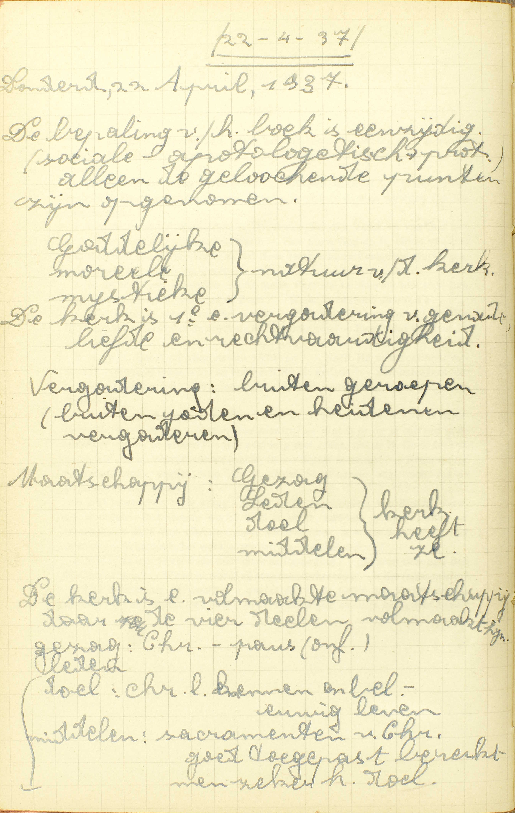
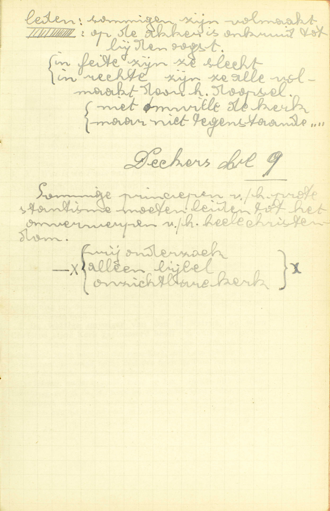
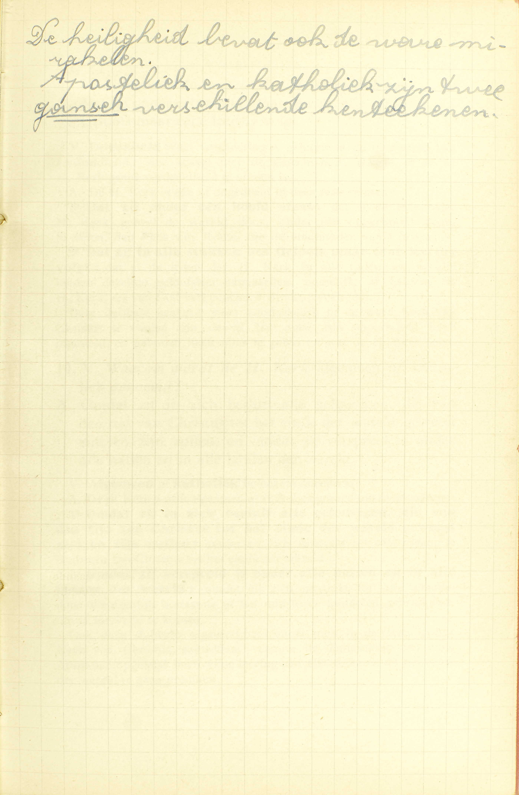
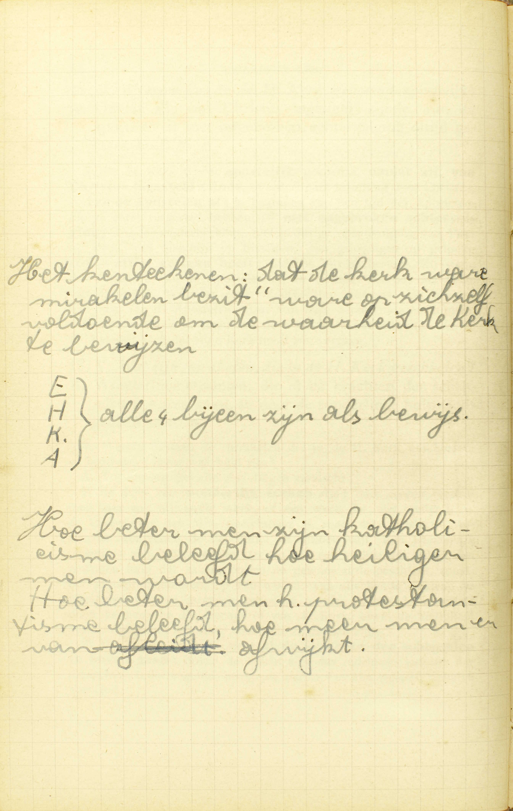

<table>
<tr>
  <td rowspan=10>**De Heilige Katholieke Kerk**</td>
  <td rowspan=10 class=accolade></td>
  <td colspan=2>Korte beschrijving</td>
  <td colspan=4>*[Wat is de Heilige Kerk?](#wat-is-de-heilige-kerk)*</td>
</tr>
<tr>
  <td rowspan=3>Overheid</td>
  <td rowspan=3 class=accolade></td>
  <td colspan=2>Opperhoofd</td>
  <td>*[Wie is het hoofd van de Heilige Kerk?](#wie-is-het-hoofd-van-de-heilige-kerk)*</td>
  <td>*[Wat is de Paus van Rome?](#wat-is-de-paus-van-rome)*</td>
</tr>
<tr>
  <td colspan=2>Bisschoppen</td>
  <td colspan=2>*[Wat zijn de bisschoppen in de Heilige Kerk?](#wat-zijn-de-bisschoppen-in-de-heilige-kerk)*</td>
</tr>
<tr>
  <td colspan=2>Pastoors en priesters</td>
  <td colspan=2>*[Wat zijn pastoors en priesters?](#wat-zijn-pastoors-en-priesters)*</td>
</tr>
<tr>
  <td colspan=2>Leden</td>
  <td colspan=4>*[Welke zijn de leden van de Heilige Kerk?](#welke-zijn-de-leden-van-de-heilige-kerk)*</td>
</tr>
<tr>
  <td rowspan=5>*[Eigendommen en kentekenen](#welke-zijn-de-eigendommen-en-tekenen-van-de-waarachtige-kerk-van-christus)*</td>
  <td rowspan=5 class=accolade></td>
  <td colspan=2>Eenheid</td>
  <td colspan=2>*[Waarin is de eenheid van de Heilige Kerk gelegen?](#waarin-is-de-eenheid-van-de-heilige-kerk-gelegen)*</td>
</tr>
<tr>
  <td colspan=2>Heiligheid</td>
  <td colspan=2>*[Waarom heet gij de Kerk *heilig?*](#waarom-heet-gij-de-kerk-heilig)*</td>
</tr>
<tr>
  <td rowspan=2>Katholiciteit en apostoliciteit</td>
  <td rowspan=2 class=accolade></td>
  <td colspan=2>*[Waarom wordt de Heilige Kerk algemeen of katholiek genoemd?](#waarom-wordt-de-heilige-kerk-algemeen-of-katholiek-genoemd)*</td>
</tr>
<tr>
  <td colspan=2>*[Waarom wordt de Heilige Kerk genoemd apostelijk?](#waarom-wordt-de-heilige-kerk-genoemd-apostelijk)*</td>
</tr>
<tr>
  <td colspan=2>Mirakelen</td>
  <td colspan=2>*[Wat zijn mirakelen, die in de Heilige Kerk geschieden?](#wat-zijn-mirakelen-die-in-de-heilige-kerk-geschieden)*</td>
</tr>
</table>

# Wat is de Heilige Kerk?

## Een vergadering van alle gelovige Christenen, die, onder de gehoorzaamheid van de Paus van Rome de waarachtige leer van Christus belijden

  
  <em>De Kerk is de 1ᵉ vergadering van genade, liefde en rechtvaardigheid.</em>

V. Waarin bestaat de H. Katholieke Kerk, die wij geloven de ware Kerk van Christus te zijn; of, welke kerk verstaat men door de *H. Kerk?*

A. Het woord *Kerk* betekent hier, niet een gebouw, maar **een vergadering:** een genootschap, een vereniging van mensen. Nochtans niet alle zulke vergaderingen worden kerken genoemd, maar alleen die van *Christenen.* — Door *Christenen* worden hier verstaan niet enkel de *ware* Christenen, die al de vereisten vervullen om Christenen te zijn, maar ook al degenen die gedoopt zijn en ten minste Christus als de goddelijken Zaligmaker erkennen.

De vergadering nu, die men de H. Kerk noemt, bestaat uit **alle gelovige christenen:** uit al de mensen die gedoopt zijn en in Christus geloven, — **die, onder de gehoorzaamheid van de Paus van Rome:** die, zich aan de Paus van Rome als aan hun opperhoofd onderwerpende en hem gehoorzamende, — **de waarachtige leer van Christus belijden:** de onvervalste en echte leer van Christus onder die gehoorzaamheid inwendig geloven en uitwendig bekennen te geloven. Hieruit volgt:

1° Dat de *H. Kerk* die Kerk is, welke onder de gehoorzaamheid van de Paus van Rome staat, en daarom de Rooms-Katholieke Kerk genoemd wordt, en dat haar bijzonderste eigenschap is, de waarachtige leer van Christus te belijden;

2° Dat de drie bestanddelen aller vergadering, te weten: leden, overheid en einde, in haar te vinden zijn: zij heeft voor *leden* de gelovige christenen, voor *hoogste overheid* de Paus van Rome, en voor *einde* het belijden van de waarachtige leer van Christus ;

3° Dat men om waarlijk lid te wezen van de H. Kerk, a) gelovige christen moet zijn, b) onder de gehoorzaamheid van de Paus van Rome staan, en c) de waarachtige leer van Christus belijden, gelijk zij door de H. Kerk voorgehouden wordt.

# Wie is het hoofd van de Heilige Kerk?

## Het onzichtbaar en opperste hoofd is Christus; maar het zichtbaar hoofd is zijn stadhouder op de aarde, de Paus van Rome

V. **Wie is het hoofd,** de opperbestierder **van de H. Kerk?**

A. De opperbestierder van de H. Kerk is **Christus** als mens, en — de **Paus van Rome,** d.i. de bisschìp van Rome; want, die bisschop is van Rome, is ook Paus. Het woord *Paus* betekent eigenlijk *vader.* Het opperbestier behoort hun beiden toe als volgt: Christus is het onzichtbaar en opperste hoofd; de Paus van Rome, het zichtbaar hoofd en de stadhouder van Christus op de aarde.

Christus als mens wordt het *onzichtbaar* hoofd van de H. Kerk genoemd, omdat Hij hier op aarde niet zichtbaar met ons leeft; het *opperste* hoofd. omdat Hij rechtstreeks van God alle macht over de gelovigen ontvangen heeft, en niemand in de H. Kerk enige macht hezit, die niet van Hem voortkomt. De Paus van Rome integendeel is het *zichtbaar* hootd van de H. Kerk, omdat hij hier zichtbaar met ons leeft; de *stadhouder* (plaatsvervanger) *van Christus* op de aarde, omdat hij in Christus’ naam en plaats de gelovigen bestiert.

# Wat is de Paus van Rome?

## De eigen stadhouder van Christus op de aarde, en de wettige navolger van de H. Petrus, op wie Christus zijn Kerk getimmerd heeft

V. De zin is: welk is het ambt, welk is de macht var de Paus van Rome.

A. Zijn ambt of macht wordt hier op twee manieren voorgesteld: hij is:

1° **De eigen stadhouder van Christus op de aarde:** de ware plaatsvervanger op deze wereld van Christus, het onzichtbaar en opperste hoofd van de H. Kerk; bijgevolg heert hij hetzelfde ambt of dezelfde macht als Christus, met dit verschil nochtans, dat hij die slechts mag uitoefenen in die maat en op die wijze, welke Christus voorgeschreven heeft;

2° **De wettige navolger van de H. Petrus, op wie Christus zijn Kerk getimmerd heeft:** de ware opvolger van de H. Petrus, die Christus de eersten als zijn stadhouder aangesteld, en op wie Hij dus zijn Kerk, gelijk een gebouw op zijn grondslagen, gevestigd heeft; derhalve heeft de Paus van Rome dat ambt of die macht, welke de H. Petrus van Christus ontvangen heeft.

Deze leer, nader bepaald, komt op het volgende uit: de Paus heeft over geheel de H. Kerk en over ieder van haar leden, over de bisschoppen zowel als over de priesters en de gelovigen, volle macht om hun het Geloof voor te houden en de HH. Sacramenten te bedienen, om hun wetten op te leggen en hen te oordelen en te straffen. Daarenboven is hij onfeilbaar, als hij verklaart, war alle Christenen, in zaken van geloof en zeden, verplicht zijn voor waar te houden. ([3ᵉ les, 6ᵉ v.](les-03.html#waaruit-hebben-wij-deze-zekerheid-in-de-stukken-die-het-geloof-aangaan))

# Wat zijn de bisschoppen in de Heilige Kerk?

## De bisschoppen zijn de prinsen van de H. Kerk, en bedienen de plaatsen van de Heilige Apostelen

A. Het ambt of de macht van de bisschoppen is hier ook op twee manieren voorgesteld: zij zijn:

1° **De prinsen van de H. Kerk:** zij bestieren onmiddellijk, onder het oppergezag van de Paus, een deel van de H. Kerk, namelijk een bisdom, gelijk in vroegere tijden, de prinsen, onder het oppergezag van de koning, onmiddellijk een deel van het rijk bestierden;

2° **Zij bedienen de plaatsen van de Heilige Apostelen:** zij hebben hetzelfde ambt of dezelfde macht als de Apostelen, met uitzondering echter van de voorrechten die deze hadden als stichters van de H. Kerk, namelijk: de onfeilbaarheid in het voorhouden van Christus’ leer en het recht van door zich zelven, zonder iemands tussenkomst, bisschoppelijke zetels in te richten, overal het Geloof te prediken en de gelovigen te bestieren.

De bisschoppen hebben, in het bisdom hun door de Paus toevertrouwd, de macht van, als Christus’ gezanten, het Geloof voor te houden, van wetten te maken, te oordelen, te straffen en de HH. Sacramenten te bedienen: zij hebben recht van in een algemeen Concilie deel te nemen; doch blijven in alles aan het gezag van de Paus onderworpen.

# Wat zijn pastoors en priesters?

## De pastoors en priesters zijn wettige navolgers van de twee en zeventig discipelen van Christus

V. **Pastoors** heet men de geestelijke oversten van de parochiën, die deeltjes zijn van een bisdom, en een zeker getal gelovigen bevatten. Door **priesters** duidt men hier de priesters aan, die geen pastoors zijn, maar eenig ander ambt in het bisdom bekleeden.

A. **De pastoors en priesters zijn wettige** (ware) **navolgers van de twee en zeventig discipelen** (leerlingen) **van Christus:** die Christus uit zijn volgelingen gekozen, en als voorloopers van zijn prediking rondgezonden heeft. Zij worden *navolgers* van die discipelen genoemd, niet omdat Christus ze als hun opvolgers heeft ingesteld, maar omdat zij, door de overheid van de H. Kerk tot medehelpers van de bisschoppen zijn aangenomen, gelijk de twee en zeventig diseipelen door Christus tot zijn medehelpers uitgekozen werden.

De pastoors hebhen de macht van, in de naam van hunn bisschop, het Geloof aan hun onderdanen te verkondigen, hun de Sacramenten te bedienen, alsook hen in de weg van de zaligheid te leiden met hun de wetten van de H. Kerk voor te houden en goeden raad te geven. De andere priesters hebben de macht die zij van de H. Kerk of van de bisschop ontvangen hebben.

Men bemerke wel, dat er in deze les spraak is van de *rangorde van de bestier- of rechtsambten* in de H. Kerk, In de [35ᵉ les](les-35.html) zal er gehandeld worden van de *rangorde van de priesterlijke macht,* die door het Sacrament van het Priesterschap gegeven wordt.

# Welke zijn de leden van de Heilige Kerk?

## Al degenen, die hier op de aarde onder de gehoorzaamheid van de Paus van Rome het waarachtig Geloof belijden, of in het vagevuur gezuiverd worden, of nu met Christus in de hemel leven

V. De Catechismus heeft reeds in de eerste vraag geleerd, wie leden van de H. Kerk zijn; nu zal hij dat op een bepaaldere wijze voorstellen.

A. Er zijn drie klassen van leden:

1° **Al degenen, die hier op de aarde onder de gehoorzaamheid van de Paus van Rome het waarachtig Geloof belijden:** de gelovigen hier op de aarde.

2° **Die in het vagevuur gezuiverd worden:** de zielen dergenen die, in Gods liefde gestorven zijnde, in het vagevuur gezuiverd worden van de nog overblijvenden last van penitentie.

3° **Die nu met Christus in de hemel leven:** de Heiligen van de hemel.

De eerste klasse van leden maakt de *strijdende,* de tweede, de *lijdende,* en de derde, de *zegepralende Kerk* uit. Deze woorden brengen hun eigen verklaring mede,

De zielen van het vagevuur en de Heiligen van de hemel maken wezenlijk deel van de H. Kerk: het zijn haar leden die reeds hun einde bereikt hebben en, als blijken zal uit de [volgende les](les-13.html), met de strijdende leden in gemeenschap blijven.

# Welke zijn de eigendommen en tekenen van de waarachtige Kerk van Christus?

## Onder andere deze vier: het eerste, dat zij één is; het tweede, dat zij heilig is; het derde, dat zij katholiek en apostelijk is; het vierde, dat zij waarachtige mirakelen heeft

V. Door **eigendom** verstaat men hier een hoedanigheid die een zaak eigen is, en door **teken,** iets dat ons ter kennis van een andere zaak brengt.

A. Uit de woorden: **onder andere deze vier** volgt, dat er nog andere zulke kentekens bestaan, maar dat de vier genoemde de bijzonderste zijn.

# Waarom heet gij de Kerk *heilig?*

## Ten eerste, omdat haar hoofd Christus heilig is; ten tweede, omdat in haar alleen te vinden is het waarachtig gebruik van de Heilige Sacramenten, die ons heilig maken; ten derde, omdat haar beste deel, haar roep en haar leer heilig is

  
  <em>Sommige principes van het protestantisme moeten leiden tot het omverwerpen van het hele christendom.</em>

V. De zin is: waarin is de Rooms-Katholieke Kerk heilig.

A. Zij is heilig om *drie* redenen:

**Ten eerste, omdat haar hoofd Christus heilig is:** omdat zij niet, gelijk de sekten, een zondaar, ‘t zij Luther of Calvijn, ’t zij eeu anderen Ketter of Schismatiek voor insteller heeft, maar wel Christus, de God mens, de heiligheid zelve,

**Ten tweede, omdat in haar alleen te vinden is het waarachtig gebruik van de Heilige Sacramenten, die ons heilig maken:** omdat zij, en zij alleen, de zeven Sacramenten, die van Christus tot onze heiligmaking ingesteld zijn, wettig en geldig aan de gelovigen bedient.

**Ten derde, omdat haar — beste deel:** een groot deel, bestaande uit de ware gelovigen, die naar de stem van de H. Kerk zorgvuldig luisteren, — **haar roep:** het einde of de zaak waartoe zij haar leden uitnodigt, — **haar leer:** haar geloofs- en zedenleer — **heilig is:** van net kwaad afkeert en tot de deugd en volmaaktheid geleidt.

Het is zonneklaar, dat een Kerk, waar deze drijdubbele heiligheid niet aan toebehoort, de ware Kerk van Christus niet wezen kan.

# Waarin is de eenheid van de Heilige Kerk gelegen?

## Dat zij onder één hoofd staat, en in alle stukken van het Geloof maar één leer volgt

V. De **eenheid** van een vergadering is gelegen in de uitsluiting van verdeeldheid: dus vraagt hier de Catechismus, waarin er in de H. Kerk geen verdeeldheid te vinden is,

A. De H. Kerk is één of ongedeeld in deze *twee* punten:

1° **Dat zij onder één hoofd staat:** dat al de leden van de H. Kerk, geheel de wereld door, onder één opperhoofd staan, te weten, de Paus van Rome, die de stadhouder van Christus is.

2° **Dat zij in alle stukken van het Geloof maar één leer volgt:** dat al de leden van de H. Kerk in alle tijden en in alle landen dezelfde geloofsleer aanvaarden, namelijk, al hetgene de H. Kerk, als van God geopenbaard zijnde, voorhoudt.

Deze dubbele eenheid moet noodzakelijk in de ware Kerk van Christus te vinden zijn, daar Hij maar één opperhoofd heeft ingesteld, en geboden heeft alles te geloven wat de H. Kerk leert.

# Waarom wordt de Heilige Kerk algemeen of katholiek genoemd?

## Omdat zij in zich besluit alle gelovigen, die van de tijd van Christus tot het einde van de wereld geweest zijn en zijn zullen, en omdat zij verspreid is onder alle natiën en in alle landen van de wereld

  
  <em>De heiligheid bevat ook de ware mirakelen.</em>

V. **Algemeen** of **katholiek** betekent *onbeperkt.*

A. De H. Kerk wordt algemeen of katholiek gezegd om *twee* redenen:

1° **Omdat zij in zich besluit alle gelovigen, die van de tijd van Christus tot het einde van de wereld geweest zijn en zijn zullen:** omdat zij zich uitstrekt tot *alle tijden,* te beginnen van Christus tot het einde van de wereld.

2° **Omdat zij verspreid is onder alle natiën en in alle landen van de wereld:** omdat zij zieh uitstrekt tot *alle landen,* daar óf wezenlijk bestaande óf ten minste de middelen gebruikende om er tot stand te komen.

Ook deze dubbele algemeenheid moet men in de waarachtige Kerk van Christus aantreffen, vermits de Zaligmaker aan zijn Apostelen opgelegd heeft, zijn leer aan alle volkeren tot het einde van de wereld te gaan prediken.

# Waarom wordt de Heilige Kerk genoemd apostelijk?

## Omdat zij, van Christus ingesteld zijnde, van de apostelen af met ongebroken achtervolging altijd gestaan heeft

A. De H. Kerk wordt **apostelijk** genoemd, **omdat zij van Christus ingesteld zijnde,** of sedert haar instelling door Christus, — **van de Apostelen af:** te beginnen van de tijd van de Apostelen, die ze eerst verspreid hebben, — **met ongebroken achtervolging:** zonder onderbreking, met gedurige opeenvolging van Paus op Paus, van bisschop op bisschop, van gelovigen op gelovigen, — **altijd gestaan heeft:** altijd is blijven bestaan. Zij stamt dus wezenlijk van de Apostelen af, en verdient daarom de naam van *apostelijk.* Ware er één onderbreking geweest dan zou zij niet meer van de Apostelen, maar van haar herstichters afstammen.

De apostoliciteit is eigen aan de ware Kerk van Christus, daar Hij beloofd heeft, dat zijn Kerk nooit zou vergaan.

# Wat zijn mirakelen, die in de Heilige Kerk geschieden?

## Wonderlijke tekenen, die al de krachten van de schepselen te boven gaan, en door de bijzondere hulp Gods gedaan worden

V. Waarin bestaan de mirakelen die in de H. Kerk geschieden, en kentekens van haar waarheid zijn?

A. Tot een mirakel zijn *drie* dingen vereist:

1° Er moet een **wonderlijk teken** zijn: door *teken* verstaat men hier een uitwendig werk, ofeen werk dat niet, gelijk b.v. de Consecratie van de Mis, onzichtbaar is, maar dat, zoals de verrijzenis van een dode, onder de zinnen valt. Een *wonderlijk* teken is een buitengewoon teken, of een teken dat buiten de gewonen loop van de zaken, buiten de gewone orde geschiedt, zoals hef plotseling genezen, op één woord, van allerhande ziekten. De mirakelen worden *tekenen* genoemd, omdat zij ons de waarheid doen kennen van de leer of van de Kerk, ofwel de heiligheid van de persoon, te welker voordeele zij gedaan zijn.

2° Dat teken of werk moet **al de krachten van de schepselen te boven gaan:** boven de macht zijn van de redelooze natuur, van de mensen en van de engelen, boven de macht van alle wezens, behalve van God.

3° Het moet **gedaan worden,** niet door een gewone werking Gods d. í. een die tot de natuurlijke orde behoort, gelijk die b.v., waardoor Hij de wereld bestiert en bewaart, maar **door de bijzondere hulp Gods:** door een buitengewone goddelijke werking of zulk een die geenszins van de natuurlijke orde deel maakt. Door zulke huip geschiedt b.v. de verrijzenis van een dode, de genezing, op één woord, van allerlei ziekten; deze werken immers kunnen alleen door God gedaan worden en behooren op geener wijze tot de natuurlijke orde van de wereld.

Er moeten in de ware Kerk van Christus mirakelen geschieden, omdat Christus dit duidelijk aan zijn Apostelen beloofd heeft.

De mirakelen zijn, uit hun natuur, een *stellig* en *onwederlegbaar bewijs* van de waarheid van de Kerk, voor dewelke zij geschieden, want zij kunnen alleen door de bijzondere hulp Gods gedaan worden. Wat de eenheid, de heiligheid, de katholiciteit en apostoliciteit betreft, deze zijn, *afzonderlijk genomen,* enkel *kentekens* die moeten aanwezig zijn, opdat een kerk als de ware Kerk van Christus zou kunnen aanzien worden; maar, *samengenomen,* maken zij ook een *stellig bewijs* uit van de waarheid van de Kerk waar zij aan behooren. De ondervinding immers getuigt, dat een op valsheid en bedrog gesteunde kerk onmogelijk al die eigendommen kan bezitten. Waar bedrog en valsheid bestaat, daar is geen eenheid, maar verdeeldheid; geen heiligheid, maar ondeugd en boosheid, en, waar eenheid onthreekt, kan noch algemeenheid noch apostoliciteit gevonden worden.

Men bemerke, dat wij al deze eigendommen van de H. Kerk zo gemakkelijk kennen als de geschiedenis, de uitgestrekt heid, de oorsprong en de wonderheden van ous tand, en dat deels door hetgene wij met onze zinnen opmerken, deels door het verhaal of de getuigenis van anderen.

### VRAGEN

  
  <em>Hoe beter men zijn katholicisme beleeft, hoe heiliger men wordt. Hoe beter men het protestantisme beleeft, hoe meer men ervan afwijkt.</em>

Waarover handelt de 12ᵉ les? — Hoe is zij verdeeld? — Wat onderzoekt de Catechismus over ieder deel?

1. Wat vraagt de Catechismus als hij zegt: *Wat is de H. Kerk?*  — Wat verstaat men hier door het woord *Kerk?* — Welke Kerk is de ware Kerk van Christus? — Wat iser aan deze Kerk hoofdzakelijk eigen? — Welke zijn de bestanddelen van de H. Kerk? — Wat is er vereist om wezenlijk lid te zijn van de H. Kerk?

2. Zeg in andere woorden: *Wie is het hoofd van de H. Kerk.* — Welke personen hebben het opperbestier van de H. Kerk; en leg uit, wie zij zijn. — Zeg, met de woorden van de Catechismus, hoe Christus en de Paus van Rome samen het hoofd van de H. Kerk zijn; en leg die woorden uit.

3. Wat betekenen de woorden: *Wat is de Paus van Rome?* — Op hoeveel en op welke manieren stelt de Catechismus ons hetambt en de macht van de Paus van Rome voor? — Wat betekenen de woorden: *de eigen Stadhouder van Christus op de aarde;* — *de wettige navolger van de H. Petrus;* — op wie Christus zijn Kerk getimmerd heeft? — Welke is specifiek de macht van de Paus van Rome?

4. Op hoeveel en op welke manieren leert de Catechismus ons het ambt en de macht van de bisschoppen kennen? — Wat betekent de Catechismus, als hij zegt dat zij *de prinsen van de H. Kerk zijn?*  — Wat wil zeggen, dat *zij de plaatsen van de HH. Apostelen bedienen?* — Stel op een bepaalde wijze hun macht voor.

5. Wat verstaat men hier door *pastoors,* en wat door *priesters?* — Hoe stelt de Catechismus ons hun ambt en hun macht voor? — Wie zijn de *twee en zeventig discipelen van Christus?* — Hoe zijn de pastoors en priesters hun wettige navolgers? — Welke macht hebben zij?

6. Wat komt de vraag: *Welke zijn de leden van de H. Kerk* in deze les doen? — Hoeveel klassen van leden behooren er tot de H. Kerk? — Stel ze voor met de woorden van de Catechismus, en verklaar eenigszins die woorden. — Welke bijzonderen naam heeft iedere klasse van leden; en waarom? — Hoe behooren de zielen van het vagevuur en de Heiligen van de hemel nog tot de H. Kerk?

7. Wat verstaat men door een *eigendom* en door *een teken?* — Van welke eigendommen en tekenen van de waarachtige Kerk is er hier spraak? — Wat betekent de Catechismus als hij zegt: *Onder andere deze vier?* — Noem de vier bijzonderste tekenen van de waarachtige Kerk van Christus.

8. Om hoeveel redenen verdient de H. Kerk de naam van *heilig?* — Noem ze met de woorden van de Catechismus, en leg ze uit.

9. Waarin bestaat de eenheid van een vergadering! — In hoeveel punten is de H. Kerk *één?* — Stel die punten voor, en leg ze uit. — Toon dat deze gezegde eenheid in de ware Kerk moet te vinden zijn.

10. Wat betekent het woord *katholiek?* — Om hoeveel redenen verdient de H. Kerk de naam van *katholiek?* — Stel ze met de woorden van de Catechismus voor, en leg ze uit. — Toon dat de gezegde katholiciteit aan de ware Kerk van Christus eigen is.

11. Zeg in één woord, uit welke hoofde de H. Kerk de naam van *apostelijk* verdient. — Wat betekenen de woorden: *met ongebroken achtervolging altijd gestaan heeft?* — Sedert wanneer heeft de H. Kerk met ongebroken achtervolging altijd gestaan? — Toon dat de apostoliciteit noodzakelijk eigen is aan de ware Kerk van Christus.

12. Welk is de zin van de vraag: *Wat zijn mirakelen die in de H. Kerk geschieden?* — Hoeveel dingen zijn er vereist tot een *waar mirakel?* — Noem ze met de woorden van de Catechismus. — Leg iedere voorwaarde uit en verklaar ze door een voorbeeld. — Hoe zijn de mirakelen tekenen van de waarachtige Kerk van Christus? — Is het een eigendom van de waarachtige Kerk mirakelen te hebben? — Hoe komen wij ter kennis, dat de H. Kerk, d.i. de Roomse Katholieke Kerk, die vier eigendommen en tekenen wezenlijk bezit? — Hoe gemakkelijk kunnen wij dat met zekerheid weten?  — Is ieder van deze kentekenen een stellig bewijs van de waarheid van de Kerk, die ze bezit, ofwel moeten zij daartoe samengenomen worden? — Geef rekenschap van uw antwoord.

