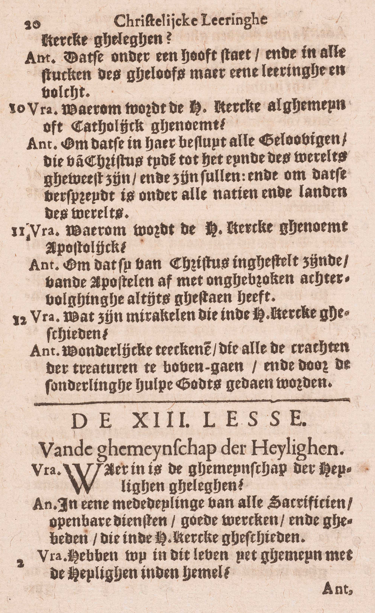
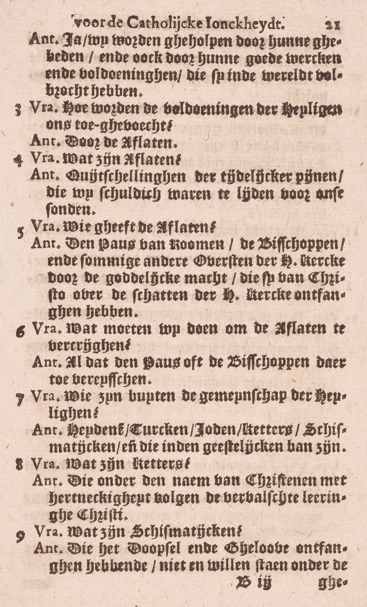
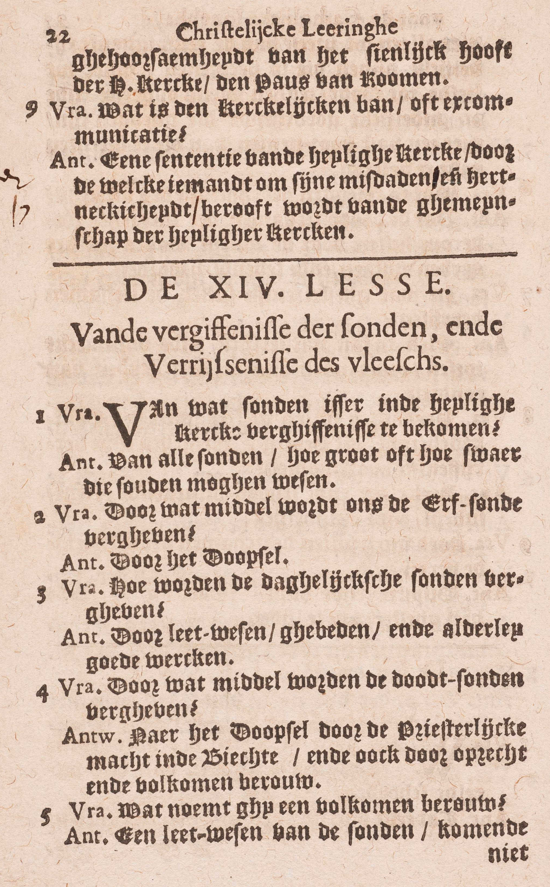

<table>
<tr>
  <td rowspan=8>**De Gemeenschap van de Heiligen**</td>
  <td rowspan=8 class=accolade></td>
  <td colspan=2>Die gemeenschap in 't algemeen</td>
  <td colspan=5>*[Waarin is de gemeenschap van de Heiligen gelegen?](#waarin-is-de-gemeenschap-van-de-heiligen-gelegen)*</td>
</tr>
<tr>
  <td rowspan=3>Onze gemeenschap met de Heiligen van de hemel</td>
  <td rowspan=3 class=accolade></td>
  <td rowspan=3>*[Wij worden geholpen door hun gebeden, en ook door hun goede werken en voldoeningen, die zij in de wereld volbracht hebben](#hebben-wij-in-dit-leven-iets-gemeens-met-de-heiligen-in-de-hemel)*</td>
  <td rowspan=3 class=accolade></td>
  <td rowspan=3>*[Deze voldoeningen worden ons toegevoegd door de aflaten](#hoe-worden-de-voldoeningen-van-de-heiligen-ons-toegevoegd)*</td>
  <td rowspan=3 class=accolade></td>
  <td>*[Wat zijn aflaten?](#wat-zijn-aflaten)*</td>
</tr>
<tr>
  <td>*[Wie geeft de aflaten?](#wie-geeft-de-aflaten)*</td>
</tr>
<tr>
  <td>*[Wat moeten wij doen om de aflaten te verdienen?](#wat-moeten-wij-doen-om-de-aflaten-te-verdienen)*</td>
</tr>
<tr>
  <td rowspan=4>Degenen die buiten de gemeenschap van de Heiligen zijn</td>
  <td rowspan=4 class=accolade></td>
  <td>*[De Heidenen, Turken en Joden](#wie-zijn-buiten-de-gemeenschap-van-de-heiligen)*</td>
  <td rowspan=4 class=accolade></td>
  <td>&nbsp;</td>
</tr>
<tr>
  <td>*[De Ketters](#wie-zijn-buiten-de-gemeenschap-van-de-heiligen)*</td>
  <td colspan=3>*[Wat zijn Ketters?](#wat-zijn-ketters)*</td>
</tr>
<tr>
  <td>*[De Schismatieken](#wie-zijn-buiten-de-gemeenschap-van-de-heiligen)*</td>
  <td colspan=3>*[Wat zijn Schismatieken?](#wat-zijn-schismatieken)*</td>
</tr>
<tr>
  <td>*[Degenen die in de geestelijke ban zijn](#wie-zijn-buiten-de-gemeenschap-van-de-heiligen)*</td>
  <td>*[Wat is de kerkelijke ban of excommunicatie?](#wat-is-de-kerkelijke-ban-of-excommunicatie)*</td>
</tr>
</table>

# Waarin is de gemeenschap van de Heiligen gelegen?

## In een mededeling van alle sacrificiën, openbare diensten, goede werken en gebeden, die in de Heilige Kerk geschieden

  
  
  

V. Met het woord **Heiligen** bedoelt men hier al de leden van de H. Kerk ([12ᵉ les, 6ᵉ v.](les-12.html#welke-zijn-de-leden-van-de-heilige-kerk)), en deze allen worden *heilig* genoemd, omdat zij, ofwel gelijk de gelukzaligen van de hemel, tot de volmaakte heiligheid gekomen zijn; ofwel, gelijk de zielen van het vagevuur, daartoe zullen komen; ofwel, gelijk de rechtvaardigen van de aarde, de heiligmakende gratie bezitten, of ten minste, gelijk de zondaars, door het Doopsel geheiligd zijn geweest en nog altijd tot de heiligheid geroepen zijn.

A. Het woord **mededeling** leert ons dat de gemeenschap van de Heiligen gelegen is in een staat, waarin de een deel heeft in de goederen van de andere. De mee te delen goederen van deze gemeenschap zijn vruchten van de volgende werken **die in de Heilige Kerk geschieden,** te weten: **van alle sacrificiën:** van al de Misoffers dagelijks, door de priesters opgedragen, — **openbare diensten:** al de godsdienstige oefeningen op bevelen in de naam van de H. Kerk gedaan, — **goede werken:** al de werken in overeenstemming met Christus’ wet en in staat van gratie en geest van Geloof volbracht, — **gebeden:** al de smeekingen door de leden van de H. Kerk in ’t bijzonder ten hemel gestuurd.

Wat hun *onderlinge gemeenschap* betreft, al de leden van de strijdende Kerk hebben met zekerheid deel in al het goed dat in die Kerk geschiedt, maar niet allen in dezelfde mate: ieder ontvangt er van volgens zijn gesteltenis.

Over hun *gemeenschap met de lijdende Kerk* zal gesproken worden in de [15ᵉ les, 7ᵉ vraag](les-15.html#door-wat-middel-mogen-de-zielen-uit-het-vagevuur-verlost-of-haar-pijnen-verkort-worden), en over die met de *zegepralende Kerk,* in de volgende vraag.

# Hebben wij in dit leven iets gemeens met de Heiligen in de hemel?

## Ja, wij worden geholpen door hun gebeden en ook door hun goede werken en voldoeningen, die zij in de wereld volbracht hebben

A. Wij worden door de Heiligen van de hemel op *twee* manieren geholpen:

1° **Door hun gebeden,** die zij nu in de hemel doen;

2° **Door de goede werken en voldoeningen, die zij in de wereld volbracht hebben:** door de toepassing van de overschietende voldoeningen die zij op aarde door hun goede werken en oefeningen van hoetvaardigheid, voor schuld van zonde, aan God aangeboden, hebben.

Men neme hier in acht, dat de Heiligen, sedert hun dood, niets meer kunnen verdienen; met de dood houdt de tijd van verdiensten op.

# Hoe worden de voldoeningen van de Heiligen ons toegevoegd?

## Door de aflaten

A. De aflaten zijn de uitwendige middelen, waardoor de H. Kerk ons de voldoeningen van de Heiligen van de hemel toepast; maar, als God het hun toelaat, kunnen de Heiligen dat ook rechtstreeks doen.

# Wat zijn aflaten?

## Kwijtscheldingen van de tijdelijke pijnen, die wij schuldig waren te lijden voor onze zonden

A. De aflaten zijn niet, gelijk de Sacramenten, middelen om de gratie te bekomen, maar **kwijtscheldingen** of aftossingen, niet van de zonden zelf noch van de eeuwige pijnen van de hel, maar **van de tijdelijke pijnen, die wij schuldig waren te lijden voor onze** reeds vergevene **zonden.**

De bron van deze kwijtscheldingen zijn de overschietende voldoeningen van al de Heiligen en in het bijzonder nog de oneindige verdiensten van Christus.

De aflaat is tweeërlei: de *volle* en de *gedeeltelijke* aflaat. De *volle* aflaat is gelegen in de volle kwijtschelding van alle tijdelijke straffen die wij voor onze zonden schuldig zijn; de *gedeeltelijke* aflaat, is de kwijtschelding van een zeker deel van tijdelijke straffen: zo van zijn aflaten van 40 dagen, van één jaar, enz. welke uitdrukkingen betekenen, dat wij door die aflaten kwijtschelding bekomen, niet van 40 dagen of van één jaar vagevuur, maar van zóveel schuld van tijdelijke pijnen, als men zou bekomen hebben met, gedurende denzelfde tijd, volgens de regelen die vroeger in de H. Kerk in gebruik waren, penitentie te doen.

# Wie geeft de aflaten?

## De Paus van Rome, de bisschoppen en sommige andere oversten van de H. Kerk, door de goddelijke macht, die zij van Christus over de schatten van de H. Kerk ontvangen hebben

A. De oversten van de H. Kerk die macht hebben om aflaten te geven, zijn: 1° **de Paus van Rome,** 2° **de bisschoppen** en 3° **sommige andere oversten van de H. Kerk,** b.v. de kardinalen die geen bisschoppen zijn.

De Paus heeft, als opperhoofd van de H. Kerk, de macht voor de ganse christene wereld, zowel volle als gedeeltelijke aflaten te vergunnen.

De bisschoppen die als prinsen van de H. Kerk onderdegehoorzaamheid van de Paus hun bisdom bestieren, hebben, naar de bepaling door de Pausen gedaan, de macht aan hun gelovigen 40 dagen, en, als zij een kerk of een autaar wijden, één jaar aflaat te verleenen. De aartsbisschoppen kunnen 40 dagen vergunnen, niet enkel in hun bisdom, maar in al de andere bisdommen die tot hun geestelijke provincie behooren.

De kardinalen kunnen, in hun titelkerken, en ook in hun bisdom of aartsbisdom, als zij een hebben, 100 dagen aflaat geven.

Al de genoemde overheden verleenen aflaten, niet door een macht die van de mensen voortkomt, maar **door de goddelijke macht, die zij van Christus ontvangen hebben:** door de macht van God, die Christus, de insteller van de H. Kerk, hun — **over de schatten van de H. Kerk:** over zijn verdiensten en de overschietende voldoeningen van de Heiligen heeft medegedeeld.

# Wat moeten wij doen om de aflaten te verdienen?

## Al wat de Paus of de bisschoppen daartoe vereisen

A. De reden van dit antwoord vloeit uit de natuur van de zaak zelve: wie een gunst verleent, mag er een voorwaarde bijstellen, en wie de gunst wil bekomen, moet voorzeker de gestelde voorwaarde vervullen, De gewone conditiën voor een volle aflaat zijn: 1° een goede biecht spreken, 2° waardig de H. Communie ontvangen, 3° enige tijd bidden volgens het inzicht van de H. Kerk, namelijk, voor de verheffing van de H. Kerk, de uitroeiing van de ketterijen en de eendracht van de christene prinsen.

Het spreekt van zelf dat men, om een aflaat te verdienen, in staat van gratie moet zijn.

# Wie zijn buiten de gemeenschap van de Heiligen?

## Heidenen, Turken, Joden, Ketters, Schismatieken, en degenen die in de geestelijke ban zijn

A. Al degenen die hier genoemd worden, zijn huiten de gemeenschap van de Heiligen, omdat zij geen leden van de H. Kerk zijn: zij vervullen immers de hiertoe vereiste conditiën niet. ([12ᵉ les 1ᵉ v.](les-12.html#wat-is-de-heilige-kerk))

**Heidenen** heet men al degenen die niet gedoopt zijn en de waren God, of ten minste Christus niet erkennen; **Turken,** die wel de waren God aanbidden, maar, Christus en zijn leer verwerpende, Mahomed als hun goddelijken profeet aannemen; **Joden,** die de waren God erkennen, maar, de goddelijke zending van Christus loochenende, nog altijd de Oude Wet van Mozes volgen. De Heidenen, Turken en Joden vervullen niet één van de conditiën om van de H. Kerk deel te maken. Van de **Ketters, Schismatieken en degenen die in de geestelijken ban zijn,** wordt in de volgende vragen gesproken.

# Wat zijn Ketters?

## Die, onder de naam van Christenen, met hardnekkigheid volgen de vervalste leer van Christus

A. **Die, onder de naam van Christenen:** die, omdat zij gedoopt zijn en enigszins Christus’ leer aanvaarden, de naam van Christenen dragen zonder die nochtans te verdienen, daar zij niet al de daartoe vereiste conditiën vervullen, — **met hardnekkigheid:** wetens en willens, **volgen de vervalste leer van Christus,** of Christus’ leer ten dele aannemen en ten dele verachten. Een *Ketter* dus is een gedoopte die met hardnekkigheid of wetens en willens enige stukken van Christus’ leer voor goed houdt en de andere veracht ([3° les, 4° v.](les-03.html#hebben-de-ketters-het-waarachtig-geloof-die-eenige-stukken-voor-goed-houden-en-andere-verachten)). Om lid te zijn van de H. Kerk ontbreekt hem de derde voorwaarde te weten: *de waarachtige leer van Christus belijden.*

# Wat zijn Schismatieken?

## Die het Doopsel en Geloof ontvangen hebbende, niet willen staan onder de gehoorzaamheid van het zichtbaar hoofd van de H. Kerk, de Paus van Rome

A. **Die, het Doopsel en Geloof ontvangen hebbende:** die, gedoopt zijnde en de ware leer van Cliristus volgende, **niet willen staan onder de gehoorzaamheid van het zichtbaar hoofd van de H. Kerk, de Paus van Rome:** hetzij de Paus van Rome, die wezenlijk de opvolger is van de H. Petrus, hetzij hunn wettigen bisschop of pastoor, hetzij zelfs enkele leden van de H. Kerk als zulke niet willen erkennen.

Een *Schismatiek* dus is een gedoopte die het waar Geloof belijdt; maar de wettige overheid of de ware leden van de H. Kerk voor zulke niet wil houden. Om lid te zijn van de H. Kerk, ontbreekt hem de tweede conditie, te weten: *onder de gehoorzaamheid staan van de Paus van Rome.*

Men bemerke dat een Schismatiek tevens Ketter kan zijn, en het dikwijls is.

# Wat is de kerkelijke ban of excommunicatie?

## Een vonnis van de H. Kerk, door hetwelk iemand om zijn misdaden en hardnekkigheid beroofd wordt van de gemeenschap van de H. Kerk

A. **Een vonnis:** een uitspraak, een oordeel — **van de H. Kerk:** van de hoogste kerkelijke overheden, te weten, van de Paus of van de bisschoppen, — **door hetwelk iemand beroofd wordt van de gemeenschap van de H. Kerk:** door hetwelk iemand ophoudt deel te maken van de H. Kerk en bijgevolg niet meer tot de HH. Sacramenten aanvaard wordt, en geen deel meer heeft in de goederen van de gemeenschap van de Heiligen, **om zijn misdaden en hardnekkigheid:** om zekere grote zonden die hij met volle kennis van het kwaad en van de straffen bedreven heeft.

Die in de geestelijken ban zijn, maken geen deel meer van de H. Kerk, omdat zij door de kerkelijke overheid uit de vergadering van de gelovigen gesloten zijn, en zo niet meer onder de gehoorzaamheid dier overheid staan,

### VRAGEN

Van welk artikel van het Symbolum spreekt deze les? — Hoe wordt zij verdeeld? — Wat onderzoekt de Catechismus in ieder van de hoofddelen?

1. Wat verstaat men hier door *gemeenschap;* en wat door *Heiligen?* — Zeg, met de woorden van de Catechismus, waarin er gemeenschap onder de Heiligen bestaat; en leg die woorden uit.

2. Op hoeveel manieren worden wij door de Heiligen van de hemel geholpen? — Noem ze met de woorden van de Catechismus, en leg ze uit. — Kunnen de Heiligen nog iets verdienen?

3. Welk middel is de aflaat, om ons de voldoeningen van de Heiligen toe te voegen? — Op welke andere wijze kunnen die voldoeningen ons nog toegepast worden?

4. Welk verschil is er tussen het uitwerksel van een aflaat en dat van de HH. Sacramenten? — Zeg, met de woorden van de Catechismus, waarvan de aflaat een kwijtschelding is, en verklaar die woorden. — Hoe worden de aflaten verdeeld? — Wat is een aflaat van één jaar, van zeven jaren, enz.?

5. Noem de oversten van de H. Kerk, die de macht hebben om aflaten te geven. — Van waar hebben zij die macht? — Hoever strekt zich de rnacht van de Paus en die van een kardinaal, een aartsbisschop en een bisschop in het geven van de aflaten uit? — Wat verstaat men hier door de *schatten van de H. Kerk,* waaruit de aflaten gegeven worden?

6. Zeg in 't algemeen water te doen is, om een aflaat te verdienen. — Welk is de reden daarvan? — Wat wordt er gewoonlijk vereist tot een volle aflaat? — Wat is er noodzakelijk in ons vereist, opdat een aflaat ons zou toegepast worden?

7. Noem al degenen die buiten de gemeenschap van de Heiligen zijn: en zeg waarom zij er buiten zijn. — Wat zijn *Heidenen, Turken* en *Joden;* en wat ontbreekt er hun om lid te zijn van de H. Kerk?

8. Verklaar de woorden: *onder de naam van Christenen,* — *met hardnekkigheid,* — *de vervalste leer van Christus volgen.* — Wat is er dan nodig om Ketter te zijn? — Wat ontbreekt eraan een Ketter om lid te zijn van de H. Kerk?

9. Wat betekenen de woorden: *die het Doopsel en Geloof ontvangen hebbende?* — Wat drukt de Catechismus uit als hij zegt: *onder de gehoorzaamheid niet willen staan van het zichtbaar hoofd van de H. Kerk, de Paus van Rome?* — Wat is er dan nodig om Schismatiek te zijn, zonder tevens in ketterij te vallen? — Wat ontbreekt er aan de Schismatieken, om leden te zijn van de H. Kerk?

10. Wat betekenen de woorden: *een vonnis van de H. Kerk?* — Wie spreekt de kerkelijken ban uit? — Om welke reden wordt hij uitgesproken? — Welk is zijn uitwerksel? — Wat ontbreekt er aan degenen, die in de kerkelijken ban zijn, om lid te wezen van de H. Kerk?

