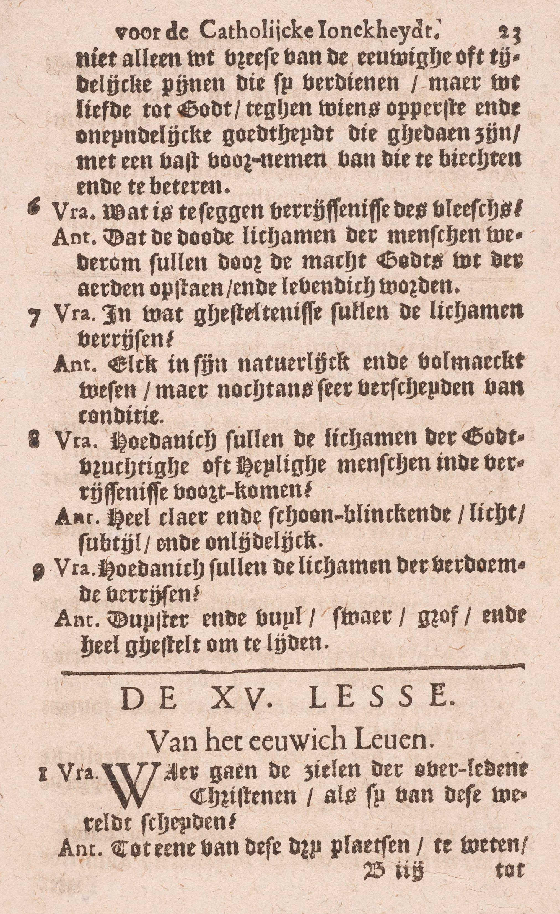
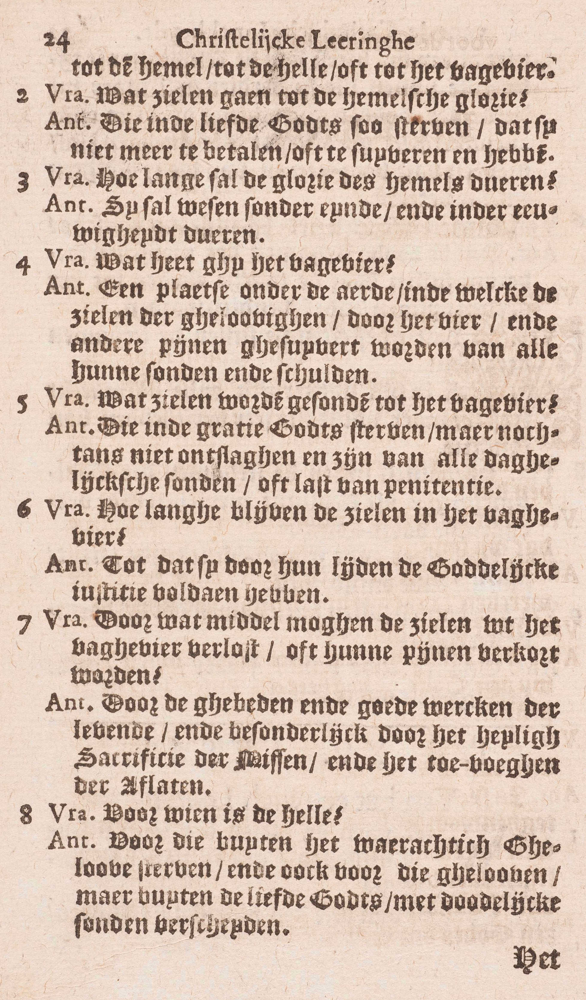

<table>
<tr>
  <td rowspan=7>**Het eeuwig leven**</td>
  <td rowspan=7 class=accolade></td>
  <td rowspan=6>*[Plaatsen van de overleden Christenen](#waar-gaan-de-zielen-van-de-overledene-christenen-als-zij-van-deze-wereld-scheiden)*</td>
  <td rowspan=6 class=accolade></td>
  <td rowspan=2>De Hemel</td>
  <td rowspan=2 class=accolade></td>
  <td>*[Welke zielen gaan tot de hemelse glorie?](#welke-zielen-gaan-tot-de-hemelse-glorie)*</td>
</tr>
<tr>
  <td>*[Hoe lang zal de glorie van de Hemel duren?](#hoe-lang-zal-de-glorie-van-de-hemel-duren)*</td>
</tr>
<tr>
  <td rowspan=4>Het Vagevuur</td>
  <td rowspan=4 class=accolade></td>
  <td>*[Wat heet gij het Vagevuur?](#wat-heet-gij-het-vagevuur)*</td>
</tr>
<tr>
  <td>*[Welke zielen worden gezonden tot het Vagevuur?](#welke-zielen-worden-gezonden-tot-het-vagevuur)*</td>
</tr>
<tr>
  <td>*[Hoelang blijven de zielen in het Vagevuur?](#hoelang-blijven-de-zielen-in-het-vagevuur)*</td>
</tr>
<tr>
  <td>*[Door wat middel mogen de zielen uit het Vagevuur verlost, of haar pijnen verkort worden?](#door-wat-middel-mogen-de-zielen-uit-het-vagevuur-verlost-of-haar-pijnen-verkort-worden)*</td>
</tr>
<tr>
  <td colspan=2></td>
  <td colspan=2>De Hel</td>
  <td>*[Voor wie is de Hel?](#voor-wie-is-de-hel)*</td>
</tr>
</table>
  
# Waar gaan de zielen van de overledene Christenen, als zij van deze wereld scheiden?

## Tot een van deze drie plaatsen, te weten: tot de Hemel, tot de Hel, of tot het Vagevuur

  
  

V. De Catechismus zegt: **van de overleden Christenen,** en niet, *van de overledene mensen,* omdat voor al degenen die op gener wijze tot de ware Kerk behooren, de zaligheid onmogelijk is.

A. De **Hemel** ís een plaats waar de Heiligen vrij zijn van alle leed en het opperste geluk bezitten in God te aanschouwen en in Hem alle goed te genieten,

De **Hel** waarvan hier gesproken wordt, is een plaats onder de aarde, waarin men beroofd is van het goddelijk aanschijn en eeuwige straffen te lijden heeft. Zij bevat twee afdeelingen: de *hel van de verdoemden,* waarin de pijn van schade of de beroving van het goddelijk aanschijn, en de pijn van gevoel tezamen geleden worden, en het *voorgeborgte van de kinderen,* waar men alleen de pijn van schade aantreft.

Het **Vagevuur** zullen wij leren kennen in de 4ᵉ vraag.

# Welke zielen gaan tot de hemelse glorie?

## De zielen van degenen, die in de liefde Gods zó sterven, dat zij niets meer te betalen of te zuiveren hebben

A. Dus, om na de dood rechtstreeks de Hemel binnen te treden, moet men *twee* voorwaarden vervullen:

1° **In de liefde Gods sterven:** in de staat van heiligmakende gratie sterven; bijgevolg zuiver zijn van de erfzonde en van alle dadelijke doodzonde;

2° In de liefde Gods **zó** sterven, **dat men niets meer te betalen of te zuiveren hebbe:** dat men, op de ogenblik van de dood, noch bevlekt weze met dagelijkse zonden, noch tijdelijke pijnen voor reeds vergevene zonden meer uit te boeten hebbe.

Zonder de eerste conditie zou men naar de hel gaan, en, zonder de tweede, naar het Vagevuur.

# Hoe lang zal de glorie van de Hemel duren?

## Zij zal wezen zonder einde en in eeuwigheid duren

A. **In eeuwigheid,** dat is, zonder einde.

Zonder de eeuwigheid ware het geluk van de Hemel onvolkomen, want het gedacht van de Hemel te kunnen verliezen, zou de Heiligen zeer bedroeven.

# Wat heet gij het Vagevuur?

## een plaats onder de aarde, in dewelke de zielen van de gelovigen door het vuur en andere pijnen gezuiverd worden van alle hun zonden en schulden

A. Het **vagevuur** is, volgens het algemeen gevoelen, zowel als de hel, **een plaats onder de aarde; de zielen van de gelovigen worden er gezuiverd van alle hun zonden en schulden:** van al hun schulden van tijdelijke pijnen, die zij voor hun reeds vergevene zonden nog moeten lijden. De Catechismus zegt: *gezuiverd worden,* en niet: *zich zuiveren,* omdat de zielen van het vagevuur door hun lijden niets meer kunnen verdienen; zij kunnen enkel voldoen door genoeg te lijden. Hij noemt de schulden van tijdelijke pijnen ook *zonden,* omdat zij van de zonden voortkomen. De dagelijkse zonden, waar een stervende in zijn uitersten ogenblik mee besmet blijft, worden hem vergeven ofwel in die ogenblik zelven, door een akte van berouw waartoe God hem dan beweegt, ofwel in het Oordeel onmiddellijk na de dood, als de ziel de pijnen, haar door God opgelegd, met een waar leedwezen aanneemt; de dagelijkse zonde kan immers in de zielen van degenen die in Gods gratie sterven, onmogelijk blijven bestaan.

De zuivering van de zielen in het Vagevuur geschiedt **door het vuur en andere pijnen** van gevoel, zoals de knaging van de conscientie, de duisternis in het verstand, het droeve gezelschap van lijdenden en, waarschijnlijk, ook pijnen overeenstemmende met de zonden die gestraft worden; maar, boven dit alles, lijden zij nog de pijn van schade, veruit de grootste van het Vagevuur, omdat de gelovige zielen verstaan, van welk oneindig geluk zij voor enige tijd beroofd zijn, hoe gemakkelijk zij het konden verdienen en hoe zij het voor een beuzeling opgeofferd hebben.

Het schijnt zeker te zijn, dat de minste pijn van het Vagevuur de grootste pijn van deze aarde overtreft.

# Welke zielen worden gezonden tot het Vagevuur?

## De zielen van degenen, die in de gratie Gods sterven, maar nochtans niet ontslagen zijn van alle dagelijkse zonden of last van penitentie

A. Tot het Vagevuur worden gezonden de zielen die in de *twee* volgende conditiën zijn:

1° **Die in de gratie Gods** *van deze wereld scheiden.*

2° **Maar nochtans niet ontslagen zijn van alle dagelijkse zonden — of last van penitentie:** of van alle schuld van tijdelijke pijnen, die na de vergitfenis van de zonden overblijft.

Zonder de eerste conditie zouden de zielen naar de Hel gaan, en‚ zonder de tweede, naar de Hemel.

# Hoelang blijven de zielen in het Vagevuur?

## Totdat zij door haar lijden de goddelijke rechtvaardigheid voldaan hebben

A. **Totdat zij,** de Catechismus zegt niet: *door haar verdiensten,* want zij kunnen niets meer verdienen, maar **door haar lijden de goddelijke rechtvaardigheid voldaan hebben:** zoveel geleden hebben, als Gods rechtvaardigheid vereist. Voor de doden is er geen barmhartigheid meer maar alleen rechtvaardigheid.

# Door wat middel mogen de zielen uit het Vagevuur verlost, of haar pijnen verkort worden?

## Door de gebeden en goede werken van de levenden, en in het bijzonder door het H. Sacrificie van de Mis en het toevoegen van de aflaten

A. De zielen uit het Vagevuur kunnen geholpen worden door — **de levenden:** de leden van de strijdende Kerk, en dát op de *vier* volgende manieren:

1° **Door hun gebeden,** waardoor zij van God de verlossing van de gelovige zielen afsmeken;

2° **Door hun goede werken:** met voor die zielen de voldoening van hun goede werken aan God aan te bieden; met door die werken de verlossing van de zielen af te smeken en, zoveel mogelijk, te verdienen.

3° **Door het H. Sacrificie van de Mis:** met voor die zielen de Mis te celebreren, óf te doen celebreren, óf ze bij te wonen;

4° **Door het toevoegen van de aflaten:** met hun de aflaten toe te passen die hun volgens de bepaling van de H. Kerk toepasselijk zijn.

De Catechismus leert, dat wij **in het bijzonder** door deze twee laatste middelen de zielen van het Vagevuur kunnen helpen, omdat de H. Mis, als sacrificie, het bijzonderste godsdienstig werk is, en door Christus zelf opgedragen wordt; en omdat wij door de aflaten de voldoeningen van de Zaligmaker en van de Heiligen toepassen, welke voldoeningen zeker bestaan en de onze in zekerheid en volmaaktheid overtreffen.

# Voor wie is de Hel?

## Voor die welke buiten het waarachtig Geloof sterven, en ook voor die welke geloven, maar buiten de liefde Gods met dodeliijjke zonden verscheiden

A. Twee klassen van mensen gaan naar de Hel:

1° **Die welke buiten het waarachtig geloof sterven,** te weten: a) al de kinderen, die het gebruk van hun verstand nog niet hebbende, zonder Doopsel sterven: b) al degenen die, de jaren van verstand bereikt hebbende, noch met de daad noch met de begeerte, aan de ware Kerk toebehooren.  Hierbij dient opgemerkt te worden, dat God niemand, ten zij dezen die er zich door grote zorden tegen de natuurlijke wet onwaardig van toont, de middelen weigert om, ten minste met de wil, van de H. Kerk deel te maken.

2° **Die welke geloven, maar buiten de liefde Gods met dodelijke zonden verscheiden:** de gelovigen die in staat van doodzonde van deze wereld scheiden.

Degenen, die vóór de jaren van verstand zonder Doopsel sterven, gaan naar het *voorgeborgte van de kinderen;* de anderen die buiten de H. Kerk, en de gelovigen die in doodzonde sterven, gaan naar de *Hel van de verdoemden.*

De rechtvaardigheid van de straffen van de Hel ten opzichte van de hier genoemde klassen van mensen is gemakkelijk om begrijpen: de kinderen die vóór de jaren van verstand zonder Doopsel sterven, lijden de pijn van gevoel niet, daar zij niet door hunn eigenen wil gezondigd hebben; zij kunnen echter onmogelijk de Hemel bekomen, omdat zij de heiligmakende gratie niet bezitten; nu, de Hemelen al de bovennatuurlijke gaven die er naartoe leiden, behooren geenszins aan onze natuur, maar worden ons van God uit loutere goedheid vergund, en, wie zulke gaven verleent, die mag ze ook van al de conditiën doen afhangen die hij in zijn wijsheid verkiest. De anderen, die tot de Hel van de verdoemden gaan, verdienen de eeuwige pijnen door de staat van doodzonde waarin zij sterven. Dat al degenen die, na tot de jaren van verstand gekomen te zijn, buiten het Geloof van deze wereld scheiden, in doodzonde sterven, blijkt hieruit dat eenieder ernstig verplicht is, ten minste met de wil, tot de H. Kerk te behooren, en dat niemand anders dan degenen, die er zich door grote zonden tegen de natuurlijke wet onwaardig van tonen, de middelen daartoe ontbreken.

### VRAGEN

Van welk artikel van het Symbolum spreekt deze les? — Hoe wordt zij verdeeld? — Wat onderzoekt de Catechismus nopens ieder deel?

1. Wat verstaat men hier door *Hemel* en door *Hel?*

2. Wat is er vereist, om na de dood, rechtstreeks de Hemel binnen te gaan? — Leg het antwoord uit.

3. Is de eeuwigheid van de Hemel noodzakelijk, en waarom?

4. Waar is het Vagevuur? — Welke pijnen van het Vagevuur noemt de Catechismus; en welke zijn specifiek al de pijnen van deze plaats? — Wat geschiedt er daar voor de zielen van de gelovigen? — Wat betekenen de woorden van de Catechismus: *zonden en schulden?* — Hoe en wanneer worden de dagelijkse zonden vergeven, waarin een rechtvaardige sterft? — Waarom zegt de Catechismus *gezuiverd worden,* en niet *zich zuiveren?*

5. Zeg, met de woorden van de Catechismus, in welke conditiën men moet sterven, om tot het Vagevuur gezonden te worden. — Leg die conditiën uit.

6. Zeg, met de Catechismus, *waaraan* en *hoe* de zielen van het Vagevuur voldoen. — Leg die woorden uit.

7. Wie kan de zielen van het Vagevuur helpen? — Welke middelen, om hen te helpen, stelt de Catechismus voor? — Leg die middelen uit. — Welke zijn de bijzonderste van die middelen, en waarom?

8. In hoeveel en in welke klassen onderscheidt de Catechismus het mensdom in zijn vraag: *Voor wie is de Hel?* — Zeg, met de woorden van de Catechismus, wie uit iedere klasse naar de Hel gaan. — Leg die woorden uit. — Tot welk deel van de Hel gaan al de mensen die hier genoemd zijn? — Komt de veroordeeling van al deze mensen tot de Hel, met Gods rechtvaardigheid wel overeen? — Leg het antwoord uit.

