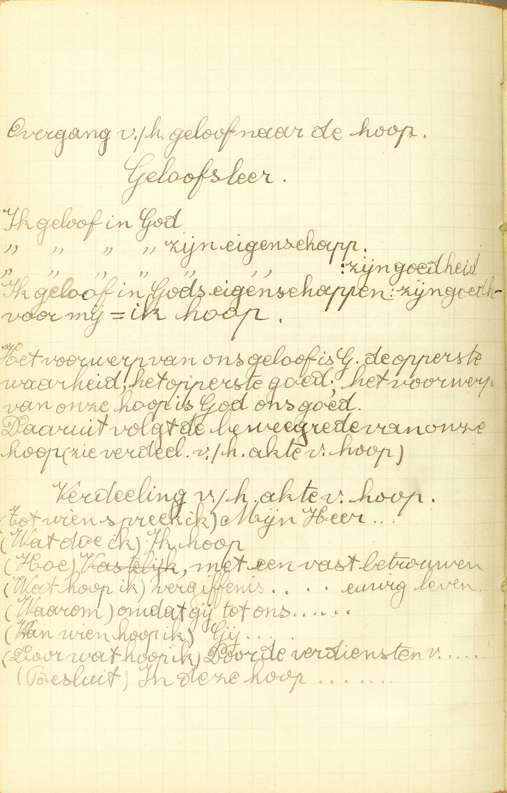
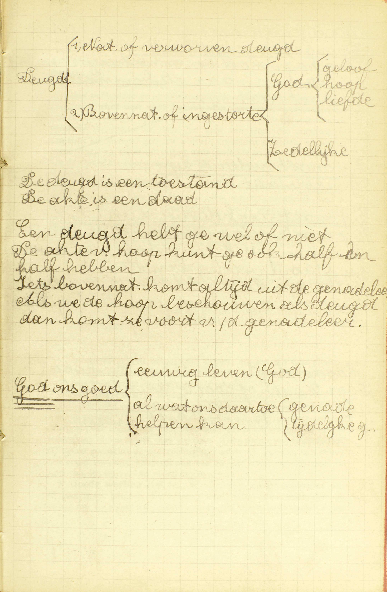
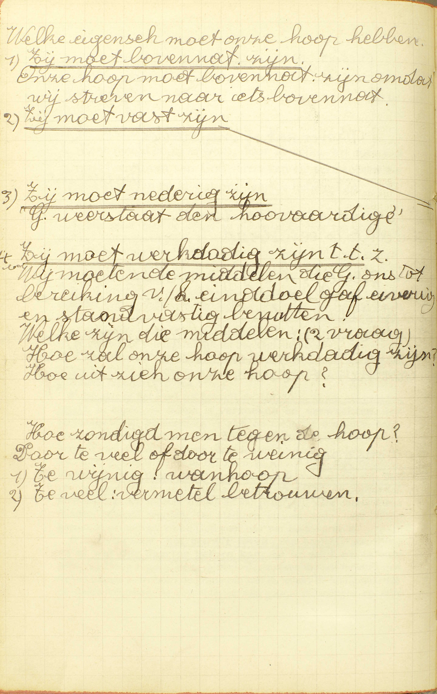
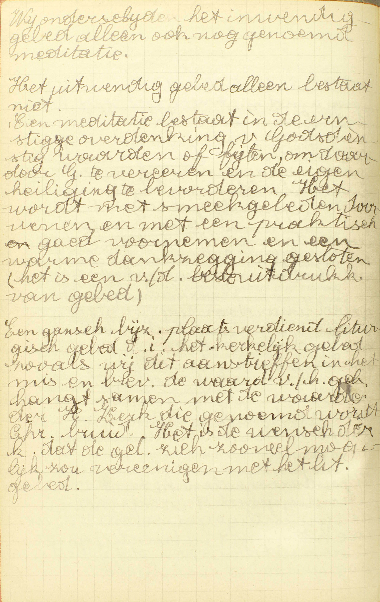
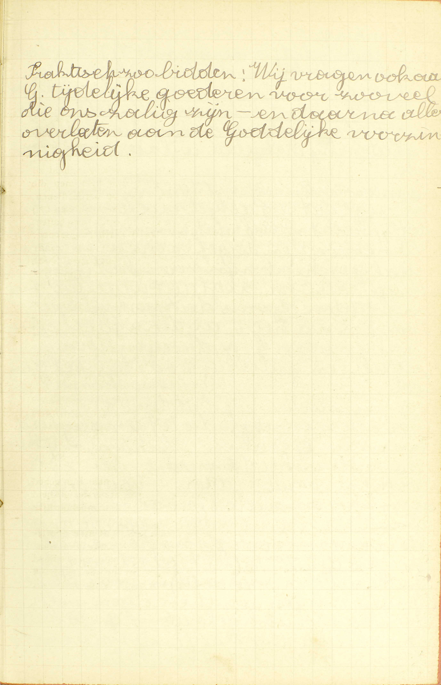
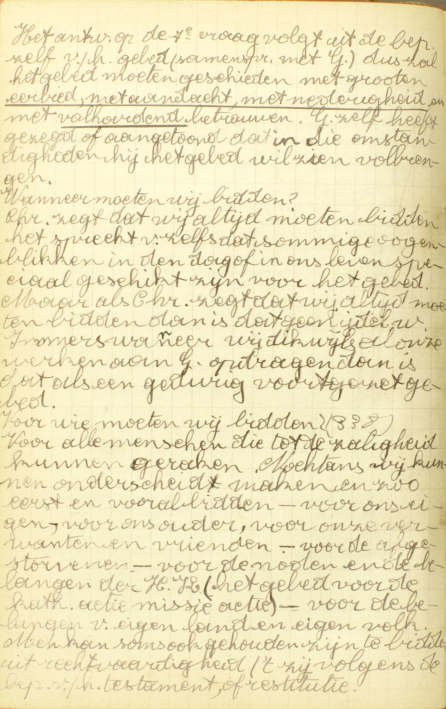
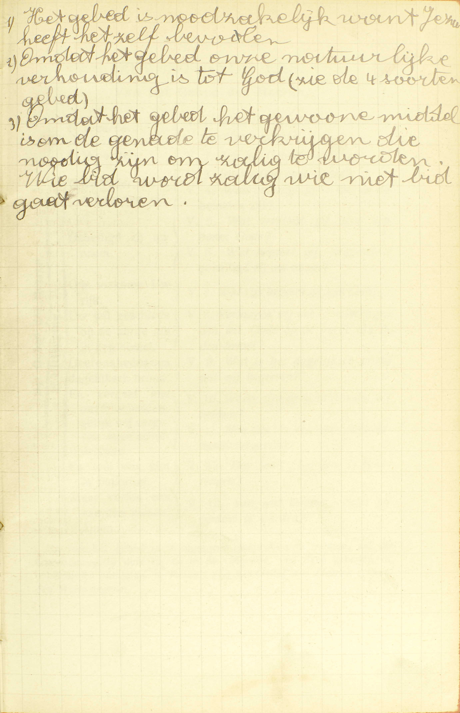

<table>
<tr>
  <td rowspan=8>**De Hoop**</td>
  <td rowspan=8 class=accolade></td>
  <td colspan=2>**De deugd van Hoop**</td>
  <td colspan=3>Bepaling van de deugd van Hoop</td>
  <td>*[Wat is de Hoop?](#wat-is-de-hoop)*</td>
</tr>
<tr>
  <td rowspan=7>*[**De middelen om te verkrijgen hetgene wij hopen**](#welke-middelen-zijn-er-om-te-verkrijgen-hetgene-wij-hopen)*</td>
  <td rowspan=7 class=accolade></td>
  <td colspan=4>1° Een godvruchtig leven</td>
</tr>
<tr>
  <td colspan=4>2° Goede werken</td>
</tr>
<tr>
  <td rowspan=5>3° Het gebed</td>
  <td rowspan=5 class=accolade></td>
  <td>Natuur van het gebed</td>
  <td>*[Wat is het gebed?](#wat-is-het-gebed)*</td>
</tr>
<tr>
  <td>De bekwaamste plaats om te bidden</td>
  <td>*[Zijn de kerken meer bekwaam om te bidden dan andere plaatsen?](#zijn-de-kerken-meer-bekwaam-om-te-bidden-dan-andere-plaatsen)*</td>
</tr>
<tr>
  <td>De manier waarop wij de verschillende dingen behoren te begeren in het gebed</td>
  <td>*[Behoort men alle dingen op één manier te begeren in het gebed?](#behoort-men-alle-dingen-op-één-manier-te-begeren-in-het-gebed)*</td>
</tr>
<tr>
  <td>De beletsels van het uitwerksel van het gebed</td>
  <td>*[Waaruit komt het dat er velen bidden en niet verkrijgen?](#waaruit-komt-het-dat-er-velen-bidden-en-niet-verkrijgen)*</td>
</tr>
<tr>
  <td>De manier om wel te bidden</td>
  <td>*[Hoe moet men bidden?](#hoe-moet-men-bidden)*</td>
</tr>
</table>

Hoe dit tweede deel met het eerste verbonden is, hebben wij reeds gezegd in de [eerste les](les-01.html#hoeveel-delen-zijn-er-van-de-christelijke-leer).

# Wat is de Hoop?

## Een deugd en gave Gods, door dewelke wij met een vast betrouwen van God verzoeken en verwachten het eeuwig leven, en al wat ons daartoe helpen kan

  
  <em>Overgang van het geloof naar de hoop. Geloofsleer Ik geloof in God. Ik geloof in zijn eigenschappen. Ik geloof in zijn eigenschappen: zijn goedheid. Ik geloof in Gods eigenschappen: zijn goedheid voor mij = *ik hoop.* 
Het voorwerp van ons geloof is God, de opperste waarheid, het opperste goed; het voorwerp van onze hoop is God, ons goed. Daaruit volgt de beweegreden van onze hoop. Verdeling van de akte van hoop. (Tot wie spreek ik) Mijn Heer, (wat doe ik) Ik hoop (Hoe) met een vast betrouwen (Wat hoop ik) vergiffenis ... eeuwig leven (Waarom) omdat gij tot ons ... (Van wie hoop ik) Gij ... (Door wat hoop ik) Door de verdienste van ... (Besluit) In deze hoop ...</em>
  
  <em>De deugd is een toestand, de akte is een daa. Een deugd hebt ge wel of niet. De akte van hoop kunt ge ook half en half hebben. Iets bovennatuurlijks komt altijd uit de genadeleer. Als we de hoop beschouwen als deugd dan komt ze voort van de genadeleer.</em>
  
  <em>Welke eigenschappen moet onze hoop hebben. 1) *Zij moet bovennatuurlijk zijn.* Onze hoop moet bovennatuurlijk zijn omdat wij streven naar iets bovennatuurlijks. 2) *Zij moet vast zijn.* 3) *Zij moet nederig zijn.* God weerstaat de hoovardige. 4) *Zij moet werkdadig zijn,* t.t.z wij moeten de middelen die God ons tot bereiking van het einddoel gaf, ijverig en standvastig benutten. Hoe zondigt men tegen de hoop? Door teveel of door te weinig. 1) Te weinig: wanhoop. 2) Teveel: vermetel betrouwen.</em>

V. Het geldt hier de *deugd* en niet enkel de *akte* van Hoop; de redenen zijn gegeven bij de [1ᵉ vraag van de 3ᵉ les](les-03.html#wat-is-het-geloof).

A. De bepaling van de Hoop leert er ons in het bijzonder van kennen: 1° de soort van zaken waartoe zij behoort; 2° de oorsprong; 3° de akte, en 4° het voorwerp.

1° De *soort van zaken waartoe zij behoort:* de Hoop is **een deugd:** een genegenheid van de ziel tot een zeker goed werk.  In de [39ᵉ les](les-39.html) zullen wij zien, dat de Hoop, evenals het Geloof en de Liefde, een goddelijke deugd is, of een deugd die God zelf tot voorwerp en de goddelijke volmaaktheden tot beweegreden heeft.

2° De *oorsprong:* de Hoop is **een gave Gods,** want zij behoort geenszins tot de natuurlijke orde, maar wordt ons van God uit loutere goedheid ingestort. ([3ᵉ les, 1ᵉ v.](les-03.html#wat-is-het-geloof))

3° De *akte* of het werk tot hetwelk de deugd van Hoop ons genegen maakt, is *hopen,* en hopen is **verzoeken en verwachten.** Iets *verzoeken* is iets begeren en er zich op toeleggen om het te bekomen; *verwachten* veronderstelt enige zekerheid van te verkrijgen hetgene men verzoekt. *Hopen* veronderstelt immers een afwezig goed dat niet zonder moeite te bekomen is, maar toch kan bekomen worden. Door de deugd van Hoop verzoeken en verwachten wij, niet van de mensen of van de Heiligen, maar **van God** de oppersten Meester, die wij moeten dienen en van wie wij, voor onze dienst. moeten beloond worden. De Heiligen kunnen maar *onze Hoop* heten, voor zoveel zij bij God voor ons ten beste spreken.

4° Het *voorwerp:* **het eeuwig leven:** de hemel ([7ᵉ les, 3ᵉ v.](les-07.html#waarom-is-de-zoon-gods-mens-geworden)) en al wat ons daartoe helpen kan, dat is, gelijk wij in onze Akte van Hoop zeggen, de vergiffenis van de zonden die ons beletten de hemel binnen te treden: de gratie om wel te leven; de heiligmakende en dadelijke gratie, de verwijdering van grote kekoringen en zelfs de tijdelijke goederen, voor zoveel deze tot onze zaligmaking dienstig zijn.

De voornoemde goederen moeten wij hopen, zegt de Catechismus, niet met *volkomen* en *onvoorwaardelijke* zekerheid van ze te bekomen, maar **met een vast betrouwen:** met volkomen zekerheid van ze te bekomen, op voorwaarde dat wij willen doen. wat daartoe vereist is: zodat er, van de kant van God, die ongetwijfeld aan zijn beloften zal getrouw blijven, volkomene zekerheid bestaat en geen vrees, en enkel van onze kant twijfel is en vrees. of wij namelijk de vereiste voorwaarde zullen vervullen van God trouw te dienen.

Wij moeten op God hopen met een vast betrouwen, omdat Hij, gelijk wij in onze Akte van Hoop zeggen, tot ons oneindig goed is, almachtig en getrouw in zijn beloften; want,
oneindig goed zijnde, *wil* Hij, oneindig machtig, *kan* Hij en oneindig getrouw aan zijn beloften, *zal* Hij ons zeker geven hetgeen wij van Hem hopen, altijd op voorwaarde dat wij Hem dienen, gelijk Hij het vereist.

# Welke middelen zijn er om te verkrijgen hetgene wij hopen?

## Een godvruchtig leven en goede werken, maar bijzonder het gebed

V. Om te verkrijgen hetgeen wij hopen, moeten wij God dienen; dus is er hier spraak van de middelen om God trouw te dienen.

A. De Catechismus duidt *drie* middelen aan:

1° **Een godvruchtig leven:** de bereidzaamheid van de wil om God te dienen, niet uit nood of dwang, maar uit groten iever en met waar genoegen. Deze bereidzaamheid, die uit haar natuur veel bijdraagt tot de dienst van God, heeft men wel te onderscheiden van de voldoening of de smaak die wij soms in de dienst van God vinden; zij maakt geenszins de godvruchtigheid zelve uit, maar zij kan er een uitwerksel van zijn, gelijk zij ook van de gesteltenis van het lichaam en zelfs van de duivel kan voortkomen.

2° **Goede werken** ([14ᵉ les, 3ᵉ v.](les-14.html#hoe-worden-de-dagelijkse-zonden-vergeven)): deze dienen voorzeker om te verkrijgen hetgeen wij hopen, want ieder goed werk met de vereiste voorwaarden gedaan: a) smeekt ons nieuwe gunsten van God af, omdat het een akte van onderwerping besluit; b) voldoet voor onze schulden om reden van de moeilijkheid of de last die het natuurlijk medebrengt; en c) verdient de eeuwigen loon, uit hoofde van de eer die er God door bewezen wordt.

3° **In het bijzonder het gebed:** de bijzonderste middel is het gebed, en wel, a) omdat wij er uitdrukkelijk in vragen hetgeen wij verzoeken en verwachten; b) omdat het de natuurlijkste, gemakkelijkste en gemeenste middel is, alsook c) omdat de H. Schrift het ons als een zeer krachtigen middel voorstelt.

# Wat is het gebed?

## Een samenspraak met God, waardoor wij aan God de begeerten van onze harten te kennen geven

  
  <em>Wij onderscheiden het inwendig gebed alleen ook nog genoemd meditatie. Het uitwendig gebed alleen bestaat niet. Een meditatie bestaat in de ernstige overdenking van Godsdienstige waarden of feiten, om daardoor God te vereren en de eigen heiligheid te bevorderen. Het wordt met smeekgebeden doorweven en met en praktisch en goed voornemen en een dankzegging gesloten (het is een van de beste uitdrukkingen van gebed).  Een gans bijzondere plaats verdient liturgisch gebed, d.i. het kerkelijk gebed zoals wij dit aantreffen in de mis en het brevier. De waarde van het gebed hangt samen met de waarden van de heilige Kerk, die genoemd wordt Christus' bruid. Het is de wens van de kerk dat de gelovige ziel zich zoveel mogelijk zou verenigen met het liturgisch gebed.</em>

A. Een gebed, in 't algemeen, is een samenspraak waardoor wij iemand te kennen geven, wat wij van hem begeren.

**Het gebed,** waarvan hier gehandeld wordt, is **een samenspraak met God,** de Oppermeester van hemel en aarde, **waardoor wij aan God de begeerten van onze harten te kennen geven,** of uitdrukken hetgeen wij van God begeren. Nochtans moet men hier, onder het woord *God,* ook de Heiligen verstaan, daar zij Gods hovelingen zijn en wij door hen tot God spreken.

Wij kunnen God de begeerten van onze harten te kennen geven op *twee* manieren: 1° op een alleen inwendige, en 2° op een tevens uitwendige wijze, volgens dat wij tot Hem spreken enkel in onze ziel, of daarbij woorden of andere uitwendige tekenen gebruiken. God hoort en kent zowel het inwendig gebed als het uitwendig; nochtans moeten wij Hem uitwendig aanroepen, daar wij Hem een dieust verschuldigd zijn overeenkomende met onze natuur, die tevens geestelijk en lichamelijk is.

# Zijn de kerken meer bekwaam om te bidden dan andere plaatsen?

## Ja: ten eerste, omdat Christus daar tegenwoordis is in het H. Sacrament; ten tweede, omdat de religuieën van de Heiligen daar bewaard worden; ten derde, omdat ze van de bisschop gewijd zijn ter ere Gods om Hem te bidden

V. Zijn de kerken beter geschikt **om te bidden dan andere plaatsen,** of, is het voordeliger in de kerken te bidden dan in andere plaatsen?

A. **Ja,** het is voordeliger om *drie* redenen:

**Ten eerste, omdat Christus daar tegenwoordig is in het H. Sacrament:** omdat Christus, God de Zoon voor ons mens geworden, met zijn god- en mensheid, met zijn lichaam en bloed onder de gedaanten van brood en wijn in de H. Mis, en onder de gedaante van brood gedurig in de kerken waarlijk tegenwoordig is. Deze tegenwoordigheid van Jezus maakt de kerken meer bekwaam om te bidden dan andere plaatsen, a) omdat het denken daaraan onze eerbied, onze aandacht en ons betrouwen vermeerdert, en b) dat een bezoek aan Jezus ons voorzeker een bijzondere gratie verwerft om wel te bidden.

**Ten tweede, omdat de reliquieën van de Heiligen** ([22ᵉ les, 7ᵉ v.](les-22.html#wat-heet-gij-reliquieën-van-de-heiligen)) **daar bewaard worden:** er zijn reliquieëen in al de altaren waarop men de H. Mis doet en, buiten deze, worden er gewoonlijk nog veel andere in de kerken bewaard. Deze reliquieën maken de kerken beter geschikt tot het bidden, a) omdat zij ons de voorbeelden van deugden indachtig maken, die de Heiligen ons gegeven hebben, en b) omdat de Heiligen bijzonder die plaatsen beschermen, waar zij vereerd worden. — Wat hier van de reliquieën gezegd is. dat geldt ook voor de beelden van de Heiligen, die insgelijks in alle kerken te vinden zijn.

**Ten derde, omdat zij van de bisschop gewijd zijn ter ere Gods om Hem te bidden:** door menigvuldige ceremoniën en gebeden in de naam van de H. Kerk gedaan, tot de dienst van God bestemd zijn; wijden immers is tot de dienst van God bestemmen. Door die wijding zijn de kerken op een bijzondere wijze tot het gebed geschikt, vermits de bisschop daarbij meermaals van God vraagt, dat al degenen die er in komen bidden, verhoord zouden worden, en zijn gebed, in de naam van de H. Kerk gedaan, bij God als opgeschreven blijft, en gedurig nieuwe zegeningen op hen doet nederdalen.

# Behoort men alle dingen op één manier te begeren in het gebed?

## Neen: want geestelijke zaken mag men volkomen begeren; maar tijdelijke dingen behoort men alleen te begeren, voor zoveel die dienen tot profijt van onze zielen

  
  <em>Praktisch zo bidden: Wij vragen ook aan God tijdelijke goederen voor zoveel die ons zalig zijn - en daarna alles overlaten aan de Goddelijke voorzienigheid.</em>

V. **Behoort men alle dingen** (de geestelijke en de tijdelijke) op dezelfde wijze **te begeren in het gebed?** — *Geestelijke* zaken zijn die welke rechtstreeks het eeuwig geluk van de zielen aangaan, zoals Gods gratie, vermindering van de bekoringen, vergiffenis van de zonden, en deze worden zo genoemd, omdat de ziel, tot wier eeuwige zaligheid zij rechtstreeks dienen, een geest is. *Tijdelijke* zaken heet men die welke rechtstreeks voor ons sterfelijk leven hier op aarde dienen, zoals spijzen, kleren, goederen, wetenschappelijke kennissen; zij dragen dezen naam, omdat zij slechts een *tijdelijk* geluk verschaffen.

A. **Geestelijke zaken mag men — volkomen begeren:** zonder enige voorwaarde van God in het gebed vragen; **maar tijdelijke dingen — behoort men alleen te begeren, voor zoveel die dienen tot profijt van onze zielen:** mag men niet volkomen vragen. maar slechts op deze voorwaarde, dat zij ons dienstig zijn tot zaligmaking van onze zielen. De reden van dit verschil is, dat de geestelijke goederen altijd dienen tot Gods ere en ons eeuwig geluk, daar integendeel de tijdelijke, oorzaak kunnen zijn, dat wij jod vergrammen en onze ziel verliezen; welnu, wij mogen voorzeker van God niets vragen, dat ons tot zou zou kunnen leiden.

# Waaruit komt het dat er velen bidden en niet verkrijgen?

## Omdat zij niet bidden gelijk het behoort, of dingen begeren, die hun schadelijk of minder profijtig zijn

A. Dat velen bidden en niet verkrijgen wat zij vragen, dit kan uit *twee* oorzaken voortkomen:

1° **Dat zij niet bidden gelijk het behoort:** omdat hun gebed niet wel, niet betamelijk gedaan is; want God, de opperste wijsheid en heiligheid, kan geen vraag aanhoren, die op een onbehoorlijke wijze geschiedt;

2° **Of dingen begeren — die hun schadelijk of minder profijtig zijn:** die tot hun zaligheid nadelig, of ten minste minder voordelig zijn dan het gemis daarvan; God immers is door zijn goedheid belet zulke gebeden te aanhoren. Dikwijls ware het ons schadelijk of minder profijtig het gevraagde tijdelijk goed te verkrijgen, omdat wij God zouden beginnen te dienen meer uit begeerte van dat goed dan uit geest van Geloof.

# Hoe moet men bidden?

## Met grote eerbiedigheid, aandachtigheid en volstandigheid

  
  <em>Het antwoord op de 1ᵉ vraag volgt uit de bepaling zelf van het gebed (samenspraak met God), dus zal het gebed moeten geschieden met grote *eerbied, met aandacht, met nederigheid* en met *volhardend* betrouwen. God zelf heeft gezegd of aangetoond dat hij in die omstandigheden het gebed wil zien voltrekken. Wanneer moeten wij bidden? Christus zegt dat wij altijd moeten bidden. Het spreekt vanzelf dat sommige ogenblikken in de dag of in ons leven speciaal geschikt zijn voor het gebed. Maar als Christus zegt dat wij altijd moeten bidden, dan is dat geen ijdel woord. Immers wanneer wij dikwijls al onze werken aan God opdragen, dan is dat als een gedurig voortgezet gebed. Voor wie moeten wij bidden? Voor alle mensen die tot de zaligheid kunnen geraken. Nochtans wij kunnen onderscheid maken en eerst en vooral bidden - voor onszelf, voor onze ouders, voor onze verwanten en vrienden, - voor de noden en de belangen van de heilige Kerk (het gebed voor de katholieke actie, missie-actie), - voor de belngen van eigen land en eigen volk. Men kan soms ook gehouden zijn te bidden uit rechtvaardigheid, 't zij volgens de bepaling van het testament of restitutie.</em>
  
  <em>1) Het gebed is noodzakelijk, want Jezus heeft het zelf bevolen. 2) Omdat het gebed onze natuurlijke verhouding is tot God (zie 4 soorten gebed). 3) Omdat het gebed het gewone middel is om de genade te verkrijgen die nodig zijn om zalig te worden. Wie bidt, wordt zalig, wie niet bidt, gaat verloren.</em>

A. Wij moeten bidden:

1° **Met eerbiedigheid:** God de eer aanbiedende die Hem toekomt, te weten, de goddelijke en opperste eer; met **grote** eerbiedigheid, dat is, met een eerbiedigheid die overeenstemt, volgens tijd en omstandigheden en volgens ons vermogen, met de oneindige majesteit van God. Deze gesteltenis, die wij door verscheidene uitwendige tekenen, zoals door het buigen van de knieën, het samenvoegen en ten hemel heffen van de handen te kennen geven, is noodzakelijk vereist, wijl men, om iemand betamelijk aan te spreken, hem ongetwijfeld de eer moet geven die hem toekomt.

2° **Met aandachtigheid:** op God aan wie men spreekt, en op hetgeen men vraagt zoveel mogelijk denkende. Wij kunnen niet alle verstrooidheden vermijden, maar moeten ze zoveel mogelijk van ons verwijderd houden met ons vóór het gebed, wel in Gods tegenwoordigheid te stellen. Zonder deze aandachtigheid zou het gebed wederom onbetamelijk wezen.

3° **Met volstandigheid:** in het gebed volhardende, als men niet aanstonds verhoord wordt: soms wacht God om ons te geven, wat wij van Hem vragen, om ons op die wijze onze afhankelijkheid wel te doen erkennen; wie dus niet met volstandigheid bidt, die bidt niet gelijk God het wil en kan bijgevolg onmogelijk verhoord worden.

### Aanmerking

Deze les geeft ons de uitlegging van onze Akte van Hoop: *Mijn Heer en mijn God! Ik hoop dat Gijj* (wij hopen dus van God) *mij, door de verdiensten van Jezus Christus* ([7ᵉ les., 3ᵉ v.](les-07.html#waarom-is-de-zoon-gods-mens-geworden)) *zult geven vergiffenis van mijne zonden, gratie om wel te leven en hiernamaals het eeuwig leven;* hier noemen wij het voorwerp van onze Hoop: wij hopen het eeuwig leven en al wat ons daartoe helpen kan. Dan volgt de reden waarom wij op God hopen: *omdat Gij tot ons oneindig goed zijt, almachtig en getrouw in uw beloften.*

Wij hebben volmaakte voorbeelden van Hoop in Noë, die, zich op God betrouwende, de ark heeft getimmerd; in Abraham, Isaäc en Jacob, die op Gods beloften een volkomen betrouwen hadden,

### VRAGEN

Hoe is het tweede deel van de Catechismus met het eerste verbonden? — Waarvan spreekt deze les? — Hoe wordt zij verdeeld? — Wat onderzoekt de Catechismus in ieder van deze delen?

1. Tot welke soort van zaken behoort de Hoop? — Wat is een deugd? — Welke deugd is de Hoop? — Welk is haar oorsprong? — Zeg, met de woorden van de Catechismus, wat *hopen* is, en leg die woorden uit. — Van wie hopen wij door de deugd van Hoop, en waaromf — Hoe worden de Heiligen soms *onze Hoop* genoemd? — Zeg, met de woorden van de Catechismus, wat wij van God hopen, en leg die woorden uit. — Hoe hebben wij Hoop op God? — Leg het gegeven antwoord uit. — Waarom hebben wij zulk een Hoop op God? — Toon dat deze reden gegrond is.

2. Wat is er in 't algemeen vereist om te verkrijgen hetgene wij hopen? — Hoeveel middelen stelt de Catechismus daartoe in 't bijzonder voor? — Noem ze met de woorden van de Catechismus, en zeg welk de bijzonderste van die middelen is. — Wat verstaat men hier door een godvruchtig leven, en hoe is het een bijzonder middel ter zaligheid? — Waarvan moet men de godvruchtigheid wel onderscheiden? — Wat verstaat men door goede werken, en wat winnen wij er door om tot de eeuwige zaligheid te komen? — Waarom is het gebed de bijzonderste middel ter zaligheid?

3. Wat is, in 't algemeen, een gebed? — Met wie spreekt men in het gebed, waarvan de Catechismus hier handelt? — Leg dit antwoord uit. — Wat doen wij als wij in het gebed met God spreken?

4. Welk is de zin van de 4de vraag: *Zijn de kerken meer bekwaam om te bidden dan andere plaatsen?* — Welke plaatsen zijn meer bekwaam om te bidden dan andere? — Om hoeveel en om welke redenen zijn, volgens de Catechismus, deze plaatsen meer bekwaam om te bidden dan andere? — Verklaar hoe de redenen, welke de Catechismus voorstelt, wezenlijk geldig zijn. — Waar zijn er altijd reliquieën in de kerken te vinden? — Wat verstaat men door de wijding van een zaak?

5. Welk is de zin van de vraag: *Behoort men alle dingen op één manier te begeren in het gebed?* — Wat verstaat men door *geestelijke* zaken, wat door *tijdelijke,* en welk is de oorsprong van deze namen? — Hoe mogen wij, volgens de Catechismus, de *geestelijke* dingen in het gebed vragen? — Leg het antwoord uit. — Hoe behoren wij, volgens de Catechismus, de *tijdelijke* zaken te vragen? — Geef de zin van het antwoord. — Waarop rust het verschil dat bestaat tussen de manier van de geestelijke zaken en die van de tijdelijke in het gebed te begeren?

6. Bij hoeveel en bij welke oorzaken kan het komen, dat men niet verkrijgt hetgene men in het gebed vraagt? — Hoe zijn de gemelde redenen de oorzaak daarvan? — Hoe zou het verkrijgen van het tijdelijk goed, dat wij vragen, ons schadelijk of minder profijtig zijn, moesten wij het altijd bekomen?

7. Hoeveel en welke dingen zijn er tot een goed gebed vereist? — Leg ieder van die vereisten uit. — Zeg waarom ieder van die vereisten nodig is tot het gebed.

