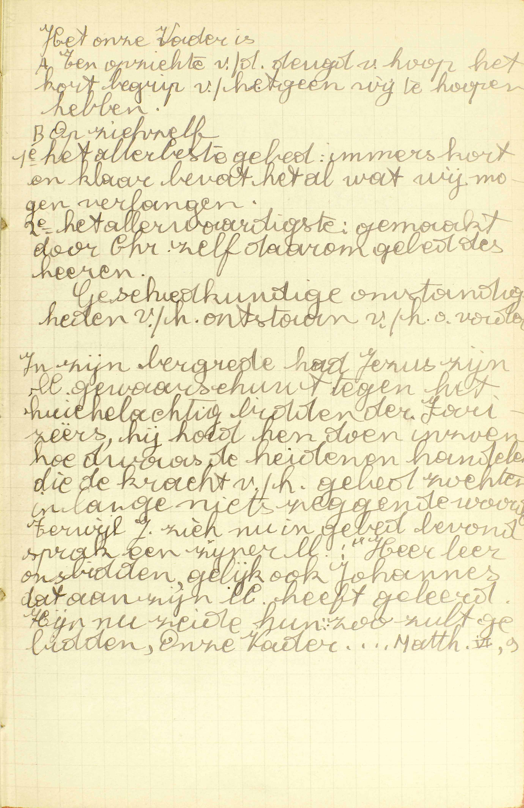
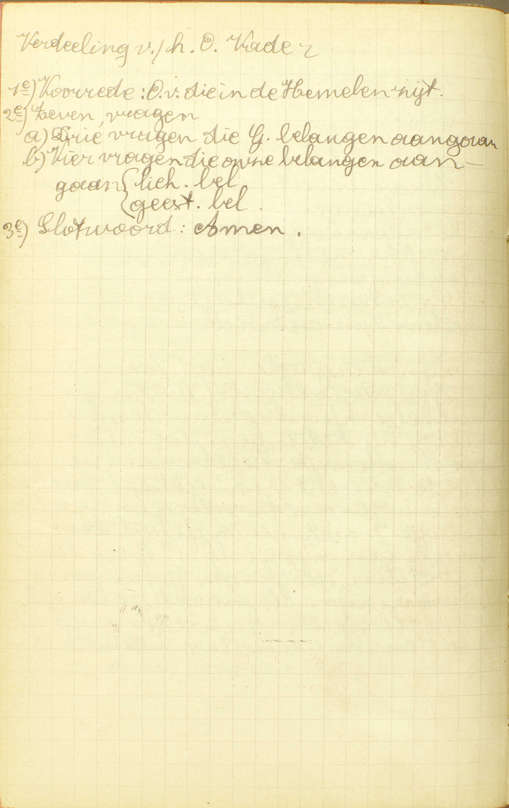
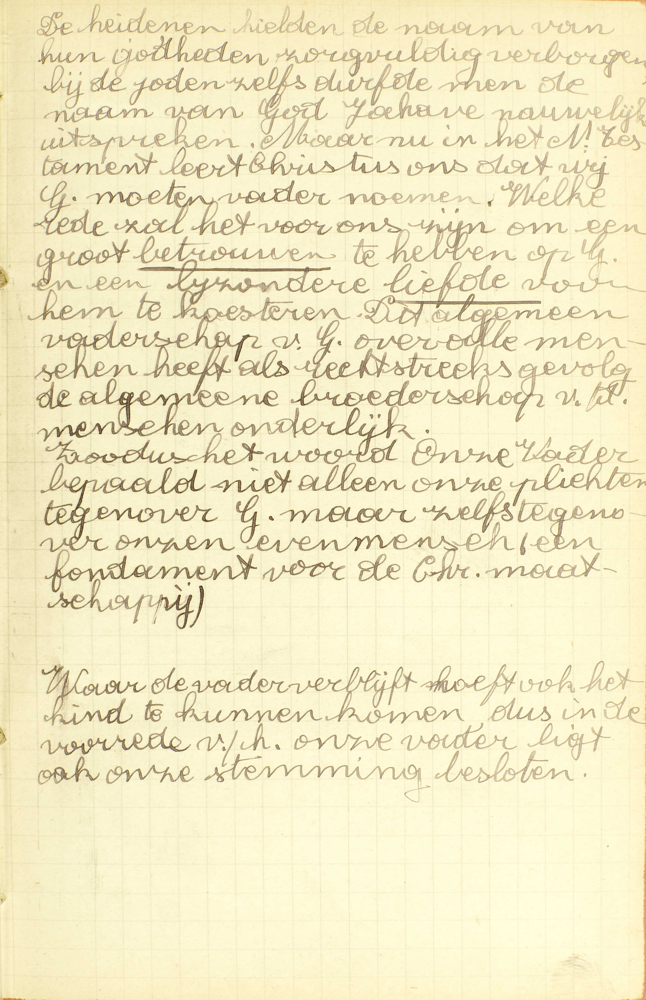
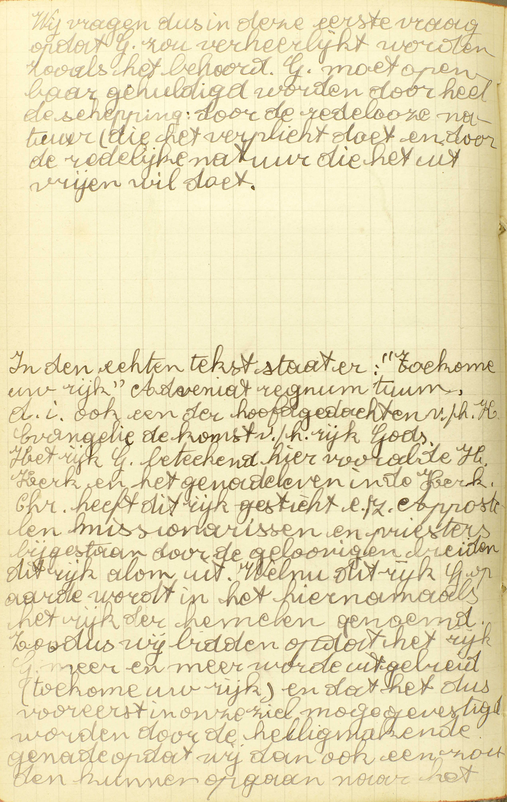
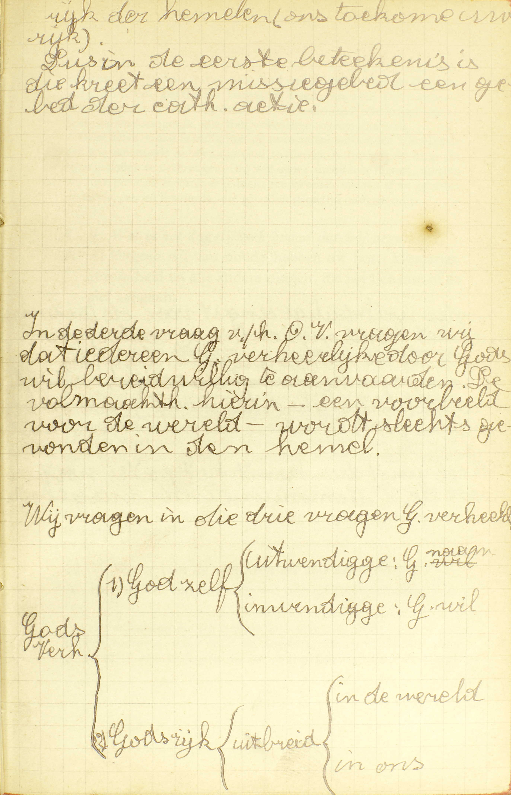
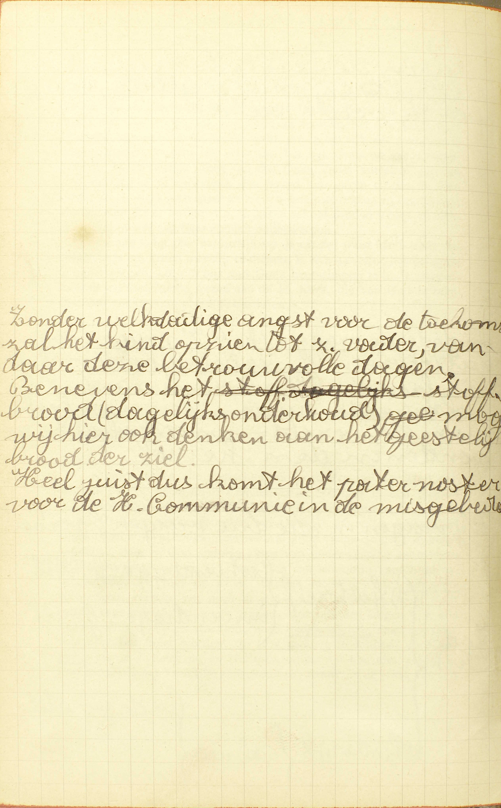
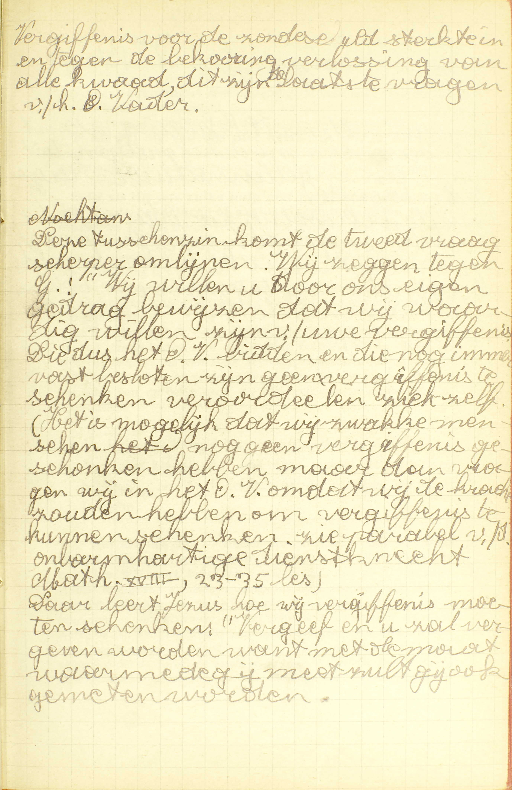
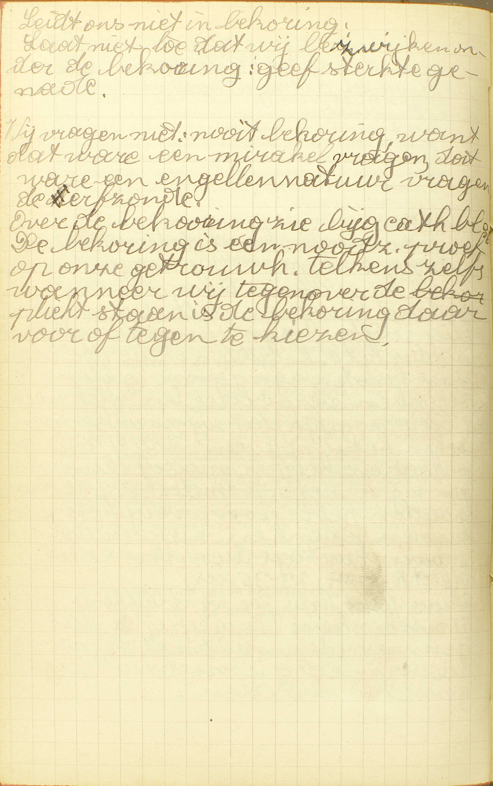
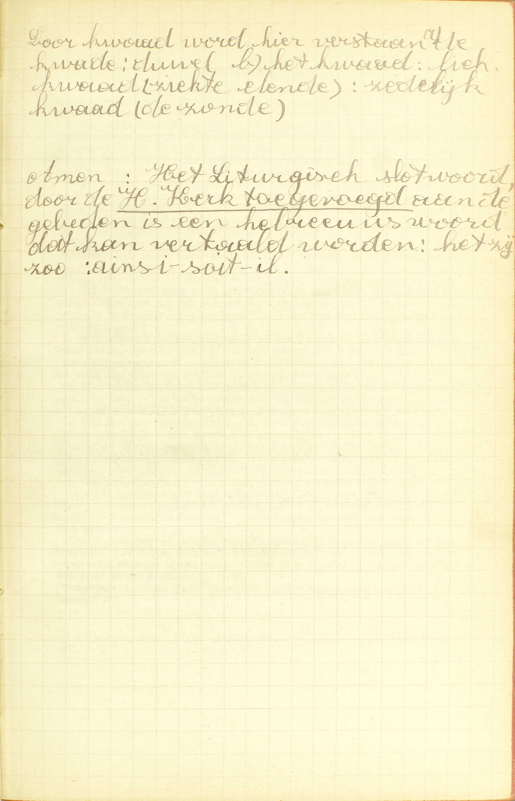
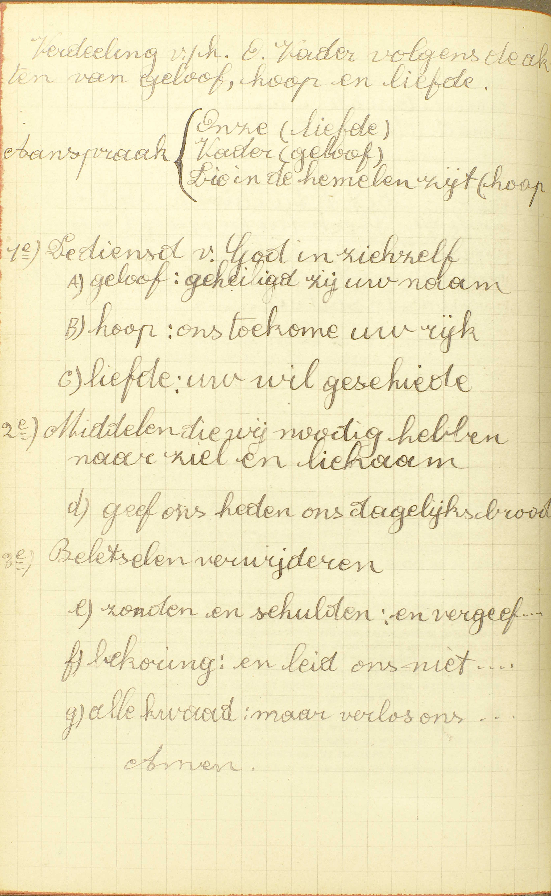

<table>
<tr>
  <td rowspan=13>**Het Gebed des Heren**</td>
  <td rowspan=13 class=accolade></td>
  <td colspan=4>**Waarde**</td>
  <td>*[Welk is het allerbeste en allerwaardigste gebed?](#welk-is-het-allerbeste-en-allerwaardigste-gebed)*</td>
</tr>
<tr>
  <td colspan=4>**Woorden**</td>
  <td>*[Zeg het Gebed des Heren](#zeg-het-gebed-des-heren)*</td>
</tr>
<tr>
  <td rowspan=11>**Uitleg**</td>
  <td rowspan=11 class=accolade></td>
  <td rowspan=2>Onze Vader, die in de hemelen zijt</td>
  <td rowspan=2 class=accolade></td>
  <td>*[Hoe is God onze Vader?](#hoe-is-god-onze-vader)*</td>
</tr>
<tr>
  <td>*[Waarom zegt gij: *die in de hemelen zijt?*](#waarom-zegt-gij-die-in-de-hemelen-zijt)*</td>
</tr>
<tr>
  <td rowspan=2>Geheiligd zij uw naam</td>
  <td rowspan=2 class=accolade></td>
  <td>*[Wat verstaat gij door de naam Gods?](#wat-verstaat-gij-door-de-naam-gods)*</td>
</tr>
<tr>
  <td>*[Wat begeert gij, zeggende: *geheiligd zij uw naam?*](#wat-begeert-gij-zeggende-geheiligd-zij-uw-naam)*</td>
</tr>
<tr>
  <td colspan=2>Ons toekome uw rijk</td>
  <td>*[Wat rijk begeert gij van God?](#wat-rijk-begeert-gij-van-god)*</td>
</tr>
<tr>
  <td colspan=2>Uw wil geschiede op de aarde als in den hemel</td>
  <td>*[Vermogen wij wel te volbrengen de wil Gods op de aarde als in de hemel?](#vermogen-wij-wel-te-volbrengen-de-wil-gods-op-de-aarde-als-in-de-hemel)*</td>
</tr>
<tr>
  <td colspan=2>Geef ons heden ons dagelijks brood</td>
  <td>*[Wat is het dagelijks brood, dat wij begeren?](#wat-is-het-dagelijks-brood-dat-wij-begeren)*</td>
</tr>
<tr>
  <td rowspan=2>En vergeef ons onze schulden, gelijk wij vergeven onze schuldenaren</td>
  <td rowspan=2 class=accolade></td>
  <td>*[Welke zijn de schulden, die wij hebben?](#welke-zijn-de-schulden-die-wij-hebben)*</td>
</tr>
<tr>
  <td>*[Hoe moeten wij onze schuldenaren vergeven?](#hoe-moeten-wij-onze-schuldenaren-vergeven)*</td>
</tr>
<tr>
  <td colspan=2>En leid ons niet in bekoring</td>
  <td>*[Hoe leidt God ons in bekoringen?](#hoe-leidt-god-ons-in-bekoringen)*</td>
</tr>
<tr>
  <td colspan=2>Maar verlos ons van den kwade. Amen</td>
  <td>*[Van wat kwaad begeert gij verlost te worden?](#van-wat-kwaad-begeert-gij-verlost-te-worden)*</td>
</tr>
</table>

Na van het gebed in ’t algemeen gesproken te hebben, zal de Catechismus, in deze lesen in de volgende, van twee gebeden in 't bijzonder handelen, te weten: van het Gebed des Heren en van de Wees gegroet.

# Welk is het allerbeste en allerwaardigste gebed?

## Het Gebed des Heren of de *Pater noster;* want dit is van Christus de oppersten Meester gemaakt, en het begrijpt al wat wij zouden mogen begeren

V. **Het allerbeste gebed:** het volmaaktste of volkomenste; **het allerwaardigste:** het gebed dat hoven alle andere onze achting verdient.

  
  <em>In zijn bergrede had Jezus zijn leerlingen gewaarschuwd tegen het huichelachtig bidden van de farizeeërs, hij had hen doen inzien hoe dwaas de heidenen handelen die de kracht van het gebed zochten in lange, nietszeggende woorden. Terwijl Jezus zich nu in gebed bevond, sprak een van zijn leerlingen: "Heer leer ons bidden, gelijk ook Johannes dat aan zijn leerlingen heeft geleerd. Hij nu zei hun: "Zo zult ge bidden, Onze Vader,..." Matth. VI, 9.</em>

A. Het allerbeste en allerwaardigste gebed is **het Gebed des Heren of de Pater noster,** in ’t Vlaams ook *Onze Vader* genoemd. Het heet: *Gebed des Heren,* omdat het gemaakt is van Christus zelf, wie op een bijzondere wijze de naam *onze Heer* gegeven wordt ([7ᵉ les, 7ᵉ v.](les-07.html#waarom-wordt-de-zoon-meer-onze-heer-genoemd-dan-god-de-vader)); *Pater noster* (letterlijk Vader Onze), omdat het in 't Latijn, en *Onze Vader,* omdat het in 't Vlaams met die woorden begint.

Het gebed des Heren is het allerbeste en allerwaardigste gebed om *twee* redenen:

1° **Omdat het van Christus de oppersten Meester gemaakt is:** omdat het gemaakt is, niet van een mens noch van een engel, maar van Christus zelf, die, als God en als mens, onze opperste leermeester is; want Hij heeft ons geleerd al wat wij moeten weten of doen om zalig te worden;

2° **Omdat het begrijpt al wat wij zouden mogen begeren:** omdat wij in dit gebed van God vragen al wat wij van Hem te vragen hebben.

De *Onze Vader* is dus het uitmuntendste gebed zowel om zijn inhoud als om zijn oorsprong.

# Zeg het Gebed des Heren

## Onze Vader, die in de hemelen zijt: 1. Geheiligd zij uw naam. 2. Ons toekome uw rijk. 3. Uw wil geschiede op de aarde als in de hemel, 4, Geef ons heden ons dagelijks brood. 5. En vergeef ons onze schulden, gelijk wij vergeven onze schuldenaren. 6. En leid ons niet in bekoring. 7. Maar verlos ons van de kwade. Amen.

  

A. De *Onze Vader* bevat vooreerst een korte voorrede of voorbereiding, bestaande uit de woorden: **Onze Vader, die in de hemelen zijt;** daarna zeven vragen, die begrijpen al wat wij kunnen begeren, en, ten slotte, het woordje: **Amen.** Al de christenen behoren dit gebed van buiten te kennen.

# Hoe is God onze Vader?

## Omdat Hij ons heeft geschapen, van de eeuwige dood verlost, door het Doopsel tot zijn kinderen aangenomen, en voor ons de hemelse erfenis heeft gereed gemaakt

  
  <em>Dit algemeen vaderschap van God over alle mensen heeft als rechtstreeks gevolg de algemene broederschap van de mensen onderling. Zodus het woord *Onze Vader* bepaalt niet alleen onze plichten tegenover God, maar zelfs tegenover onze evenmens, een fundament voor de christelijke maatschappij.</em>

V. **God** betekent hier, niet alleen God de Vader, maar de goddelijke natuur in de drie goddelijke Personen bestaande.

A. God is onze Vader om *vier* redenen:

1° **Omdat Hij ons heeft geschapen,** niet onmiddellijk, maar in Adamen Eva, uit wie wij allen geboren zijn en die Hij rechtstreeks geschapen heeft. Onze eerste ouders ontvingen van Hem niet alleen hetgeen tot de menselijke natuur vereist is, maar ook boven- en buitennatuurlijke gaven, die voor geheel hun nakomelingschap bestemd waren. ([6ᵉ les, 3ᵉ v.](les-06.html#waarvan-heeft-god-de-mens-gemaakt))

2° **Omdat Hij ons van de eeuwige dood verlost heeft:** omdat Hij ons, na Adam’s val in de zonde, door de menswording en de dood van Jezus Christus, van de hel verlost, voor ons de hemel heropend, en zijn schatten van gratiën wederom ontsloten heeft. ([7ᵉ les, 3e v.](les-07.html#waarom-is-de-zoon-gods-mens-geworden))

3° **Omdat Hij ons door het Doopsel tot zijn kinderen heeft aangenomen:** omdat Hij ons, door het Sacrament van het *Doopsel,* de heiligmakende gratie, waarvan wij door de erfzonde beroofd waren, wederom heeft ingestort, en ons daardoor opnieuw zijn aangenomene kinderen gemaakt heeft; wij zijn immers Gods aangenomene kinderen door de heiligmakende gratie. ([6ᵉ les, 3ᵉ v.](les-06.html#waarvan-heeft-god-de-mens-gemaakt))

4° **Omdat Hij voor ons de hemelse erfenis heeft gereed gemaakt:** omdat Hij ons, die zijn aangenomene kinderen zijn, voor erfenis of goddelijk goed dat wij van Hem, onze vader bij aanneming, moeten ontvangen, het eeuwig geluk van de hemel bereid heeft, dat zijn eigen geluk uitmaakt.

Ziehier in welke zin God, om deze redenen onze Vader is: 1° uit hoofde van de schepping is Hij dat in een *overdrachtelijken* zin, als voor ons gedaan hebbende, en dit op een oneindig volmaaktere wijze, alles wat een natuurlijke vader voor zijn kind doet; 2° uit hoofde van onze verheffing tot de staat van gratie in de schepping; — van onze verlossing, waardoor wij recht gekregen hebben om de verloren heiligmakende gratie opnieuw te ontvangen; — van ons Doopsels, waarin wij die gratie wederom gekregen hebben; — van de bereiding van het hemels geluk, dat de voltrekking is van de heiligmakende gratie, is Hij ook *wezenlijk* onze vader *bij aanneming,* daar Hij ons door die vier werken tot zijn kinderen heeft aangenomen.

Wij zeggen *onze Vader* en niet *mijn Vader,* omdat wij allen broeders zijn in één en hetzelfde huisgezin, waar God het hoofd van is.

# Waarom zegt gij: *die in de hemelen zijt?*

## Omdat God, hoewel Hij alle plaatsen met zijn tegenwoordigheid vervult, nochtans zich zelf en zijn glorie in de hemelen openbaart aan de Heiligen

A. **Omdat God, hoewel Hij alle plaatsen met zijn tegenwoordigheid vervult:** in alle plaatsen met zijn wezen, zijn alziende oog en zijn macht tegenwoordig is, **nochtans zich zelf:** zijn goddelijke natuur in de drie goddelijke Personen bestaande, **en zijn glorie:** zijn oneindige volmaaktheden, die een onuitputbare stof van eer, lof en glorie zijn, **in de hemelen:** in de plaats waar de gelukzaligen verblijven, — **openbaart aan de Heiligen:** aanschijn aan aanschijn aan de Heiligen laat zien.

Aangezien dat God gezegd wordt op die plaats bijzonder tegenwoordig te zijn, waar Hij een bijzonder en buitengewoon werk verricht, zo moet men ongetwijfeld van Hem zeggen, dat Hij in de hemel is, vermits Hij daar zijn uitmuntendste bijzonder werk verricht met zich zelf en zijn glorie aan de Heiligen te openbaren.

# Wat verstaat gij door de naam Gods?

## God zelf, en al wat men God toeschrijft, als zijn almogendheid, goedheid, liefde, enz.

A. **God zelf:** de goddelijke natuur in de drie goddelijke Personen bestaande, — **en al wat men God toeschrijft:** en al de volmaaktheden die God toebehoren en die wij Hem daarom moeten toeschrijven. Dus is het niet het woord *God,* maar wel de *godheid* zelve die wij hier onder de uitdrukking de *naam* Gods verstaan, gelijk wij dikwijls onder de naam van de koning de koning zelf, zijn macht en hoedanigheid willen aanduiden.

# Wat begeert gij, zeggende: *geheiligd zij uw naam?*

## Dat God van ons en alle mensen moge gekend, gediend en geëerd worden.

  
  <em>Het rijk Gods betekent hier vooral de H. Kerk en het genadeleven in de Kerk. Christus heeft dit rijk gesticht en zijn Apostelen, missionarissen en priesters, bijgestaan door de gelovigen, breiden dit rijk alom uit. Welnu, dit rijk op aarde wordt in het hiernamaals het rijk der hemelen genoemd.</em>
  
  <em>In de derde vraag van het Onze Vader vragen wij dat idereen God verheerlijkt door Gods wil bereidwillig te aanvaarden. De volmaaktheid hirin - een voorbeeld voor de wereld - wordt slechts gevonden in de hemel.</em>

A. Zeggende **geheiligd zij uw naam,** drukken wij de begeerte uit, niet dat God heilig of heiliger worde, maar wel **dat God van ons en van alle mensen:** van de gelovigen en ook van al de andere mensen van deze aarde — **moge gekend:** door de rede en het Geloof als de enige ware God moge gekend en erkend, — **gediend:** met ware onderwerping van de wil aan de rede en de Openbaring moge erkend, — en door het dadelijk erkennen van zijn opperste majesteit moge **geëerd worden.** De woorden *gediend* en *geëerd* komen dus het voorgaande *gekend* bepalen.

Deze vraag is noodzakelijk de eerste in het gebed dat bevat al wat wij kunnen begeren; immers, al hetgeen wij hier op aarde te doen en te begeren hebben, komt uit op God te dienen ([1ᵉ les, 7ᵉ v.](les-01.html#wat-is-de-mens-van-node-om-tot-zijn-einde-de-komen)) en het eerste dat wij nodig hebben om Hem te dienen, is Hem als God te kennen en te erkennen.

# Wat rijk begeert gij van God?

## Het rijk van de Hemelen, dat God zijn dienaren beloofd heeft na dit leven

A. **Het rijk van de hemelen:** de hemel wordt een *rijk* genoemd, omdat God er, op de volmaaktste wijze, over al de Engelen en Heiligen heerst; **dat God zijn dienaren:** degenen die Hem hier op aarde kennen, beminnen en trouw tot het einde van het leven dienen, als loon **beloofd  heeft na dit leven.** Nochtans moet hier onder het woord *rijk* ook nog verstaan worden het rijk Gods hier op aarde, te weten, de H. Kerk; want, om in het rijk van de hemelen te kunnen komen, moeten wij eerst aan het rijk Gods op aarde toebehoren. In de tweede vraag van de Onze Vader smeken wij dan God, dat Hij al de mensen de hemel zou geven, en, dat te die einde, de H. Kerk zich meer en meer zou uitstrekken eu versterken; dat degenen die er buiten zijn, in haar schoot zouden treden en allen zich volkomener aan haar zouden onderwerpen.

Deze vraag volgt zeer natuurlijk op de eerste; want het tweede dat vereist is om een meester te dienen, is zich aan zijn heerschappij te onderwerpen, en‚ om ons aan Gods heerschappij te onderwerpen, moeten wij onderdanig wezen aan de H. Kerk, die van God is ingesteld om ons in zijn plaats te bestuuren.

# Vermogen wij wel te volbrengen de wil Gods op de aarde als in de hemel?

## A. Niet zo volmaakt, maar wij verzoeken hulp om God te dienen zonder Hem te vergrammen, gelijk de Engelen doen

V. Kunnen wij en alle mensen zo goed de wil van God volbrengen hier op aarde als de Engelen en de Heiligen in de Hemel?

A. **Niet zo volmaakt** kunnen wij dat; immers, de Engelen en de Heiligen volbrengen de wil Gods 1° *ten volle,* daar zij niet uitsluitend al zijn geboden, maar ook al zijn raden volgen; 2° *onophoudelijk,* daar zij God gedurig akten van onderwerping aanbieden, en 3° *allervurigst,* daar zij God aanschijn aan aanschijn aanschouwen. Integendeel, wij hier op aarde, kunnen Gods wil noch *ten volle* volbrengen, vermits wij noch alle zijn raden kunnen volgen, noch zonder een gans bijzondere gratie, gedurende een langen tijd, alle half vrijwillige zonden kunnen vluchten; noch *onophoudelijk,* daar wij door vele oorzaken belet worden, op God gedurig te denken; noch *zo vurig* als de Engelen en de Heiligen, omdat wij hier niet, gelijk zij, God aanschijn aan aanschijn aanschouwen; **maar,** in de vraag van de Onze Vader: *uw wil geschiede op de aarde als in de hemel,* **verzoeken wij hulp** (gratie) — **om God te dienen zonder Hem te vergrammen, gelijk de Engelen doen:** om, naar het voorbeeld van de Engelen, zó God te dienen, dat wij ten minste alle vrijwillige en zelfs, zoveel mogelijk, alle half-vrijwillige zonden vluchten.

Deze derde vraag is innig met de twee eerste verbonden: het derde dat wij van node hebben om God te dienen, is immers de hulp om zijn geboden te volbrengen. Om wel een meester te dienen, moeten wij hem eerst als meester erkennen; ten tweede, ons aan zijn geboden onderwerpen, en ten derde, die geboden stiptelijk onderhouden.

# Wat is het dagelijks brood, dat wij begeren?

## Al hetgeen wij van node hebben tot kost, kleren, gezondheid, en al andere dingen, die het lichaam of de ziel aangaan

  
  <em>Benevens het stoffelijk brood mogen wij hier ook denken aan het geestelijk brood van de ziel. Heel juist dus komt het pater noster voor de H. Communie in de misgebeden.</em>

A. **Al hetgeen wij van node hebben tot kost:** om ons lichaam te spijzen, **kleren:** om ons lichaam te dekken, **gezondheid:** om deze te bewaren, als wij in goeden staat, en ze te herstellen, als wij ziek of zwak zijn, **en al andere dingen die het lichaam,** b.v. de fortuin en de voorspoed op deze wereld, **of de ziel aangaan,** zoals de heiligmakende en de dadelijke gratie, de HH. Sacramenten, de vergiffenis van de zonden, het woord Gods, enz; het tijdelijk goed nochtans alleen voor zoveel het dient tot profijt van onze zielen. Dit alles komt onder het woord *dagelijks brood,* aangezien dat wij daardoor gewoonlijk betekenen al hetgene wij meest nodig hebben.

Deze vraag volgt natuurlijk op de voorgaande: na van God verzocht te hebben hetgene rechtstreeks zijn dienst uitmaakt, smeken wij van Hem de middelen af die wij nodig hebben om Hem dadelijk te kunnen dienen.

# Welke zijn de schulden, die wij hebben?

## De zonden, om dewelke wij pijn of straf schuldig zijn

A. De **schulden** die wij hebben, zijn niet al de zonden die wij ooit hebben bedreven, maar enkel **de zonden, om dewelke wij pijn of straf** (de pijn is de straf van de zonde) **schuldig zijn:** de zonden die óf nog op gener wijze vergeven zijn, óf waarvoor er ten minste nog enige tijdelijke pijn te lijden blijft.

Deze vraag ook komt op haar plaats: nadat wij van God de nodige middelen gevraagd hebben om Hem te kunnen dienen, beginnen wij van Hem de verwijdering te verzoeken van de beletselen in zijn dienst; het eerste beletsel nu zijn de zonden en de pijnen van de zonden: de doodzonde maakt ons vijanden van God; de dagelijkse zonde doet ons in de dienst van God verflauwen, en de tijdelijke pijnen beletten ons, na de dood rechtstreeks de hemel binnen te gaan.

# Hoe moeten wij onze schuldenaren vergeven?

## Wij moeten de een de andere uit van de harte vergeven hetgeen tegen ons misdaan is, geen straf daarvan verzoekende

  
  <em>Het is mogelijk dat wij zwakke mensen nog geen vergiffenis geschonken hebben, maar dan vragen wij in het Onze Vader dat wij de kracht zouden hebben om vergiffenis te kunnen schenken. Zie parabel van de onbarmhartige dienstknecht, Matth. XVIII, 23-35.</em>

V. **Onze schuldenaren:** degenen die ons beleedigd, of ons hetzij in ons lichaam, hetzij in onze fortuin, hetzij in onze eer, hetzij in onze geestelijke goederen enig ongelijk aangedaan hebben.

A. **Wij moeten — de een de andere:** elkander, wie de schuldenaar ook weze, vriend of vijand, bekend of onbekend, enz., niet alleen met de mond, maar **uit van de harte:** met oprechte meening **vergeven hetgeen tegen ons misdaan is:** vergeven alle kwaad hoe groot en hoe zwaar het ook moge wezen, **geen straf daarvan verzoekende:** daar ten minste geen straf van verzoekende *uit haat of ongeregelde wraakzucht,* want wij mogen vóór de rechtbanken schadeherstelling en straf eisen, en somwijlen zelfs behoren wij dat te doen, ten einde daardoor de kwaadwilligen schrik in te boezemen en de orde in de samenleving te handhaven.

Willen wij van God vergiffenis van onze schulden bekomen, dan moeten wij noodzakelijk beginnen met zelf onze schuldenaren te vergeven; anders zouden wij de tegen ons gepleegde belediging hoger achten dan de oneindige oneer, door onze zonden God aangedaan.

# Hoe leidt God ons in bekoringen?

## Als Hij die van ons niet keert, of als Hij ons zulke hulp niet geeft, met dewelke wij alle kwade bekoringen of aanlokkingen tot zonden wederstaan

  
  <em>De bekoring is een noodzakelijke proef op onze getrouwheid. Telkens zelfs wanneer wij tegenover de plicht staan, is de bekoring daar, voor of tegen te kiezen.</em>

V. Een **bekoring** is een uitwendige of inwendige zaak die ons tot zonde beweegt of aanlokt.

A. In *twee* gevallen zegt men dat God ons in bekoring leidt:

1° **Als Hij die van ons niet keert:** als Hij, tot straf van onze ongetrouwheid, die bekoringen van ons niet verwijdert, waar Hij gewoonlijk de deugdzame mensen van bevrijdt: God keert gemeenlijk niet alle bekoringen van ons af;

2° **Of als Hij ons zulke hulp niet geeft, met dewelke wij alle kwade bekoringen of aanlokkingen tot zonden wederstaan:** als hij ons slechts een mindere gratie verleent, met dewelke wij minder gemakkelijk, dan doorgaans de goede mensen, de bekoringen kunnen overwinnen; nooit immers weigert God genoegzame gratie om de bekoring te wederstaan.

Deze woorden van de Onze Vader: *leid ons niet in bekoring,* geven dan geenszins te verstaan, dat God ons soms wezenlijk tot zonde zou aanlokken.

De 6ᵉ vraag staat in nauw verband met de 5ᵉ; de bekoringen, die ons tot zonden leiden, zijn een tweede beletsel in de dienst des Heren; daarom, na van Hem gevraagd te hebben, dat Hij ons de bedrevene zonden zou vergeven, verzoeken wij, dat Hij ons ook zou bevrijden van de bekoringen, die ons wederom in zonde zouden doen vallen.

# Van wat kwaad begeert gij verlost te worden?

## Van alle kwaad, dat ons naar ziel of lichaam mag hinderen, en de tijdelijke of de eeuwige welvaart beletten

  
  <em>Amen: het liturgische slotwoord, door de H. Kerk toegevoegd aan de gebeden, is een Hebreeuws woord, dat kan vertaald worden: het zij zo: ainsi-soit-il.</em>

A. **Van alle kwaad,** zonder uitzondering, — **dat ons naar ziel of lichaam mag hinderen** ([9ᵉ v.](TODO)), en zo de tijdelijke of de eeuwige welvaart beletten: wij vragen dus in 't algemeen, verlost te zijn van al hetgeen enigszins onze zaligheid zou kunnen schaden; van hetgeen ze *rechtstreeks* zou schaden met de ziel te hinderen, of *onrechtstreeks* met het lichaam te hinderen in die zaken welke de ziel aangaan. Strikt genomen, betekent **van de kwade,** in de laatste vraag van de Onze Vader, enkel *van de duivel;* doch, aangezien dat de duivel de eerste oorsprong is van alle kwaad, zo is de bovenstaande uitlegging voor volkomen goed te houden. De hele vraag: *maar verlos ons van de kwade,* komt dus hier op uit: in plaats dat Gij, o Vader, ons in bekoring zoudt leiden, verlos ons liever van alle kwaad.

Thans blijkt het klaar, hoe wij in de Onze Vader wezenlijk alles vragen wat wij zouden mogen begeren: al hetgeen wij hier te begeren hebben, is God wel te dienen om Hem zo hiernamaals eeuwig te mogen aanschouwen, en hiertoe zijn drie dingen vereist: 1° hetgeen de dienst Gods in zich zelf uitmaakt, 2° de nodige krachten om God gemakkelijk te dienen, 3° de verwijdering van alle beletsels in zijn dienst. Welnu, in de drie eerste vragen bidden wij om de dingen die de dienst Gods uitmaken, te weten, om Hem te mogen erkennen, ons aan zijn heerschappij te onderwerpen en zijn geboden te volbrengen; in de 4° vraag verzoeken wij van God al de hiertoe vereiste middelen, en, in de drie laatste, smeken wij Hem, dat Hij al de beletsels in zijn dienst van ons zou verwijderen, namelijk, de zonden en schulden, de te grote bekoringen waaraan Hij ons, tot straf van onze zonden, zou laten bloot staan, en alle aanvallen van de duivel.

### VRAGEN

  

Hoe is deze les met de voorgaande verbonden? — Waarvan spreekt deze les? — Hoe wordt zij verdeeld?

1. Wat betekenen de woorden: *het allerbeste en allerwaardigste gebed?* — Leg de namen uit: *Gebed des Heren* en *Pater noster.* — Hoe wordt dit gebed in ’t Vlaams genoemd, en waarom? — Om hoeveel en om welke redenen is de Onze Vader het allerbeste en allerwaardigste gebed? — Leg die redenen uit. — Onder welke opzichten is dit gebed dus het allerbeste en allerwaardigste? .

2. Wat bevat het Gebed des Heren in 't bijzonder? — Moeten wij dit gebed kennen?

3. Aan wie spreken wij, als wij zeggen: *Onze Vader, die in de hemelen zijt:* is het aan God de Vader, de eersten Persoon van de H. Drievuldigheid alleen? — Om hoeveel en om welke redenen wordt God *onze Vader* genoemd? — Hoe zijn *wij* van God geschapen, en in welke staat heeft Hij onze eerste ouders geschapen? — Wat betekenen de woorden: *van de eeuwige dood verlost,* en hoe heeft God dat gedaan? — Hoe heeft Hij ons door het Doopsel tot zijn kinderen aangenomen? — Wat betekenen de woorden: *voor ons de eeuwige erfenis heeft gereed gemaakt?* — Op welke wijze is God, uit hoofde van die redenen, wezenlijk onze Vader? — Waarom zeggen wij: *onze* Vader, en niet: *mijn* Vader?

4. Wordt er van God gezegd: *die in de hemelen zijt,* om te betekenen, dat Hij uitsluitend in de hemel is? — Waar is Hij? — Om welke reden wordt dat van God gezegd? — Hoe is die reden geldig? — Wat betekenen de woorden: *zich zelf en zijn glorie in de Hemelen openbaart aan de Heiligen?*

5. Hoe mag men in de vraag: *geheiligd zij uw naam,* de woorden *naam Gods* met zekerheid niet opvatten? — Welk is de ware zin van die woorden, en hoe kunnen zij die betekenis hebben? — Wat betekenen de woorden: *God zelf, — al wat men Hem toeschrijft?*

6. Zeg, met de woorden van de Catechismus, door wie, volgens onze vraag in de Onze Vader, de naam Gods geheiligd moet worden. — Leg die woorden uit. — Wat betekent hier. volgens de Catechismus, het woord *geheiligd?* — Leg het antwoord uit. — Welke zin mogen wij hier dus niet aan het woord *geheiligd* geven? — Hoe is de vraag: *geheiligd zij uw naam,* de eerste van de Onze Vader?

7. Wat verstaat de Catechismus door het woord *rijk* in de vraag: *ons toekome uw rijk?* — Wat is er, boven hetgene de Catechismus zegt, door dat woord hier nog te verstaan, en waarom? — Waarom wordt de hemel het *rijk Gods* genoemd? — Welke zijn de dienaren aan wie God de hemel beloofd heeft, en hoe heeft hij hun de hemel beloofd? — Wat verzoeken wij dan van God in de tweede vraag? — Hoe volgt deze vraag op de eerste?

8. Kunnen wij de wil Gods hier op aarde zo volmaakt volbrengen als de Engelen en de Heiligen het doen in de hemel? — Hoe volmaakt volbrengen de Engelen en de Heiligen Gods wil in de hemel? — Bewijs dat wij hier op aarde, niet zo volmaakt als zij in de hemel, de goddelijken wil kunnen volbrengen. — Wat vragen wij dan volgens de Catechismus, als wij zeggen: *uw wil geschiede op de aarde als in de hemel?* — Hoe is deze derde vraag met de twee vorige verbonden?

9. Wat betekent de uitdrukking: *dagelijks brood,* in de vraag: *geef ons heden ons dagelijks brood?* — Verklaar ieder deel van het antwoord, dat de Catechismus daarop geeft. — Hoe heeft die uitdrukking zulk een betekenis? — Hoe volgt deze vraag van de Onze Vader op de voorgaande?

10. Wat wordt er verstaan door het woord *schulden* in de vraag: *vergeef ons onze schulden?* — Van welke zonden is er hier spraak? — Hoe komt die vraag hier te pas? — Hoe zijn onze zonden een beletsel om God te dienen?

11. Wie zijn onze schuldenaren? — Aan welke schuldenaren moeten wij vergiffenis schenken? — Hoe moeten wij hun vergeven? — Wat moeten wij hun vergeven? — Waarin bestaat de vergiffenis, die wij hun moeten geven? — Sluit zij alle schadeherstelling en alle straf uit? — Waarom vragen wij aan God enkel vergiffenis van onze schulden, *voor zoveel* wij onze schuldenaren vergeven?

12. Wat is een bekoring? — Lokt God ons soms wezenlijk tot het kwaad aan? — In welke gevallen wordt God, volgens de Catechismus, gezegd ons in de bekoring te leiden? — Leg die gevallen uit. — Wat vragen wij dan als wij zeggen: *leid ons niet in bekoring?* — Welke plaats bekleedt deze vraag in de Onze Vader?

13. Wat verzoeken wij, volgens de Catechismus, in de laatste vraag van de Onze Vader? — Leg de woorden van de Catechismus uit. — Geef de zin van het woordje maar van de laatste vraag. — Wat is er eigenlijk te verstaan door de woorden: *van de kwade?*

Toon hoe de Onze Vader wezenlijk begrijpt al wat wij zouden kunnen begeren.

