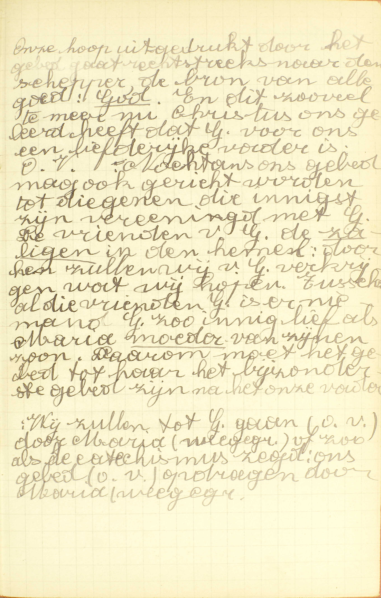
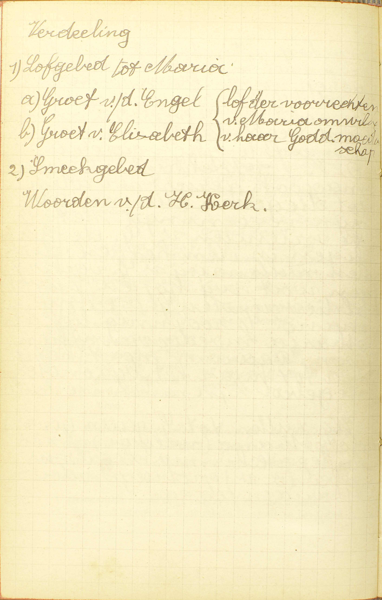
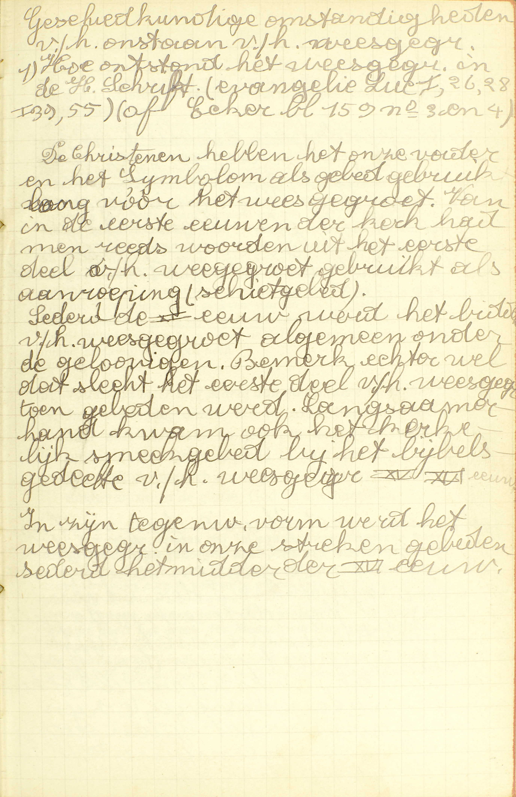
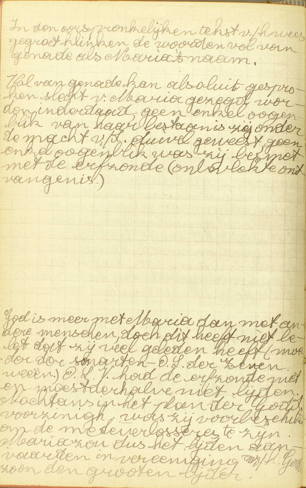
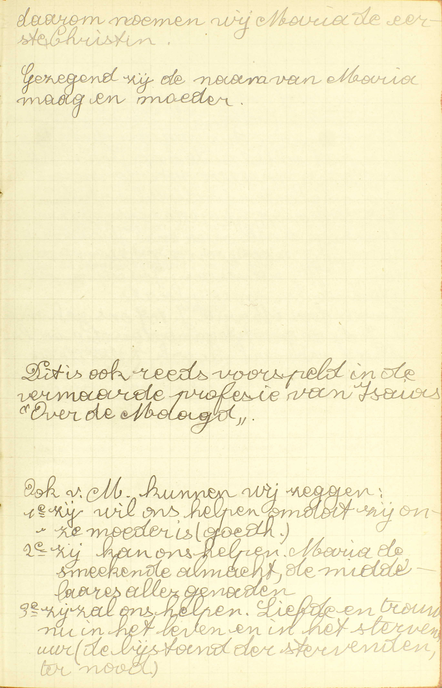
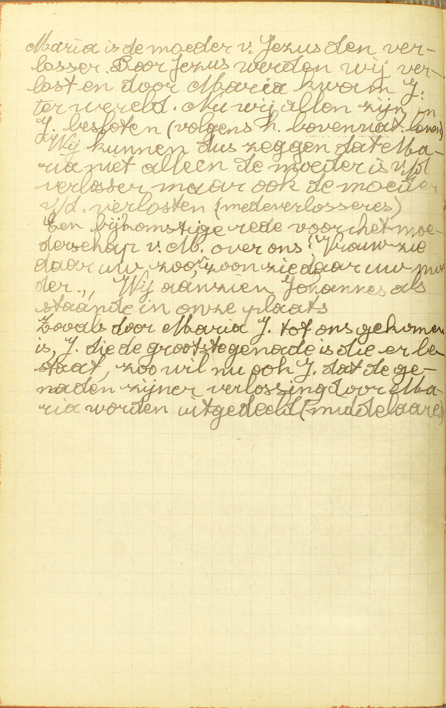

<table>
<tr>
  <td rowspan=7>**De Begroeting van de Engel of het Wees Gegroet**</td>
  <td rowspan=7 class=accolade></td>
  <td colspan=3>**1° Gebruik en reden daarvan**</td>
  <td></td>
  <td>*[Waarom voegt men gemeenlijk de Begroeting van de Engel na het Gebed des Heren?](#waarom-voegt-men-gemeenlijk-de-begroeting-van-de-engel-na-het-gebed-des-heren)*</td>
</tr>
<tr>
  <td rowspan=2 colspan=3>**2° Woorden**</td>
  <td rowspan=2 class=accolade></td>
  <td>*[Hoe zegt gij de Begroeting van de Engel?](#hoe-zegt-gij-de-begroeting-van-de-engel)*</td>
</tr>
<tr>
  <td>*[Wie heeft de Begroeting van de Engel gemaakt?](#wie-heeft-de-begroeting-van-de-engel-gemaakt)*</td>
</tr>
<tr>
  <td rowspan=4>**3° Uitleg**</td>
  <td rowspan=4 class=accolade></td>
  <td>Wees gegroet, Maria, vol van gratie</td>
  <td></td>
  <td>*[Waarom noemt gij Onze Lieve Vrouw *vol van gratie?*](#waarom-noemt-gij-onze-lieve-vrouw-vol-van-gratie)*</td>
</tr>
<tr>
  <td>De Heer is met u</td>
  <td></td>
  <td>*[Is God meer met Maria dan met andere mensen?](#is-god-meer-met-maria-dan-met-andere-mensen)*</td>
</tr>
<tr>
  <td>Gebenedijd zijt gij boven alle vrouwen</td>
  <td></td>
  <td>*[Waarin is Maria gebenedijd boven alle vrouwen?](#waarin-is-maria-gebenedijd-boven-alle-vrouwen)*</td>
</tr>
<tr>
  <td>Heilige Maria, Moeder Gods, bid voor ons, arme zondaars, nu en in het uur van onze dood. Amen</td>
  <td></td>
  <td>*[Wat hulp of bijstand mogen wij van de H. Maagd verwachten?](#wat-hulp-of-bijstand-mogen-wij-van-de-heilige-maagd-verwachten)*</td>
</tr>
</table>

# Waarom voegt men gemeenlijk de Begroeting van de Engel na het Gebed des Heren?

## Om door de H. Maagd ons gebed aan God op te dragen

  
  <em>Onze hoop uitgedrukt door het gebed gaat rechtstreeks naar de Schepper, de bron van alle goed: God. En dit zoveel te meer nu Christus ons geleerd heeft dat God voor ons een liefdevolle vader is: Onze Vader. Nochtans ons gebed mag ook gericht worden tot diegenen die innigst zijn verenigd met God. De vrienen van God. De zaligen in de hemel: door hen zullen wij van God verkrijgen wat wij hopen. Tussen al die vrienden van God is er niemand God zo innig lief als Maria, moeder van zijn Zoon. Daarom moet het gebed tot haar het bijzonderste gebed zijn na het Onze Vader. Wij zullen tot God gaan (onze vader) door Maria (wees gegroet) of zoals de catechismus zegt: ons gebed (onze vader) opdragen door Maria (wees gegroet).</em>

V. **Gemeenlijk:** meest altijd, volgens een algemeen gebruik.

A. Men voegt gemeenlijk de Begroeting van de Engel na het Gebed des Heren — **om door de H. Maagd:** om door Maria, de Moeder van Jezus Christus, die bij uitmuntendheid de *H. Maagd* genoemd wordt, omdat zij al de andere heilige maagden ver overtreft, — **ons gebed:** de Onze Vader die wij gebeden hebben, — **aan God op te dragen,** en zo door haar voorspraak te verkrijgen, dat God dit gebed verhore.

Het is zeer natuurlijk dat wij ons gebed tot God, door de H. Maagd aan God doen opdragen, daar wij gewoon zijn voorsprekers te zoeken bij de personen van welke wij iets vragen. Het is even natuurlijk dat wij het eerst en vooral de H. Maagd aanbevelen, daar zij de bijzonderste en machtigste voorspreekster is van geheel de hemel.

# Hoe zegt gij de Begroeting van de Engel?

## Wees gegroet, Maria, vol van gratie; de Heer is met u; gebenedijd zijt gij boven alle vrouwen, en gebenedijd is de vrucht van uw lichaams, Jezus. H. Maria, Moeder Gods, bid voor ons, arme zondaars, nu en in de uur van onze dood. Amen.

V. Dit gebed wordt **Begroeting van de Engel** genoemd, omdat het eerste deel ervan bestaat uit de woorden, waarmee de *Engel Gabriël* de H. Maagd *gegroet* heeft. Het draagt ook de naam *Wees Gegroet,* omdat het met deze woorden begint.

A. De Wees Gegroet is niet, gelijk de Onze Vader, rechtstreeks tot God gericht, maar wel tot Maria. Alle gelovigen behoren hem, evenals het Gebed des Heren, van buiten te weten.

# Wie heeft de Begroeting van de Engel gemaakt?

## De Engel Gabriël, van God gezonden, heeft het eerste deel uitgesproken; het tweede Elizabeth, de nicht van Maria; het derde heeft daarbij gevoegd onze Moeder de H. Kerk.

  
  
  <em>Geschiedkundige omstandigheden van het ontstaan van het weesgegroet: 1) Hoe ontstond het weesgegroet in de heilige Schrift (evangelie Lucas 1:26-28, 1:39-55). De christenen hebben het onze vader en de geloofsbelijdenis als gebed gebruikt lang vóór het weesgegroet. Van in de eerste eeuwen van de kerk had men reeds woorden uit het eerste deel van het weesgegroet gebruikt als aanroeping (schietgebed). Sedert de XIᵉ eeuw werd het bidden van het weesgegroet algemeen onder de gelovigen. Bemerk echter wel dat slechts het eerste deel van het weesgegroet toen gebeden werd. Langzamerhand kwam ook het kerkelijk smeekgebed bij het bijbels gedeelte van het weesgegroet. In zijn tegenwoordige vorm werd het weesgegroet in onze streken gebeden sedert het midden van de XVIᵉ eeuw.<</em>
  
  <em>In de oorspronkelijke tekst van het weesgegroet klinken de woorden *vol van genade* als Maria's naam. Vol van genade kan absoluut gesproken slecht van Maria gezegd worden, inderdaad, geen enkel ogenblik van haar bestaan is zij onder de macht van de duivel geweest, geen enkel ogenblik was zi besmet met de erfzonde (onbevlekte ontvangenis). God is meer met Maria dan met andere mensen, doch dit heeft niet belet dat zij veel geleden heeft. O.L.V. had de erfzonde niet en moest derhalve niet lijden. Nochtans in het plan van de goddelijke voorzienigheid, wsa zij voorbeschikt om de medeverlosseres te zijn. Maria zou dus het lijden aanvaarden in vereniging met de Zoon van God, de grote lijder.</em>
  
  <em>Daarom noemen wij Maria de eerste christen. Gezegend zij de naam van Maria, maagd en moeder. Dit is ook reeds voorspeld in de vermaarde profesie van Jesaja "Over de maagd". Ook van Maria kunnen wij zeggen: 1° zij wil ons helpen, omdat zij onze moeer is, 2° zij kan ons helpen, 3° zij zal ons helpen. Liefde en trouw, nu in het leven en in het stervensuur (de bijstand van de stervenden, in de nood).</em>

De Begroeting van de Engel is gemaakt, niet door Christus zelf, gelijk de Onze Vader; maar deels door de Engel Gabriël; deels door Elizabeth, de nicht van Maria, en deels door Onze Moeder, de H. Kerk.

**De Engel Gabriël, van God gezonden, heeft het eerste deel uitgesproken,** als hij aan Maria is komen aankondigen, dat zij de Moeder van de Zaligmaker ging worden, zeggende: *« Wees gegroet, vol van gratie, de Heer is met u, gebenedijd zijt gij boven alle vrouwen. »* De Engel heeft haar gegroet, niet met haar naam, maat enkel met haar eretitels.

**Het tweede** deel, **Elizabeth, de nicht van Maria,** als zij, na de boodschap van de Engel, de H. Maagd die haar kwam bezoeken, gegroet heeft met de woorden: *« gebenedijd zijt gij boven alle vrouwen en gebenedijd is de vrucht van uw lichaams. »* Zij heeft dan de laatste woorden van de Engel herhaald en daarbij gevoegd: *« en gebenedijd is de vrucht van uw lichaams. »*

**Het derde** deel **heeft daarbij gevoegd onze Moeder de H. Kerk:** deze heeft tussen de woorden van de Engel de naam *« Maria »* ingelast, bij die van Elizabeth de naam *« Jezus »* gevoegd, en, na de begroeting van beiden, de bede gesteld: *« H. Maria, Moeder Gods, bid voor ons, arme zondaars, nu en in de uur van onze dood. Amen.»* De H. Kerk hier is de hoge overheid van de H. Kerk, te weten, de Paus en de bisschoppen; zij wordt onze *Moeder* genoemd, omdat zij voor ons geestelijk leven doet, wat onze natuurlijke moeder doet voor ons lichamelijk leven: zij geeft ons het geestelijk leven van de ziel, te weten, het leven van de gratie dour de HH. Sacramenten; zij voedt ons in dat leven op door haar leer en haar bestuur.

# Waarom noemt gij Onze Lieve Vrouw *vol van gratie?*

## Omdat zij overvloediger gratie van God heeft ontvangen dan enig ander schepsel, dewelke zij ook nooit door enige zonde verloren, maar altijd vermeerderd heeft.

A. Onze Lieve Vrouw wordt genoemd **vol van gratie,** niet omdat zij de goddelijke gratie in de hoogste graad genoten heeft, maar, van de een kant, **omdat zij,** tot de waardigheid van Moeder Gods bestemd zijnde, **overvloediger** (meer) **gratie heeft ontvangen dan enig ander schepsel,** hetzij Engel of mens (de menselijke natuur van Christus uitgenomen), en zo alle Engelen en mensen in gratie overtreft; van de anderen kant, **omdat zij die gratie nooit door enige zonde verloren, maar altijd vermeerderd heeft.**

De *gratie* waarvan hier gesproken wordt, is a) de heiligmakende gratie met al de bovennatuurlijke deugden en de gaven van de H. Geest, waardoor wij kinderen en vrienden Gods zijn; b) de dadelijke gratien, die de heiligmakende werkend maken.

De H. Maagd heeft meer gratie ontvangen dan enig ander schepsel 1° onder opzicht van tijd, daar zij, van de erfzonde vrij zijnde, de gratie van in het begin van haar bestaan genoten heeft; 2° onder opzicht van hoeveelheid of van de graad van de gratie haar van God geschonken. — Zij heeft die gratie *nooit door enige zonden verloren,* want zij heeft nooit noch dodelijke, noch dagelijkse zonde bedreven; nu de heiligmakende gratie kan alleen door de doodzonde verloren, en de dadelijke, slechts tot straf van enige zonde, ‘t zij dodelijke of dagelijkse, in mindere maat gegeven worden. — Zij heeft de gratie, van God bekomen, *altijd vermeerderd* door de verdienstelijke werken die zij gedurig volbracht, en door de HH. Sacramenten die zij, na hun instelling, ontvangen heeft.

# Is God meer met Maria dan met andere mensen?

## Ja: ten eerste, omdat Hij in bijzondere manieren haar altijd bewaard en geholpen heeft; ten tweede, omdat de H. Drievuldigheid in haar gewrocht heeft het werk van de Menswording van Christus; ten derde, omdat zij nu in de glorie, God de allernaaste is.

A. **Ten eerste, omdat Hij in bijzondere manieren haar altijd bewaard en geholpen heeft,** met haar te bevrijden van de erfzonde en van alle dadelijke zonden, ook met voor haar op een bijzondere wijze zorg te hebben in geheel haar leven, zoals onder andere in de vlucht naar Egypte.

**Ten tweede, omdat de H. Drievuldigheid — in haar gewrocht heeft het werk van de Menswording van Christus:** haar gekozen heeft om de Moeder te zijn van Christus, en haar door een mirakel tot die waardigheid verheven heeft. Dit werk van de Menswording, dat hier aan geheel de H. Drievuldigheid toegeëigend wordt en wezenlijk toebehoort, wordt, in de [7ᵉ les](les-07.html), een werk van de H. Geest genoemd, omdat het een werk van liefde is en daarom de H. Geest bijzonder is toe te schrijven.

**Ten derde, omdat zij nu, in de glorie, God de allernaaste is:** omdat zij, sedert haar dood, boven alle Engelen en mensen (Christus als mens uitgezonderd) in de hemelse glorie verheven is: zij heeft in haar leven meer gratie genoten dan enig Engel of mens, en daarom moet zij ook alle Engelen en mensen in het geluk en de eer van de hemel overtreffen.

# Waarin is Maria gebenedijd boven alle vrouwen?

## Ten eerste, dat zij onder alle andere verkoren is om de Moeder Gods te zijn; ten tweede, dat zij is geweest moeder en samen maagd gebleven; ten derde, dat zij gebaard heeft zonder pijn; ten vierde, dat zij in glorie alle vrouwen te boven gaat.

A. **Ten eerste, dat zij onder alle andere verkoren is om de Moeder Gods te zijn:** de waardigheid van Moeder Gods is de grootste eer die een geschapen persoon kan te beurt vallen.

**Ten tweede, dat zij is geweest moeder en tegelijk maagd gebleven:** omdat zij, door een bijzondere hulp Gods, de allerkostelijksten perel van de maagdelijke zuiverheid altijd ongeschonden behouden heeft.

**Ten derde, dat zij gebaard heeft zonder pijn:** ook dit bijzonder voorrecht viel haar ten deel uit hoofde van haar waardigheid van Moeder Gods.

**Ten vierde, dat zij in glorie alle vrouwen te boven gaat:** dit voorrecht vloeit uit het derde punt van het voorgaand antwoord.

# Wat hulp of bijstand mogen wij van de Heilige Maagd verwachten?

## In het leven helpt zij ons in alles wat profijtig is; maar in het uiterste vertroost zij de kranken, verlicht de zieken, belet de bekoringen, en helpt ons tot de eeuwige zaligheid

  
  <em>Maria is de moeder van Jezus de verlosser. Door Jezus werden wij verlost en door Maria kwam Jezus ter wereld. Nu wij allen zijn in Jezus besloten (volgens het bovennatuurlijk leven). Wij kunnen dus zeggen dat Maria niete alleen de moeder is van de verlosser, maar ook de moeder van de verlosten (medeverlosseres). Een bijkomstige reden voor het moederschap van Maria over ons: "Vrouw, ziedaar uw zoon, zoon, ziedaar uw moeder." Wij aanzien Johannes als staande in onze plaats.  Zoals door Maria Jezus tot ons gekomen is, Jezus die de grootste genade is die er bestaat, zo wil nu ook Jezus dat de genade van zijn verlossing door Maria worden uitgedeeld.</em>

A. De H. Maagd helpt ons 1° geheel ons leven dóór; maar 2° in het bijzonder in de uur van de dood.

1° **In het leven helpt zij ons,** door haar voorspraak bij God, — **in alles wat profijtig is:** in al hetgene dient tot zaligmaking van onze ziel en tot geluk van ons lichaam, voor zoveel dit tijdelijk geluk niet schadelijk noch minder profijtig is voor het eeuwig geluk van de ziel;

2° **In het uiterste:** in het uur van de dood doet zij voor ons *vier* dingen: a) **zij vertroost de kranken,** namelijk, met hun de gratie te verkrijgen van verduldig en onderworpen te zijn, van de wereld te verachten en met vast betrouwen op God te hopen; b) **zij verlicht de zieken,** met hun troost te geven en zelfs, met hun, als het zalig is, van God verzachting in hun lijden te bekomen; c) **zij belet de bekoringen:** verwijdert, door haar voorspraak, van de zieken de grote bekoringen, die de mens dikwijls in de uur van de dood aanvallen; d) **zij helpt ons,** door nog veel andere middelen — **tot de eeuwige zaligheid:** om ons geheel en gans tot God te bekeren en in het goed te volharden.

### VRAGEN

Waarvan spreekt deze les? — Hoe wordt zij verdeeld? — Wat bevat ieder van haar verdelingen?

1. Welk gebed voegt men gewoonlijk na het Gebed des Heren? — Waarom doet men dat? — Wie verstaat men door de H. Maagd? — Waarom wordt deze naam aan Maria, de Moeder Gods, gegeven? — Wat is: *ons gebed door de H. Maagd aan God opdragen?* — Is het redelijk ons gebed tot God, aan God door anderen te doen opdragen? — Waarom dragen wij ons gebed meer door Maria dan door de andere Heiligen aan God op?

2. Van waar komt de naam *Begroeting van de Engel?* — Hoe noemt men dit gebed nog, en waarom? — Tot wie is dit gebed rechtstreeks gericht? — Moeten wij het kennen?

3. Is de Begroeting van de Engel van Christus zelf gemaakt, gelijk het Gebed des Heren? — Uit hoeveel delen bestaat zij, onder opzicht van haar oorsprong? — Door wie is ieder deel gemaakt, en wat bevat het? — Wie verstaat men hier door de H. Kerk? — Waarom noemen wij de H. Kerk *onze Moeder?*

4. Noemen wij Onze Lieve Vrouw *vol van gratie,* omdat zij de hoogste graad van gratie mogelijk bezeten heeft? — Om welke reden is het? — Wat verstaat men hier door *enig ander schepsel?* — Hoe bezit Maria wezenlijk meer gratie dan enig ander schepsel? — Van welke gratie is er hier spraak? — Onder welk opzicht heeft Maria meer gratie ontvangen dan enig ander schepsel? — Hoe wordt de gratie verloren of verminderd? — Hoe heeft Maria haar gratie nooit verloren noch verminderd? — Hoe heeft zij de gratie, van Ged ontvangen, altijd vermeerderd? — Waarom heeft zij meer gratie dan enig ander schepsel ontvangen?

5. Om hoeveel redenen zeggen wij met recht, dat God meer met Maria is dan met andere mensen? — Geef de redenen met de woorden van de Catechismus. — Hoe heeft God op bijzondere manieren Maria altijd bewaard en geholpen? — Hoe wordt de Menswording hier voorgesteld als een werk van de H. Drijvuidigheid, terwijl zij, in de 7ᵉ les, een bijzonder werk van de H. Geest genoemd wordt? — Wat betekenen de woorden: *omdat zij nu, in de glorie, God de allernaaste is?* — Waarom is Maria in de hemel boven al de Heiligen en de Engelen verheven?

6. Om hoeveel en om welke redenen wordt Maria gezegd: *gebenedijd* te zijn *boven alle vrouwen?* — Hoe groot is de eer *Moeder Gods* te zijn?

7. Wanneer helpt ons de H. Maagd? — Zeg, met de woorden van de Catechismus, wat zij voor ons doet gedurende geheel ons leven op aarde, en leg die woorden uit. — Zeg hoeveel dingen zij voor ons doet in de uur van de dood; noem ze en leg ze uit.
