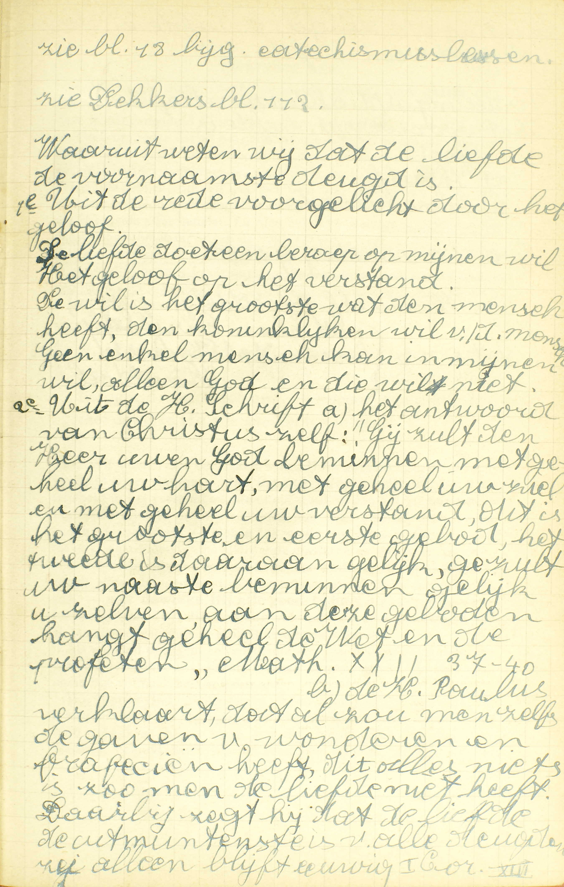
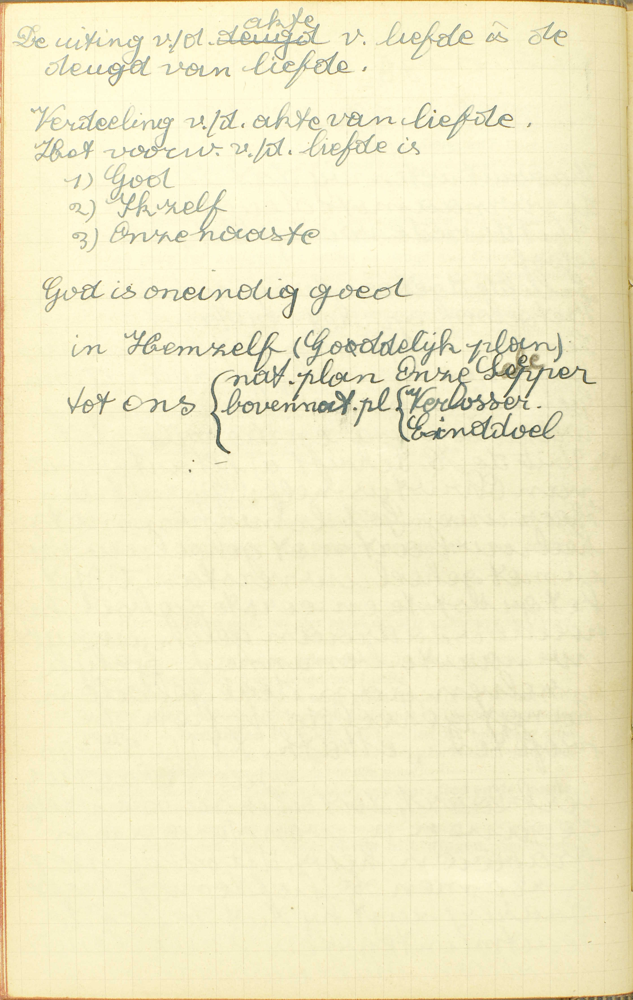
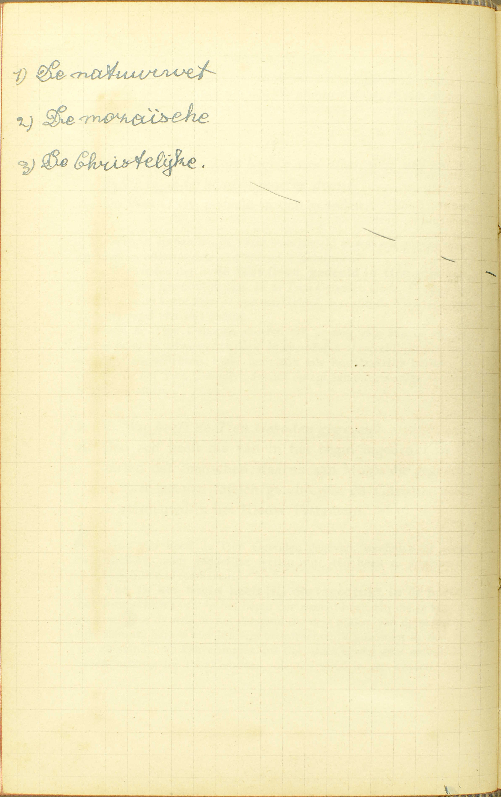
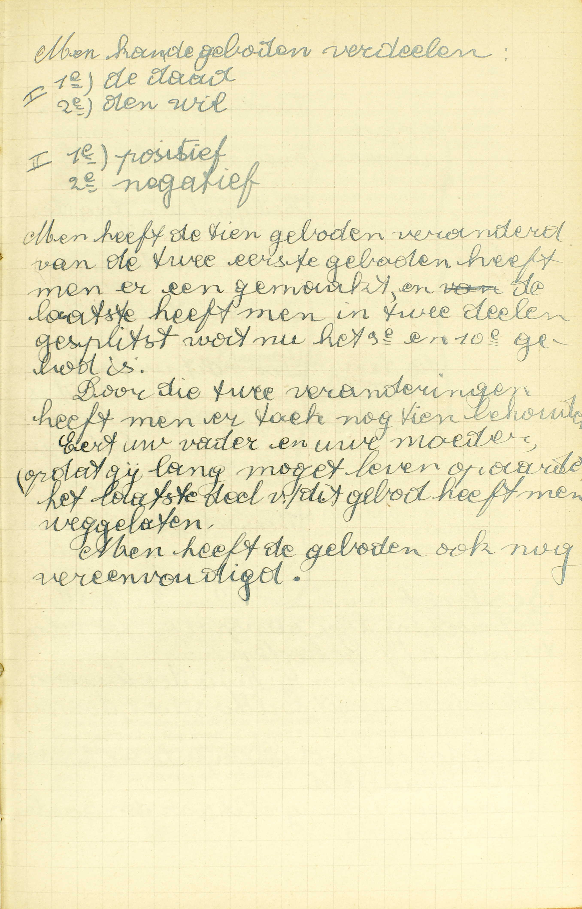
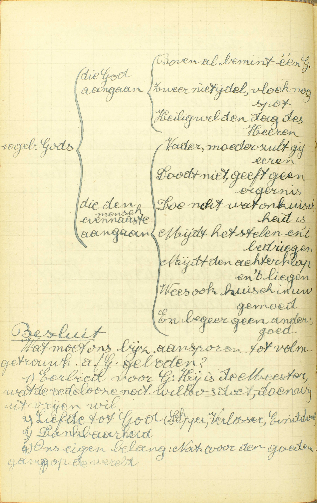

<table>
<tr>
  <td rowspan=9>**De Liefde**</td>
  <td rowspan=9 class=accolade></td>
  <td colspan=2>1° Haar plaats onder de deugden</td>
  <td colspan=3>*[Welke is de meeste en de waardigste onder alle deugden?](#welke-is-de-meeste-en-de-waardigste-onder-alle-deugden)*</td>
</tr>
<tr>
  <td rowspan=6>2° Bepaling van de deugd van Liefde De Liefde is een gave van God waardoor wij...</td>
  <td rowspan=6 class=accolade></td>
  <td colspan=2>...God beminnen boven alle dingen,</td>
  <td>*[Wat is God beminnen bovenal?](#wat-is-god-beminnen-bovenal)*</td>
</tr>
<tr>
  <td colspan=2>om Hem zelf.</td>
  <td>*[Waarom moeten wij God beminnen?](#waarom-moeten-wij-god-beminnen)*</td>
</tr>
<tr>
  <td colspan=2>...Onze naaste</td>
  <td>*[Wie verstaat gij door onze naaste?](#wie-verstaat-gij-door-onze-naaste)*</td>
</tr>
<tr>
  <td rowspan=2>als onszelf,</td>
  <td rowspan=2 class=accolade></td>
  <td>*[Hoe moeten wij onze naaste beminnen?](#hoe-moeten-wij-onze-naaste-beminnen)*</td>
</tr>
<tr>
  <td>*[Wat is onze naaste beminnen als ons zelf?](#wat-is-onze-naaste-beminnen-als-ons-zelf)*</td>
</tr>
<tr>
  <td colspan=3>*[Om God.](#wat-is-de-liefde)*</td>
</tr>
<tr>
  <td rowspan=2 colspan=2>3° Kort begrip van de plichten door haar opgelegd</td>
  <td rowspan=2>*[De Wet van God verdeeld in tien geboden](#welk-is-het-kort-begrip-van-alles-wat-wij-om-de-liefde-te-onderhouden-moeten-doen)*</td>
  <td rowspan=2 class=accolade></td>
  <td>*[Wie heeft de Tien Geboden gegeven?](#wie-heeft-de-tien-geboden-gegeven)*</td>
</tr>
<tr>
  <td>*[Zeg de Tien Geboden Gods](#zeg-de-tien-geboden-gods)*</td>
</tr>
</table>

# Welke is de meeste en de waardigste onder alle deugden?

## De Liefde: omdat zonder haar, noch het Geloof, noch de Hoop ons helpen mag ter zaligheid

  
  <em>De H. Paulus verklaart dat al zou men zelfs de gaven van wonderen en profecieën hebben, dit alles niets is zo men de liefde niet heeft. Daarbij zegt hij dat de liefde de uitmuntendste is van alle deugden, zij alleen blijft eeuwig. I Cor XIII.</em>

V. **Welke is de meeste:** tot het meeste en bijzonderste goed genegen makende, — **en de waardigste:** de meest achting verdienende, — **onder alle** goddelijke en zedelijke **deugden?** Daar alle deugd een genegenheid is van de ziel tot een zeker goed, moet die deugd de meeste en ook de waardigste zijn, die ons tot het meeste goed genegen maakt.

A. De Liefde is de meeste en de waardigste onder alle deugden — **omdat, zonder haar, noch het Geloof, noch de Hoop ons helpen mag ter zaligheid:** omdat de deugd van Geloof en die van Hoop ons, door zich zelf alleen, tot de eeuwige zaligheid niet kunnen brengen, maar daartoe slechts bekwaam worden, als zij met de deugd van Liefde gepaard gaan Om een meester te behagen en loon van hem te ontvangen, is het immers niet genoeg hem als meester te erkennen en betrouwen op hem te hebben; het is daarenhoven volstrekt nodig, hem te willen dienen. Dus, ook om God te behagen, en van Hem de hemelse loon te bekomen, moet men niet enkel Hem erkennen door het Geloof en zich op Hem betrouwen door de Hoop, maar nog Hem goed willen, de wil hebben van Hem te dienen, en die wil is de Liefde.

# Wat is de Liefde?

## Een gave Gods, door dewelke wij God boven alle dingen beminnen, en onze naaste als ons zelf om God

  

V. Hier wederom geldt het niet enkel de *akte,* maar ook de *deugd.* ([3ᵉ les, 1ᵉ v.](les-03.html#wat-is-het-geloof))

A. De bepaling vermeldt onder andere 1° de oorsprong, 2° de akte en 3° het voorwerp van de deugd van Liefde.

1° De *oorsprong:* de Liefde is **een gave Gods.** (3ᵉ en [16ᵉ les, 1ᵉ v.](TODO))

2° De *akte* of het werk tot hetwelk de deugd van Liefde ons genegen maakt, is — **beminnen:** iemand goed willen en bijgevolg zijn redelijke begeerte willen volbrengen, want hetgeen iemand met reden begeert of behoort te begeren, dat is zijn goed.

3° Het *voorwerp* van de Liefde is dubbel, te weten: **God en de naaste,** God is het eerste en bijzonderste; de naaste is het tweede.

De bepaling leert ons nog: a) de *manier* waarop wij God en de naaste moeten beminnen: God, **boven alle dingen,** de naaste, niet boven alle dingen noch boven ons zelf, maar **gelijk ons zelf;** b) de *reden* waarom wij onze *naaste* zó moeten beminnen: deze wordt aangeduid door de woorden — **om God,** dat is, uit Liefde tot God, om rede dat hij het geliefkoosde schepsel en het aangenomen kind Gods is, of ten minste geroepen is om dat te worden. Gelijk wij, een huisvader beminnende, uit hoofde van deze liefde ook zijn kinderen liefhebben, die hij als een deel wan zich zelf acht, zo, wanneer wij God beminnen, beminnen wij om Hem ook al degenen die Hij als de zijn aanziet. En men bemerke wel dat de liefde tot de naaste onafscheidbaar is van de liefde tot God, want, gelijk wij onmogelijk een vader kunnen beminnen zonder ook zijn kinderen lief te hebben, kunnen wij ook onmogelijk God heminnen zonder tevens de naaste lief te hebben, die God als Hem toebehorende beschouwt.

De *reden* van onze liefde tot *God* is het voorwerp van de volgende vraag.

# Waarom moeten wij God beminnen?

## Om Hem zelf, dat is om zijn goedheid, barmhartigheid, liefde tot ons, en andere volmaaktheden, met dewelke Hij alle goed te boven gaat

A. Wij moeten God beminnen — **om Hem zelf,** om de uitmuntendheid van zijn natuur, — **dat is, om zijn goedheid:** om zijn wijsheid in het verstand en zijn heiligheid in de wil, — **barmhartigheid:** om zijn groot medelijden met onze ellende, dat uit zijn goedheid voortkomt, — **liefde tot ons:** om zijn werkende liefde tot ons, waardoor Hij ons allerhande goederen en weldaden geschonken heeft en voortdurend schenkt, — **en andere volmaaktheden,** zoals zijn almogendheid, zijn voorzienigheid, zijn getrouwheid, enz., — **met dewelke Hij alle goed te boven gaat;** door welke hoedanigheden Hij, die oneindig volmaakt is, de volmaaktheid van al de andere bestaande of mogelijke wezens overtreft.

Als wij God om Hem zelf beminnen. dan is onze liefde volmaakt, daar wij Hem met niets anders zozeer kunnen eren, dan met zijn oneìndige volmaaktheid te erkennen. Wij kunnen God ook beminnen a) om zijn werken, namelijk, uit erkentenis voor de weldaden die Hij ons geschonken heeft en ons blijft schenken; b) uit hoop van de hemel, die Hij aan zijn dienaren beloofd heeft; c) uit vrees van de straffen, die Hij voor de zondaars bereid heeft; deze liefde echter is onvolmaakt, daar zij niet op God zelf, maar enkel op zijn werken steunt. ([14ᵉ les, 3ᵉ v.](les-14.html#hoe-worden-de-dagelijkse-zonden-vergeven))

# Wat is God beminnen bovenal?

## Zó beminnen, dat men liever zou verlaten alle dingen, ook het leven, dan God met één zonde te vergrammen

V. **Bovenal:** boven alle dingen (2e v.)

A. God boven alle dingen beminnen, is Hem — **zó beminnen:** op die wijze goed willen en zó willen dienen, **dat men liever zou verlaten — alle dingen:** alle goederen buiten God, zoals rijkdommen, eer en faam, bloedverwanten en kennissen, — **ook het leven,** dat zou uit te zonderen zijn, ware er een uitzondering te maken: het leven immers is het voornaamste en edelste onder al de aardse goederen; — **dan God met één zonde te vergrammen:** dan één doodzonde te bedrijven: de dagelijkse zonden beletten of breken de Liefde niet, omdat zij geen volkomene of volmaakte overtredingen van Gods wet zijn ([37ᵉ les, 6ᵉ v.](TODO)). Om bovenal te zijn, moet dus onze Liefde tot God alle andere liefde tot enig wezen in *hoogachting* overtreffen, zodanig dat wij gesteld zijn om alles te verliezen, liever dan God door één zonde te vergrammen; zij moet echter niet vuriger, levendiger zijn, noch meer indruk op ons maken dan alle andere liefde, wie dus meer droefheid gevoelt, omdat hij, b.v. zijn vader of zijn moeder verloren heeft, dan omdat hij God door een zonde heeft vergramd, die moet daarom geenszins denken, dat hij geen voldoend berouw over zijn zonden heeft.

Wij moeten, onder opzicht van *hoogachting,* God hovenal beminnen, omdat Hij metterdaad alle andere wezens in volmaaktheid overtreft.

# Hoe moeten wij onze naaste beminnen?

## Gelijk ons zelf

A. Wij moeten onze naaste beminnen **gelijk ons zelf,** en wel omdat hij, evenals wij, zo niet metterdaad, dan toch door zijn roep, het geliefkoosde schepsel en aangenomen kind Gods is, en daarom dezelfde achting en liefde verdient als wij zelf.

# Wat is onze naaste beminnen als ons zelf?

## Zó beminnen, dat wij hem geen kwaad doen, dat wij zelf niet zouden willen lijden, en hem het goed zoeken te bewijzen, dat wij ons zelf wensen

A. Onze naaste beminnen als ons zelf is hem — **zó beminnen:** derwijze goed willen, — 1° **dat wij hem geen kwaad doen:** in zijn geestelijke of tijdelijke goederen, ’t zij door woorden, ’t zij door werken geen nadeel toebrengen, — **dat wij zelf,** waren wij in zijn plaats, met recht en reden — **niet zouden willen lijden, en** 2° **hem het goed zoeken te bewijzen, — dat wij ons zelf wensen:** dat wij ons zelf, waren wij in zijn plaats, met recht en reden van anderen zouden verwachten. *Goed* betekent hier al hetgene de naaste kan bevoordeligen in zijn zaligheid of in zijn tijdelijke welvaart voor zoveel deze tot zijn eeuwig geluk profijtig is. Om de naaste te beminnen *als ons zelf,* moeten wij dus voor hem niet alles doen, wat wij voor ons zelf doen, maar enkel datgene, wat wij met recht en reden van anderen voor ons willen gedaan hebben.

# Wie verstaat gij door onze naaste?

## Alle redelijke schepselen die met ons deel kunnen hebben in de goddelijke glorie

A. Opdat iemand onze naaste zij, moet hij deze *drie* voorwaarden vervullen:

1° Een **schepsel** zijn ([1ᵉ les, v. 5](les-01.html#tot-wat-einde-is-de-mens-geschapen)); dus is God onze naaste niet, aangezien Hij uit zich zelf bestaat;

2° Een **redelijk** schepsel zijn, zoals de mensen ([1ᵉ l. v. 5](les-01.html#tot-wat-einde-is-de-mens-geschapen)) en de Engelen ([6ᵉ les, v. 4](les-06.html#zijn-de-engelen-samen-in-de-hemel-gebleven)); dus zijn de levenloze wezens, de planten en de dieren onze naaste niet;

3° **Met ons deel kunnen hebben in de goddelijke glorie:** met ons samen de hemel kunnen bezitten; dus zijn de duivelen en de verdoemden onze naaste niet, daar zij nooit in de hemel kunnen komen.

Deze allen zijn bijgevolg onze naaste: de Engelen, de Heiligen, de zielen van het vagevuur en al de mensen hier op aarde, zowel de zondaars als de rechtvaardigen, en zij worden zo genoemd, omdat zij *nader* met ons verbonden zijn dan alle andere wezens: zij zijn immers samen met ons Gods aangenomene kinderen of toch geroepen om dat te worden.

# Welk is het kort begrip van alles, wat wij om de Liefde te onderhouden moeten doen?

## De Wet Gods, gedeeld in tien geboden

V. Waarin vinden wij in 't kort voorgesteld al wat wij moeten doen om God en onze naaste metterdaad te beminnen?

A. Wij vinden dat in **de Wet Gods, gedeeld in tien geboden,** of, gelijk men gewoonlijk zegt, in de Tien Geboden Gods. Evenals het Symbolum de korte regel is van ons Geloof, zo zijn de Tien Geboden de korte regel van ons gedrag.

Buiten de Tien Geboden moeten wij er nog vele andere volgen, namelijk, al de geboden ons door de geestelijke of wereldlijke overheid wettig voorgeschreven; maar deze zijn alle hoofdzakelijk besloten in het Vierde van de Tien Geboden, dat ons oplegt aan onze wettige oversten te gehoorzamen.

# Wie heeft de Tien Geboden gegeven?

## God zelf heeft die van in het begin ingedrukt in de harten van de mensen, daarna aan Mozes die gegeven, in twee stenen tafelen geschreven, en Christus heeft ze vernieuwd in het Nieuwe Testament

  

A. God zelf heeft de Tien Geboden gegeven, weshalve zij geen menselijke, maar goddelijke wetten zijn. Hij heeft ze gegeven op drie verschillende manieren.

1° **Van in het begin heeft Hij die ingedrukt in de harten van de mensen:** van in het begin van de wereld heeft Hij die te kennen gegeven door de rede en het verstand die deel maken van de menselijke natuur: *hart* is hier immers overdrachtelijk genomen in de zin van verstand, van kenvermogen van de ziel; doch, boven deze natuurlijke bekendmaking van de Tien Geboden, die wij allen in ons vinden, heeft God aan Adam en Eva nog een bovennatuurlijke Openbaring gedaan: Hij heeft hun immers een bovennatuurlijke wetenschap ingestort;

2° **Daarna aan Mozes die gegeven, in twee stenen tafelen geschreven:** nadien, omtrent 1500 jaar vóór Christus’ geboorte, heeft God, op de berg Sinaï, aan Mozes, de geleider van het joodse volk, die Tien Geboden schriftelijk gegeven op twee stenen tafelen;

3° **En Christus heeft ze vernieuwd in het Nieuw Testament:** God de Zoon die, mens geworden zijnde, Jezus Christus genoemd is, heeft ze opnieuw mondeling voorgesteld in de nieuwe Openbaring, of in de nieuwe goddelijke leer die Hij komen verkondigen is.

Opzichtens de *wijze* waarop zij gebeurden, verschillen deze drie bekendmakingen in het volgende: voor zoveel zij natuurlijk is, geschiedde de eerste door het licht van de rede, en zo wordt zij nog gedurig gedaan in allen mens; voor zoveel zij bovennatuurlijk was, geschiedde zij door het instorten van een bovennatuurlijke wetenschap in Adam en Eva; de tweede werd door God zelf *schriftelijk* gedaan op twee stenen tafelen, en de derde eindelijk, *mondeling* door Christus, de Zoon Gods voor ons mens geworden. Opzichtens de geboden zelf, bestaat er tussen die drie bekendmakingen slechts één enkel en dat nog klein verschil: het betreft het Derde Gebod: in de eerste duidde God misschien de dag niet aan, die te van zijn verering bijzonder te bestemmen was; in de tweede verkoos Hij daartoe de Sabbatdag, en in de derde veranderden de oversten van de H. Kerk, na Christus’ dood, maar met zijn toelating en door zijn macht, de Sabbatdag in de Zondag.

# Zeg de Tien Geboden Gods

  
  <em>Men heeft de tien geboden veranderd. Van de twee eerste geboden heeft men er één gemaakt, en het laatste heeft men in twee delen gesplitst, wat nu het 9ᵉ en het 10ᵉ gebod is. Door die twee veranderingen heeft men er toch nog tien behouden.</em>
  

1. Ik ben de Heer uw God; gij zult geen vreemde goden hebben vóór mijne ogen. Gij zult u geen gesneden beeld noch enige gelijkenis maken. Gij zult die niet aanbidden noch godsdienstig eren.

2. Gij zult de naam van de Heer, uwen God, niet ijdel gebruiken.

3. Wees gedachtig, dat gij de Sabbatdag heilig maakt.

4. Eer uw vader en uw moeder, opdat gij làng moget leven op de aarde.

5. Gij zult niet doodslaan.

6. Gij zult geen overspel doen.

7. Gij zult niet stelen.

8. Gij zult tegen uw naaste geen vals getuigenis geven.

9. Gij zult van uw naasten huisvrouw niet begeren.

11. Gij zult zijn huis niet begeren, noch zijn land, noch zijn knecht, noch zijn dienstmeid, noch zijn os, noch zijn ezel, noch iets van al wat hem toebehoort.

A. Buiten deze opzegswijze, uit Mozes’ wet getrokken, bestaat er nog een andere, die wij gewoonlijk in onze gebeden gebruiken.

Eenieder is gehouden ten minste de inhoud van de Tien Geboden te kennen; anders is het onmogelijk ze te onderhouden; daarenboven is het hoogst voordelig ze van buiten te weten en ze dagelijks op te zeggen.

Onder die geboden, gelijk God ze aan Mozes gegeven heeft, en ook gelijk wij ze opzeggen, bestaat een zeer volmaakte orde: eerst worden ons onze plichten jegens God voorgesteld, omdat zij de oorsprong zijn van onze plichten ten opzichte van de naaste; zij zijn gerangschikt volgens hun gewichtigheid: het eerste legt ons op, ons aan God als aan de enige waren God te onderwerpen; het tweede, Hem niet te onteren, en het derde, Hem te dienen gelijk Hij het vereist, en het is daar wel de orde van onze verplichtingen jegens allen overste.

De zeven overige geboden hebben betrekking op de naaste, namelijk, op zijn vijf bijzondere goederen die wij te eerbiedigen hebben: zo spreekt het Vierde Gebod van het *gezag,* waar slechts enige personen mee bekleed zijn; de andere, van de vier goederen die alle mensen gemeen zijn, namelijk, het geestelijk en lichamelijk leven, het huisgezin en de zuiverheid, de tijdelijke goederen en de faam of reputatie. En hier wederom is de orde volkomen; immers de zonden, tegen de oversten, zijn groter dan die tegen andere personen; daarop volgt het gebod nopens het eerbiedigen van 's naasten geestelijk en lichamelijk leven, daar het leven het bijzonderste is van alle zijn goederen; het huisgezin en de zuiverheid komen op de derde plaats, omdat zij de twee overige goederen in waarde overtreffen; de tijdelijke goederen staan vóór de faam, omdat men in deze gehinderd wordt door woorden, en in de tijdelijke goederen door daden, en de zonden die door een daad geschieden uit hun natuur zwaarder zijn dan die alleen door woorden bedreven worden. De twee laatste geboden handelen over de begeerten van onkuischheid te doen en over die van te stelen: deze begeerten alleen worden *uitdrukkelijk* verboden, omdat de mensen meer in deze twee begeerten dan in alle andere toestemmen.

De geboden betrekkelijk de naaste leren ons ook onze plichten jegens ons zelf, als blijken zal uit de volgende lessen.

### Aanmerking

Onze Akte van Liefde bevat de hele leer van deze les: *« Mijn Heer en mijn God. Ik bemin U* (1ᵉ voorwerp van de Liefde) *bovenal uit geheel mijn hart* (manier waarop wij God moeten beminnen), *omdat Gij het opperste goed zijt* (reden om God bovenal te beminnen); *en ik bemin mijnen evennaaste* (2ᵉ voorwerp van de Liefde), *gelijk mij zelf* (manier waarop wij de naaste moeten beminnen), *uit liefde tot U »* (reden om de naaste te beminnen gelijk ons zelf).

Wij vinden schoone voorbeelden van Liefde tot God in Abraham, die zijn vaderland verliet en zijn enige zoon Isaäc wilde slachtofferen om aan God te gehoorzamen; in Job, die, alles verloren hebbende, uitriep: de naam des Heren zij gebenedijd; in de ontelbare martelaars, die hun leven voor God ten beste gaven. Treffende voorbeelden van Liefde tot de naaste zijn: Tobias, die, aan zijn eigen gevaar niet denkende, zijn broeders ter hulpe kwam en de doden begroef; de Samaritaan uit de parabel, die de gekwetsten Jood verzorgde; Jezus Christus, die zich voor ons allen slachtofferde.

### VRAGEN

Hoe is het derde deel met de twee voorgaande verbonden? — Welk is het voorwerp van deze les? — Hoe wordt zij verdeeld? — Wat onderzoekt de Catechismus nopens ieder punt van deze verdeling?

1. Wat is er te verstaan door de *meeste* en door de *waardigste* onder alle deugden? — Leg de woorden *alle deugden* uit. — Welke deugd is de meeste en de waardigste onder alle? — Zeg, met de woorden van de Catechismus, waarom zij dat is, en leg die woorden uit. — Verklaar hoe het Geloof en de Hoop ons, zonder de Liefde, tot de zaligheid niet kunnen helpen.

2. Welk is de zin van de vraag: *wat is de Liefde?* — Hoe drukt de Catechismus de oorsprong van de Liefde uit? — Verklaar die uitdrukking van de Catechismus. — Wie beminnen wij door de deugd van Liefde? — Hoeveel voorwerpen van de Liefde zijn er dus? — Welk is het eerste en het bijzonderste? — Hoe moeten wij ieder van die voorwerpen beminnen? — Zeg, met de woorden van de Catechismus, om welke reden wij onze naaste moeten beminnen *gelijk ons zelf,* en verklaar die reden. — Bewijs dat die reden geldig is.

3. Zeg in 't kort, waarom wij God *bovenal* moeten beminnen. — Hoe legt de Catechismus die reden, in 't kort voorgesteld, uit? — Verklaar de uitlegging die de Catechismus er van geeft. — Zijn er, buiten deze reden, nog andere, om dewelke wij God kunnen beminnen, en welke zijn deze? — Hoe wordt de Liefde dus verdeeld uit hoofde van de reden, waarop zij steunt? — Geef rekenschap van de namen dier verschillende soorten van Liefde.

4. Hoe moet men gesteld zijn om God wezenlijk te beminnen *boven alle dingen?* — Welke zonde moet men volstrekt willen vluchten om God te kunnen beminnen bovenal? — Wat moet men liever verlaten dan God met één doodzonde te vergrammen? — Waarom voegt de Catechismus de woorden *ook het leven* bij de voorgaande *alle dingen?* — Onder welk opzicht moet dus onze Liefde tot God wezen *bovenal?* — Moet zij het niet wezen onder opzicht van de levendigheid en van de indruk die zij op ons maakt? — Wat volgt hieruit? — Waarom moeten wij God op de gezegde wijze bovenal beminnen?

5. Waarom moeten wij de naaste beminnen gelijk ons zelf?

6. Hoeveel dingen zijn vereist om de naaste te beminnen gelijk ons zelf? — Stel ze voor met de woorden van de Catechismus, en leg ze uit. — Moeten wij, om de naaste te beminnen gelijk ons zelf, voor hem doen, al hetgene wij voor ons zelf verrichten?

7. Hoeveel en welke voorwaarden zijn vereist, opdat iemand onze naaste zou wezen? — Leg ze uit. — Zeg waarom God, de levenloze wezens, de planten, de dieren, de duivelen en de verdoemden onze naaste niet zijn. — Noem degenen die onze naaste zijn, en zeg waarom zij het zijn. — Geef rekenschap van de naam: onze naaste.

8. Geef de zin van de vraag: Welk is het kort begrip tan alles wat wij, om de Liefde te onderhouden, moeten doen. — In welke betrekking staan het Symbolum van het Geloof en de Tien Geboden Gods? — Moeten wij niets doen buiten de Tien Geboden? — Hoe zijn de andere wetten enigszins in de Tien Geboden begrepen?

9. Wie heeft de Tien Geboden gegeven? — Op hoeveel manieren zijn zij gegeven geworden? — Stel deze manieren, met de woorden van de Catechismus, voor. — Leg ze uit. — Hoe verschillen dus die bekendmakingen van de Tien Geboden onder opzicht van de manier, op dewelke zij geschied zijn? — Hoe verschillen zij onder opzicht van de geboden zelf?

10. Van waar komt de opzegswijze die de Catechismus hier vaorstelt? — Bestaat er, buiten deze, nog een andere? — Moeten wij de Tien Geboden kennen? — Hoe kunnen de Tien Geboden allerbest verdeeld worden? — Welke orde is er in ieder deel? — Bewijs dat die orde er wezenlijk in te vinden is.

