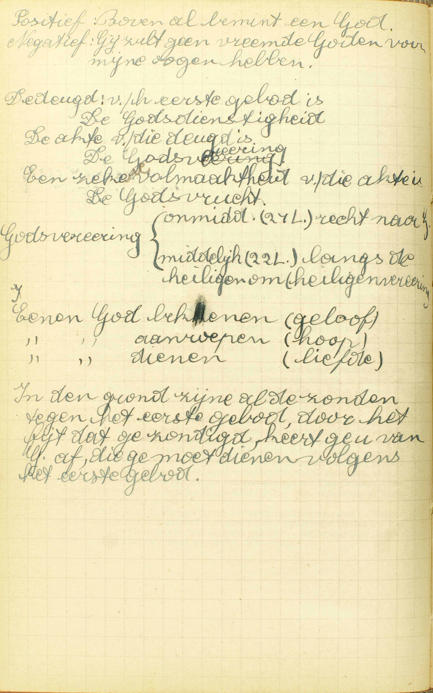
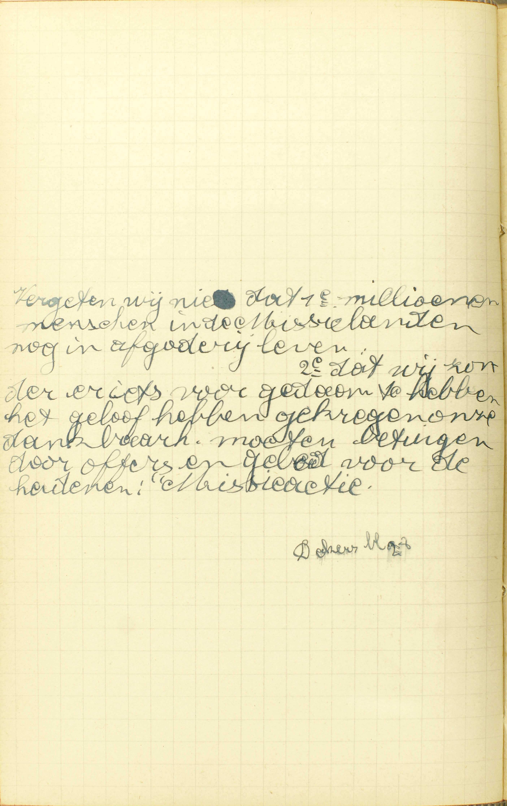
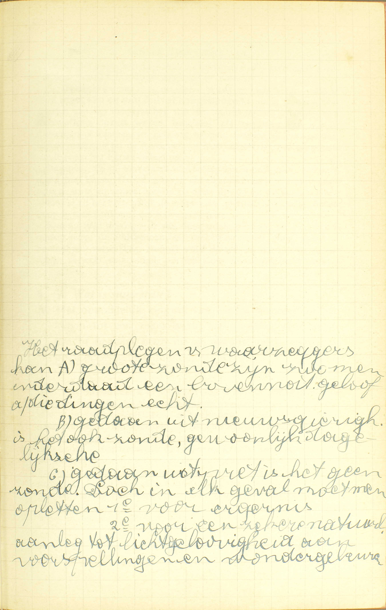
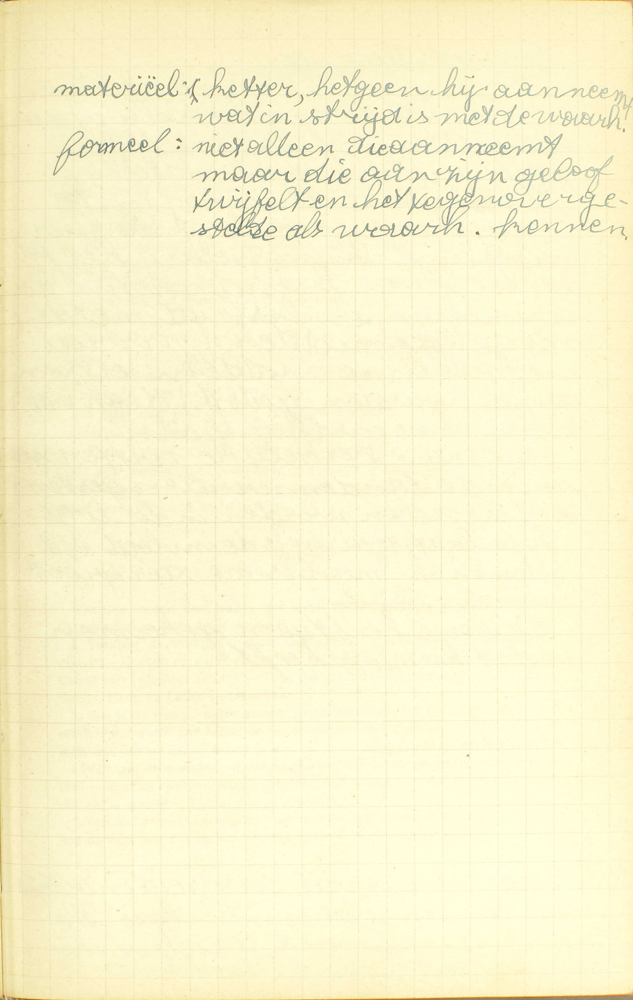
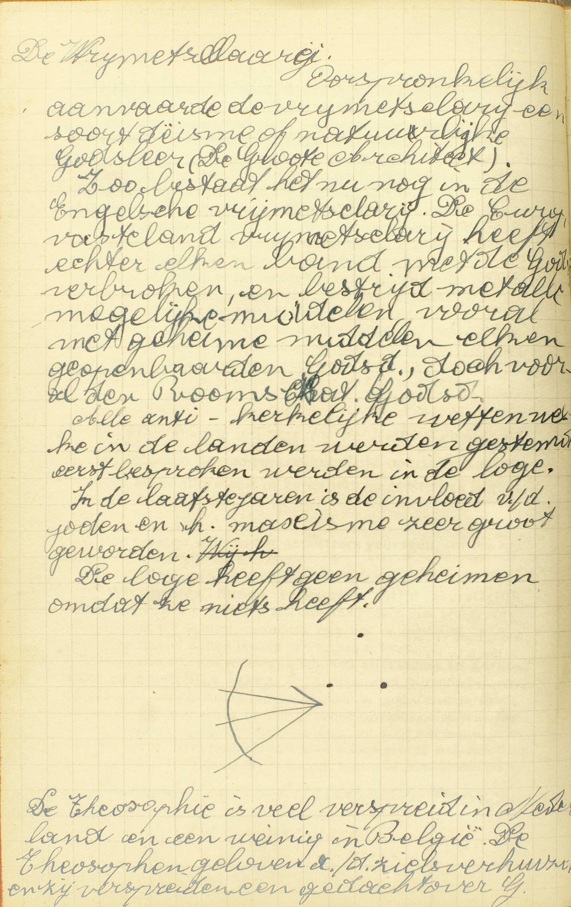
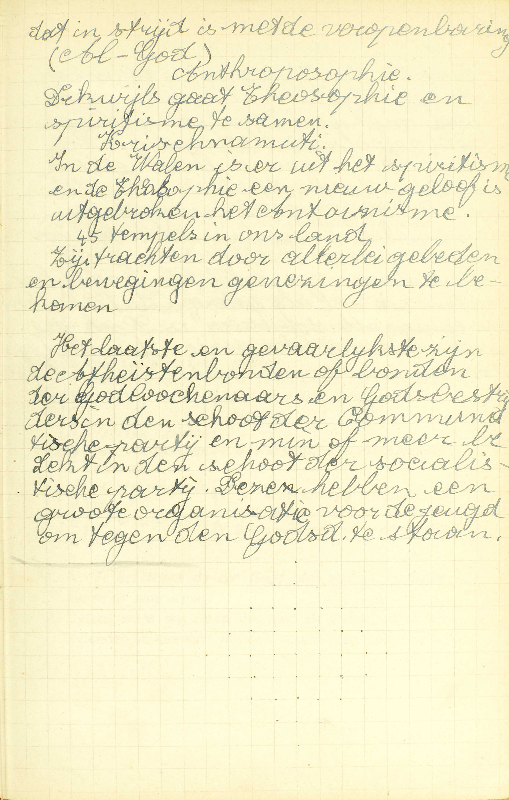

<table>
<tr>
  <td rowspan=11>**I. bovenal bemint één God**</td>
  <td rowspan=11 class=accolade></td>
  <td colspan=2>1° Wat dit Gebod ons gebiedt</td>
  <td colspan=3>*[Wat wordt ons belast in het Eerste Gebod?](#wat-wordt-ons-belast-in-het-eerste-gebod)*</td>
</tr>
<tr>
  <td rowspan=10>*[2° Welke zonden geschieden tegen het Eerste Gebod](#welke-zonden-geschieden-tegen-het-eerste-gebod)*</td>
  <td rowspan=10 class=accolade></td>
  <td colspan=2>Alle afgoderij,</td>
  <td>*[Wat zijn afgoden?](#wat-zijn-afgoden)*</td>
</tr>
<tr>
  <td rowspan=2>Bijgeloof,</td>
  <td rowspan=2 class=accolade></td>
  <td>*[Wat is bijgeloof?](#wat-is-bijgeloof)*</td>
</tr>
<tr>
  <td>*[Is het bijgeloofte gebruiken het Agnus Dei, gewijde kaarsen, palmen, as, vruchten?](#is-het-bijgeloofte-gebruiken-het-agnus-dei-gewijde-kaarsen-palmen-as-vruchten)*</td>
</tr>
<tr>
  <td rowspan=2>Tovenarij,</td>
  <td rowspan=2 class=accolade></td>
  <td>*[Wat kwaad doen de tovenaars?](#wat-kwaad-doen-de-tovenaars)*</td>
</tr>
<tr>
  <td>*[Mag men wel bij tovenaars of waarzeggers te rade gaan?](#mag-men-wel-bij-tovenaars-of-waarzeggers-te-rade-gaan)*</td>
</tr>
<tr>
  <td rowspan=2>Ketterij,</td>
  <td rowspan=2 class=accolade></td>
  <td>*[Hoe misdoen de Ketters tegen het Eerste Gebod?](#hoe-misdoen-de-ketters-tegen-het-eerste-gebod)*</td>
</tr>
<tr>
  <td>*[Hoe moeten wij ons tot de Ketters gedragen?](#hoe-moeten-wij-ons-tot-de-ketters-gedragen)*</td>
</tr>
<tr>
  <td colspan=3>en alle andere ongelovigheid,</td>
</tr>
<tr>
  <td colspan=3>wanhoop,</td>
</tr>
<tr>
  <td colspan=3>en haat van God.</td>
</tr>
</table>

# Wat wordt ons belast in het Eerste Gebod?

## Dat wij één God alleen zullen bekennen, aanroepen en dienen

  
  <em>In de grond zijn al de zonden tegen het eerste gebod, door het feit dat ge zondigt, keert ge u van God af, die ge moet dienen volgens het eerste gebod.</em>

A. Er wordt ons in het Eerste Gebod belast, **dat wij — één God alleen:** de enige ware God, of de enige ware Schepper, Heer en Regeerder van hemel en aarde, **zullen bekennen,** als God erkennen, met zijn Openbaring door het Geloof aan te nemen, — **aanroepen,** als God aanroepen, met op Hem als op het Opperwezen te hopen, — **en dienen,** als God eren en dienen, met Hem boven alle dingen te beminnen.

*Twee* dingen dus worden ons hier belast: a) ons aan God als aan God te onderwerpen met in Hem te geloven, of, i.a.w. met de Openbaring van Hem gedaan door het Geloof aan te nemen, met op Hem te hopen, en met Hem te beminnen; b) dit alleen te doen voor de enige waren God, voor het enig waar Opperwezen.

De woorden: *« bovenal bemint één God, »* uit onze gewone manier van de Tien Geboden op te zeggen, hebben dezelfde betekenis, aangezien dat wij onmogelijk God kunnen beminnen zonder in Hem te geloven en op Hem te hopen.

Dit Gebod is met recht het eerste, daar er voor een onderdaan geen gewichtiger plicht bestaat, dan zich aan zijn meester te onderwerpen met hem te erkennen, op hem betrouwen te hebben, en hem te willen dienen,

Uit de leer van deze eerste vraag vloeit, dat wij het Eerste Gebod volbrengen met de Akten van Geloof, Hoop en Liefde uit het hart te verwekken. Om ons tot het verwekken van deze Akten aan te wakkeren, verleent ons de H. Kerk een aflaat van 7 jaar en 7 quadragenen (zevenmaal veertig dagen) telkens dat wij die Akten lezen, en, daarenboven, een volle aflaat in het uur van de dood, en ook eens in iedere maand, aan allen die ze dagelijks verwekken, mits nochtans te biechten en te communiceren.

# Welke zonden geschieden tegen het Eerste Gebod?

## Alle afgoderij, bijgeloof, tooverij, ketterij, en alle andere ongelovigheid, wanhoop en haat van God

V. Na gezegd te hebben, wat het Eerste Gebod belast, zal de Catechismus ons nu leren, wat wij moeten vermijden, om dit Gebod te onderhouden.

A. **De afgoderij, de bijgeloof en de tooverij** strijden tegen het tweede deel van het Eerste Gebod, dat ons gebiedt niets, buiten de enige waren God, als God te erkennen, te aanroepen en te dienen; **de ketterij en alle andere ongelovigheid, wanhoop en haat van God** strijden tegen het eerste deel, dat ons oplegt God als God te erkennen, te aanroepen en te dienen.

# Wat zijn afgoden?

## Beelden of andere dingen, die gehouden worden voor God, daar zij nochtans maar schepselen zijn

  
  <em>Vergeten wij niet dat 1° miljoenen mensen in de missielanden nog in afgoderij leven, 2° dat wij zonder er iets voor gedaan te hebben het geloof hebben gekregen en dus onze dankbaarheid moeten betuigen door offers en gebed voor de heidenen: Missieactie.</em>

A. **Beelden:** standbeelden of zelfs schilderijen, die ons een geest, een mens of iets anders voorstellen, — **of andere dingen:** alle andere geschapene wezens, zoals geesten, mensen, dieren, planten, de aarde, de zon, de maan, de sterren, enz., — **die gehouden worden voor God:** die door sommige mensen aanzien worden als waren zij goden, — **daar zij nochtans maar schepselen zijn:** alhoewel zij enkel schepselen Gods zijn.

Bijgevolg, opdat iets een afgod weze, zijn er *twee* dingen vereist: 1° er moet een beeld of een andere zaak zijn, die niets anders is dan een enkel schepsel; en 2° dat beeld of die andere zaak moet gehouden worden voor God.

De *afgoderij* bestaat dus in beelden of andere dingen te houden voor God, daar zij nochtans maar schepselen zijn. — Aan deze zonde maakten de Israelieten zich schuldig, als zij aan de voet van de berg Sinaï het gouden kalf aanbaden.

# Wat kwaad doen de tovenaars?

## In plaats van God, nemen zij de duivel tot hun Heer, aan dewelke zij zichzelf verbonden hebben

V. De zin van de vraag is: hoe zondigen de tovenaars tegen het Eerste Gebod?

A. **In plaats van God,** van de enige waren God als hun Oppermeester te erkennen, te aanroepen en te dienen, — **nemen zij de duivel,** de aartsvijand van God, — **tot hun Heer:** tot hun Oppermeester en God, — **aan dewelke zij zichzelf verbonden hebben:** met dewelke zij een uitdrukkelijk of bedekt verbond hebben aangegaan: de tovenaars, van hun kant, hebben zich verbonden de duivel als hun Heer te erkennen en hem te gehoorzamen; de duivel, van zijn kant, heeft zich verbonden, op zekere tekenen of woorden, die de tovenaar gebruiken zal, wonderbare dingen door zijn macht uit te werken.

De H. Schrift spreekt van tovenaars die, met de hulp van de duivelen, enige van Mozes’ wonderen nadeden; — van Simon de tovenaar, — en van de Antichrist die in de laatste tijden de tooverkunst zal gebruiken om de mensen te verleiden.

De tovenaar zondigt dus tegen het Eerste Gebod, met de duivel in plaats van God tot zijn Opperheer te nemen, en hij neemt de duivel tot zijn Heer, met hulp en bijstand te verwachten van hem die de grootste vijand van God is.

Men bemerke hier, dat de duivel, als enkele geest, meer verstand en op de geschapene krachten meer macht heeft dan de mens, en dat hij bijgevolg wonderbare dingen kan teweegbrengen, die het menselijk vermogen te boren gaan; doch hij kan niet alles doen wat hij zou willen; want, ten eerste, hij kan niets maken van niet, en zo kan hij niets teweegbrengen, waartoe er in de geschapene natuur geen krachten bestaan; ten tweede, God belet hem in zeer veel gevallen zijn kracht uit te oefenen, ten minste daar, waar het Geloof heerst.

# Mag men wel bij tovenaars of waarzeggers te rade gaan?

## Geenszins; want dit is God afgegaan en de duivel aangehangen, van dewelke deze weten hetgeen zij zeggen

  
  <em>Het raadplegen van waarzeggers kan grote A) zonde zijn, zo men inderdaad een bovennatuurlijk geloof aan die dingen hecht, B) gedaan uit nieuwsgierigheid is het ook zonde, gewoon dagelijkse, C) gedaan uit [??] is het geen zonde. Doch in elk geval moet men opletten 1ᵉ voor ergernis, 2ᵉ voor een zekere natuurlijke aanleg tot lichtgelovigheid aan voorspellingen en wondergebeuren.</em>

V. **Tovenaars** zijn al degenen, die de duivel aanroepen, om door zijn hulp iets wonderbaars te kunnen verrichten of te weten, en **waarzeggers,** zijn die tovenaars, welke zich bijzonder toeleggen om, met de medewerking van de duivel, het verborgene of het toekomende te leren kennen.

De zin van de vraag is: mag men bij tovenaars of waarzeggers gaan, om door hun tooverkunst geholpen te worden.

A. **Geenszins** mag men dat doen; — **want** zo handelen, — **dit is God afgegaan en de duivel aangehangen:** dit is God verlaten en zich aan het meesterschap van de duivel onderwerpen, — **van dewelke deze weten hetgeen zij zeggen:** van wie de tovenaars of waarzeggers gehoord hebben, hetgene zij antwoorden, en zo maakt dit bij de tovenaars of waarzeggers te rade gaan een zonde tegen het Eerste Gebod uit.

Degenen, die bij tovenaars ot waarzeggers te rade gaan, zondigen tegen het Eerste Gebod zowel als de tovenaars of waarzeggers zelf; want zij nemen, zowel als deze, de duivel tot hun Heer, alhoewel zij het niet, gelijk de tovenaars, onmiddellijk, maar slechts door de tussenkomst van de tovenaars doen.

Koning Saül maakte zich aan deze zonde schuldig, als hij, in de oorlog tegen de Phílistijnen, bij een waarzegster ging, opdat zij Samuël zou verwekken. Samuël werd inderdaad, ten minste in de schijn, verwekt, en kondigde aan Saül zijn toekomende nederlaag aan.

# Wat is bijgeloof?

## Het ongoddelijk gebruik van enige woorden of tekenen tot een zeker werk, tot hetwelk deze geen kracht hebben, noch uit de natuur, noch van God, noch door de instelling van de H. Kerk

A. **Het ongoddelijk** of het tegen God strijdende **gebruik,** — **van enige woorden,** zoals: « in de naam van de Almachtige, genees ik u, » en andere dergelijke, — **of tekenen,** zoals reinigingen, kaarttrekkingen, kruistekenen, — **tot een zeker werk,** tot een zeker uitwerksel, zoals tot het bekomen van een genezing. het eindigen van een kwaal, — **tot hetwelk deze geen kracht hebben noch uit de natuur:** tot welk uitwerksel die woorden of tekenen geen kracht hebben, noch door hun natuurlijke eigenschappen, gelijk b.v. een medecijn, die uit haar natuur kracht heeft om deze of gene ziekte te genezen, — **noch van God:** noch door een goddelijke instelling of medewerking, gelijk b.v. de HH. Sacramenten, die ook uitwendige tekenen zijn, door Christus’ instelling kracht hebben om Gods genade in te storten, of gelijk de tekenen welke gebruikt worden door degenen, die van God de macht ontvangen hebben om míirakelen te doen, — **noch door de instelling van de H. Kerk,** noch door de wijding van de H. Kerk, gelijk b.v. het gewijd water, de gewijde palmen, as, enz, die door de gebeden van de H. Kerk kracht hebben om verscheidene gunsten van God te bekomen.

De bijgeloof bestaat in woorden of tekenen te gebruiken tot een uitwerksel, waartoe deze geenszins kracht hebben uit een van de drie oorzaken van alle kracht, namelijk de natuur, God en de H. Kerk; en dit gebruik is *ongoddelijk* of het maakt een zonde uit tegen het Eerste Gebod, omdat men, met zo te handelen, een uitwerksel van de duivel verwacht, en zo God verlaat en de duivel tot Heer aanneemt.

Men maakt zich, b.v. aan bijgeloof schuldig, met, tot genezing van mensen en dieren onbeduidende spreuken, vreemde namen of letters te gebruiken; want deze woorden of tekenen hebben daartoe geen kracht, noch uit de natuur, noch van God, noch door de instelling van de H. Kerk.

Ochozias, Koning van Israël, maakte zich, tijdens zijn ziekte, aan bijgeloof schuldig, met de afgod Beëlzebub te rade te gaan; en daarom werd hij, volgens de voorzegging van de profeet Elias, met de dood gestraft.

# Is het bijgeloofte gebruiken het Agnus Dei, gewijde kaarsen, palmen, as, vruchten?

## Geenszins, want deze dingen hebben kracht door het gebed, dat naar de instelling van de H. Kerk, daarover gesproken is

V. Het *Agnus Dei* is, een witte, wassen medalie waarin het beeld geprent staat van een lam, dat Jezus Christus voorstelt, en daarom *Agnus Dei,* Lam Gods genoemd wordt. Deze medalie wordt door de Paus alleen gewijd, en dit op bepaalde tijdstippen, t. w. het eerste jaar van zijn regering en daarna alle zeven jaren. **Keersen** worden gewijd op *Lichtmis* de 2ᵉ februari, ook op de feestdag van de H. Blasius en op alle andere tijden; **palmen,** op Palmzondag; **as,** op Aswoensdag; **vruchten,** brooden of andere spijzen, in sommige plaatsen op bepaalde dagen.

De Catechismus vraagt of het bijgeloof is die verschillende dingen te gebruiken, om daardoor goddelijke gunsten te verkrijgen.

A. **Geenszins** is dat bijgeloof; — **want deze dingen hebben kracht,** om de goddelijke gunsten te bekomen, wij zeggen niet uit hun natuur, of van God, maar — **door het gebed, dat naar de instelling van de H. Kerk, daarover gesproken is:** door het gebed, dat de H. Kerk, onder hun wijding, uitgesproken heeft, en dat door God, uit hoofde van de heiligheid van de H. Kerk, is verhoord geworden en bij Hem als opgeschreven blijft. — Doch deze dingen hebben slechts kracht tot die uitwerksels, waartoe de H. Kerk ze gewijd heeft, en bijgevolg, moest men ze tot iets anders gebruiken, waartoe zij geenszins kracht hebben, men zou zich aan bijgeloof schuldig maken.

Het *Agnus Dei* dient om de genade van boetvaardigheid te verkrijgen en beschermt ons tegen de duivel, tegen onweder, ziekten, vuur, water en schielijke dood.

De *gewijde kaarsen* van Lichtmis hebben voor bijzonder uitwerksel ons verlichting van het verstand te bekomen; die van de H. Blasius beschermen ons tegen de keelpijn; de andere, tegen de duivel.

De *gewijde palmen* beschermen ons tegen alle ongelukken en verkrijgen allerhande zegeningen over de huizen en de velden, waar zij gestoken zijn, en over de mensen die ze gebruiken.

De *gewijde as* dient bijzonder tot het bekomen van de genade van boetvaardigheid.

De *gewijde vruchten* beschermen ons tegen alle ongelukken en bekomen ons de genade, om de aardse zaken zó te gebruiken, dat wij er de eeuwige zaligheid niet door verliezen.

Bij deze gewijde voorwerpen is nog het gewijd water te voegen, dat van in het begin van de H. Kerk in gebruik is geweest. Het verschaft ons genade om wel te leven, hulp om wel te bidden, de geest van boetvaardigheid; het verwijdert de duivel, verdrijft ziekten en kwade lucht. bevrijdt van ongelukken en strekt tot behoudenis van de gezondheid.

# Hoe misdoen de Ketters tegen het Eerste Gebod?

## Dat zij, niet gelovende hetgene God voorhoudt door de H. Kerk, God leugenachtig maken en zo Hem loochenen

  
  <em>Materieel: ketter, hetgeen hij aanneemt wat in strijd is met de waarheid. Formeel: niet alleen di aanneemt, maar die aan zijn geloof twijfelt en het tegenovergestelde als waarheid kennen.</em>

V. **Hoe misdoen de Ketters,** die met hardnekkigheid de vervalste leer van Christus volgen, **tegen het Eerste Gebod?**

A. **Dat zij niet gelovende:** wetens en willens verwerpende of als twijfelachtig aanziende, **hetgene God voorhoudt door de H. Kerk:** de leer die zij weten van God geopenbaard en door de H. Kerk op een onfaalbare wijze voorgehouden te zijn, — **God leugenachtig maken:** God als leugenaar aauzien, of, ten minste, als bekwaam om te liegen, — **en zo Hem loochenen:** en met Hem als leugenaar of als bekwaam om te liegen te aanzien, daardoor weigeren Hem te erkennen als God, als het oneindig volmaakt wezen, dat niet kan liegen, noch bedriegen, noch bedrogen kan worden.

Als men als vals of ten minste als twijfelachtig, aanziet hetgeen een mens ons bevestigt, aanschouwt men die noodzakelijk als, uit onwetendheid of uit kwaadaardigheid, in die zaak met zekerheid of ten minste waarschijnlijk gelogen te hebben; bijgevolg, met sommige punten van de goddelijke Openbaring wetens en willens te loochenen of als twijfelachtig te aanzien, verwerpen de Ketters de opperste waarheid van God, en weigeren zo Hem als God te erkennen.

# Hoe moeten wij ons tot de Ketters gedragen?

## Wij moeten hun verkeering altijd naarstiglijk schuwen, maar allermeest in kerkelijke en geestelijke zaken.

  
  <em>De Vrijmetselarij. Oorspronkelijk aanvaarde de vrijmetselarij een soort deïsme of natuurlijke Godsleer (de Grote Architect). Zo bestaat het nu nog in de Engelse vrijmetselarij. De Europese-vastelandvrijmetselarij heeft echter elke band met de God verbroken en bestrijdt met alle mogelijke middelen, vooral met geheime middelen, elke geopenbaarde Godsdienst, doch vooral de Rooms-Katholieke Godsdienst. Alle anti-kerkelijke wetten welke in de landen werden gestemd, werden eerst besproken in de loge. In de laatste jaren is de invloed van de joden en het marxisme zeer groot geworden. De loge heeft geen geheimen omdat ze niets heeft. De Theosofie is veel verspreid in Nederland en een weinig in België. De Theosofen geloven aan de zielsverhuizing en zij verspreiden een gedacht over God dat in strijd is met de veropenbaring (Al-God).</em>
  
  <em>Antroposofie. Dikwijls gaat Theosofie en spiritisme te samen. Krishnamurti. In de Walen is er uit het spiritisme en de Theosofie een nieuw geloof uitgebroken: het Antoinisme. 45 Tempels in ons land. Zij trachten door allerlei gebeden en bewegingen genezingen te bekomen.  Het laatste en gevaarlijkste zijn de Atheïstenbonden of bonden van de godloochenaars in de schoot van de communistische partij en minder of meer bedekt in de schoot van de socialistische partij. Dezen hebben een grote organisatie voor de jeugd om tegen de godsdienst te staan.</em>

V. **Hoe moeten wij ons tot de Ketters gedragen,** om ons aan hun zonde niet schuldig te maken?

A. De Catechismus leert ons hierover *twee* dingen:

1° **Wij moeten hun verkeering altijd naarstiglijk schuwen,** d. i, wij moeten in alle omstandigheden met grote zorg, voor zoveel wij kunnen, vermijden met hen te handelen, in hun gezelschap te zijn, hun boeken of schriften te lezen.

2° Wij moeten hun verkeering schuwen **allermeest in kerkelijke en geestelijke zaken,** d.i. wij moeten in het bijzonder vermijden met hen gemeenschap te hebben in godsdienstige zaken, zoals door tegenwoordig te zijn in hun kerkelijke diensten, door hun boeken van godsdienstleer te lezen, en door met hen te redetwisten. De H. Kerk verbiedt aan haar gelovigen de godsdienstige plechtigheden van de Ketters bij te wonen, hun boeken die de godsdienst aangaan, te lezen, en, zonder oorlof, openbare en plechtige redetwisten met de Ketters aan te gaan.

Er blijven nog drie zonden tegen het Eerste Gebod, waarvan de Catechismus geen uitlegging geeft: 1° *alle andere ongelovigheid,* 2° *wanhoop en* 3° *haat van God.*

Behalve de ketterij, behoort nog tot de zonden van *ongelovigheid:* a) de volkomene ongelovigheid, die bestaat in het vrijwillig verwerpen van geheel de Openbaring; b) de gesprekken tegen het Geloof en het loochenen van het Geloof door handelwijze of tekenen, vanwege deze die inwendig aan God geloven; en c) de verwaarloozing van de middelen die te gebruiken zijn om een voldoende kennis te bekomen van het Geloof dat men belijdt.

De *wanhoop* bestaat in niet te willen van God verzoeken en verwachten het eeuwig leven en al wat ons daartoe helpen kan. Het tegenovergestelde van de wanhoop is de *vermetelheid,* die ons doet hopen *zonder reden,* zonder de daartoe nodige voorwaarden te willen volbrengen. ([38ᵉ les, v. 9.](les-38.html#welke-zijn-de-zonden-tegen-de-h-geest))

De *haat van God* bestaat in Hem kwaad te willen. Deze haat is tweeërlei: de haat van *kwaadwilligheid* of van *vijandschap,* waardoor wij Hem kwaad willen, opdat Hij ongelukkig zou wezen; en de haat van *verfoeiing,* waardoor wij Hem kwaad willen, omdat wij Hem aanzien als kwaadwillig jegens ons en als daarom waardig door ons verfoeid te worden.

### VRAGEN

Waarvan spreekt deze les? — Hoe wordt zij verdeeld? — Wat onderzoekt de Catechismus in ieder van deze delen?

1. Verklaar de woorden: *één God alleen, — bekennen, — aanroepen, — dienen,* — Hoeveel en welke dingen legt het Eerste Gebod ons op? — Hoe is dit Gebod met reden het eerste? — Toon dat wij het volbrengen met de Akten van Geloof, Hoop en Liefde te verwekken,

2. Hoe is de vraag: *welke zonden geschieden tegen het Eerste Gebod,* met de eerste: *wat wordt ons belast in het Eerste Gebod,* verbonden? — Verklaar met welk deel van het Eerste Gebod de zonden, die de Catechismus noemt, strijdig zijn.

3. Verklaar de woorden: *beelden, — andere dingen, — die gehouden worden voor God, — daar zij nochtans maar schepselen zijn.* — Wat is er vereist, opdat iets een afgod weze? — Wat is dus de afgoderij?

4. Zeg, met de woorden van de Catechismus, wat kwaad de tovenaars doen en hoe zij zich aan dat kwaad schuldig maken. — Leg het antwoord uit. — Hoe zondigen de tovenaars tegen het Eerste Gebod? — Hoever strekt de macht van de duivel zich uit? — Geef er de reden van.

5. Wat verschil bestaat er tussen *tovenaars* en *waarzeggers?* — Welk is de zin van de vraag: *mag men wel bij tovenaars of waarzeggers te rade gaan?* — Waarom is dit niet toegelaten? — Leg uw antwoord uit. — Hoe zondigt men tegen het Eerste Gebod met bij tovenaars of waarzeggers te rade te gaan?

6. Verklaar woord voor woord het antwoord van de Catechismus op de vraag: *wat is bijgeloof?* — Zeg in 't kort waarin de bijgeloof bestaat. — Uit hoeveel en uit welke oorzaken kunnen de dingen kracht hebben tot een zeker werk? — Hoe zondigt men door *bijgeloof* tegen het Eerste Gebod? — Geef een voorbeeld van bijgeloof, en leg het uit.

7. Wat verstaat men door *Agnus Dei?* — Door wie en wanneer wordt het gewijd? — Wanneer worden gewijd: a) *de kaarsen,* b) *de palm,* c) *de as,* d) *de vruchten?* — Waarom is het gebruik van deze voorwerpen geen bijgeloof? — Wanneer zou in het gebruik er van bijgeloof zijn? — Waartoe dienen al die genoemde voorwerpen? — Waartoe dient het gewijd water?

8. Wat verstaat men door *Ketters?* — Wat betekenen de woorden: *niet gelovende hetgene God voorhoudt door de H. Kerk?* — Zeg, met de woorden van de Catechismus, wat de Ketters rechtstreeks doen, met dat niet te geloven, en leg het uit. — Verklaar hoe zij daardoor tegen het Eerste Gebod zondigen, en geef een kort bewijs van het antwoord.

9. Toon hoe de vraag: *Hoe moeten wij ons tot de Ketters gedragen,* met de voorgaande verbonden is. — Zeg, met de woorden van de Catechismus, hoe wij ons *altijd* ten hun opzichte moeten gedragen, en leg die woorden uit. — Hoe moeten wij met hen handelen *in kerkelijke en geestelijke zaken?* — Noem enige kerkelijke of geestelijke zaken. — Wat verbiedt de H. Kerk nopens de betrekkingen met de Ketters in deze zaken? — Welke andere ongelovigheid bestaat er nog buiten de ketterij? — Wat is wanhoop, vermetelheid? — Wat is haat van God, en hoevelerlei is hij?

