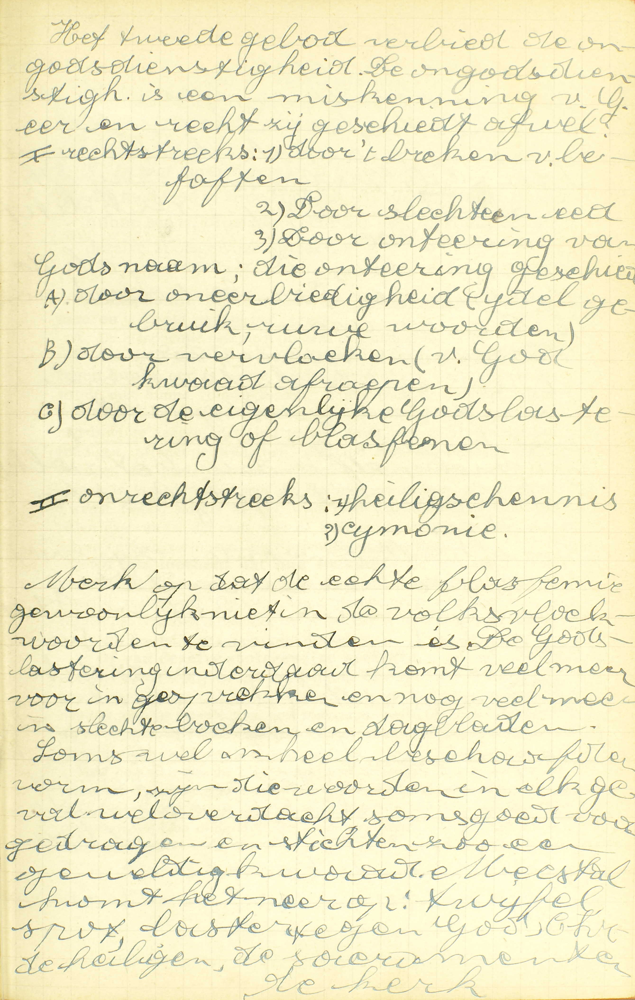
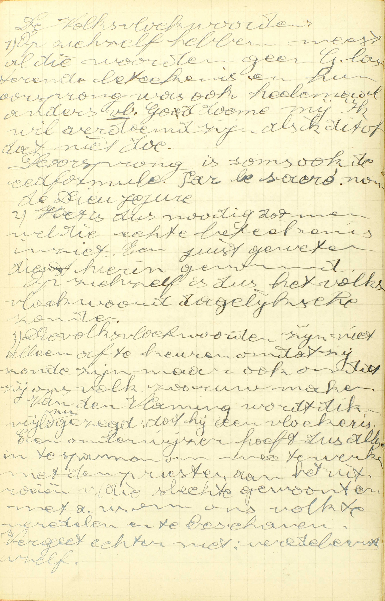
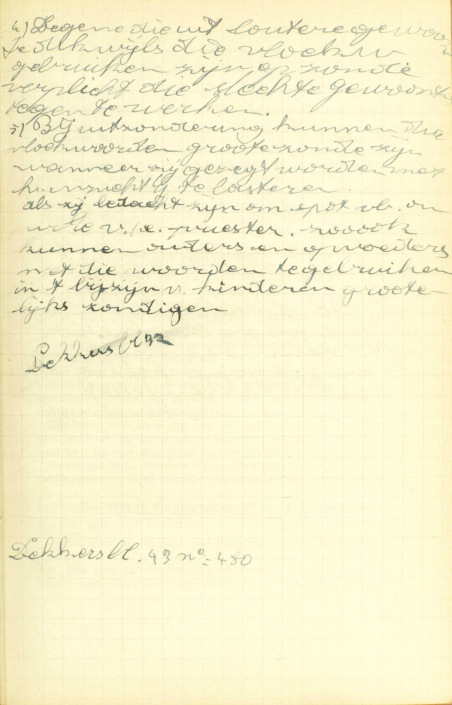
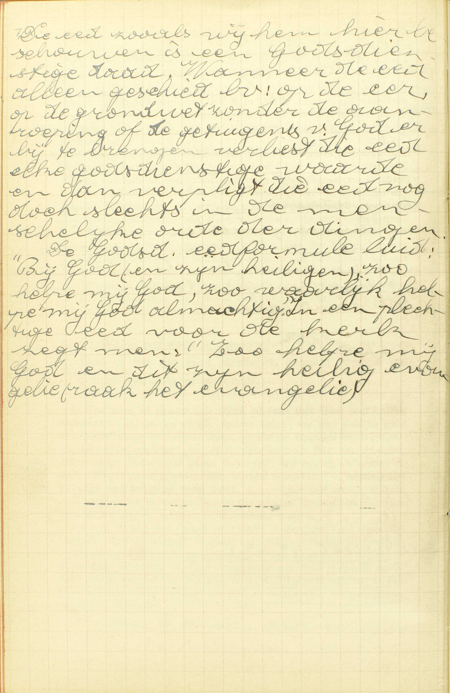
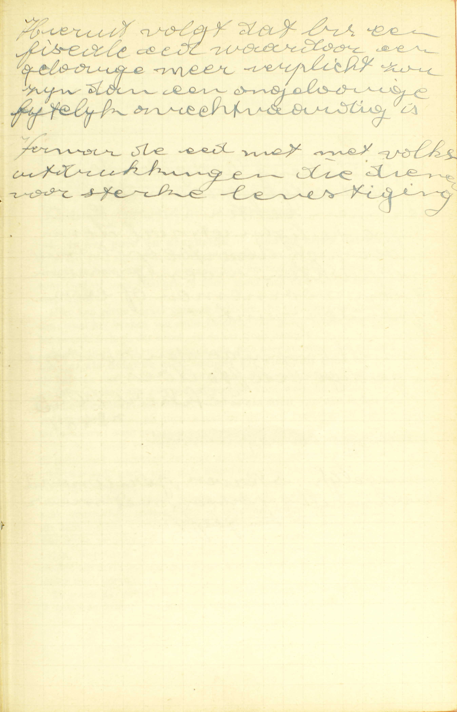
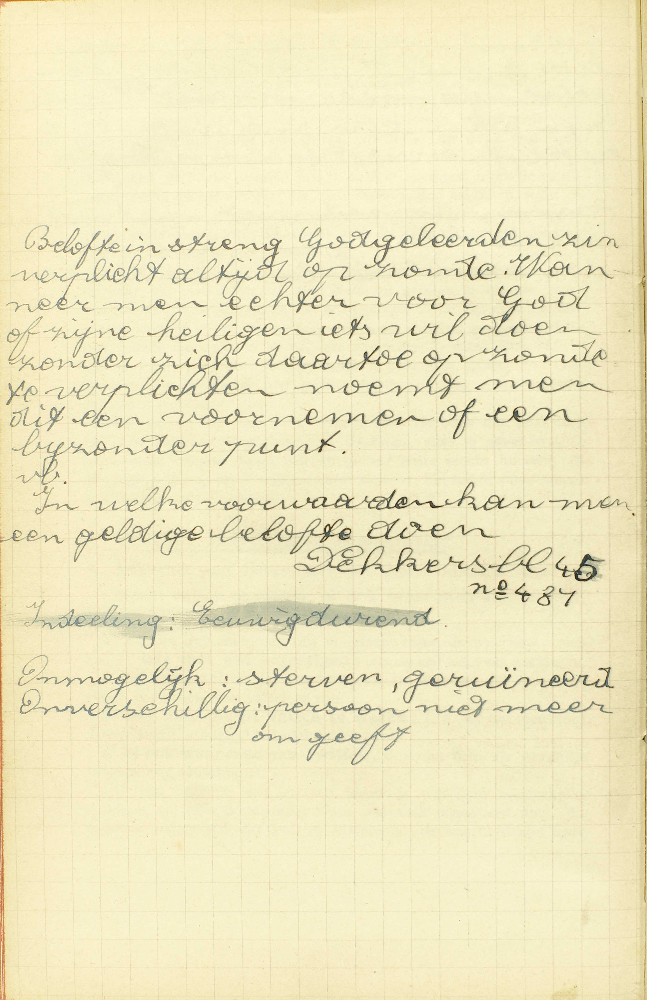

<table>
<tr>
  <td rowspan=6>**Zweert niet ijdel, vloek noch spot**</td>
  <td rowspan=6 class=accolade></td>
  <td rowspan=6>*[Dit Gebod verbiedt alle oneer die de goddelijke naam aangedaan wordt](#wat-verbiedt-god-in-het-tweede-gebod)*</td>
  <td rowspan=6 class=accolade></td>
  <td colspan=2>Blasfemeren</td>
  <td colspan=3>*[In wat manier geschiedt blasfemie?](#in-wat-manier-geschiedt-blasfemie)*
</td>
</tr>
<tr>
  <td rowspan=4>Lichtvaardig zweren</td>
  <td rowspan=4 class=accolade></td>
  <td colspan=3>*[Wat is eed doen of zweren?](#wat-is-eed-doen-of-zweren)*</td>
</tr>
<tr>
  <td rowspan=3>*[Is het altijd kwaad en verboden te zweren?](#is-het-altijd-kwaad-en-verboden-te-zweren)*</td>
  <td rowspan=3 class=accolade></td>
  <td>*[Wie zweert met goed oordeel?](#wie-zweert-met-goed-oordeel)*</td>
</tr>
<tr>
  <td>*[Wie zijn ze, die zweren tegen de rechtvaardigheid?](#wie-zijn-ze-die-zweren-tegen-de-rechtvaardigheid)*</td>
</tr>
<tr>
  <td>*[Wat is zweren tegen de waarheid?](#wat-is-zweren-tegen-de-waarheid)*</td>
</tr>
<tr>
  <td colspan=2>Breken van belofte</td>
  <td colspan=3>*[Is het ook goed en deugdelijk God of zijn Heiligen iets te beloven?](#is-het-ook-goed-en-deugdelijk-god-of-zijn-heiligen-iets-te-beloven)*</td>
</tr>
</table>

# Wat verbiedt God in het Tweede Gebod?

## Alle oneer, die de goddelijken naam aangedaan wordt door blasfemeren, lichtvaardig zweren, of breken van belofte

  
  <em>Merk op dat de echte blasfemie gewoonlijk niet in de volkvloekwoorden te vinden is. De godslastering inderdaad komt veel meer voor in gesprekken en nog veel meer in slechte boeken en dagbladen. Soms wel in heel beschaafde vorm, zijn die woorden in elk geval wel verdacht, soms goed voorgedragen en stichten zo een geweldig kwaad. Meestal komt het neer op twijfel, spot, laster tegen God, Christus, de heiligen, de sacramenten, de kerk.</em>

A. In het Tweede Gebod verbiedt God *in 't algemeen,* **alle oneer:** alle verachting en minachting, — **die de goddelijken naam aangedaan wordt,** waarmee God zelf of de goddelijke volmaaktheid (zie [17ᵉ les, vr. 5](les-17.html#wat-verstaat-gij-door-de-naam-gods)) beledigd worden; — oneer welke geschiedt: 1° **door blasfemeren,** 2° **door lichtvaardig zweren** of 3° **door breken van belofte.**

Dit Gebod volgt allerbest op het Eerste. daar de bijzonderste van onze plichten jegens een overste, na die van hem te erkennen, op hem betrouwen te hebben en hem te willen dienen. ongetwijfeld is, hem niet te onteren. Een overste vernederen is groter kwaad, dan hem de verschuldigde dienst te weigeren,

# In wat manier geschiedt blasfemie?

## Als men God of zijn Heiligen iets toeschrijft dat tegen hun eer is, of iets loochent dat hun toekomt, of van dezelve spotsgewijs spreekt

  
  <em>Die volksvloekwoorden zijn niet alleen af te keuren omdat zij zonde zijn, maar ook omdat zij ons volk zo ruw maken. Van de Vlaming wordt dikwijls gezegd dat hij een vloeker is. Een onderwijzer hoeft dus alles in te spannen om mee te werken met de priester aan het uitroeien van die slechte gewoonten, m.a.w. ons volk te veredelen en te beschaven.</em>
  
  <em>Bij uitzondering kunnen die vloekwoorden grote zonde zijn, wanneer zij gezegd worden met het inzicht God te lasteren. Als zij bedacht zijn om spot, bv. om wille van een priester. Zo ook kunnen ouders en opvoeders met die woorden te ge bruiken in 't bijzijn van kinderen grotelijks zondigen.</em>

V. **Blasphemie** betekent letterlijk *kwaadsprekerij;* **blasfemeren** is *kwaad van iemand zeggen.*

A. De blasfemie geschiedt op deze *drie* manieren:

1° **Als men God of zijn Heiligen — iets toeschrijft dat tegen hun eer is:** een hoedanigheid of een werk toekent dat strijdt met hun volmaaktheden, of iets wenscht dat met hun volmaaktheden niet overeenstemt. Op deze wijze blasfemeert men met b.v. te zeggen, dat God te veel straft, dat de H. Maagd kan zondigen, of met te wensen, dat God niet zou bestaan, dat de Heiligen de hemel zouden verliezen. — Men bemerke dat er hier spraak is van de oneer aan de Heiligen aangedaan, alhoewel het Tweede Gebod slechts handelt over onze plichten jegens God. De reden daarvan is, dat men, met de Heiligen oneer aan te doen, God zelf onteert, vermits zij zijn vrienden en hovelingen zijn.

2° **Of iets loochent dat hun toekomt:** als men aan God of aan zijn Heiligen een hoedanigheid of een daad ontkent, die hun waarlijk toebehoort. Op deze wijze blasfemeert men met b. v‚ te zeggen dat God niet almachtig is, of dat Hij de wereld niet geschapen heeft, dat de Heiligen op ons niet denken.

3° **Of van dezelve spotsgewijs spreekt:** of als men zonder hun iets toe te schrijven dat tegen hun eer is, of hun iets te loochenen dat hun toekomt, van hen zó spreekt of te hun opzichte zó handelt, dat het klaar blijkt, hoe men ze misacht. Zo blasfemeert hij b.v. die God en de Heiligen namen geeft. die men slechts aan verachtelijke en slechte personen toepast.

Men bemerke dat de blasfemie niet uitsluitend door woorden of tekenen, maar ook nog door enkele gedachten kan geschieden.

De blasfemie wordt dikwijls *godslastering,* en die blasfemie, waardoor wij God of de Heiligen kwaad wensen, wordt gewoonlijk *vloek* genoemd.

De *heiligschenderij* is allernauwst met de blasfemie verwantschapt. Gelijk de blasfemie bestaat in God te onteren roet van Hem kwaad te spreken, zo bestaat de *heiligschenderij* in God oneer aan te doen met heilige zaken, personen of plaatsen onwaardig te behandelen of te onteren.

De H. Geschiedenis leert ons met welke schrikkelijke straffen God in het Oud Testament de godslasteraars geslagen heeft. Sennacherib, Koning van Assyrië, die door zijn veldoverste Rabsaces de Allerhoogste gelasterd had, verloor, door de hand van een Engel van de hemel, 185.000 man, en werd door zijn eigen zonen vermoord; Holofernes, veldoverste van Nabuchodonosor, die zijn koning als God wilde doen erkennen, werd het hoofd afgehouwen door een joodse vrouw Judith genoemd. — De straffen van de heiligschenders zijn niet minder geweest: Balthazar, Koning van Babylonië, die met zijn disgenoten wijn dronk uit de heilige vaten van de tempel van Jeruzalem, verloor in dezelfde nacht zijn leven en zijn kroon; en de boze kinderen, die Elisëus beschimpten, werden, ten getalle van twee en veertig, door twee beren verscheurd.

# Wat is eed doen of zweren?

## God of iets, dat God merkelijk aangaat, nemen tot getuige van hetgene men zegt

  
  <em>De eed zoals wij hem hier beschouwen is een Godsdienstige daad. Wanneer de eed alleen geschiedt bv. op de eer, op de grondwet, zonder de aanroeping of de getuigenis van God erbij te brengen, verliest de eed elke godsdienstige waarde en dan verplicht die eed nog doch slechts in de menselijke orde der dingen.</em>

A. *Eed doen* of *zweren* is — **God of iets dat God merkelijk aangaat:** God zelf of alle andere zaken, die met God in een bijzonder innige verbintenis staan, zoals de Engelen en Heiligen, die zijn beste vrienden zijn: de H. Schrift en de HH. Sacramenten, die tot zijn kostelijkste gaven behoren: de hemel, de aarde, de zee, die zijn grootste natuurlijke werken uitmaken, — **nemen tot getuige van hetgene men zegt,** d.i. vragen om verslag te doen over hetgene wij bevestigen, opdat wij zouden kunnen bewijzen dat, hetgene wij zeggen, zeker en onbetwistelijk waar is.

Als wij, in de eed, 't een of ‘t ander wezen, dat God merkelijk aangaat tot getuige roepen, verstaan wij, onder dit wezen, God zelf.

De eed dient allerbest om de waarheid van hetgene wij zeggen te bevestigen, aangezien dat God de opperste waarheid is en alle macht heeft om de waarheid te verklaren en de bedriegers te straffen, en een godvrezende mens het niet zou durven wagen God tot getuige van de valsheid te roepen.

# Is het altijd kwaad en verboden te zweren?

## Neen; want het is deugdelijk, als de eed geschiedt met goed oordeel, rechtvaardigheid en waarheid; maar het is zonde, als er één van deze voorwaarden ontbreekt

A. **Neen,** het is niet altijd kwaad en verboden te zweren; **want het is deugdelijk:** het is een goed werk, als de eed geschiedt met deze drie voorwaarden: 1° **met goed oordeel**, 2° **rechtvaardigheid,** 3° **en waarheid; maar het is zonde,** of de eed is *lichtvaardig,* d.i. vermetel, tegen de rede, tegen de goede orde, **als er één van deze voorwaarden ontbreekt:** dus, opdat de eed slecht weze, moeten niet de drie voorwaarden, maar slechts de een of de andere ontbreken.

# Wie zweert met goed oordeel?

## Die niet zweert dan uit nood en goede reden

A. Men zweert **uit nood,** als men het doet, 1° om de wetten van de H. Kerk of van de staat, die de eed vereisen, te volbrengen, of 2° om een grote schade te vermijden, een gewichtig geschil te eindigen, een belangrijke waarheid te doen aanvaarden, en daartoe geen ander middel heeft dan de eed.

Men zweert uit **goede reden,** als de eed, die men doet, zoniet volstrekt noodzakelijk om een grote schade te ontgaan, dan toch zeer dienstig is om een gewichtig voordeel te verschaffen, of een nadeel van enige aangelegenheid te verwijderen.

Het blijkt heel klaar, dat een eed niet anders mag geschieden dan uit nood en goede reden, aangezien dat God te groot en te waardig is, om voor een kleine zaak tot getuige geroepen te worden.

De eed van Esaü, waardoor hij, om een spijs, zijn recht verkocht van eerstgeboren, werd voorzeker zonder nood of goede reden gedaan.

# Wie zijn ze, die zweren tegen de rechtvaardigheid?

## Die met eed bevestigen te doen hetgene kwaad en verboden is; en deze eed mag niet gehouden worden

  
  <em>Hieruit volgt dat bv. een fiscale eed waardoor een gelovige meer verplicht zou zijn dan een ongelovige, feitelijk onrechtvaardig is.</em>

A. **Die met eed bevestigen te doen,** d. i, die God tot getuige roepende van hun getrouwheid in het uitvoeren van hun voornemen of van hun belofte, verzekeren dat zij iets, door hen besloten of beloofd, zullen doen, — **dat kwaad en verboden is:** hetgene zonde is, of zelfs, wanneer er spraak is van iets te doen voor God, dat beter niet gedaan dan gedaan wordt; — en deze eed mag niet gehouden worden: en men mag zich niet aanzien als door deze eed verplicht zijnde. Zo b.v. doet men eed tegen de rechtvaardigheid, als men zweert dat men zijn vijand zal haten, want de haat is zonde; — of als men zweert, dat men maar juist ééns ’s jaars zal te biecht gaan; want dit is een zaak die God rechtstreeks aangaat en beter niet gedaan dan gedaan wordt.

Het is klaarblijkend dat een eed tegen de rechtvaardigheid zonde is, daar wij God onteren met Hem tot getuige te roepen van onze getrouwheid in het uitvoeren van een voornemen of van een belofte, die een zonde, of ten miaste zulk een werk dat God aangaat en beter niet gedaan dan gedaan wordt, als voorwerp hebben. Dan, daar niemand kan verplicht zijn een zonde te bedrijven, of iets voor God te doen dat Hij liever niet gedaan heeft, zo mag zulke eed niet gehouden worden.

Deze leer legt ons voor ogen, hoe Herodes die gezworen had aan Salome, de dochter van Herodias, alles te geven wat zij hem zou vragen, deze eed op gener wijze mocht houden, als de jonge prinses op ’t verzoek van haar moeder het hoofd van Joannes de Dooper kwam eisen.

# Wat is zweren tegen de waarheid?

## Iets met eed bevestigen dat men met zekerheid weet of meent vals te wezen, of ook waar men aan twijfelt

A. Er zijn *drie* manieren van te zweren tegen de waarheid: men kan — **iets met eed bevestigen:** iets op eed als waar verklaren.

1° **dat men met zekerheid weet vals te wezen:** dat inder daad vals is en men weet vals te zijn,

2° **dat men meent vals te wezen,** i.a.w. dat men voor vals houdt, alhoewel het niet vals is,

3° **of ook waar men aan twijfelt,** d.i. dat men als wezenlijk twijfelachtig aanschouwt.

Iedereen begrijpt dat een eed tegen de waarheid noodzakelijk zonde is en zelfs doodzonde; want wie zulk een eed doet, die oordeelt metterdaad, dat God, de Alwetende, de waarheid niet kent, of dat Hij, de Heiligheid zelve, de leugen bemint en de valsheid kan voorstaan, of eindelijk dat Hij, de Rechtvaardige en Almachtige, de valse eed niet wil of niet kan straffen. Nu, wie zo oordeelt, doet God voorzeker grote oneer aan en zondigt bijgevolg ernstig tegen het tweede Gebod.

# Is het ook goed en deugdelijk God of zijn Heiligen iets te beloven?

## Ja, als hetgene men belooft uit zich zelf goed is, en als men van zin is het te volbrengen

  
  <em>Belofte in streng godgeleerde zin, verplicht altijd op zonde. Wanneer men echter voor God of zijn heiligen iets wil doen, zonder zich daartoe op zonde te verplichten, noemt men dit een *voornemen* of een *bijzonder punt*.</em>

V. **Is het goed en deugdelijk — God of zijn Heiligen,** d. i, aan God alleen, of aan God en tevens ter eer van de Heiligen, — **iets te beloven,** d.i. niet uitsluitend het voornemen te maken iets voor God of zijn Heiligen te doen, maar zich daartoe op zonde te verplichten?

Hier kan geen spraak zijn van beloften, die niet aan God geschieden; want het breken van zulke beloften kan geen zonde zijn tegen het Tweede Gebod, dat enkel van de eer Gods handelt.

A. **Ja,** dit is goed en deugdelijk, als deze *twee* voorwaarden vervuld zijn: a) **als hetgene men belooft uit zich zelf goed is,** d.i. als hetgene men belooft te doen, geen zonde uitmaakt, mogelijk is en beter gedaan dan niet gedaan wordt; want ware het anders, God zou die belofte niet aannemen; — en b) **als men van zin is het te volbrengen,** d. í. als men wezenlijk de wil heeft van de belofte uit te voeren; want anders zou men met God de spot drijven.

Als deze beide voorwaarden vervuld zijn, is de belofte een godsdienstig werk, aangezien dat men aan God een bijzonder teken van onderwerping geeft, met zich vrijwillig een nieuwe plicht jegens Hem op te leggen.

De verplichting van een belofte houdt op, wanneer de beloofde zaak onmogelijk, onverschillig of door het gebod eens oversten of uit een andere oorzaak ongeoorloofd wordt; ook nog, als men van een gemachtigden biechtvader of kerkoverste, om een goede reden, dispensatie ontvangen heeft. — Soms wordt in de belofte slechts ten dele gedispenseerd, en soms ook wordt zij enkel in een ander werk veranderd.

Degenen die geheel van een overheid afhangen, zoals kloosterlingen van hun oversten of jonge kinderen van hun ouders, kunnen geen geldige beloften doen, tenzij met de voorwaarde: *als mijne oversten toestemmen;* en daarom bestaan hun beloften niet, als hun deze toestemming geweigerd wordt.

Eenieder heeft de macht zijn belofte te veranderen in een betere, d. í, in een werk dat merkelijk en zichtbaar beter is.

### VRAGEN.

Welk is het voorwerp van deze les? — Hoe wordt zij verdeeld? — Wat onderzoekt de Catechismus in ieder van deze delen?

1. Zeg, met de woorden van de Catechismus, wat het Tweede Gebod in ’t algemeen verbiedt. — Verklaar deze woorden. — Op hoeveel en op welke manieren wordt de goddelijken naam oneer aangedaan? — Toon dat het Tweede Gebod een gepaste plaats bekleedt onder de Tien Geboden.

2. Welk is de letterlijke betekenis van het woord *blasfemie?* — In hoeveel en in welke manieren geschiedt, volgens de Catechismus, de blasfemie? — Leg die manieren uit en geef een voorbeeld van ieder. — Hoe maakt de oneer, de Heiligen aangedaan, een zonde uit tegen het Tweede Gebod? — Geschiedt de blasfemie uitsluitend door woorden? — Hoe wordt de zonde van blasfemie nog genoemd? — Welke zonde is met de blasfemie allernauwst verwantschapt, en waarin bestaat deze zonde?

3. Wat is iemand tot getuige roepen? — Zeg, met de woorden van de Catechismus, wie men in de eed tot getuige roept en waartoe men dit doet. — Leg die woorden uit. — Hoe roept men in de eed soms tot getuige iets dat God merkelijk aangaat? — Verklaar hoe de eed allerbest dient om de waarheid te bevestigen van hetgene men zegt.

4. Zeg of de eed altijd zonde is of niet. — Hoeveel en welke voorwaarden zijn vereist, opdat hij zou goed zijn? — Wanneer is hij dus slecht? — Wat betekent de uitdrukking *lichtvaardig zweren?*

5. Zeg, met de woorden van de Catechismus, in welke gevallen de eed geschiedt met *goed oordeel.* — Leg ze uit. — Toon dat de eed noodzakelijk slecht is, als hij buiten deze gevallen geschiedt.

6. Zeg, met de woorden van de Catechismus, waarin het *zweren tegen de rechtvaardigheid* bestaat. — Wat betekenen de woorden: *die met eed bevestigen te doen?* — Verklaar de woorden: *dat kwaad en verboden is.* — Verplicht deze eed te doen hetgene men gezworen heeft? — Geef voorbeelden van eeden tegen de rechtvaardigheid.  — Bewijs dat een eed die tegen de rechtvaardigheid strijdt, altijd zonde is en dat hij niet mag gehouden worden.

7. Zeg, met de woorden van de Catechismus, op hoeveel wijzen men kan zweren tegen de waarheid. — Leg ze uit. — Welke zonde is de eed tegen de waarheid? — Bewijs dit.

8. Wat verstaat men hier door *beloven?* — Aan wie geschieden de beloften waarvan er hier spraak is? — Bewijs dat er hier van deze beloften alleen gesproken wordt. — Hoeveel en welke voorwaarden vereist de Catechismus, opdat een belofte goed en deugdelijk zou wezen? — Leg ze uit en geef er de reden van. — Waarom is de belofte, als die voorwaarden vervuld zijn, een godsdienstig werk? — Hoe houdt de verplichting van een belofte op? — Wat is er te bemerken nopens de geldigheid van de beloften van degenen, wier wil van oversten geheel afhangt? — Hoe mag eenieder zijn belofte veranderen ?

