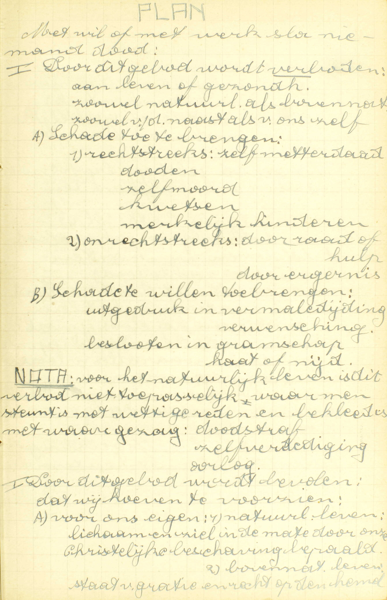
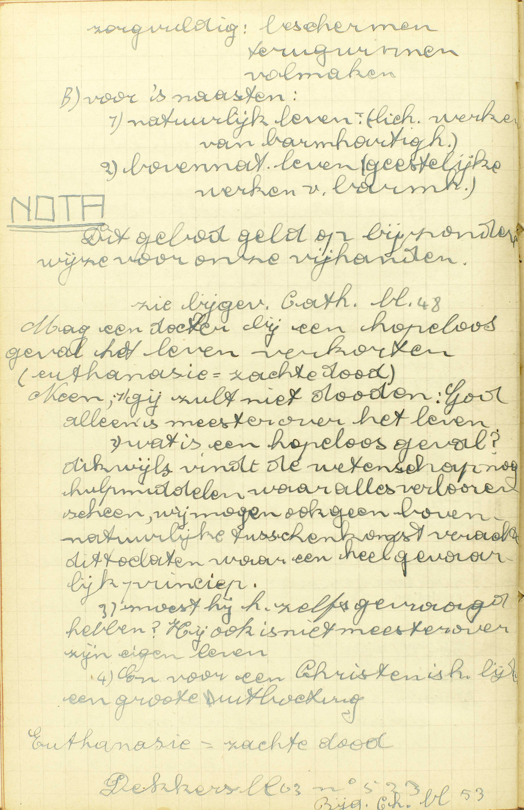
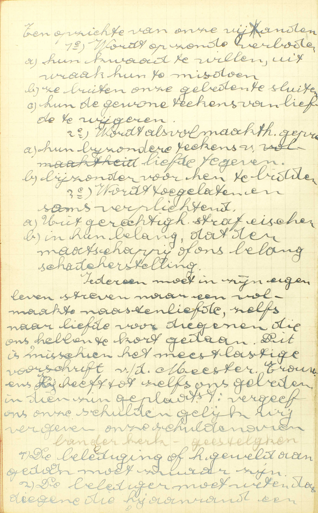
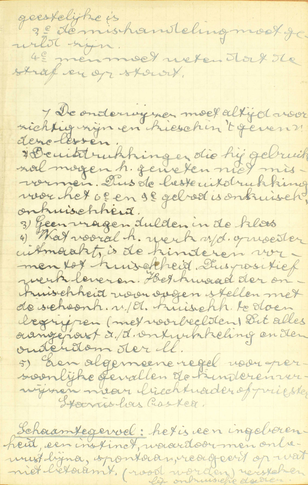
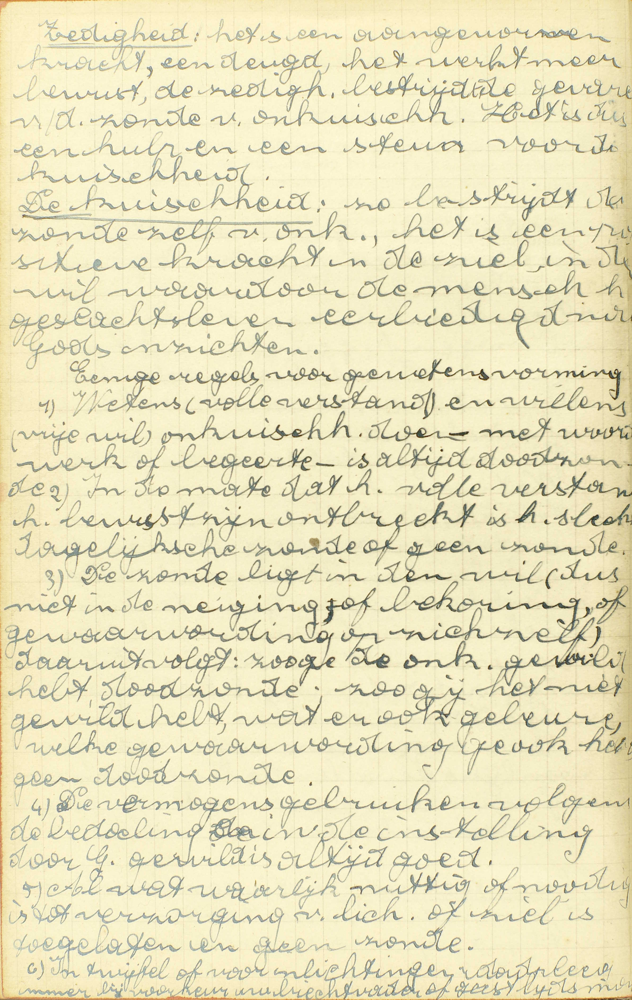
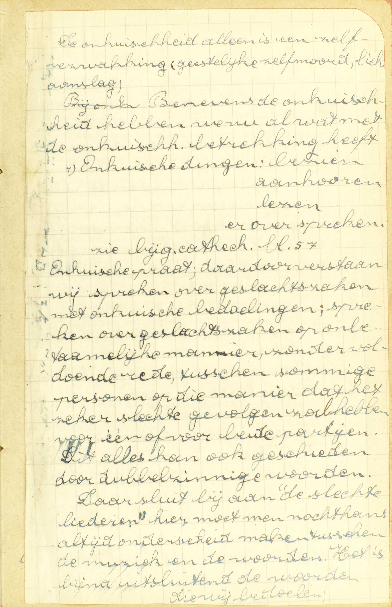
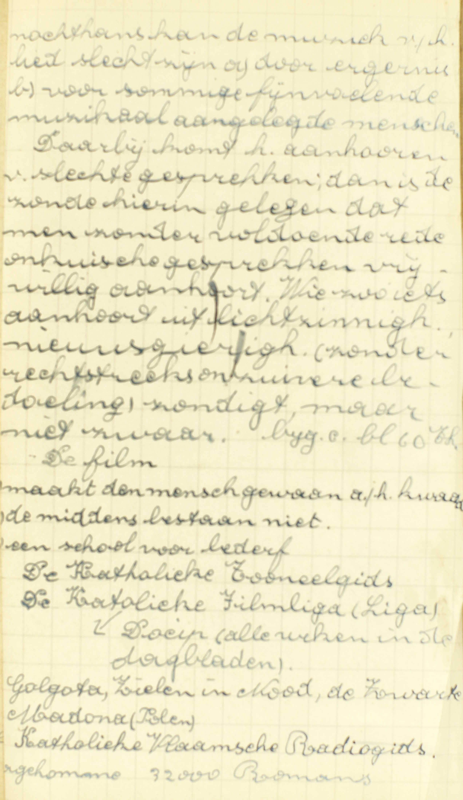
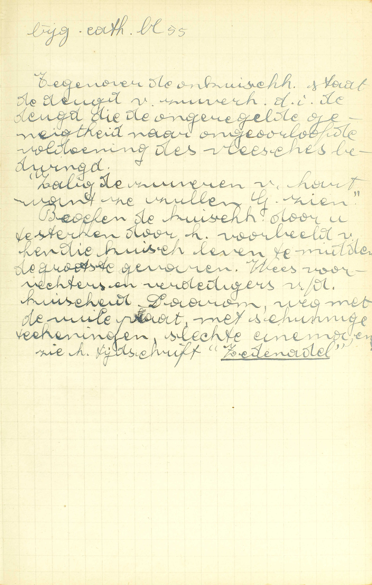

<table>
<tr>
  <td rowspan=3>**Met wil of met werken, slaat niemand dood**</td>
  <td rowspan=3 class=accolade></td>
  <td>Wat dit Gebod verbiedt</td>
  <td colspan=3>*[Wat verbiedt het Vijfde Gebod?](#wat-verbiedt-het-vijfde-gebod)*</td>
</tr>
<tr>
  <td>Wie ertegen zondigen</td>
  <td colspan=2>*[Misdoen zij allen tegen het Vijfde Gebod, die metterdaad iemand hinderen?](#misdoen-zij-allen-tegen-het-vijfde-gebod-die-metterdaad-iemand-hinderen)*</td>
  <td>*[Wat leert ons Christus te doen aan onze vijanden?](#wat-leert-ons-christus-te-doen-aan-onze-vijanden)*</td>
</tr>
<tr>
  <td>Het slaan van een bijzondere klasse personen, namelijk de geestelijken</td>
  <td colspan=3>*[Is het meerder kwaad geestelijke personen te slaan of te kwetsen dan wereldlijke?](#is-het-meerder-kwaad-geestelijke-personen-te-slaan-of-te-kwetsen-dan-wereldlijke)*</td>
</tr>
<tr>
  <td>**Doe geen overspel noch onkuisheid**</td>
  <td class=accolade></td>
  <td>Wat dit Gebod verbiedt</td>
  <td>*[Wat verbiedt het Zesde Gebod?](#wat-verbiedt-het-zesde-gebod)*</td>
  <td>Middelen tegen de onkuisheid</td>
  <td>*[Wat middel is er tegen de onkuisheid?](#wat-middel-is-er-tegen-de-onkuisheid)*</td>
</tr>
<tr>
  <td>**Begeer niemands bedgenoot**</td>
  <td class=accolade></td>
  <td>Wie tegen dit Gebod zondigen</td>
  <td>*[Wie misdoen tegen het Negende Gebod?](#wie-misdoen-tegen-het-negende-gebod)*</td>
  <td>Manier van de zonden van onkuisheid te biechten</td>
  <td>*[Die enige onzuiverheid gedaan heeft, hoe moet hij dat biechten?](#die-enige-onzuiverheid-gedaan-heeft-hoe-moet-hij-dat-biechten)*</td>
</tr>
</table>

# Wat verbiedt het Vijfde Gebod?

## Zich zelf of enige andere mensen, zonder wettige macht en reden, dood te slaan, te kwetsen, merkelijk te hinderen of daartoe raad of hulp te geven.

  
  <em>Door dit gebod wordt verboden: aan leven of gezondheid, zowel natuurlijk als bovennatuurlijk, zowel van de naaste als van onszelf, A) schade toe te brengen: 1) rechtstreeks: zelf metterdaad doden, zelfmoord, kwetsen, merkelijk kinderen, 2) onrechtstreeks: door raad of hulp, door ergernis, B) schade te *willen* toebrengen: uitgedrukt in vermaldedijding of verwensing, besloten in gramschap, haat of nijd. NOTA: voor het natuurlijk leven is dit verbod niet toepasselijk waar men [onder]steund is met wettige reden en bekleed met waar gezag: doodstraf, zelfverdediging, oorlog.</em>
  
  <em>Mag een dokter bij een hopeloos geval het leven verkorten (euthanasie = zachte dood)? Neen, 1) gij zult niet doden: God alleen is meester over het leven; 2) wat is een hopeloos geval? --- dikwijls vindt de wetenschap nog hulpmiddelen waar alles verloren scheen, wij mogen ook geen bovennatuurlijke tussenkomst verachten, dit toelaten waar een heel gevaarlijk princiep, 3) moest hij het zelf gevraagd hebben? --- hij ook is niet meester over zijn eigen leven, 4) en voor en Christen is het lijden een grote uitboeting.</em>

A. Het Vijfde Gehod verbiedt dus 1° **zichzelf dood te slaan, te kwetsen, of merkelijk te hinderen;** 2° **andere mensen** dood te slaan, te kwetsen of merkelijk te hinderen; 3° **daartoe raad of hulp te geven;** — als dit geschiedt **zonder wettige macht en reden.**

De woorden: **zichzelf of enige andere mensen** duiden het goed aan, dat het Vijfde Gebod ons doet eerbiedigen, te weten, het leven, de gezondheid van de mens. De dieren mogen wij doden, daar zij volgens Gods beschikking, tot ons gebruik bestemd zijn; de mens echter is het hoofdwerk van de aardse schepping en daarom heeft God alleen de macht over het menselijk leven.

**Doodslaan** betekent hier iemand op de een of de andere wijze het leven ontnemen; — **kwetsen,** iemand een wonde toebrengen, of van een lidmaat of van het gebruik daarvan berooven; — **merkelijk hinderen,** iemand in zijn persoon of in zijn rust een ware schade veroorzaken met hem b.v. ongezonde spijzen te geven, vrees aan te jagen, droefheid aan te doen, enz.

Zich zelf of andere mensen dood te slaan, te kwetsen of me: kelijk te hinderen, is toeh niet volstrekt in alle omstandigheden verboden: om verboden te zijn moet het geschieden **zonder wettige machten reden:** zonder dat men daartoe wezenlijk van God gemachtigd is en een voldoende reden heeft om die macht te gebruiken. Daartoe hebben voorzeker macht en reden de landoversten die, om de orde in de samenleving te handhaven, de doodstraf tegen enige grote misdadigers doen uitspreken; — de soldaten die in een rechtvaardigen oorlog vechten; — degenen die hun aanvaller doden, omdat zij geen ander middel hebben om er hun leven tegen te verdedigen.

Als bovengenoemde werken verboden zijn, dan is het ook verboden **daartoe raad of hulp te geven,** aangezien men ze op die wijze samen met anderen verricht. Men geeft **raad** tot een werk, met dit te bevelen, te prijzen, goed te keuren of er toe op te wekken; men geeft daar **hulp** toe, me middelen of onderstand te verschaffen om het te verrichten, alsook met dat niet te beletten, als men het beletten kan, en daartoe uit rechtvaardigheid verplicht is.

Het Vijfde Gebod raakt niet enkel het *lichamelijk,* maar ook het *bovennatuurlijk* leven, dat in de heiligmakende gratie bestaat. Dit bovennatuurlijk leven wordt verloren door de doodzonde en gekrenkt door de dagelijkse zonde, en zo strijden alle zonden op een algemene wijze tegen het Vijfde Gebod; iedere doodzonde is een zelfmoord; iedere dagelijkse zonde, een zelfverhindering in het bovennatuurlijk leven. Hier echter valt op te merken dat, door de zonde, elkeen enkel *zichzelf* en niet *enige andere mensen* kan treffen, tenzij met daartoe *raad of hulp* of ten minste gelegenheid te verschaffen, of i.a.w. met *ergernis* of *schandaal* te geven.

De ergernis bestaat eigenlijk in een *woord, werk of verzuimenis, die minder goed is, en een ander tot val brengt,* — Dus is niet vereist dat hetgeen men doet uit zichzelf zonde zij; het is genoeg dat het minder goed weze, omdat het de naaste tot zonde leidt.

Ten aanzien 1° van het ergernis gevend werk zelf geschiedt de ergernis of a) met de naaste rechtstreeks tot zonde te verleiden, of b) met hem uitsluitend de gelegenheid te geven van te zondigen. — 2° Wegens het inzicht van dengene die ergernis geeft, geschiedt zij *met* of *zonder opzet:* — a) *met opzet,* als men iets doet of zegt met het bepaald inzicht van de naaste tot zonde te brengen; b) *zonder opzet,* als men, om enige andere reden, iets doet of zegt, dat de naaste gelegenheid of aanleiding tot zonde geeft.

Nooit mag men de naaste rechtstreeks tot zonde bekoren, noch hem gelegenheid geven van te zondigen, met het inzicht van hem tot zonde te brengen; zelfs mag men hem, zonder dat inzicht geen gelegenheid van zonde geven, tenware men daartoe genoegzame reden hadde. — Wij hebben daartoe een genoegzame reden, 1° als de naaste in ons werk, woord of verzuimenis slechts uit boosheid een gelegenheid van zonde vindt; 2° als hetgene wij doen, ons op zonde is opgelegd; 3° als wij, met een werk te laten, een aanzichtbaare schade zouden lijden.

# Misdoen zij allen tegen het Vijfde Gebod, die metterdaad iemand hinderen?

## Ja,ook degenen die iemand vermaledijden, kwaad wensen, gramschap of haat en nijd in het hart dragen

V. De zin van de vraag is: misdoen tegen het Vijfde gebod al degenen die niet uitsluitend met de wil, met de begeerte, maar metterdaad zichzelf of andere mensen zonder wettige macht en reden doodslaan, kwetsen of merkelijk hinderen, of daartoe raad en hulp geven, en zijn het deze alleen?

A. **Ja,** deze allen misdoen tegen dit Gebod; doch niet zij alleen; daartegen misdoen ook nog **degenen die iemand vermaledijden, kwaad wensen, gramschap of haat en nijd in het hart dragen.**

**Vermaledijden,** d.i. iemand kwaad wensen voor zoveel het voor hem kwaad is, God of de duivel smekende dat die wens zou volbracht worden.

**Kwaad wensen,** d.i. enkel begeren dat aan iemand kwaad overkome, voor zoveel het voor hem kwaad is, zonder daarbij God of de duivel te smeken dat die wens vervuld worde.

**Gramschap,** d.i. een begeerte van wraak te nemen die ongeregeld is, 't zij omdat men geen macht heeft om een misdaad te straffen, of wil straffen zonder reden, of te veel wil straffen, of wil straffen niet met een goed, maar met een slecht inzicht; 't zij, omdat men door die begeerte op een onbehoorlijke wijze ontsteld is. (Zie [38ᵉ les, v. 7.](les-38.html#hoeveel-hoofdzonden-zijn-er))

**Haat,** d.i. de boze wil waardoor men iemand kwaad wil, 't zij opdat hij ongelukkig weze, of omdat wij hem aanzien als kwaadwillig jegens ons, en diensvolgens hem verfoeien.

**Nijd,** d.i. een ongeregelde droefheid over het geluk en goed van de naaste, voortkomende uit het gedacht dat zijn geluk ons geluk vermindert.

Al deze zonden strijden tegen het Vijfde Gebod, aangezien zij alle, — uitgenomen die gramschap welke slechts zonde is uit hoofde van de te grote ontsteltenis, — de begeerte insluiten van iemand zonder wettige macht en reden te hinderen in zijn leven, of, ten minste, in zijn rust en geluk, met hem droefheid aan te doen; en aangezien de gramschap, zooeven uìtgezonderd, rechtstreeks aanleiding geeft om deze zonde te bedrijven, en onze eigen rust alsmede die van de naaste stoort.  — Aan nijd maakte zich schuldig Caïn jegens Abel, en Saül jegens David.

# Wat leert ons Christus te doen aan onze vijanden?

## Hij leert ons alle ongelijk te vergeven, voor onze vijanden te bidden, en ook het kwaad met goed te loonen

  
  <em>Iedereen moet in zijn eigen leven streven naar een volmaakte naastenliefde, zelfs naar liefde voor diegenen die ons hebben tekortgedaan. Dit is misschien het meest lastige voorschrift van de Meester.</em>

V. De Catechismus stelt hier deze vraag, omdat wij tegen het Vijfde Gebod meest zondigen in onze betrekkingen met Onze vijanden, d.i. met degenen die ons kwaad doen, of ten minste kwaad willen.

A. Christus heeft ons geleerd voor onze vijanden *drie* dingen te doen:

1° **Alle ongelijk te vergeven:** alle kwaad dat zij doen, zó kwijt te schelden, dat wij hun daarom geen kwaad tot hun ongeluk willen. Doch wij mogen wel schadeherstelling eisen, en vragen dat de misdadiger tot rust van de samenleving en tot zijn eigen. goed door de bevoegde overheid gestraft worde. — Wij moeten vooral *inwendig* vergeven, maar dit ook *uitwendig* tonen, namelijk met hoegenaamd geen afkeer, haat of wraakzucht te laten blijken.

2° **Voor onze vijanden te bidden:** hen uit die gebeden, waarin wij voor alle mensen bidden, niet te sluiten, en ook nog bijzondere gebeden voor hen te storten.

3° **Ook het kwaad met goed te loonen:** hun die liefdeblijken te geven, die wij aan alle mensen verschuldigd zijn, en hun ook nog bijzondere liefdediensten te bewijzen.

Wij zijn *op zonde verplicht* alle ongelijk op de gezegde wijze te vergeven, onze vijanden uit die gebeden, waarin wij voor alle mensen bidden, niet te sluiten, en hun de gewone liefdebetuigingen niet te weigeren; — voor hen bijzondere gebeden te doen en hun bijzondere liefdeblijken te geven, is wel niet geboden, maar toch allergeraadzaamst.

Allerschoonste voorbeelden hiervan vinden wij in Jezus Christus die, aan het kruis hangende, voor zijn beulen heeft gebeden, en die voor ons allen, zondaars en ondankbare mensen, de dood heeft willen lijden; — in Stephanus, die ook gebeden heeft voor degenen die hem stenigden, — en in Jozef, die aan zijn broeders, door wie hij in een put geworpen en daarna aan Ismaëlieten verkocht geweest was, de uitstekendste liefde betuigd en de grootste diensten bewezen heeft.

# Is het meerder kwaad geestelijke personen te slaan of te kwetsen dan wereldlijke?

## Ja, want boven de zonde vallen deze slagers in de ban van de H. Kerk
V. Hoe waardiger de persoon die men mishandelt, hoe groter de zonde die men bedrijft, en daarom vraagt hier de Catechismus, of het **meerder kwaad** (groter zonde) **is geestelijke personen te slaan of te kwetsen dan wereldlijke.** — Door geestelijke personen verstaat men al degenen die in de HH. Orden zijn, al degenen die de kleine orden of enkel de kruin ontvangen hebben, zo zij nochtans de geestelijke kleren dragen; ook al de religieuzen. Deze worden allen *geestelijke* personen genoemd, omdat zij God en de geestelijke zaken bijzonder zijn toegewijd.  A. **Ja,** het is een meerder kwaad, **want boven de zonde vallen deze slagers in de ban van de H. Kerk:** d.i. want de slagers maken zich niet alleen schuldig aan een zonde tegen het Vijfde Gebod, maar worden ook nog, tot straf van hun misdaad, beroofd van de gemeenschap van de Heiligen ([13ᵉ les](les-13.html)). — Uit deze bijzondere straf blijkt heel klaar, dat er in die zonde een bijzondere boosheid gelegen is; daarenboven, met in weerwil van die straf een geestelijken persoon te slaan, maakt men zich nog schuldig aan een zonde tegen de gehoorzaamheid jegens de H. Kerk en tegen de liefde jegens zichzelf.

# Wat verbiedt het Zesde Gebod?

## Overspel, onkuisheid en alle oneerlijke aanrakingen, in wat manier en onder welke personen deze mochten geschieden; ja ook oneerlijke woorden, zangen, en gebruik van onzuivere boeken en beelden

  
  <em>De onderwijzer moet altijd voorzichtig zijn en kies in 't geven van deze lessen. De uitdrukkingen die hij gebruiken zal mogen het geweten niet misvormen. Dus de beste uitdrukking voor het 6ᵉ en 9ᵉ gebod is *onkuis*, *onkuisheid*. --- Geen vragen dulden in de klas. --- Wat vooral het werk van de opvoeder uitmaakt, is de kinderen vormen tot kuisheid. Dus positief werk leveren. Het kwaad van de onkuisheid voor ogen stellen met de schoonheid van de kuisheid te doen begrijpen (met voorbeelden). Dit alles aangepast aan de ontwikkeling en de ouderdom van de leerlingen. --- Een algemene regel voor persoonlijke gevallen: de kinderen verwijzen naar biechtvader of priester.</em>
  
  <em>Enkele regels voor gewetensvorming. Wetens (volle verstand) en willens (vrije wil) onkuisheid doen met woord, werk of begeerte, is altijd doodzonde. --- In de mate dat het volle verstand of het bewustzijn ontbreekt, is het slechts dagelijkse zonde of geen zonde. --- De zonde ligt in de wil (dus niet in de neiging of bekoring of gewaarwording op zichzelf). Daaruit volgt: zo ge de onkuisheid gewild hebt: doodzonde, zo gij het niet gewild hebt, wat er ook gebeure, welke gewaarwording ge ook hebt: geen doodzonde.</em>
  
  <em>Onkuise praat, daardoor verstaan wij spreken over geslachtszaken met onkuise bedoelingen; spreken over geslachtszaken op onbetamelijke manier, zonder voldoende rede, tussen sommige personen op die manier dat het zeker slechte gevolgen zal hebben voor één of voor beide partijen.</em>
  
  <em>Daarbij komt het aanhoren van slechte gesprekken; dan is de zonde hierin gelegen dat men zonder voldoende rede onkuise gesprekken vrijwillig aanhoort. Wie zoiets aanhoort uit lichtzinnigheid, nieuwsgierigheid (zoner rechtstreeks onzuivere bedoeling) zondigt, maar niet zwaar.</em>

A. Dat een werk, een aanraking, een woord, een samenspraak, een lezing, een oogslag oneerlijk en onzuiver zijn, weten wij dikwijls door de klare getuigenis van ons geweten, en ook meest altijd door de natuurlijke schaamte, die wij er over hebben. Al die daden en werken zijn gewoonlijk oneerlijk en onzuiver, die door geen ander Gebod verboden zijn en ons schaamrood doen worden, en door ons niet zouden bedreven worden, moesten onze ouders of oversten het weten of zien. Nochtans is deze regel niet onfeilbaar, en daarom moet men in geval van twijfel aan zijn biechtvader uitleg vragen.

# Wie misdoen tegen het Negende Gebod?

## Die de wil hebben om onkuisheid te doen, of wetens en willens behagen nemen in onkuise gedachten.

A. Tegen het Negende Gebod zondigen:

1° **Die de wil hebben van onkuisheid te doen,** d.i. die de begeerte hebben of zich voorstellen onzuivere werken of aanrakingen, of lezingen, of samenspraken of aanschouwingen te doen, als zij de gelegenheid zullen hebben, of als zij het zullen kunnen doen zonder gezien te zijn, enz. — Die immers een zonde wil doen, maakt zich reeds daardoor aan die zonde schuldig, hoewel hij ze niet ten uitvoer brengt; want de zonde bestaat eigenlijk *in de wil,* in de wet Gods *te willen overtreden.*

2° **Of die wetens en willens behagen nemen in onkuise gedachten:** die onzuivere werken goedkeuren, als goed en aangenaam aannemen en ze als zonde niet willen verfoeien; ook die zonder noodzakelijkheid of genoegzame reden onzuivere werken of schandige zaken levendig in hun inbeelding voorgesteld houden.

Beide soorten van onkuise gedachten zijn zonde: de eerste op dezelfde grond als de onzuivere begeerten, de laatste om dezelfde reden als de onzuivere oogslagen, indien men er, **wetens en willens** mee bezig is, of indien men, opgemerkt hebbende dat men met slechte gedachten bezig is, waarmee men niet mag bezig zijn, desniettegenstaande vrijwillig of uit vrije verkiezing met die gedachten bezig blijft, en ze van zich niet wil afwenden. Hier is dan: geen spraak: van de onkuise gedachten die zonder onze schuld in ons zijn, maar uitsluitend van dezulke die wij vrijwillig in ons houden.

# Wat middel is er tegen de onkuisheid?

## Ten eerste, het lichaam onthouden van overdaad; ten tweede, schuwen het gezelschap van ongelijke personen; ten derde, gedenken de goddelijke tegenwoordigheid; ten vierde, dikwijls te biechten gaan en de raad van de biechtvader volgen

A. **Ten eerste, het lichaam onthouden van overdaad** d.i. altijd matig zijn in eten of drinken ; de overdaad immers hitst de onkuise genegenheden op.

**Ten tweede, schuwen het gezelschap van ongelijke personen,** d. i. het gezelschap vluchten van personen van het ander geslacht.

**Ten derde, gedenken de goddelijke tegenwoordigheid,** d.i. dikwijls, zoals ’s morgens en 's avonds, vóór de bijzonderste werken van de dag en in de bekoring, ons indachtig maken dat God, onze Schepper, Heer en Regeerder, die ons alles gegeven heeft en ons zo strengelijk moet oordelen, wesenlijk gedurig bij ons is en op de volmaaktste wijze alles ziet, wat wij doen of willen, — Dit is een allerbeste middel: reeds de tegenwoordigheid van onze ouders belet ons voorzeker een onkuis werk te bedrijven; veel meer zal ons daarvan afhouden het aandenken aan de tegenwoordigheid van de groten en machtigen God, die ons moet oordelen.

**Ten vierde, dikwijls te biechten gaan en de raad van de biechtvader volgen.** De Biecht is daartoe zeer nuttig, 1° omdat zij ons verplicht een goed onderzoek van conscientie te doen, alsmede een goed berouw te verwekken, en een vast voornemen te maken van niet meer te zondigen; 2° omdat de belijdenis van de zonde ons een zalige vrees voor haar inboezemt; 3° omdat wij in de Biecht overvloedige gratie bekomen, om de zonde te vluchten; 4° omdat wij daar raad ontvangen van de biechtvader, die van God gesteld is om ons in de weg van de zaligheid te onderwijzen en ons de bijzondere middelen, die wij te gebruiken hebben, aan te tonen.

Ook het overwegen van de schrikkelijke verdelging, waarmee God de onkuise steden Sodoma en Gomorrha gestraft heeft, en van de menigvuldige en afgrijselijke kwalen, die uit de onkuischheid voortspruiten, zal zeer dienstig zijn om ons van de zonden tegen het Zesde en Negende Gebod af te keren.

# Die enige onzuiverheid gedaan heeft, hoe moet hij dat biechten?

## Hij moet met eerlijke woorden verklaren in wat manier hij door onkuisheid gezondigd heeft

  
  <em>Tegenover de onkuisheid staat de deugd van zuiverheid, d.i. de deugd die de ongeregelde geneigdheid naar ongeoorloofde voldoening van het vlees bedwingt. "Zalig de zuiveren van hart, want ze zullen God zien." Beoefen de kuisheid door u te sterken door het voorbeel van hen die kuis leven te midden van de grootste gevaren. Wees voorvechters en verdedigers van de kuisheid. Daarom weg met de vuile praat, met schunnige tekeningen, slechte cinema, enz. Zie het tijdschrift *Zedenadel*.</em>

A. **Hij moet 1° verklaren, in wat manier hij door onkuisheid gezondigd heeft:** het is dan niet genoeg te zeggen: ik heb onkuisheid gedaan of slechte dingen; maar men moet uitdrukken, welke soort van onkuisheid men bedreven heeft; — 2° Hij moet dat verklaren, **met eerlijke woorden:** met die taal en met die woorden, welke de welopgevoede mensen gebruiken om de zonden van onzuiverheid te noemen, en welke eenieder bezigt, die daarover met deftige personen moet spreken.

Men moet noodzakelijk verklaren, in wat manier men door onkuisheid gezondigd heeft, omdat men gehouden is alle doodzonden te biechten, daar bijvoegende al hetgene de zonde mag veranderen. (Zie [34ᵉ les, vr. 4.](les-34.html#welke-zonden-moeten-wij-belijden))

### VRAGEN

Welke Geboden worden in deze les uitgelegd? — Wat onderzoek de Catechismus nopens ieder van die Geboden?

1. Welke werken worden door het Vijfde Gebod verboden? — Zijn deze werken nooit toegelaten? — Zeg, met de woorden van de Catechismus, wanneer zij toegelaten zijn. — Wat betekenen hier de woorden, *doodslaan, kwetsen, merkelijk hinderen, daartoe raad of hulp geven?* — Wat is te zeggen: *zonder wettige macht en reden?* — Welk goed doet het Vijfde Gebod ons eerbiedigen? — Welke schepselen mogen wij niet doodslaan, kwetsen of merkelijk hinderen? — Waarom is het verboden tot een werk tegen het Vijfde Gebod raad of hulp te geven? — Wat leven bestaat er in de mens, behalve het natuurlijk leven? — Hoe kan dit leven gekrenkt of verloren worden? — Hoe kunnen wij een ander in dat leven hinderen, en hoe noemt men de zonde waardoor dit geschiedt? — Wat is dus de ergernis? — Leg de woorden uit. — Op hoeveel manieren kan de ergernis geschieden a) betrekkelijk het werk in zichzelf, en b) betrekkelijk het inzicht dat men heeft? — Mag men ooit iets doen, waardoor men ergernis geeft?

2. Welk is de zin van de tweede vraag? — Wie misdoen nog tegen het Vijfde Gebod, buiten degenen die metterdaad iemand hinderen? — Wat verstaat men hier door *vermaledijden, kwaad wensen, gramschap, haat, nijd?* — Hoe strijden al deze zonden tegen het Vijfde Gebod?

3. Waarom stelt de Catechismus hier de vraag: *Wat leert ons Christus te doen aan onze vijanden?* — Wie zijn onze vijanden? — Hoeveel en welke dingen moeten wij, volgens Christus’ leer voor onze vijanden doen? — Leg ieder punt uit. — Zeg hoe wij tot ieder puat verplicht zijn.

4. Verschillen de zonden tegen het Vijfde Gebod uit hoofde van de persoon die gehinderd wordt? — Wie zijn geestelijke personen? — Waarom dragen zij deze naam? — Zondigt men meer met geestelijke personen te hinderen dan andere? — Hoe bewijst de Catechismus dit? — Leg de woorden van de Catechismus uit. — Toon hoe uit het bewijs van de Catechismus vloeit, dat het groter kwaad is geestelijke personen te slaan of te kwetsen dan wereldlijke.

5. Hoe kan men best oordelen, dat een werk, een woord, een aanraking, een oogslag oneerlijk en onzuiver is? — Is deze regel geheel onfeilbaar? — Wat moet men doen ín geval van twijfel?

6. Zeg, met de woorden van de Catechismus, de verschillende gevallen, in welke men tegen het Negende Gebod misdoet. — Wat betekenen de woorden: *die de wil hebben van onkuisheid te doen?* — Wat is *behagen nemen in onkuise gedachten?* — Wat betekenen de woorden *wetens en willens?* — Zijn alle onzuivere gedachten zonden tegen het Negende Gebod? — Welke onzuivere gedachten zijn zonden tegen dit Gebod? — Waarom zondigen wij tegen het Negende Gebod met de wil te hebben van onkuisheid te doen? — Waarom zondigen wij tegen het Negende Gebod met behagen te nemen in onkuise gedachten?

7. Hoeveel middelen stelt de Catechismus voor om de onkuisheid te vluchten? — Noem ze met de woorden van de Catechismus. — Hoe behoort men, om de onkuisheid te vermijden, de goddelijke tegenwoordigheid te gedenken? — Hoe is het dikwijls te biechten gaan een middel tegen de onkuisheid?

8. Zeg, met de woorden van de Catechismus, wat men in de Biecht moet verklaren nopens de zonden van onzuiverheid. — Lieg die woorden uit, en geef de reden van het antwoord. — Hoe moet men, volgens de Catechismus, die verklaring doen? — Leg de woorden van de Catechismus uit.

