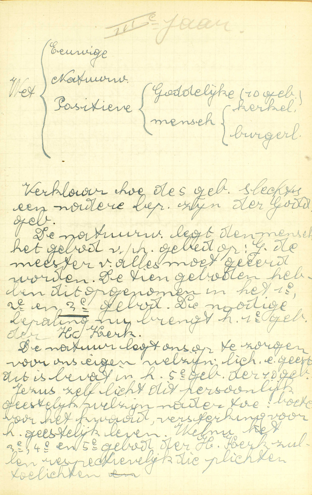
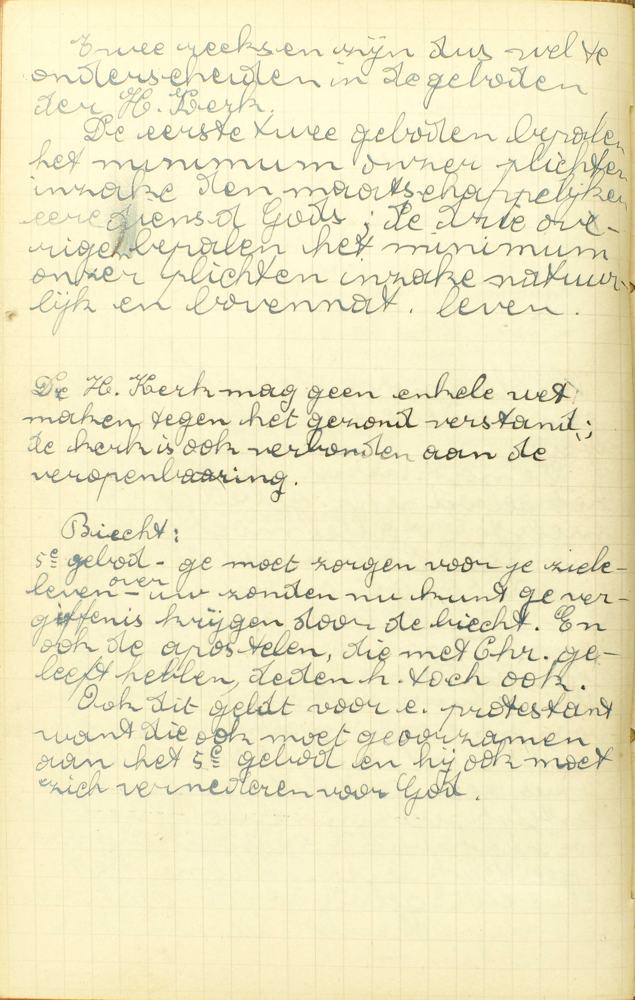
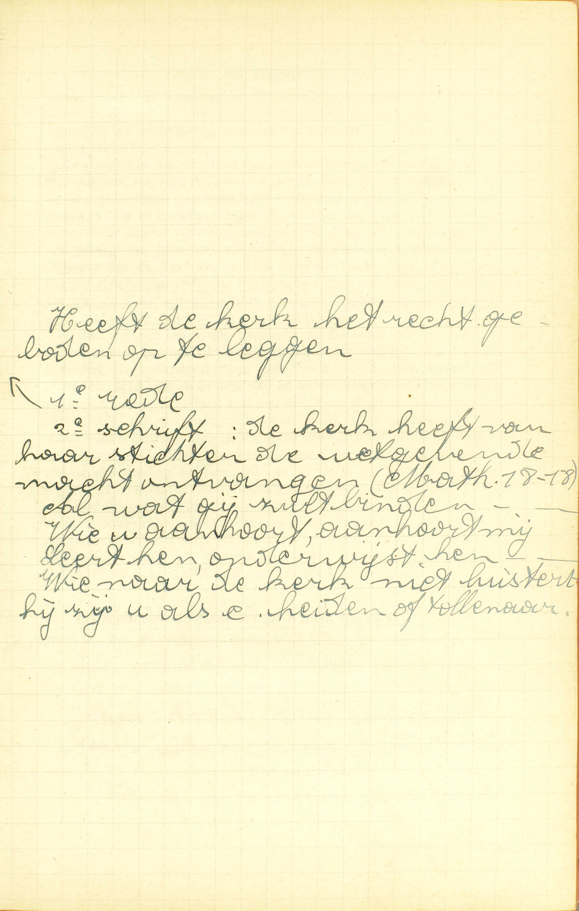
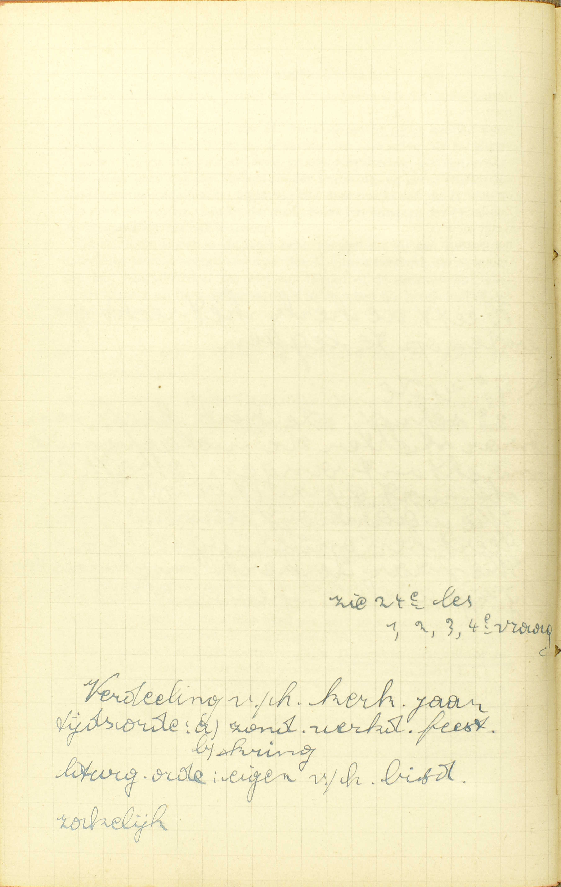
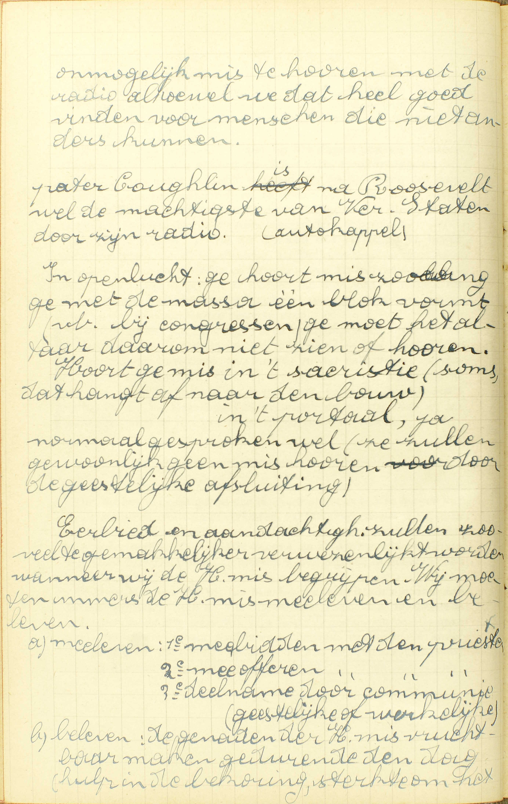
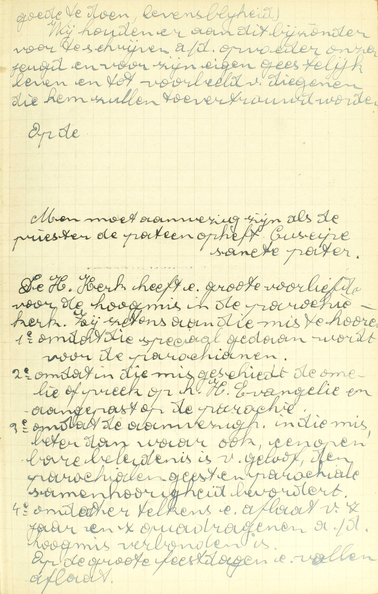

<table>
<tr>
  <td rowspan=4>**De Geboden van de H. Kerk in 't algemeen**</td>
  <td rowspan=4 class=accolade></td>
  <td>Getal</td>
  <td>*[Hoeveel Geboden van de Heilige Kerk zijn er?](#hoeveel-geboden-van-de-heilige-kerk-zijn-er)*</td>
</tr>
<tr>
  <td>Tekst</td>
  <td>*[Zeg de Vijf Geboden van de Heilige Kerk](#zeg-de-vijf-geboden-van-de-heilige-kerk)*</td>
</tr>
<tr>
  <td>Oorsprong</td>
  <td>*[Wie heeft de Geboden van de Heilige Kerk ingesteld?](#wie-heeft-de-geboden-van-de-heilige-kerk-ingesteld)*</td>
</tr>
<tr>
  <td>Verplichting</td>
  <td>*[Zijn wij schuldig de Geboden van de Heilige Kerk te onderhouden?](#zijn-wij-schuldig-de-geboden-van-de-heilige-kerk-te-onderhouden)*</td>
</tr>
<tr>
  <td>**De Geboden Heiligdagen zult gij vieren**</td>
  <td class=accolade></td>
  <td>Reden van de instelling van de Feestdagen</td>
  <td>*[Waarom zijn de Feestdagen ingesteld?](#waarom-zijn-de-feestdagen-ingesteld)*</td>
</tr>
<tr>
  <td rowspan=2>**En dan ook Mis horen met goede manieren**</td>
  <td rowspan=2 class=accolade></td>
  <td>Goede manieren</td>
  <td>*[Hoe moeten wij Mis horen?](#hoe-moeten-wij-mis-horen)*</td>
</tr>
<tr>
  <td>Mis</td>
  <td>*[Is het genoeg een deel te horen?](#is-het-genoeg-een-deel-te-horen)*</td>
</tr>
</table>

  
  <em>Verklaar hoe de 5 [van de H. Kerk] geboden slechts een nadere bepaling zin van de Goddelijke geboden. De natuurwet legt de mens het gebod van  het gebed op: God, de meester van alles moet geëerd worden. De tien geboden hebben dit opgenomen in het 1ᵉ, 2ᵉ en 3ᵉ gebod. De nodige bepaling nu brengt het 1ᵉ gebod van de H. Kerk. De natuur legt ons op te zorgen voor ons eigen welzijn: lichaam en geest. Dit is bevat in het 5ᵉ gebod van de 10 geboden. Jezus zelf licht dit persoonlijk geestelijk welzijn nader toe: boete doen voor het kwaad, versterking voor het geestelijk leven. Welnu het 3ᵉ, 4ᵉ en 5ᵉ gebod van de H. Kerk zullen respectievelijk die plichten toelichten.</em>
  
  <em>Twee reeksen zijn dus wel te onderscheiden in de geboden van de H. Kerk. De eerste twee geboden bepalen het minimum van onze plichten inzake de maatschappelijke eredienst van God; de drie overige bepalen het minimum van onze plichten inzake natuurlijk en bovennatuurlijk leven. De H. Kerk mag geen enkele wet maken tegen het gezond verstand; de kerk is ook verbonden aan de openbaring. Ge moet zorgen voor uw zieleleven. Over uw zonden nu kunt ge vergiffenis krijgen door de biecht. En ook de apostelen, die met Christus geleefd hebben, deden het toch ook. Ook dit geldt voor een protestant, want die ook moet gehoorzamen aan het 5ᵉ gebod en hij ook moet zich vernederen voor God.</em>

Op de uitlegging van de Tien Geboden Gods volgt deze van de Vijf Geboden van de H. Kerk, omdat wij, om de Liefde te onderhouden, niet minder de Vijf Geboden van de H. Kerk dan de Tien Geboden Gods moeten volbrengen; ook nog, omdat die Geboden van de H. Kerk niets anders zijn dan nadere bepalingen van enige van de Goddelijke Geboden.

# Hoeveel Geboden van de Heilige Kerk zijn er?

## Voornamelijk vijf

V. Het woord **Kerk** betekent hier de Rooms-Katholieke Kerk, die de ware Kerk is van Christus.
A. **Voornamelijk vijf:** *vijf voorname,* vijf bijzondere; want, behalve deze, bestaan er nog, nopens de geestelijke personen, de geestelijke zaken en plaatsen, menigvuldige wetten van de H. Kerk, die gezamenlijk het *kerkelijk* of *canoniek recht* uitmaken. De Vijf Geboden, waarvan hier spraak is, worden *voorname* geboden genoemd, omdat zij alle Christenen aangaan, alsook, omdat zij de voornaamste en gewichtigste christelijke plichten bepalen.

# Zeg de Vijf Geboden van de Heilige Kerk

## 1. De geboden Heiligdagen zult gij vieren. 2. En dan ook Mis horen met goede manieren. 3. Geen geboden vastendagen zult gij breken. 4. Gij zult uwen priester, ten minste ééns 's jaars, uw biecht spreken. 5. En nutten omtrent Pasen het lichaam des Heren

A. Het Eerste en het Tweede Gebod handelen over het eren van God en zijn Heiligen; het Derde, over de boetvaardigheid; het Vierde, over het ontvangen van het Sacrament van de Biecht, en het Vijfde, over het nutten van het Sacrament des Altaars: vier punten die een zeer gewichtige plaats in de Godsdienst en in het werk van onze zaligmaking bekleden. — God heeft ons wel, door onze rede en door zijn Openbaring, klaar en duidelijk geboden zijn opperste majesteit te eren, en over onze zonden boetvaardigheid te doen; Hij heeft ons ook door Christus’ Openbaring uitdrukkelijk opgelegd het Sacrament van de Biecht en de H. Communie te ontvangen; maar noch de tijd noch de manier bepaald van die geboden te volbrengen. Deze bepaling wordt gedaan door de Geboden van de H. Kerk die ons hier voorgesteld zijn.

# Wie heeft de Geboden van de Heilige Kerk ingesteld?

## De oversten van de H. Kerk, die ook de Sabbat hebben veranderd in de Zondag

V. **Wie,** in de H. Kerk, **heeft de Geboden van de H. Kerk ingesteld:** zijn het al de gelovigen samen, ofwel de oversten alleen?

A. Het zijn **de oversten van de H. Kerk,** d.i. de wetgevende macht van de H. Kerk, namelijk, de Paus en de bisschoppen die met de Paus in gemeenschap zijn, ([12ᵉ les](les-12.html)), — **die ook de Sabbat hebben veranderd in de Zondag,** en door die daad bewezen hebben, dat Christus de wetgevende macht aan de oversten van de H. Kerk heeft vergund.

Dat de hoge overheid van de H. Kerk de macht moet hebben van geboden op te leggen, blijkt uit de natuur van de zaak zelve: de H. Kerk is door Christus ingesteld als een grote vergadering, als een groot rijk; maar geen rijk kan bestaan zonder regering, en geen regering zonder wetgevende macht; bijgevolg kan deze macht aan de H. Kerk niet ontkend worden, zonder dat men tevens het bestaan van de H. Kerk als vergadering, als rijk loochent.

De H. Kerk wordt in de algemene wetten, die zij aan geheel de katholieke wereld oplegt, zó door de H. Geest bestuurd, dat zij nooit iets kan voorschrijven, dat met het Geloof of de zeden strijdt. Dit vloeit immers uit haar onfeilbaarheid in de zaken die het Geloof of de zeden aangaan.

# Zijn wij schuldig de Geboden van de Heilige Kerk te onderhouden?

## Ja, zowel als de Goddelijke Geboden, aangezien zij gegeven zijn van degenen die in Gods plaats ons regeren

  
  <em>De kerk heeft van haar stichter de wetgevende macht ontvangen (Math 18:18). Al wat gij zult binden... Wie u aanhoort, aanhoort mij... Leert hen, onderwijst hen... Wie naar de kerk niet luistert, hij zij u als een heiden of tollenaar.</em>

V. **Zijn wij,** die door het Doopsel aan de H. Kerk toebehoren, en tot de jaren van verstand gekomen zijn, — **schuldig:** op zonde verplicht, — **de Geboden van de H. Kerk te onderhouden?**

Onder het woordje *wij,* in deze vraag, moeten dus ook verstaan worden de *Ketters,* de *Schismatieken* en degenen die *in de geestelijken ban* zijn; deze immers, al belijden zij het waarachtig Geloof niet onder de gehoorzaamheid van de Paus van Rome, behoren toch door hun Doopsel aan de H. Kerk toe, en staan, opzichtens de kerkelijke wetten, op dezelfde voet als wij; niet meer zijn zij van die wetten ontslagen dan de onderdanen, die tegen hun wettigen koning opstaan, van dezes wetten vrij zijn. Dikwijls nochtans strekt de H. Kerk haar Geboden tot de Ketters en de Schismatieken niet uit.

De *ongedoopten,* ofschoon gehouden het Doopsel te ontvangen, zijn geenszins aan de wetten van de H. Kerk onderworpen, zolang zij door het Doopsel in de H. Kerk niet zijn getreden; nimmer toch moet men de wetten van een vergadering volgen tot dewelke men niet behoort. — Met de verplichting van de Tien Geboden is het hier heel anders gelegen: deze immers (de bepaling van de Heiligdagen uitgezonderd) moet elke mens die tot de jaren van verstand gekomen is, onderhouden, omdat zij de uitdrukking zijn van de natuurwet, die voor iedereen verplichtend is.

De *kinderen,* die de jaren van verstand nog niet bereikt hebben, zijn ook niet schuldig de Geboden van de H. Kerk te onderhouden, b.v. op de onthoudings- en vastendagen verbodene spijzen te derven of des Zondags Mis te horen, omdat de wetten, van de vrije wil van de wetgevende macht voortkomende, slechts diegenen verplichten, die het gebruik van hun verstand hebben; en hierin ook verschillen de Geboden van de H. Kerk van de Tien Geboden Gods; want zelfs dezen, die het gebruik van de rede niet hebben, mag men niets doen verrichten, dat met de Tien Geboden strijdt; daar al hetgeen deze verbieden uit zijn natuur de orde stoort en verboden is.

A. **Ja;** wij zijn op zonde verplicht de Geboden van de H. Kerk te onderhouden, **zowel als de Goddelijke Geboden,** zowel als de Geboden die rechtstreeks van God voortkomen, **aangezien zij gegeven zijn van degenen die in Gods plaats ons regeren;** aangezien zij ons opgelegd zijn van de Paus en de bisschoppen, die niet uitsluitend van de natuurlijke wet, gelijk onze ouders en onze burgerlijke oversten, maar rechtstreeks van Christus macht ontvangen hebben om ons in Gode plaats te besturen, en bijgevolg een bovennatuurlijke zending hebben, om ons in Gods naam geboden op te leggen, en ons tot het onderhouden er van op zonde te verplichten.

Het is onloochenbaar, dat men zowel de geboden moet volgen van de plaatsvervanger eens oversten, als van die overste zelf; dus, aangezien de oversten van de H. Kerk, als zij wetten maken, Gods plaats bekleden, moeten wij noodzakelijk hun wetten, zowel als die welke rechtstreeks van God komen, stiptelijk onderhouden.

# Waarom zijn de Feestdagen ingesteld?

## Om op die dagen enige bijzondere weldaden, die toen geschied zijn, te overleggen, en over dezelve God te danken; ook om de werken van de Heiligen te beter na te volgen, en hun gebeden te verzoeken

  

V. *Welke Feestdagen* wij moeten vieren is reeds gezegd in de [24ᵉ les, 1ᵉ vr.](les-24.html#welke-heiligdagen-zijn-wij-schuldig-te-vieren)

A. Er zijn *twee* soorten van Feestdagen: de een hebben als voorwerp *bijzondere weldaden van God,* zoals de geboorte van Christus, zijn dood, zijn verrijzenis, zijn hemelvaart, de nederdaling van de H. Geest over de Apostelen; — en de andere hebben betrekking *op de Heiligen*.

De eerste zijn ingesteld: 1° **om op die dagen enige bijzondere weldaden, die toen geschied zijn, te overleggen:** om ons enige bijzondere weldaden van God, die op die dagen van het jaar plaats grepen, te herinneren en te doen overwegen, **en** 2° **over dezelve God te danken:** om God over het geven van die weldaden te prijzen en Hem daarover onze innigen dank te betuigen.

De andere dienen: 1° **om de werken van de Heiligen te beter na te volgen;** om de voorbeelden van de Heiligen meer en meer voor ogen te hebben, en zo beter en beter de weg van de zaligheid te leren kennen en tevens opgewekt te worden om die weg te volgen, **en** 2° **om hun gebeden te verzoeken:** om hen te vragen, dat zij voor ons bij God zouden ten beste spreken.

Tot welke soort van Feestdagen al de Heiligdagen behoren, die wij te vieren hebben, is gemakkelijk om te bepalen: de Zondagen, die tot herinnering van de verrijzenis van Christus en van de nederdaling van de H. Geest zijn ingesteld; O. H. Hemelvaart en Kerstdag, die de geboorte van Christus als voorwerp heeft, behoren tot de eerste soort; — O. L. V. Hemelvaart en Allerheiligen waarop men de gedachtenis van al de Heiligen viert, behoren tot de tweede.

Om nu het volgend Gebod van de H. Kerk: *dan ook Mis horen met goede manieren,* volledig te verklaren, zal men zeggen wat te verstaan is: 1° door *Mis,* namelijk, of er spraak is van een hele of slechts een gedeeltelijke; 2° door Mis *horen* en 3° door *goede manieren.*

1° Door *Mis:* de uitlegging hiervan wordt gegeven in het antwoord op de [7ᵉ vraag](#is-het-genoeg-een-deel-te-horen).

2° Door Mis *horen:* tot het Mis-*horen* in zichzelf zijn deze *drie* dingen vereist: a) in de Mis tegenwoordig zijn, d.i. tot diegenen behoren die de Mis wezenlijk bijwonen; b) gedurende de Mis geen werk verrichten, zoals schilderen, schrijven, timmeren of ander diergelijk werk, dat met het opvolgen van de Mis niet kan samen gaan; c) in de Mis aanwezig zijn, met het uitdrukkelijk of ten minste ingesloten inzicht van God daardoor te vereren, en bijgevolg daar toch enigszins met God bezig zijn of op de Mis aandacht geven. Ziehier nu de reden daarvan: het Gebod van Mis te horen is gegeven aan *mensen;* deze bestaan uit *lichaam* en *ziel* en moeten dus a) in de Mis lichamelijk tegenwoordig zijn, en b) in staat zijn om met de geest de Mis te volgen; — het legt die mensen *een verering Gods* op; dus moeten zij de Mis bijwonen om God te eren, en ten minste enigszins de Mis volgen of daaronder op God denken. Wanneer één van de drie vermelde vereisten ontbreekt, dan *hoort* men geen Mis en voldoet dus niet aan de wet van de H. Kerk. — Het bijwonen van de H. Mis wordt Mis *horen* genoemd, omdat zij grotendeels gezongen of gelezen wordt, en men ze zo *horen* kan.

3° Door *goede manieren:* de Catechismus legt deze woorden uit in het antwoord op de volgende vraag.

# Hoe moeten wij Mis horen?

## Met grote eerbiedigheid en aandachtigheid

  
  <em>Onmogelijk mis te horen met de radio, alhoewel we dat heel goed vinden voor mensen die niet anders kunnen. Eerbied en aandachtigheid zullen zoveel te gemakkelijker verwezenlijkt worden wanneer wij de H. mis begrijpen. Wij moeten immers de H. mis meeleven en beleven. *Meeleven:* 1ᵉ meebidden met de priester, 2ᵉ mee offeren met de priester, 3ᵉ deelname door communie (geestelijke of werkelijke). *Beleven:* de genaden van de H. mis vruchtbaar maken gedurende de dag.</em>
  
  <em>Wij houden eraan dit bijzonder voor te schrijven aan de opvoeder van onze jeugd en voor zijn eigen geestelijk leven en tot voorbeeld van diegenen die hem zullen toevertrouwd worden.</em>

V. **Hoe moeten wij Mis horen,** of wat is er te verstaan door de woorden: *goede manieren* in het Gebod van de H. Kerk dat zegt: *dan ook Mis horen met goede manieren?*

A. 1° **Met grote eerbiedigheid:** inwendig het H. Sacrificie van de Mis zeer hoogachtende, en uitwendig de inwendige hoogachting tonende, b.v. met de ogen neer te slaan of ze naar het altaar te wenden, met de knieën te buigen, de handen samen te voegen en te bidden.

2° *Met grote* **aandachtigheid,** d.w.z. dat men, boven het inzicht van God door het Mis-horen te vereren, en boven die zekere aandacht welke reeds tot het Mis-horen in zichzelf volstrekt is vereist, nog zorg moet hebben om alle verstrooidheden te vermijden, en zich gedurig dient bezig te houden met de Mis op te volgen, of met op God of op geestelijke dingen te peinzen, of met te bidden.

Grote eerbiedigheid en aandachtigheid worden hier vereist, omdat de H. Mis, waarin Christus zichzelf aan zijn hemelse Vader slachtoffert, het verhevenste werk is van onze Godsdienst, en omdat het Gebod van Mis te horen gegeven is tot heiliging van de dag des Heren en van de Feestdagen.

Wie op een Zon- of geboden Feestdag aan *deze goede manieren* zó te kort blijft, dat hij de vereisten om Mis te horen niet meer vervult, voldoet aan het Gebod van de H. Kerk niet, en zondigt bijgevolg dodelijk, indien hij geen andere Mis op die dag hoort. Dit Gebod verplicht ons immers op doodzonde, aangezien het door zijn natuur en door het einde van zijn instelling zwaar is. — Als de vereiste voorwaarden om Mis te horen vervuld zijn, dan maakt het gebrek aan eerbiedigheid en aandachtigheid slechts een dagelijkse zonde uit, groter of kleiner volgens dat de oneerbiedigheid en de verstrooidheid meer of minder schuldig, groter of kleiner zijn.

Wat er te bemerken is om met veel vrucht Mis te horen, zal men in de [33ᵉ les](les-23.html), die over de H. Mis handelt breeder uitgelegd vinden. Kortbondig kan dit voorgesteld worden met te zeggen, dat wij in de Mis behoren tegenwoordig te zijn, gelijk de goede moordenaar tegenwoordig is geweest bij het Sacrificie van het Kruis op de Calvarieberg. Gelijk hij, behoren wij daar te bekennen, dat wij de dood en de straffen Gods schuldig zijn, en, gelijk hij ook, zouden wij moeten vragen, dat Jezus van onze zou gedenken en ons de vruchten van zijn slachtoffering toepassen.

# Is het genoeg een deel te horen?

## Wij zijn verbonden een hele te horen, en geen merkelijk deel achter te laten

V. **Is het genoeg een deel** van de H. Mis **te horen,** om aan de wet van de H. Kerk te voldoen?

A. **Wij zijn verbonden een hele te horen,** 't is te zeggen, 1° dat wij in al de delen van de Mis moeten tegenwoordig zijn, van haar begin tot haar einde, d.i. van het gebed van de priester aan de voet des altaars tot het laatste evangelie, en 2° dat al de delen, waarin wij tegenwoordig zijn, tot één en dezelfde Mis moeten behoren, of althans, samen genomen, met reden als een volledige Mis kunnen aanzien worden, — **en geen merkelijk deel achter te laten:** en bijgevolg geen deel, dat schatbaar, dat waardeerbaar is, te verzuimen.

Wanneer de H. Kerk ons op de Zon- en Feestdagen gebiedt Mis te horen, spreekt zij voorzeker niet van een deel van de Mis, noch van delen, die, samen genomen, niet als een hele Mis kunnen aanzien worden, maar van een hele Mis waar niets aan ontbreekt: die immers een werk gebiedt zonder er een bepaling bij te voegen, gebiedt het voorzeker in zijn geheel.

Daarom, wie vrijwillig een deel van de Mis verzuimt, dat, om zijn belang of om zijn grootte, als gewichtig moet aanzien worden, zoals ongetwijfeld is de Consecratie en de Nutting samen genomen, of zelfs de Consecratie alleen, of van het begin van de Mis tot na de Offerande, of andere dergelijke delen, — die blijft ernstig te kort aan zijn plicht van een *hele Mis* te horen. en zondigt dus dodelijk. Als men slechts een klein of minder gewichtig deel verzuimt, zoals volgens het gemeen gevoelen is, van het begin van de Mis tot na de *Gloria* of tot aan het evangelie, dan bedrijft men slechts een dagelijkse zonde, die meerder of minder zal zijn, volgens dat het verzuimde deel groter of kleiner is. Insgelijks, wie terzelfder tijd twee helften van twee verscheidene Missen bijwoont, of in één Mis van in het begin tot na de Consecratie, en daarna, in een andere, van ua de Consecratie tot het einde zou tegenwoordig zijn, die zou ook geenszins aan het Gebod van de H. Kerk voldoen, daar die twee helften op gener wijze een volledige Mis uitmaken.

### VRAGEN

Waarom spreekt de Catechismus hier van de Vijf Geboden van de H. Kerk? — Welk is het voorwerp van deze les? — Hoe wordt zij verdeeld? — Wat onderzoekt de Catechismus in ieder deel?

1. Van welke Kerk is er spraak, als de Catechismus vraagt: *hoeveel Geboden van de H. Kerk zijn er?* — Wat drukt de Catechismus uit, met te antwoorden: *voornamelijk vijf?* — Waarop hebben al de andere geboden van de H. Kerk betrek? — Waarom worden de Vijf Geboden, waarvan hier spraak is, *voorname Geboden* genoemd?

2. Waarover handelen de Vijf Geboden van de H. Kerk? — Heeft God ons nopens die voorwerpen niets voorgeschreven? — Wat heeft de H. Kerk hier eigenlijk gedaan?

3. Verklaar de vraag: *wie heeft de Geboden van de H. Kerk ingesteld.* — Wie verstaat men hier door: *de oversten van de H. Kerk?* — Zeg, met de woorden van de Catechismus, door welke daad die oversten van in het begin hun wetgevende macht uitgeoefend hebben. — Leg die daad uit en zeg wat er door bewezen wordt. — Bewijs dat, uit de natuur van de zaak zelve, de H. Kerk de macht heeft van geboden te geven. — Waarom kan de H. Kerk in haar algemene wetten niets voorschrijven, dat met het Geloof of de zeden strijdt?

4. Wat betekenen in de vraag: *zijn wij schuldig de Geboden van de H. Kerk te onderhouden,* a) het woordje *wij* en b) het woord *schuldig?* — Waarom zijn de Ketters, de Schismatieken en degenen die in de geestelijken ban zijn, niet gans vrij van de wetten van de H. Kerk? — Welk is de reden daarvan? — Zijn ook de ongedoopten verplicht de wetten van de H. Kerk te onderhouden? — Geef er de reden van. — Zijn zij ook vrij van het onderhouden van de Tien Geboden? — Geef reden van dit antwoord. — Waarom zijn de kinderen, die de jaren van verstand nog niet bereikt hebben, niet verplicht de wetten van de H. Kerk te onderhouden? — Is het zonde die kinderen iets te doen verrichten, dat met de Tien Geboden strijdt en waarom? — Zeg, met de woorden van de Catechismus, 1° hoe wij gehouden zijn de wetten van de H. Kerk te onderhouden, en 2° welke de reden daarvan is. — Leg voor beide punten de woorden van de Catechismus uit. — Bewijs dat de reden, die de Catechismus geeft, geldig is.

5. Hoeveel en welke soorten van Feestdagen zijn er? — Om hoeveel redenen is iedere soort van Feestdagen ingesteld? — Stel die redenen met de woorden van de Catechismus voor. — Verklaar de woorden van de Catechismus. — Tot welke soort van Feestdagen behoren al de Heiligdagen die wij te vieren hebben?

6. Wat is er vereist om Mis te *horen,* en waarom? — Geef rekenschap van de uitdrukking Mis *horen.* — Wat is, volgens de Catechismus, Mis horen *met goede manieren?* — Leg de woorden van de Catechismus uit. — Zeg waarom die *goede manieren,* welke de Catechismus vraagt, vereist zijn. — Hoe zondigt men met op de Zon-en Feestdagen de Mis te verzuimen? — Hoe zondigt men met de Mis niet te horen *met goede manieren?* — Zeg in ’t kort wat er te bemerken is nopens de manier om met veel vrucht Mis te horen.

7. Geef de zin van de vraag: *Is het genoeg een deel te horen.* — Wat is er, volgens de Catechismus, te verstaan door het woord *Mis,* in het Gebod van de H. Kerk: *dan ook Mis horen met goede manieren?* — Wat betekent de Catechismus, als hij zegt: *wij zijn verbonden een hele te horen?* — Wat drukt hij uit door de woorden: *geen merkelijk deel achterlaten?* — Bewijs dat wij, om aan het Gebod van de H. Kerk te voldoen, *een hele Mis moeten horen* en *geen merkelijk deel mogen achterlaten.* — Hoe zondigt men met geen hele Mis te horen?

