<table>
<tr>
  <td rowspan=4>**Geen geboden vastendagen zult gij breken**</td>
  <td rowspan=4 class=accolade></td>
  <td>Bepaling van het vasten</td>
  <td>*[Wat is vasten?](#wat-is-vasten)*</td>
</tr>
<tr>
  <td>Wie de vastendagen moeten onderhouden</td>
  <td>*[Wie zijn schuldig te vasten?](#wie-zijn-schuldig-te-vasten)*</td>
</tr>
<tr>
  <td>Geboden vastendagen</td>
  <td>*[Wanneer moet men vasten?](#wanneer-moet-men-vasten)*</td>
</tr>
<tr>
  <td>Profijt van het vasten</td>
  <td>*[Wat profijt doen wij met vasten?](#wat-profijt-doen-wij-met-vasten)*</td>
</tr>
<tr>
  <td rowspan=2>**Gij zult uw priester ten minste eenmaal per jaar uw biecht spreken**</td>
  <td rowspan=2 class=accolade></td>
  <td>Uw priester</td>
  <td>*[Aan wie zijn wij schuldig te biechten?](#aan-wie-zijn-wij-schuldig-te-biechten)*</td>
</tr>
<tr>
  <td>Eenmaal per jaar</td>
  <td>*[Hoe dikwijls moet men biechten?](#hoe-dikwijls-moet-men-biechten)*</td>
</tr>
<tr>
  <td rowspan=3>**En nutten omtrent Pasen het lichaam des Heren**</td>
  <td rowspan=3 class=accolade></td>
  <td>Omtrent Pasen</td>
  <td>*[Wanneer moet men het lichaam des Heren nutten?](#wanneer-moet-men-het-lichaam-des-heren-nutten)*</td>
</tr>
<tr>
  <td>Het lichaam des Heren</td>
  <td>*[Wat is er van node om wel te communiceren?](#wat-is-er-van-node-om-wel-te-communiceren)*</td>
</tr>
<tr>
  <td>Wie door dit Gebod verplicht zijn</td>
  <td>*[In wat ouderdom is men schuldig het Heilig Sacrament te ontvangen?](#in-wat-ouderdom-is-men-schuldig-het-heilig-sacrament-te-ontvangen)*</td>
</tr>
</table>

# Wat is vasten?

## Vasten is zich wachten van enige verboden spijs, en maar ééns daags een maaltijd nemen

  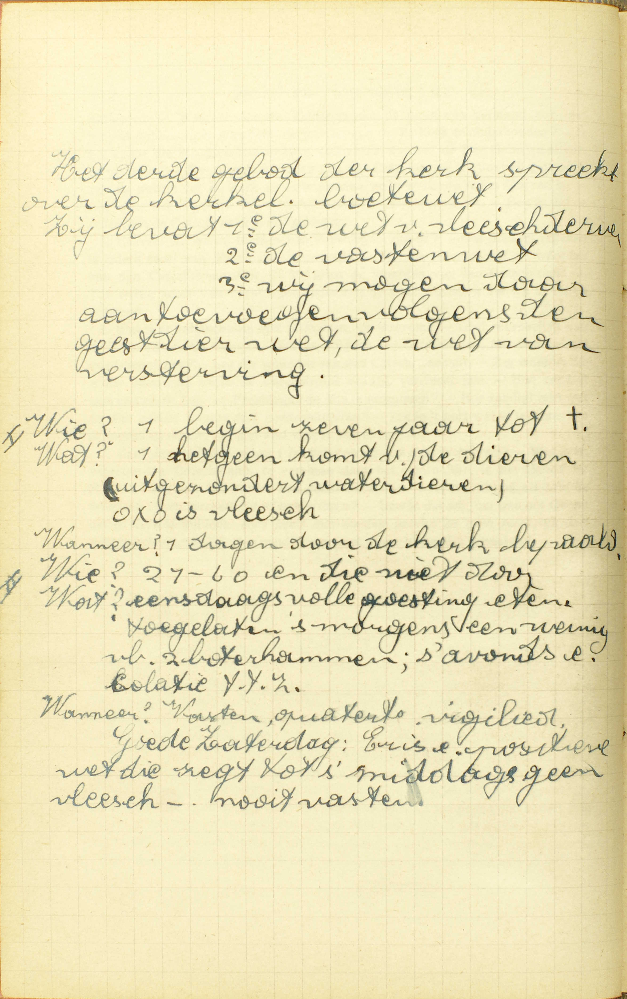
  <em>Het derde gebod van de kerk spreekt over de kerkelijke boetewet. Hij bevat 1ᵉ de wet van vlees derven, 2ᵉ de vastenwet, 3ᵉ wij mogen daaraan toevoegen volgens de geest van die wet, de wet van versterving. Wie? begin zeven jaar tot †. Wat? hetgeen komt van de dieren (uitgezonderd waterdieren). Oxo is vlees. Wanneer? dagen door de kerk bepaald. II. Wie? 21 – 60. Wat? eensdaags volle goesting eten. Toegelaten 's morgens een weinig, bv. 2 boterhammen, 's avonds een collatie. Wanneer? Vasten, quatertemperdagen, vigiliedagen, Goede Zaterdag: er is een positieve wet die zegt tot 's middags geen vlees – nooit vasten.</em>
  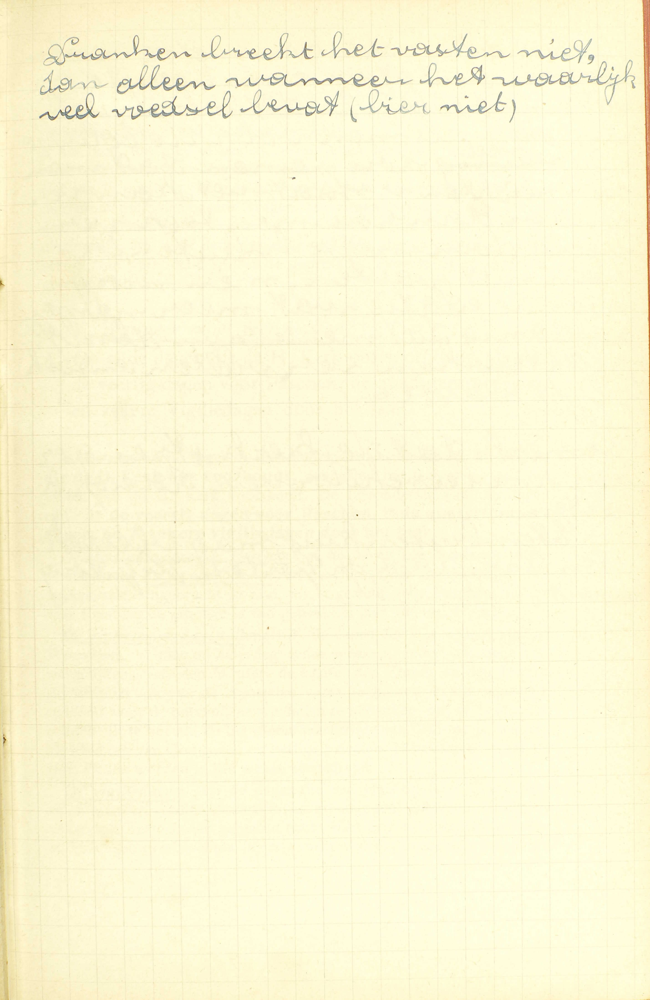
  <em>Dranken breekt het vasten niet, dan alleen wanneer het waarlijk veel voedsel bevat (bier niet).</em>

A. **Vasten** bestaat dus in deze *twee* dingen:

1° **Zich wachten van enige verboden spijs:** de spijzen, op de vastendagen (doch niet op alle) verboden, zijn:

a) *vlees* en al hetgeen van vlees voorkomt, zoals *vleessop* en *vet;* b) *eieren,* en c) *zuivel,* d. i. *melk* en al hetgeen van melk voortkomt, zoals *boter* en *kaas.*

*Volgens de algemene wetten van de H. Kerk* moet men geheel de Veertigdaagschen Vasten, zelfs des Zondags, hoewel men dan meermaals een maaltijd mag nemen, vlees, eieren en zuivel derven; maar de bisschoppen kunnen, door de macht hun van de Paus vergund, daarin dispenseren. In ieder bisdom worden jaarlijks de dispensatiën, die Zijne Hoogwaardigheid de Bisschop geeft, in de Vastenbul bepaald.

Op de vastendagen buiten de Veertigdaagschen Vasten, moet men zich, volgens de algemene wetten van de H Kerk, onthouden noch van zuivel noch van eieren, maar uitsluitend van vlees.

2° **En maar ééns daags een maaltijd nemen:** maar ééns daags eten; doch boven deze één maaltijd, die voorzeker een volledige mag zijn, mogen wij nog, naar de algemene bestaande gewoonte, 's morgens een stukje brood en 's avonds een geringe versterking (*collatie* genoemd) nemen. — Deze collatie mag geen tweede maaltijd uitmaken, maar wij mogen er die hoeveelheid spijs bij gebruiken, welke, ingezien de duur van de vasten, onze meerdere of mindere krachten en onze werkzaamheden, vereist is om ons het vasten mogelijk te maken, en te beletten dat wij er in onze gezondheid door gehinderd worden, In de collatie mag men in 't bisdom van Gent geen eieren gebruiken.

Die onthouding van enige spijzen en maaltijden is door de H. Kerk bevolen, opdat wij daardoor boetvaardigheid zouden doen, onze driften beteugelen, en de heiligheid bekomen.

# Wie zijn schuldig te vasten?

## Al degenen die tot hun jaren gekomen zijn, en door ziekte, weekheid of zwaren arbeid niet verontschuldigd zijn

A. *Twee* voorwaarden zijn vereist om te moeten vasten:

1° **Tot de jaren gekomen zijn:** wat het derven van verbodene spijzen betreft, daartoe is men gehouden, zoohaast men tot de jaren van verstand komt, hetwelk gewoonlijk geschiedt omtrent de ouderdom van zeven jaren. — Wat echter het onthouden aangaat van meer dan ééns daags een maaltijd te nemen, daartoe is men verplicht, na de volle ouderdom van 21 jaren bereikt te hebben.

De reden van dit verschil is, dat de laatste verplichting, vroeger opgelegd, de ontwikkeling van het lichaam zou kunnen beletten.

2° **En door ziekte, weekheid of zware arbeid niet verontschuldigd zijn:** door *ziekte* zijn verontschuldigd degenen die wezenlijk ziek zijn, of ten minste in gevaar zijn van ziek te worden; door *weekheid,* al de slappe of zwakke mensen, zoals ouderlingen, degenen die maar uit hun ziekte zijn opgestaan en allengskens hun krachten moeten herstellen, enz. — onder de week mogen ook de armen en noodwendigen gerekend worden, die honger lijden en maar te eten hehben wat zij ontvangen; — door *zwaren arbeid* zijn verontschuldigd al degenen, die een arbeid te verrichten hebben, waartoe zij met te vasten, niet bekwaam zouden zijn, b.v. de landbouwers, de timmerlieden, de bakkers, de ziekenoppassers, enz.

Men bemerke wel, dat deze redenen niet altijd van beide de delen van het vasten verontschuldigen: de ziekte en de weekheid verontschuldigen dikwijls van beide delen; maar de zware arbeid verontschuldigt gewoonlijk alleen van het tweede deel, namelijk, van maar ééns daags een maaltijd te nemen.

Als men, om niet te vasten, een reden heeft die wel gegrond, doch onvoldoende is om door zich zelve van het onderhouden van het Gebod te ontslaan, en men er nochtans begeert van ontslagen te zijn, dan moet men dispensatie vragen aan zijn pastoor of aan een daartoe gemachtigden biechtvader. — Men neme in acht, dat de dispensatie, om meer dan ééns daags te eten, die andere niet medebrengt, om verbodene spijsen tegebruiken. Deze moetafzonderlijk gevraagd worden.

# Wanneer moet men vasten?

## Op al de dagen die de H. Kerk ons voorhoudt, als zijn de veertig dagen vóór Pasen, de quatertemperdagen, en zekere vigiliedagen door het jaar

  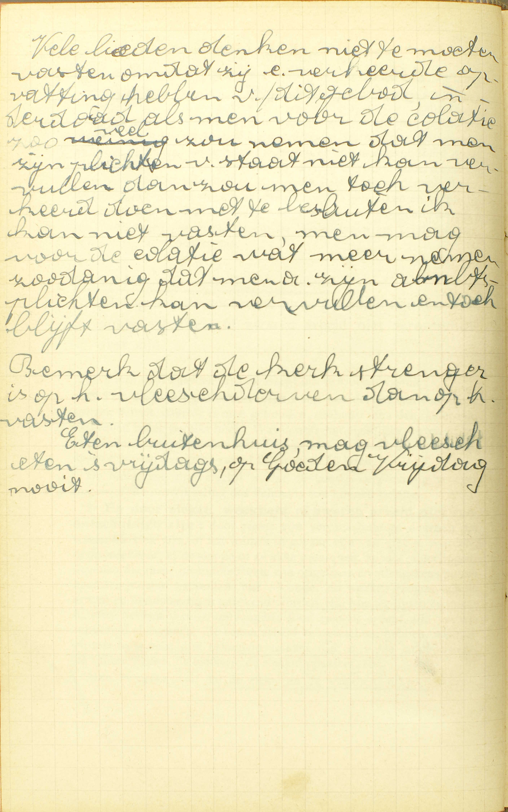
  <em>Vele lieden denken niet te moeten vasten omdat zij een verkeerde opvatting hebben van dit gebod, inderdaad als men voor de collatie zoveel zou nemen dat men zijn plichten van staat niet kan vervullen, dan zou men toch verkeerd doen met te besluiten 'ik kan niet vasten', men mag voor de collatie wat meer nemen, zodanig dat men zijn ambtsplichten kan vervullen en toch blijft vasten. Bemerk dat de kerk strenger is op het vleesderven dan op het vasten. Eten buitenhuis, mag vlees eten 's vrijdags, op Goede Vrijdag nooit.</em>

A. De algemene regel is, dat men moet vasten **op al de dagen die de H. Kerk ons voorhoudt,** aangezien het Gebod wegens het vasten van de H. Kerk voortkomt. De bijzonderste van die dagen zijn: 1° **de veertig dagen vóór Pasen,** 2° **de quatertemperdagen,** en 3° **zekere vigiliedagen door het jaar.**

*De veertig dagen vóór Pasen;* al de dagen (de Zondagen opzichtelijk het ééns daags een maaltijd te nemen uitgezonderd) van Aswoensdag tot aan Pasen. Deze Vasten schijnt van de Apostelen ingebracht te zijn, en is gesteld vóór Pasen, omdat deze Feestdag de grootste is van geheel het jaar ([9ᵉ les, 4ᵉ vr.](les-09.html#wanneer-is-christus-verrezen)).

*De quatertemperdagen,* (letterlijk, de dagen van de vier tijden) zijn de Woensdag, Vrijdag en Zaterdag van een week uit ieder van onze vier jaargetijden: van de Winter, de Lente, de Zomer en de Herfst. Zij schijnen ook van de Apostelen voort te komen, en zijn ingesteld, om God voor de ontvangene weldaden te bedanken, om de bedrevene zonden uit te boeten, en het nieuw jaargetijde aan God toe te wijden, alsmede om van God goede en heilige priesters te bekomen; want de HH. Orden worden in die weken toegediend.

*De vigiliedagen,* zijn de dagen die een plechtig feest voorafgaan, en zij worden vigilien (letterlijk, nachtwakingen) genoemd, omdat de gelovigen eertijds de helen nacht vóór de Feestdag in gebeden en lofzangen overbrachten. — In ons land zijn er maar vijf vigiliedagen waarop wij moeten vasten: namelijk de vigiliedagen van Pinksteren, van de plechtigheid van de HH. Apostelen Petrus en Paulus, van O. L. V. Hemelvaart, van Allerheiligen en van Kerstmis. Als de vigilie op een Zondag valt, dan wordt zij op de voorgaanden Zaterdag verplaatst. — De vigiliedagen zijn een bereiding tot de Feestdag.

Buiten deze vastendagen bestaat nog de H. Marcusdag en de drie Kruisdagen; doch in ons land moest men op die dagen niets anders dan vlees derven, en daarin zelfs wordt jaarlijks door Zijne Hoogw. de Bisschop gedispenseerd.

Verders gebiedt de H. Kerk ons nog, wekelijks twee dagen vlees te derven: namelijk, de Vrijdag ter herinnering van Christus’ dood, en de Zaterdag ter ere van de H. Maagd Maria. Nochtans in het gebod van des Zaterdags vlees te derven, wordt nu ook jaarlijks door Zijne Hoogw. de Bisschop aan al de gelovigen van het Bisdom dispensatie gegeven.

# Wat profijt doen wij met vasten?

## Wij bedwingen onze kwade lusten, verzoenen de goddelijke gramschap, en voldoen voor onze zonden

  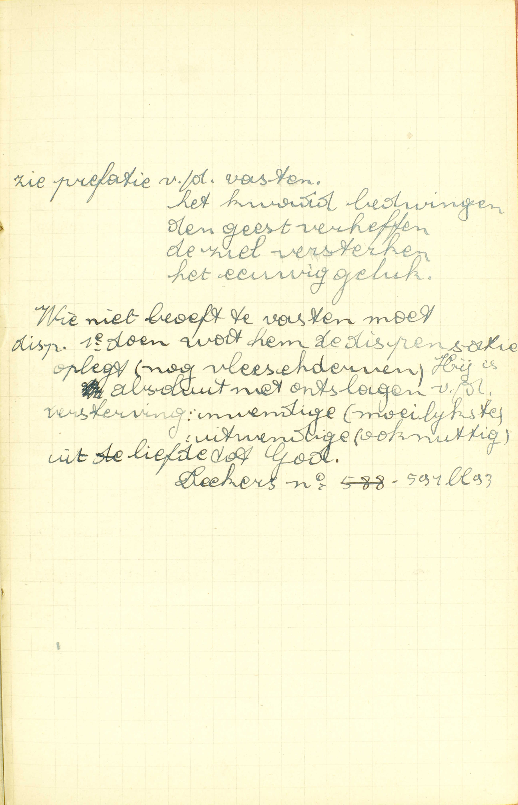
  <em>Zie prefatie van de vasten. Het kwaad bedwingen, de geest verheffen, de ziel versterken, het eeuwig geluk. Wie niet behoeft te vasten moet dispensatie. 1ᵉ doen wat hem de dispensatie oplegt (nog vlees derven). Hij is absoluut niet ontslagen van de versterving: inwendige (moeilijkste), uitwendige (ook nuttig) uit liefde tot God.</em>

A. Wij trekken uit het vasten een *driedubbel* profijt:

1° **Wij bedwingen onze kwade lusten:** wij beteugelen onze kwade neigingen, eerst en vooral, onze ongeregelde lichamelijke neigingen tot het eten en drinken en tot de onkuisheid; ook nog al de andere die in de geest hun zetel hebben, zoals de hoogmoedigheid, de ongehoorzaamheid, enz.; want door het vasten werken wij rechtstreeks onze slechte driften tegen.

2° **Wij verzoenen de goddelijke gramschap:** wij keren de wrekenden arm Gods van ons af, en bewegen zijn barmhartigheid, om ons vergiffenis te schenken, aangezien wij, door het vasten, ons zelf voor onze zonden straffen.

3° **Wij voldoen voor onze zonden:** wij boeten, door het vasten, die tijdelijke pijnen uit, welke wij, na de vergiffenis van onze zonden bekomen te hebben, nog schuldig blijven of hier op aarde of in het vagevuur te lijden; want het vasten is eene ware straf en uitboeting.

David, Tobias, Judith, Esther, Daniël, het joodse volk, de Ninivieten en de Machabeërs hebben, door het vasten, vergiffenis van de zonde en andere grote weldaden bekomen; Christus heeft zich tot zijn prediking door een veertigdaagschen vasten bereid; de Apostelen hebben gevast vooraleer zij hun gewichtigste bedieningen ondernamen.

# Aan wie zijn wij schuldig te biechten?

## Aan onze pastoor, of aan iemand, die van hem of van de bisschop of de Paus van Rome daartoe macht ontvangen heeft

  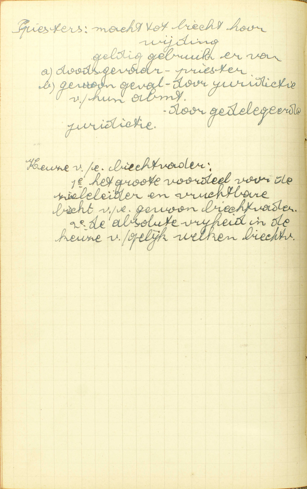
  <em>Priesters: macht tot biecht horen, wijding, geldig gebruik ervan. a) doodsgevaar - priester, b) gewoon geval - door jurisdictie van hun ambt, door gedelegeerde jurisdictie. Keuze van een biechtvader: 1ᵉ het grote voordeel voor de zieleleider en vruchtbare biecht van een gewoon biechtvader, 2ᵉ de absolute vrijheid in de keuze van gelijk welke biechtvader.</em>

V. **Aan wien:** aan welke priester, **zijn wij schuldig te biechten** volgens het Gebod van de H. Kerk, dat ons zegt: *gij zult uwen priester, ten minste ééns ’s jaars, uwe biecht spreken?*

A. Wij moeten biechten aan een van deze priesters: of **aan onze pastoor:** aan de pastoor van de parochie waarin wij wonen, of aan de bisschop van het bisdom waarvan wij deel maken, of aan de Paus van Rome, die alle drie uit hoofde van hun ambt, gelast zijn ons de middelen van zaligheid te bezorgen; — **of aan iemand:** aan een priester, **die van hem, of van de bisschop, of de Paus van Rome daartoe macht ontvangen heeft:** die macht heeft om onze biecht te horen, niet door zijn ambt, maar door de pastoor, of door de bisschop of door de Paus daartoe gedelegeerd of afgevaardigd is.

Wij mogen dan niet aan allen priester onze biecht spreken; want, niet door de macht alleen in de H. Wijding ontvangen, kan een priester geldig de absolutie geven; hij moet daarenboven nog wettig jurisdictie (letterlijk, rechtsmacht, macht om te oordelen) van de H. Kerk bekomen hebhen. Juist gelijk een burgerlijke rechter, om een geldig vonnis uit te spreken, ook eerst van de bevoegde overheid een gebied moet bekomen hebben, waar hij zijn macht mag uitoefenen. — Deze jurisdictie is tweeërlei: zij vloeit ofwel *uit het ambt,* waar iemand mee bekleed is: zo is het voor het ambt van pastoor, van bisschop of van Paus, dat oplegt de toevertrouwde gelovigen alle middelen van zaligheid te bezorgen en bijgevolg ook hun biecht te horen: deze jurisdictie wordt *gewone jurisdictie* genoemd; — ofwel zij komt voort uit een delegatie of afvaardiging die gedaan is door de Paus, de bisschop of de pastoor: 't is hetgeen men noemt *gedelegeerde jurisdictie.* Zo blijkt het, dat wij kunnen biechten óf 1° aan onze pastoor, onze bisschop of de Paus van Rome, óf 2° aan iemand die van de pastoor, van de bisschop of van de Paus macht daartoe ontvangen heeft.

Men bemerke dat, door een wederzijdsche toestemming van de kerkelijke oversten, al de biechtvaders macht hebben om de vreemdelingen te horen die bij hen in die plaats, waar zij jurisdictie hebben, te biechten komen; en dat, in gevaar van sterven, alle priester jurisdictie heeft.

Hier is ook aan te stippen, dat de pastoors hun macht van jurisdictie te delegeren aan andere priesters, niet meer te gebruiken hebben, sedert het Concilie van Trente vastgesteld heeft, dat de biechtvaders eerst moeten goedgekeurd worden door de bisschop van de plaats; want, sedert die tijd, wordt goedkeuring en jurisdictie samen door de bisschop gegeven.

# Hoe dikwijls moet men biechten?

## Als men in doodzonde gevallen is; hetwelk men niet langer mag uitstellen, als er gevaar is van te sterven; en, naar het Gebod van de H. Kerk, is het van node alle jaren ééns te biechten

  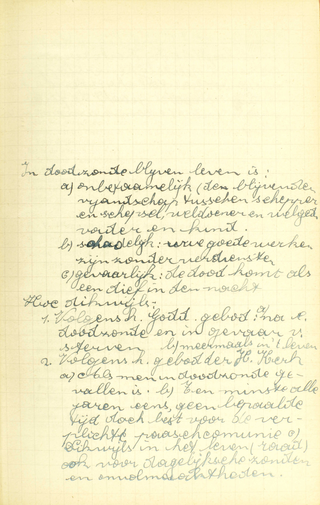
  <em>In doodzonde blijven leven is: a) onbetamelijk: het blijvende vijandschap tussen schepper en schepsel, weldoener en welged[ane], vader en kind; b) schadelijk: uw goede werken zijn zonder verdiensten; c) gevaarlijk: de dood komt als een dief in de nacht. Hoe dikwijls: 1. Volgens het Goddelijk gebod: a) na doodzonde en in gevaar van sterven, b) meermaals in 't leven. 2) Volgens het gebod van de heilige Kerk: a) als men in doodzonde gevallen is, b) ten minste alle jaren eens, geen bepaalde tijd, doch best voor de verplichte paascommunie, c) dikwijls in het leven (raad) ook voor dagelijkse zonden en onvolmaaktheden.</em>
  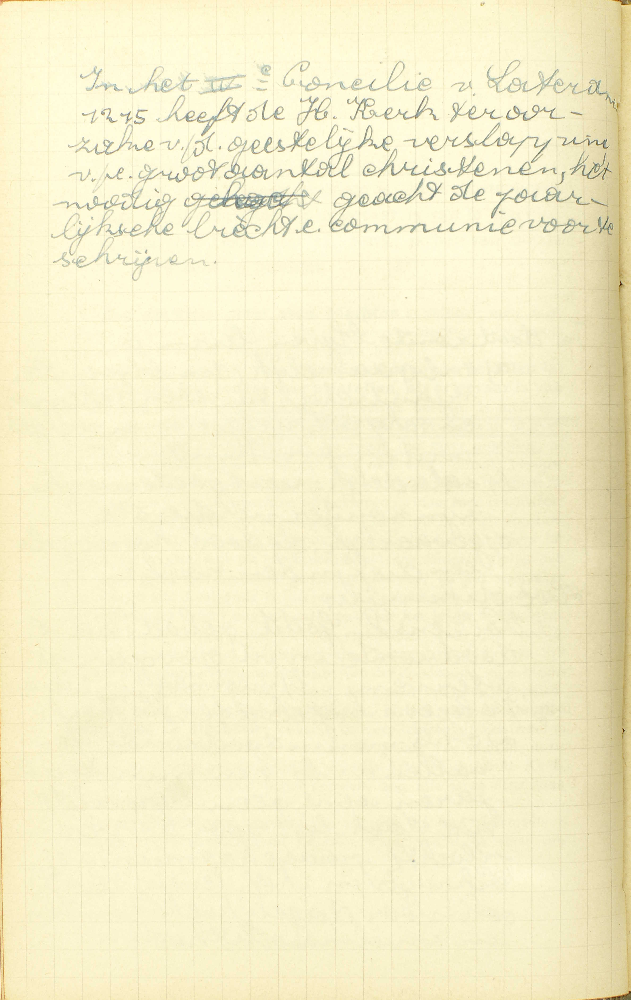
  <em>In het IVᵉ Concilie van Lateranen (1215) heeft de H. Kerk ter oorzake van de geestelijke verslapping van een groot aantal christenen, het nodig geacht de jaarlijkse biecht en communie voor te schrijven.</em>

V. **Hoe dikwijls moet men biechten:** voldoet men met, volgens het Gebod van de H. Kerk, alle jaren ééns te biechten, ofwel moet men dat nog in enige bijzondere gevallen doen?

A. Men moet biechten: 1° **als men in doodzonde gevallen is; hetwelk men niet langer mag uitstellen, als er gevaar is van te sterven:** na een doodzonde bedreven te hebben, is men verplicht, eens die zonde te biechten, en, als er gevaar van sterven ontstaat, mag men het biechten van die zonde niet meer uitstellen, of mag men dan niet zeggen: « ik zal een akte van volmaakt berouw verwekken met het vast voornemen van mijne zonde te biechten na mijne genezing, die ik misschien zal bekomen; » maar men is volstrekt verplicht in dat gevaar zelf te biechten. — Deze plicht vloeit voort uit het Goddelijk Gebod, door Christus gegeven, dat het Sacrament van de Biecht, als noodzakelijk uit noodzakelijkheid van het middel, oplegt aan alle gelovigen, die dodelijk gezondigd hebben, en dus voorzeker voorschrijft alle doodzonde te biechten, *ten minste vóór de dood.* Het legt hun zonder twijfel nog op, meermaals in het leven te biechten; want de Biecht is niet enkel voor de stervenden, maar ook voor de gezonden ingesteld, Het Goddelijk Gebod echter bepaalt geen tijd, of zegt niet wanneer men, na het bedrijven van de doodzonde, zijn biecht zou moeten spreken; daarom is de H. Kerk die tijd komen bepalen.

2° **En, naar het Gebod van de H. Kerk, is het van node alle jaren ééns te biechten;** behalve de verplichting, indien men in doodzonde gevallen is, van te biechten in gevaar van sterven, moet men, in doodzonde gevallen zijnde, volgens *het Gebod van de H. Kerk,* dat het Goddelijk Gebod komt bepalen, nog alle jaren ééns zijn biecht spreken.

Hieruit volgt dat men verplicht kan zijn, op één jaar meermaals te biechten: b.v. iemand komt, na zijn Paasbiecht, in staat van doodzonde en in gevaar van sterven: die is gehouden in dat gevaar wederom te biechten; hervalt hij hetzelfde jaar nogmaals in staat van doodzonde en in gevaar van sterven, hij moet een derde maal zijn biecht spreken.

De overtreding van het Goddelijk of het Kerkelijk Gebod nopens het biechten maakt een doodzonde uit, aangezien de zaak uit haar natuur zeer gewichtig is.

Men bemerke, dat de H. Kerk in haar Gehod niet zegt: *ééns ’s jaars,* maar *ten minste ééns ’s jaars,* om ons te doen verstaan, hoezeer zij begeert, dat wij meermaals ’s jaars dit heilzaam Sacrament ontvangen.

Voor de Jaarlijkse Biecht is er geen bepaalde tijd vastgesteld; doch het is de wens van de H. Kerk, en het is zeer natuurlijk, dat de gelovigen vóór hun Paaschcommunie biechten, want degenen, die in doodzonde zijn, moeten zich door de Biecht zuiveren, om aan de plicht van de Paaschcommunie te kunnen voldoen.

Dit Gebod verplicht al degenen die tot de jaren van verstand gekomen zijn.

# Wanneer moet men het lichaam des Heren nutten?

## Ten minste ééns ’s jaars, elk in zijn parochie, binnen de veertien dagen omtrent Pasen, te weten van Palmzondag tot Beloken Pasen

A. De Catechismus zegt in zijn antwoord: 1° *hoe dikwijls,* 2° *waar,* en 3° *op welke tijd* wij, volgens het Gebod van de H. Kerk, het lichaam des Heren moeten ontvangen,

1° *Hoe dikwijls?* — **Ten minste ééns 's jaars.** Hij zegt: *ten minste,* om uit te drukken hoe vurig de H. Kerk verlangt, dat wij meermaals in het jaar de H. Communie zouden ontvangen.

2° *Waar?* — **Elk in zijn parochie:** in de kerk van de parochie tot dewelke hij behoort. Men voldoet dus niet aan het Gebod van de H. Kerk met de voorgeschrevene Communie te ontvangen in een kerk of kapel die de eigen parochiekerk niet is, tenware men door onmogelijkheid verontschuldigd ware of van de bevoegde overheid daartoe oorlof hadde ontvangen.

3° *Op welke tijd?* — **Binnen de veertien dagen omtrent Pasen, te weten van Palmzondag** (medebegrepen) die acht dagen vóór Pasen valt, tot op de Zondag na Pasen die **Beloken** (gesloten) **Pasen** wordt genoemd, omdat de octaaf van Pasen er mee gesloten wordt. Nochtans kan de kerkelijke overheid die tijd verlengen, en de pastoor alsook de biechtvader kunnen, om een goede reden, aan iederen gelovige in ‘t bijzonder oorlof geven, om de Paaschcommunie langer uit te stellen.

ie belet is de Jaarlijkse Communie in zijn parochiekerk te doen, is daarom niet vrij van de Paaschplicht: het Gebod van ééns 's jaars de H. Communie te ontvangen blijft bestaan, alhoewel men het, onder opzicht van plaats, niet kan volbrengen. — Wie de H. Communie heeft ontvangen, maar verzuimd heeft dit in zijn parochiekerk te doen, blijft, volgens het gemeen gevoelen, tot het einde van het jaar toe verplicht in zijn parochiekerk te communiceren. — dusgelijks, wie belet is geweest of wie verzuimd heeft de Jaarlijkse Communie binnen de veertien dagen omtrent Pasen te doen, die is, volgens het gemeen gevoelen, verplicht, zoohaast mogelijk de H. Communie in zijn parochiekerk te ontvangen.

Om aan het Gebod van de H. Kerk te voldoen, is voorzeker een goede Communie vereist; bijgevolg, wie in de Paastijd op een heiligschendende wijze het lichaam des Heren genut heeft, moet, zoohaast mogelijk. zijn biecht spreken en een goede Communie doen; doch, heeft hij reeds de Communie ontvangen in zijn parochiekerk, dan voldoet hij met ze te ontvangen, onverschillig in welke kerk.

De H. Kerk wil dat de Jaarlijkse Communie in de parochiekerk geschiede, om de eenheid van de parochie te bevestigen en de pastoors de gelegenheid te geven van te zien of al hun gelovigen de Paaschplicht volbrengen. Zij heeft die Communie gesteld in de Paastijd, omdat Pasen de grootste feestdag is van het jaar.

Al de delen van dit Gebod van de H. Kerk verplichten ons op doodzonde, daar zij alle gewichtig zijn óf uit hun natuur, óf uit het einde waartoe zij dienen.

Men merke nog aan: 1° dat het Vijfde Gebod van de H. Kerk wederom niets anders is dan een nauwkeurige bepaling van het gebod van Cnristus, dat ons oplegt meermaals in het leven de H. Communie te nutten; — 2° dat wij, buiten de Jaarlijkse Communie, nog verplicht zijn het lichaam des Heren te nutten, als er gevaar is van sterven.

# Wat is er van node om wel te communiceren?

## Ten eerste, dat wij waarachtiglijk geloven, dat Christus daar tegenwoordig is; ten tweede, dat wij nuchter zijn en zuiver van zonden

  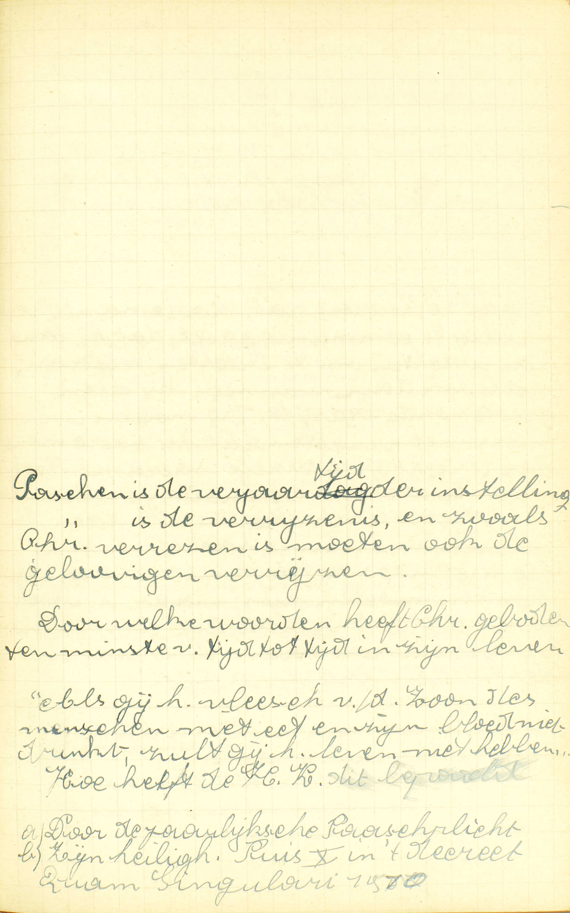
  <em>Pasen is de verjaartijd van de instelling. Pasen is de verrijzenis, en zoals Christus verrezen is, moeten ook de gelovigen verrijzen. Door welke woorden heeft Christus geboden ten minste van tijd tot tijd in zijn leven ... "Als gij het vlees van de Mensenzoon niet eet en zijn bloed niet drinkt, zult gij het leven niet hebben." Hoe heeft de H. Kerk dit bepaald: a) door de jaarlijkse paasplicht, b) zijne heiligheid Pius X in 't decreet *Quam Singulari*, 1910, heeft Christus' bevel verklaard in de zin van de veelvuldige en dagelijkse communie (niet als gebod, maar als een raad).</em>
  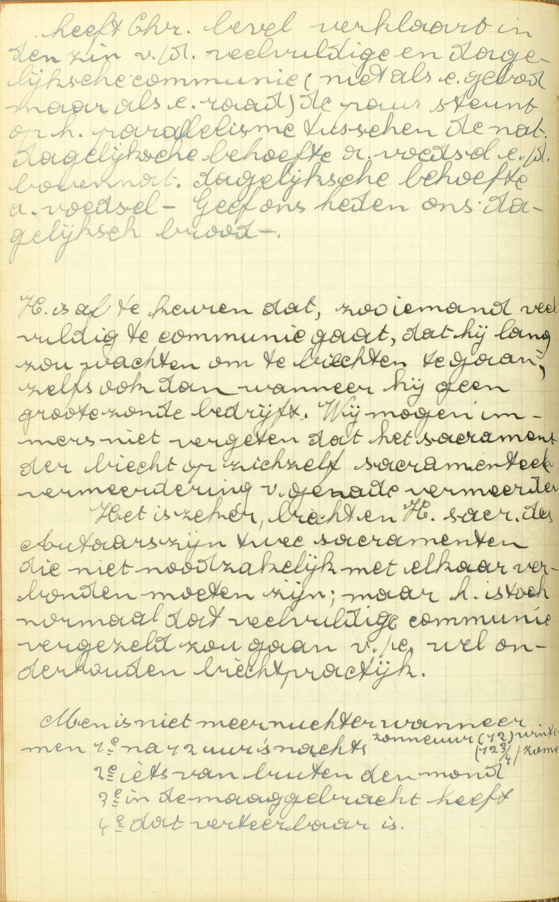
  <em>De paus steunt op het parallellisme tussen de natuurlijke dagelijkse behoefte aan voedsel en de bovennatuurlijke dagelijkse behoefte aan voedsel --- Geef ons heden ons dagelijks brood. Het is af te keuren dat, zo iemand veelvuldig te communie gaat, dat hij lang zou wachten om te biechten te gaan, zelfs ook dan wanneer hij geen grote zonde bedrijft. Wij mogen immers niet vergeten dat het sacrament van de biecht op zichzelf sacramenteel vermeerdering van genade is. Het is zeker, biecht en H. sacrament van het Altaar zijn twee sacramenten die niet noodzakelijk met elkaar verbonden moeten zijn, maar het is toch normaal dat veelvuldige communie vergezeld zou gaan van een wel onderhouden biechtpraktijk. Men is niet meer nuchter wanneer men 1ᵉ na 12 uur 's nachts (zonneuur: 12 winter, 12¾ zomer), 2ᵉ iets van buiten de mond, 3ᵉ in de maag gebracht heeft, 4ᵉ dat verteerbaar is.</em>

V. **Wat is er van node — om wel te communiceren:** om wel het lichaam des Heren te nutten, wat *communiceren* (letterlijk, in gemeenschap komen) genoemd wordt, omdat de gelovigen, met het lichaam des Heren te nutten, allernauwst met Christus en met elkander verbonden worden?

A. Om wel te communiceren is er van node:

**Ten eerste, dat wij waarachtiglijk geloven, dat Christus daar tegenwoordig is:** wij moeten de leer van de Katholieke Kerk kennen, die ons zegt dat Christus zelf, God en mens, met zijn ziel en zijn lichaam, in het H. Sacrament tegenwoordig is; en die leer, als zijnde het woord Gods, vast geloven, — Het is immers klaar, dat wij, om wel te communiceren, moeten weten wat de H. Communie is, en dat wij ze moeten erkennen, gelijk de leer van het Geloof ze ons voorstelt.

**Ten tweede, dat wij nuchter zijn:** sedert middernacht niets geëten of gedronken hebben. — Wij zeggen *geëten of gedronken hebben,* en niet, *iets doorgezwolgen hebben;* want het is maar het doorzwelgen van hetgene onder de naam van eten of drinken komt, dat wezenlijk ontnuchtert; indien men b.v. enig overblijfsel van spijs heeft doorgezwolgen, dat in de mond nog was, of enig water dat zich in 't spoelen van de mond met het speeksel vermengd heeft, of wat bloed dat uit de mond of uit het hoofd komt, of een weinig sneeuw die in de mond is gevlogen, daarom is men niet ontnuchterd. Maar men is dat, als men b.v. een weinig water heett gedronken, ’t zij dit vrijwillig of onvrijwillig geschied zij. — Het nuchter zijn is tot de H. Communie vereist door een Gebod van de H. Kerk, die daarin de eer, welke wij aan het H. Sacrament verschuldigd zijn, voor ogen heeft. Dit Gebod geldt niet voor degenen die de laatste HH. Sacramenten ontvangen, of die, na de berechting, gevaarlijk ziek blijvende, nog begeren de H. Communie te nutten. — **En zuiver zijn van zonden:** zuiver zijn ten minste van alle doodzonde; want het H. Sacrament des Altaars is een Sacrament van de levenden en moet daarom in staat van gratie ontvangen worden. Dan, hoe meer men ook van alle dagelijkse zonde en van alle aangekleefdheid daaraan zuiver is, hoe volkomener ook de vruchten van de Communie zullen wezen; want hoe beter onze gesteldheid is, hoe meer vrucht wij uit de Sacramenten trekken.

Degenen, die in staat van doodzonde zijn, voldoen niet aan de vereisten om de H. Communie te mogen ontvangen, met zich van deze zonde te zuiveren door een volmaakt berouw: volgens het Gebod van de H. Kerk, en misschien ook volgens het Gebod van Christus, moeten zij dat doen bij middel van het Sacrament van de Biecht.

# In wat ouderdom is men schuldig het Heilig Sacrament te ontvangen?

## Als men gekomen is tot de jaren van discretie of verstand

  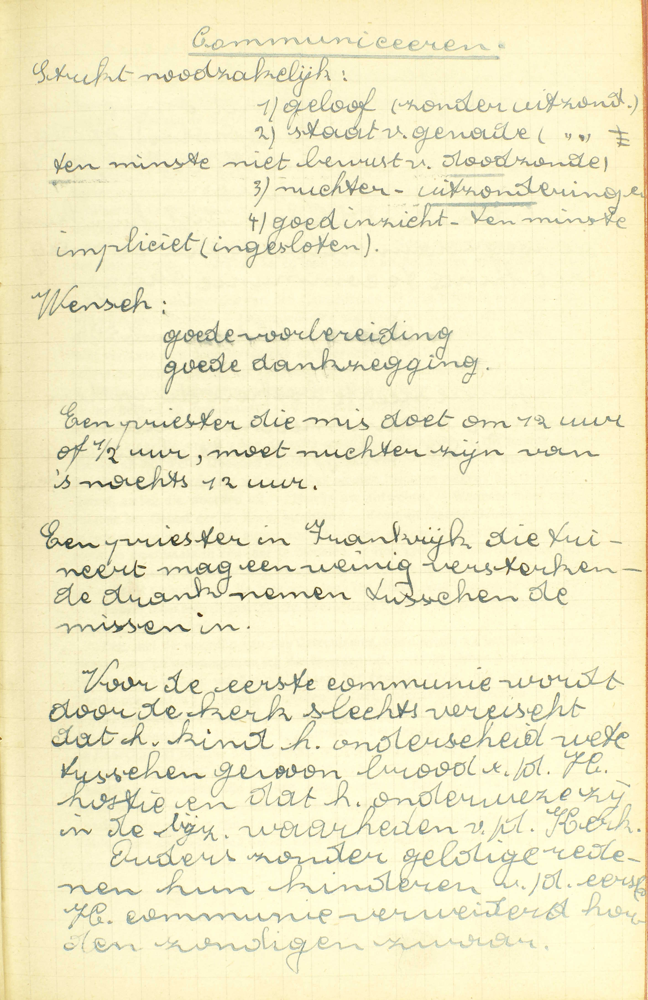
  <em>*Communiceren* Strikt noodzakelijke: 1) geloof (zonder uitzondering), 2) staat van genade (zonder uitzondering), ten minste niet bewust van doodzonde, 3) nuchter (uitzonderingen), 4) goed inzicht, ten minste impliciet (ingesloten). Wens: goede voorbereiding, goede dankzegging. Een priester die mis doet om 12 uur of ½ uur, moet nuchter zijn van 's nachts 12 uur. Een priester in Frankrijk die tuiniert, mag een weinig versterkende drank nemen tussen de missen in. Voor de eerste communie wordt door de kerk slechts vereist dat het kind het onderscheid weet tussen gewoon brood en de H. hostie en dat het onderwezen is in de bijzonderste waarheden van de Kerk. Ouders die zonder geldige reden hun kinderen van de eerste H. communie verwijderd houden, zondigen zwaar.</em>
  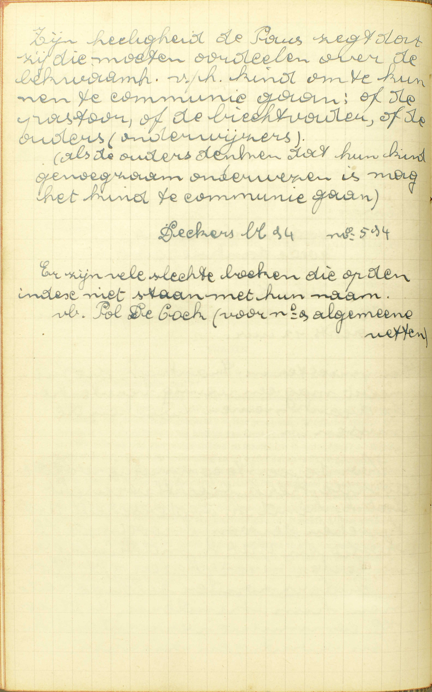
  <em>Zijne heiligheid de Paus zegt dat zij die moeten oordelen over de bekwaamheid van het kind om te kunnen te communie gaan: of de pastoor, of de biechtbader, of de ouders (onderwijzers). Als de ouders denken dat hun kind genoeg onderwezen is, mag het kind te communie gaan. Er zijn vele slechte boeken die op de index niet staan met hun naarm, b.v. Paul de Kock (voor nr. 9 algemene wetten).</em>

V. In wat ouderdom begint het Gebod van ééns 's jaars het lichaam des Heren te nutten, voor de gelovigen verplichtend te worden?

A. **Als men gekomen ís tot de jaren van discretie of verstand:** tot de jaren waarop men genoegzaam onderscheid kan maken tussen het nutten van het lichaam des Heren en het gebruiken van andere spijzen. — Deze ontwikkeling van het verstand bereikt men gewoonlijk niet vóór de tien jaar. Het behoort tot de geestelijke oversten te beslissen, of een kind genoegzame kennissen heeft om zijn Eerste Communie te mogen doen. — Men bemerke dat men geen genoegzame kennis nopens het zo verheven mysterie van het H. Sacrament des Altaars kan hebben, zonder tevens in geheel de Christelijke Leer wel onderwezen te zijn.

### VRAGEN

Welk is het voorwerp van deze les? — Hoe is zij verdeeld? — Wat onderzoekt de Catechismus nopens ieder deel?

1. In hoeveel verschillende dingen bestaat het vasten? — Noem ze met de woorden van de Catechismus. — Welke zijn de spijzen die, in ’t algemeen, op de vastendagen verboden worden? — Zeg welke spijzen, volgens de algemene wetten van de H. Kerk, verboden zijn gedurende de Veertigdaagschen Vasten. — Welke spijzen zijn verboden op de vastendagen buiten de Veertigdaagschen Vasten? — Wat betekenen de woorden: *maar ééns daags een maaltijd nemen?* — Welke verzachting is er, door een algemene gewoonte, aan deze regel gebracht? — Hoe groot mag de collatie zijn? — Wat spijs is er voor de collatie in het Bisdom van Gent verboden?
— Waarom heeft de H. Kerk geboden ons van enige spijzen en maaltijden te onthouden?

2. Hoeveel en welke vereisten moeten vervuld wezen, opdat men zou verplicht zijn te vasten? — Welke ouderdom is er vereist om tot geheel het vasten, of ten minste tot het derven van de verbodene spijzen verplicht te zijn? — Waarom verplicht de H. Kerk ons zoveel later tot geheel het vasten, dan tot het derven van de verbodene spijzen? — Wie is van het vasten verontschuldigd a) door ziekte, b) door weekheid, c) door zwaren arbeid? — Verontschuldigen deze redenen altijd van beide de delen die het vasten uitmaken? — Als men van het vasten begeert ontslagen te zijn, om een reden, die gegrond is, doch door zich zelve niet verontschuldigt, wat behoeft men te doen? — Als iemand door dispensatie meermaals daags mag eten, mag hij daarom ook verbodene spijzen gebruiken?

3. Op welke dagen moet men, volgens de algemenen regel, vasten, en waarom? — Welke zijn de bijzonderste vastendagen, die de H, Kerk ons voorhoudt? — Wat zijn de *veertig dagen vóór Pasen?* — Van waar komt deze Vasten voort, en waarum is hij gesteld vóór Pasen? — Welke is de letterlijke betekenis van het woord *quatertemperdagen?* — Wat zijn deze dagen? — Van wie zijn zij ingesteld, en waartoe dienen zij? — Wat zijn de *vigiliedagen,* en welk is de oorsprong van deze naam? — Hoeveel vigiliedagen zijn in ons land vastendagen? — Waartoe dienen deze dagen? — Welke vastendagen bestaan nog buiten deze, die de Catechismus hier noemt? — Waartoe is men op deze dagen in ons land verplicht? — Bestaat deze verplichting nog in het Bisdom van Gent? — Op welke dagen gebiedt de H. Kerk vlees te derven, en waarom? — Wat is er te bemerken voor het Bisdom van Gent nopens het derven van het vlees op de Zaterdagen?

4. Hoeveel profijten trekken wij uit het vasten? — Noem ze met de woorden van de Catechismus. — Verklaar ze, en toon hoe zij uit het vasten natuurlijk voortkomen.

5. Noem, met de woorden van de Catechismus, de verschillende priesters, aan wie wij mogen biechten. — Leg de woorden van de Catechismus uit. — Waarom mogen wij niet aan alle priesters zonder onderscheid onze biecht spreken? — Wat verstaat men door *jurisdictie* en hoevelerlei is zij? — Toon uit dit onderscheid van de jurisdictie, dat het antwoord van de Catechismus juist en volledig is. — Hebben de biechtvaders macht om de vreemdelingen de absolutie te geven, en hoe hebben zij deze macht? — Welke priesters hebben jurisdictie in stervensgevaar?

6. Verklaar de vraag: *hoe dikwijls moet men biechten?* — Uit hoofde van hoeveel en van welke Geboden moeten wij biechten? — Zeg, met de woorden van de Catechismus, wanneer wij voorzeker moeten biechten volgens het Goddelijk Gebod, en leg die woorden uit. — Bewijs uw antwoord. — Wanneer moet men, volgens het Gebod van de H. Kerk, biechten? — Komt dit laatste Gebod onder alle opzichten van de H. Kerk alleen voort? — Geef een geval, waarin iemand verplicht is meermaals in één jaar te biechten. — Hoe groot is de zonde van degenen, die het Goddelijk of het Kerkelijk Gebod nopens het biechten overtreden? — Wat geven in het Gebod van de H. Kerk de woorden: *ten minste ééns 's jaars,* te kennen? — Wanneer moet men de jaarlijkse Biecht doen? — Wie zijn door het Gebod van te biechten verplicht?

7. Zeg, met de woorden van de Catechismus, hoe dikwijls wij het lichaam des Heren moeten ontvangen, en leg die woorden uit. — Is dit Gebod enkel een *Kerkelijk* Gebod? — Wanneer moeten wij, buiten het gezegde geval, het lichaam des Heren nog nutten? — Waar moeten wij het, volgens de Catechismus, ééns 's jaars ontvangen? — Leg het antwoord uit. — Wanneer moeten wij het, volgens de Catechismus, ontvangen? — Leg wederom het antwoord uit. — Wie belet is de Paaschplicht in zijn parochiekerk te vervullen, moet hij dit jaar communiceren? — Wat blijft er van de Paaschplicht bestaan voor degenen, die met Pasen te communie zijn gegaan, maar verzuimd hebben dit te doen in de parochiekerk? — Wat voor dezulken die of gedurende de veertien dagen omtrent Pasen belet geweest zijn of verzuimd hebben de H. Communie te ontvangen? — Voldoet men aan het Gebod van de H. Kerk door een heiligschendende Communie? — Waartoe is men gehouden, als men de Paaschcommunie op een heiligschendende wijze ontvangen heeft? — Waarom gebiedt de H. Kerk, dat de Jaarlijkse Communie gedaan worde in de parochiekerk, en omtrent Pasen? — Op welke zonde verplicht ieder deel van het Gebod van de Paaschcommunie, en waarom?

8. Leg het woord *communiceren* uit. — Hoeveel en welke dingen vereist de Catechismus om wel te communiceren? — Wat betekenen de woorden: *dat wij waarachtiglijk geloven dat Christus daar tegenwoordig is,* en waarom is dit volkomen vereist tot een goede Communie? — Wat verstaat men hier door *nuchter zijn?* — Ontnuchtert ons al hetgeen wij doorzwelgen? — Verklaar het antwoord door enige voorbeelden, — Wie gebiedt ons nuchter te zijn om de H. Communie te ontvangen? — Waarom is dit Gebod gegeven? — Voor wie bestaat het Gebod niet van nuchter te zijn om de H. Communie te ontvangen? — Wat is er hier te verstaan door *zuiver zijn van zonden?* — Waarom moeten wij op de gezegde wijze zuiver zijn van zonden om de H. Communie te ontvangen? — Hoe moet men zich van de doodzonde zuiveren, om de H. Communie te ontvangen, en uit hoofde van welk Gebod is men daartoe verplicht?

9. Wat is er hier te verstaan door *de jaren van discretie of verstand?* — Omtrent welke ouderdom bereikt men de gezegde ontwikkeling van het verstand? — Wat is er vereist om een genoegzame kennis van het H. Sacrament des Altaars te hebben?

