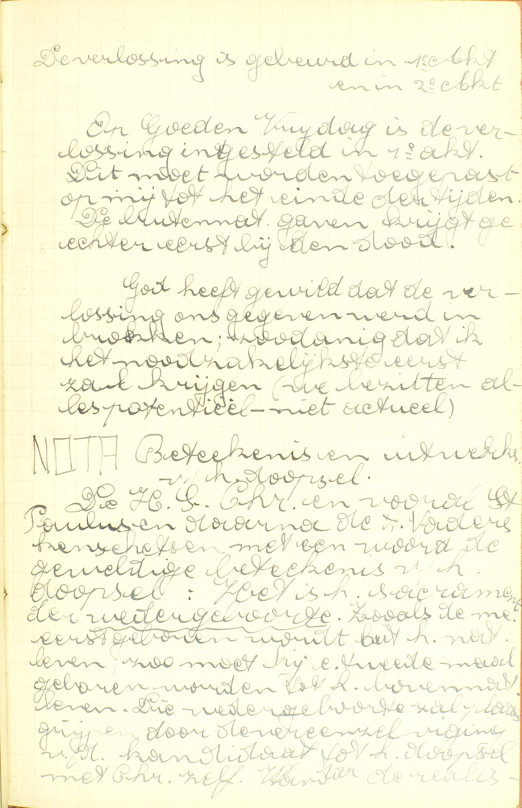

<table>
<tr>
  <td colspan=3>**Natuur**</td>
  <td class=accolade></td>
  <td>*[Wat is het Doopsel?](#wat-is-het-doopsel)*</td>
</tr>
<tr>
  <td rowspan=9>**Nadere bepaling van de natuur van het Doopsel**</td>
  <td rowspan=9 class=accolade></td>
  <td>Noodzakelijkheid</td>
  <td class=accolade></td>
  <td>*[Aan wie is het Doopsel nodig?](#aan-wie-is-het-doopsel-nodig)*</td>
</tr>
<tr>
  <td>Bedienaar</td>
  <td class=accolade></td>
  <td>*[Wien staat het toe te dopen](#wien-staat-het-toe-te-dopen)*</td>
</tr>
<tr>
  <td rowspan=2>Uitwendig teken</td>
  <td rowspan=2 class=accolade></td>
  <td>*[Waarmee moet men dopen?](#waarmee-moet-men-dopen)*</td>
</tr>
<tr>
  <td>*[Welke woorden moet men spreken in het Doopsel?](#welke-woorden-moet-men-spreken-in-het-doopsel)*</td>
</tr>
<tr>
  <td>Gebruik</td>
  <td class=accolade></td>
  <td>*[Mag men tweemaal gedoopt worden?](#mag-men-tweemaal-gedoopt-worden)*</td>
</tr>
<tr>
  <td>Bijzondere genade</td>
  <td class=accolade></td>
  <td>*[Wat krijgen wij door het doopsel?](#wat-krijgen-wij-door-het-doopsel)*</td>
</tr>
<tr>
  <td>Beletsels</td>
  <td class=accolade></td>
  <td>*[Wat bereiding is er van node tot het doopsel?](#wat-bereiding-is-er-van-node-tot-het-doopsel)*</td>
</tr>
<tr>
  <td rowspan=2>Ceremoniën</td>
  <td rowspan=2 class=accolade></td>
  <td>*[Welk is de plicht van peters of meters, die gebruikt worden in het doopsel, en ook in het vormsel?](#welk-is-de-plicht-van-peters-of-meters-die-gebruikt-worden-in-het-doopsel-en-ook-in-het-vormsel)*</td>
</tr>
<tr>
  <td>*[Waartoe dienen al de ceremoniën, die in het doopsel gebruikt worden?](#waartoe-dienen-al-de-ceremoniën-die-in-het-doopsel-gebruikt-worden)*</td>
</tr>
</table>

# Wat is het Doopsel?

## Het eerste en nodigste Sacrament, in hetwelk, door de uitwendige reiniging en de aanroeping van de H. Drievuldigheid, de mens gezuiverd wordt van alle zonden

  
  <em>Instelling van het Doopsel. 1) Doop van Johannes Baptista. 2) Doopsel van Jezus in de Jordaan; hier waarschijnlijk nog geen instelling van het sacrament. 3) Aankondiging door Jezus van de noodzakelijkheid van het doopselsacrment. 4) Het doopbevel; hier is de instelling reeds verondersteld. 5) De praktijk in de allereerste kerk: niets vervangt het doopsel; allen moeten gedoopt worden. Dit veronderstelt dus de instelling en uitdrukkelijk bevel van Christus.</em>

V. Waarin bestaat eigenlijk het Sacrament van het Doopsel?

A. Het antwoord doet kennen: 1° de plaats van het Doopsel onder de Sacramenten, 2° zijn uitwendig teken, 3° de bijzondere genade door dit teken betekend en gegeven.

1° De *plaats:* het Doopsel is a) **het eerste Sacrament:** het Sacrament dat vóór al de andere moet ontvangen worden, zodat wij niet een ander mogen, noch zelfs, volgens het algemeen gevoelen van de godgeleerden, kunnen ontvangen, zonder eerst het Doopsel *metterdaad* ontvangen te hebben. De reden hiervan is, dat wij door dit Sacrament tot het bovennatuurlijk leven van de genade geboren worden, en dat alle leven noodzakelijk met de geboorte begint. En, om de andere Sacramenten geldig te kunnen gebruiken, is het niet genoeg het leven van de genade door een volmaakt berouw te hebben verkregen; men moet het H. Sacrament van het Doopsel ontvangen hebben: Christus heeft het zo gewild, omdat zijn Kerk niet enkel een inwendige, maar nog een uitwendige vergadering is, waarom dan ook de leden er van, voor wie al de andere Sacramenten bestemd zijn, door een uitwendig teken in die Kerk moeten ingelijfd en van de ongelovigen onderscheiden worden. Daarenboven, ’t is door het merkteken van het Doopsel dat wij recht verkrijgen om van de andere Sacramenten gebruik te maken, en dat merkteken wordt alleen door het Sacrament van het Doopsel in de ziel geprent, daar slechts daar het ingestelde uitwendig teken te vinden is van hetwelk het inwendig merkteken afhangt. — b) **Het nodigste Sacrament:** het Sacrament dat, ten opzichte van onze zaligheid, nodiger is dan al de andere Sacramenten: zonder deze kan men wel, zonder het Doopsel kan men nooit tot de zaligheid geraken. ([2ᵉ v.](#aan-wie-is-het-doopsel-nodig))

2° *Het uitwendig teken:* **de uitwendige reiniging en de aanroeping van de H. Drievuldigheid** samengenomen. Deze reiniging is uit haar natuur dienstig om een zuivering te betekenen, en de woorden die de bedienaar er bij uitspreekt, duiden aan dat zij een zuivering *van de ziel* betekent ([4ᵉ](#waarmee-moet-men-dopen) en [5ᵉ v.](#welke-woorden-moet-men-spreken-in-het-doopsel)). — Van de uitwendige reiniging waar het ten dele uit bestaat, heeft het Doopsel zijn naam ontvangen: *dopen* wileigenlijk zeggen *in het water dompelen;* ook geschiedde, in het begin van de H. Kerk, de uitwendige reiniging met de dopeling in het water te dompelen.

3° *De bijzondere genade* door de uitwendige reiniging en de aanroeping van de H. Drievuldigheid betekend en gegeven, is de *zuivering van de ziel van de onreinheid van de zonden:* **de mens,** zegt de Catechismus, **wordt gezuiverd van alle zonden.** ([7ᵉ v](#wat-krijgen-wij-door-het-doopsel))

# Aan wie is het Doopsel nodig?

## Aan alle mensen, die de genade Gods willen bekomen, en tot de eeuwige zaligheid geraken

A. Het Doopsel is nodig **aan alle mensen** zonder uitzondering, **die de genade Gods:** die de vergiffenis van de erfzonde en van alle andere voorgaande zonden met de staat van heiligmakende genade **willen bekomen,** en zo, na in zulken staat gestorven te zijn, **tot de eeuwige zaligheid** of de hemel willen **geraken.**

Iedereen heeft dus het Doopsel volstrekt ter zaligheid nodig, doch moet het niet altijd *metterdaad* ontvangen: als zulks onmogelijk is, kan het Sacrament of het *Doopsel van water* vervangen worden door het *doopsel van begeerte* of door het *doopsel van bloed.* Het doopsel van begeerte bestaat in een volmaakte liefde tot God met de uitdrukkelijke of ingeslotene begeerte van het Sacrament van het Doopsel op bekwamen tijd te ontvangen. Het doopsel van bloed is de marteldood voor het Geloof of een andere christene deugd geleden, en gepaard, bij degenen die tot de jaren van verstand gekomen zijn, met ten minste een onvolmaakte liefde tot God.  Dus kunnen de kinderen die de jaren van verstand nog niet bereikt hebben, vergiffenis van de erfzonde bekomen door het Sacrament van het Doopsel en door de marteldood; de andere mensen, door dezelfde middelen en ook door het doopsel van begeerte. Men neme echter goed in acht dat het doopsel van begeerte noch het doopsel van bloed geenszins de dopeling ontslaat van later, bij gepaste gelegenheid, het Sacrament te ontvangen, daar het een noch het ander het merkteken van het Doopsel inprent, noch de dopeling uitwendig lid van de H. Kerk maakt; zij vervangen slechts het Sacrament voor wat het instorten van de heiligmakende genade betreft. De marteldood nochtans vergeeft ook, gelijk het Sacrament, alle tijdelijke pijnen.

# Wien staat het toe te dopen 

## ’t Is het ambt van de priester; in de nood nochtans mag iedereen dopen

V. Mag elkeen het Doopsel toedienen, ofwel behoort dit aan sommige bijzondere personen?

A. **'t Is het ambt van de priester:** de priester is de gewone bedienaar van het Doopsel, en hem alleen komt, buiten de nood, de bediening van dit Sacrament toe; — **in de nood nochtans:** als er gevaar is dat iemand zonder Doopsel zou sterven, moest men naar een priester wachten, — **mag iedereen dopen:** mag elkeen ‘t zij man of vrouw, 't zij gelovige of ongelovige het Doopsel bedienen, als hij maar het gebruik van zijn verstands heeft en kan doen wat ter zake vereist is: dat heeft Christus gewild, omdat het H. Doopsel het nodigste is van al de Sacramenten.

De Catechismus zegt: in de nood nochtans *mag,* en niet *kan* iedereen dopen, omdat elkeen in alle omstandigheden het Doopsel geldig *kan,* maar alleen in de nood wezenlijk *mag* toedienen.

# Waarmee moet men dopen?

## Met waarachtig en natuurlijk water, als met putwater, regenwater, fonteinwater, zeewater

V. Waarmee moet de reiniging in het Doopsel geschieden?

A. Zij moet geschieden **met water,** en dat water moet zijn 1° **waarachtig** d.i. echt; dus is speeksel en sap van planten en vruchten geen waarachtig water, daar deze stoffen enkel op water trekken; 2° **natuurlijk:** overal voor streng genomen water aanzien worden; bijgevolg is ongesmolten sneeuw en vast ijs, hoewel uit water samengesteld, toch geen natuurlijk water, daar geen van beide stoffen ergens onder de eigenlijken naam van water komt. Zulk waarachtig en natuurlijk water is **putwater, regenwater, fonteinwater, zeewater.**

De reiniging met *water* is tot de geldigheid van het Saecrament vereist; alleen in de nood mag men een twijfelachtige stof gebruiken, en dan moet men nadien, als het mogelijk is, op conditie herdopen.

De H. Kerk wijdt doopwater of, zo men zegt, wijdt de doopvont op Paas- en Pinksteravond. Nooit is het gebruik van zulk water nodig tot de geldigheid van het Doopsel, maar, volgens het gebod van de H. Kerk, is het verplichtend bij de plechtige bediening van dit Sacrament. In de nood behoort men dat water te gebruiken, als het mogelijk is.

# Welke woorden moet men spreken in het Doopsel?

## Deze (zonder dewelke het Doopsel van gener waarde zou zijn): Ik doop u in de naam van de Vader, en van de Zoon, en van de H. Geest

A. Die woorden zijn **deze (zonder dewelke het Doopsel van gener waarde zou zijn):** zonder dewelke het Doopsel geenszins zou bestaan of geen Sacrament van het Doopsel zou wezen, en bijgevolg zonder conditie zou moeten herhaald worden): **ik doop u in de naam van de Vader, en van de Zoon, en van de H. Geest.** Deze formule bevat 1° de werking van dopen: *ik doop u,* en 2° het verrichten van die werking onder het aanroepen van de h. drievuldigheid: *in de naam van de vader, en van de zoon, en van de h. geest* ([2ᵉ les, v. 7](les-02.html#hoe-belijden-wij-door-het-maken-van-het-heilig-kruis-de-menswording-van-christus)). zij bepaalt en voltrekt de betekenis van de reiniging, en maakt er zo het uitwendig teken van het doopsel mee uit. uit hoofde van dit verband moet de aanroeping van de h. drievuldigheid en de reiniging op één en dezelfde tijd en door één en dezelfde bedienaar geschieden.

# Mag men tweemaal gedoopt worden?

## Dit is ongeoorloofd, tenware op conditie, als men met reden twijfelt of men gedoopt zij

A. Iemand tweemaal dopen, **dat is ongeoorloofd:** dat is, streng verboden en dat maakt een heiligschenderij uit, daar het doopsel, om reden van het merkteken dat het in de ziel prent, maar ééns mag ontvangen worden, — **tenware op conditie:** ten ware het tweede doopsel slechts toegediend werd op voorwaarde dat men nog niet geldig gedoopt zij; want dan zou men geen tweemaal het doopsel ontvangen; is men immers al gedoopt, dan heeft de bedienaar de wil niet nog eens te dopen. Nu, men mag op conditie herdoopt worden, **als men met reden twijfelt of men gedoopt zij:** als men, niet uit een ongegronde vrees, maar om goede redens denkt, dat men misschien op gener wijze, of toch niet geldig gedoopt is.

# Wat krijgen wij door het doopsel?

## Vergiffenis van de erfzonde en van alle andere voorgaande zonden, en ook van de pijnen daartoe staande

  
  <em>De verlossing is gebeurd in 1ᵉ Akt en in 2ᵉ Akt. Op Goede Vrijdag is de verlossing ingesteld in 1ᵉ akt. Dit moet worden toegepast op mij tot het einde van de tijden. De buitennatuurlijke gaven krijgt ge echter eerst bi de dood. God heeft gewild dat de verlossing ons gegeven werd in brokken; zodanig dat ik het noodzakelijkste eerst zal krijgen (we bezitten alles potentieel, niet actueel). NOTA: Betekenis en uitwerking van het doopsel. De H. J. Christus en vooral St. Paulus en daarna de H. Vaders kenschetsen met een woord de geweldige betekenis van het doopsel: het is het sacrament van de *wedergeboorte.* Zoals de mens eerst geboren wordt uit het natuurlijk leven, zo moet hij een tweede maal geboren worden uit het bovennatuurlijk leven. Die wedergeboorte zal plaatsgrijpen door de vereenzelviging van de kandidaat tot het doopsel met Christus zelf.</em>
  
  <em>Vandaar de realistische uitdrukking in de H. Schrift "Dat de gedoopte mens Christus heeft aangetrokken (zoals kleren) en de oude mens heeft afgelegd". Die assimilatie heeft plaats in de doper. St. Paulus' brief aan de Romeinen, 6ᵉ hoofdstuk: Met Christus wordt de dopeling ondergedompeld, d.i. met Christus sterft hij en wordt begraven, met Christus staat hij terug recht in de doop, d.i. met Christus verrijst hij tot het leven van de genade. D.i. een beeld, doch een beeld dat uitwerkt wat het betekent. De dopeling is in Christus en met Christus herboren. Voortaan zal het lot van de Christen het lot zijn van Christus, zowel in het lijden als in de glorie. Die mystieke betekenis wordt samengevat: de gedoopte in zijn hoedanigheid als herboren in Christus. 1) Van hem wordt weggenomen wat Christus niet past: erfzonde. 2) Hem wordt geschonken en de mededeling van de genade van Christus: a) heiligmakende genade, b) bovennatuurlijke deugden, c) recht op dadelijke genade, d) merkteken: 1) christen zijn, 2) lid van de kerk, 3) bevoegdheid om [...]</em>

V. In het antwoord op de eerste vraag hebben wij geleerd, dat de mens door het doopsel gezuiverd wordt van alle zonden; hier nu vraagt de catechismus meer *specifiek,* welke de bijzondere genade van het doopsel is.

A. Door het doopsel krijgen wij:

1° **Vergiffenis van de erfzonde:** ([14ᵉ les, v. 2](les-14.html#door-wat-middel-wordt-ons-de-erfzonde-vergeven) en [37ᵉ, v. 5](todo)).

2° **En van alle andere voorgaande zonden:** van al de dadelijke zonden die wij, reeds tot de jaren van verstand gekomen, vóór ons doopsel zouden bedreven hebben; het doopsel is immers het eerste sacrament, en mag maar ééns ontvangen worden, waaruit volgt dat het uitsluitend de dadelijke zonden kan vergeven, waar de dopeling zich vóór zijn doopsel schuldig aan gemaakt heeft.

3° **En ook van de pijnen daartoe staande:** dus niet enkel van de eeuwige en van die tijdelijke pijnen, welke altijd vergeven worden met de zonde die ze verdiend heeft, maar ook van al de pijnen die men nog dikwijls, na de vergiffenis van de zonde, moet uitboeten. Christus heeft gewild dat het doopsel niet alleen al de zonden, maar ook al de pijnen zou vergeven, omdat de middel waardoor de mens tot het geestelijk leven herboren wordt, de kracht dient te hebben om dit leven ten volle te schenken. De gedoopten nochtans blijven aan de dood, de onwetendheid, de begeerlijkheid des vlees en de menigvuldige ellenden van de wereld onderworpen; doch, zijn al die kwalen bij hen nog *gevolgen* van de erfzonde, toch zijn het geen *pijnen* meer tot uitboeting dier zonde te lijden. Het doopsel neemt ze niet weg, 1° omdat de orde in de wereld onmogelijk zou wezen, stonden zij de ongedoopten alleen te wachten ; 2° omdat dikwijls de mensen zich anders uitsluitend zouden laten dopen, om van die kwalen verlost te zijn; 3° omdat de toestand waarin zij ons brengen, ons allerbest leert wat de zonde is, en gelegenheid geeft om veel verdiensten te verzamelen; 4° omdat het niet betaamde ons zonder enig lijden de hemel te geven, terwijl Christus, onze middelaar, voor ons zoveel heeft moeten lijden.

Tegelijk met de vergiffenis van de erfzonde en van de voorgaande zonden bekomen wij de *heiligmakende genade,* die er, in de bovennatuurlijke orde waar wij in leven, onafscheidbaar van is, alsook *het recht tot de dadelijke genaden* en *het merkteken* dat ons bekwaam maakt om de andere sacramenten te ontvangen.

Thans valt het niet moeilijk te bepalen waarin, onder opzicht van zijn uitwerksels het doopsel verschilt van de overige sacramenten: het verschilt van al de sacramenten van de levenden hierdoor, dat het rechtstreeks, niet de vermeerderiug van de heiligmakende genade, maar de vergiffenis van de zonden schenkt, en hierin komt het overeen met de biecht; het verschilt echter ook van dit laatste sacrament door de zonden die het vergeeft, en door de manier waarop het deze vergeeft: het doopsel verwerft ons vergiffenis van de erfzonde en van de dadelijke zonden die vóór het ontvangen van dit sacrament bedreven werden; de biecht integendeel, vergiffenis van de zonden die na het doopsel gedaan zijn. Het eerste sacrament vergeeft al de pijnen van de zonden en prent ook een merkteken in de ziel, terwijl het laatste niet altijd al de schuld van tijdelijke pijnen wegneemt, noch enig merkteken in de ziel prent.

# Welk is de plicht van peters of meters, die gebruikt worden in het doopsel, en ook in het vormsel?

## te zorgen dat degenen, die zij geheven, of tot het vormsel geleid hebben, onderwezen worden in hetgeen de zaligheid aangaat; immers als de ouders hun plicht niet zouden doen

V. **Peter** (vader) en **meter** (moeder) worden in het doopsel en het vormsel gebruikt, omdat wij door het eerste sacrament tot het geestelijk leven geboren, en door het andere tot de volwassenheid van dat leven gebracht worden, en daarbij dus geestelijke vaders en moeders behoren te hebben.

A. De plicht van peters en meters is, te bezorgen — **dat degenen die zij geheven of tot het vormsel geleid hebben:** dat degenen van wie zij peter of meter geworden zijn met ze, door het opleggen van de hand, boven de doopvont te houden, of ze tot de bedienaar van het vormsel te leiden, **onderwezen worden — in hetgeen de zaligheid aangaat:** in hetgene zij moeten weten of doen om zalig te worden; **immers als de ouders hun plicht niet zouden doen:** als de ouders hen in de zaken van de zaligheid niet genoeg zouden onderwijzen; in dit geval zijn de peters en de meters daartoe met zekerheid gehouden.

# Wat bereiding is er van node tot het doopsel?

## Die tot hun verstand gekomen zijn, moeten onderwezen zijn in het geloof, en leedwezen hebben van hun zonden

  
  <em>Hoe wordt de genade van het doopsel belet: 1ᵉ vanwege de doper: a) gebrekkig teken, b) de goede mening, c) onbekwaam, 2) vanwege de dopeling: a) de geveinsdheid, b) geen twee keer, c) ten dele: hij heeft geen genoegzaam berouw.</em>

V. Wat is er van node opdat de dopelingen het doopsel niet alleen geldig, maar met al zijn vruchten zouden ontvangen? — om dit sacrament geldig of met zijn merkteken te ontvangen, is er van de dopelingen slechts vereist, en nog maar van deze die tot hun verstand gekomen zijn, dat zij de wil hebben van gedoopt te worden.

A. De catechismus onderscheidt hier twee klassen van dopelingen: de een die nog niet, en de andere die reeds het gebruik huns verstands hebben, van de eerste is niets geëist, weshalve de kleine kinderen, al zijn zij onbekwaam zich enigszins te bereiden, toch al de vruchten van het sacrament verkrijgen. Maar **die tot hun verstand gekomen zijn** moeten niet alleen hun vier punten kennen, maar nog wel:

1° **Onderwezen zijn in het geloof** of de christelijke leer; door het doopsel immers worden zij leden van de H. Kerk en moeten bijgevolg, vooraleer dit sacrament te ontvangen met de plichten van die staat bekend zijn. In de nood nochtans is het genoeg hun de vier punten voor te stellen.

2° Ten minste een onvolmaakt **leedwezen hebben van hun** dodelijke en dagelijkse **zonden,** vermits geen dadelijke zonden zonder leedwezen kunnen vergeven worden. Van de erfzonde moeten zij geen waar berouw hebben, daar zij deze niet met hun eigenen wil hebben bedreven. Nochtans moet hun die zonde mishagen, omdat zij hen vijanden van god maakt en die heeft oneer aangedaan. Mishaagde hun de erfzonde niet, of hadden zij geen leedwezen over hun doodzonden, dan zouden zij geen vergiffenis, noch bijgevolg de heiligmakende genade bekomen. Hadden zij enkel geen genoegzaam leedwezen over hun dagelijkse zonden, zij zouden de heiligmakende genade ontvangen, maar die dagelijkse zonden waar zij aan vastgekleefd blijven, zouden hun niet vergeven worden, om dus door het doopsel gezuiverd te worden van alle zonden en schulden, en, in geval van sterven, de hemel rechtstreeks binnen te treden, moeten de dopelingen die tot de jaren van verstand gekomen zijn, leedwezen hebben over al hun zonden, zonder uitzondering.

# Waartoe dienen al de ceremoniën, die in het doopsel gebruikt worden?

## Tot onderwijzing en betoning van de kracht en uitwerking van het doopsel

A. Zij dienen **tot onderwijzing en betoning** (die onderwijzing geschiedt deels door betoning of zinnebeeldige voorstelling) **van de kracht en uitwerking van het doopsel:** de ceremoniën die het doopsel voorafgaan, betekenen er eigenlijk de kracht van, terwijl de andere die daarop volgen, er de uitwerksels van doen uitschijnen.

### Aanmerking

  
  <em>Het doopsel is de bron van onze geestelijke wedergeboorte, de inleiding tot het bovennatuurlijk leven, een leven dat als eindpunt moet hebben God kennen en beminnen zoals hij is in zichzelf; het is tenslotte een verbond met God. In het doopsel geven wij ons erewoord van trouw aan God en God belooft ons het eeuwig leven.</em>

het uitwendig teken van het doopsel, namelijk, de uitwendige reiniging en de aanroeping van de H. Drievuldigheid, leert ons dat het doopsel voor uitwerksel heeft de eerste en volledige vernieuwing van de mens van de staat van zonde tot. Het bovennatuurlijk leven van de genade, dat het bijgevolg de erfzonde, de voorgaande zonden en al de pijnen daartoe staande vergeeft, het leven van de genade in de ziel stort en daarin ook het merkteken van christen mens prent. Maar is het de geboorte in het geestelijk leven, dan is het ook het eerste en nodigste sacrament; maakt het een middel ter zaligheid uit, dan verplicht bet de gedoopten als christen mensen te leven, en daarom moeten de dopelingen die het gebruik huns verstands hebben, in het geloof onderwezen zijn; vergeeft het de zonden, zo moeten de dopelingen er leedwezen over hebben; en prent het in de ziel een eeuwig en altijddurend merkteken, dan mag het, tenware op conditie, niet meer dan ééns ontvangen worden.

### VRAGEN

Waarvan handelt deze les? — Geef in 't kort haar verdeling.

1. Zeg, met de woorden van de catechismus: a) welke plaats het doopsel onder de sacramenten bekleedt; b) uit welk uitwendig teken het bestaat; c) welk uitwerksel het heeft. — Leg die woorden uit.

2. Zeg, met de woorden van de catechismus: a) aan welke personen het doopsel nodig is, en 5) waartoe het hun nodig is. — Verklaar die woorden. — Moet men het doopsel altijd metterdaad ontvangen om de zaligheid te kunnen bekomen? — Welke middelen kunnen het doopsel soms vervangen? — Waarin bestaan zij? — Hoe noemt men deze middelen en waarom? — Vervangen zij ten volle het sacrament van het doopsel, en ontstaan zij van de plicht van het sacrament van het doopsel te ontvangen? — Geef rekenschap van het antwoord. — Welk bijzonder uitwerksel van het sacrament van het doopsel behoort ook aan de marteldood?

3. Wiens ambt is het 't doopsel te bedienen? — Verklaar deze uitdrukking: *het ambt van het doopsel te bedienen.* — Wie mag in de nood dopen? — Wat verstaat men hier door *nood?* — Waarom heeft Christus het recht van dopen niet aan de priesters alleen voorbehouden? — Waarom zegt de catechismus niet *kan iedereen dopen,* maar *mag iedereen dopen?* — Wie kan dus geldig dopen, en wie mag dopen? — Hoe blijkt Christus’ wijsheid in hetgeen hij vastgesteld heeft nopens de bedienaar van het doopsel in de nood?

4. Met welke stof moet men dopen? — Zeg, met de woorden van de catechismus, hoedanig deze stof moet zijn. — Verklaar deze woorden. — Welke voorbeelden geeft de catechismus van onbetwijfelbare goede stof tot het doopsel? — Geef voorbeelden van stoffen, die de hoedanigheid, door de catechismus vereist, niet bezitten. — Hoe heeft Christus zijn wijsheid getoond met de gezegde stof tot het uitwendig teken van het doopsel aan te nemen? — Mag men ooit met een twijfelachtige stof het doopsel toedienen? — Waarop moet men dan letten? — Wat heeft de h. kerk nopens het water van het doopsel ingesteld en geboden? — Geldt dit gebod ook in de nood?

5. Zeg de formule welke de bedienaar in het doopsel moet uitspreken. — Zeg, met de woorden van de catechismus, hoe deze formule tot het doopsel vereist is, en verklaar ze. — Wat vinden wij in deze formule? — Wanneer moet deze formule uitgesproken worden, waarom in die ogenblik en door wien?

6. Wat verstaat men door: herdoopt worden *op conditie?* — Mag men ooit zonder conditie herdoopt worden? — Geef er de reden van. — Mag men ooit op conditie herdoopt worden? — Zeg, met de woorden van de catechismus, wanneer dit mag geschieden en leg die woorden uit. — Breng dit antwoord overeen met de leer die zegt, dat het doopsel niet meermaals mag ontvangen worden.

7. Noem, met de woorden van de catechismus, de verschillende uitwerksels van het doopsel. — Leg ze uit. — Welke andere uitwerksels gaan met deze gepaard? — Hoe verschilt het doopsel, door die uitwerksels, van de sacramenten van de levenden en van het sacrament van de biecht? — Waarom betaamt het dat het doopsel al de pijnen van de zonden vergeve? — Neemt het doopsel ook al de gevolgen van de erfzonde weg? — Geef er de reden van.

8. Wat betekenen de woorden *peter* en *meter?* — Waarom worden zij gebruikt in het doopsel en in het vormsel? — Zeg, met de woorden van de catechismus, waartoe zij verplicht zijn, — Wat betekenen de woorden: die zij geheven of tot het vormsel geleid hebben? — Wanneer moeten zij deze plicht vervullen?

9. Geef de zin van de vraag: *wat bereiding is er van node tot het doopsel?* — Wat is er in de dopeling vereist om het doopsel geldig te ontvangen? — Welke klassen van personen zijn er te onderscheiden, als er spraak is van de vereiste bereiding tot het doopsel? — In wie is er tot dit sacrament bereiding nodig? — Zeg, met de woorden van de catechismus, welke bereiding er in hen nodig is, — Leg die woorden uit. — Geef de reden van die vereiste bereiding. — Wat is er in iemand, die tot de jaren van verstand gekomen is, vereist, opdat hij door het doopsel gans gezuiverd zou worden van alle zonden en schulden.

10. Waartoe dienen de *ceremoniën* ten opzichte van de kracht en de uitwerking van het doopsel? — Hoe onderwijzen zij ons nopens die kracht en uitwerking? — Welke ceremoniën onderwijzen ons nopens de kracht en welke nopens de uitwerking?

