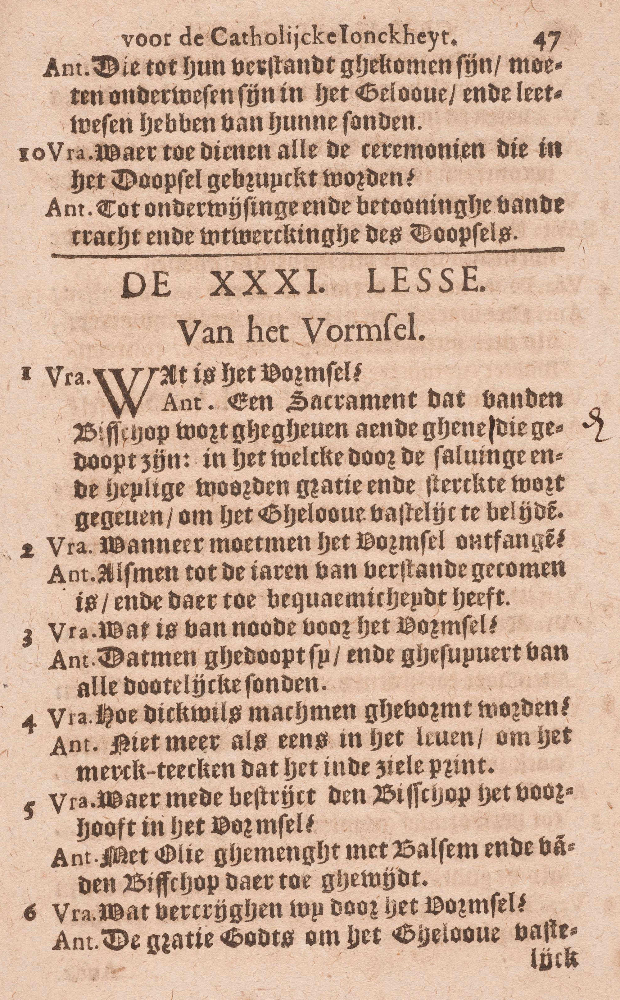
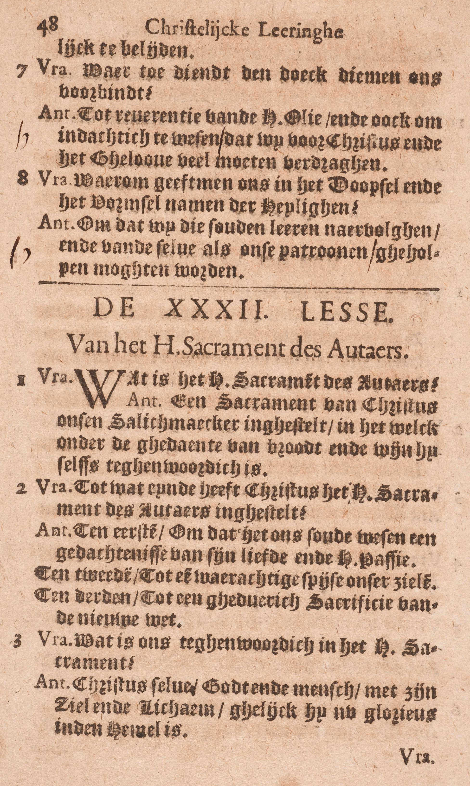
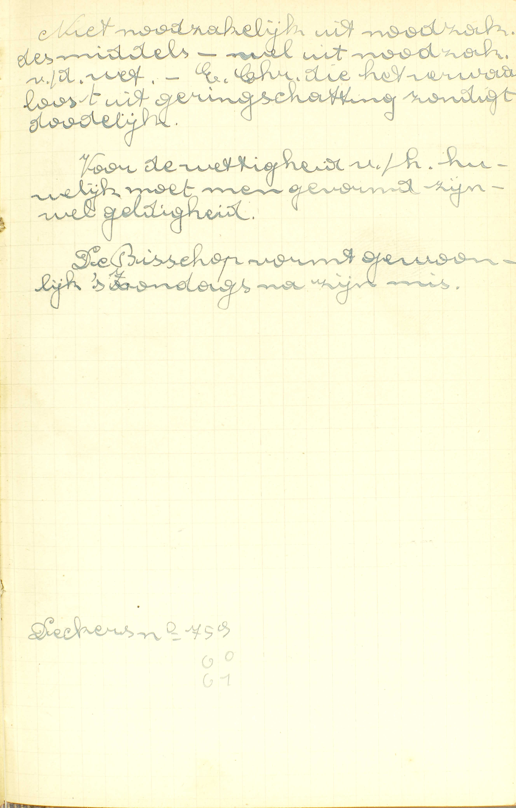

<table>
<tr>
  <td colspan=3>**Natuur**</td>
  <td class=accolade></td>
  <td>*[Wat is het vormsel?](#wat-is-het-vormsel)*</td>
</tr>
<tr>
  <td rowspan=7>**Natuur nader bepaald**</td>
  <td rowspan=7 class=accolade></td>
  <td rowspan=2>Gebruik</td>
  <td rowspan=2 class=accolade></td>
  <td>*[Wanneer moet men het Vormsel ontvangen?](#wanneer-moet-men-het-vormsel-ontvangen)*</td>
</tr>
<tr>
  <td>*[Hoe dikwijls mag men gevormd worden?](#hoe-dikwijls-mag-men-gevormd-worden)*</td>
</tr>
<tr>
  <td>Beletselen</td>
  <td class=accolade></td>
  <td>*[Wat is er van node tot het Vormsel?](#wat-is-er-van-node-tot-het-vormsel)*</td>
</tr>
<tr>
  <td>Uitwendig teken</td>
  <td class=accolade></td>
  <td>*[Waarmee bestrijkt de bisschop het voorhoofd in het vormsel?](#waarmee-bestrijkt-de-bisschop-het-voorhoofd-in-het-vormsel)*</td>
</tr>
<tr>
  <td>Uitwerksels</td>
  <td class=accolade></td>
  <td>*[Wat verkrijgen wij door het Vormsel?](#wat-verkrijgen-wij-door-het-vormsel)*</td>
</tr>
<tr>
  <td rowspan=2>Ceremoniën</td>
  <td rowspan=2 class=accolade></td>
  <td>*[Waartoe dient de doek, die men ons voorbindt?](#waartoe-dient-de-doek-die-men-ons-voorbindt)*</td>
</tr>
<tr>
  <td>*[Waarom geeft men ons in het Doopsel en in het Vormsel namen van Heiligen?](#waarom-geeft-men-ons-in-het-doopsel-en-in-het-vormsel-namen-van-heiligen)*</td>
</tr>
</table>

# Wat is het vormsel?

## Een sacrament, dat van de bisschop wordt gegeven aan degenen die gedoopt zijn, in hetwelk, door de zalving en de heilige woorden, genade en sterkte wordt gegeven om het geloof vast te belijden

  
  

A. Het antwoord leert ons kennen 1° de bedienaar van dit sacrament, 2° de personen voor wie het bestemd is, 3° zijn uitwendig teken en 4° zijn uitwerksel.

1° *De bedienaar:* het vormsel is **een sacrament dat van de bisschop wordt gegeven:** de bisschoppen zijn de gewone bedienaars van het vormsel; doch ook enkele priesters kunnen en mogen het toedienen, als zij van de paus daartoe gemachtigd zijn. Christus heeft gewild dat het een zo edele bedienaar had, eensdeels, om zijn mindere noodzakelijkheid, andersdeels om de gewichtigheid van zijn uitwerksel, namelijk, van de volwassenheid in het geestelijk leven, beter te doen uitschijnen.

2° *De personen voor wie het vormsel bestemd is:* het wordt gegeven **aan degenen die gedoopt zijn.** ([3ᵉ v.](#wat-is-er-van-node-tot-het-vormsel))

3° *Zijn uitwendig teken:* **de zalving** die de bisschop op het voorhoofd van de vormeling doet, **en de heilige woorden** die hij ondertussen uitspreekt, te weten: « Ik teken u met het teken des H. Kruis en vorm u met het Chrisma van de zaligheid. In de naam van de Vader, en van de Zoon, en van de H. Geest. » ([5ᵉ v.](#waarmee-bestrijkt-de-bisschop-het-voorhoofd-in-het-vormsel))

4° *Zijn uitwerksel:* **genade en sterkte om het Geloof vast te belijden.** *Genade* en *sterkte* zijn hier geen twee verschillende zaken: die woorden betekenen *versterkende genade* of genade die bijzondere sterkte geeft. ([6ᵉ v.](#wat-verkrijgen-wij-door-het-vormsel))

Het woord *vormsel* is zoveel als *vroomsel,* d.i. iets dat vroom, kloek of sterk maakt. Het Vormsel verdient deze naam, omdat het de mens die door het Doopsel in het geestelijk leven geboren is, tot de volwassenheid van dat leven brengt.

# Wanneer moet men het Vormsel ontvangen?

## Als men tot de jaren van verstand gekomen is, en daartoe bekwaamheid heeft

  
  <em>Niet noodzakelijk uit noodzaak van het middel, wel uit noodzaak van de wet. Een christen die het verwaarloost uit geringschatting, zondigt dodelijk. Voor de wettigheid van het huwelijk moet men gevormd zijn, wel geldigheid. De bisschop vormt gewoonlijk 's zondags na zijn mis.</em>

A. Men moet het Vormsel ontvangen als deze *twee* conditiën vervuld zijn:

1° **Als men tot de jaren van verstand gekomen is;** bijgevolg moet het niet, gelijk het Doopsel, aan de kleine kinderen gegeven worden;

2° **En daartoe — bekwaamheid heeft:** genoegzame kennis van het Geloof om dit Sacrament met veel vrucht te ontvangen.

Het Vormsel is niet nodig aan al de mensen die de genade Gods willen bekomen en tot de eeuwige zaligheid geraken, omdat het niet dient, gelijk het Doopsel, om ons het geestelijk leven te schenken, maar enkel om dat leven in ons te voltrekken. Kwam men het nochtans uit verachting of geringschatting te verzuimen, men zou voorzeker dodelijk zondigen.

# Wat is er van node tot het Vormsel?

## Dat men gedoopt zij, en gezuiverd van alle dodelijke zonden

V. Wat is er nodig om het Vormsel geldig en met vrucht te ontvangen?

A. Daartoe zijn *twee* dingen nodig:

1° **Dat men gedoopt zij;** zonder dat is men onbekwaam het te ontvangen; want het Doopsel is het eerste Sacrament.

2° **En gezuiverd van alle dodelijke zonden;** want het Vormsel is een Sacrament van de levenden, en moet bijgevolg in staat van genade ontvangen worden.

# Hoe dikwijls mag men gevormd worden?

## Niet meer dan ééns in het leven, om het merkteken, dat het in de ziel prent

A. Zie [29ᵉ les, 7ᵉ vr.](les-29.html#mogen-alle-sacramenten-dikwijls-ontvangen-worden)

# Waarmee bestrijkt de bisschop het voorhoofd in het vormsel?

## Met olie gemengeld met balsem en van de bisschop daartoe gewijd

V. Met welke stof geschiedt de zalving die tot het uitwendig teken des Vormsels behoort?

A. Zij geschiedt — **met olie:** met olijfolie, want gewoonlijk wordt deze alleen in de H. Schrift en in de kerkelijke boeken onder de naam van *olie* begrepen. Deze olie echter moet twee hoedanigheden hebben: 1° **gemengeld zijn met balsem,** die een welriekende stof is; 2° **van de bisschop daartoe gewijd** zijn, en dan krijgt zij de naam van *Chrisma* (zalf bij uitnemendheid).

# Wat verkrijgen wij door het Vormsel?

## De genade Gods om het Geloof vast te belijden

V. Welke bijzondere genade verkrijgen wij door het Vormsel?

A. Wij verkrijgen — **de genade Gods:** vermeerdering van de heiligmakende genade, recht tot de dadelijke, en een eeuwig en altijddurend merkteken, uitwerksels die allen ons bijzonder bekwaam maken — **om het Geloof vast te belijden:** om, zonder aarzelen of twijfelen, in weerwil van alle bekoringen het Geloof inwendig te bewaren en er onze begeerten naar te schikken, uitwendig door woorden en werken te belijden, en zo een volmaakt christelijk leven te leiden. Het Vormsel dus maakt ons volwassen Christenen, zodat er tussen een persoon die enkel gedoopt, en een anderen die ook gevormd is, hetzelfde verschil bestaat als tussen een kind en een volwassen mens.

Het uitwendig teken des Vormsels drukt er duidelijk de bijzondere genade van uit; immers wat 1° de *zalving* betreft, zij geschiedt met olie gemengeld met balsem, twee stoffen waarvan de eerste, uit hoofde van haar helende en versterkende kracht, ongetwijfeld dienstig is om de bekomene volwassenheid van het geestelijk leven te betekenen; en de laatste, wegens haar voorbehoudende kracht en haar aangenamen geur, allerbest doet uitschijnen hoe de genade des Vormsels ons tegen de zonde bevrijdt, en ons bekwaam maakt om voorbeelden te geven van alle deugden. Verder treft men in de omstandigheid, dat de olie gemengeld met balsem door de bisschop gewijd is en ook dat dit Sacrament door hem bediend wordt, een klaar teken aan van de verhevene uitwerksels van het Vormsel. Wat nu 2° de *heilige woorden* aangaat, deze vooral: « *Ik vorm u,* » ik versterk, ik bevestig u, leren ons meer specifiek de bijzondere genade kennen die door de zalving wordt aangeduid.

# Waartoe dient de doek, die men ons voorbindt?

## Tot eerbiedigheid voor de heilige olie, en ook om indachtig te wezen, dat wij voor Christus en het Geloof veel moeten verdragen

V. Waartoe dient de doek die men de vormelingen om het voorhoofd bindt als zij reeds gezalfd zijn?

A. Hij dient tot een *dubbel* einde:

1° **Tot eerbiedigheid voor de heilige olie:** opdat de gewijde olie op geen onbetamelijke wijze zou aangeraakt of afgevaagd worden;

2° **Om indachtig te wezen dat wij voor Christus en het Geloof veel moeten verdragen:** om de vormeling te herinneren dat hij allen smaad en schaamte moet willen lijden om Christus getrouw te blijven en diens leer, door woorden en werken, tot de dood toe te belijden.

Heden bestaat deze ceremonie niet meer, en in haar dubbel einde is volgender wijze voorzien: terstond na de zalving droogt een priester, bij middel van wat brood en wat boomwol of watte, de heilige olie af‚ en de bisschop geeft de vormeling een zachten kaakslag, zeggende: « *Vrede zij met u.* »

# Waarom geeft men ons in het Doopsel en in het Vormsel namen van Heiligen?

## Opdat wij die zouden leren navolgen, en van dezelve als onze patronen geholpen mogen worden

A. Dit wordt gedaan om *twee* redenen:

1° **Opdat wij die zouden leren navolgen:** hiertoe is het zeer dienstig, want zo houdt de H. Kerk ons bijzondere voorbeelden voor, die wij met meer genegenheid zullen zoeken te kennen en te benuttigen. Dan, als wij ons met de namen van Heiligen zullen horen noemen. dan zullen wij ons dikwijls hun voorbeelden herinneren, en er door opgewekt worden om ons leven naar het hun te schikken.

2° **Opdat wij van dezelve als onze patronen geholpen mogen worden:** immers de H. Kerk bidt door haar bedienaar, opdat wij de bijzondere bescherming mogen bekomen van de Heiligen wier namen wij in het Doopsel of in het Vormsel gekregen hebben.

In het Vormsel legt de bisschop gewoonljk geen nieuwe namen. maar opnieuw de namen van het Doopsel op.

### Aanmerking

Het uitwendig teken van het Vormsel, namelijk, de zalving met het Chrisma en de heilige woorden van de bisschop, geeft duidelijk te kennen dat dit Sacrament de mens van intredend lid tot volwassen lid van de H. Kerk maakt, of hem tot de volwassenheid brengt in het leven van de genade; dat het bijgevolg te die einde de heiligmakende genade en het recht tot de dadelijke vermeerdert en volmaakt, en daarenboven het merkteken van volwassen lid van de H. Kerk in de ziel prent. Daarom moet de vormeling gedoopt en zo reeds intredend lid van de H. Kerk zijn, alsook de genade Gods al bezitten; want daar alleen kan het geestelijk leven voltrokken worden, waar het alreede bestaat. Om diezelfde reden, namelijk, om de bijzondere uitwerksels van het Vormsel, mag men het nooit meer dan ééns, maar moet men het eens ontvangen, als men tot de jaren van verstand gekomen is, en daartoe bekwaamheid heeft.

### VRAGEN

Waarvan spreekt deze les? — Hoe wordt zij verdeeld? — Zeg in 't kort wat ieder deel bevat.

1. Zeg, met de woorden van de Catechismus: a) wie de bedienaar van dit Sacrament is, b) voor wie het bestemd is, c) welk er het uitwendig teken van is, en d) welke er de uitwerksels van zijn. — Leg dit alles in ’t kort uit. — Geef rekenschap over de bijzonderen bedienaar des Vormsels. — Verklaar het woord *Vormsel.*

2. Hoeveel conditiën zijn er vereist om het Vormsel te moeten ontvangen? — Stel ze voor met de woorden van de Catechismus, en verklaar deze woorden. — Is het Vormsel zo nodig ter zaligheid als het Doopsel? — Geef daar de reden van. — Wanneer zondigt men voorzeker dodelijk met het Vormsel te verzuimen?

3. Geef de zin van de vraag: *wat is er van node tot het Vormsel?* — Hoeveel en welke dingen zijn, volgens de Catechismus, daartoe vereist? — Geef rekenschap van deze vereiste voorwaarden.

4. Mag men meer dan ééns gevormd worden? — Welke is de reden daarvan?

5. Zeg, met de Catechismus, met welke stof de zalving in het Vormsel geschiedt, en hoedanig deze stof moet zijn. — Leg dit alles uit, — Hoe wordt die stof genoemd?

6. Hoe stelt de Catechismus ons de bijzondere genade des Vormsels voor? — Wat is er hier te verstaan door *de genade Gods?* — Wat betekenen de woorden: *om het Geloof vast te belijden?* — Welk verschil bestaat er dan tussen iemand die enkel gedoopt en iemand die ook gevormd is? — Toon hoe het uitwendig teken des Vormsels geheel deze bijzondere genade betekent.

7. Zeg, met de woorden van de Catechismus, om welke redenen de H. Kerk de ceremonie heeft ingesteld van, na de zalving, een doek om het voorhoofd des vormelings te bìnden. — Leg deze woorden uit. — Bestaat deze ceremonie nog? — Hoe is nu voorzien in het einde, waartoe zij ingesteld geweest is?

8. Zeg, met de woorden van de Catechismus, om welke redenen in het Doopsel en in het Vormsel namen van Heiligen gegeven worden. — Bewijs dat die redenen geldig zijn. — Worden in het Vormsel andere namen gegeven dan in het Doopsel?

