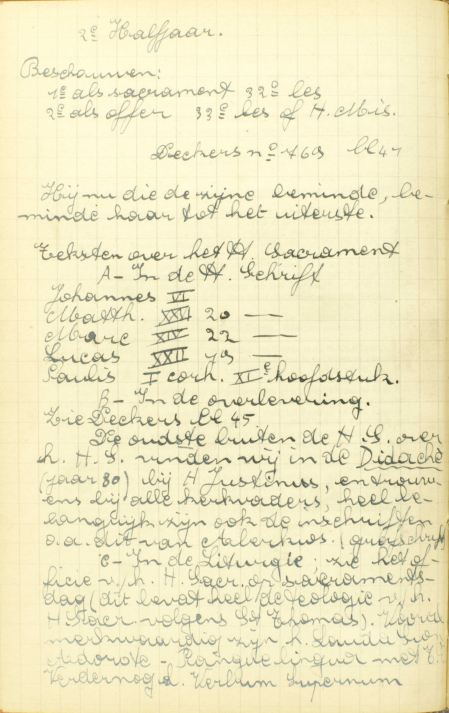
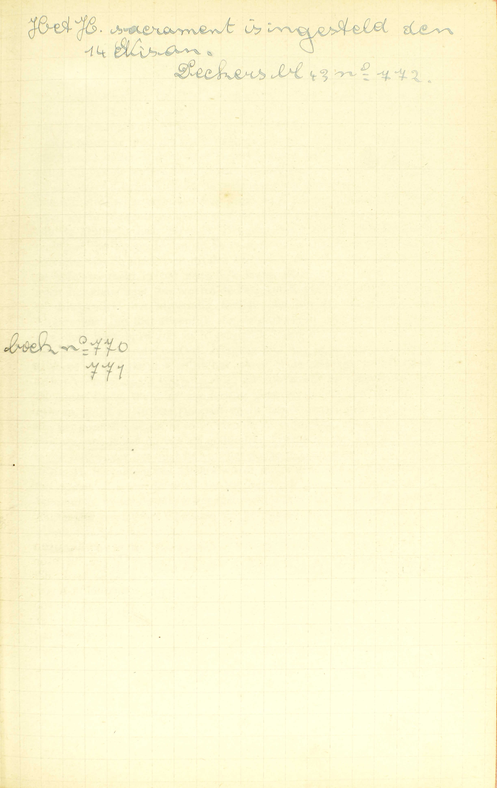
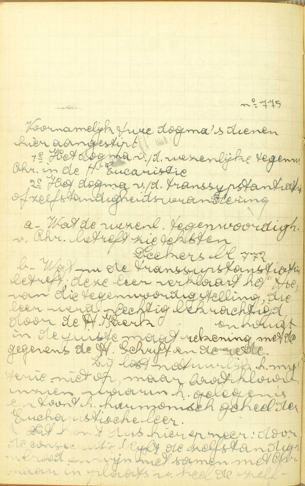
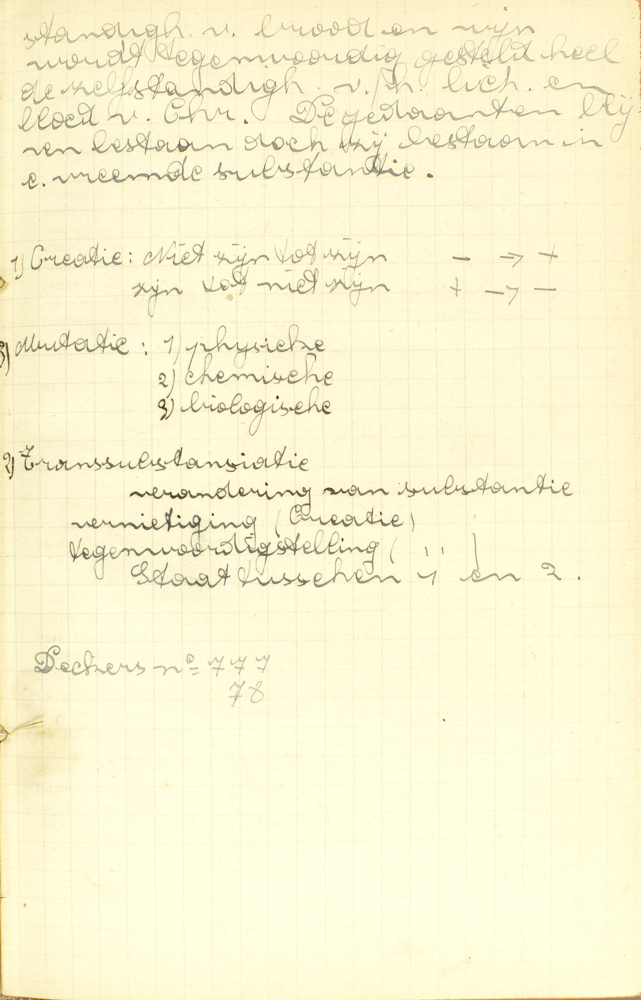
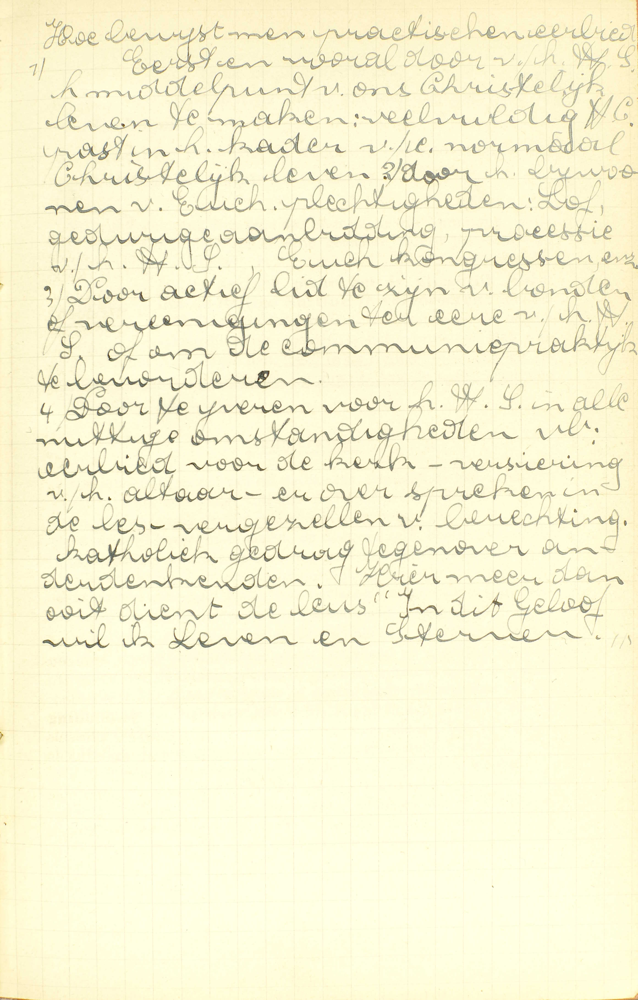

<table>
<tr>
  <td colspan=3>**Natuur**</td>
  <td class=accolade></td>
  <td>*[Wat is het Heilig Sacrament des Altaars?](#wat-is-het-heilig-sacrament-des-altaars)*</td>
</tr>
<tr>
  <td rowspan=7>**Natuur nader bepaald**</td>
  <td rowspan=7 class=accolade></td>
  <td>Instelling</td>
  <td class=accolade></td>
  <td>*[Tot wat einde heeft Christus het Heilig Sacrament des Altaars ingesteld?](#tot-wat-einde-heeft-christus-het-heilig-sacrament-des-altaars-ingesteld)*</td>
</tr>
<tr>
  <td rowspan=3>Christus' tegenwoordigheid in dit Sacrament</td>
  <td rowspan=3 class=accolade></td>
  <td>*[Wat is er ons tegenwoordig in het Heilig Sacrament?](#wat-is-er-ons-tegenwoordig-in-het-heilig-sacrament)*</td>
</tr>
<tr>
  <td>*[Hoe wordt ons Christus tegenwoordig gesteld in het Heilig Sacrament?](#hoe-wordt-ons-christus-tegenwoordig-gesteld-in-het-heilig-sacrament)*</td>
</tr>
<tr>
  <td>*[Onder welk deel van de Heilige Hostie is Christus, als die gebroken wordt?](#onder-welk-deel-van-de-heilige-hostie-is-christus-als-die-gebroken-wordt)*</td>
</tr>
<tr>
  <td rowspan=2>Gebruik en verering van dit Sacrament</td>
  <td rowspan=2 class=accolade></td>
  <td>*[Moeten alle mensen Christus ontvangen onder één gedaante of onder allebei de gedaanten?](#moeten-alle-mensen-christus-ontvangen-onder-één-gedaante-of-onder-allebei-de-gedaanten)*</td>
</tr>
<tr>
  <td>*[Wat eer zijn wij het Heilig Sacrament schuldig?](#wat-eer-zijn-wij-het-heilig-sacrament-schuldig)*</td>
</tr>
<tr>
  <td>Ceremoniën</td>
  <td class=accolade></td>
  <td>*[Is het ook Christus’ bloed dat men ons geeft na de Heilige Communie?](#is-het-ook-christus-bloed-dat-men-ons-geeft-na-de-heilige-communie)*</td>
</tr>
</table>

# Wat is het Heilig Sacrament des Altaars?

## Een Sacrament, van Christus onze Zaligmaker ingesteld, in hetwelk, onder de gedaante van brood en wijn, Hij zelf tegenwoordig is

  
  <em>De oudste [overlevering] buiten de H. Schrift over het H. Sacrament vinden wij in de *Didachè* (jaar 80), bij H. Justinus en trouwens bij alle kerkvaders; heel belangrijk zijn ook de inchriften, o.a. dit van Aberkios (grafschrift). In de liturgie: zie het officie van het H. Sacrament op Sacramentsdag; dit bevat heel de theologie van het H. Sacrament volgens St. Thomas. Vooral merkwaardig zijn het *Lauda Sion, Adoro te,* en *Pange Lingua*.</em>
  

A. Het antwoord spreekt ons: 1° van de instelling, 2° van het uitwendig teken, en 3° van de bijzondere genade van het H. Sacrament des Altaars.

1° *De instelling:* het is **een Sacrament van Christus, onze Zaligmaker, ingesteld.** Deze instelling greep plaats ’s avonds voor Jezus’ dood, op 't einde van het Laatste Avondmaal. De Heer nam dan het brood in zijn gebenedijde handen, sprak er een lof- en dankgebed over uit, brak het in stukken en zei: *« Neemt en eet; dit is mijn lichaam. »* Daarna nam Hij ook de kelk in handen, deed een lof- en dankgebed, en gaf die aan zijn discipelen zeggende: *« Drinkt allen hieruit; want dit is mijn bloed van het Nieuw Testament, dat voor u en voor velen zal vergoten worden ter vergeving van de zonden. Doet dit, zo dikwijls gij deze kelk zult drinken, tot mijne gedachtenis. »*

‘t Is omdat de H. Schrift ons heel klaar leert, *wanneer* en *hoe* de instelling van het H. Sacrament des Altaars geschiedde, dat de Catechismus er hier bijzondere melding van maakt. Dit doet hij ook, en om dezelfde reden, in de bepaling van de Biecht. Bij de overige Sacramenten maakt hij daar geen gewag van, omdat wij uit de Schrift of de Overlevering *niet,* of ten minste *niet volkomen* weten, *hoe* en *wanneer,* maar enkel *dat* zij van Christus ingesteld zijn. — De instelling van het H. Sacrament des Altaars wordt gevierd op Witte Donderdag.

2° *Het uitwendig teken:* **de gedaanten van brood en wijn onder dewelke Christus zelf tegenwoordig** (gesteld) **is** door de woorden van de Consecratie, die de priester over het brood en de wijn gesproken heeft; anders gezeid: de gedaanten van brood en wijn onder dewelke Christus zelf tegenwoordig is, met de woorden van de Consecratie door dewelke Hij er onder tegenwoordig gesteld, en zijn tegenwoordigheid ons kenbaar gemaakt is. Hier is dus geen sprake van waar brood en ware wijn, maar enkel van gedaanten van die beide stoffen, van hun uiterlijk voorkomen, hun vorm, smaak, kleur, reuk, zwaarte, enz.; het wezen hier tegenwoordig is Christus zelf, doch niet in zijn natuurlijke gedaante, maar onder die van brood en wijn.

3° *De sonderlinge genade:* **Christus zelf onder de gedaanten van brood en wijn tegenwoordig:** d.i. Christus zelf, de bron en de gever van alle genade, ons als *spijs,* van het geestelijk leven van de ziel voorgesteld, i.a.w. een mededeling van het goddelijk leven, van de goddelijke krachten om het goed te kennen en te doen, en zo in het geestelijk leven gevoed te zijn: de gedaanten van brood en wijn geven duidelijk te kennen, dat de genade van dit Sacrament een voedsel is, en de tegenwoordigheid van Christus leert ons, waardoor wij in dit Sacrament gevoed worden, namelijk door Christus zelf, en bijgevolg door een mededeling van de goddelijke krachten.

Deze genade is heel verschillend van die van het Doopsel en des Vormsels: door het Doopsel worden wij in *het geestelijk leven geboren;* door het Vormsel verkrijgen wij de *volwassenheid,* en door het H. Sacrament des Altaars *de spijs* van dit leven.

Men bemerke hier, dat het uitwendig teken van het H. Sacrament des Altaars onder andere deze eigenschappen heeft: a) dat het niet, gelijk dit van de andere Sacramenten, *voorbijgaand,* maar wel *blijvend* is, aangezien Christus onder de gedaanten van brood en wijn op een voortdurende wijze tegenwoordig blijft, en b), dat het ons niet uitsluitend leert, *welke bijzondere* genade er door wordt gegeven, maar ook nog wat de genade in haar zelve is. Het uitwendig teken van het Doopsel leert ons, dat de genade van dit Sacrament voor eigendom heeft ons te zuiveren van de zonde; en dit des Vormsels, dat dit Sacrament ons de volwassenheid in het geestelijk leven geeft, maar noch het een noch het ander zegt ons waarin de betekende genade eigenlijk gelegen is. Integendeel het uitwendig teken van het H. Sacrament des Altaars leert ons niet uitsluitend, *dat* de genade van dit Sacrament voor eigendom heeft onze ziel in ’t geestelijk leven te spijzen, maar ook nog *waarin* die genade bestaat. Hetgene hier tot spijs gegeven wordt, is geen natuurlijke stof, gelijk het water of de olie van het Doopsel of het Vormsel, maar Christus zelf; en zo wordt er uitgedrukt, dat de genade Gods, die hier bijzonder gegeven wordt om de ziel te spijzen, gelijk zij in het Doopsel en in het Vormsel gegeven wordt om het geestelijk leven in te storten en het te volmaken, niets anders is dan een mededeling van de goddelijke krachten, van het goddelijk leven zelf, onder het opzicht van het goede te kennen en het te doen.

Het H. Sacrament des Altaars wordt aldus genoemd, omdat het op het *altaar,* d. i, op de tafel die tot het opdragen van het sacrificie bestemd is, onder de Mis teweeggebracht wordt. Het heet ook *Heilig Sacrament* omdat het Christus, de heiligheid zelve, bevattende, bij uitmuntendheid *heilig* is.

# Tot wat einde heeft Christus het Heilig Sacrament des Altaars ingesteld?

## Ten eerste, opdat het ons zou wezen een gedachtenis van zijn liefde en zijn heilig lijden; ten tweede, tot een waarachtige spijs van onze ziel; ten derde, tot een gedurig sacrificie van de Nieuwe Wet

V. Om welke redenen heeft Christus het zo verheven H. Sacrament ingesteld?

A. Hij heeft het ingesteld om deze *drie* redenen:

**Ten eerste, opdat het ons zou wezen een gedachtenis van zijn liefde en zijn heilig lijden:** opdat het ons zou herinneren hoe Hij ons bemint, en hoe Hij voor onze zaligheid geleden en de dood ondergaan heeft. Het is a) *een gedachtenis van zijn liefde* voor ons; immers het grootste liefdebewijs dat men iemand geven kan, bestaat ongetwijfeld in tot hem te gaan en bij hem te blijven om hem te helpen, te troosten en hem allerlei diensten te bewijzen; welnu, door het H. Sacrament komt en blijft Christus bij ons, om ons in alle noodwendigheden bij te staan en ons alle goed te schenken; Hij komt en blijft bij ons, niet op een enkele plaats, maar overal waar priesters te vinden zijn, zodat dit Sacrament terecht een voortzetting en zelfs een uitbreiding van het groot liefdewerk van de menswording mag genoemd worden. Het is b) *een gedachtenis van zijn heilig lijden:* de gedaanten van brood en wijn zijn gedaanten van *levenloze* zaken, (in brood en wijn is er geen leven te vinden), en zo stellen zij ons Christus, die er onder tegenwoordig is, voor, niet als *levend,* maar als *dood.* Daarenboven leren zij ons dat Christus een *bloedige* dood gestorven is; want de dubbele gedaante waaronder Hij tegenwoordig is, stellende de een (de gedaante van brood) een vaste, en de andere (de gedaante van wijn) een vloeibare stof voor, dient rechtstreeks om te tonen dat Christus door het scheiden van lichaam en bloed gestorven is: de gedaante van brood verbeeldt zijn dood lichaam van bloed beroofd; de gedaante van wijn, zijn bloed van het lichaam afgescheiden.

**Ten tweede, tot een waarachtige spijs van onze ziel:** opdat het zou dienen om onze ziel in het leven van de genade te voeden: dit is immers zijn bijzondere genade. Het geestelijk voedsel, dat het ons geeft, bestaat uit de volgende genaden: 1° vermeerdering van de heiligmakende genade, 2° recht tot de dadelijke, 3° vergiffenis van die dagelijkse zonden waarover men enig leedwezen heeft; — dit uitwerksel komt voorzeker voort uit de goede werken, het leedwezen en de gebeden waartoe de vurigheid van de liefde, door dit Sacrament ingestort, ons opwekt, en misschien ook uit de vermeerdering van onze vriendschap met God, (zie [14ᵉ les, vr. 3.](les-14.html#hoe-worden-de-dagelijkse-zonden-vergeven)) aangezien het natuurlijk is dat God ons zulke fouten vergeeft, als Hij ons in inniger vriendschap ontvangt; 4° dikwijls een bijzondere inwendige vreugde.

**Ten derde, tot een gedurig sacrificie van de Nieuwe Wet:** opdat het zou dienen tot een sacricie in de H. Kerk gedurig op te dragen. ([33ᵉ les.](les-33.html))

# Wat is er ons tegenwoordig in het Heilig Sacrament?

## Christus zelf, God en mens, met zijn ziel en zijn lichaam, gelijk Hij nu glorieus in de hemel is

  
  <em>Voornamelijk twee dogma's dienen hier aangestipt. 1ᵉ Het dogma van de wezenlijke tegenwoordigheid van Christus in de H. Eucharistie. 2ᵉ Het dogma van de transsubstantiatie of zelfstandigheidsverandering. Wat nu de transsubstantiatie betreft: deze leer verklaart het *hoe* van die tegenwoordigstelling; die leer werd plechtig bekrachtigd door de H. Kerk en houdt in de juiste maat rekening met de gegevens van de H. Schrift en de rede. Zij lost natuurlijk het mysterie niet op, maar laat klaar inzien waarin het gelegen is en toont het harmonisch geheel van de Eucharistiche leer. </em>
  
  <em>Dit komt dus hierop neer: door de consecratie blijft de zelfstandigheid van brood en wijn niet samen met Christus, maar in plaats van heel de zelfstandigheid van brood en wijn, wordt tegenwoordig gesteld heel de zelfstandigheid van het lichaam en bloed van Christus. De gedaanten blijven bestaan, doch zijn bestaan in een vreemde substantie.</em>

V. **Wat,** welk wezen, **is er ons tegenwoordig in het Heilig Sacrament,** onder de gedaanten van brood en wijn, die wij uitwendig zien?

A. Het wezen in het H. Sacrament des Altaars tegenwoordig is niet brood of wijn, maar **Christus,** de tweede persoon van de H. Drievuldigheid, God en mens, en Hij is daar tegenwoordig niet alleen met zijn kracht, gelijk in de andere Sacramenten, noch alleen door afbeelding, gelijk in de kruisbeelden, noch alleen door het Geloof, gelijk bij degenen die op Hem denken, maar **zelf,** d, i, in persoon of wezenlijk; — 't is Christus niet enkel als God, gelijk Hij overal is met de Vader en de H. Geest, maar als **God en mens;** — 't is Christus niet enkel met zijn ziel, gelijk in zijn nederdaling ter helle, of niet enkel met zijn lichaam gelijk in zijn graf; — noch met een *nieuwe* ziel en een *nieuw* lichaam, maar **met** *zijn* **ziel en met** *zijn* **lichaam,** met die ziel en dat lichaam, welke Hij bij zijn menswording heeft aangenomen; — ’t is Christus met zijn hele menselijke natuur, niet gelijk Hij hier op aarde was, aan lijden en dood onderworpen, maar **gelijk Hij nu glorieus in de hemel is,** gelijk Hij nu, begaafd met de vier hoedanigheden van de verheerlijkte lichamen, met klaarheid, snelheid, subtiliteit en onlijdelijkheid, ter rechter hand van zijn Vaders gezeten is.

Uit de verheerlijkten staat van Christus’ menselijke natuur in het H. Sacrament des Altaars blijkt, dat zijn lichaam daar geenszins van het bloed is afgescheiden. De verscheidenheid van gedaanten dient wel om het lichaam van het bloed als gescheiden te verbeelden, maar geenszins om uit te drukken, dat deze daar wezenlijk gescheiden zijn. Uit het antwoord volgt nog, dat Christus, als Hij zich in het H. Sacrament tegenwoordig stelt, daarom niet de hemel verlaat. Met één en dezelfde menselijke natuur is Hij in de hemel en op al de plaatsen, waar het H. Sacrament rust, tegenwoordig. In de hemel is Hij in zijn natuurlijke gedaante; hier op aarde in het H. Sacrament is Hij onder de gedaanten van brood en wijn.

In deze tegenwoordigheid van Christus in het H. Sacrament, zijn er twee punten, die wij niet kunnen verstaan, maar die wij nochtans, gelijk al de andere punten van de christelijke leer vast geloven, om reden van de onfeilbaarheid van God, die ze ons geopenbaard heeft. Deze zijn: 1° hoe Christus’ lichaam onder vreemde gedaanten, namelijk onder de gedaanten van brood en wijn kan tegenwoordig wezen; en 2° hoe een en hetzelfde lichaam van Christus in de hemel verblijven kan en tegelijk hier op aarde is overal, waar het H. Sacrament berust.

# Hoe wordt ons Christus tegenwoordig gesteld in het Heilig Sacrament?

## Door de woorden van de Consecratie, die de priester spreekt, wordt het brood en de wijn veranderd in het lichaam en bloed van Christus

V. Door welke middel en op welke wijze wordt ons Christus tegenwoordig gesteld in het H. Sacrament?

A. Dit geschiedt **door de woorden van de Consecratie** (letterlijk: inzegening, heiliging) van de Mis: « Dit is mijn lichaam… deze is de kelk van mijn bloed » — **die de priester spreekt:** die een geldig gewijde priester spreekt en alleen kan geldig spreken, — **wordt het brood en de wijn veranderd in het lichaam en het bloed van Christus:** houdt het brood en de wijn op onder hun gedaanten te bestaan, om vervangen te worden door het levend lichaam van Christus, zoodanig dat, na de Consecratie, van het brood en de wijn niets anders overblijft dan hun gedaanten, waaronder nu Christus zelf tegenwoordig is.

Men bemerke wel dat niet het hrood enkel in het lichaam, en de wijn enkel in het bloed, maar het een en het ander in geheel het levend lichaam van Christus veranderd worden, en dat deze verandering geschiedt, niet doordat de bestanddelen van brood en wijn de stof worden van Christus’ lichaam, maar wel doordat die bestanddelen, al blijven hun gedaanten, ophouden te bestaan om te gelijkertijd door het levend lichaam van Christus onder die gedaanten bestaande vervangen te worden.

Drie dingen dus zijn tot het tegenwoordigstellen van Christus onder de gedaanten van brooden wijn vereist: 1° waar brood en ware wijn; 2° de woorden van de Consecratie over dat brood en die wijn uitgesproken; 3° een priester die deze woorden uitspreekt, met de mening van te doen hetgeen Christus ingesteld heeft of de H. Kerk doet.

# Onder welk deel van de Heilige Hostie is Christus, als die gebroken wordt?

## Onder allebei en onder alle stukken, al waren er ook vele

V. Het woord *hostie* betekent *slachtoffer;* de H. Hostie is hier de gedaante van brood waaronder Christus tegenwoordig is. Zij wordt zo genoemd, omdat zij de Heer wezenlijk als slachtoffer voorstelt.

A. Als de Hostie gebroken wordt, is Christus **onder allebei,** wanneer zij in twee, **en onder alle stukken,** wanneer zij in meer delen verdeeld wordt, — **al waren er ook vele:** 't is gelijk hoeveel stukken er zijn; want door de verdeling van de H. Hostie wordt Christus’ lichaam niet verdeeld, daar de gedaanten van brood en wijn, al is Hij er onder tegenwoordig, toch geenszins zijn gedaanten zijn. Voor dat zij gebroken wordt, is Christus tegenwoordig in geheel de H. Hostie en geheel in al haar delen, gelijk onze ziel tegenwoordig is geheel in geheel het lichaam en geheel in al zijn delen.

De Catechismus spreekt hier uitsluitend van de verdeling van de H. Hostie, en niet van de verdeling van de Kelk, omdat deze maar zelden geschiedt. Dezelfde leer echter geldt voor beide.

# Moeten alle mensen Christus ontvangen onder één gedaante of onder allebei de gedaanten?

## Onder de ene hebben wij zoveel als onder de twee, en de H. Kerk wil, dat wij met één tevreden zijn, uitgenomen de priesters, als zij Mis doen

V. Moeten alle Christenen het H. Sacrament ontvangen onder de ene gedaante van brood, of onder de heide gedaanten van brood en wijn?

A. **Onder de ene — hebben wij zoveel als onder de twee:** ontvangen wij Christus en de bijzondere genade van het H. Sacrament zo volkomen als onder de twee gedaanten, zodat het, uit de natuur van de zaak, niet voordeliger is onder de heide gedaanten te communiceren dan enkel onder één; — **en de H. Kerk wil, dat wij met één tevreden zijn:** bovendien, om de grote moeilijkheden die de Nutting onder de gedaante van wijn medebracht, gebiedt de H. Kerk, dat wij het H. Sacrament slechts onder de ene gedaante van brood zouden ontvangen, **uitgenomen de priesters, als zij Mis doen;** dan immers zijn deze, krachtens een goddelijk gebod verplicht, onder de beide gedaanten te communiceren, vermits Christus van die Communie een voltrekkend deel van de H. Mis gemaakt heeft. Buiten dit geval moeten de priesters zich, zowel als de andere gelovigen, met de ene gedaante van brood tevreden houden.

# Wat eer zijn wij het Heilig Sacrament schuldig?

## Dezelfde eer, die wij aan Christus moeten geven, te weten, de goddelijke eer en aanbidding

  
  <em>Hoe bewijst men praktische eerbied? 1) Eerst en vooral door van het Heilig Sacrament het middelpunt van ons christelijk leven te maken: veelvuldige Heilige Communie past in het kader van een normaal christelijk leven. 2) Door het bijwonen van eucharistische plechtigheden: lof, eeuwigdurende aanbidding, processie van het Heilig Sacrament, eucharistische congressen, enz. 3) Door actief lid te zijn van bonden of verenigingen ter ere van het H. Sacrament of om de communiepraktijk te bevorderen. 4) Door te ijveren voor het H. Sacrament in alle nuttige omstandigheden, bv. eerbied voor de kerk, versiering van het altaar, erover spreken in de les, vergezellen van berechting, katholiek gedrag tegenover andersdenkenden. Hier meer dan ooit dient de leus *In dit Geloof wil ik Leven en Sterven.*</em>

V. Welke in- en uitwendige eer zijn wij het H. Sacrament schuldig: is het de eer die aan God toekomt, ofwel die aan de Heiligen, óf aan de beelden van God en van de Heiligen, óf aan de heilige zaken eigen is?

A. Wij zijn het H. Sacrament **dezelfde** in- en uitwendige **eer** schuldig **die wij aan Christus,** in de hemel heersende, **moeten geven,** en die zijn Apostelen Hem moeten bewijzen hebben, als Hij op aarde verbleef, **te weten, de goddelijke eer:** de eer waardoor wij Hem als God erkennen, en die, bij uitnemendheid, **aanbidding** genoemd wordt. De reden hiervan is, dat het H. Sacrament Christus zelf, die God is, in zich bevat; welau aan God moet noodzakelijk de goddelijke eer gegeven worden.

De andere Sacramenten moeten wij slechts eren als bijzondere bronnen van de goddelijke genade: de Heiligen, als vrienden en voorsprekers bij God; de beelden, als zaken die ons God of de Heiligen voorstellen.

# Is het ook Christus’ bloed dat men ons geeft na de Heilige Communie?

## Geenszins; maar het is uitsluitend wijn, dienende om de Heilige Nutting te vervorderen

V. Is ook de drank die men ons geeft na de H. Communie, gelijk die van de Communie zelve, een gedaante van wijn waaronder Christus tegenwoordig is?

A. Dat is hij **geenszins; maar het is uitsluitend wijn, dienende — om de Heilige Nutting te vervorderen:** om het doorzwelgen van de H. Hostie te vergemakkelijken. Om reden van de menigvuldige ongemakken die er uit vloeiden, is het gebruik van die wijn te geven bijna overal afgeschaft, tenzij in de Heilige Wijdingen en, op sommige plaatsen, bij de Eerste Communie. Aan de zieken geeft men dikwijls wat wijn of water.

### Aanmerking

Het uitwendig teken van dit Sacrament, namelijk de gedaanten van.brood en wijn, waaronder Christus zelf door de woorden van de Consecratie tegenwoordig gesteld is, legt ons vóór ogen, dat het H. Sacrament de spijs bevat van onze zielen en doet ons zelfs begrijpen wat die spijs is, dat zij namelijk een rechtstreeksche mededeling is van de goddelijke krachten; — en de tegenwoordigheid van Christus onder die gedaanten bewijst heel klaar, hoe het een gedachtenis is van zijn liefde en zijn heilig lijden, en hoe het een sacrificie uitmaakt.

Wat Christus’ tegenwoordigheid in het H. Sacrament betreft, a) zijn tegenwoordigstelling wordt betekend en geschiedt door de woorden van de Consecratie die de priester spreekt; — b) aangezien Christus sedert zijn verrijzenis in een verheerlijkten staat is, zo is Hij in het H. Sacrament juist gelijk Hij nu in de hemel is, en om diezelfde reden is Hij ook tegenwoordig onder alle stukken, in dewelke de Heilige Hostie gebroken wordt; — c) uit hoofde van Christus’ tegenwoordigheid onder ieder van de twee gedaanten, hebben wij zoveel met enkel één als met de beide gedaanten te nutten, en daarom heeft de H. Kerk de macht om te gebieden, dat de gelovigen, buiten de Communie van de priester in de Mis die door Christus zelf geregeld is geweest, zich met één gedaante zouden tevreden houden; — d) om Christus’ tegenwoordigheid zijn wij het H. Sacrament de goddelijke en opperste eer schuldig; — e) de wijn die soms na de Communie gegeven wordt, is Christus’ bloed niet, aangezien de woorden van de Consecratie er niet over uitgesproken zijn.

### VRAGEN

Welk is het voorwerp van deze les? — Hoe is zij verdeeld? — Geef in 't kort de inhoud van ieder deel.

1. Wanneer is het H. Sacrament des Altaars ingesteld? — Waarom maakt de Catechismus hier bijzondere melding van de instelling van dit Sacrament? — Zeg, met de woorden van de Catechismus, welk er het uitwendig teken van is. — Stel dit uitwendig teken in andere woorden voor. — Verklaar de woorden: *gedaanten van brood en wijn,* en deze andere: *onder dewelke Christus zelf tegenwoordig is.* — Zeg, met de woorden van de Catechismus, welke de bijzondere genade van dit Sacrament is. — Leg die woorden uit. — Hoe is deze bijzondere genade door het uitwendig teken betekend? — Hoe verschilt deze bijzondere genade van die van het Doopsel en des Vormsels? — Wat is er eigen aan het uitwendig teken van dit Sacrament onder het opzicht: a) van zijn bestaan, en b) van zijn betekenis? — Hoe wordt dit Sacrament genoemd en waarom?

2. Zeg om hoeveel redenen Christus dit Sacrament heeft ingesteld. — Noem ze met de woorden van de Catechismus. — Toon hoe dit Sacrament een gedachtenis is: a) van Christus’ liefde tot ons, en b) van zijn heilig lijden. — Leg de woorden uit: *tot een waarachtige spijs van onze ziel.* — Welke zijn in 't bijzonder al de uitwerksels van dit Sacrament?

3. Welk wezen is in het H. Sacrament tegenwoordig? — Zeg, met de woorden van de Catechismus, hoe het daar tegenwoordig is, en leg ieder woord uit. — Is, in het H. Sacrament, Christus bloed níet van zijn lichaam gescheiden? — Geef de reden van uw antwoord. — Waartoe dient dus de verscheidenheid van gedaanten? — Als Christus in het H. Sacrament begint tegenwoordig te zijn, verlaat Hij dan de hemel? — Bewijs uw antwoord door de Catechismus. — Welk verschil is er tussen de tegenwoordigheid van Christus in het H. Sacrament en zijn tegenwoordigheid in de hemel? — Wat gaat, in de tegenwoordigheid van Christus in het H. Sacrament ons verstand te boven?

4. Zeg, met de woorden van de Catechismus, door welke middel Christus tegenwoordig gesteld wordt in het H. Sacrament. — Leg die woorden uit. — Zeg ook met de Catechismus, hoe die tegenwoordigstelling geschiedt. — Wordt het brood alleen in het lichaam van Christus, en de wijn alleen in zijn bloed veranderd? — Gaan de bestanddelen van brood en wijn in het lichaam en bloed van Christus over?

5. Wat betekenen de woorden: *Heilige Hostie,* in de vraag: *onder welk deel van de Heilige Hostie is Christus, als die gebroken wordt?* — Kan er een deeltje van de gebroken Hostie zijn, waaronder Christus niet tegenwoordig is? — Bewijs dit uit de woorden van de Catechismus. — Waarom wordt Christus’ lichaam niet verdeeld bij de verdeling van de Heilige Hostie? — Hoe is Christus tegenwoordig in de Heilige Hostie vóór deze gebroken wordt? — Geldt dezelfde leer voor de verdeling van de Kelk? — Waarom spreekt de Catechismus van de verdeling van de Kelk niet?

6. Verklaar de vraag: *moeten alle mensen Christus ontvangen onder één gedaante of onder allebei de gedaanten.* — Zeg, met de woorden van de Catechismus, of het voordeliger is het H. Sacrament onder één dan onder de beide gedaanten te ontvangen. — Leg die woorden uit. — Zeg, met de Catechismus, wat de H. Kerk gebiedt nopens het ontvangen van het H. Sacrament onder één of onder de beide gedaanten. — Leg dit antwoord uit. — Wie moeten dus het H. Sacrament onder de beide gedaanten nutten; en wie moeten zich met één gedaante alleen tevreden houden? — Van wie komen deze geboden? — Waarop rust dit gebod dat van de H. Kerk komt?

7. Geef de zin van de vraag: *wat eer zijn wij het H. Sacrament schuldig.* — Met welke eer komt, volgens de Catechismus, deze overeen die wij aan het H. Sacrament verschuldigd zijn. — Leg dit antwoord uit. — Hoe noemt de Catechismus deze eer? — Verklaar deze namen. — Hoe verschilt deze eer van die welke wij aan de andere Sacramenten, aan de Heiligen, aan de beelden van God of van de Heiligen schuldig zijn? — Hoe moeten wij de andere Sacramenten eren?

8. Verklaar de vraag: *is het ook Christus’ bloed, dat men ons geeft na de H. Communie.* — Zeg of het Christus’ bloed is of niet. — Wat is het? — Zeg, met de Catechismus, waartoe het dient. — Leg die woorden uit — Bestaat dat gebruik nog?

