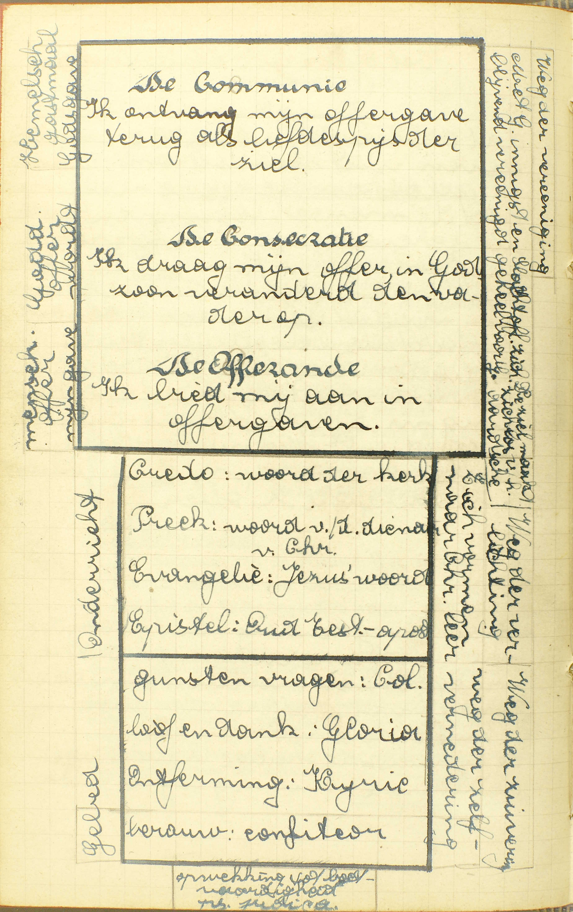
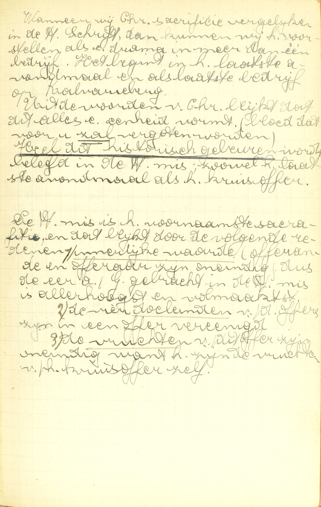
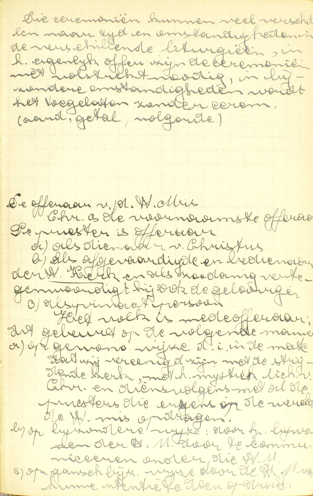
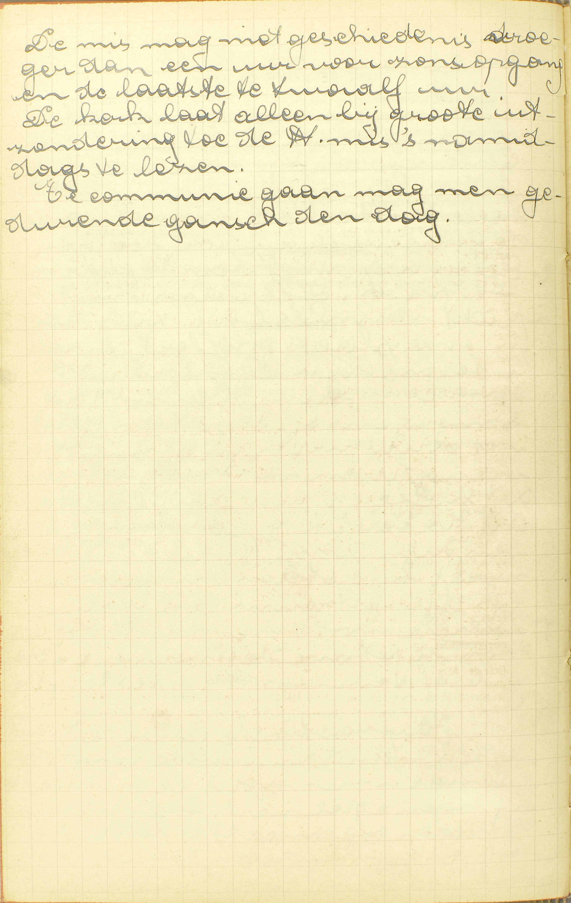

<table>
<tr>
  <td rowspan=6>**De Mis zelf**</td>
  <td rowspan=6 class=accolade></td>
  <td>Natuur</td>
  <td>*[Wat is de Mis?](#wat-is-de-mis)*</td>
</tr>
<tr>
  <td>Waarde</td>
  <td>*[Welk sacrificie is beter, dat van de Oude, of dat van de Nieuwe Wet?](#welk-sacrificie-is-beter-dat-van-de-oude-of-dat-van-de-nieuwe-wet)*</td>
</tr>
<tr>
  <td>Hoofddelen</td>
  <td>*[Welke zijn de bijzonderste en nodigste delen van de Mis?](#welke-zijn-de-bijzonderste-en-nodigste-delen-van-de-mis)*</td>
</tr>
<tr>
  <td>Oorspong</td>
  <td>*[Wie heeft de eerste Mis gedaan?](#wie-heeft-de-eerste-mis-gedaan)*</td>
</tr>
<tr>
  <td>Offeraars</td>
  <td>*[Wie offert aan God het Sacrificie?](#wie-offert-aan-god-het-sacrificie)*</td>
</tr>
<tr>
  <td>Vruchten</td>
  <td>*[Wat kunnen wij verkrijgen door het Saerificie van de Mis?](#wat-kunnen-wij-verkrijgen-door-het-saerificie-van-de-mis)*</td>
</tr>
<tr>
  <td rowspan=2>**Ceremoniën**</td>
  <td rowspan=2 class=accolade></td>
  <td>Oorsprong</td>
  <td>*[Van waar komen al de ceremoniën van de Mis?](#van-waar-komen-al-de-ceremoniën-van-de-mis)*</td>
</tr>
<tr>
  <td>Einde</td>
  <td>*[Waartoe dienen de ceremoniën, die in de Mis gebruikt worden?](#waartoe-dienen-de-ceremoniën-die-in-de-mis-gebruikt-worden)*</td>
</tr>
</table>

# Wat is de Mis?

## Het Sacrificie van de Nieuwe Wet, in hetwelk het lichaam en bloed van Christus, onze Zaligmaker, aan God de Vader opgeofferd wordt

  
  
  
  
  

V. Door het woord *Mis* verstaat men gewoonlijk de hele godsdienstige oefening waarin, door de woorden van de Consecratie die de priester spreekt, het lichaam en bloed van Christus onder de gedaanten van brood en wijn tegenwoordig gesteld worden. Hier nu vraagt de Catechismus, waarin de Mis eigenlijk gelegen is: of zij alleen bestaat in de tegenwoordigstelling van het H. Sacrament, dan of zij tevens een bijzondere godsdienstige oefening bevat, zoals een gebed, een offerande, een sacrificie.

A. Het antwoord leert ons hoofdzakelijk drie dingen: de Mis is:

1° Een **sacrificie** (slachtofferande): de opdracht van het menselijk leven of van iets dat in de plaats ervan gesteld is, bij middel van vernietiging door een wettigen bedienaar aan God gedaan, om Hem te erkennen als onze oppersten meester en tevens te belijden, dat wij voor onze zonden de dood schuldig zijn.

Tusschen een sacrificie en een enkele offerande bestaan *vier* verschillen: a) in de offerande worden allerhande zaken opgedragen; in het sacrificie uitsluitend het menselijk leven — als God het vraagt, gelijk bij het sacrificie van Isaäc en bij dat van het Kruis, — of iets dat het menselijk leven vervangt, zoals eetwaren en dieren die de mens tot voedsel dienen; b) in de offerande wordt de zaak opgedragen door gift, door toewijding; in het sacrificie integendeel, door vernietiging ; — c) de offerande is slechts een teken van eer en dankbaarheid; het sacrificie integendeel, dat de slachtoffering van het menselijk leven bevat, drukt de opperste eer en aanbidding uit, en is tevens een belijdenis, dat wij, om reden van de zonde, de dood schuldig zijn; — d) uit hoofde van de gezegde betekenis mag men iedereen door een offerande vereren, terwijl men het sacrificie uitsluitend aan God mag opdragen.

Men merke hier op dat, in de erkenning van Gods opperste majesteit, een akte van dankzegging en een akte van gebed besloten zijn, en dat bijgevolg het sacriflcie een vierdubbel einde heeft: a) erkenning van Gods opperste meesterschap; b) dankzegging voor reeds bekomene weldaden; c) bede om nieuwe gunsten te bekomen; d) belijdenis en uitboeting van de zonde. — Deze vier punten bevatten in ‘t kort geheel de godsdienst, en zo is het sacriticie het middelpunt van alle godsdienstige oefeningen.

2° **Het Sacrificie van de Nieuwe Wet:** het enig en eigen Sacrificie van de christelijke Godsdienst.

3° Het Sacrificie van de Nieuwe Wet, **in hetwelk,** niet gelijk in de Oude Wet, dieren en vruchten, maar Christus zelf, als mens, of **het lichaam en bloed van Christus, onze Zaligmaker — aan God de Vader opgeofferd wordt.** Met deze laatste woorden zegt men niet dat het Sacrificie van de Mis de Vader alleen, bij uitsluiting van de twee andere Personen, opgedragen wordt, maar wel a) dat de verering er in besloten de Vader, die almachtig heet, bijzonder wordt toegeschreven; b) dat de Zoon, hier als mens geslachtofferd, van de persoon van de Vader waarlijk onderscheiden is.

Christus wordt in de Mis geslachtofferd, niet met wederom gelijk op het Kruis, wezenlijk de dood te ondergaan, want sedert zijn verrijzenis is hij onsterfelijk ; maar met onder de gedaanten van twee levenloze stoffen tegenwoordig gesteld, en zo werkelijk van zijn eigen uiterlijk voorkomen, van de uitwendige gedaante van zijn levend en glorieus lichaam beroofd te worden; dit immers maakt een slachtoffering uit onder opzicht, niet van het inwendig, maar van het uitwendig leven: werd b.v. een mens bij mirakel onder de gedaanten van brood en wijn tegenwoordig gesteld, iedereen toch zou hem voor geslachtofferd, voor dood aanzien, Zulk een slachtoffering is hier voldoende, daar, onder dit betrek, tot een sacrificie slechts vereist wordt, dat de geofferde zaak die vernietiging onderga waar zij vatbaar voor is, en Christus, sedert zijn verrijzenis, maar op een enkele uitwendige wijze meer kan sterven.

# Welk sacrificie is beter, dat van de Oude, of dat van de Nieuwe Wet?

## Dat van de Nieuwe Wet is zoveel beter, als Christus zelf te boven gaat al de beesten, die toen geofferd wierden

V. Welk sacrificie is waardiger, dat van de Oude Wet, waarin dieren, spijzen en vruchten geofferd werden, of dat van de Nieuwe Wet, namelijk het Sacrificie van de Mis?

A. **Dat van de Nieuwe Wet is — zoveel beter:** zoveel waardiger dan de sacrificiën van de Oude Wet, **als Christus zelf,** die in de Mis geofferd wordt, **te boven gaat al de beesten die toen geofferd wierden:** waardiger is dan de dieren, die de edelste offers waren van de Oude Wet. De Mis dus overtreft de Sacrificien van die tijd oneindig, daar Christus, haar offer, oneindig waardiger is dan al de offers van het Oud Verbond.

Het betaamde dat het Sacrificie van de Nieuwe Wet zo edel was, omdat het dienen moet om van God de toepassing te bekomen van het Sacrificie des Kruis, dat ook van oneindige waarde is.

# Welke zijn de bijzonderste en nodigste delen van de Mis?

## De Consecratie of verandering van brood én wijn in het lichaam en bloed van Christus, die door de priester zichzelf opoffert; en de Nutting

  

V. Welke zijn de delen van het Sacrificie van de Mis, zonder dewelke het niet zou bestaan, of ten minste niet meer volkomen zou wezen?

A. Die delen zijn:

1° **De Consecratie of verandering** (door de woorden van de priester) **van brood en wijn** (onder de offerande van de Mis bereid) **in het lichaam en bloed van Christus, die door de priester zichzelf opoffert:** die door de woorden van de priester zich onder de gedaanten van brood en wijn tegenwoordig stelt, en zich, door het aannemen van deze staat, aan God slachtoffert. ’t Is dus eigenlijk in de Consecratie dat Christus geslachtofferd wordt, en daarom kan de Mis onmogelijk zonder de Consecratie bestaan.

2° **De Nutting:** de Communie van de priester. Dit deel is niet op dezelfde wijze nodig als de Consecratie: zonder de Nutting zou de Mis wel een sacrificie zijn, maar slechts een onvoltrokken, een onvolmaakt. Inderdaad, de Mis is eerst en vooral een *vredessacrificie,* d.i. een sacrificie dat in het bijzonder wordt opgedragen om God te bedanken en nieuwe gunsten van Hem te bekomen; want zij dient rechtstreeks tot toepassing van het Sacrificie des Kruis. Welnu, de vredesacrificiën worden voltrokken door de nutting van het geslachtofferde: dit is immers de bijzondere eigendom Gods geworden, en zo is de nutting er van als ‘t ware een goddelijke maaltijd, betekenende dat er vrede bestaat tussen God en de mens die Hij tot zijn tafel uitnodigt.

# Wie heeft de eerste Mis gedaan?

## Christus, onze Zaligmaker, in het Laatste Avondmaal, en na Hem de Heilige Apostelen

A. **Christus onze Zaligmaker** zelf, heeft ze eerst gedaan **in het Laatste Avondmaal;** want Hij eerst heeft daar zijn lichaam en bloed tegenwoordig gesteld onder de gedaanten van brood en wijn, en zich aldus geslachtofferd, — **en na Hem de Heilige Apostelen,** aan wie Hij bevolen had de opdracht van het Sacrificie dat Hij kwam in te stellen, door hen zelf en door hun opvolgers te herhalen tot het einde van de eeuwen.

# Van waar komen al de ceremoniën van de Mis?

## Van de Apostelen en van andere oversten van de H. Kerk

  
  

V. Van waar komen al de gebeden en godsdienstige tekenen die, boven de Consecratie en de Nutting, in de Mis gebruikt worden?

A. Zij komen niet van Christus, die slechts de Consecratie en de Nutting heeft ingesteld, maar deels **van de Apostelen,** deels **van andere oversten van de H. Kerk:** van de Pausen en de bisschoppen die de Apostelen opgevolgd hebben.

# Waartoe dienen de ceremoniën, die in de Mis gebruikt worden?

## Tot gedachtenis en verbeelding van de dood van Christus

A. Zij dienen **tot gedachtenis en verbeelding van de dood van Christus:** om ons Christus’ dood indachtig te maken en voor ogen te stellen.

De Apostelen en de andere oversten van de H. Kerk hebben zeer wijs gehandeld met de ceremoniën van de Mis tot dat einde in te brengen, daar Christus zelf van het Sacrificie van de Mis een gedachtenis van zijn heilig lijden en bloedige dood heeft gemaakt. Het betaamt overigens dat geheel de Mis ons het Sacrificie des Kruis herinnere, omdat zij dient om dit sacrificie toe te passen.

# Wie offert aan God het Sacrificie?

## Christus zelf is de voornaamste; maar de priester is zijn dienaar in het offeren

V. Wie is de offeraar van het Sacrificie van de Mis? — Het opdragen van een sacrificie bestaat in *twee* dingen: 1° in de offerande te slachtofferen; 2° in deze slachtoffering ter ere Gods te doen: zonder het eerste zou er op gener wijze een sacrificie zijn ; zonder het laatste zou het sacrificie geen godsdienstig werk wezen.

A. **Christus zelf,** als mens, **is de voornaamste** offeraar; want het is krachtens zijn instelling dat Hij, door de woorden van de Consecratie, onder de gedaanten van brood en wijn tegenwoordig gesteld wordt, en Hij zelf stemt iedermaal ter ere Gods in die tegenwoordigstelling toe; **maar de priester is zijn dienaar in het offeren:** maar Christus verricht de Consecratie niet door zichzelf alleen: Hij gebruikt daartoe de priester, die dus ook het Sacrificie offert, al is het enkel als dienaar, als medehelper van Christus, de voornaamsten offeraar; de tegenwoordigstelling van Christus onder de gedaanten van brood en wijn hangt immers af van de woorden van de Consecratie, die de priester spreekt.

Behalve Christus en de priester zijn er nog offeraars, maar slechts in de oneigenlijken zin des woords, namelijk, al degenen die enigszins in de opdracht van het Sacrificie medehelpen, of daarin toestemmen.

# Wat kunnen wij verkrijgen door het Saerificie van de Mis?

## Vergiffenis van onze zonden, en al wat wij van God begeren voor ons zelf of voor anderen, en ook voor de zielen die in het vagevuur zijn

  
  

V. De Catechismus spreekt van de vruchten van de Mis ten opzichte *van de mensen.* Ten opzichte *van God* bevat zij een allervolmaaktste aanbidding en een allerwaardigste dankzegging.

A. Door het Sacrificie van de Mis verkrijgen wij:

1° **Vergiffenis van onze zonden,** niet rechtstreeks, gelijk door de Biecht en het berouw, maar onrechtstreeks, of genade waarmee wij voldoend leedwezen over de zonden kunnen bekomen. Wij verwerven ook rechtstreeksche vergiffenis van de overgeblevene tijdelijke pijnen.

2° **En al wat wij van God begeren:** al wat wij door het gebed van God kunnen afsmeken, namelijk: dadelijke genade om ons te bekeren, of om te volharden en in de deugd vooruit te gaan; vergiffenis van tijdelijke straffen; allerhande tijdelijke goederen die tot de zaligheid dienstig zijn; vermindering van bekoringen, bescherming tegen de vijanden van ons eeuwig geluk. Al deze vruchten kunnen wij bekomen a) **voor ons zelf,** b) **voor anderen:** voor alle andere mensen van de wereld, gelovige of ongelovige, en c) **ook voor de zielen die in het vagevuur zijn.**

De eerste vrucht brengt het Sacrificie voort door zijn verzoenende kracht, die Gods barmhartigheid treft; de tweede, door zijn smekende kracht, die Gods goedheid raakt. Deelachtig aan beide zijn, 1° in 't algemeen, al de gelovigen; 2° op een bijzondere wijze, de priester die de Mis doet; 3° voor een gans bijzondere hoeveelheid, degenen voor wie de priester in Christus’ naam het Sacrificie opdraagt.

Wij spraken tot nu toe van de vruchten van de Mis, voor zoveel deze het werk is van Christus en van de priester in Christus’ naam handelende; aanzien nu als het werk van de priester in zijn eigenen naam en in die van de H. Kerk handelende, of als het werk van de gelovigen die er deel aan nemen of in toestemmen, heeft zij dezelfde vruchten als al ander goed werk en is ook op dezelfde wijze aan anderen toepasselijk.

### Aanmerking

Geheel de leer over het H. Sacrificie van de Mis is af te leiden van hetgene de voorgaande les ons over de tegenwoordigstelling van Christus’ lichaam en bloed onder de gedaanten van brood en wijn geleerd heeft. 1° Daar Christus in het H. Sacrament van zijn uitwendig leven beroofd is, maakt zijn tegenwoordigstelling onder de gedaanten van brood en wijn, die Hij ter ere Gods doet, een waar sacrificie uit, en zo blijkt dat de Mis het Sacrificie is van de Nieuwe Wet. — 2° Dit Sacrificie is oneindig waardiger dan die van de Oude Wet, aangezien Christus zelf er in geofferd wordt. — 3° Het heeft als hoofddelen de Consecratie, in dewelke de slachtoffering geschiedt, en de Nutting die dient om uit te drukken, dat de Mis een vredesacrificie is. — 4° Aangezien Christus. de eerste maal zich door zichzelf alleen, onder de gedaanten van brood en wijn, heeft tegenwoordig gesteld, heeft Hij ook de eerste Mis gedaan. — 5° De voornaamste offeraar van dit Sacrificie is Christus zelf, aangezien de priester die Mis doet, uit hoofde van Christus’ instelling en in diens naam handelt, en dat Christus zelf in de opdracht van zijn lichaam en bloed toestemt. — De priester die de Mis doet, is ook offeraar, want de slachtoffering geschiedt niet zonder zijn medewerking, zonder dat hij de woorden van de Consecratie spreekt. — 6° De ceremoniën van de Mis komen niet van Christus, die enkel de Consecratie en de Nutting heeft ingesteld, maar van de H. Kerk die, naar 't voorbeeld van Christus, daarin de gedachtenis en de verbeelding van de dood van Christus vóór ogen heeft gehad. — 7° Dit sacrificie hevat, ten opzichte van God, een allervolmaaktste aanbidding, en een allerwaardigste dankzegging, en, te onze opzichte verzoent het God en geeft zo vergiffenis van de zonden; ‘t is tevens een waar gebed, en zo dient het ons om er door te verkrijgen al wat wij van God begeren voor ons zelf of voor anderen, en ook voor de zielen die in het vagevuur zijn.

### VRAGEN

Waarvan handelt deze les? — Hoe is zij verdeeld? — Wat bevat ieder deel?

1. Wat verstaat men door het woord *Mis?* — Geef de zin van de vraag: *wat is de Mis?* — Tot welke soort van zaken behoort de Mis? — Wat is een sacrificie? — Hoe verschilt een sacrificie van een offerande? — Welk is het einde van een sacrificie! — Welke plaats bekleedt het sacrificie in de Godsdienst en waarom? — Zeg, met de Catechismus, welk sacrificie de Mis is, en leg het antwoord uit. — Zeg, met de woorden van de Catechismus, wat in de Mis geofferd wordt, en leg die woorden uit. — Zeg, met de Catechismus, aan wie de Mis opgedragen wordt. — Geef rekenschap van dit antwoord. — Hoe wordt Christus in de H. Mis wezenlijk geslachtofferd? — Is dit een ware slachtoffering? — Is deze voldoende om een sacrificie uit te maken?

2. Leg de vraag uit: *Welk sacriftcie is beter, dat van de Oude of dat van de Nieuwe Wet?* — Zeg welk sacrificie het beste is. — Zeg, met de woorden van de Catechismus, hoeveel het een de andere overtreft. — Verklaar die woorden. — Hoeveel dus gaat het de andere te boven, en waarom? — Betaamt het dat wij, onder de Nieuwe Wet, een zo waardig sacrificie hebben, en waarom?

3. Wat verstaat men in de 3ᵉ vraag door *bijzonderste en nodigste delen?* — Hoeveel bijzonderste en nodigste delen van de Mis zijn er? — Noem ze met de woorden van de Catechismus. — Leg die woorden uit. — Op welke wijze is ieder deel nodig tot de Mis? — Waarom kan het Sacrificie van de Mis zonder de Consecratie geenszins bestaan? — Hoe is de Nutting een volmakend deel van de Mis?

4. Wie heeft de geheel eerste Mis gedaan, en waar is zij geschied?  — Door wie is de Mis nadien eerst opgedragen geweest, en waarom?

5. Wat verstaat men door *ceremoniën* van de Mis? — Komen de ceremoniën van de Mis van Christus zelf? — Van wie komen zij? — Leg het antwoord uit.

6. Verklaar het antwoord van de Catechismus op de vraag: *waartoe dienen de ceremoniën, die in de Mis gebruikt worden?* — Toon dat de H. Kerk wijs handelt met tot dat einde de ceremoniën in te stellen.

7. Verklaar de vraag: *wie offert aan God het Sacrificie?* — Waarin bestaat het offeren van een sacrificie? — Geef er de reden van. — Door hoeveel en door welke offeraars wordt het Sacrificie van de Mis opgedragen? — Welke orde bestaat er tussen hen? — Toon hoe ieder van hen wezenlijk offeraar is, en de gezegde plaats in het offeren bekleedt. — Zijn er, buiten hen, geen andere offeraars in de oneigenlijken zin des woords? — Wie zijn het?

8. Zeg, met de woorden van de Catechismus, welke vruchten wij uit het Sacrificie van de Mis ontvangen. — Leg ze uit. — Zeg, met de woorden van de Catechismus, voor wie wij de tweede vrucht kunnen bekomen, en verklaar ze, — Uit welke hoofde komen die vruchten uit het Sacrificie van de Mis voort? — Wie ontvangt die vruchten en in welke maat? — Welke vruchten brengt de Mis voort, voor zoveel zij opgedragen wordt door de priester in de naam van de H. Kerk en in zijn eigenen naam, of door de gelovigen die in het Sacrificie deelnemen of toestemmen? — Wat bevat de Mis ten opzichte van God?

