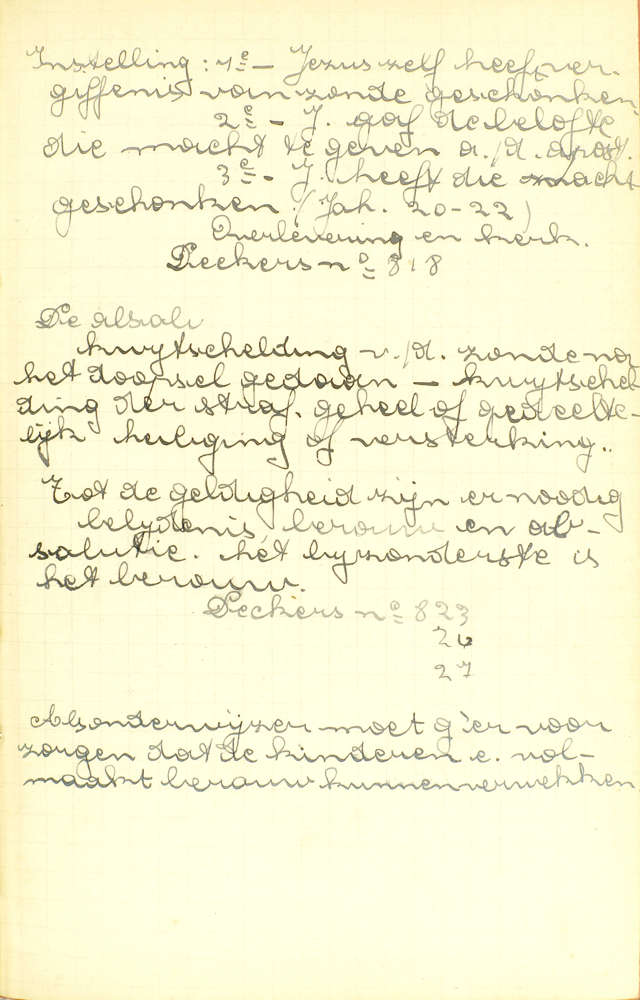
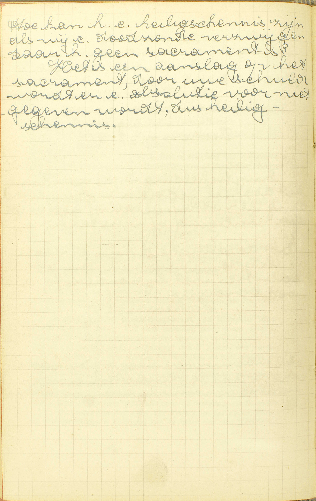
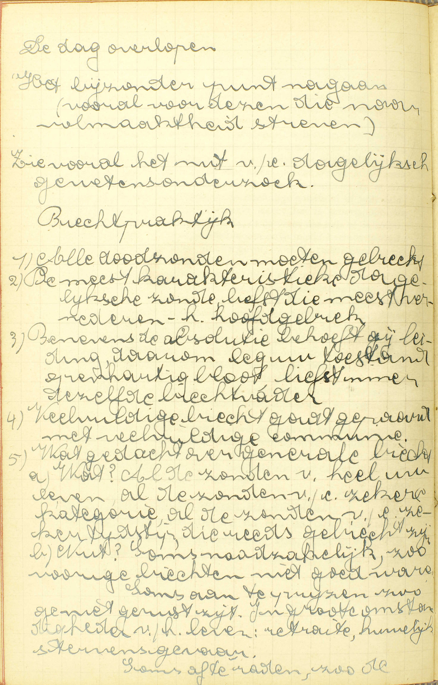
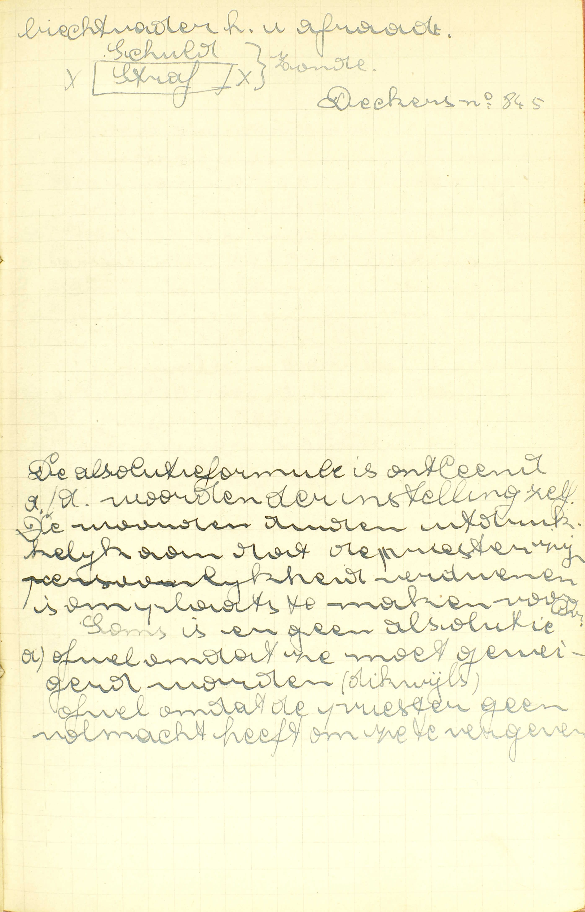
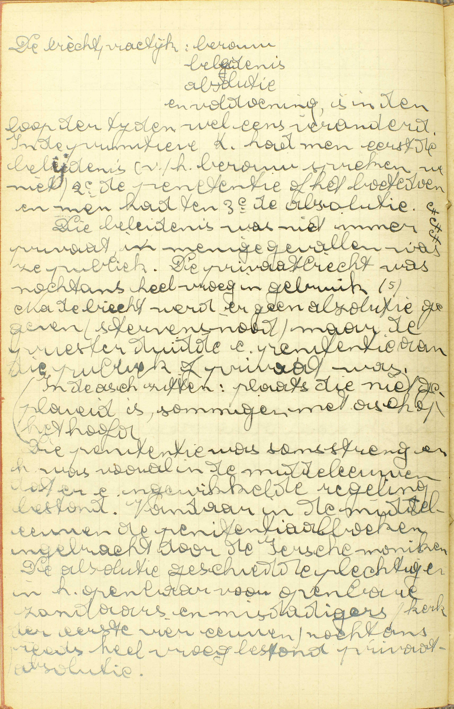
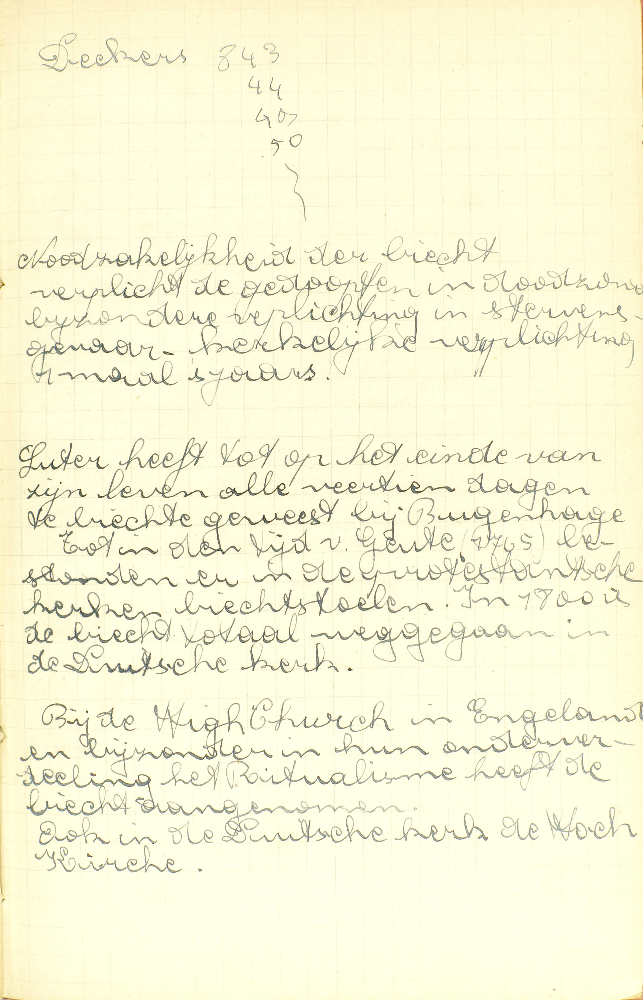
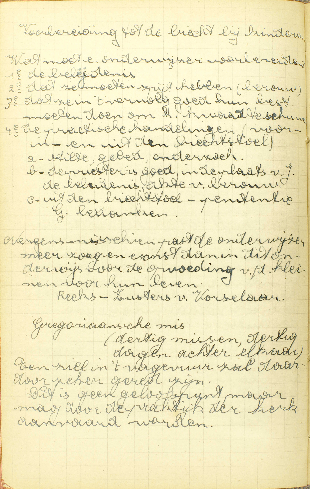

<table>
<tr>
  <td colspan=3>**Natuur**</td>
  <td class=accolade></td>
  <td>*[Wat is de Biecht of Penitentie?](#wat-is-de-biecht-of-penitentie)*</td>
</tr>
<tr>
  <td rowspan=3>[**Vereiste werken om dit Sacrament te ontvangen**](#hoeveel-delen-zijn-er-nodig-tot-het-sacrament-van-de-penitentie)</td>
  <td rowspan=3 class=accolade></td>
  <td>Berouw</td>
  <td class=accolade></td>
  <td>*[Wat is het berouw?](#wat-is-het-berouw)*</td>
</tr>
<tr>
  <td>Belijdenis of Biecht</td>
  <td class=accolade></td>
  <td>*[Welke zonden moeten wij belijden?](#welke-zonden-moeten-wij-belijden)*</td>
</tr>
<tr>
  <td>Voldoening</td>
  <td class=accolade></td>
  <td>*[Ben ik schuldig iets te doen na de belijding en de absolutie van de priester?](#ben-ik-schuldig-iets-te-doen-na-de-belijding-en-de-absolutie-van-de-priester)*</td>
</tr>
<tr>
  <td colspan=3>**Uitwerksels**</td>
  <td class=accolade></td>
  <td>*[Wordt door de Biecht niet vergeven de pijn, die de zonde verdiend heeft?](#wordt-door-de-biecht-niet-vergeven-de-pijn-die-de-zonde-verdiend-heeft)*</td>
</tr>
</table>

# Wat is de Biecht of Penitentie?

## Een Sacrament, van Christus ingesteld, in hetwelk door de priesterlijke macht de zonden, die na het Doopsel gedaan zijn, vergeven worden

  
  <em>Instelling: 1ᵉ - Jezus zelf heeft vergiffenis van zonde geschonken. 2ᵉ - Jezus gaf de belofte die macht te geven aan de apostelen. 3ᵉ - Jezus heeft die macht geschonken (Joh. 20-22). Overlevering en kerk. De kwijtschelding van de zonde na het doopsel gedaan. Kwijtschelding van de straf, geheel of gedeeltelijk heiliging of versterking. Tot de geldigheid zijn er nodig: belijdenis, berouw en absolutie. Het bijzonderste is het berouw. Als onderwijzer moet g'ervoor zorgen dat de kinderen een volmaakt berouw kunnen verwekken.</em>
  
  <em>Hoe kan het een heiligschennis zijn als wij een doodzonde verzwijgen, daar het geen sacrament is? Het is een aanslag op het sacrament, door uw schuld wordt er een absolutie voor niets gegeven, dus heiligschennis.</em>

A. Het antwoord spreekt ons: 1° van de instelling; 2° van het uitwendig teken, en 3° van de bijzondere genade van het Sacrament van de Biecht.

1° *De instelling:* het is **een Sacrament, van Christus ingesteld.** (Zie [32ᵉ les, 1ᵉ vr.](les-32.html#wat-is-het-heilig-sacrament-des-altaars)) Deze instelling greep plaats wanneer Christus, na zijn verrijzenis aan zijn Apostelen verschijnende, over hen blies en tot hen sprak: *« Ontvangt de H. Geest; wier zonden gij vergeven zult, die worden zij vergeven, en wier zonden gij houden zult, die zijn zij gehouden. »*

2° *Het uitwendig teken:* de vergiffenis van de zonden — **door de priesterlijke macht:** door de vrijspreking of absolutie van een priester die geldig gewijd is en jurisdictie ([28ᵉ les, vr. 5](les-28.html#aan-wie-zijn-wij-schuldig-te-biechten)) heeft. Deze vrijspreking of absolutie geschiedt door de woorden, *« Ik ontsla u van uw zonden in de naam van de Vader, en van de Zoon, en van de H. Geest, Amen. »* Zij maakt met de akten van de biechteling, namelijk, het berouw (door de biecht en andere tekenen uitwendig kenbaar gemaakt), de belijdenis en de voldoening, een volmaakt oordeel tot ontslaging uit, en betekent allerduidelijkst de vergiffenis van de zonden.

3° *De bijzondere genade:* **de zonden, die na het Doopsel gedaan zijn, worden vergeven.** Hierdoor verschilt de Biecht a) van het Doopsel, waardoor wij van de erfzonde en de voorgaande zonden vergiffenis bekomen; b) van al de Sacramenten van de levenden, die rechtstreeks dienen, niet om de zonde te vergeven, maar om de heiligmakende genade te vermeerderen. Uit dit uitwerksel blijkt, dat slechts degenen die na het Doopsel enigszins gezondigd hebben, geldig de absolatie kunnen ontvangen.

De Biecht schenkt ons, met de vergiffenis van de zonden die na het Doopsel gedaan zijn, ook de heiligmakende genade en recht tot de dadelijke. ([30ᵉ les, vr. 7.](les-30.html#mag-men-tweemaal-gedoopt-worden))

Dit Sacrament wordt *Biecht* genoemd, omdat men zijn zonden moet *biechten* om de absolutie te kunnen bekomen; het heet ook *Penitentie* (boetvaardigheid), omdat wij er boetvaardigheid door doen over onze zonden.

# Hoeveel delen zijn er nodig tot het Sacrament van de Penitentie?

## Drie: berouw, belijdenis of biecht, en voldoening

V. Hoeveel werken zijn er vanwege de biechteling vereist, om geldig en met vrucht de absolutie van de priester te kunnen ontvangen?

A. *Drie* werken, te weten: 1° **berouw** of leedwezen over de zonden waarvan men vergiffenis wil bekomen; 2° **belijdenis of biecht:** uitwendige bekentenis dier zonden aan de priester; 3° **voldoening** of penitentie.

# Wat is het berouw?

## Een leedwezen over de zonden, door dewelke wij de goddelijke majesteit en goedheid vergramd hebben, met een vast voornemen van dezelve te biechten en ons te beteren

A. Het berouw bevat *twee* delen:

1° **Een leedwezen:** een spijt of droefheid **over de zonden,** over de woorden, werken, begeerten of verzuimenissen tegen de wet en de wil Gods, **door dewelke wij de goddelijke majesteit en goedheid vergramd hebben,** door dewelke wij God, de opperste majesteit en goedheid, beledigd hebben. Dus het leedwezen tot de Biecht vereist, moet zijn: a) over de *zonden,* b) over *onze zonden* en niet over die van anderen, en c) om reden dat wij *God* door die zonden vergramd hebben, en niet enkel omdat wij er b.v. onze fortuin, onze eer, onze faam door verloren hebben, — Er is niet vereist, dat het leedwezen op de oneindige goedheid of volmaaktheid Gods steune, en zo volmaakt weze; het is genoeg, dat het gegrond zijop de hoop van de hemel, of de vrees van de hel, of de leelijk zeid van de zonde, en derwijze slechts een onvolmaakt berouw uitmake (zie [14ᵉ les, vr. 3](les-14.html#hoe-worden-de-dagelijkse-zonden-vergeven)); maar, in alle geval, moet de reden, waarop het steunt, van het Geloof afgeleid zijn.

Het leedwezen over de doodzonden moet zich uitstrekken tot al de doodzonden, die men moet biechten, zonder uitzondering, daar iedere doodzonde ons vijand van God maakt; en dat over de dagelijkse zonden most zich noodzakelijk uitstrekken tot al die dagelijkse zonden, welke geheel van dezelfde aard zijn. (Zie [14ᵉ les](les-14.html).)

2° **Een vast voornemen,** de vaste, de bepaalde wil, **van dezelve** (zonden) **te biechten,** d.i. ten minste alle onze doodzonden aan de priester in de Biecht te verklaren, **en ons te beteren,** d.i. alle doodzonden zonder uitzondering, die dagelijkse zonden waarover wij leedwezen hebhen, en ook de naaste gelegenheid dier zonden te vermijden; want, wie de naaste gelegenheid niet wil vermijden, die wil de zonde zelve niet vluchten.

Het berouw is door de natuur zelve van de zaak tot het Sacrament van de Biecht vereist; inderdaad, God vergeeft nooit een zonde, zonder dat men ze verfoeie en wil vluchten voor het toekomende, en, volgens Christus’ instelling, is de Biecht noodzakelijk voor de vergiffenis van alle doodzonde. (Zie [14ᵉ](les-14.html) en [28ᵉ les](les-28.html).)

# Welke zonden moeten wij belijden?

## Alle doodzonden die wij na een naarstig onderzoek gevonden hebben en indachtig zijn, daarbij voegende het getal en alles wat de zonde mag veranderen of zeer bezwaren

  
  <em>*De dag overlopen.* Het bijzonder punt nagaan (vooral voor dezen die naar volmaaktheid streven). Zie vooral het nut van een dagelijks gewetensonderzoek. *Biechtpraktijk.* 1) Alle doodzonden moeten gebiecht. 2) De meest karakteristieke dagelijkse zonde, liefst die meest vernederende, het hoofdgebrek. 3) Benevens de absolutie behoeft gij leiding, daarom leg uw toestand openhartig bloot, liefst immer dezelfde biechtvader. 4) Veelvuldige biecht gaat gepaard met veelvuldige communie. 5) Wat gedacht over generale biecht. a) Wat? Al de zonden van heel uw leven, al de zonden van een zekerek kategorie, al de zonden van een zekere tijd, die reeds gebiecht zijn. b) Nut? Soms noodzakelijk, zo vorige biechten niet goed waren. Soms aan te wijzen zo ge niet gerust zijn. In grote omstandigheden van het leven: retraite, huwelijk, stervensgevaar. Soms af te raden, zo de biechtvader het u afraadt.</em>

A. De Catechismus leert ons in zijn antwoord:

1° *Welke soort van zonden wij moeten belijden:* **de doodzonden** namelijk. De dagelijkse zonden moeten wij niet biechten, omdat er andere middelen zijn om er vergiffenis van te bekomen. ([14ᵉ](les-14.html) en [28ᵉ les](les-28.html).)

2° *Welke doodzonden wij moeten belijden:* **alle doodzonden** die na het Doopsel gedaan, en door de Biecht nog niet rechtstreeks vergeven zijn; dus ook dezulke waar men reeds door een volmaakt berouw, of door een Biecht waarbij zij onvrijwillig vergeten werden, vergiffenis van bekomen heeft; want, volgens Christus’ gebod, moeten alle doodzonden eens aan het oordeel van de priester onderworpen worden. Het spreekt van zelfs dat wij ze maar moeten biechten, indien wij ze in ons geweten **gevonden hebben** en bij de belijdenis **indachtig zijn:** voorzeker vraagt God ons het onmogelijke niet.

3° *Welk onderzoek van conscientie tot de Biecht vereist is:* het moet — **naarstig** zijn: met zoveel vlijt gedaan worden dat men, ingezien de omstandigheden waarin men zich bevindt, met reden moge denken al zijn doodzonden ontdekt te hebben. Hiertoe zal men aandachtig overwegen de Tien Geboden Gods, de vijf Geboden van de H. Kerk, de plichten van zijn staat en de zonden die men meest bedrijft. Laat iemand die waarschijnlijk in een doodzonde gevallen is, vrijwillig na, het nodige te doen om zete ontdekken, dan is hij zo schuldig alsof hij die verzweeg; wie immers verplicht is zijn zonden te biechten, is noodzakelijk gehouden er zijn conscientie naarstig op te onderzoeken.

4° *Wat men, boven de zonde in haar zelve, nog moet belijden:* a) **het getal:** hoe dikwijls men de zonde bedreven heeft. Weet men niet juist het getal te zeggen, dan bepaalt men het zo nauwkeurig mogelijk, daarbij voegende: *min of meer.* Kan dit zelfs niet gedaan worden, dan verklaart men hoe dikwijls men per maand, week of dag, of in welke omstandigheden men gewoonlijk in de zonde gevallen is. b) **Alles wat de zonde mag veranderen:** al de omstandigheden die op hun eigen een nieuwe doodzonde van anderen aard uitmaken: wie b.v. zijn vader de dood heeft gewenst, voldoet niet met te biechten dat hij iemand de dood gewenst heeft; hij moet er bijvoegen dat hij dat gedaan heeft ten opzichte van zijn vader: deze omstandigheid maakt dat er, boven de zonde tegen het Vijfde Gebod, nog een doodzonde is tegen het Vierde. c) **Alles wat de zonde zeer mag bezwaren:** ten minste al die omstandigheden welke van een dagelijkse zonde een dodelijke maken: heeft iemand, b.v. een zware diefstal te biechten, dan voldoet hij niet met te verklaren, dat hij gestolen heeft; hij moet daarbij voegen, dat de diefstal zwaar was.

Om de absolutie van de priester te ontvangen, moeten wij, a) *onze zonden biechten,* aangezien de priester door Christus als rechter is aangesteld om te oordelen, niet enkel over de gesteltenis van de biechteling, maar eerst en vooral over diens zonden, en om, volgens dat oordeel, te beslissen of het behoort hem de absolutie te geven of te weigeren; b) zonder uitzondering *alle doodzonden biechten* die wij gevonden hebben en indachtig zijn, omdat ten minste alle misdaden die de doodstraf verdienen, aan de rechter moeten onderworpen worden; c) alle doodzonden biechten *met getal en alles wat de zonde mag veranderen of zeer bezwaren,* vermits wij anders niet al onze doodzonden zouden belijden.

Wie vrijwillig een doodzonde verzwijgt, of, door een zware nalatigheid in het onderzoeken van zijn conscientie, er een vergeet, die doet een slechte biecht en bedrijft een heiligschenderij; daarom moet hij in zijn volgende biecht wederom de doodzonden belijden waarvan hij zich in de voorgaande reeds beschuldigd heeft daarbij voegende de verzwegene of vergetene zonde en de heiligschenderij.

# Ben ik schuldig iets te doen na de belijding en de absolutie van de priester?

## Gij moet volbrengen de penitentie, die u gesteld is

  
  <em>De absolutieformule is ontleend aan de woorden van de instelling zelf. De woorden duiden uitdrukkelijk aan dat de priester zijn persoonlijkheid verdwenen is om plaats te maken voor Christus. Soms is er geen absolutie, ofwel omdat ze moet geweigerd worden (dikwijls), ofwel omdat de priester geen volmacht heeft om ze te vergeven.</em>

V. Moet ik, na met berouw en rechtzinnigheid mijne zonden gebiecht en de absolutie ontvangen te hebben, nog iets doen opdat het Sacrament geheel zou voltrokken zijn, en ik er al de vruchten van zou bekomen?

A. **Gij moet — de penitentie:** het gebed, het werk van boetvaardigheid of het goed werk, — **die u** door de priester tot voldoening voor uw zonden **gesteld is,** op zonde **volbrengen,** en zelfs op doodzonde, als zij u tot voldoening vogr doodzonden opgelegd, en uit haar zelve of haar omstandigheden zwaar is. Gij moet ze ook volbrengen op de gestelden tijd, en, is de tijd niet bepaald, dan zo spoedig mogelijk.

De penitentie heeft kracht om ons te verlossen van de tijdelijke straffen van de zonden in de Biecht reeds vergeven, niet alleen voor zoveel zij een goed werk is, maar nog en eerst en vooral, uit hoofde van Christus’ instelling, als deel van het Sacrament van de Biecht dat, gelijk al de andere Sacramenten, de genade geeft die het betekent. Nochtans is zij niet, gelijk het berouw en de biecht, nodig tot de geldigheid van de absolutie; zij is slechts een volmakend deel van het Sacrament, dienende om ons te verlossen van de pijnen die wij dikwijls, na de absolutie ontvangen te hebben, nog schuldig blijven te lijden. ([v. 6.](#wordt-door-de-biecht-niet-vergeven-de-pijn-die-de-zonde-verdiend-heeft)) Onder opzicht van de penitentie is er tot de geldigheid van de absolutie slechts vereist, dat men vóór de absolutie bereid zij de penitentie, die op doodzonde zou verplichten, te volbrengen.

# Wordt door de Biecht niet vergeven de pijn, die de zonde verdiend heeft?

## De eeuwige pijn, die men in de hel stond te lijden, wordt door de absolutie vergeven; maar evenwel blijft er dikwijls nog schuld van tijdelijke pijn, hier of hiernamaals te betalen

V. Waarom is de penitentie of voldoening na de absolutie nog vereist: wordt in de Biecht, samen met de zonde, niet eok de pijn vergeven die God voor de zonde gesteld heeft?

A. **De eeuwige pijn** van schade en van gevoel **die men,** om reden van doodzonden, **in de hel stond te lijden,** alsmede een deel van de tijdelijke pijnen die men, wegens dagelijkse zonden, hier of in het vagevuur had uit te te boeten, **wordt,** samen met de zonden, **door de absolutie vergeven;** want als God iemand uit de staat van doodzonde tot zijn kind en zijn erfgenaam aanneemt, dan kan Hij hem niet eeuwig meer straffen; evenmin kan Hij, na de vergiffenis van een dagelijkse zonde, er geheel de verdiende straf van laten bestaan; — **maar evenwel blijft er dikwijls,** voor de dodelijke zonde en ook voor de dagelijkse, **nog schuld van tijdelijke pijn, hier** op deze aarde door ongelukken en tegenspoed, of door werken van boetvaardigheid, **of hiernamaals** in het vagevuur **te betalen** of uit te boeten.

Aan de dopelingen, mits voldoend berouw in geval dat zij tot de jaren van verstand gekomen zijn, geeft God zonder penitentie vergiffenis van *alle* pijnen, omdat zij door het Doopsel in het geestelijk leven geboren worden; maar de gedoopten die gezondigd hebben, geeft Hij dikwijls, zonder dat zij penitentie doen, geen volkomene vergiffenis van de pijnen, om zo hun ondankbaarheid te straffen.

Dat men dikwijls, na de vergiffenis van de zonden bekomen te hebben, nog schuldig blijft hier of hiernamaals tijdelijke pijnen te betalen, blijkt uit de geschiedenis van Adam, van Mozes en van David.

### Aanmerking

  
  <em>De biechtpraktijk: berouw, belijdenis, absolutie en voldoening, is in de loop der tijden wel eens veranderd. In de primitieve Kerk had men eerst de belijdenis (van het berouw spreken we niet), 2ᵉ de penitentie of het boetedoen en men had ten 3ᵉ de absolutie. Die belijdenis was niet immer privaat, in menige gevallen was ze publiek. De privaatbiecht was nochtans heel vroeg in gebruik. Na de biecht werd er geen absolutie gegeven (stervensnood), maar de priester duidde een penitentie aan die publiek of privaat was. "In de as zitten": plaats die niet geplaveid is, sommigen met as op het hoofd. Die pentitentie was soms streng en het was voral in de middeleeuwen dat er een ingewikkelde regeling bestond. Vandaar in de middeleeuwen de penitentiaalboeken, ingebracht door de Ierse monniken. De absolutie geschiedde plechtig en in het openbaar voor openbare zondaars en misdadigers (kerk van de eerste vier eeuwen), nochtans reeds heel vroeg bestond privaat-absolutie.</em>
  
  <em>Noodzakelijkheid van de biecht: verplicht de gedoopten in doodzonde; bijzondere verplichting in stervensgevaar; kerkelijke verplichting 1 maal 's jaars. Luther heeft tot op het einde van zijn leven alle veertien dagen te biecht geweest bij Bugenhagen. Tot in de tijd van Goethe (1765) bestonden er in de protestantse kerken biechtstoelen. In 1800 is de biecht totaal weggegaan in de Duitse kerk. Bij de *High Church* in Engeland en bijzonder in hun onderverdeling het Ritualisme, heeft de biecht aangenomen. Ook in de Duitse kerk de *Hoch Kirche.*</em>
  
  <em>Voorbereiding tot de biecht bij kinderen. Wat moet een onderwijzer voorbereiden: 1ᵉ de belijdenis, 2ᵉ dat ze moten spijt hebben (berouw), 3ᵉ dat ze in 't vervolg goed hun best moeten doen om het kwaad te schuwen, 4ᵉ de praktische handelingen (voor, in en uit de biechtstoel): a) stilte, gebed, onderzoek, b) de priester is goed, in de plaats van Jezus, de belijdenis, akte van berouw, c) uit de biechtstoel, penitentie en God bedanken. Nergens misschien past de onderwijzer meer zorg en ernst dan in dit onderwijs voor de opvoeding van de kleinen voor hun leven. Gregoriaanse mis (dertig missen, dertig dagen achter elkaar): een ziel in 't vagevuur zal daardoor zeker gered zijn. Dit is geen geloofspunt, maar mag door de praktijk van de kerk aanvaard worden.</em>

Al wat wij hier nopens de Biecht geleerd hebben, ligt besloten in de woorden die Christus bij het instellen van dit Sacrament gebruikt heeft. De Zaligmaker heeft aan zijn Apostelen en, door hen, aan al de priesters de dubbele macht verleend van de zonden, volgens hun oordeel, te vergeven of te weerhouden, en ze dusvolgens als rechters aangesteld over de zonden die te vergeven zijn. Hieruit volgt rechtstreeks, dat de vergiffenis van de zonden in dit Sacrament te bekomen is door de vrijspreking of de absolutie van de priester, en dat deze, om de absolutie geldig te kunnen geven, over de biechteling jurisdietie moet hebben; want, om hun vonnis geldig te kunnen uitspreken, moeten de rechters eerst een bepaald rechtsgebied ontvangen hebben; anders ware de orde in de rechtspleging onmogelijk. Dan, een rechter kan geenszins over een misdaad oordelen zonder die te kennen: wil dus de biechteling door de priesterlijke absolutie vergiffenis van zijn zonden bekomen, dan moet hij die aan de priester belijden, en is hiertoe volstrekt gehouden, indien zijn zonden dodelijk zijn; want de rechter moet ten minste al de misdaden onderzoeken die de doodstraf verdienen. De bieehteling moet ook berouw over zijn zonden hebben; want, zonder berouw is de vergiffenis van de zonden onmogelijk, Hij moet de wil hebben van zijn penitentie te volbrengen, daar de priester, als hij de absolutie geeft, volgens Christus’ instelling een penitentie moet opleggen.

### VRAGEN

Waarvan handelt deze les? — Hoe wordt zij verdeeld? — Wat bevat ieder deel?

1. Wanneer en hoe is het Sacrament van de Biecht ingesteld? — Zeg, met de Catechismus, welk het uitwendig teken van dit Sacrament is. — Leg het uit. — Waardoor wordt dit teken geheel volledigd? — Zeg, met de Catechismus, welke de bijzondere genade van dit Sacrament is. — Geeft dit Sacrament dus de heiligmakende genade en het recht tot de dadelijke genaden niet? — Hoe verschilt dit Sacrament, onder opzicht van genoemd uitwerksel, van het Doopsel en van de Sacramenten van de levenden? — Wie kan dit Sacrament ontvangen? — Bewijs dat uit de Catechismus. — Hoe wordt dit Sacrament genoemd, en waarom?

2. Geef de zin van de vraag: *Hoeveel delen zijn er nodig tot het Sacrament van de Penitentie.* — Zeg, hoeveel dingen er vereist zijn van de kant des biechtelings; noem ze met de woorden van de Catechismus, en verklaar enigszins deze woorden.

3. Hoeveel dingen zijn er nodig tot het berouw? — Noem ze met de woorden van de Catechismus. — Verklaar de woorden die het eerste deel uitdrukken. — Hoedanig dus moet het leedwezen zijn volgens de Catechismus? — Op welke reden moet dit leedwezen steunen en hoe moet die reden aanschouwd worden? — Tot welke zonden moet dit leedwezen zich uitstrekken? — Verklaar de woorden van het tweede deel. — Waarom is dit berouw tot het Sacrament van de Biecht vereist?

4. Zeg, met de Catechismus, welke soort van zonden wij moeten biechten? — Verklaar de woorden van de Catechismus en geef er rekenschap van. — Welke van die zonden moeten wij volgens de Catechismus biechten? — Verklaar de woorden van de Catechismus. — Moeten wij de doodzonden nog biechten die reeds vergeven zijn door een volmaakt berouw of door een voorgaande biecht waarin zij onvrijwillig vergeten werden? — Welk onderzoek van conscientie is er, volgens de Catechismus, tot de Biecht vereist? — Leg dat uit. — Hoe kan men dat onderzoek best doen? — Hoe zondigt men met aan dat onderzoek van geweten te kort te blijven, en waarom? — Zeg, hoeveel dingen er, boven de doodzonde in haar zelve beschouwd, in de Biecht moeten verklaard worden. — Noem ze met de woorden van de Catechismus. — Verklaar deze woorden en geef een voorbeeld van ieder geval. — Waarom is de biecht of belijdenis van de zonden tot dit Sacrament vereist? — Waarom moeten wij al onze doodzonden biechten? — Waarom moeten wij ze biechten met getal, en met al de omstandigheden die ze veranderen of zeer bezwaren? — Wat kwaad doet degene die vrijwillig een doodzonde verzwijzt, of aan het onderzoek van conscientie ernstig te kort blijft — Waartoe is hij daarna gehouden?

5. Geef de zin van de vraag: *ben ik schuldig iets te doen na de belijding en de absolutie van de priester?* — Zeg, met de Catechismus, wat gij, na de belijdenis en de absolutie, nog moet doen. — Verklaar die woorden. — Op welke zonde zijt gij daartoe gehouden? — Wanneer moet gij dat doen? — Welke zijn de vruchten van de penitentie of voldoening in het Sacrament van de Biecht, en waarom? — Hoe is de penitentie of voldoening tot het Sacrament van de Biecht vereist?

6. Hoe kan er nadat de absolutie gegeven is, nog spraak zijn van penitentie? — Zeg, met de Catechismus, welke pijn altijd samen met de zonde in de absolutie vergeven wordt. — Leg die woorden uit. — Geef er rekenschap van. — Zeg, met de Catechismus, welke pijn dikwijls na de absolutie overblijft. — Leg die woorden uit. — Waar is deze pijn uit te boeten? — Hoe verschilt het Sacrament van de Biecht van het Doopsel onder opzicht van de vergiffenis van de pijnen, en welk is de reden daarvan? — Bewijs uit de Heilige Geschiedenis, dat er dikwijls, na de vergeving van de zonde, nog schuld van tijdelijke pijnen overblijft.

