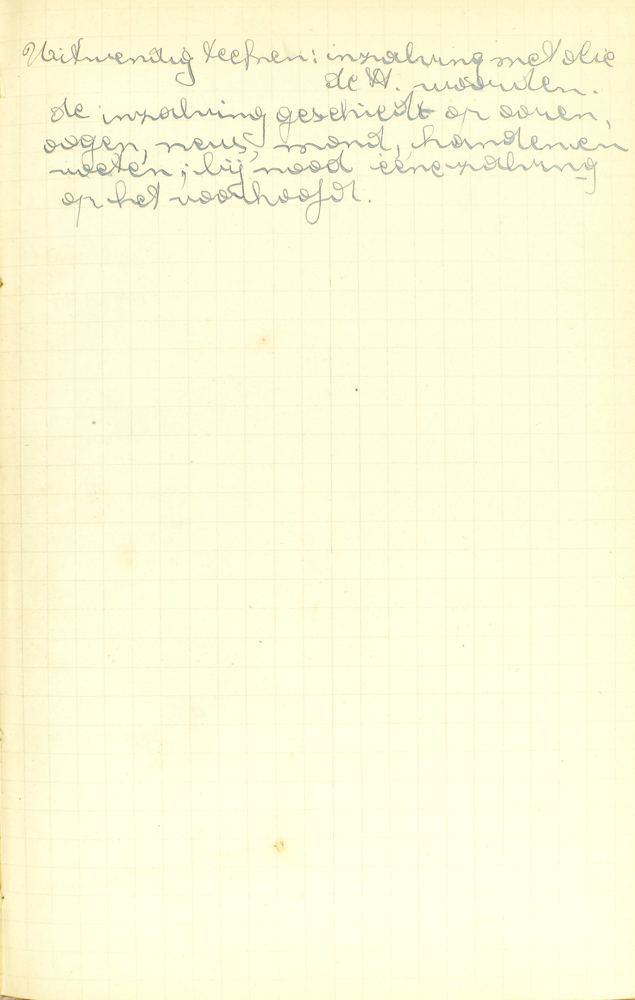
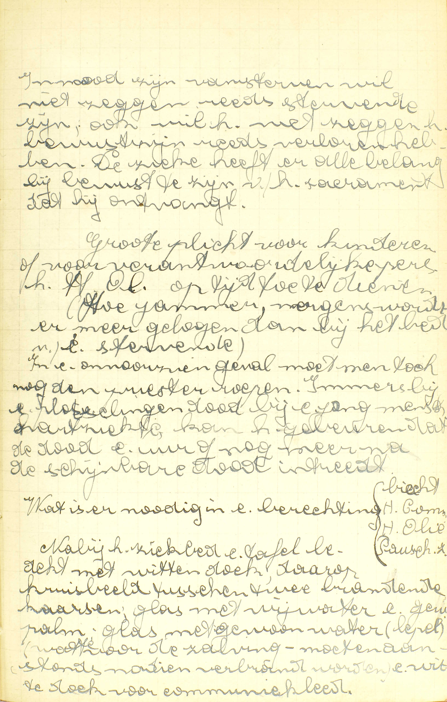
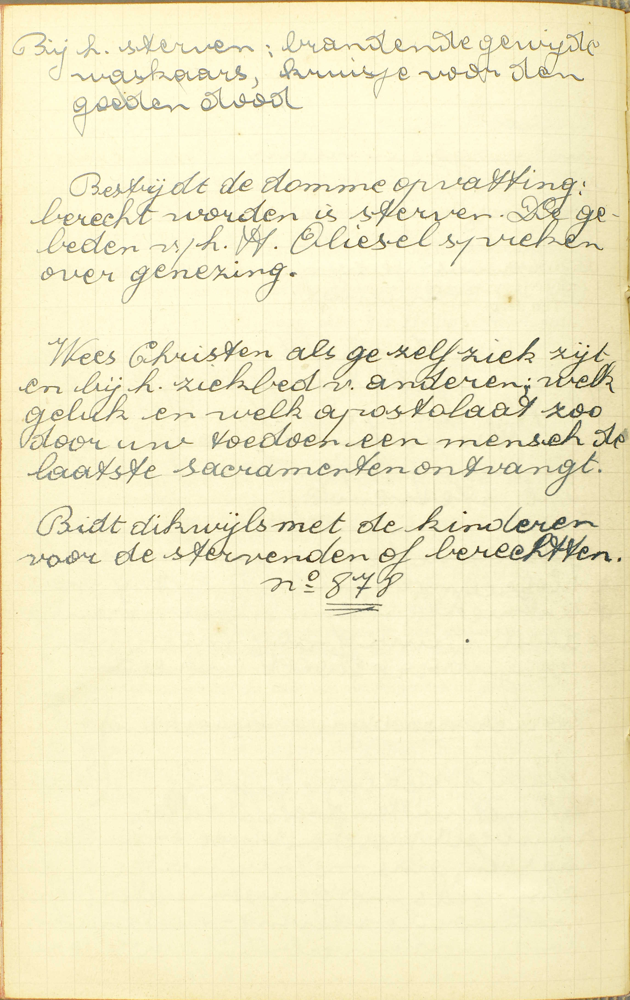
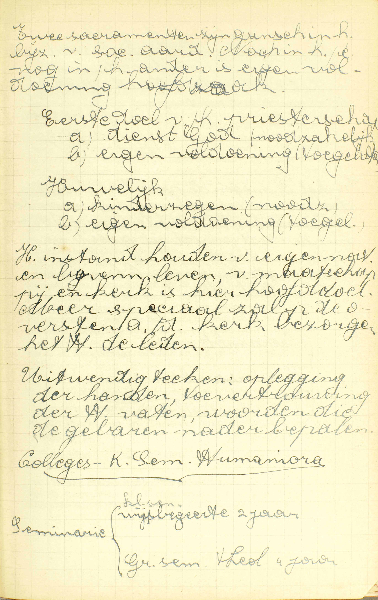
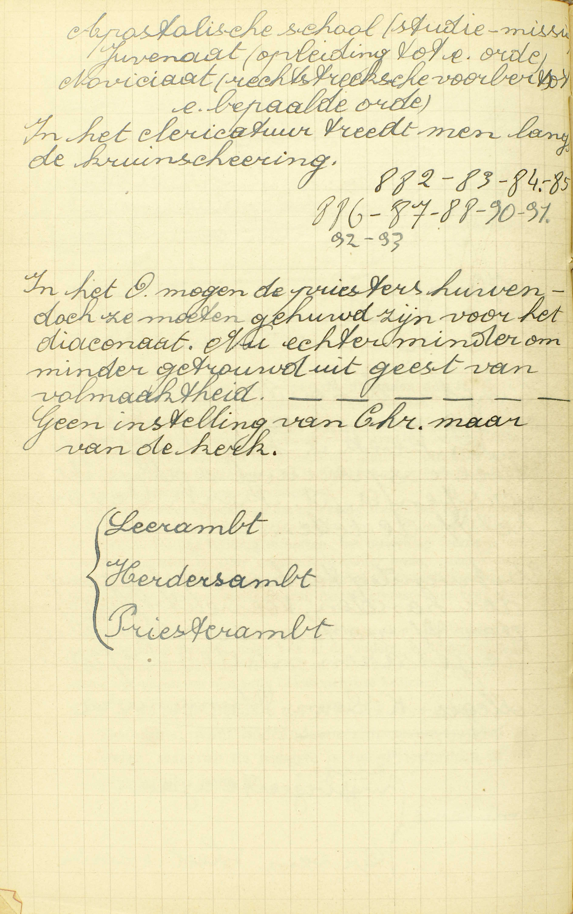
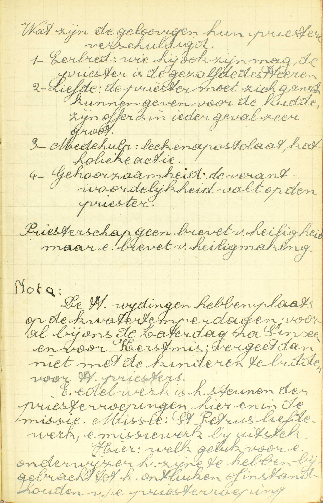
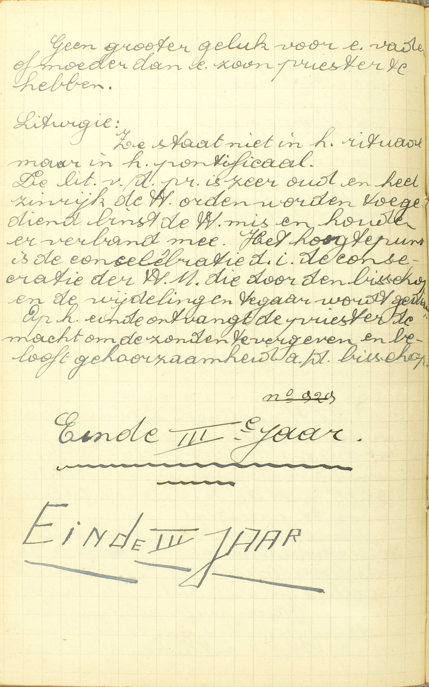

<table>
<tr>
  <td rowspan=4>**Het H. Oliesel**</td>
  <td rowspan=4 class=accolade></td>
  <td colspan=3>**Natuur**</td>
  <td></td>
  <td>*[Wat is het Heilig Oliesel?](#wat-is-het-heilig-oliesel)*</td>
</tr>
<tr>
  <td rowspan=3>Natuur nader bepaald</td>
  <td rowspan=3 class=accolade></td>
  <td rowspan=2>Gebruik</td>
  <td rowspan=2 class=accolade></td>
  <td>*[Aan wie wordt het Heilig Oliesel gegeven?](#aan-wie-wordt-het-heilig-oliesel-gegeven)*</td>
</tr>
<tr>
  <td>*[Hoe dikwijls mag men het Heilig Oliesel ontvangen?](#hoe-dikwijls-mag-men-het-heilig-oliesel-ontvangen)*</td>
</tr>
<tr>
  <td>Zonderline genade</td>
  <td></td>
  <td>*[Wat profijt geeft ons het Heilig Oliesel?](#wat-profijt-geeft-ons-het-heilig-oliesel)*</td>
</tr>
<tr>
  <td rowspan=4>**Het Priesterdom**</td>
  <td rowspan=4 class=accolade></td>
  <td colspan=3>**Natuur**</td>
  <td></td>
  <td>*[Wat is het Priesterdom?](#wat-is-het-priesterdom)*</td>
</tr>
<tr>
  <td rowspan=2>De dienaars van de H. Kerk</td>
  <td rowspan=2 class=accolade></td>
  <td>Verhevenheid</td>
  <td></td>
  <td>*[Zijn al de dienaars van de H. Kerk even groot?](#zijn-al-de-dienaars-van-de-heilige-kerk-even-groot)*</td>
</tr>
<tr>
  <td>Macht</td>
  <td></td>
  <td>*[Welke macht hebben de priesters meer dan de andere dienaren van de H. Kerk?](#welke-macht-hebben-de-priesters-meer-dan-de-andere-dienaren-van-de-heilige-kerk)*</td>
</tr>
<tr>
  <td colspan=3>**Voorwaarden**</td>
  <td></td>
  <td>*[Mag iedereen de Heilige Wijding ontvangen?](#mag-iedereen-de-heilige-wijding-ontvangen)*</td>
</tr>
</table>

# Wat is het Heilig Oliesel?

## Een Sacrament, in hetwelk door de heilige zalving de zieken in hun ziekten en hun uitersten nood verlicht en geholpen worden

  
  <em>Uitwendig teken: inzalving met olie, de Heilige woorden. De inzalving geschiedt op oren, ogen, neus, mong, handen en voeten. Bij nood een zalving op het voorhoofd.</em>

A. Het antwoord spreekt 1° van het uitwendig teken en 2° van de bijzondere genade van het H. Oliesel.

1° *Het uitwendig teken:* **de heilige zalving:** de zalving die de priester op enige delen van het lichaam, voornamelijk op de vijf zintuigen en op de voeten doet met olie van de bisschop daartoe gewijd, — en het volgende gebed, dat hij bij iedere zalving herhaalt: « Door deze heilige zalving en zijn allermildste barmhartigheid vergeve u God wat gij misdaan hebt door het gezicht,… door het gehoor,… enz. »

2° *De bijzondere genade:* **de zieken worden in hun ziekten en in hun uitersten nood verlicht en geholpen:** de zieken die in stervensgevaar zijn, ontvangen bijzondere verlichting en hulp tot hun eeuwige zaligheid. ([v. 4.](TODO))

Het uitwendig teken van het H. Oliesel doet er ons duidelijk de bijzondere genade van begrijpen; immers, de zalving met olie een natuurlijke middel zijnde om pijnen te verzachten, wonden te helen en zwakke ledematen te versterken, zo dient zij allerbest om een inwendige verzachting, genezing en versterking te betekenen, en het gebed van de priester leert ons, dat zij hier wezenlijk die betekenis heeft. Ook doordien de zintuigen en de voeten de bijzonderste werktuigen zijn tot de zonde, de bijzonderste oorzaken van bekoring, de bijzonderste uitwendige delen van het lichaam, zo is de zalving ervan zeer geschikt om aan te duiden dat het H. Oliesel ons meer en meer van de zonde zuivert, tegen de bekoringen versterkt en in geheel onze persoon verlicht en helpt. Daarbij nog de gebeden die in de wijding van de heilige olie gestort worden, leggen ons de kracht van dit Sacrament voor ogen, en de waardigheid van de bisschop, die de wijding verricht, doet de verhevenheid van dit Sacrament uitschijnen.

# Aan wie wordt het Heilig Oliesel gegeven?

## Aan de zieken, die, tot de jaren van verstand gekomen zijnde, in nood zijn van sterven

  
  <em>In nood zijn van sterven wil niet zeggen reeds stervende zijn. Ook wil het niet zeggen het bewustzijn reeds verloren hebben. De zieke heeft er alle belang bij bewust te zijn van het sacrament dat hij ondergaat. Grote plicht voor kinderen of verantwoordelijke personen het Heilig Oliesel op tijd toe te dienen. (Hoe jammer, nergens wordt er meer gelogen dan bij het bed van een stervende) In een onvoorzien geval moet men toch nog de priester roepen. Immers bij een plotselinge dood bij een mens, hartziekte, kan het gebeuren dat de dood een uur of nog meer na de schijnbare dood intreedt.  Wat is er nodig in een berechting: biecht, heilige Communie, heilige Olie, Pauselijke zegen. Nabij het ziekbed een tafel bedekt met witte doek, daarop kruisbeeld tusen twee brandende kaarsen, glas met wijwater en gewijde palm, glas met gewassen water (lepel), watte voor de zalving --- moet aanstonds nadien verbrand worden, een witte doek voor communiekleed.</em>
  
  <em>Bij het sterven: brandende gewijde waskaars, kruisje voor de goede dood. Bestrijd de domme opvatting: berecht worden is sterven. De gebeden van het Heilig Oliesel spreken over genezing. Wees Christen als ge zelf ziek zijt en bij het ziekbed van anderen. Welk geluk en welk apostolaat zo door uw toedoen een mens de laatste sacramenten ontvangt. Bid dikwijls met de kinderen voor de stervenden of berechten.</em>

Wie kan en mag het H. Oliesel ontvangen?

A. Om dit Sacrament te kunnen en te mogen ontvangen zijn er *drie* voorwaarden te vervullen: men moet:

1° **Ziek zijn:** aan een ware lichaamsontsteltenis lijden; daarom mag het H. Oliesel niet gegeven worden aan iemand die, niet door ziekte, maar b.v. ten gevolge van schipbreuk of van een rechterlijk vonnis in gevaar is van te verdrinken of op het punt van gedood te worden. Oude mensen wier krachten versterven, moeten als zieken beschouwd worden.

2° **Tot de jaren van verstand gekomen zijn:** onderscheid kunnen maken of kunnen maken hebben tussen goed en kwaad, en zo kunnen zondigen hebben of het nog kunnen. Bijgevolg mogen noch de kleine kinderen, noch de zinnelozen die nooit tot hun verstand gekomen zijn, dit Sacrament ontvangen.

3° **In nood zijn van sterven:** zich in een ziekelijke toestand bevinden die met het gevaar van welhaast te sterven verbonden schijnt. Dus moet men geenszins op het punt zijn van te sterven.

Het is van node dat men tot de jaren van verstand gekomen zij, omdat men niet eerder in zijn uiterste de verlichting eu hulp van het H. Oliesel kan genieten; dat men ziek zij en zelfs in nood van sterven, omdat dit Sacrament slechts ingesteld is om ons in de overgroten last van een dodelijke ziekte te verlichten en te helpen.

Men merke hierbij op dat het H. Oliesel, als Sacrament van de levenden, in staat van genade moet ontvangen worden, en dat men zich bijgevolg, vóór het te ontvangen, van zijn doodzonden moet zuiveren.

# Hoe dikwijls mag men het Heilig Oliesel ontvangen?

## Eéns in één ziekte, maar in verscheidene ziekten zo dikwijls als men zou hervallen wezen

V. Mag men, in gevaar van sterven, het H. Oliesel ontvangen zo dikwijls als men wil?

A. Men mag het maar **ééns** ontvangen **in één** en dezelfde dodelijke **ziekte,** of in één en hetzelfde gevaar van sterven; **maar in verscheidene** dodelijke **ziekten** van dezelfde of van verschillenden aard, **zo dikwijls als men** in een nieuw gevaar van sterven **zou hervallen wezen.** Dus zo dikwijls men, van een dodelijke ziekte bijna hersteld zijnde, wederom hervalt en in een nieuw gevaar van sterven komt, of zo dikwijls men, de H. Olie eens ontvangen hebbende, in een nieuwe ziekte valt en wederom in gevaar van sterven verkeert, mag men opnieuw de H. Olie ontvangen. In één woord, men mag het ééns ontvangen in ieder gevaar van sterven uit ziekte voorkomende. De reden is, dat het uitwerksel ervan, te weten: de verlichting eu de versterking van de zieke, zo lang duurt als het gevaar van sterven, maar ook niet langer dan dit gevaar.

# Wat profijt geeft ons het Heilig Oliesel?

## Ten eerste, het verlicht de zieken; ten tweede, het vermindert de bekoring; ten derde, het vergeeft de dagelijkse zonden; ten vierde, het neemt weg de vergetene doodzonden; ten vijfde, het helpt ook de zieken tot gezondheid, als het zalig is

V. De zin van de vraag is: hoe verlicht en helpt het H. Oliesel de zieken in hun ziekten en in hun uitersten nood?

A. **Ten eerste, het verlicht de zieken,** door de geruststelling van het gemoed en door de verzachting van de pijnen van het lichaam, alsook door de opwekking van de vurigheid door de zonde verflauwd.

**Ten tweede, het vermindert de bekoring,** die gewoonlijk in het gevaar van sterven heviger is dan ooit, zowel om reden van de verzwakking van het lichaam, als van de verdubbelde poging van de duivel. God houdt, uit hoofde van het ontvangen Sacrament, die bekoringen ten dele tegen, en Hij geeft meer genade om ze te overwinnen.

**Ten derde, het vergeeft de dagelijkse zonden,** 1° rechtstreeks, (ten minste waarschijnlijk) uit hoofde van de vermeerderde vriendschap met God door de vermeerdering van de heiligmakende genade teweeggebracht ([14ᵉ les v. 3](les-14.html#hoe-worden-de-dagelijkse-zonden-vergeven)), en 2° ook middellijker wijze, door leedwezen, gebeden en allerlei goede werken, tot dewelke de zieken, door de dadelijke genaden van dit Sacrament bewogen worden.

**Ten vierde, het neemt weg de vergeten doodzonden:** het geldt hier die zonden niet waar de zieke in een voorgaande goede Biecht of in een goede akte van volmaakt berouw niet op gedacht heeft, want deze zijn reeds vergeven: er is sprake van dezulke waar hij, nog op de ogenblik dat hij het H. Oliesel ontvangt, onvrijwillig mee besmet blijft, omdat hij verkeerdelijk gemeend heeft dat zijn berouw in zijn laatste Biecht, of zijn berouw buiten de Biecht voldoende genoeg waren; of omdat hij zijn ware doodzonden niet voor zulke aanziet; of omdat hij, in doodzonde zijnde, door krankzinnigheid buiten staat gesteld werd een akte van berouw te verwekken of te biechten; of nog, omdat hij, ten gevolge van zijn ziekte of van een andere oorzaak, niets meer weet van de doodzonden die hij sedert zijn laatste goede biecht, of sedert zijn laatste volmaakt berouw bedreven heeft, en er daarom geen nieuwe Biecht meer over spreekt, of geen nieuw volmaakt berouw meer tracht te verwekken. Nochtans moet de zieke, om door het H. Oliesel vergiffenis van zijn vergetene doodzonden te bekomen, een onvolmaakt berouw hebben, of er ten minste een gehad hebben dat nog voortduurt.

**Ten vijfde, het helpt de zieken tot gezondheid als het zalig is:** het helpt om de zieken van hun kwalen te genezen en tot de gezondheid weder te brengen, indien dit voor hun zaligheid noch schadelijk, noch minder profijtig is.

Door zijn vijf uitwerksels komt het H. Oliesel de zieke in zijn uitersten nood onder alle betrekken ter zaligheid helpen en verlichten: het verlost hem van de overblijvende zonden, die de zaligheid rechtstreeks beletten met hem de dagelijkse zonden en de vergetene dodelijke te vergeven; het wapent hem tegen het wedervallen, met hem te verlichten en met de bekoringen te verminderen; het geeft hem eindelijk de gelegenheid van nog veel te verdienen, met hem te verHehten en met hem te helpen tot gezondheid, als het zalig is.  — Omdat het H. Oliesel dient tot vergiffenis van de vergetene zonden, is het, in menige gevallen, de enige reddingsmiddel voor de stervenden zondaar.

# Wat is het Priesterdom?

## Een Sacrament, door hetwelk de dienaars van de Heilige Kerk macht ontvangen en genade om hun ambt bekwamelijk te bedienen

  
  <em>Twee sacramenten zijn gans in het bijzonder van sociale aard. Noch in het een, noch in het ander is eigen voldoening hoofdzaak. Eerste doel van het priesterschap: a) dienst van God (noodzakelijk), b) eigen voldoening (toegelaten). Huwelijk: a) kinderen (noodzakelijk), b) eigen voldoening (toegelaten). Het in stand houden van eigen natuur en bovenmenselijk leven, van maatschappij en kerk is hier hoofddoel.  Uitwendig teken: oplegging van de handen, toevertrouwing van de Heilige vaten, woorden die de gebaren nader bepalen. </em>
  
  <em>In het Oosten mogen de priesters huwen, doch ze moeten gehuwd zijn voor ht diaconaat. Nu echter minder om minder getrouwd uit geest van volmaaktheid. Geen instelling van Christus, maar van de kerk.</em>

A. Het antwoord doet ons enkel de bijzondere genade van dit Sacrament kennen: het geeft — **aan de dienaars van de H. Kerk:** aan degenen die de HH. Sacramenten moeten bedienen, de gelovigen onderwijzen en besturen — **macht:** het merkteken van de ziel waardoor zij hun ambt vermogen uit te oefenen — **en genade:** vermeerdering van de heiligmakende en recht tot de dadelijke genade — **om hun ambt bekwamelijk te bedienen:** om hun plichten op een gevoeglijke en heilige wijze te kunnen vervullen.

De Catechismus spreekt van het uitwendig teken van het Priesterschap niet, omdat men niet zeker weet, welk van al de delen die in de H. Kerk de Heilige wijding uitmaken, het uitwendig teken is van Christus ingesteld. — Deze onzekerheid echter brengt geen zwarigheid bij, daar de H. Kerk alles wat enigszins tot de geldigheid van het Sacrament zou kunnen vereist zijn, met de grootste nauwkeurigheid onderhoudt.

Men merke op dat het Sacrament van het Priesterschap niet enkel uit de priesterwijding bestaat, maar ook al de andere wijdingen begrijpt waardoor de dienaars van de H. Kerk, uit Christus’ instelling, macht en genade ontvangen om hun ambt bekwamelijk te bedienen.

# Zijn al de dienaars van de Heilige Kerk even groot?

## Geenszins, want onder deze zijn zeven trappen of staten, waarvan de hoogste is het Priesterdom of de priesterlijke staat

V. Hebben al de dienaars van de H. Kerk één en hetzelfde ambt, en zijn zij dus allen even groot?

A. **Geenszins,** zij zijn niet allen even groot; **want onder deze zijn zeven trappen of staten:** zeven verschillende graden of orden van ambten of dienaars, **waarvan de hoogste is het Priesterdom of de priesterlijke staat:** het priesterlijk ambt in de eigen zin des woords. De zes andere orden of staten zijn het *ostiariaat* (deurwaarderschap), het *lectoraat* (voorlezersambt), het *exorcizaat* (bezwaardersambt), het *acolitaat* (dienaarsambt), het *subdiaconaat* en het *diaconaat*. De vier eerste orden worden genoemd de *mindere;* de twee laatste en het Priesterdom, de *grote orden,* omdat deze de dienaar van de H. Kerk verplichten het kerkelijk officie te lezen, tot de dood toe in de geestelijken staat te blijven en de altijddurende zuiverheid te onderhouden, terwijl gene die verplichtingen niet medebrengen. Buiten deze orden bestaat nog de *tonsuur* of *kruinschering,* waardoor men van de andere gelovigen afgescheiden, onder de dienaars van de H. Kerk aangenomen en tot de wijdingen voorbereid wordt, alsmede recht krijgt om de geestelijke bedieningen te bekomen.

De H. Kerk leert dat het Priesterdom een Sacrament is; de godgeleerden houden als zeker dat het diaconaat ook een Sacrament uitmaakt; maar waarschijnlijk zijn de overige wijdingen enkel kerkelijke ceremoniën. Men denke echter niet dat de verschillende wijdingen verschillende Sacramenten zijn: zij maken slechts één Sacrament van het Priesterschap uit, omdat de een dient tot voltrekking van de andere. Dit Sacrament heet het *Priesterdom,* om reden dat het priesterdom er de hoogste trap van is; het heet nog de *Heilige Orden,* omdat het aan de H. Kerk dienaars verschaft en zo onder de gelovigen orde sticht.

# Welke macht hebben de priesters meer dan de andere dienaren van de Heilige Kerk?

## De macht om in Christus’ naam de zonden te vergeven, en door hun woord het brood en de wijn te veranderen in het lichaam en het bloed des Heren

  
  <em>Wat zijn de gelovigen hun priesters verschuldigd. 1) Eerbied: wie hij ook zijn mag, de priester is de gezalfde des Heren. 2) Liefde: de priester moet zich gans kunnen geven voor de kudde, zijn offer is in ieder geval zeer groot. 3) Medehulp: lekenapostolaat, katholieke actie. 4) Gehoorzaamheid: de verantwoordelijkheid valt op de priester. Priesterschap is geen brevet van heiligheid, maar een brevet van heiligmaking. Nota: De Heilige wijdingen hebben plaats op de kwatertemperdagen, vooral bij ons de zaterdag na Pinksteren en voor Kerstmis. Vergeet dan niet met de kinderen te bidden voor heilige priesters. Een edel werk is het steunen van de priesterroepingen, hier en in de missie. Missie: St. Petrus Liefewerk, een missiewerk bij uitstek. Hier: welk geluk voor een onderwijzer het zijne te hebben bijgebracht tot het ontluiken of instandhouden van een priesterroeping.</em>
  
  <em>Geen groter geluk voor een vader of moeder dan een zoon priester te hebben. Liturgie: Ze staat niet in het rituaal, maar in het pontificaal. De liturgie van de priester[wijding] is zeer oud en heel zinrijk. De Heilige orden worden toegediend binst de Heilige mis en houden er verband mee. het hoogtepunt is de concelebratie, d.i. de consecratie van de heilige Mis die door de bisschop en de wijdelingen tegaar wordt gedaan. Op het einde ontvangt de priester de macht om de zonden te vergeven en belooft gehoorzaamheid aan de bisschop.</em>

V. **Welke macht hebben de priesters,** die de hoogste trap van de dienaren van de H. Kerk uitmaken, **meer dan de andere dienaren van de H. Kerk:** meer dan de zes andere trappen of staten? — Het woord *priester,* dat uit zichzelf *ouderling* betekent, wordt overal gebezigd ter aanduiding van een man die aangesteld is om sacrificiën op te dragen, en zo als middelaar te dienen tussen God en de mensen.

A. De priesters hebben meer dan de andere dienaren van de H. Kerk deze *dubbele* macht:

1° **De macht om,** door de absolutie in de Biecht, **de zonden te vergeven,** niet uit hun eigen zelf, maar — **in Christus’ naam:** als afgezanten en plaatsvervangers van Christus;

2° De macht om — **door hun woord:** door de woorden die zij in de Consecratie uitspreken, **het brood en de wijn te veranderen in het lichaam en het bloed des Heren,** en zo het Sacrificie van de Mis op te dragen. ’t Is door deze tweede macht dat zij eigenlijk priester zijn: de eerste is er een voltrekking van, vermits het Sacrificie dient om God te verzoenen en zo de vergiffenis van de zonden te bekomen.

Buiten deze twee allerhoogste bedieningen zijn er nog andere, deels aan *alle priesters,* deels aan een bijzondere klasse van priesters, namelijk, aan de *hogepriesters* ot *bisschoppen* toebehorende. Alle priesters hebben nog de macht van te dopen, de H. Communie uit te delen, het H. Oliesel te bedienen, het woord Gods te verkondigen, de hun toevertrouwde christene gemeente, niet als wetgevers, maar als gezanten van de bisschop te besturen, en zelfs, met pauselijke toelating, het Vormsel te geven. De bisschoppen hebben daarenboven de macht van het Priesterdom en, zonder enige bijzondere toelating, het Vormsel te bedienen, alsook van het hun toevertrouwde bisdom als leraars, wetgevers en rechters onder het gezag van de Paus te besturen. In het uitoefenen van die macht moeten echter de bisschoppen en de priesters stiptelijk de voorschriften van de H. Kerk volgen.

Hieruit zal men niet besluiten dat het bisschopschap een bijzonderen staat uitmaakt: het is maar de hoogste graad van het priesterdom, dat het *enkel priesterdom* en het *hogepriesterdom* of *bisschopschap* begrijpt. Het schijnt zeker dat ook de bisschoppelijke wijding een Sacrament is.

# Mag iedereen de Heilige Wijding ontvangen?

## Geenszins, want de wijding van subdiaken, diaken en priester vereist zekere ouderdom, geleerdheid, en ook belofte van zuiverheid

A. **Geenszins** mag iedereen de Heilige Wijding ontvangen, **want de wijding van subdiaken, diaken en priester vereist zekere ouderdom,** namelijk de ouderdom van 21 volle jaren voor het subdiaconaat, van 22 voor het diaconaat en van 24 voor het priesterdom, — **geleerdheid:** de nodige geleerdheid om de Sacramenten wel te kunnen bedienen en de gelovigen te kunnen onderwijzen in alles wat hun ter zaligheid noodzakelijk of zeer dienstig is, — **en ook belofte van zuiverheid:** belofte namelijk van altijd in ongehuwden staat te blijven en alle zonde van onzuiverheid te vluchten. Deze drie voorwaarden, in hoofdzaak door Christus zelf gesteld, heeft de H. Kerk nader bepaald, en, zijn zij tot de grote orden vereist, dan mag ook niet eenieder de tonsuur en de kleine orden ontvangen. daar deze natuurlijk tot de grote leiden.

### Aanmerking

De zalving met de heilige olie en de woorden die de priester daarbij spreekt, betekenen heel klaar de verlichting en hulp ([v. 1](TODO)) of de vijf bijzondere profijten ([v. 4](TODO)), door de Catechismus opgegeven als zijnde de uitwerksels van het H. Oliesel op de stervenden zieke ([v. 1, 2°](TODO)). Uit hoofde van zijn uitwerksels kan en mag dit Sacrament slechts gegeven worden aan de zieken die tot de jaren van verstand gekomen zijnde, in nood zijn van sterven, en daar het zijn kracht behoudt zolang dezelfde dodelijke ziekte duurt, mag het maar eens in één ziekte ontvangen worden; in verscheidene ziekten echter, zo dikwijls als men zou hervallen wezen. — Al de heilige wijdingen die van Christus ingesteld zijn, en zo tot het Sacrament van het Priesterschap behoren, drukken klaarblijkend de macht en de genade uit, die de dienaars van de H. Kerk ontvangen om hun ambt bekwamelijk te bedienen: in de priesterlijke wijding, onder andere, ziet men allerduidelijkst, hoe de priester er de macht bekomt om de zonden te vergeven, en om het brood en de wijn in het lichaam en bloed van Christus te veranderen. — Uit de verhevenheid en de bestemming van de bijzondere genade van het Priesterschap blijkt, dat er bijzondere voorwaarden vereist zijn om dit Sacrament te mogen ontvangen.

### VRAGEN

Waarvan spreekt deze les? — Hoe wordt zij verdeeld? — Wat bevat ieder deel?

1. Zeg, met de Catechismus, welk het uitwendig teken is van het H. Oliesel. — Leg die woorden uit. — Welke is, volgens de Catechismus, de bijzondere genade van dit Sacrament? — Verklaar het antwoord. — Hoe dient dit uitwendig teken allerbest om die bijzondere genade uit te drukken?

2. Geef de zin van de vraag: *Aan wie wordt het H. Oliesel gegeven,* — Hoeveel en welke voorwaarden zijn, volgens de Catechismus, vereist, om het H. Oliesel te kunnen en te mogen ontvangen? — Leg die voorwaarden uit. — Toon hoe die vereisten natuurlijk uit de bijzondere genade des H. Oliesels vloeien. — Mag en kan iemand die ten gevolge van veroordeeling ter dood, op punt is van te sterven; een kind, dat het gebruik van het verstand nog niet bereikt heeft; een zieke, die slechts aan een kleine ontsteltenis lijdt, het H. Oliesel ontvangen? — Geef daar rekening van. — In welke staat moet men het H. Oliesel ontvangen, en waarom?

3. Geef de zin van de vraag: *hoe dikwijls mag men het H. Oliesel ontvangen?* — Verklaar al de woorden van het antwoord dat de Catechismus hierop geeft. — Hoe dikwijls dus mag men het ontvangen in iedere dodelijke ziekte? — Hoe dikwijls mag men het ontvangen in het leven? — Wat is vereist om het Heilig Oliesel, na het eens ontvangen te hebben, opnieuw te mogen ontvangen? — Geef de reden van de leer van de Catechismus op dit vraagstuk.

4. Verklaar, volgens de samenhang van de les, de vraag: *wat profijt geeft ons het Heilig Oliesel.* — Hoeveel en welke voordelen stelt de Catechismus hier voort — Lieg ze alle uit. — Toon hoe het H. Oliesel, door deze voordelen, de zieke ten opzichte van zijn zaligheid komt verlichten en helpen. — Hoe is dit Sacrament in in enige gevallen de enige reddingsmiddel voor de stervenden zondaar?

5. Zeg, met de woorden van de Catechismus, welke de bijzondere genade van het Priesterschap is. — Leg die woorden uit. — Waarom spreekt de Catechismus van het uitwendig teken van het Priesterschap niet? — Brengt de onzekerheid, nopens dit teken bestaande, geen zwarigheid bij? — Welke wijdingen komen onder de naam van Sacrament van het Priesterschap?

6. Verklaar de vraag: *Zijn al de dienaars van de H. Kerk even groot.* — Zeg, of zij allen even groot zijn, of niet. — Hoeveel trappen zijn er onder hen? — Welke is de hoogste? — Noem de zes andere trappen of staten. — Hoe noemt men de vier laagste, en hoe de drie hoogste, en waarom? — Wat verstaat men door de tonsuur, en wat krijgt men er door? — Is ieder van die wijdingen een waar Sacrament? — Maken de wijdingen, die van Christus ingesteld zijn, verschillende Sacramenten uit? — Geef er de reden van, — Welke zijn de namen van het Sacrament van het Priesterschap? — Leg ze uit.

7. Wat verstaat men overal door het woord *priester?* — Wat betekent dit woord door zichzelf? — Welke bijzondere macht is hun, volgens de Catechismus, eigen? — Leg die macht uit. — Toon hoe zij door die macht priester zijn. — Zijn er nog andere bedieningen, die aan de priester toebehoren,en welk onderscheid is er nopens deze onder de priesters te maken? — Welke bedieningen behoren nog alle priesters toe? — Welke zijn eigen aan de hogepriesters of bisschoppen? — Waarop moeten de bisschoppen en de enkele priesters letten in het uitoefenen van die macht? — Maakt het hogepriesterdom geen bijzonderen trap of staat uit, zoodanig dat er, onder de dienaars van de H. Kerk, acht trappen of staten zijn? — Geef er de reden van.

8. Zeg of iedereen zowel de Heilige Wijding als het heilig Doopsel mag ontvangen? — Wat is er, volgens de Catechismus, vereist tot de grote wijdingen? — Leg dit uit. — Indien die voorwaarden slechts tot de grote wijdingen vereist zijn, mag dus niet eenieder de tonsuur en de kleine wijdingen ontvangen? — Hoe zijn die voorwaarden vereist?

