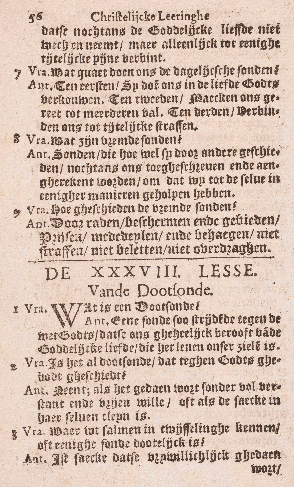
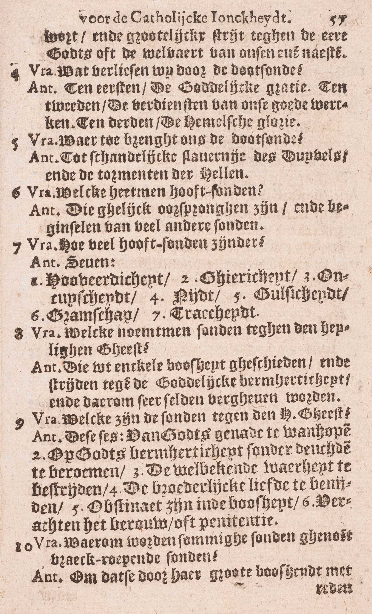
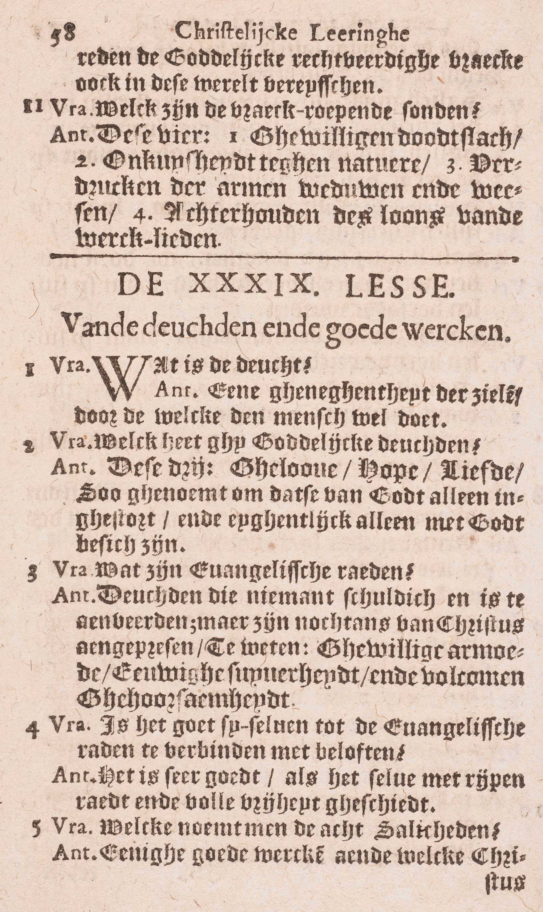
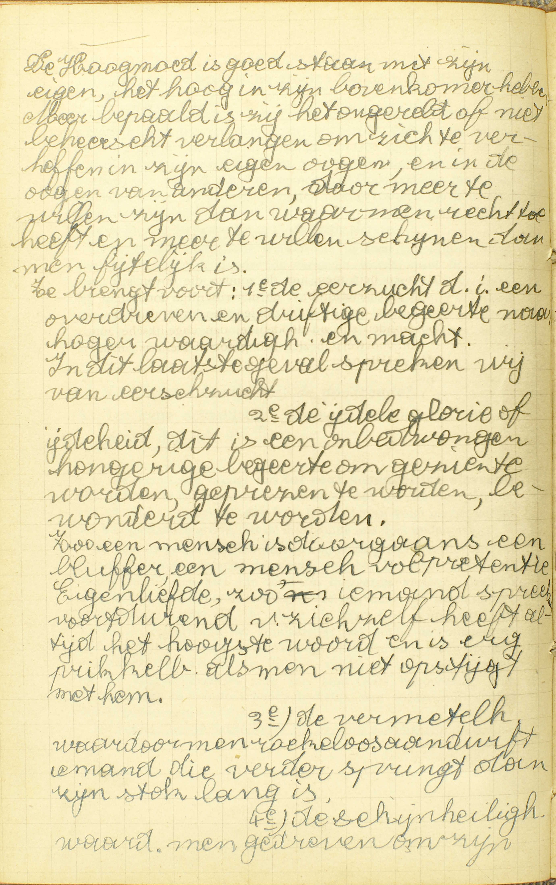
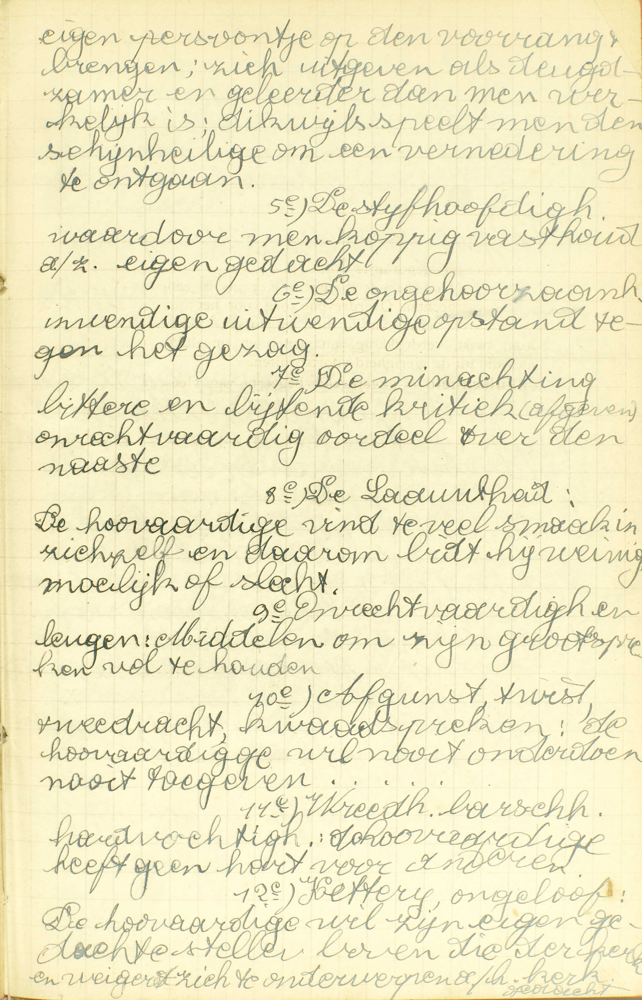
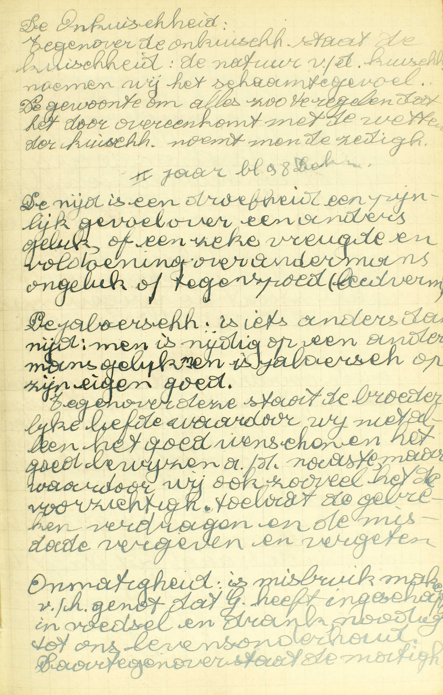
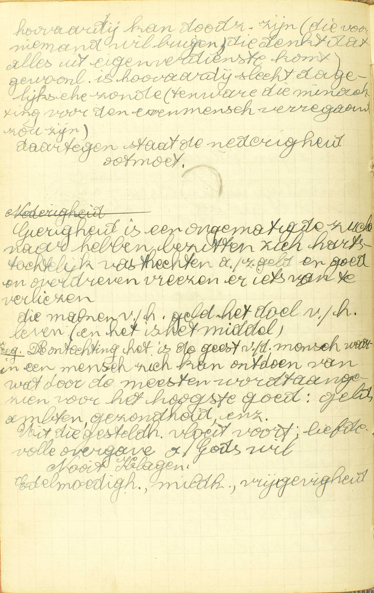
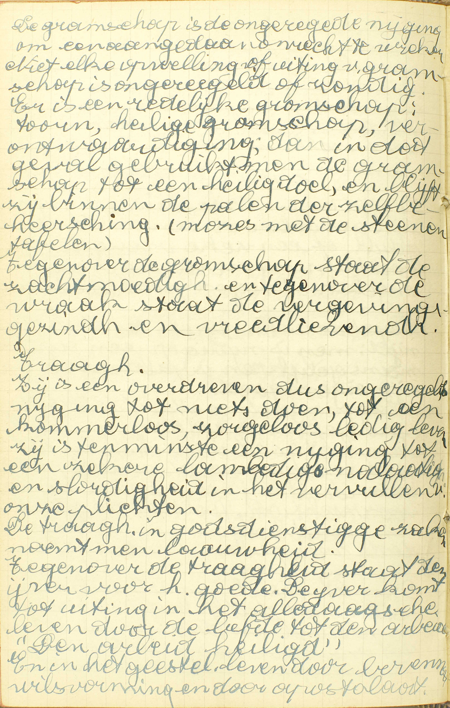
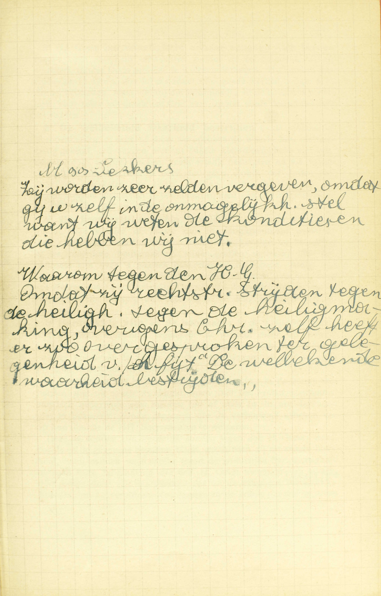

<table>
<tr>
  <td rowspan=5>**Doodzonde**</td>
  <td rowspan=5 class=accolade></td>
  <td colspan=2>Natuur</td>
  <td>*[Wat is een doodzonde?](#wat-is-een-doodzonde)*</td>
</tr>
<tr>
  <td rowspan=2>Vereiste voorwaarden</td>
  <td rowspan=2 class=accolade></td>
  <td>*[Is het al doodzonde, dat tegen Gods gebod geschiedt?](#is-het-al-doodzonde-dat-tegen-gods-gebod-geschiedt)*</td>
</tr>
<tr>
  <td>*[Waaraan zal men in twijfeling kennen, dat enige zonde dodelijk is?](#waaraan-zal-men-in-twijfeling-kennen-dat-enige-zonde-dodelijk-is)*</td>
</tr>
<tr>
  <td rowspan=2>Uitwerksels</td>
  <td rowspan=2 class=accolade></td>
  <td>*[Wat verliezen wij door de doodzonde?](#wat-verliezen-wij-door-de-doodzonde)*</td>
</tr>
<tr>
  <td>*[Waartoe brengt ons de doodzonde?](#waartoe-brengt-ons-de-doodzonde)*</td>
</tr>
<tr>
  <td rowspan=2>**Hoofdzonden**</td>
  <td rowspan=2 class=accolade></td>
  <td colspan=2>Natuur</td>
  <td>*[Wat heet men hoofdzonden?](#wat-heet-men-hoofdzonden)*</td>
</tr>
<tr>
  <td colspan=2>Getal en naam</td>
  <td>*[Hoeveel hoofdzonden zijn er?](#hoeveel-hoofdzonden-zijn-er)*</td>
</tr>
<tr>
  <td rowspan=2>**Zonden tegen de H. Geest**</td>
  <td rowspan=2 class=accolade></td>
  <td colspan=2>Natuur</td>
  <td>*[Welke noemt men zonden tegen de H. Geest?](#welke-noemt-men-zonden-tegen-de-h-geest)*</td>
</tr>
<tr>
  <td colspan=2>Getal en naam</td>
  <td>*[Welke zijn de zonden tegen de H. Geest?](#welke-zijn-de-zonden-tegen-de-h-geest)*</td>
</tr>
<tr>
  <td rowspan=2>**Wraakroepende zonden**</td>
  <td rowspan=2 class=accolade></td>
  <td colspan=2>Natuur</td>
  <td>*[Waarom worden sommige zonden genoemd wraakroepende zonden?](#waarom-worden-sommige-zonden-genoemd-wraakroepende-zonden)*</td>
</tr>
<tr>
  <td colspan=2>Getal en naam</td>
  <td>*[Welke zijn wraakroepende zonden?](#welke-zijn-wraakroepende-zonden)*</td>
</tr>
</table>

# Wat is een doodzonde?

## Een zonde, zó strijdende tegen de wet Gods, dat zij ons geheel berooft van de goddelijke liefde die het leven van onze zielen is

  
  
  

A. De doodzonde is **een zonde zó strijdende tegen de wet Gods:** een zó grote overtreding van Gods wet en wil, **dat zij ons geheel berooft — van de goddelijke liefde:** van de vriendschap Gods of van de heiligmakende genade, **die het leven van onze zielen is:** waardoor onze zielen instaatzijn de hemel te verdienen en zo voor de hemel leven. ([29ᵉ les, 6ᵉ vr.](les-29.html#wordt-de-kracht-van-de-sacramenten-ergens-door-belet)) Door deze zonde is onze ziel buiten staat om de hemel te bekomen en zo dood voor de hemel, gelijk iemand die buiten een spel gezet wordt, *dood* gezegd wordt voor de winst van het spel.

Al doodt de doodzonde het geestelijk leven van de ziel, en verdient zij juist daarom de naam van *doodzonde,* toch mag zij ook een *ziekte* genoemd worden; omdat het kwaad dat zij ons doet, nog herstelbaar is zolang wij op aarde zijn.

# Is het al doodzonde, dat tegen Gods gebod geschiedt?

## Neen, als het gedaan wordt zonder vol verstand en vrije wil, of als de zaak in haar zelve klein is

V. Zijn al de daden die tegen Gods gebod geschieden, zonder uitzondering doodzonden?

A. **Neen,** hetgeen tegen Gods gebod geschiedt, is geen doodzonde in *twee* gevallen:

1° **Als het gedaan wordt zonder vol verstand en vrije wil:** als men de zonde bedrijft zonder wel te weten of ten minste wel te menen dat zij een doodzonde uitmaakt, of zonder er ten volle in toe te stemmen.

2° **Als de zaak in haar zelve klein is:** als hetgeen tegen Gods gebod geschiedt, niet ernstig de orde stoort.

Om, gelijk de doodzonde, ons geheel van de goddelijke vriendschap te beroven, moet de zonde zeker een volkomen zijn, en ons geheel kunnen aangerekend worden; welnu opdat een zonde volkomen weze, moet zij ongetwijfeld in haar zelve gewichtig zijn, en tevens met volle verstand en vrijen wil geschieden: bijgevolg, waar één van deze twee voorwaarden ontbreekt, kan men onmogelijk een doodzonde hebben.

# Waaraan zal men in twijfeling kennen, dat enige zonde dodelijk is?

## Is 't dat zij vrijwillig gedaan wordt en ernstig strijdt tegen de eer Gods, of de welvaart van onze evennaaste

A. Men zal met zekerheid weten dat een zonde dodelijk is, als deze *twee* voorwaarden vervuld zijn:

1° **Is ‘t dat zij vrijwillig gedaan wordt:** indien zij met volle verstand en vrije wil geschiedt;

2° **En ernstig strijdt tegen de eer Gods, of de welvaart van onze evennaaste:** en in haar zelve gewichtig is, en dat is zij, als zij de eer die wij aan God verschuldigd zijn, ernstig schendt, of groot kwaad doet aan de naaste, waaronder wij eerst en vooral ons zelf te verstaan hebben.

Dit antwoord vloeit rechtstreeks uit het voorgaande: indien een zonde geen doodzonde is, als zij zonder vol verstand en vrijen wil geschiedt, of als de zaak in haar zelve klein is, dan moet men noodzakelijk oordelen dat zij dodelijk is, als zij geschiedt met vol verstand en vrije wil, en tevens de zaak in haar zelve groot is. Opdat men zich een zonde hebbe aan te rekenen, zijn *twee* dingen nodig: men moet 1° de wet Gods overtreden en 2° dit vrijwillig doen. Is de overtreding groot en tevens geheel vrijwillig, dan bedrijft men een volledige zonde, een doodzonde; is de overtreding integendeel klein, of niet gans vrijwillig, dan bedrijft men slechts een onvolledige, een dagelijkse zonde.

# Wat verliezen wij door de doodzonde?

## Ten eerste, de goddelijke genade; ten tweede, de verdiensten van onze goede werken; ten derde, de hemelse glorie

A. Door de doodzonde verliezen wij *drie* goederen:

**Ten eerste, de goddelijke genade:** de heiligmakende genade waardoor wij aangenomene kinderen Gods en erfgenamen van de hemel zijn;

**Ten tweede, de verdiensten van onze goede werken:** het recht tot vermeerdering van de heiligmakende genade, dat onze goede werken, werden zij in staat van genade gedaan, ons zouden verwerven, alsook het recht tot loon, dat onse voorgaande werken in staat van genade volbracht, ons reeds verworven hadden;

**Ten derde, de hemelse glorie:** het geluk van de Hemel, dat hoofdzakelijk in het aanschouwen van God bestaat.

Het is niet moeilijk om bewijzen, dat wij door de doodzonde wezenlijk deze drie verliezen doen: zij berooft ons van de heiligmakende genade, daar zij ons vijanden van God maakt; dan, uit dit verlies volgt noodzakelijk 1° dat van de verdiensten van onze goede werken: wie de titel van aangenomen kind Gods verloren heeft, kan onmogelijk nog de verdiensten en de loon verkrijgen die Gods aangenomene kinderen toekomt; 2° het verlies van de hemel, vermits deze de loon is van degenen die in Gods genade sterven.

De verdiensten van de goede werken die in staat van genade gedaan zijn, herleven als de doodzonde vergeven wordt; want zij werden door deze zonde niet vernietigd, maar enkel ontoepasselijk gemaakt. De verdiensten van de goede werken die in staat van doodzonde volbracht zijn, kunnen niet herleven, daar zij nooit bestaan hebben; deze goede werken nochtans zijn niet nutteloos; zij dienen immers om de bekering van de zondaar te bereiden.

# Waartoe brengt ons de doodzonde?

## Tot een schandelijke slavernij van de duivel en de pijnen van de hel

A. De doodzonde brengt ons **tot een schandelijke slavernij van de duivel** in dit leven, en, na de dood, **tot de** eeuwige **pijnen,** van schade en van gevoel, **van de hel.** Dit wederom volgt uit het verlies van de heiligmakende genade, dat de doodzonde ons doet ondergaan.

De staat van degenen die beroofd zijn van Gods genade, wordt *slavernij* genoemd, omdat, volgens de wetten van het Heidendom, diegene slaaf werd die de titel van kind des huisgezins verloor; — slavernij *van de duivel,* omdat het de duivel is die ons door zijn listen in die staat brengt; omdat hij, de eerste die tegen God is opgestaan, als 't ware het opperhoofd van de zondaars is; ook omdat de zondaars de pijnen van de hel, die het ware rijk van de duivel is, zullen te lijden hebben; — *schandelijke* slavernij van de duivel, omdat het voor een schepsel tot de allerverhevensten adel van kind Gods behorende, een schande is, en de hoogste schande denkelijk, aan de slavernij van de duivel onderworpen te zijn.

Nu kunnen wij gemakkelijk al het verschil tussen de dodelijke en de dagelijkse zonde verstaan: 1° de doodzonde is een volledige zonde; de dagelijkse, slechts een onvolledige; 2° de dodelijke zonde berooft ons ten volle van de heiligmakende genade; de dagelijkse doet ons enkel in de liefde Gods verflauwen; 3° de eerste verbindt ons tot de eeuwige pijnen; de laatste, uitsluitend tot tijdelijke.

# Wat heet men hoofdzonden?

## Die gelijk oorsprongen zijn en beginselen van vele andere zonden

A. Hoofdzonden heet men, niet de zonden die boven alle andere zwaar zijn: de godslastering b.v. en de vrijwillige doodslag zijn uit hun natuur erger dan de hoofdzonden; — noch die altijd dodelijk zijn: de hoofdzonden zijn nu dodelijke, dan dagelijkse zonden, volgens dat hun voorwerp in zichzelf groot of klein is; maar wel dezulke — **die gelijk oorsprongen en beginselen zijn van vele andere zonden:** die gelijk bronnen zijn waar vele andere zonden uit voortvloeien, of die ons tot vele andere zonden aanzetten of aandrijven. *Iedere* hoofdzonde is de bron van *vele* andere zonden; de *Zeven* Hoofdzonden zijn de bron van al de andere zonden. ([7ᵉ v.](TODO)) Zij veroorzaken en beheersea al de andere kwade werken, gelijk het hoofd al de andere ledematen beweegt en bestuurt: vandaar hun naam van *hoofdzonden.*

# Hoeveel hoofdzonden zijn er?

## Zeven: 1. Hoovaardigheid. 2. Gierigheid. 3. Onkuisheid. 4. Nijd. 5. Gulzigheid. 6. Gramschap. 7. Traagheid

  
  <em>De *Hoogmoed* is goed staan met zijn eigen, het hoog in zijn bovenkamer hebben. Meer bepaald is zij het ongeregeld of niet beheerst verlangen om zich te verheffen in zijn eigen ogen en in de ogen van anderen, door meer te willen zijn dan waar men recht toe heeft en meer te willen schijnen dan men feitelijk is. Ze brengt voort: 1ᵉ de *eerzucht,* d.i. een overdreven en driftige begeerte naar hoger waardigheid en macht. In dit laatste geval spreken wij van heerszucht. 2ᵉ De *ijdele glorie* of ijdelheid, dit is een onbedwongen hongerige begeerte om gezien te worden, geprezen te worden, bewonderd te worden. Zo een mens is doorgaans een bluffer, een mens vol pretentie. Eigenliefde, zo iemand spreekt voortdurend van zichzelf en heeft altijd het hoogste woord en is erg prikkelbaar als men niet opstijgt met hem. 3ᵉ De *vermetelheid* waardoor men roekeloos aandurft; iemand die verder springt dan zijn stok lang is.</em>
  
  <em>4ᵉ De *schijnheiligheid* waardoor men gedreven is om zijn eigen persoontje op de voorrang te brengen; zich uitgeven als deugdzamer en geleerder dan men werkelijk is; dikwijls speelt men de schijnheilige om een vernedering te ontgaan. 5ᵉ De *stijfhoofdigheid* waardoor men koppig vasthoudt aan zijn eigen gedacht. 6ᵉ De *ongehoorzaamheid,* inwendige en uitwendige opstand tegen het gezag. 7ᵉ De *minachting,* bittere en bijtende kritiek afgeven, onrechtvaardig oordeel over de naaste. 8ᵉ De *lauwheid:* de hovaardige vindt teveel smaak in zichzelf en daarom bidt hij weinig, moeilijk of slecht. 9ᵉ *Onrechtvaardigheid en leugen:* middelen om zijn grootspreken vol te houden. 10ᵉ *Afgunst, twist, tweedracht, kwaadspreken:* de hovaardige wil nooit onderdoen, nooit toegeven. 11ᵉ *Wreedheid, barsheid, hardvochtigheid:* de hovaardige heeft geen hart voor anderen. 12ᵉ *Ketterij, ongeloof:* de hovaardige wil zijn eigen gedachten stellen boven die van de kerk en weigert zich te onderwerpen aan de kerk.</em>
  
  <em>De *onkuisheid.* Tegenover de onkuisheid staat de kuisheid: de natuur van de kuisheid noemen we het schaamtegevoel. De gewoonte om alles zo te regelen dat het door overeenkomt met de wetten van de kuisheid, noemt men de *zedigheid.* De *nijd* is een droefheid, een pijnlijk gevoel over een anders geluk, of een zieke vreugde en voldoening over andermans ongeluk of tegenspoed (leedvermaak).  De *jaloersheid* is iets anders dan nijd: men is nijdig op een andermans geluk, men is jaloers op zijn eigen goed.  Tegenover deze staat de *broederlijke liefde,* waardoor wij niet alleen het goed wensen en het goed bewijzen aan de naaste, maar waardoor wij ook, zoveel het de voorzichtigheid toelaat, de gebreken verdragen en de misdaden vergeven en vergeten. *Onmatigheid* is misbruik maken van het genot dat God heeft ingeschapen in voedsel en drank, nodig tot ons levensonderhoud. Daartegenover staat de *matigheid.*</em>
  
  <em>*Hovaardij* kan doodzonde zijn (die van niemand wil buigen, die denkt dat alles uit eigen verdienste komt). Gewoonlijk is hovaardij slechts dagelijkse zonde (tenware die minachting voor de evenmens verregaand zou zijn). Daartegen staat de nederigheid of ootmoed. *Gierigheid* is een ongematigde zucht naar hebben, bezitten, zich hartstochtelijk vasthechten aan geld en goed en overdreven vrezen er iets van te verliezen. Die maken van het geld het doel van het leven (en het is het middel).  De *onthechting:* het is de geest van de mens waarin een mens zich kan ontdoen van wat door de meesten wordt aangezien voor het hoogste goed: geld, ambten, gezondheid, enz. Uit die gesteldheid vloeit voort: liefde, volle overgave aan Gods wil, nooit klagen, edelmoedigheid, mildheid, vrijgevigheid.</em>
  
  <em>De *gramschap* is de ongeregelde neiging om een aangedaan onrecht te wreken. Niet elke opwelling of uiting van gramschap is ongeregeld of zondig. Er is een *redelijke gramschap:* toorn, heilige gramschap, verontwaardiging; in dat geval gebruikt men de gramschap tot een heilig doel, en blijft zij binnen de palen van de zelfbeheersing (Mozes met de stenen tafelen). Tegenover de gramschap staat de *zachtmoedigheid* en tegenover de wraak staat de *vergevingsgezindheid en vredelievendheid*.  *Traagheid,* zij is een overdreven dus ongeregelde neiging tot niets doen, tot een kommerloos, zorgeloos, ledig leven. Zij is tenminsten een neiging tot een zekere lamlendige nalatigheid en slordigheid in het vervullen van onze plichten. De traagheid in godsdienstige zaken noemt men de *lauwheid.* Tegenover de traagheid staat de *ijver* voor het goede. De ijver komt tot uiting in het alledaagse leven door de liefde tot de arbeid: "De arbeid heiligt."</em> 

A. **Hoovaardigheid** is ongeregelde begeerte van eigen uitmuntendheid en van de eer die men er in zoekt. Wij begeren onze eigen uitmuntendheid op een *ongeregelde wijze* als wij de goederen die wij genieten, niet aan God, maar aan ons zelf toeschrijven, of ten minste voor de vrucht van onze persoonlijke verdiensten houden; als wij ons hoedanigheden toekennen die wij niet bezitten, of onze ware hoedanigheden vergroten, of boven onze verdiensten eer of macht willen bekomen, of anderen die minder begaafd zijn, vernederen of verachten, of buitenmate boven anderen willen uitschijnen, of hen willen overtreffen enkel om boven hen te zijn. De hoogmoedigheid brengt ons rechtstreeks tot ongehoorzaamheid, tot ijdele glorie en eerzucht, tot verzuimenis van onze godsdienstige plichten, tot ongeduldigheid. oplopendheid, tot leugentaal, veinzerij, achterklap, kwaadwenserij, enz.

**Gierigheid** is ongeregelde begeerte van allerhande aardse goederen. De begeerte van aardse goederen is *ongeregeld,* als wij deze zoeken, niet voor zoveel zij ons nuttig zijn om volgens onze staat te leven en onze ziel zalig te maken, maar uitsluitend om ze te hebben en er ons genot in te vinden; zij is het ook, als wij ze vuriger nastreven dan Gods geboden toelaten, of er ons op een onbehoorlijke wijze aan vasthechten. Overdreven zorg voor het tijdelijke, onmatige droefheid over verlies van fortuin, leugentaal, vals reden, diefstal, bedrog, twist, verdrukking van armen en ongelukkigen zijn alle zonden die uit de gierigheid voortspruiten.

**Onkuisheid** is ongeregelde begeerte van vleselijke lusten. Deze zonde geleidt tot allerlei misdaden, zelfs tot moord, ongelovigheid en wanhoop; zij is dik wijls de oorzaak van godslasteringen, verwensingen, heiligschenderijen, van zonden tegen de gehoorzaamheid en tegen de rechtvaardigheid, van gramschap, haat en nijd en andere zonden tegen de liefde.

**Nijd** is ongeregelde afkeer van ’s naasten uitmuntendheid, omdat men diens geluk als eigen ongeluk aanziet, en bijgevolg ook vreugde over 's naasten ongeluk, omdat men diens ongeluk als eigen geluk beschouwt ([25ᵉ les, v. 2.](les-25.html#misdoen-zij-allen-tegen-het-vijfde-gebod-die-metterdaad-iemand-hinderen)). Den nijd moet men wel onderscheiden van de *verontwaardiging,* waardoor wij misnoegd zijn over de rang, de eer, het geluk van de naaste, omdat wij denken dat hij er niet waardig van is of er misbruik zal van maken; alsook van de *naijver,* die bestaat in de begeerte van anderen in verdiensten, in be kwaamheid, enz, te evenaren en zelfs te overtreffen, niet omdat wij hun geluk als ons ongeluk beschouwen, maar omdat wij, met hun geluk te zien, beter begrijpen wat ons ontbreekt en aangemoedigd worden om meer en meer te werken. De nijd geeft aanleiding tot baat van de naaste, tot lastertaal en oorblazerij, ja zelfs tot haat van God.

**Gulzigheid** is ongeregelde begeerte van spijs en drank. Deze begeerte is *ongeregeld,* als men enkel eet of drinkt om het genot dat men daarin vindt, of als men in het eten of drinken overdaad doet, of als men het einde waar spijs en drank toe bestemd zijn, misacht en zich geheel aan het genot van de smaak overgeeft. Uit gulzigheid volgt onzuiverheid, onbetamelijkheid in gezangen, gramschap, godslastering, twist, verkwisting, verzuimenis van plichten, enz.

**Gramschap** is ongeregelde afkeer van toegebrachte schade en ongeregelde begeerte van er zich over te wreken ([25ᵉ les, v. 2](les-25.html#misdoen-zij-allen-tegen-het-vijfde-gebod-die-metterdaad-iemand-hinderen)). Men onderscheide de gramschap wel van de haat en van de nijd: in de haat wil men iemand kwaad tot zijn ongeluk; in de nijd is men droef over iemands geluk, omdat men diens geluk als eigen ongeluk aanziet; in de gramschap wenst men iemand op een ongeregelde wijze kwaad tot straf van zijn fouten of misdaden. De gramschap is een bron van haat, vijandschap, twist, verwensing, beschimping, vechtpartijen en doodslagen; zij is ook dikwijls oorzaak van godslasteringen en allerlei woeste werken.

**Traagheid** is ongeregelde afkeer van allen arbeid en last in het vervullen van zijn plichten. Wij hebben *ongeregelden* afkeer van arbeid en last, als wij aan onze natuurlijken afkeer daarvan, toegeven. Kleinmoedigheid, wanhoop, vermetelheid, verzuimenis van de godsdienstige plichten zijn dikwijls vruchten van de traagheid.

Men zal reeds opgemerkt hebben 1° dat de hoofdzonden niet enkel als slechte *daden* of akten, maar dikwijls als kwade *genegenheden* van de ziel of als *ondeugden* genomen worden; 2° dat iedere hoofdzonde tot die andere zonden aanzet, waar zij een middel vindt om haar einde te bereiken, of waar zij de naaste gelegenheid toe biedt. Hoe nu de Zeven Hoofdzonden de bron zijn van alle andere, zal duidelijk uit het volgende blijken. Alle zonde bestaat in iets dat ons aangenaam is (een goed) ongeregeld te begeren, of in iets dat ons onaangenaam voorkomt (een kwaad) ongeregeld te vluchten. Welnu er zijn maar *drie* hoofdsoorten van goederen die wij ongeregeld kunnen begeren, namelijk, onze uitmuntendheid boven anderen, allerlei tijdelijke bezittingen, het zingenot dat dubbel is: het smaakgenot en de lichamelijke wellusten, en *drie* kwaden, aan die drie goederen tegenovergesteld, waar wij ongeregelden afkeer van hebben: de uitmuntendheid van anderen die de onze belet, de schade in onze tijdelijke bezittingen, en de arbeid en last die tegenover de lichamelijke lusten staan; dus zijn er ook maar zeven hoofdzonden. namelijk vier ongeregelde begeerten: van eigen uitmuntendheid, van allerlei aardse goederen, van het smaakgenot en van de lichamelijke wellusten, of de hoogmoedigheid, de gierigheid, de gulzigheid en de onkuisheid; — en *drie* ongeregelde afgekeerdheden: van eens anders uitmuntendheid, van de schade in de tijdelijke bezittingen en van de arbeid en last aan 't vervullen van de plichten verbonden, of de nijd, de gramschap en de traagheid 

# Welke noemt men zonden tegen de H. Geest?

## Die uit enkele boosheid geschieden en strijden tegen de goddelijke barmhartigheid, en daarom zeer zelden vergeven worden

A. Men noemt zonden tegen de H. Geest dezulke die de *twee* volgende voorwaarden vervullen:

1° **Die geschieden,** niet onder de invloed van de driften en van de daaruitvloeiende zwakheid van de wil, maar — **uit enkele boosheid:** uit enkelen kwaden wil, of uit een wil die, zonder enige aanlokking van wege de driften, uit gans vrije verkiezing in de zonde toestemt;

2° **En strijden tegen de goddelijke barmhartigheid:** en gelegen zijn in het verwerpen en verachten van de middelen waardoor de goddelijke barmhartigheid ons tot de zaligheid geleidt, en zo die barmhartigheid zelve rechtstreeks bestrijden, **en daarom** dit eigen hebben, niet dat zij nooit, maar dat zij slechts **zeer zelden vergeven worden.**

De zonden *tegen de H. Geest* worden zo genoemd, omdat de *goddelijke liefde* of heiligheid, waartegen zij rechtstreeks strijden daar zij uit enkele boosheid geschieden, en de *goddelijke barmhartigheid,* die zij verwerpen, hoewel de drie goddelijke personen evenzeer toekomende, nochtans de H. Geest bijzonder worden toegeschreven ([11ᵉ les, v. 8](les-11.html#waarom-wordt-onze-heiligmaking-de-heilige-geest-toegeschreven) en [5ᵉ les, v. 8](les-05.html#waarom-wordt-god-de-vader-meer-dan-de-zoon-almachtig-genoemd)).

# Welke zijn de zonden tegen de H. Geest?

## Deze zes: 1. Van Gods genade wanhopen. 2. Op Gods barmhartigheid zonder deugden zich beroemen. 3. De welbekende waarheid bestrijden. 4. De broederlijke liefde benijden. 5. Hardnekkig zijn in de boosheid. 6. Verachten het berouw of de penitentie

  
  <em>Zij worden zeer zelden vergeven, omdat gij u zelf in de onmogelijkheid stelt, want wij weten de condities en die hebben wij niet. Waarom *tegen de Heilige Geest*? Omdat zij rechtstreeks strijden tegen de heiligheid, tegen de heiligmaking, overigens Christus zelf heeft er zo over gesproken ter gelegenheid van het feit: "De wlbekende waarheid bestrijden."</em>

A. De zonden tegen de H. Geest zijn **deze zes:**

1° **Van Gods genade wanhopen,** het eeuwig leven en al wat ons daartoe helpen kan, niet uit enkele kleinmoedigheid, maar met opzet van God niet willen verzoeken en verwachten ([21ᵉ les, 2ᵉ vr.](les-21.html#welke-zonden-geschieden-tegen-het-eerste-gebod)). Zonde van Cain en van Judas.

2° **Op Gods barmhartigheid zonder deugden zich beroemen:** zijn zaligheid verwachten zonder de doodzonde te willen vluchten, zonder Gods geboden te willen volbrengen. Hij zondigt dus tegen de H. Geest, niet die enkel zijn goede werken hoger acht dan zij verdienen, maar wel hij die stoutmoedig in de boosheid voortleeft, voor zeker houdende dat God hem op het einde van het leven wel zal redden.

3° **De welbekende waarheid bestrijden:** de goddelijke Openbaring, of een of meer geopenbaarde waarheden, als dusdanig gekend, wij zeggen niet uit enkele kleinmoedigheid niet aannemen of in twijfel trekken, maar stellig bestrijden en als vals en twijfelachtig trachten te doen doorgaan. Zonde van de Joden die door vele mirakelen van Jezus’ zending overtuigd, Hem als de waren Messias weigerden te erkennen; zonden ook van de ongelovigen en van de ketters ([21ᵉ les, 2ᵉ vr](les-21.html#welke-zonden-geschieden-tegen-het-eerste-gebod)).

4° **De broederlijke liefde benijden:** bedroefd zijn, niet omdat onze broeder of naaste ons in deugdzaamheid overtreft, maar omdat God hem liefheeft en hem dientengevolge, ter bekering of ter meerdere heiligmaking, zijn genaden verleent; dus ook bedroefd zijn over ‘s naasten bekering of heiligheid. Zonde van Caïn, van de Joden die hardnekkig verbitterd waren over de roep van de Heidenen tot het Christelijk Geloof, van de goddeloze en slechte Christenen die met spijt de bekering of de deugdzaamheid van de naaste zien.

5° **Hardnekkig zijn in de boosheid:** in de zonde voortgaan, niet uit enkele krankheid tegenover de driften, maar uit kwaadwilligheid en ondanks de vermaningen waardoor God tot bekering opwekt. Zonde van de Joden die de vermaningen van God en zijn profeten verstootten en verachtten.

6° **Verachten het berouw of de penitentie:** in de zonde volharden, niet uit enkele zwakheid, maar met het kwaad voornemen van zich gedurende een zekeren tijd of zelfs in het uur van de dood niet te bekeren. Zonde van degenen die de verbintenis aangaan van op hun uiterste de HH. Sacramenten te weigeren.

Deze zes zonden zijn wezenlijk zonden tegen de H. Geest; want, zoals uit de gegevene bepaling blijkt, geschieden zij uit enkele boosheid, en zij strijden rechtstreeks tegen de goddelijke barmhartigheid of tegen onze zaligmaking die de H. Geest toegeschreven wordt, daar men door alle iets verstoot dat tot de zaligheid vereist is. Immers, om de vergiffenis van de zonden en de genade om wel te leven van God te kunnen verhopen en verkrijgen, moeten wij 1° de barmhartigheid Gods erkennen en er kunnen op rekenen; 2° weten wat er te doen is om de vergiffenis en die genade te verwerven, alsmede de krachten bezitten om die middelen aan te wenden; 3° de vereiste middelen wezenlijk gebruiken of de zonde verfoeien en het vast voornemen maken van niet meer te zondigen. Welnu, met van Gods genade te wanhopen, verachten wij zijn barmhartigheid; met op Gods barmhartigheid zonder deugden zich te beroemen, miskennen wij zijn rechtvaardigheid; met de welbekende waarheid te bestrijden, verstoten wij het licht dat ons de weg van de zaligheid moet tonen; met de broederlijke liefde te benijden, verwerpen wij de genade die ons de kracht geeft om die weg te volgen; met hardnekkig te zijn in de boosheid en het berouw of de penitentie te verachten, doen wij juist het tegenovergestelde van hetgeen vereist is om zich wezenlijk te bekeren.

# Waarom worden sommige zonden genoemd wraakroepende zonden?

## Omdat zij door hun grote boosheid met reden de goddelijke rechtvaardige wraak, ook in deze wereld, vereisen

A. Zij worden wraakroepende zonden genoemd, **omdat zij — door hun grote boosheid:** door de buitengewone schending van de geestelijke of wereldlijke orde, en de onrust die zij in de samenleving veroorzaken, **de goddelijke rechtvaardige wraak,** niet uitsluitend in het ander leven, **maar ook in deze wereld,** zo niet in teder geval, dan toch van tijd tot tijd, **vereisen,** ten einde er de mensen, uit vrees van deze tijdelijke straffen, van te weerhouden.

# Welke zijn wraakroepende zonden?

## Deze vier: 1. Vrijwillige doodslag. 2. Onkuisheid tegen de natuur. 3. Verdrukking van armen, weduwen en weezen. 4. Achterhouding van de loon van de werklieden

A. Wraakroepende zonden zijn **deze vier:**

1. **Vrijwillige doodslag:** iemand zonder wettige macht en reden vrijwillig doden, op welke wijze dit ook moge geschieden. Caïn heeft deze zonde bedreven en is er ook hier op de aarde om gestraft geweest.

2. **Onkuisheid tegen de natuur:** onkuise werken die, niet uitsluitend door de wet Gods, en de rechte rede verboden zijn, maar nog strijden tegen de natuurlijke bestemming van onze natuurlijke neigingen en krachten. Zonde van Sodoma en Gomorrha, hier op de wereld schrikkelijk gewroken.

3. **Verdrukking van armen, weduwen en weezen:** de armen, weduwen en weezen in hun rechten krenken. Hen enkel niet bijstaan gelijk de liefde vereist, dat is geen wraakroepende zonde.

4. **Achterhouding van de loon van de werklieden:** onrechtvaardig zijn jegens zijn werklieden.

Elkeen verstaat dat de orde, de vrede en rust in de samenleving niet zouden kunnen bestaan, moesten deze zonden dikwijls geschieden. — Deze vier zonden brengen immers de naaste de grootste schade mogelijk toe in zijn vier goederen: het leven, de zuiverheid, de tijdelijke rijkdommen, de faam of reputatie.

### VRAGEN

Waarvan spreekt deze les? — Hoe wordt zij verdeeld? — Zeg wat er in ieder deel geleerd wordt.

1. Zeg, met de Catechismus, hoe de doodzonde tegen de wet Gods strijdt. — Leg het antwoord uit. — Hoe verschilt, onder dit opzicht, de dagelijkse zonde van de doodzonde? — Geef hieruit rekenschap van de naam *doodzonde?* — Hoe kan de doodzonde ook een ziekte genoemd worden?

2. Verklaar de vraag: *Is het al doodzonde dat tegen Gods gebod geschiedt?* — Is alle zonde altijd doodzonde? — In hoeveel en in welke gevallen is, volgens de Catechismus, een zonde geen doodzonde? — Verklaar het antwoord. — Geef de reden waarop die leer steunt.

3. Hoeveel en welke voorwaarden zijn er, volgens de Catechismus, vereist, opdat een zonde doodzonde zou wezen? — Leg deze voorwaarden uit. — Geef rekenschap van die vereiste voorwaarden.

4. Zeg, met de Catechismus, hoeveel en welke verliezen de doodzonde ons doet ondergaan. — Leg ze alle uit. — Toon hoe de doodzonde die verliezen teweegbrengt.

5. Zeg, met de Catechismus, waartoe de doodzonde ons brengt hier op de aarde, en na onze dood. — Leg het antwoord uit. — Hoe wordt de staat van beroving van de heiligmakende genade met reden *een schandelijke slavernij van de duivel* genoemd? — Hoe bewijst men dat de doodzonde ons tot het gezegde lot brengt? — Stel geheel het verschil voor, dat tussen de dodelijke en de dagelijkse zonde bestaat.

6. Zeg welke zonden onder de naam van *hoofdzonden* enigszins kunnen komen, maar er toch niet onder verstaan worden. — Zeg, met de Catechismus, welke zonden onder die naam komen. — Leg het antwoord uit. — Geef rekenschap van de naam *hoofdzonde.* — Zeg of de hoofdzonden de oorsprong zijn, slechts van vele zonden, ofwel van al de zonden mogelijk.

7. Hoeveel hoofdzonden zijn er? — Stel ze voor en leg ze alle uit. — Zijn zij doodzonden of dagelijkse zonden? — Hoe worden zij verdeeld? — Hoe zijn zij de bron van alle andere zonden?

8. Welke voorwaarden zijn er, volgens de Catechismus vereist, om een zonde tegen de H. Geest te hebben? — Verklaar deze. — Wat is er, volgens de Catechismus, aan deze zonden eigen, onder opzicht van vergeving? — Leg die woorden van de Catechismus uit. — Geef de reden van deze eigenschap. — Waarom worden deze zonden genoemd *zonden tegen de H. Geest;* is het omdat zij tegen de H. Geest alleen strijden, of waarom is het?

9. Verklaar de zonden tegen de H. Geest, die de Catechismus noemt. — Toon dat al die zonden wezenlijk zonden tegen de H. Geest zijn.

10. Welke wraak eisen de wraakroepende zonden en waar? — Hoe dikwijls eisen zij die wraak? — Zeg, met de Catechismus, waarom zij zulk een wraak vereisen. — Leg uw antwoord uit. — Waartoe dient de wraak die zij eisen?

11. Hoeveel wraakroepende zonden zijn er? — Stel ze voor en leg ze uit.

