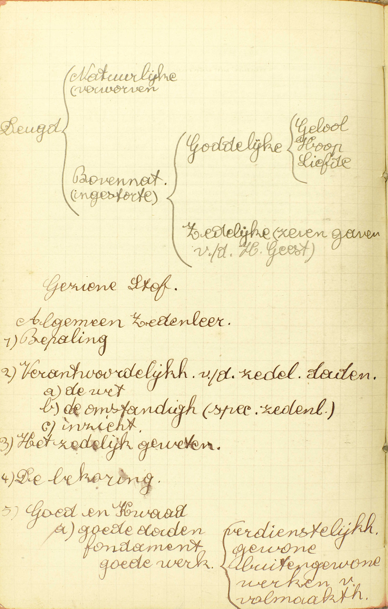
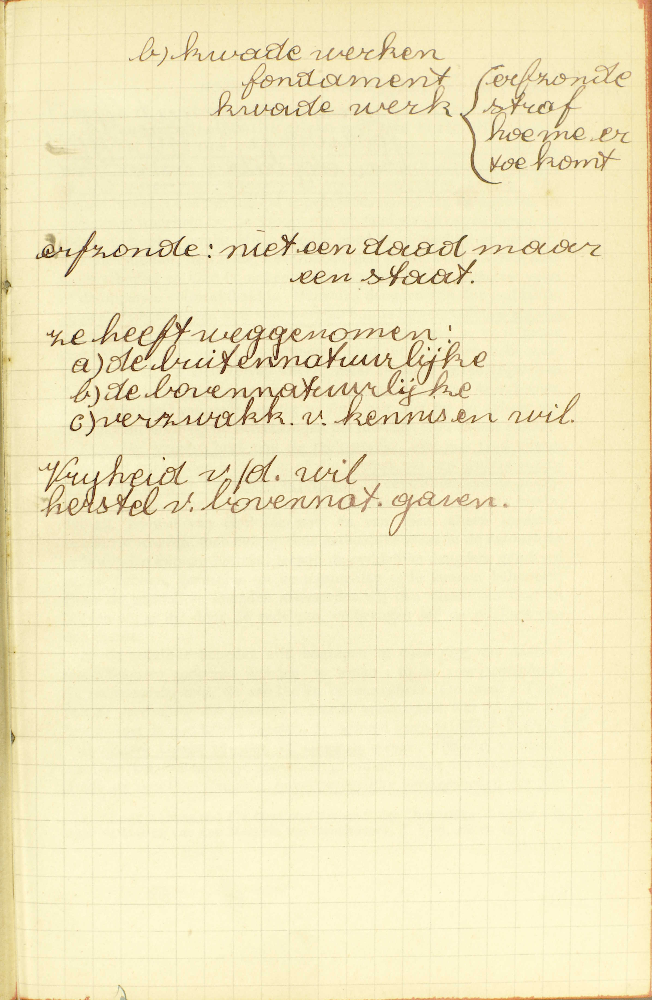
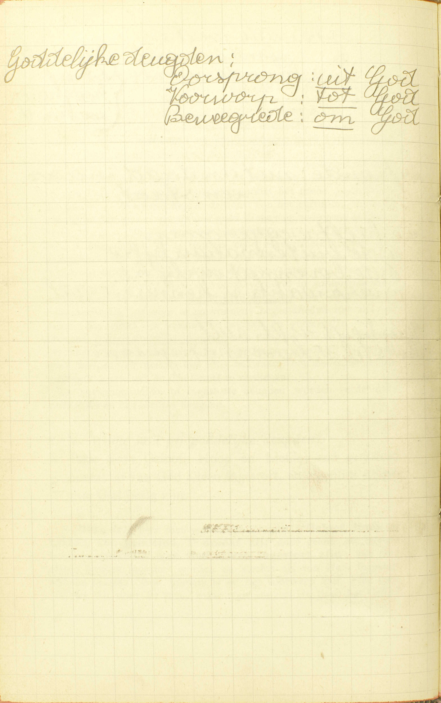
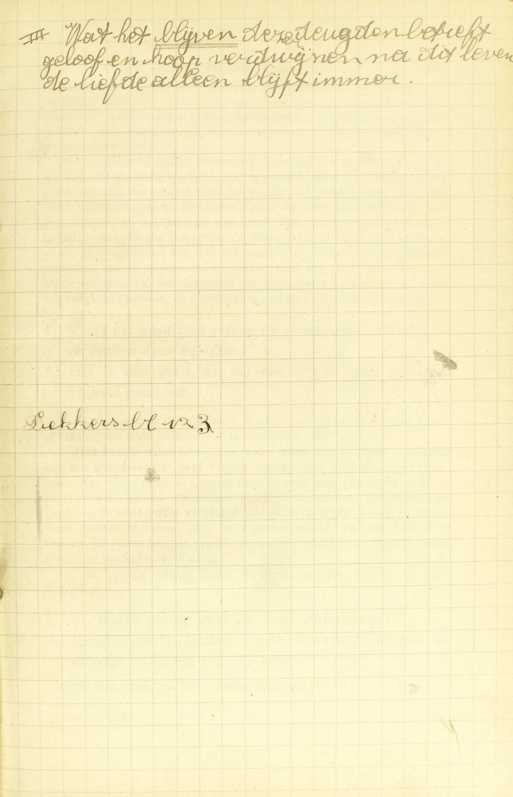

<table>
<tr>
  <td rowspan=2 colspan=3>**De Deugd**</td>
  <td rowspan=2 class=accolade></td>
  <td colspan=2>Natuur</td>
  <td>*[Wat is de deugd?](#wat-is-de-deugd)*</td>
</tr>
<tr>
  <td colspan=2>Goddelijke deugden</td>
  <td>*[Welke heet gij goddelijke deugden?](#welke-heet-gij-goddelijke-deugden)*</td>
</tr>
<tr>
  <td rowspan=8>**Goede werken waartoe de deugd ons genegen maakt**</td>
  <td rowspan=8 class=accolade></td>
  <td rowspan=5>Bijzondere soorten van goede werken</td>
  <td rowspan=5 class=accolade></td>
  <td rowspan=2>De Evangelische Raden</td>
  <td rowspan=2 class=accolade></td>
  <td>*[Wat zijn Evangelische Raden?](#wat-zijn-evangelische-raden)*</td>
</tr>
<tr>
  <td>*[Is het goed zichzelf tot Evangelische Raden te verbinden door beloften?](#is-het-goed-zichzelf-tot-evangelische-raden-te-verbinden-door-beloften)*</td>
</tr>
<tr>
  <td rowspan=2>De Acht Zaligheden</td>
  <td rowspan=2 class=accolade></td>
  <td>*[Welke noemt men de Acht Zaligheden?](#welke-noemt-men-de-acht-zaligheden)*</td>
</tr>
<tr>
  <td>*[Zeg de Acht Zaligheden](#zeg-de-acht-zaligheden)*</td>
</tr>
<tr>
  <td colspan=2>De vruchten van de H. Geest</td>
  <td>*[Welke zijn de Vruchten van de Heilige Geest?](#welke-zijn-de-vruchten-van-de-heilige-geest)*</td>
</tr>
<tr>
  <td rowspan=3>Verdiensten van de goede werken</td>
  <td rowspan=3 class=accolade></td>
  <td colspan=2>Het profijt dat zij ons doen</td>
  <td>*[Wat profijt doen ons de goede werken?](#wat-profijt-doen-ons-de-goede-werken)*</td>
</tr>
<tr>
  <td colspan=2>Ons recht tot dat profijt</td>
  <td>*[Is God ons iets schuldig voor onze goede werken?](#is-god-ons-iets-schuldig-voor-onze-goede-werken)*</td>
</tr>
<tr>
  <td colspan=2>Oorsprong van de kracht van onze goede werken</td>
  <td>*[Waaruit hebben onze werken de kracht om de hemel te verdienen?](#waaruit-hebben-onze-werken-de-kracht-om-de-hemel-te-verdienen)*</td>
</tr>
</table>

# Wat is de deugd?

## Een genegenheid van de ziel, door dewelke de mens weldoet

  
  

A. Tot een deugd zijn *drie* dingen vereist: 1° een *genegenheid,* 2° een genegenheid *van de ziel,* 3° een genegenheid van de ziel *door dewelke de mens weldoet.*

De deugd is niet een daad noch een voorbijgaande gesteltenis, maar **een genegenheid:** een bijblijvende geschiktheid, niet van de ledematen van het lichaam, maar — **van de ziel:** van de vermogens van de ziel, namelijk, van het verstand, van de wil en ook van de begeerlijke zinnelijkheid voor zoveel deze aan het verstand en de wil moet onderworpen zijn ; — **door dewelke de mens,** niet enkel kan weldoen, maar — **weldoet:** wezenlijk genegen is en bereid om het goed te doen, als de gelegenheid zich aanbiedt.

Een goed werk is geen deugd, omdat het geen *genegenheid* maar het uitwerksel van een genegenheid is; — de lichamelijke behendigheid tot een zeker werk is het ook niet, omdat het geen geschiktheid van de *ziel* is; — de wetenschap en de kunst zijn het evenmin, omdat zij zowel tot het kwaad als tot het goed dienen en zo geen genegenheden zijn door dewelke de mens *weldoet;* — maar de gehoorzaamheid is een deugd: zij is immers een genegenheid, en wel een genegenheid van de ziel, en zij maakt ons bereidvaardig om het goed te doen, namelijk, om ons aan onze wettige oversten te onderwerpen.

De deugden worden eerst en vooral verdeeld in *natuurlijke* en in *bovennatuurlijke* deugden. Natuurlijke deugden zijn ingeborene of door herhaalde oefening aangewonnene begaafdheden van de ziel; zij dienen dus enkel om natuurlijke werken en verdiensten voort te brengen, Bovennatuurlijke deugden zijn deugden die al de krachten van de schepselen te boven gaan, en door loutere goedheid Gods ingestort worden; zij maken ons dus bekwaam om bovennatuurlijke werken te verrichten en de hemel te verdienen.

De bovennatuurlijke of ingestorte deugden worden verdeeld in *goddelijke* en in *zedelijke* deugden.

# Welke heet gij goddelijke deugden?

## Deze drij: Geloof, Hoop en Liefde; zo genoemd, omdat zij van God alleen ingestort, en eigenlijk alleen met God bezig zijn

  
  
  <em>Wat het blijven van deze deugden betreft: geloof en hoop verdwijnen na dit leven, de liefde alleen blijft immer.</em>

A. **Deze drie** heet men goddelijke deugden: **Geloof, Hoop en Liefde, zo genoemd,** 1° **omdat zij,** door geen geschapene krachten aanwinlijk, **van God alleen ingestort zijn:** van God alleen kunnen ingestort worden en slechts als van Hem ingestort kunnen bestaan; God immers is er het voorwerp van, niet voor zoveel Hij door de rede, maar voor zoveel Hij door het Geloof gekend is, en zo veronderstellen zij een bovennatuurlijken oorsprong, — en 2° **omdat zij eigenlijk alleen met God bezig zijn:** omdat zij op God en op God alleen betrekking hebben; i.a.w. omdat de werken waartoe zij ons genegen maken, God in zichzelf beschouwd en God alleen voor *voorwerp* en voor *beweegreden* hebben. Het Geloof beweegt ons om in God te geloven, omdat Hij de opperste en onfaalbare waarheid is; de Hoop, om op God als op onze helper en loner te hopen, omdat Hij oneindig goed is, almachtig en getrouw in zijn beloften; de Liefde, om God en de naaste voor zoveel deze Gods schepsel en kind is, te beminnen, omdat Hij het opperste goed of de opperste volmaaktheid is. Deze drie deugden zijn dus goddelijk, zowel uit hoofde van hun voorwerp en hun beweegredenen als van hun oorsprong. Integendeel de godsdienstigheid b.v. is geen goddelijke deugd omdat zij, alhoewel God tot voorwerp hebbende, Hem toch niet in zichzelf alleen, maar in zijn betrekkingen van Schepper, Heer en Regeerder van de geschapene wezens aanschouwt. De verplichting van godsdienstig te zijn, rust niet op de natuur van God alleen, maar op de betrekkingen die tussen God en ons bestaan.

*Zedelijke* deugden heet men die rechtstreeks, niet met God alleen, maar met onze *zeden* bezig zijn, of die dienen om ons gedrag jegens God, de naaste en ons zelf te regelen. Zij verschillen van de goddelijke deugden, behalve onder opzicht van hun voorwerp, ook hierin, dat zij, hoewel van God ingestort en van Hem alleen ingestort kunnende worden, toch ook op een natuurlijke wijze in de natuurlijke orde zouden kunnen bestaan, terwijl de goddelijke deugden, gelijk wij ze nu hebben, geenszins tot de natuurlijke orde kunnen behoren. Door de goddelijke deugden aanvaarden wij de dienst van God en blijven wij er in; door de zedelijke, volbrengen wij de plichten van die dienst.

Al de zedelijke deugden zijn begrepen in deze *vier,* die daarom *hoofddeugden* genoemd worden, te weten: in de *voorzichtigheid*, de *rechtvaardigheid,* de *sterkte* en de *matigheid.* Op onze *« Tafel van de verdeling van de plichten »* wordt voorgesteld wat zij zijn, en hoe zij met de goddelijke deugden in verband staan. 

De *Zeven Gaven van de H. Geest,* te weten, wijsheid, verstand, raad, sterkte, wetenschap, godvruchtigheid en vreeze des Heren zijn, gelijk de zedelijke deugden, bovennatuurlijke genegenheden van de ziel tot het goed; maar terwijl genoemde deugden ons enkel genegen maken tot *gewone* goede werken, bewegen de Gaven ons tot *buitengewone,* uitmuntende en heldhaftige goede werken.

De goddelijke en de zedelijke deugden, alsook de Gaven van de H. Geest staan in innig verband met de heiligmakende genade: zij zijn er als't ware de vermogens van, gelijk het verstand en de wil de vermogens zijn van de ziel; vandaar komt het dat zij met de heiligmakende genade ingestort, en samen met haar door de HH. Sacramenten en door de verdienstelijke werken vermeerderd worden.

Wat het *verlies* van de bovennatuurlijke deugden betreft, dat van de Liefde gaat gepaard met het verlies van de heiligmakende genade; want de Liefde kan onmogelijk bestaan in iemand die in vijandschap met God leeft. Dan, uit het verlies van de Liefde volgt dat van al de zedelijke deugden, daar deze enkel dienen om uit te voeren hetgeen de Liefde gehiedt. Het Geloof en de Hoop gaan niet met de Liefde verloren: wij verliezen het Geloof enkel door ongelovigheid; de Hoop, door ongelovigheid en door wanhoop.

Nu dat de Catechismus ons de deugden heeft leren kennen, gaat hij over tot de werken waar zij ons toe genegen maken. Hij spreekt eerst en vooral van de volmaaktste dier werken, namelijk van de *Evangelische Raden.*

# Wat zijn Evangelische Raden?

## Deugden, die niemand schuldig is te aanvaarden, maar die nochtans van Christus aangeprezen zijn; te weten: gewillige armoede, eeuwige zuiverheid en volkomene gehoorzaamheid

A. Evangelische Raden zijn **deugden:** deugdelijke werken, **die niemand schuldig is te aanvaarden:** die niemand, gelijk de geboden Gods, op zonde te onderhouden heeft, **maar die,** al zijn zij niet op zonde opgelegd, **nochtans** als allerbeste middelen om God volmaakt te dienen en tot grote heiligheid te komen **van Christus** in het Evangelie **aangeprezen zijn,** en daarom *Evangelische Raden* genoemd worden, te weten: **gewillige armoede:** vrije afstanddoening van het bezit of ten minste van het vrij gebruik van zijn tijdelijke goederen; **eeuwige zuiverheid:** levenslange onthouding, niet alleen van alle onzuivere lusten, maar ook van het Huwelijk; **volkomen gehoorzaamheid:** verzaking aan eigenen wil, om onder een overste die Gods plaats bekleedt, de goddelijken wil te volbrengen.

De Evangelische Raden verschillen hierdoor van de gehodene goede werken, dat niemand schuldig is ze te onderhouden;en van de andere goede werken, dat zij van Christus bijzonder aangeprezen zijn. Dit heeft Christus gedaan, enerzijds omdat de Evangelische Raden van de mens verwijderen al wat hem belet veel op God te denken, namelijk de tijdelijke goederen, de zinnelijke lusten, de familiezorgen en de ongeregeldheid van de wil; anderszijds omrlat zij een offerande uitmaken waarin de mens, zoveel hij kan, aan God opdraagt al wat hij bezit, namelijk, het zielsgenot dat in de verhevenheid en de onafhankelijkheid bestaat, de zinnelijke lusten en de tijdelijke goederen.

# Is het goed zichzelf tot Evangelische Raden te verbinden door beloften?

## Het is zeer goed, als het met rijpen raad en volle vrijheid geschiedt

V. Is het goed de Evangelische Raden niet alleen te volgen, maar er zichzelf door beloften toe te verbinden ([23ᵉ les, 8ᵉ v.](les-23.html#is-het-ook-goed-en-deugdelijk-god-of-zijn-heiligen-iets-te-beloven))?

A. **Het is** niet enkel enigszins, maar **zeer goed:** zeer volmaakt, **als het geschiedt** 1° **met rijpen raad:** niet uitsluitend met *raad,* maar met *rijpen raad,* d, i, nadat men de zaak lang overdacht en allerbest verstaan en er van andere wijze personen raad toe ontvangen heeft; en 2° **met volle vrijheid** of zonder enige dwang of vrees; want anders zou men zich in 't gevaar stellen van die beloften te breken, en van er zo,
in plaats van een middel van zaligheid, een bron van verderf in te vinden.

Op de tweede plaats onder de goede werken komen de *Acht Zaligheden.*

# Welke noemt men de Acht Zaligheden?

## Eenige goede werken, voor dewelke Christus de eeuwige zaligheid beloofd heeft

A. De Acht Zaligheden zijn, de Catechismus zegt niet *enige deugden,* maar wel **enige goede werken, voor dewelke Christus de eeuwige zaligheid beloofd heeft:** die, volgens Christus’ belofte dit eigen hebben, dat zij met een bijzondere zekerheid tot de zaligheid geleiden, en daarom *Zaligheden* genoemd worden.

# Zeg de Acht Zaligheden

## 1. Zalig zijn zij, die arm van geest zijn; want het rijk van de hemelen behoort hun toe.  2. Zalig zijn de zachtmoedigen; want zij zullen de aarde bezitten.  3. Zalig zijn zij, die droevig zijn; want zij zullen getroost worden.  4. Zalig zijn zij, die honger en dorst hebben naar de rechtvaardigheid; want zij zullen verzadigd worden.  5. Zalig zijn de barmhartigen; want zij zullen barmhartigheid verwerven.  6. Zalig zijn zij, die zuiver van hart zijn; want zij zullen God zien.  7. Zalig zijn de vreedzamen; want zij zullen kinderen Gods genoemd worden.  8. Zalig zijn zij, die vervolging lijden om de rechtvaardigheid; want het rijk van de hemelen behoort hun toe.

A. 1. **Zalig zijn zij die arm van geest zijn:** die met de geest, met de wil niet verkleefd zijn aan de rijkdommen; arm van geest zijn dus: a) degenen die, om zich op de volmaaktheid toe te leggen, belofte van armoede gedaan hebben; b) die metterdaad arm en behoeftig zijn, maar hun armoede en behoeftigheid met volle onderwerping aan Gods wil dragen; c) die, de wereldse goederen bezittende, er nochtans niet aan gehecht zijn en ze enkel voor hef goed gebruiken; — **want het rijk van de hemelen behoort hun toe:** want, in plaats van die tijdelijke goederen, zullen zij het hemels koninkrijk, de eeuwige rijkdommen ontvangen.

2. **Zalig zijn de zachtmoedigen:** die zich niet wreken, niet zoeken over anderen te heersen; **want zij zullen de aarde bezitten:** want, in plaats van de heerschappij over deze aarde, zullen zij de heerschappij bekomen over de vernieuwde aarde, die na hiet Laatste Oordeel zal ontstaan en, door haar glorierijke schoonheid, dienen zal om de Heiligen, ook volgens het lichaam, gelukkig te maken.

3. **Zalig zijn zij die droevig zijn:** die de aardse wellusten, alle op de onkuisheid en de gulzigheid uitkomende, niet nalopen en zo, in de ogen van de wereldsen, droevig schijnen te wezen; **want zij zullen getroost worden:** want, voor hun verstervingen, zullen zij de hemelse troost genieten, die noch met geschrei noch geklaag zal gemengd zijn.

4. **Zalig zijn zij die honger en dorst hebben naar de rechtvaardigheid:** die niet traag zijn in de dienst van God, maar een vurige begeerte hebben van God wel te dienen; **want zij zullen verzadigd worden:** want er zal in de hemel ten hele aan hun begeerte voldaan worden.

5. **Zalig zijn de barmhartigen:** die deel nemen in ’t lijden van de naaste en hem trachten behulpzaam te wezen; **want zij zullen barmhartigheid verwerven:** volls vergiffenis van hun zonden en schulden ontvangen, en de hemel bekomen.

6. **Zalig zijn zij die zuiver van hart zijn:** die vrij zijn van alle zonde; **want,** omdat hun oog niet door de zonde beneveld is, **zullen zij God zien** of aanschijn aan aanschijn in de hemel aanschouwen.

7. **Zalig zijn de vreedzamen:** die zich met hun beledigers verzoenen, die vijanden trachten overeen te brengen, of zondaars (Gods vijanden) zoeken te bekeren; **want zij zullen kinderen Gods,** die de vreedzaamheid zelve is, **genoemd worden** en zijn, en daarom de erfenis van Gods kinderen of de hemel verkrijgen.

8. **Zalig zijn zij die vervolging lijden om de rechtvaardigheid:** die door de goddelozen en de bozen om hun Geloof of heilig leven gehaat, gelasterd, verdrukt, gedood worden, en dit met verduldigheid verdragen of ondergaan; **want het rijk van de hemelen behoort hun toe:** want om die smaad en die verdrukking zullen zij in de hemel als koningen in de grootste eer en glorie zetelen.

De Acht Zaligheden, men zal het reeds opgemerkt hebben, stellen de hemelse loon op verschillende wijzen voor; iedermaal op de wijze die met het te beloonen werk overeenkomt. — Hoe de Acht Zaligheden tegenovergesteld zijn aan de Zeven Hoofdzonden, toont onze *Tafel van de verdeling van de plichten*.

# Wat profijt doen ons de goede werken?

## Ten eerste, zij leggen de schulden of de penitentie af; ten tweede, zij verwerven vergiffenis van dagelijkse zonden; ten derde, zij verkrijgen de goddelijke genade; ten vierde, zij verdienen de eeuwigen loon

V. Wat *goede* werken zijn, hebben wij in de [14ᵉ les. v. 3](les-14.html#hoe-worden-de-dagelijkse-zonden-vergeven), geleerd.

A. De goede werken doen ons viererlei profijt:

**Ten eerste, zij leggen de schulden of de penitentie af:** zij nemen weg, of ten minste verkorten of verminderen de tijdelijke pijnen die men voor reeds vergevene zonden nog schuldig is te lijden.

**Ten tweede, zij verwerven vergiffenis van dagelijkse zonden.** ([14ᵉ les, a. 3.](les-14.html#hoe-worden-de-dagelijkse-zonden-vergeven))

**Ten derde, zij verkrijgen de goddelijke genade:** zijn zij van een zondaar gedaan, zij bewegen God om hem de genade van bekering te vergunnen, en gaan zij bij hem met een volmaakte liefde tot God of met een volmaakt berouw gepaard, zij bekomen hem de vergiffenis van zijn doodzonden en de heiligmakende genade; zijn zij integendeel van een rechtvaardige gedaan, zij verdienen vermeerdering van de heiligmakende genade en recht tot dadelijke genaden.

**Ten vierde, zij verdienen de eeuwigen loon:** het geluk van de hemel, en dat in de mate van de heiligmakende genade die men bezit.

Om ons deze profijten te doen, moeten de goede werken geschieden: 1° in staat van genade, behalve waar het de gunst tot bekering geldt, of de vergiffenis van de zonden: wie in vijandschap met God leeft, kan immers op gener wijze de andere voordelen verwerven; — 2° om een reden die het Geloof aangaat; anders verstaat men niet hoe zij bovennatuurlijk zouden wezen ([14e les, a. 8, letter B](les-14.html#hoedanig-zullen-de-lichamen-van-de-godvruchtige-of-heilige-mensen-in-de-verrijzenis-voorkomen)). De gelovigen, die een godsdienstig einde voor ogen hebben, handelen meest altijd uit Geloof, daar hun hele godsdienstige kennis ontleend is aan de Catechismus, die het kort begrip is van het Geloof.

# Is God ons iets schuldig voor onze goede werken?

## Volgens zijn belofte is Hij ons schuldig de eeuwigen loon en de glorie van de hemel

V. Is God uit *rechtvaardigheid* gehouden, ons voor onze goede werken al die profijten of enige daarvan te geven; ofwel is Hij daartoe slechts uit *betamelijkheid*, ofwel *in 't geheel niet* verplicht?

A. **Volgens** (wegens) **zijn belofte,** die Hij in zijn Openbaring gedaan heeft en die schuld maakt, **is Hij ons** *uit rechtvaardigheid* **schuldig de eeuwigen loon en de glorie van de hemel,** alsook de vermeerdering van de heiligmakende genade, daar deze de middel is om de glorie van de hemel te bekomen. Zonder zijn belofte moest God ons wel enige bovennatuurlijken loon vergunnen, maar niet het overgroot geluk van de hemel. De overige profijten hierboven gemeld en andere geestelijke goederen kunnen onze goede werken slechts *uit betamelijkheid* verdienen, of enkel door hun smekende en voldoende kracht verwerven.

# Waaruit hebben onze werken de kracht om de hemel te verdienen?

## Uit de verdiensten van Jezus Christus en de goddelijke beloften

V. Hebben onze goede werken die in staat van genade en geest van Geloof gedaan zijn, de kracht om de hemel te verdienen uit hun eigen zelf, uit de waardigheid van de menselijke natuur, ofwel uit een andere oorzaak, en zo ja, uit welke? — Men merke hier aan, dat de waardigheid die een goed werk, ter iemands eer gedaan, bezit om loon te ontvangen, *verdienstelijkheid* genoemd wordt; en dat een goed werk op *twee* manieren verdienstelijk kan wezen, namelijk: uit *rechtvaardigheid* of uit *betamelijkheid,* volgens dat de rechtvaardigheid of slechts de betamelijkheid vereist, dat de loon worde gegeven.

A. Zij hebben die kracht 1° **uit de verdiensten van Jezus Christus,** waardoor wij de bovennatuurlijke hoedanigheden en krachten krijgen die onze goede werken van een bovennatuurlijken loon waardig maken; 2° **uit de goddelijke beloften,** die bepalen tot welke bovennatuurlijken loon wij recht hebben. Zonder Jezus’ verdiensten zouden onze goede werken geenszins een bovennatuurlijken loon verdienen; zonder de goddelijke beloften zouden zij niet specifiek de hemel verdienen ([A. 8](#is-god-ons-iets-schuldig-voor-onze-goede-werken)). Wanneer een van deze twee voorwaarden ontbreekt, kan er geen verdienste uit *rechtvaardigheid* bestaan, maar wel nog verdienste uit *betamelijkheid* zijn, en deze zal zelfs onfeilbaar wezen, indien er voor het verdienstelijk werk een goddelijke belofte bestaat: niemand kan b.v. uit rechtvaardigheid de vergiffenis van zijn doodzonden verdienen; want de werken van een mens die de vijand van God is, kunnen geen recht geven op goddelijken loon, maar, heeft men door de genade Gods een volmaakt berouw verwekt en zich zo van de staat van doodzonde bekeerd, dan verdient men uit betamelijkheid vergiffenis van zijn zonden, en men zal die onfeilbaar bekomen, daar God ze voor zulk werk beloofd heeft.

Met goede werken te doen voor de naaste kunnen wij voor hem dezelfde goederen verdienen als voor ons zelf, maar enkel uit betamelijkheid, vermits God ons desaangaande geen belofte gedaan heeft. Wij kunnen Hem zelfs op die wijze de eerste genade verdienen, hetgeen wij voor ons zelf niet vermogen, daar onze natuurlijke werken de kracht niet hebben om een bovennatuurlijken loon te verwerven. Het spreekt vanzelf dat wij de anderen ook door de smekende en door de voldoende kracht van onze goede werken ter hulpe kunnen komen.

# Welke zijn de Vruchten van de Heilige Geest?

## Deze twaalf, die de H. Geest, in ons komende, uitwerkt; te weten: liefde, blijdschap, vrede, verduldigheid, goedertierenheid, goedheid, lankmoedigheid, zachtmoedigheid, getrouwheid, zedigheid, eerbaarheid, zuiverheid

V. Om reden van hun overeenkomsten met de vruchten van de boom, heet men **Vruchten van de H. Geest** de goede werken welke de laatste voortbrengselen zijn van de hele werken van de H. Geest in onze ziel, en die tevens, omdat zij het slot zijn van een hele werking, een zekere zoetigheid en aangenaamheid hebben en een klaar bewijs geven van inwendige vruchtbaarheid. Men zegt vruchten niet *van God,* maar *van de H. Geest,* omdat de genade die onze ziel vruchtbaar maakt, alhoewel zij van de drie Goddelijke Personen gegeven wordt, toch de H. Geest bijzonder wordt toegeschreven.

A. De vruchten **die de H. Geest, in ons komende, uitwerkt,** zijn **deze twaalf:** op de eerste plaats komt noodzakelijk **liefde** voor God; uit liefde vloeit **blijdschap,** vermits men gelukkig is verenigd te zijn met iemand die men bemint; tot volmaking van liefde en blijdschap is **vrede** nodig, en, tot behoud van vrede, **verduldigheid,** waardoor men met onderwerping het overkomend kwaad lijdt, en **lankmoedigheid,** waardoor men met onderwerping de uitstel van de goddelijke hulp of beloning verdraagt: deze vijf werken hebben rechtstreeks betrekking op God en zijn vereist om Hem volmaakt te dienen; — de vier volgende volmaken ons gedrag jegens de naaste: **goedheid,** waardoor wij hem goed willen; **goedertierenheid,** waardoor wij hem goed doen; **zachtmoedigheid,** waardoor wij zacht met hem omgaan en ons op hem niet wreken, als hij ons kwaad gedaan heeft: **getrouwheid,** waardoor wij nooit hem bedriegen: — blijven de drie laatste vruchten, die volmaakt ons gedrag jegens ons zelf regelen: **zedigheid,** die belet in levenswijze, versieren van persoon en woonst, in spreken en handelen de palen te buiten te gaan ons door staat, omstandigheden en rechte rede gesteld; **eerbaarheid,** die doet vermijden alles wat aanlokt tot de wellusten van onkuisheid of tot die van eten of drinken oftot andere zinnelijke genoegten welke tot die eerste leiden; **zuiverheid,** die alle ongeoorloofde lichamelijke wellusten doet vluchten.

### VRAGEN

Waarvan spreekt deze les? — Hoe wordt zij verdeeld? — Wat bevat ieder van die delen?

1. Zeg wat er tot een deugd vereist is. — Leg al die vereisten uit. — Zeg waarom een goed werk, de behendigheid van het lichaam tot een zeker werk, de wetenschap of de kunst geen eigenlijke deugden zijn, en waarom, b.v. de gehoorzaamheid een deugd is. — Hoe worden de deugden eerst en vooral verdeeld?

2. Hoe worden de bovennatuurlijke deugden verdeeld? — Welke deugden zijn goddelijke deugden? — Zeg, met de Catechismus, om hoeveel en om welke redenen deze deugden zo genoemd worden. — Leg ze uit. — Onder welk opzicht zijn zij dus goddelijk? — Welke zijn de ingestorte zedelijke hoofddeugden? — Waarom worden zij *zedelijke* deugden genoemd? — Hoe verschillen zij van de *goddelijke* deugden? — Hoe zijn zij met de goddelijke deugden verbonden? — Hoe zijn de bovennatuurlijke deugden met de heiligmakende genade verbonden? — Hoe worden zij ontvangen en vermeerderd, en waarom? — Hoe worden zij verloren?

3. Zeg, met de Catechismus, tot welke algemene klasse van zaken de *Evangelische Raden* behoren. — Leg het antwoord uit. — Wat is er, volgens de Catechismus, eigen aan? — Leg de woorden van de Catechismus uit. — Geef rekenschap van de naam *Evangelische Raden*. — Noem de Evangelische Raden. — Leg ze uit. — Hoe verschillen de Evangelische Raden van de gebodene, en van de andere vrije goede werken? — Waarom zijn de Evangelische Raden door Christus op een bijzondere wijze aangeraden?

4. Geef de zin van de vraag: *Is het goed zichzelf tot Evangelische Raden te verbinden door beloften?* — Welke voorwaarden zijn, volgens de Catechismus, vereist, opdat het goed zou wezen zich tot die Raden door beloften te verbinden? — Leg die voorwaarden uit. — Geef er de reden van.

5. Zeg, met de Catechismus, tot welke algemene klasse van zaken de Acht Zaligheden behoren. — Leg het antwoord uit. — Wat is er, volgens de Catechismus, eigen aan? — Verklaar uw antwoord. — Geef de reden van de naam Zaligheden.

6. Leg ieder van de Acht Zaligheden uit. — Wat is er in de Acht Zaligheden te bemerken, nopens de manier waarop het geluk van de hemel uitgedrukt wordt?

7. Wat verstaat men door *goede werken* in de vraag: *wat profijt doen ons de goede werken?* — Zeg, met de Catechismus, hoeveel profijten de goede werken ons geven en welke het zijn. — Leg ieder van die profijten uit. — Welke voorwaarden zijn er vereist, opdat de goede werken die profijten zouden voortbrengen? — Geef er de reden van. — Wanneer handelen de gelovigen gewoonlijk uit geest van Gelooft — Geef er rekenschap van.

8. Verklaar de vraag: *Is God ons dets schuldig voor onze goede werken?* — Leg, met de Catechismus, wat Hij ons voor die goede werken moet geven; hoe Hij gehouden is het te geven, en uit welke hoofde Hij daartoe gehouden is. — Leg het antwoord uit. — Welke is de rede van deze verplichting? — Hoe verkrijgen wij de andere profijten van de goede werken hierboven gemeld?

9. Geef de zin van de vraag: *Waaruit hebben onze werken de kracht om de hemel te verdienen?* — Zeg, met de Catechismus, uit hoeveel en uit welke bronnen zij die kracht hebben. — Leg ze uit. — Geef rekenschap van het antwoord. — Is er in onze werken volstrekt geen verdienstelijkheid meer, als er een van de gezegde voorwaarden ontbreekt? — Wat kunnen wij voor de naaste verdienen, door goede werken voor hem gedaan; en hoe kunnen wij dat voor hem verdienen.

10. Wat verstaat men door Vruchten van de H. Geest? — Geef rekenschap van die naam. — Hoe kunnen zij verdeeld worden? — Hoeveel Vruchten van de H. Geest noemt de Catechismus? — Leg ze alle uit.

