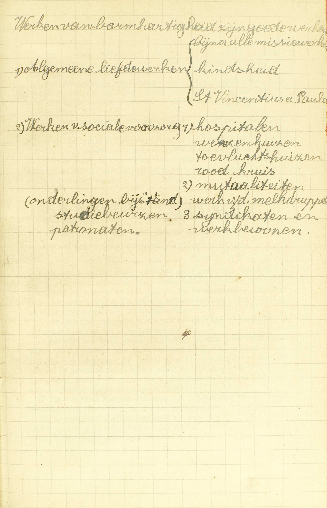
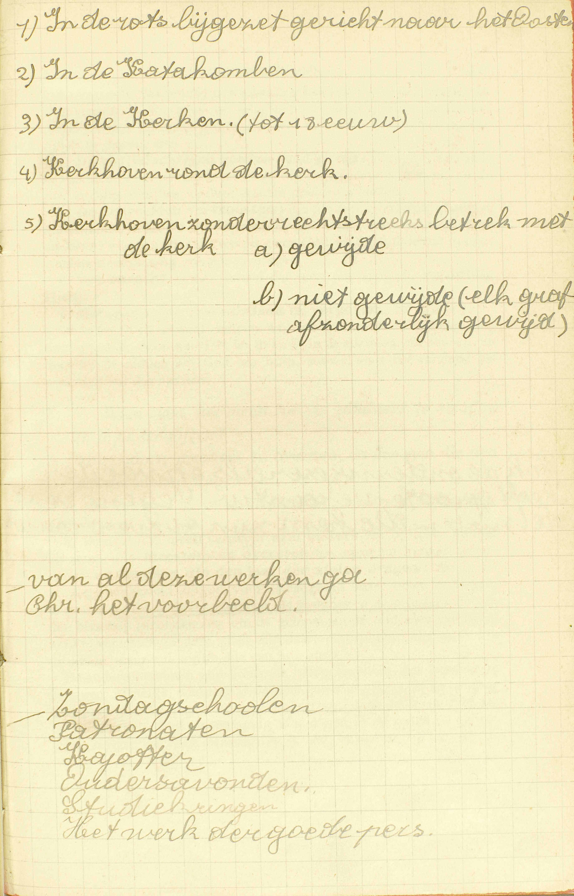
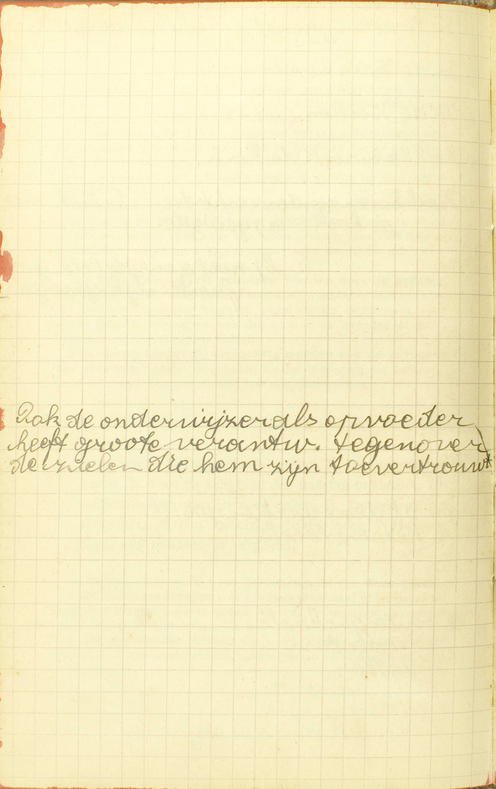

<table>
<tr>
  <td rowspan=10>**Zalig zijn de barmhartigen, want zij zullen barmhartigheid verwerven (5ᵉ zaligheid)**</td>
  <td rowspan=10 class=accolade></td>
  <td colspan=6>Natuur van de werken van barmhartigheid</td>
  <td>*[Wat zijn werken van barmhartigheid?](#wat-zijn-werken-van-barmhartigheid)*</td>
</tr>
<tr>
  <td rowspan=9>Verdeling van die werken</td>
  <td rowspan=9 class=accolade></td>
  <td rowspan=5>Lichamelijke werken van barmhartigheid</td>
  <td rowspan=5 class=accolade></td>
  <td colspan=2>Getal en naam</td>
  <td>*[Hoeveel lichamelijke werken van de barmhartigheid zijn er?](#hoeveel-lichamelijke-werken-van-de-barmhartigheid-zijn-er)*</td>
</tr>
<tr>
  <td colspan=2>Verplichting</td>
  <td>*[Is men somtijds schuldig arme mensen aalmoezen te geven?](#is-men-somtijds-schuldig-arme-mensen-aalmoezen-te-geven)*</td>
</tr>
<tr>
  <td rowspan=2>Verdienstelijkheid</td>
  <td rowspan=2 class=accolade>
  <td>*[Wanneer zijn de werken van barmhartigheid allermeest verdienstig?](#wanneer-zijn-de-werken-van-barmhartigheid-allermeest-verdienstig)*</td>
</tr>
<tr>
  <td>*[Wat loon mag men verwachten voor de werken van de barmhartigheid?](#wat-loon-mag-men-verwachten-voor-de-werken-van-de-barmhartigheid)*</td>
</tr>
<tr>
  <td colspan=2>Uitlegging over het 7ᵉ werk</td>
  <td>*[Waarom worden de lichamen van de Christenen in de kerken of op gewijde plaatsen begraven?](#waarom-worden-de-lichamen-van-de-christenen-in-de-kerken-of-op-gewijde-plaatsen-begraven)*</td>
</tr>
<tr>
  <td rowspan=4>Geestelijke werken van barmhartigheid</td>
  <td rowspan=4 class=accolade></td>
  <td colspan=2>Getal en naam</td>
  <td>*[Welke zijn de geestelijke werken van de barmhartigheid?](#welke-zijn-de-geestelijke-werken-van-de-barmhartigheid)*</td>
</tr>
<tr>
  <td rowspan=3>Uitlegging over enige van die werken</td>
  <td rowspan=3 class=accolade>
  <td>*[Wien staat het meest toe de zondaars te straffen en te onderwijzen?](#wien-staat-het-meest-toe-de-zondaars-te-straffen-en-te-onderwijzen)*</td>
</tr>
<tr>
  <td>*[Voor wie zullen wij bidden?](#voor-wie-zullen-wij-bidden)*</td>
</tr>
<tr>
  <td>*[Wat ongelijk moeten wij uit barmhartigheid vergeven?](#wat-ongelijk-moeten-wij-uit-barmhartigheid-vergeven)*</td>
</tr>
</table>

# Wat zijn werken van barmhartigheid?

## Deugden, door welke wij andere mensen in hun lichamelijke of geestelijke nood uit barmhartigheid bijstaan

  

A. Werken van barmhartigheid zijn **deugden:** deugdelijke werken **door welke wij — andere mensen:** alle mensen die onze naaste zijn, behalve de Heiligen, die van ons geen bijstand nodig hebben noch kunnen ontvangen, **in hun lichamelijken of geestelijken nood:** als zij in hun tijdelijke goederen of in de zaken van hun zaligheid lijden of op het punt zijn te lijden, en daarbij zichzelf niet kunnen helpen of dit enkel met grote moeite vermogen — **uit barmhartigheid:** niet of ten minste niet enkel uit rechtvaardigheid, d.i. om hun *het hun* te geven, maar uit medelijden, uit meedogende liefde, omdat wij hun lijden als het onze aanzien, **bijstaan:** helpen en ondersteunen.

Hieruit volgt dat er *twee* soorten van werken van barmhartigheid te onderscheiden zijn: de *lichamelijke* en de *geestelijke.*

# Hoeveel lichamelijke werken van de barmhartigheid zijn er?

## Zeven, te weten: 1. De hongerigen spijzen. 2. De dorstigen laven. 3. De naakten kleden. 4. De vreemdelingen herbergen. 5. De zieken bezoeken. 6. De gevangenen verlossen. 7. De doden begraven

A. Er zijn zeven lichamelijke werken van barmhartigheid:

1° **De hongerigen spijzen:** voedsel verschaffen aan wie dit ontbreekt.

2° **De dorstigen laven:** drank geven aan de armen of zieken die door de dorst beproefd worden.

3° **De naakten kleden:** kleren, deksel, allerhande middelen van verwarming en beschutting bezorgen aan degenen die zich niet behoorlijk kunnen kleden, of zich tegen de warmte, de koude of de natheid niet kunnen beschutten.

4° **De vreemdelingen herbergen:** de brave reizigers een schuilplaats; die zonder ambt of plaats zijn een bestaan verschaffen.

5° **De zieken bezoeken:** de arme of rijke zieken bijstaan, oppassen, troosten en opwekken, alsook de blinden, kreupelen en stommen ondersteunen en helpen.

6° **De gevangenen verlossen:** die om het Geloof of om een andere onrechtvaardige reden gestraft, vervolgd of verdrukt worden, door allerhande middelen trachten te verlossen, te verdedigen en te beschermen.

7° **De doden begraven:** de lichamen van de afgestorvenen gaan groeten of bewaken. voor hun begraving zorgen, hun lijkdiensten bijwonen. Dit maakt een werk van barmhartigheid uit, al zijn de dode lichamen onze naaste niet, omdat de overledenen nog op aarde leven door hun faam, en dus de eer, hun lichaam bewezen, hen zelf aangaat; ook omdat hun lichaam bij de verrijzenis opnieuw met hun ziel zal verenigd worden.

# Is men somtijds schuldig arme mensen aalmoezen te geven?

## Ja, als zij in de uitersten of in groten nood zijn, en wij hen helpen kunnen

V. Is men soms op zonde verplicht arme mensen aalmoezen te geven, of lijdende mensen door enig lichamelijk werk van barmhartigheid bij te staan en te helpen? — Al de werken van barmhartigheid kunnen onder de naam van *aalmoes* verstaan worden, daar de aalmoes altijd tot een van die werken dient.

A. **Ja,** wij zijn daartoe op zonde uit barmhartigheid verplicht, als deze *twee* voorwaarden samen vervuld zijn:

1° **Als zij** (de armen, de noodlijdenden) **in de uiterste nood zijn:** als zij, zonder onze hulp, in gevaar zijn van te sterven of van een verlies te ondergaan dat met de dood kan vergeleken worden; **of als zij in grote nood zijn:** als zij, zonder onze hulp, misschien van gebrek zouden sterven, of ter minste in hun eer of faam of in hun tijdelijke goederen merkelijk lijden ;

2° **En wij hen helpen kunnen:** in 't bezit zijn van goederen waarmee wij hen helpen kunnen en helpen *moeten.*

Als de naaste *in de uitersten nood* is, dan moeten wij tot zijn onderstand de goederen gebruiken die wij niet nodig hebben om ons eigen leven of dat van onze nabestaanden te onderhouden; als hij enkel *in grote nood* verkeert, moeten wij te die einde zeker de goederen besteden die wij tot het onderhouden van onze staat niet van doen hebben, en waarschijnlijk ook, ten minste in zekere mate, dezulke die wij daartoe kunnen gebruiken, maar strikt genomen ook kunnen missen; dat vereist immers de orde in de samenleving.  Zelfs schijnt het zeker dat wij op zonde verplicht zijn aalmoezen te geven, van hetgeen niet dient tot het onderhouden van onze staat, niet aan alle, maar toch aan enige armen die *in gewone nood* zijn of in die nood waarin al de armen zich gewoonlijk bevinden; want, deden wij het niet, zij zouden welhaast in groten nood vallen. — In geen geval echter zijn wij gehouden buitengewoon grote middelen te gebruiken om de naaste bij te staan, want dit zou de orde storen.

Men bemerke wel dat wij, in een werk van barmhartigheid, een aalmoes van het *onze* aan de evennaaste geven, terwijl wij, in een werk van rechtvaardigheid, hem *het zijne* ter hand stellen; en dat zo de onrechtvaardigheid ons altijd tot restitutie verplicht, aangezien eenieder altijd en overal recht heeft op *het zijne,* terwijl de onbarmhartigheid zulk een verplichting niet medebrengt, daar de aalmoes die wij geven, van *het onze* is genomen, en er bijgevolg niemand buiten ons recht op heeft. De deugd van beleefdheid, van dankbaarheid, van mildheid en van waarachtigheid, ten minste als wij er door ons ambt of door een bijzonder contract niet toe verplicht zijn, en als wij door de leugentaal de evenmens in zijn goederen niet hinderen, behoren tot de barmhartigheid, omdat wij daar van *het onze* geven.

# Wanneer zijn de werken van barmhartigheid allermeest verdienstig?

## Als zij geschieden aan arme mensen, uitsluitend uit liefde Gods of om Gods wil

V. **Allermeest verdienstig:** aan God bijzonder behaaglijk en in zijn ogen meest loon waardig.

A. De werken van barmhartigheid zijn allermeest verdienstig, als deze *twee* voorwaarden volbracht zijn: **als zij geschieden:**

1° **Aan arme mensen:** aan mensen die op aarde geen gezag hebben; want, hoe lager de persoon die men helpt, hoe meer men zich vernedert om hem te helpen.

2° **En uitsluitend uit liefde Gods of om Gods wil:** als zij eerst en vooral gedaan worden om God onze liefde te betuigen met de mensen, die zijn geliefkoosde schepselen en aangenomene kinderen zijn, uit liefde tot Hem goed te doen; immers de liefde tot God is het volmaaktste van geheel de Godsdienst, en een werk van barmhartigheid moet, om volmaakt te zijn, noodzakelijk uit de liefde voortkomen, daar de barmhartigheid onmiddellijk van de liefde afstamt.

# Wat loon mag men verwachten voor de werken van de barmhartigheid?

## Het eeuwige loon, die Christus in de tegenwoordigheid van alle mensen in het Laatste Oordeel zal geven

A. Men mag voor de werken van barmhartigheid verwachten **het eeuwige loon** van de hemel, **die Christus,** na hem eerst, in 't Bijzonder Oordeel, alleen aan de ziel geschonken te hebben, **in de tegenwoordigheid van alle mensen in het Laatste Oordeel** aan ziel en lichaam **zal geven.** Het spreekt van zelf dat men voor deze werken ook al de andere profijten van de goede werken mag verwachten; want die alle zijn in de hemelse loon besloten als een deel in zijn geheel. De Catechismus spreekt van het geven van de eeuwigen loon in het Laatste Oordeel, omdat Christus, van de barmhartigheidswerken handelende, uitdrakkelijk beloofd heeft ze daar bijzonder te loven.

# Waarom worden de lichamen van de Christenen in de kerken of op gewijde plaatsen begraven?

## Ten eerste, omdat die plaatsen betere gelegenheid aan de levenden geven om voor hen te bidden; ten tweede; omdat zij deelachtig worden van de gebeden en de Missen die daar geschieden; ten derde, omdat zij geholpen worden door de gebeden van de Heiligen die daar geëerd worden; ten vierde, omdat zij deelachtig worden van de zegening van de plaatsen

  

V. **Waarom worden de lichamen van de Christenen in de kerken,** gelijk het eertijds veel gebeurde, **of op gewijde plaatsen,** namelijk, op gewijde kerkhoven, **begraven?**

A. **Ten eerste, omdat die plaatsen betere gelegenheid aan de levenden geven om voor hen te bidden:** omdat de gelovigen dikwijls naar die plaatsen gaan en daar, bij het zien van de grafsteden van hun broeders, natuurlijk opgewekt worden om voor hen te bidden.

**Ten tweede, omdat zij deelachtig worden van de** kerkelijke **gebeden en de Missen die daar geschieden,** aangezien al die gebeden en Missen altijd een bijzondere smeeking bevatten voor de overledenen, welke smeeking voorzeker eerst en vooral geldt voor degenen die daar begraven liggen.

**Ten derde, omdat zij geholpen worden door de gebeden van de Heiligen die daar geëerd worden;** want het is natuurlijk dat die Heiligen de aldaar hegraven afgestorvenen rechtstreeks door hun gebeden helpen, en ook dat zij aan de levenden de genade bekomen om er veel voor te bidden.

**Ten vierde, omdat zij deelachtig worden van de zegening van de plaatsen:** omdat de gebeden die in de wijding van de kerken of kerkhoven voor hen gestort zijn, hun toegepast worden,

# Welke zijn de geestelijke werken van de barmhartigheid?

## Deze zeven: 1. De zondaars straffen. 2. De onwetenden leren. 3. Voor de zaligheid van de naaste bidden. 4. De twijfelachtigen goeden raad geven. 5. De bedroefden vertroosten. 6. Het onrecht verduldig lijden. 7. Hetgeen tegen ons misdaan is, vergeven

A. De geestelijke werken van barmhartigheid zijn **deze zeven:**

1° **De zondaars straffen:** de zondaars door straf of berisping tot bekering brengen; die in gevaar zijn van te zondigen op dezelfde wijze daarvan weerhouden.

2° **De onwetenden leren:** die in het Geloof niet genoeg onderwezen zijn, aanleren wat zij moeten weten of doen om zalig te worden.

3° **Voor de zaligheid van de naaste bidden:** voor de naaste van God vragen al wat hem ter zaligheid kan dienstig zijn, zoals vergiffenis van zijn zonden, genade om wel te leven, kwijtschelding van de tijdelijke pijnen, enz.

4° **De twijfelachtigen goeden raad geven:** wien, om de zonde te vluchten, om het goed te doen, om een staat te kiezen, goede raad nodig of nuttig is, door goeden raad hulp bieden.

5° **De bedroefden vertroosten:** die om enig ongeluk of enige moeilijkheid bedroefd zijn, opbeuren, moed in ’t harte storten, opdat zij hun pijnen met onderwerping aan God en tot uitboeting van hun zonden kloekmoedig zouden verdragen.

6° **Het onrecht** of het kwaad dat men ons aandoet, **verduldig lijden** en zo vrede stichten.

7° **Hetgeen tegen ons misdaan is, vergeven.** ([25ᵉ les, 3ᵉ v.](les-25.html#wat-leert-ons-christus-te-doen-aan-onze-vijanden))

Door het 2ᵉ en 4ᵉ werk helpen wij de naaste in de ellenden van het verstand; door het 1ᵉ, 5ᵉ, 6ᵉ en 7ᵉ in de ellenden van de wil, en door het 3ᵉ bidden wij God om hulp, zowel voor het verstand als voor de wil van de naaste.

# Wien staat het meest toe de zondaars te straffen en te onderwijzen?

## Alle ouders, meesters en oversten, en degenen, die de last van de zielen dragen

  

V. Wie zijn eerst en vooral verplicht de zondaars te straffen en te onderwijzen?

A. Daartoe zijn meest verplicht **alle ouders** ten opzichte van hun kinderen, alle **meesters en oversten** ten opzichte van hun onderdanen, en **degenen die de last van de zielen dragen:** die in de H. Kerk aangesteld zijn om voor de zaligheid van onze zielen te zorgen, te weten, de Paus, de bisschoppen, de pastoors en de priesters die van de bisschop gezonden zijn om de gelovigen de middelen van zaligheid te verschaffen: deze allen zijn daartoe verplicht, niet uitsluitend uit liefde, maar ook uit hoofde van hun ambt.

De andere personen zijn soms uit liefde verplicht de zondaar te berispen, namelijk, wanneer 1° de zaak gewichtig is; — 2° de zondaar berisping nodig heeft tot zijn bekering, door anderen niet zal berispt worden, door de berìsping niet dieper in de zonde zal vallen, maar integendeel zich waarschijnlijk zal bekeren, — en 3° de berisping tevens zonder te grote moeite kan gedaan worden. Ontbreekt één van deze voorwaarden, dan is de berisping niet geboden. — Als men berispt, moet men het eerst doen in 't geheim; daarna, indien de zondaar niet wil luisteren, met een of twee getuigen, en slechts de derde maal behoort men de zaak aan de overheid te verklaren.

# Voor wie zullen wij bidden?

## Voor alle mensen, die tot de eeuwige zaligheid kunnen komen, hetzij dat ze nog leven, of dat ze overleden zijn

V. Voor wie behoren wij te bidden?

A. Niet voor de Engelen, die niets meer kunnen bekomen boven hetgeen zij bezitten; noch voor de Heiligen, wier geluk niet meer kan vermeerderd worden; noch voor de verdoemden, die onherroepelijk veroordeeld zijn; maar **voor alle mensen die tot de eeuwige zaligheid kunnen komen, hetzij dat ze nog leven** hier op aarde, **of dat ze overleden zijn** en in het vagevuur lijden; want deze allen kunnen door onze gebeden geholpen worden.

# Wat ongelijk moeten wij uit barmhartigheid vergeven?

## Alle ongelijk, hoe groot het ook moge wezen, en hoe dikwijls het zou mogen geschied zijn

V. Wat ongelijk moeten wij, op zonde, uit hoofde van de deugd van barmhartigheid vergeven? *Vergeven,* men neme dat wel in acht, bestaat niet in geen restitutie te eisen of in geen rechtvaardige straf van de overheid voor de misdaad te verzoeken, maar in allen vrijwilligen afkeer, haat en wraakzucht tegen degenen, die ons misdaan hebben, uit ons hart te verbannen.

A. **Alle ongelijk,** zonder één uitzondering, **hoe groot,** hoe zwaar, **het ook moge wezen, en hoe dikwijls het zou mogen geschied zijn:** dus, noch de buitengewone zwaarte, noch de menigvuldigheid van de misdaden, niets kan ons verontschuldigen van het ons aangedaan ongelijk te vergeven.

### VRAGEN

Wat bevat deze les? — Geef haar algemene verdeling. — Geef de onderverdeling van de hoofddelen. — Zeg wat ieder van deze onderverdelingen bevat.

1. Tot welke algemene klasse van zaken behoren de werken van barmhartigheid? — Leg dat uit. — Zeg, met de Catechismus, wat wij door die werken van barmhartigheid doen, en aan wie, wanneer en om welke reden wij dat doen, — Leg uw antwoord uit.

2. Hoe worden de werken van barmhartigheid verdeeld? — Noem de lichamelijke werken van barmhartigheid, en leg ze uit. — Hoe is het begraven van de doden een waar werk van barmhartigheid?

3. Verklaar de vraag: *Is men somtijds schuldig arme mensen aalmoezen te geven?* — Hoe kunnen al de lichamelijke werken van barmhartigheid onder de naam van aalmoes verstaan worden? — Zijn wij ooit op zonde verplicht aalmoezen aan de armen te geven? — Zeg, met de Catechismus, war er vereist is, opdat wij daartoe zouden verplicht zijn. — Leg dat uit. — Welke goederen moeten wij besteden om de armen, die in de uiterste of in grote nood zijn, bij te staan; en waarom? — Zeg welke verplichting wij voorzeker schijnen te hebben jegens de armen die in gewone nood zijn. — Geef er de reden van, — Moeten wij ooit buitengewoon grote middelen gebruiken om de naaste te helpen? — Geef er de reden van. — Stel het verschil voor dat er tussen een werk van barmhartigheid en een werk van rechtvaardigheid bestaat.

4. Geef de zin van de vraag: *Wanneer zijn de werken van barmhartigheid allermeest verdienstig?* — Zeg, met de Catechismus, wat er vereist is, opdat deze werken allermeest verdienstig zouden zijn. — Leg het uit, en geef er de reden van.

5. Zeg, met de Catechismus, welk loon wij voor de werken van barmhartigheid zullen ontvangen. — Leg het antwoord uit. — Wat zegt de Catechismus van dit loon? — Leg de woorden van de Catechismus uit. — Waarom zegt de Catechismus dat van dit loon.

6. Verklaar de vraag: *Waarom worden de lichamen van de Christenen in de kerken of op gewijde plaatsen begraven?* — Om hoeveel en om welke redenen worden de lichamen van de Christenen in de kerken of op gewijde plaatsen begraven? — Leg die redenen uit.

7. Noem de geestelijke werken van barmhartigheid, en leg ze uit.

8. Geef de zin van de vraag: *Wien staat het meest toe de zondaars te straffen en te onderwijzen?* — Wie zijn, volgens de Catechismus, daartoe meest gehouden? — Verklaar uw antwoord. — Hoe zijn deze allen daartoe verplicht? — Zijn de andere mensen soms verplicht de zondaars te berispen? — Wanneer? — Hoe moet men de berisping doen?

9. Verklaar de vraag: *Voor wie zullen wij bidden?* — Voor welke klasse van redelijke schepselen behoren wij, volgens de Cateehismus, te bidden? — Voor welke personen van die klasse behoren wij, volgens de Catechismus, te bidden? — Leg het antwoord uit. — Geef er de reden van.

10. Verklaar de vraag: *Wat ongelijk moeten wij uit barmhartigheid vergeven?* — Leg, volgens de Catechismus, in één woord, wat ongelijk wij moeten vergeven. — Bewijs uit de Catechismus, dat er aan die regel geen uitzondering is.

