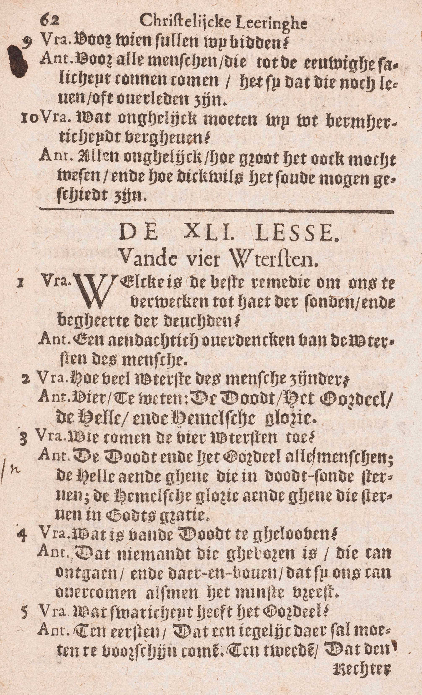
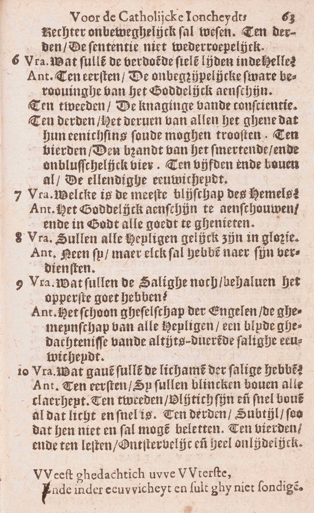

<table>
<tr>
  <td rowspan=10>**De Uitersten van de mensen**</td>
  <td rowspan=10 class=accolade></td>
  <td rowspan=3>In 't algemeen</td>
  <td rowspan=3 class=accolade></td>
  <td>Nut van de overweging van deze Uitersten</td>
  <td></td>
  <td>*[Welk is de beste middel om ons te verwekken tot haat van de zonden en begeerte van de deugden?](#welk-is-de-beste-middel-om-ons-te-verwekken-tot-haat-van-de-zonden-en-begeerte-van-de-deugden)*</td>
</tr>
<tr>
  <td>Getal en naam</td>
  <td></td>
  <td>*[Hoeveel Uitersten van de mens zijn er?](#hoeveel-uitersten-van-de-mens-zijn-er)*</td>
</tr>
<tr>
  <td>Aan wie zij toekomen</td>
  <td></td>
  <td>*[Wien komen de vier uitersten toe?](#wien-komen-de-vier-uitersten-toe)*</td>
</tr>
<tr>
  <td rowspan=7>In 't bijzonder</td>
  <td rowspan=7 class=accolade></td>
  <td>De Dood</td>
  <td></td>
  <td>*[Wat is er van de Dood te geloven?](#wat-is-er-van-de-dood-te-geloven)*</td>
</tr>
<tr>
  <td>Het Oordeel</td>
  <td></td>
  <td>*[Wat zwarigheid heeft het Oordeel?](#wat-zwarigheid-heeft-het-oordeel)*</td>
</tr>
<tr>
  <td>De Hel</td>
  <td></td>
  <td>*[Wat zullen de verdoemde zielen lijden in de Hel?](#wat-zullen-de-verdoemde-zielen-lijden-in-de-hel)*</td>
</tr>
<tr>
  <td rowspan=4>De Hemel</td>
  <td rowspan=4 class=accolade></td>
  <td>*[Welk is de meeste blijdschap van de Hemel?](#welk-is-de-meeste-blijdschap-van-de-hemel)*</td>
</tr>
<tr>
  <td>*[Zullen alle Heiligen gelijk zijn in glorie?](#zullen-alle-heiligen-gelijk-zijn-in-glorie)*</td>
</tr>
<tr>
  <td>*[Wat zullen de Zaligen behalve het opperste goed nog hebben?](#wat-zullen-de-zaligen-behalve-het-opperste-goed-nog-hebben)*</td>
</tr>
<tr>
  <td>*[Welke gaven zullen de lichamen van de Zaligen hebben?](#welke-gaven-zullen-de-lichamen-van-de-zaligen-hebben)*</td>
</tr>
</table>

# Welk is de beste middel om ons te verwekken tot haat van de zonden en begeerte van de deugden?

## Een aandachtig overdenken van de Uitersten van de mensen

  
  

V. Welk is de krachtigste middel om ons te bewegen tot haat van de zonden en begeerte van de deugden en zo beide de delen van de Christelijke Rechtvaardigheid te volbrengen?

A. De krachtigste middel daartoe is — **een aandachtig:** een krachtig, zorgvuldig, levendig **overdenken — van de Uitersten van de mens:** van de zaken die de mens overkomen bij het einde van zijn leven hier op aarde. Dat doet ons immers klaar begrijpen wat wij van dit aardse leven moeten denken, welk ons einde is, hoe zorgvuldig wij het goed moeten doen en het kwaad vluchten om het eeuwig geluk te verwerven. Ken mens die gaat sterven, begrijpt ten klaarste de noodzakelijkheid van God wel te dienen, en de dwaasheid van dit niet te doen; want op het sterfbed eindigen de hetooveringen en verleidingen van de wereld. Hetzelfde natuurlijk zal plaats grijpen, als wij Onze Uitersten aandachtig overdenken.

# Hoeveel Uitersten van de mens zijn er?

## Vier, te weten: de Dood, het Oordeel, de Hel en de Hemelse Glorie

V. De Catechismus vraagt, **hoeveel Uitersten er zijn — van de mens:** van de mens in ’t bijzonder, en niet van geheel het menselijk geslacht en van geheel de wereld; want deze hebben de volgende uitersten: het vergaan van de wereld door het vuur, de verrijzenis, het Algemeen Oordeel en het daarop volgende eeuwig rijk van Christus.

A. Er zijn *vier* Uitersten van de mens, te weten:

1° **De Dood,** bestaande in de scheiding van de ziel van het lichaam, waardoor dit van het leven beroofd wordt.

2° **Het Oordeel,** gelegen in het onderzoek dat God zal doen over al de goede en slechte werken van geheel ons leven, en in het vonnis dat Hij daarna over ons zal uitspreken. ([10ᵉ les, v. 5](les-10.html#wie-zal-christus-komen-oordelen), [6](les-10.html#zullen-de-doden-tot-de-laatsten-dag-toe-zonder-oordeel-wezen), [8](les-10.html#wat-vonnis-zal-christus-in-het-oordeel-geven).)

3° **De Hel** of de plaats waar de verdoemden gestraft worden. Er zijn twee plaatsen in te onderscheiden: 1° de eigenlijke hel, waar de verdoemden het goddelijk aanschijn derven en daarenboven door het vuur gepijnigd worden; 2° het voorgeborchte van de hel, waar de kinderen die vóór de jaren van verstand zonder Doopsel sterven, enkel beroofd zijn van het goddelijk aanschijn. ([9ᵉ les, 2ᵉ v.](les-09.html#wat-verstaat-gij-door-de-hel-tot-dewelke-christus-nedergedaald-is))

4° **De Hemelse Glorie:** de hemel of de plaats waar de gelakzaligen God zien. Onder dit Uiterste moet ook het *vagevuur* verstaan worden, dat een inleidingsplaats tot de Hemel is. Vóór Christus’ Hemelvaart kwam ook het *voorgeborchte van de Oudvaders* ([9ᵉ les, v. 2](les-09.html#wat-verstaat-gij-door-de-hel-tot-dewelke-christus-nedergedaald-is)), onder de naam van *Hemel.*

# Wien komen de vier uitersten toe?

## De Dood en het Oordeel aan alle mensen; de Hel aan degenen die in doodzonde sterven; de Hemelse Glorie aan degenen die sterven in Gods genade

V. Komen deze Vier Uitersten alle of slechts enige mensen over?

A. **De dood,** gelijk de ondervinding het getuigt; **en het Oordeel,** zowel het Bijzonder als het Algemeen, komen toe **aan alle mensen** zonder uitzondering ; nochtans twijfelen enige godgeleerden, of de mensen die op het einde van de wereld zullen leven, de Dood zullen ondergaan ([10ᵉ les, v. 7](les-10.html#welke-zijn-de-levenden-die-christus-oordelen-zal)); **de** eigenlijke **Hel aan degenen die in** dadelijke **doodzonde,** en het *voorgeborchte* ervan aan die vóór de jaren van verstand zonder Doopsel **sterven;** **— de Hemelse Glorie aan degenen die in Gods genade** zó **sterven,** dat zij niets meer te betalen of te zuiveren hebben, en het *vagevuur* aan degenen die alleen met dagelijkse zonden of last van tijdelijke pijnen verscheiden. ([15ᵉ les.](les-15.html))

# Wat is er van de Dood te geloven?

## Dat niemand, die geboren is, haar kan ontgaan, en daarenboven, dat zij ons kan overkomen, als wij het minst vrezen

V. Wat leert ons de goddelijke Openbaring nopens de Dood, en wat moeten wij dus van de Dood geloven?

A. Wij hebben van de Dood *twee* dingen te geloven:

1° **Dat niemand — die geboren is:** die op aarde leeft, **haar kan ontgaan;** want de Dood is een gevolg van de erfzonde, die alle mensen aangeboren wordt. ([A. 3.](#wat-is-er-van-de-dood-te-geloven))

2° **Dat zij ons kan overkomen als wij het minst vrezen:** dat wij niet weten *wanneer,* noch *waar,* noch *hoe* wij zullen sterven. Christus heeft dikwijls gezegd dat de Dood zal komen gelijk een dief in de nacht, en de ondervinding leert dat vele mensen schielijk sterven, dat menigvuldige andere zich op hun sterfbed over het gevaar van hun staat bedriegen, en zo sterven zonder het te weten. God heeft gewild dat het uur van onze Dood ons onbekend zou blijven: 1° om van het leven een ware tijd van beproeving te maken: wisten de mensen wanneer zij zullen sterven, zij zouden zich zonder vrees aan alle buitensporigheden kunnen overleveren, in de verzekering van later toch tijd te hebben om boetvaardigheid te doen; — 2° om de orde in de samenleving te handhaven; want, kende iedereen het uur van zijn Dood, vele contracten waren onmogelijk en vele mensen lieten vóór hun einde allen moed vallen.

# Wat zwarigheid heeft het Oordeel?

## Ten eerste, dat iedereen daar zal moeten te voorschijn komen; ten tweede, dat de rechter onbeweeglijk zal wezen; ten derde, het vonnis onherroepelijk.

V. Waarin is het Oordeel vervaarlijk?

A. Het is vervaarlijk in *drie* opzichten:

**Ten eerste, dat iedereen daar zal moeten te voorschijn komen:** dat volstrekt niemand het kan ontgaan, en dat het zich zal uitstrekken over al onze zedelijke werken, hetzij goede of kwade;

**Ten tweede, dat de rechter — onbeweeglijk zal wezen:** volgens de strengste regels van de rechtvaardigheid zal oordelen, en dat ieder juist zal ontvangen volgens zijn verdiensten;

**Ten derde, het vonnis onherroepelijk:** dat het vonnis Gods, eens uitgesproken, in eeuwigheid onveranderlijk, onverbrekelijk zal zijn.

# Wat zullen de verdoemde zielen lijden in de Hel?

## Ten eerste, de onbegrijpelijke zware beroving van het goddelijk aanschijn; ten tweede, de knaging van de conscientie; ten derde, het derven van al wat ze enigszins zou mogen troosten; ten vierde, de brand van het pijnlijk en onblusbaar vuur; ten vijfde en bovenal, de ellendige eeuwigheid

V. Welke pijnen zullen de zielen die om hun dadelijke zonden verdoemd zijn, in de Hel te lijden hebben?

A. De verdoemde zielen zullen de *vijf* volgende pijnen ondergaan:

**Ten eerste, de beroving van het goddelijk aanschijn,** pijn die **onbegrijpelijk** of boven alle verstand **zwaar** zal wezen; want, door een bijzondere verlichting van hun verstand, zullen de verdoemden klaar begrijpen, wat groot geluk het is God aanschijn aan aanschijn te aanschouwen, en hoe dat geluk het hun zou moeten wezen. Wij kunnen nu die pijn niet ten volle beseffen. daar de rede noch het Geloof er ons een klaar gedacht van geven.

**Ten tweede, de knaging van de conscientie:** de inwendige zelfverwijting die de verdoemden van hun eigen geweten zullen te lijden hebben, bij de gedachte dat zij hun eeuwig geluk voor een dwaze voldoening verbeurden, dat zij hun zaligheid zo gemakkelijk konden bekomen en nu voor eeuwig verloren zijn.

**Ten derde, het derven van al wat ze enigszins zou mogen troosten:** de beroving van alle troost hetzij van God, van de Engelen, van de Heiligen, van de duivelen of van hun medeverdoemden; hetzij uit de vervulling van een van hun begeerten of uit de voldoening van hun zinnen na het Laatste Oordeel. Hun zinnen zullen dan integendeel ten uiterste gepijnigd worden: hun ogen, door de duisternissen en de afschuwelijkheid van de verdoemde lichamen, die vuiler zullen zijn dan het vuilste lijk ; hun oren, door het geschreeuw, het gehuil en het tandengeknars van hun lijdgenooten; hun reuk, door de walgachtigste uitwasemingen; hun smaak, door razenden honger en dorst; hun gevoel, door allerhande kwellingen van het vuur en door beroving van alle rust.

**Ten vierde, de brand van het pijnlijk** (allerpijnlijkste) **en onblusbaar** (eeuwig) **vuur,** naar de gewone leer van de Godgeleerden bestaande uit waarachtig, stoffelijk vuur dat, volgens het einde waar het toe dient, bijzondere hoedanigheden bezit, o. a. van onblusbaar te zijn; van te verbranden zonder te vernietigen; van, door een bijzondere tussenkomst Gods, zelfs een onstoffelijk wezen, de ziel van lichaam beroofd, te kunnen pijnigen.

**Ten vijfde en bovenal, de ellendige eeuwigheid:** de Catechismus heet deze pijn terecht de meeste; immers, waar er geen hoop meer is, kan er geen troost meer wezen. De straf van de doodzonde moet eeuwig zijn, omdat die zonde, ingezien het oneindig volmaakt wezen dat zij beleedigt, oneindig zwaar is en zo een straf vereist, die ten minste enigszins oneindig is; welnu de eeuwigheid is de enigste oneindigheid die in een straf kan gevonden worden. Overigens, ware de Hel niet eeuwig, de wet Gods zou niet genoeg bekrachtigd zijn, daar de mens licht een tijdelijke straf zou verachten. Eindelijk, zonder de eeuwigheid van de Hel, ware de oneindige afstand, die tussen het goed en het kwaad bestaat, tussen de loon van het goed en de straf van het kwaad niet meer te vinden.

# Welk is de meeste blijdschap van de Hemel?

## Het goddelijk aanschijn te aanschouwen, en in God alle goed te genieten

V. **De meeste blijdschap:** het grootste goed, want men is blijde, als men het goed bezit dat men begeert.

A. Het meeste goed van de Hemel bestaat in deze *twee* dingen:

1° **In het goddelijk aanschijn te aanschouwen:** in God te zien, niet gelijk hier op aarde, alleen in zijn werken, maar aanschijn aan aanschijn, gelijk wij de mensen zien die bij ons zijn. Het aanschouwen van God geschiedt niet door de zintuigen, daar God een geest is: noch alleen door de natuurlijke krachten van het verstand, vermits deze daartoe volkomen onbekwaam zijn; maar door een bovennatuurlijk licht dat God aan het verstand van de Heiligen toevoegt, en dat *licht van de glorie* genoemd wordt, omdat het de oorsprong is van het geluk van de Hemelse Glorie.

2° **En in God alle goed te genieten:** en in God, aanschijn aan aanschijn aanschouwd, alles te vinden en te bezitten wat ons hart begeren kan, en zo ten uiterste gelukkig te zijn. Al de volmaaktheid, al de aangenaamheid van de bestaande of mogelijke schepselen is op een uitmuntende wijze in God te vinden, en het goed dat de Heiligen in God aantreffen, gaat al het aardse zoveel te boven als God zelf al de schepselen te boven gaat.

Men ziet dat de beide delen van dit antwoord innig met elkander verbonden zijn, want het tweede vloeit rechtstreeks uit het eerste.

# Zullen alle Heiligen gelijk zijn in glorie?

## Neen; maar elk zal hebben naar zijn verdiensten

V. **In glorie:** in het hemels geluk van God te aanschouwen en in Hem alle goed te genieten.

A. **Neen,** zij zullen niet allen even volmaakt het hemels geluk genieten; **maar elk zal hebben — naar zijn verdiensten:** volgens de hoeveelheid en de waarde van de goede werken die hij in zijn leven zal gedaan, of volgens de graad van heiligmakende genade die hij op het uur van zijn dood zal bereikt hebben; deze immers beantwoordt altijd aan onze verdiensten. De rechtvaardigheid en de wijsheid Gods vereisen zulk verschil in glorie, en dat zal de Heiligen die minder ontvangen hebben, niet bedroeven, omdat zij allen ten uiterste aan Gods wil zullen onderworpen zijn.
# Wat zullen de Zaligen behalve het opperste goed nog hebben?

## Het schoon gezelschap van de Engelen, de gemeenschap van alle Heiligen, een blijde gedachtenis van de altijddurende zalige eeuwigheid

V. **Het opperste goed** bestaat in het goddelijk aanschijn te aanschouwen en in God alle goed te genieten. ([V. 7.](#welk-is-de-meeste-blijdschap-van-de-hemel))

A. Behalve het opperste goed zullen de Zaligen nog deze *drie* goederen hebben:

1° **Het schoon gezelschap van de Engelen:** het eerlijke en aangename verkeer met de Engelen, die alle andere schepselen in volmaaktheid, schoonheid en waardigheid overtreffen.

2° **De gemeenschap van alle Heiligen:** de vereniging met de ontelbare menigte van de Heiligen waaronder de H. Maagd, onze patronen, onze ouders, broeders, zusters en nabestaanden die reeds in de hemel zijn.

3° **Een blijde gedachtenis van de altijddurende zalige eeuwigheid:** de gelukkige en bijblijvende zekerheid dat het bekomen geluk in zijn hele volheid eeuwig zal duren. Die zekerheid draagt oneindig veel bij tot het geluk van de Heiligen; zonder haar zou dit onvolmaakt wezen, daar het gedacht of de enkele vrees van het te kunnen verliezen, noodzakelijk onrust, angst en droefheid zou veroorzaken.

Bij deze drie goederen mag nog gevoegd worden de vrijdom van alle lijden, van alle pijn, van alle droefheid.

De *martelaars,* die de begeerlijkheid van de aardse goederen volkomen overwonnen hebben met zelfs hun leven op te offeren om God getrouw te blijven; de *leraars,* die de duivel, de meester van de leugentaal bestreden hebben, en de *maagden,* die de volle zegepraal over de onzuivere wellusten hebben behaald, zullen in de Hemel nog een bijzondere *bijgevoegde* glorie genieten.

Wat de kennis betreft die de Zaligen vóór het Laatste Oordeel nopens de wereld hebben, deze komt uit op een klaar gedacht van de hele samenstelling daarvan, van de verschillende soorten en klassen van de geschapene wezens, ook van al de personen, de zaken en daden die met hen enig betrek hebben, zoals van hun familie, hun vrienden, de vruchten van hun goede werken, enz,

# Welke gaven zullen de lichamen van de Zaligen hebben?

## Ten eerste, zij zullen blinken boven alle klaarheid; ten tweede, vlijtig zijn en snel boven al wat licht en snel is; ten derde, subtiel, zodat hen niets zal kunnen beletten; ten vierde en ten laatste, onsterfelijk en heel onlijdelijk

V. Zie [14ᵉ les, 8ᵉ vr.](les-14.html#hoedanig-zullen-de-lichamen-van-de-godvruchtige-of-heilige-mensen-in-de-verrijzenis-voorkomen)

A. **Ten eerste zij zullen blinken boven alle klaarheid,** of *klaar* en *schoonblinkend* zijn (Zie [14ᵉ les, 8ᵉ vr.](les-14.html#hoedanig-zullen-de-lichamen-van-de-godvruchtige-of-heilige-mensen-in-de-verrijzenis-voorkomen))

**Ten tweede,** zij zullen **vlijtig zijn en snel boven al wat licht en snel is,** i.a.w. *licht* zijn (Zie [14ᵉ les, 8ᵉ vr.](les-14.html#hoedanig-zullen-de-lichamen-van-de-godvruchtige-of-heilige-mensen-in-de-verrijzenis-voorkomen)).

**Ten derde,** zij zullen **subtiel** zijn, (zie genoemde les en vraag), **zodat hen niets zal kunnen beletten,** d. i, zodat hun lichamen noch door honger, noch door dorst, noeh door slaperigheid zullen belet worden van uit te voeren wat de ziel wil, en dat zij ook, als het betamelijk zal wezen, door andere stoffen niet belet zullen worden, zichergenste begeven.

**Ten vierde en ten laatste, onsterfelijk en heel onlijdelijk** (Zie [14ᵉ les, 8ᵉ vr.](les-14.html#hoedanig-zullen-de-lichamen-van-de-godvruchtige-of-heilige-mensen-in-de-verrijzenis-voorkomen)).

Buiten deze gaven zullen de lichamen van de Zaligen nog een volmaakte voldoening genieten in al hun zintuigen, en in het volle bezit zijn van de vernieuwde aarde, die door haar schoonheid geheel aan de heerlijkheid van hun lichamen zal beantwoorden.

### VRAGEN

Waarvan spreekt deze les? — Hoe is zij verdeeld? — Wat bevat ieder deel?

1. Verklaar de vraag: *Welk is de beste middel om ons te verwekken tot haat van de zonden en begeerte van de deugden?* — Leg, met de Catechismus, welk werk daartoe de beste middel is. — Leg die woorden uit. — Zeg, met de Catechismus, hoe dit werk moet geschieden om daartoe de beste middel te zijn. — Verklaar deze woorden. — Geef de reden van geheel het antwoord.

2. Geef de zin van de vraag: *Hoeveel Uitersten van de mens zijn er?* — Welke zijn de uitersten van geheel het menselijk geslacht en van de wereld? — Zeg het getal van de Uitersten van de mens en noem ze. — Leg ze alle uit.

3. Welk is de zin van de vraag: *Wien komen de Vier Uitersten toe?* — Voor wie is, volgens de Catechismus, de Dood en het Oordeel? — Leg het antwoord uit. — Voor wie is, volgens de Catechismus, de Hel en de Hemel? — Geef er de uitlegging van.

4. Verklaar de vraag: *Wat is er van de dood te geloven?* — Hoeveel en welke dingen moeten wij, volgens de Catechismus, van de Dood geloven? — Leg ze uit, en geef er een kort bewijs van. — Waarom wil God dat het uur van de dood ons onbekend weze?

5. Wat betekent de vraag: *Wat zwarigheid heeft het Oordeel?* — Zeg hoevelerlei de zwarigheid is, die het Oordeel, volgens de Catechismus, heeft; en zeg welke het is. — Leg het antwoord uit.

6. Van welke verdoemden spreekt de Catechismus, als hij vraagt: *Wat zullen de verdoemde zielen lijden in de Hel?* — Hoeveel en welke pijnen zullen zij, volgens de Catechismus, lijden? — Bewijs dat het derven van het goddelijk aanschijn een onbegrijpelijke straf uitmaakt. — Waarin bestaat de knaging van de conscientie, die de verdoemden zullen lijden? — Verklaar hoe de verdoemden van allen troost zullen beroofd zijn. — Wat is er te verstaan door de brand van het pijnlijk en onblusbaar vuur, dat de verdoemden zullen lijden? — Hoe is de eeuwigheid van de Hel de meeste pijn van de verdoemden? — Bewijs dat de pijnen van de Hel eeuwig moeten zijn.

7. Verklaar de vraag: *Welke is de meeste blijdschap van de Hemel?* — In hoeveel en in welke zaken bestaat, volgens de Catechismus, de meeste blijdschap van de Hemel? — Leg ze uit.

8. Wat betekenen de woorden: *in glorie,* in de vraag: *Zullen ale Heiligen gelijk zijn in glorie?* — Zeg, of zij in glorie zullen gelijk zijn. — Wat zal elk, volgens de Catechismus, hebben? — Leg dit uit. — Geef er de reden van. — Zullen de Zaligen, om reden van het verschil in hun beloning, niet droevig zijn?

9. Geef de zin van de vraag: *Wat zullen de Zaligen, behalve het opperste goed, nog hebben?* — Hoeveel en welke goederen zullen zij, volgens de Catechismus, behalve het opperste goed, nog hebben? — Leg ze uit. — Welk goed mag bij deze, die de Catechismus noemt, nog gevoegd worden? — Voor wie zal er in de Hemel nog een bijzondere bijgevoegde glorie bestaan, en om welke reden? — Welke kennis zullen de Zaligen vóór het Laatste Oordeel hebben van deze wereld?

10. Noem de gaven van de lichamen van de Gelukzaligen. — Leg ze uit. — Wat betekent de Catechismus, als hij, van de subtiliteit sprekende zegt: zo dat hen niets zal kunnen beletten? — Wat geluk zullen die lichamen buiten deze gaven, nog genieten?

