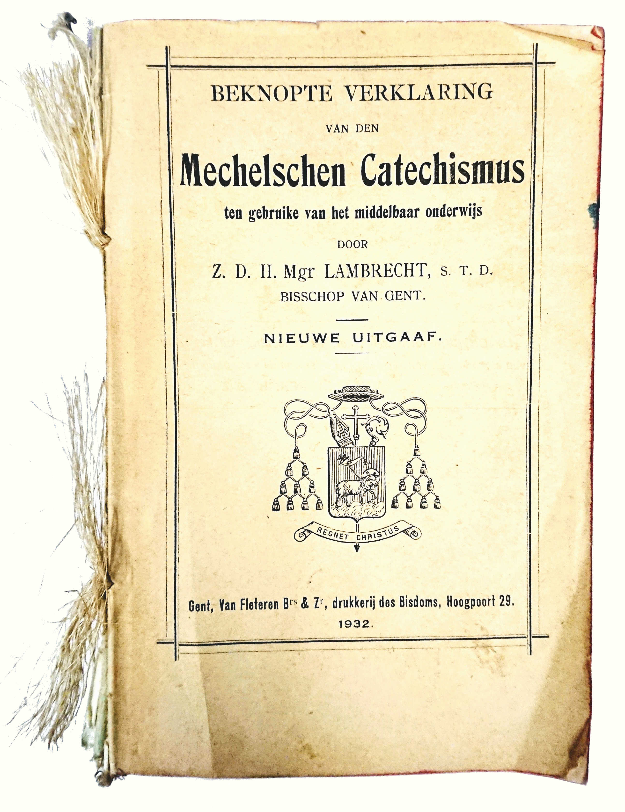
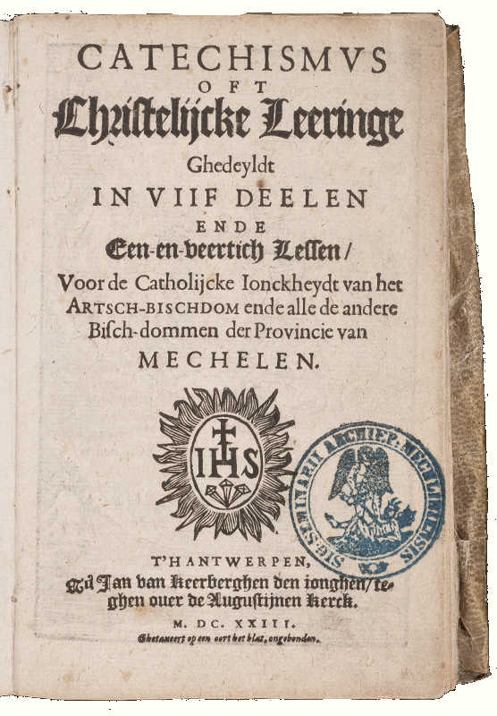
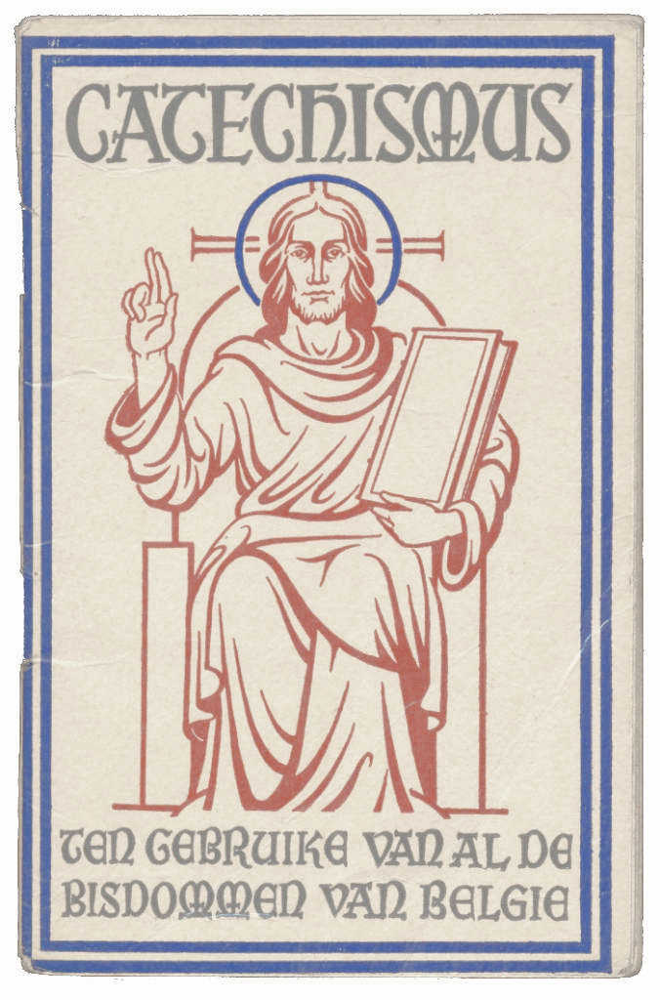
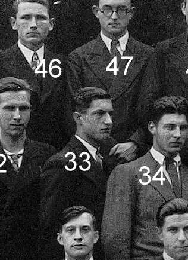

# Aanleiding

  
  <em>Beknopte Verklaring van de Mechelse Catechismus ten gebruike van het middelbaar onderwijs</em> 

Het boek lag al jarenlang in een antieke koffer, gevuld met oude missaals en andere katholieke boekjes, bij mij op zolder. Allemaal erfstukken uit de familie of opgepikt van rommelmarkten. Ik heb altijd een fascinatie gehad voor de preconiciliaire geloofswereld, die ik nooit heb meegemaakt en die zo plotsklaps tot een einde gekomen is en volledig verdonkermaand is door de postconciliaire Kerk. 

Het is een catechismus en heet voluit *Beknopte verklaring van den Mechelse Catechismus ten gebruike van het middelbaar onderwijs, *uitgegeven in bisdom Gent in 1932. Mijn grootvader, Cyriel Houben (1918-1984) gebruikte dit boek tijdens zijn opleiding aan de normaalschool van Sint-Niklaas van 1933 tot 1937, de hoogtijdagen van het katholiek militantisme. 

De uitgavedatum betreft vooral de verklarende teksten. De eigenlijke catechismus, samengesteld uit vragen en antwoorden, gaat terug tot 1623. Toen schreef Guilielmus de Pretere sj zijn *Catechismus oft christelijcke leeringe ghedeyldt in viif deelen ende een-en-veertich lessen, voor de catholijcke ionckheydt van het artschbischdom ende alle de andere bischdommen der Provincie van Mechelen*. In de online publicatie zijn ook afbeeldingen uit de oorspronkelijke cathismus opgenomen.

# Normaalschool

De opleiding tot onderwijzer voor de lagere school voltrok zich in de normaalschool. Ze duurde vier jaar en men begon eraan op veertienjarige leeftijd, hetzij na een vierde graad in de lagere school, hetzij na een eerste cyclus in de humaniora. Mijn grootvader is afgestudeerd in 1937, net geen 19 jaar oud. Hij studeerde aan de bischoppeljke normaalschool van Sint-Niklaas. De studenten verbleven op internaat en mochten maar om de drie maanden naar huis.

# De catechismus

  
  <em>De oorspronkelijke uitgave uit 1623</em>

Als handboek van de katholieke geloofsleer voert dit boek ons terug naar de omwentelingen van de reformatie en de nieuwe consolidatie van de katholieke leer na het concilie van Trente (1545-1563). De catechismus die in 1623 werd opgesteld door De Pretere sj was een herwerking van een eerste versie uit 1609, opgesteld door Lodewijk Makeblijde sj. Hoewel andere bisdommen in de loop der eeuwen met hun eigen adaptaties op de markt kwamen, bleef bisdom Gent tot in het midden van de twintigste eeuw trouw aan het oorspronkelijke werk. 

De digitale publicatie van dit onvergankelijke werk kan niet anders dan een meerwaarde betekenen, want het blikveld op de katholieke traditie is wel erg eng geworden met dat grote zwarte gat tussen de canonisatie van de Bijbel en Vaticanum II...

Wie meer wil leren over de geschiedenis van de catechismussen uitgegeven in het Nederlandse taalgebied, kan verder lezen in dit [oude artikel uit 1937](https://www.dbnl.org/tekst/_ver025193701_01/_ver025193701_01_0039.php), dat eigenlijk een aanklacht is tegen het verouderde taalgebruik uit de onderhavige catechismus (dat ik voor een deel heb proberen rechtzetten) en in dit [recentere artikel van dr. Marcel Gielis](resources/artikel-dr-marcel-gielis.pdf).

# De kleine catechismus

  
  <em>De "kleine catechismus"</em>

Deze catechismus is de grote broer van de *"kleine catechismus",* die gebruikt werd op de lagere school. Het mag wel blijken dat de onderwijzers op de lagere school met deze 'grote' catechismus aardig wat bagage hadden om hun kinderen die 'kleine' catechismus goed uit te leggen. Anderzijds kan ik me best voorstellen dat deze rigide methode het hen moeilijk maakte om aansluiting te vinden bij de snel veranderende tijdsgeest na de oorlog. 

# De aantekeningen

Het catechismusboek werd uitgegeven als een werkboek. Het is ingebonden met afwisselend bedrukte en lege pagina's, bedoeld om aantekeningen te maken tijdens de lessen, wat mijn grootvader nauwgezet heeft gedaan. De meer dan 200 bladzijdes aantekeningen voeg ik ook toe aan de publicatie. Zij illustreren de ernst en de geestelijke diepgang waarmee de geloofsleer werd bestudeerd aan de normaalscholen. Zij bevatten ook talrijke uitwijdingen die de docenten in de lessen behandelden en die een beeld geven van het katholicisme in het interbellum. 

De ernst van de studie kan voor ons verrassend zijn, want wij menen dat de catechismus er enkel was "om van buiten te leren". De leerstof moest wel degelijk begrepen worden en om de omvang van de leerstof uit de normaalschool te evenaren, moet je vandaag al theologie gaan studeren. De uitwijdingen bevestigen dan weer het beeld dat we hebben van het rijke roomse leven met zijn gesloten sameleving en strenge moraal. Het concilie is nog veraf in 1937!

# Volksveredeling vs. Emancipatie

Preuts en patriarchaal zijn termen die niet misstaan bij sommige aantekeningen over seksuele moraal, huwelijk en opvoeding. De stereotypen worden bevestigd en voor de postmoderne lezer is dat reden genoeg om het hele boeltje naar de prullenmand te verwijzen, maar ik durf er wel de kanttekening bij maken dat deze ingesteldheden zich meer baseren op een spiritueel gefundeerd maatschappelijk verantwoordelijkheidsgevoel dan op bekrompen ideeën van gefrustreerde priesters, en misschien valt daar nog wel iets uit te leren!

De idealen die naar voor komen in de catechismus, in de verkarende teksten en bovenal in de aantekeningen, zijn hooggestemd. Het haarklievende onderscheid dat in [Les 25 Van het Vijfde, Zesde en Negende Gebod](les-25.html#misdoen-zij-allen-tegen-het-vijfde-gebod-die-metterdaad-iemand-hinderen) wordt gemaakt tussen de begrippen *vermaledijden, kwaad wensen, gramschap, haat en nijd*, toont de fijnzinnigheid die de katholieke cultuur ons oplegt in onze omgang met andere mensen. Neemt u even mee een kijke op sociale media, om na te gaan of deze idealen nog steeds even sterk gekoesterd worden? Even verderop leert Christus ons over [onze betrekkingen met onze vijanden](les-25.html#wat-leert-ons-christus-te-doen-aan-onze-vijanden). Ik schrijf deze verantwoording in november 2020, wanneer in Frankrijk en Oostenrijk islamistiche aanslagen plaatgrijpen en wanneer Paus Franciscus zijn encycliek *Fratelli Tutti* publiceert. Ook in de notities die mijn grootvader tijdens zijn lessen maakte, is *broederschap van alle mensen* een vaak voorkomend begrip, in 1937, een jaar voordat Europa zou vernemen dat in Duitsland de Kristalnacht plaatsvond.

# Theologie tussen Rede en Liefde

Als ik in de catechismus lees, is dat telkens een verademing. Je stapt binnen in een orde die het wereldlijke en het hemelse, het tijdelijke en het eeuwige, samenbrengt in één consistent geheel. Die orde is gebaseerd op duidelijke gedefinieerde begrippen en logisch opgebouwde stellingen. Je voelt bij het lezen hoe het allemaal gewoon klópt, dat als je je geloof echt zó zou kunnen beleven, je leven er veel evenwichtiger zou uitzien! Dat is zo anders dan de geloofsleer zoals die in hedendaagse publicaties aangebracht wordt: vaak dubbelzinnig, gebaseerd op vage beeldspraak, speculatief en voor allerlei verklaring vatbaar. Je kan er alle kanten mee uit en je mag je er nog zo in verdiepen, achteraf weet je het nog niet. Dat *niet-weten* is trouwens een modieus begrip waarin de hedendaagse theologie zich nestelt als was het een na te streven doel. 

Het zijn twee kanten van de slinger. Het quasi-wetenchappelijke positivisme waarmee de geloofsleer in deze catechismus wordt geponeerd, is immers niet absoluut. Ik zou zelfs durven stellen dat het nooit zo absoluut is bedoeld als het gedrukt staat. In onderhavige publicatie voegen de aanvullende verklaringen al heel wat nuance toe. Voor wie de catechismus met een open hart leest, is het geen verzameling holle formalismen, maar een uitnodiging om in een hanteerbaar begripsveld zelf na te denken over de rol van het geloof in je leven en om met alle aangereikte middelen je persoonlijke spiritualiteit te ontwikkelen, je liefde voor God te laten groeien en zo open te staan voor het leven als opgang naar God!

# Tips voor onderwijzers

In zijn aantekeningen noteerde mijn grootvader tips die de docenten gaven voor de onderwijzers in spe. 

# Oecumene

Het verraste me in de aantekeningen talrijke veroordelingen te vinden van het protestantisme. Ik denk niet dat de gemiddelde Vlaming in de jaren '30 al een protestant van dichtbij had gezien, laat staan dat de katholieke Kerk in Vlaanderen in de protestantse kerk(en) een te duchten concurrent vond. Was er een verbondenheid met de katholieken in Nederland, die nog steeds hun emancipatiestrijd aan het voeren waren? 

# Dekkers

De aantekeningen bevatten tientallen verwijzingen naar hoofdstukken uit een ander boek, aangeduid als "Dekkers". Het betreft *[Roomsch-katholieke godsdienstleer. De katholieke geloofsleer](https://www.dbnl.org/auteurs/auteur.php?id=dekk057)* in drie delen door M.F. Dekkers, uitgegeven in 1917. Blijkbaar hadden de studenten ook die publicatie ter beschikking, hetzij persoonlijk, hetzij in een bibliotheek, om zich verder te verdiepen.

# Persoonlijke aantekeningen

  
  <em>Cyriel Houben, afgestudeerd aan de normaalschool van Sint-Niklaas in 1937</em>

Persoonlijke aantekeningen zijn er nauwelijks te vinden. Dat is wel jammer, want mijn grootvader stierf toen ik nog jong was, dus erg goed heb ik hem nooit gekend. Mijn moeder zegt 'dat hij niet graag op het internaat zat' (anecdote: zijn moeder kreeg tijdens zijn verblijf in Sint-Niklaas een derde kind --- eigenlijk zelfs een tweeling, maar één van de kinderen stierf kort na de geboorte --- waarmee hij bij zijn thuiskomst verrast werd). Misschien is dat te merken uit de aantekeningen bij de laatste lessen in 1937, die hij dateerde alsof hij aan het aftellen was, en een triomfantelijk "Einde IVᵉ jaar" bij de laatste les. Op de [groepsfoto bij het afstuderen](https://www.andreasboel.be/normal/index.php/diplomajaren/onderwijzers/klas-1931-t-m-1940/306-klas-1937) is hij de enige die niet in de camera kijkt... Toch zou hij nog een mooie carrière afleggen als onderwijzer in de gemeentelijke jongensschool van Wommelgem, waar hij graag in het eerste studiejaar les gaf en sinds 1964 hoofdonderwijzer was tot aan zijn pensioen.

A. M. D. G.

[info@gelovenleren.net](mailto:info@gelovenleren.net)
